# Clase 01 - Semana 1: Introducción a las Metodologías de Desarrollo de Software

- Unidad 01: Metodologías de Desarrollo Tradicionales
- Fecha: Lunes 20 de octubre de 2025
- Duración: 2 horas (8:30 - 10:30)
- Docente: Diego Obando

## 🎯 Objetivos de la Clase

Al finalizar esta sesión, los estudiantes serán capaces de:

### Objetivos de Aprendizaje

1. **Comprender** el concepto de metodología de desarrollo de software y su importancia en la industria
2. **Identificar** la necesidad de procesos estructurados en el desarrollo de software
3. **Distinguir** entre desarrollo con y sin metodología a través de casos prácticos
4. **Utilizar** herramientas básicas de diagramación (draw.io) para modelar procesos
5. **Reflexionar** sobre sus propios procesos de trabajo y cómo pueden ser mejorados

### Objetivos Transversales (Competencias)

- **Comunicación:** Expresar ideas sobre procesos de desarrollo de forma clara y estructurada
- **Pensamiento crítico:** Analizar problemas en proyectos sin metodología
- **Autonomía:** Configurar y explorar herramientas de trabajo de forma independiente

### Flujo de la Clase

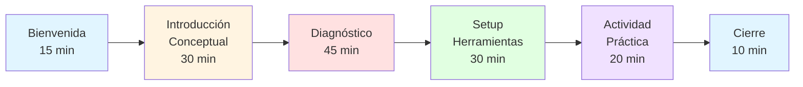

### Relación con el Programa del Módulo

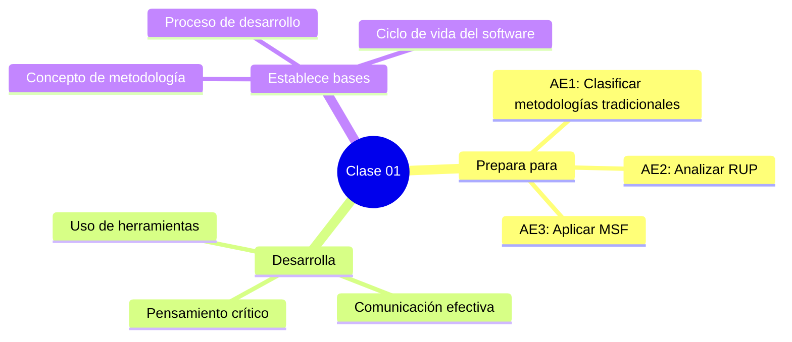

### Resultados Esperados

Al término de esta clase, el estudiante habrá:

- ✅ Comprendido qué es una metodología de desarrollo y por qué es necesaria
- ✅ Identificado problemas comunes en proyectos sin estructura
- ✅ Configurado su entorno de trabajo con draw.io
- ✅ Creado su primer diagrama de proceso
- ✅ Demostrado sus conocimientos previos mediante evaluación diagnóstica
- ✅ Establecido conexión entre teoría y práctica personal

---

## 📚 BLOQUE 1: Introducción al Módulo y Conceptos Fundamentales

**Duración:** 45 minutos  
**Modalidad:** Teórico-participativa

### 1.1 Encuadre del Módulo (15 minutos)

#### Presentación del Módulo

**Pregunta inicial:**

> "¿Alguien ha estado en un proyecto que se salió de control? ¿Un trabajo en equipo donde nadie sabía quién hacía qué?"

**Contexto:**

Este módulo es sobre **cómo construir software de manera organizada, predecible y exitosa**. No es solo teoría abstracta, es lo que separa a los equipos profesionales de los amateurs.

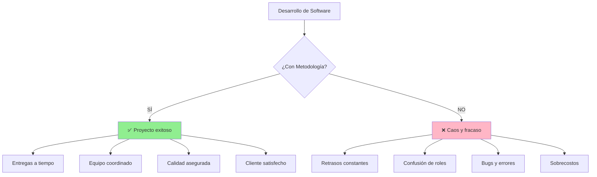

#### Estructura del Módulo

**Cronograma de 8 semanas:**

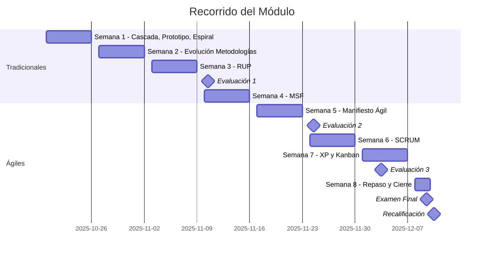

**Sistema de evaluaciones**

| Evaluación | Fecha | Contenido                  | Ponderación |
| ---------- | ----- | -------------------------- | ----------- |
| Eval 1     | 10/11 | Metodologías Tradicionales | 25%         |
| Eval 2     | 24/11 | Manifiesto Ágil + SCRUM    | 25%         |
| Eval 3     | 03/12 | XP + Kanban                | 25%         |
| Examen     | 09/12 | Integración completa       | 25%         |
| Recal.     | 10/12 | (Si aplica)                | Según regl. |

**Herramientas que usaremos:**

- 🎨 **draw.io** - Para diagramas de flujo y modelado UML
- 🎨 **Figma** - Para diseño de interfaces, wireframes y prototipado visual
- 📝 **Markdown** - Para documentación técnica estructurada
- 🔧 **Jira** - Para gestión ágil de proyectos (próximas semanas)
- 💻 **GitHub** (opcional) - Para versionado de documentación

---

### 1.2 Actividad de Enganche: "El Proyecto del Desastre" (30 minutos)

#### Objetivos de la actividad:

- Conectar con experiencias previas de los estudiantes
- Visualizar problemas reales de falta de metodología
- Generar interés genuino por el tema

#### 🎯 Caso de Estudio: Healthcare.gov (2013)

**Contexto:**

En 2013, el gobierno de Estados Unidos lanzó Healthcare.gov, el portal web para el sistema de salud del país. El proyecto costó **$500 millones de dólares** y fue un desastre total en su lanzamiento.

**Datos del fracaso:**

- Presupuesto: $500 millones USD
- Tiempo de desarrollo: 3 años
- Equipos involucrados: 55 contratistas diferentes
- Resultado: El sitio se caía constantemente, solo 6 personas lograron inscribirse el primer día
- Se esperaban 50,000 usuarios simultáneos, pero colapsó con 2,000

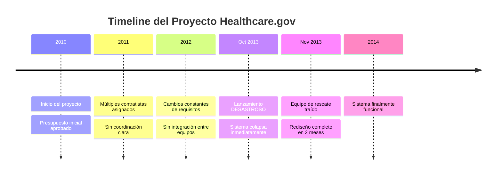

#### Dinámica de Análisis (20 minutos)

**Fase 1: Lluvia de Ideas Individual (5 min)**

- Cada estudiante anota en su cuaderno: "¿Qué creen que salió mal?"
- Pensar en al menos 3 problemas

**Fase 2: Discusión Grupal (10 min)**

Compartir las ideas en plenario. Principales problemas detectados:

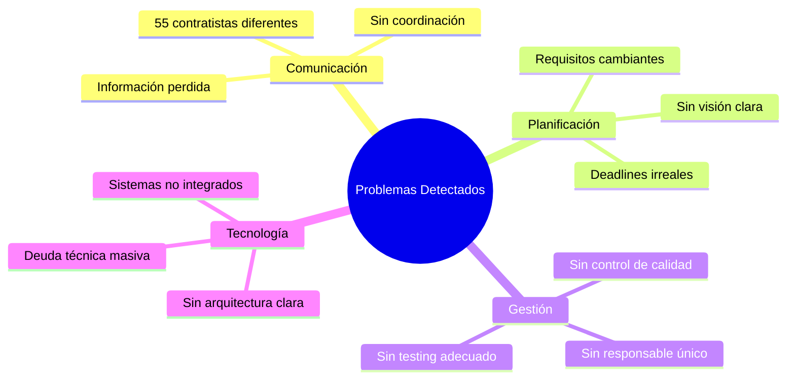

**Fase 3: La Revelación (5 min)**

> "¿Qué tienen en común todos estos problemas?"
>
> **Respuesta:** Falta de METODOLOGÍA

Explicar:

- No tenían un proceso claro de cómo trabajar
- Cada equipo hacía las cosas a su manera
- No había coordinación ni estándares
- No había forma de medir progreso real

**Transición al concepto:**

> "Esto es exactamente lo que vamos a aprender a evitar. Las metodologías de desarrollo son el antídoto contra el caos."

---

### 1.3 Concepto Fundamental: ¿Qué es una Metodología? (10 minutos)

#### Definición

**Metodología de Desarrollo de Software:**

> Un conjunto estructurado y sistemático de **prácticas, procesos, técnicas y herramientas** que guían a los equipos en la creación de software de calidad.

Es como una **receta** o un **manual de instrucciones** para construir software de manera predecible y exitosa.

#### Componentes de una Metodología

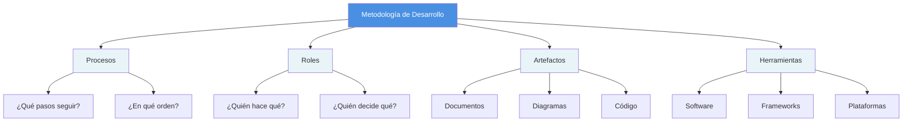

#### ¿Por qué son importantes?

**Analogía práctica:**

Imaginen construir un edificio sin planos, sin asignar quién hace qué, sin saber en qué orden hacer las cosas. ¿Qué pasaría?

**En software es igual:**

| Sin Metodología                    | Con Metodología            |
| ---------------------------------- | -------------------------- |
| 😰 Caos y confusión                | ✅ Claridad y orden        |
| 🔥 Apagar incendios constantemente | 📋 Planificación proactiva |
| ❓ "¿Quién hace esto?"             | 👥 Roles claros            |
| 🎲 Calidad aleatoria               | 🎯 Calidad asegurada       |
| 💸 Sobrecostos                     | 💰 Presupuesto controlado  |
| ⏰ Retrasos                        | ⌚ Entregas predecibles    |

#### Panorama General: Dos Grandes Familias

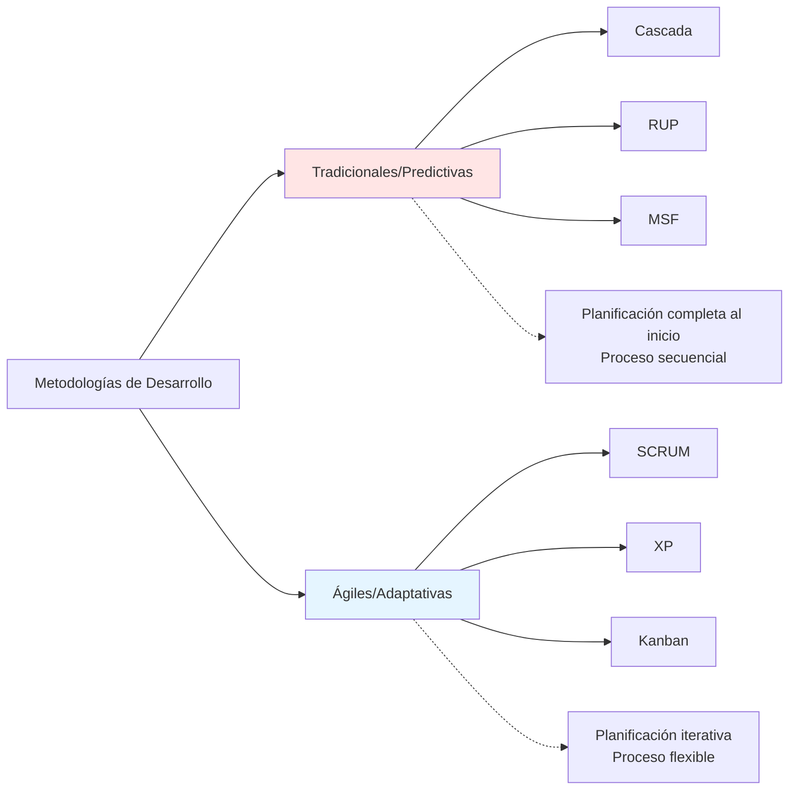

**Mensaje clave:**

> "No hay metodología 'mejor' o 'peor'. Cada una sirve para diferentes contextos. Aprenderemos cuándo usar cada una."

---

### Cierre del Bloque 1

**Recapitulación (2 minutos):**

Hasta ahora hemos visto:

- ✅ Por qué este módulo es importante (caso Healthcare.gov)
- ✅ Qué es una metodología y para qué sirve
- ✅ Qué pasa cuando NO usamos metodologías
- ✅ Panorama general de lo que aprenderemos

---

## 📝 BLOQUE 2: Evaluación Diagnóstica

**Duración:** 45 minutos  
**Modalidad:** Individual - Preguntas de desarrollo

### Objetivo del Diagnóstico

Esta evaluación nos permitirá conocer:

- Tus conocimientos previos sobre desarrollo de software
- Tu experiencia con trabajo en equipo y proyectos
- Tus expectativas sobre el módulo
- El punto de partida para adaptar el curso a tus necesidades

**Importante:**

- No hay respuestas correctas o incorrectas
- Es confidencial y no tiene calificación
- Sé honesto en tus respuestas
- Si no sabes algo, escribe "No lo sé" o "No estoy seguro"

---

### Instrucciones

1. Copia las preguntas en un documento (Word, Google Docs, o block de notas)
2. Responde cada pregunta con tus propias palabras
3. No hay límite de extensión, pero trata de ser claro y conciso
4. Tiempo estimado: 35-40 minutos
5. Guarda el archivo con el formato: `Diagnostico_TuNombre_Apellido.pdf` o `.docx`
6. Envíalo según las indicaciones del profesor

---

### Preguntas de Desarrollo

#### 1. Experiencia con Proyectos (5 puntos)

Describe un proyecto (académico, personal o laboral) en el que hayas participado:

- ¿Cuál era el objetivo del proyecto?
- ¿Cuántas personas participaron?
- ¿Cómo se organizaron para trabajar?
- ¿Qué problemas enfrentaron durante el desarrollo?
- ¿Cómo los resolvieron (o no los resolvieron)?

---

#### 2. Proceso de Desarrollo (5 puntos)

Cuando tienes que hacer un trabajo de programación (o cualquier proyecto técnico):

- ¿Qué pasos sigues desde que recibes el encargo hasta que lo entregas?
- ¿Planificas antes de empezar a programar? ¿Cómo?
- ¿Documentas tu trabajo? ¿De qué forma?
- ¿Haces pruebas de tu código? ¿Cuándo y cómo?

---

#### 3. Trabajo en Equipo (5 puntos)

Basándote en tu experiencia trabajando en equipo:

- ¿Qué es lo más difícil de trabajar con otras personas en proyectos técnicos?
- ¿Cómo se han repartido las tareas en proyectos anteriores?
- ¿Han usado alguna herramienta para organizarse? ¿Cuál(es)?
- ¿Qué harías diferente en tu próximo proyecto en equipo?

---

#### 4. Conceptos Previos (5 puntos)

Explica con tus propias palabras qué entiendes por los siguientes términos (si no conoces alguno, escribe "No lo conozco"):

- **Ciclo de vida del software:**
- **Requisitos de software:**
- **Pruebas (testing):**
- **Documentación técnica:**
- **Sprint (en el contexto de desarrollo):**

---

#### 5. Metodologías (5 puntos)

- ¿Has escuchado hablar de metodologías de desarrollo de software? ¿Cuáles?
- ¿Conoces términos como "ágil", "SCRUM", "cascada"? ¿Qué sabes de ellos?
- ¿Has trabajado siguiendo algún proceso o metodología específica? Descríbela brevemente.
- Si no conoces ninguna metodología, ¿cómo crees que un equipo grande (50+ personas) podría organizarse para desarrollar una aplicación compleja?

---

#### 6. Herramientas y Tecnologías (5 puntos)

- ¿Qué herramientas has usado para diagramar o diseñar (draw.io, Figma, PowerPoint, etc.)?
- ¿Has usado herramientas de gestión de proyectos o tareas (Trello, Jira, Notion, etc.)? ¿Cuáles?
- ¿Conoces Markdown? ¿Lo has usado?
- ¿Has trabajado con control de versiones (Git/GitHub)? ¿En qué nivel?
- ¿Qué otras herramientas técnicas dominas o has usado?

---

#### 7. Expectativas y Motivación (5 puntos)

- ¿Qué esperas aprender en este módulo de Metodologías de Desarrollo de Software?
- ¿Por qué crees que es importante aprender sobre metodologías?
- ¿Qué te gustaría que incluyéramos en el curso que consideres relevante para tu formación?
- ¿En qué tipo de empresa o rol te gustaría trabajar cuando termines tu carrera?
- ¿Tienes alguna pregunta o inquietud sobre el módulo?

---

### Reflexión Final (Opcional - 5 minutos)

Después de responder las preguntas y pensar en tus experiencias previas:

- ¿Qué te gustaría mejorar en tu forma de trabajar en proyectos?
- ¿Qué habilidad o conocimiento crees que te hace falta desarrollar más?

---

### Formato de Entrega

```
Nombre del archivo: Diagnostico_Nombre_Apellido.pdf (o .docx)

Contenido mínimo:
- Tu nombre completo
- Fecha
- Las 7 preguntas con tus respuestas
- (Opcional) Reflexión final
```

---

**💡 Recordatorio:**

Esta evaluación diagnóstica es una herramienta para conocerte mejor como estudiante y adaptar el curso. No te preocupes si no conoces algunos términos o conceptos, ¡para eso estamos aquí! Lo importante es tu honestidad y disposición para aprender.

---

## 🛠️ BLOQUE 3: Configuración del Entorno de Trabajo

**Duración:** 30 minutos  
**Modalidad:** Práctica guiada

### Objetivo del Bloque

Configurar las herramientas que usaremos durante todo el módulo para:

- Crear diagramas de procesos y metodologías
- Documentar nuestro trabajo
- Modelar flujos y sistemas

---

### 3.1 Mermaid - Diagramación con Código (15 minutos)

**¿Qué es Mermaid?**

Mermaid es una herramienta que permite crear diagramas usando código de texto simple. Es como escribir "recetas" para que el navegador dibuje automáticamente diagramas profesionales.

**Ventajas de Mermaid:**

- ✅ Se escribe con texto plano (fácil de versionar en Git)
- ✅ Se integra perfectamente con Markdown
- ✅ No requiere mouse, solo escribir
- ✅ Los diagramas son consistentes y profesionales
- ✅ Gratis y de código abierto

**Ejemplo básico:**

Código Mermaid:

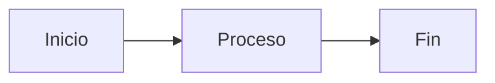

Esto genera automáticamente un diagrama de flujo.

#### Tipos de Diagramas que Usaremos

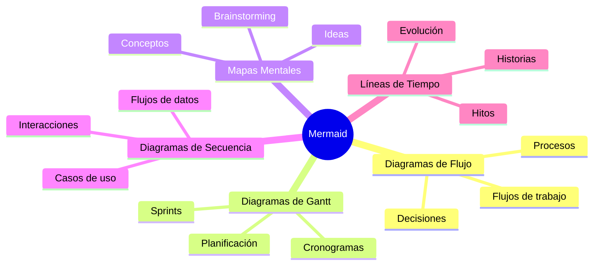

#### Práctica Guiada: Tu Primer Diagrama Mermaid

**Herramienta online para practicar:** [Mermaid Live Editor](https://mermaid.live/)

**Ejercicio 1: Diagrama de Flujo Simple**

Vamos a crear un diagrama que represente "Cómo hago un café":

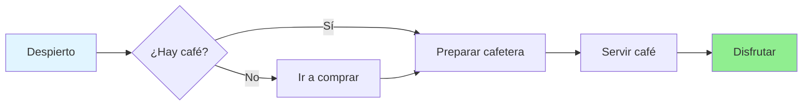

**Tu turno:** Copia este código en [Mermaid Live Editor](https://mermaid.live/) y modifícalo para representar otro proceso simple (ej: "Cómo llego a clases", "Cómo hago un trabajo").

**Ejercicio 2: Mapa Mental**

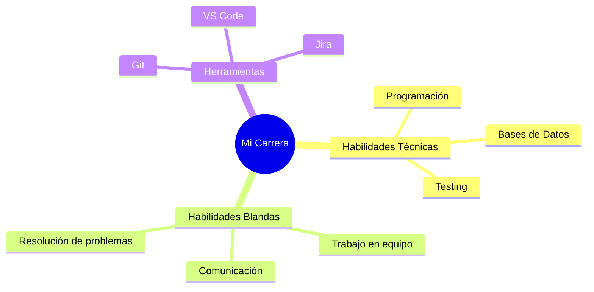

**Tu turno:** Crea un mapa mental sobre "Qué espero de este módulo" con al menos 3 ramas principales.

#### Recursos de Mermaid

- 📚 [Documentación oficial](https://mermaid.js.org/)
- 🎮 [Editor online](https://mermaid.live/)
- 📖 [Ejemplos y tutoriales](https://mermaid.js.org/intro/)

---

### 3.2 Draw.io - Alternativa Visual (10 minutos)

**¿Cuándo usar draw.io?**

Draw.io (también llamado diagrams.net) es una alternativa visual para cuando:

- Necesitas diagramas más complejos visualmente
- Prefieres arrastrar y soltar en lugar de código
- Necesitas diagramas UML muy detallados
- Estás aprendiendo y Mermaid te resulta difícil al inicio

#### Configuración Rápida

1. **Opción 1: Online (Recomendada)**

   - Ir a [app.diagrams.net](https://app.diagrams.net/)
   - Elegir dónde guardar (Google Drive, OneDrive, o Device)
   - ¡Listo para usar!

2. **Opción 2: Extensión VS Code**
   - Buscar "Draw.io Integration" en extensiones de VS Code
   - Instalar
   - Crear archivos `.drawio` directamente en tu proyecto

#### Ejercicio Rápido con draw.io

**Tarea:** Recrear el diagrama "Cómo hago un café" pero usando draw.io

1. Abrir [app.diagrams.net](https://app.diagrams.net/)
2. Seleccionar "Blank Diagram"
3. Usar las formas básicas del panel izquierdo:
   - Rectángulo para procesos
   - Rombo para decisiones
   - Flechas para flujo
4. Guardar como `mi_primer_diagrama.drawio`

**Comparación:**

| Aspecto              | Mermaid ⭐                    | draw.io                        |
| -------------------- | ----------------------------- | ------------------------------ |
| Velocidad            | Rápido (una vez que aprendes) | Más lento (arrastrar y soltar) |
| Versionamiento       | Excelente (es texto)          | Difícil (archivos binarios)    |
| Colaboración         | Fácil (Git/GitHub)            | Requiere compartir archivos    |
| Curva de aprendizaje | Media (aprender sintaxis)     | Baja (visual e intuitivo)      |
| Flexibilidad visual  | Limitada                      | Muy alta                       |
| **Uso en el curso**  | **Principal**                 | **Alternativa/Apoyo**          |

---

### 3.3 Figma - Prototipado y Diseño de Interfaces (10 minutos)

**¿Qué es Figma?**

Figma es una herramienta de diseño colaborativo en la nube, ideal para:

- Crear wireframes (bocetos de interfaces)
- Diseñar interfaces de usuario (UI)
- Prototipar aplicaciones
- Colaborar en tiempo real con el equipo

**¿Por qué Figma en este módulo?**

En metodologías ágiles (especialmente en SCRUM y XP), necesitamos:

- Visualizar historias de usuario
- Crear mockups rápidos
- Prototipar antes de programar
- Comunicar ideas de diseño al equipo

#### Configuración de Figma

**Paso 1: Crear cuenta**

1. Ir a [figma.com](https://www.figma.com/)
2. Registrarse con correo institucional o Gmail
3. Seleccionar el plan gratuito (Starter)
4. ¡La versión gratuita es suficiente para el curso!

**Paso 2: Familiarización con la interfaz**

Elementos básicos:

- **Canvas:** Área de trabajo principal
- **Frames:** Contenedores (como páginas o pantallas)
- **Shapes:** Formas básicas (rectángulos, círculos, etc.)
- **Text:** Herramienta de texto
- **Prototype:** Modo para crear interacciones

#### Ejercicio Práctico: Tu Primera Pantalla

**Tarea:** Crear un wireframe simple de una pantalla de login

1. Abrir Figma y crear un nuevo archivo: "Mi Primer Wireframe"
2. Crear un Frame (seleccionar "Phone" → "iPhone 14 Pro")
3. Agregar elementos básicos:
   - Rectángulo para logo (arriba)
   - 2 rectángulos con texto para inputs (usuario y contraseña)
   - Rectángulo redondeado para botón "Iniciar sesión"
4. Usar texto para labels
5. Guardar el proyecto

**Ejemplo visual que crearás:**

```
┌─────────────────────┐
│                     │
│      [LOGO]         │
│                     │
│   ┌─────────────┐   │
│   │  Usuario    │   │
│   └─────────────┘   │
│                     │
│   ┌─────────────┐   │
│   │  Contraseña │   │
│   └─────────────┘   │
│                     │
│   ┌─────────────┐   │
│   │  Ingresar   │   │
│   └─────────────┘   │
│                     │
└─────────────────────┘
```

#### ¿Cuándo usar cada herramienta?

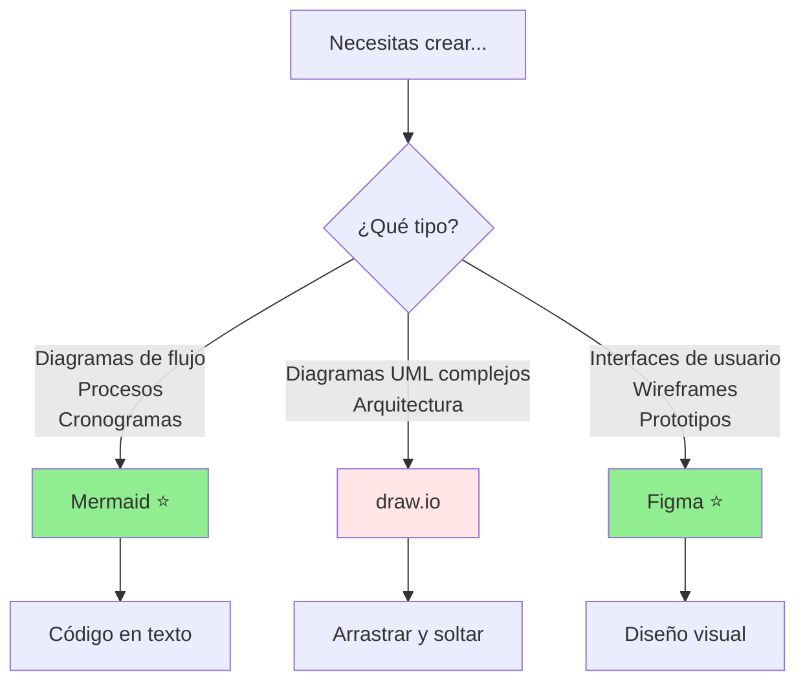

#### Recursos de Figma

- 📚 [Figma para principiantes](https://help.figma.com/hc/en-us/categories/360002051613-Get-started)
- 🎥 [YouTube: Figma en 15 minutos](https://www.youtube.com/results?search_query=figma+tutorial+español)
- 🎨 [Plantillas gratuitas](https://www.figma.com/community)
- 💡 Atajos de teclado se compartirán en clase

**Ventajas de Figma:**

- ✅ Colaboración en tiempo real (como Google Docs)
- ✅ Funciona en el navegador (no requiere instalación)
- ✅ Versionamiento automático
- ✅ Comentarios integrados
- ✅ Exportación a múltiples formatos

---

### 3.4 Markdown - Documentación Técnica (5 minutos)

**¿Qué es Markdown?**

Markdown es un lenguaje de marcado ligero para crear documentos con formato usando texto plano. Es el estándar de facto para documentación técnica.

**Ejemplos básicos:**

```markdown
# Título Principal

## Subtítulo

### Sub-subtítulo

**Texto en negrita**
_Texto en cursiva_

- Lista item 1
- Lista item 2

1. Lista numerada 1
2. Lista numerada 2

[Enlace](https://url.com)

`código en línea`

​`
bloque de código
​`
```

**¿Dónde lo usaremos?**

- Documentación de proyectos
- README de repositorios
- Notas de clase
- Especificaciones técnicas
- Este mismo documento está en Markdown

**Editor recomendado:**

- VS Code (con vista previa)
- Typora (editor visual)
- Cualquier editor de texto + navegador para ver preview

**Recursos:**

- [Guía Markdown en 5 minutos](https://commonmark.org/help/)
- [Markdown Cheatsheet](https://www.markdownguide.org/cheat-sheet/)

---

### Resumen del Bloque 3

**Has configurado:**

- ✅ Mermaid Live Editor para diagramas (herramienta principal)
- ✅ draw.io como alternativa visual para diagramas complejos
- ✅ Figma para wireframes y prototipado de interfaces
- ✅ Conceptos básicos de Markdown para documentación

**Siguiente paso:**

- Practicar creando tus propios diagramas en Mermaid
- Explorar la interfaz de Figma
- Familiarizarte con las tres herramientas
- Usar draw.io si Mermaid te resulta difícil al principio

**Tarea para casa:**

- Explorar los ejemplos en [Mermaid Live Editor](https://mermaid.live/)
- Crear al menos 2 diagramas simples (cualquier tema)
- Crear tu primera pantalla en Figma (login, home, o lo que prefieras)
- Revisar el Markdown Cheatsheet

---

## 🎨 BLOQUE 4: Actividad Práctica Integradora

**Duración:** 20 minutos  
**Modalidad:** Individual con reflexión grupal

### Objetivo de la Actividad

Aplicar los conceptos vistos y las herramientas aprendidas para:

- Reflexionar sobre tus procesos de trabajo actuales
- Practicar diagramación con Mermaid o draw.io
- Identificar áreas de mejora en tu metodología personal
- Preparar el terreno para las próximas clases

---

### 4.1 Actividad Individual: "Modelando Mi Proceso de Trabajo" (15 minutos)

#### Instrucciones

**Paso 1: Elige un proceso (2 min)**

Selecciona UNO de estos procesos que realizas habitualmente:

1. **Cómo haces un trabajo de programación**
   - Desde que recibes el encargo hasta que lo entregas
2. **Cómo estudias para un examen**
   - Desde que anuncian el examen hasta que lo presentas
3. **Cómo planificas y ejecutas un proyecto en equipo**
   - Desde la asignación hasta la entrega final
4. **Cualquier proceso repetitivo de tu carrera**
   - Hacer un informe técnico, resolver un problema de programación, etc.

**Paso 2: Modela tu proceso (10 min)**

Crea un diagrama de flujo usando **Mermaid** (recomendado) o **draw.io** que muestre:

✅ **Punto de inicio claro** - ¿Dónde empieza tu proceso?  
✅ **Pasos que sigues** - ¿Qué haces en orden?  
✅ **Decisiones que tomas** - ¿Qué preguntas te haces en el camino?  
✅ **Alternativas cuando algo falla** - ¿Qué haces si algo sale mal?  
✅ **Punto final** - ¿Cuándo consideras que terminaste?

**Preguntas guía para ayudarte:**

- ¿Qué es lo primero que haces?
- ¿En qué momento tomas decisiones importantes?
- ¿Qué haces cuando encuentras un problema o error?
- ¿Hay pasos que repites varias veces?
- ¿Cómo sabes que ya terminaste?

#### Ejemplo de referencia

**Proceso: "Cómo hago un trabajo de programación"**

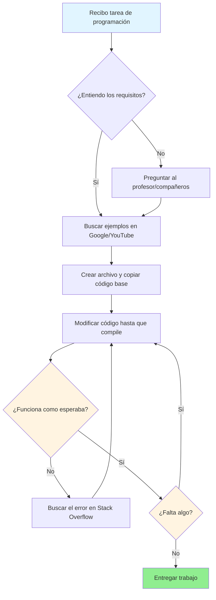

**Tu diagrama puede ser más simple o más complejo, lo importante es que refleje TU proceso real.**

**Paso 3: Reflexiona (3 min)**

Observa tu diagrama y responde mentalmente:

- ¿Hay pasos que podrías mejorar?
- ¿Falta alguna etapa importante (como testing, documentación, revisión)?
- ¿Es un proceso ordenado o más bien caótico?
- ¿Qué pasaría si tuvieras que explicarle este proceso a otra persona?

---

### 4.2 Reflexión Grupal (5 minutos)

**Dinámica de compartir:**

- 2-3 estudiantes voluntarios comparten su diagrama en pantalla
- Cada uno explica brevemente su proceso (1-2 min)
- El grupo identifica: ¿Qué está bien? ¿Qué podría mejorar?

**Preguntas clave para la discusión:**

> "Ahora que ves tu proceso en un diagrama, ¿qué cambiarías?"

> "¿Notaste algún paso que haces pero que no sabías que hacías?"

> "¿Tu proceso es repetible? ¿Otra persona podría seguirlo?"

**Conexión con el módulo:**

Al finalizar, reflexionar:

- Lo que acaban de hacer (modelar un proceso) es el **primer paso para crear una metodología**
- Las metodologías profesionales son esencialmente esto: **procesos bien definidos y documentados**
- En las próximas clases veremos cómo grandes equipos han formalizado estos procesos (Cascada, RUP, SCRUM, etc.)

---

### Entregable (Opcional)

Si deseas guardar tu trabajo:

1. **Si usaste Mermaid:**

   - Copiar el código en un archivo `.md`
   - Guardar como `mi_proceso_trabajo.md`

2. **Si usaste draw.io:**

   - Guardar como `mi_proceso_trabajo.drawio`
   - Exportar también como imagen (PNG)

3. **Compartir (opcional):**
   - Puedes compartir tu diagrama en el espacio del curso
   - Útil para comparar procesos entre compañeros

---

### ¿Qué aprendiste en esta actividad?

Al completar esta actividad, has:

- ✅ Aplicado diagramación para modelar procesos reales
- ✅ Reflexionado sobre tu metodología personal de trabajo
- ✅ Identificado fortalezas y áreas de mejora en tu proceso
- ✅ Practicado con Mermaid o draw.io en un contexto real
- ✅ Entendido que todos seguimos "metodologías" (aunque no sean formales)

**Insight clave:**

> "Incluso sin saberlo, ya usas una metodología (tu forma de trabajar). Lo que aprenderemos en este módulo es cómo hacer esas metodologías más eficientes, colaborativas y profesionales."

---

## 🎬 BLOQUE 5: Cierre y Próximos Pasos

**Duración:** 10 minutos  
**Modalidad:** Plenario

### 5.1 Recapitulación de la Clase (5 minutos)

**Lo que vimos hoy:**

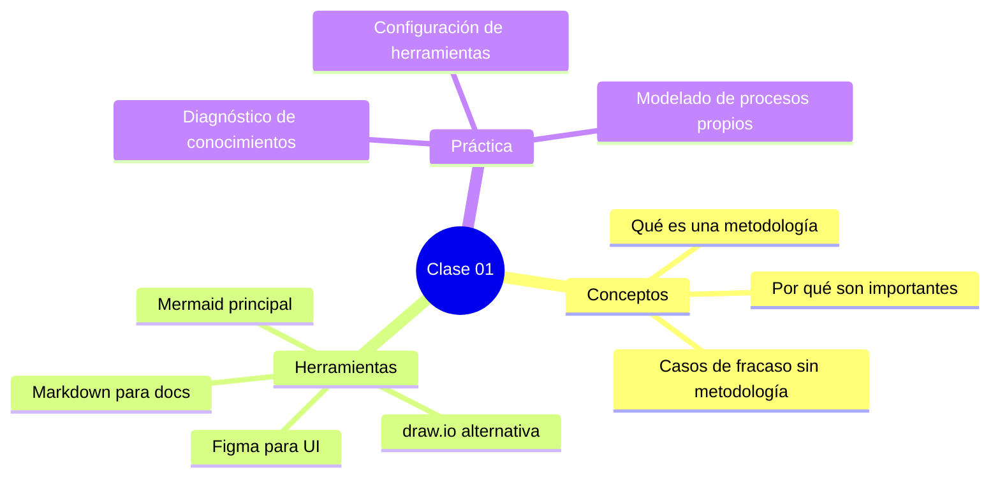

**Preguntas de verificación:**

- ¿Qué es una metodología de desarrollo de software?
- ¿Cuáles son las dos grandes familias de metodologías?
- ¿Cuál es nuestra herramienta principal para diagramas?
- ¿Qué aprendiste sobre tu propio proceso de trabajo?

---

### 5.2 Vista Previa: Próxima Clase (3 minutos)

**Martes 21 de octubre - Sesión 02:**

📘 **Tema:** Ciclo de Vida del Software y Fases de Desarrollo

**Lo que veremos:**

- ¿Qué es el ciclo de vida del software (SDLC)?
- Fases universales: Análisis, Diseño, Implementación, Pruebas, Mantenimiento
- Diferencias entre desarrollo ad-hoc y desarrollo con metodología
- Introducción a las metodologías tradicionales

**Prepárate:**

- Haber completado el diagnóstico (si no lo enviaste hoy)
- Tener Mermaid Live Editor en favoritos
- Pensar: ¿Qué fases sigues cuando programas algo?

---

### 5.3 Trabajo Autónomo para la Próxima Clase (2 minutos)

**Tareas obligatorias:**

1. **📝 Enviar diagnóstico** (si no lo hiciste en clase)

   - Formato: `Diagnostico_Nombre_Apellido.pdf`
   - Plazo: Antes de la próxima clase

2. **🔍 Investigación previa:**
   - Buscar: "¿Qué es el ciclo de vida del software?"
   - Leer al menos un artículo o ver un video corto
   - Anotar tus dudas para la próxima clase

**Tareas opcionales (muy recomendadas):**

3. **🎨 Practicar herramientas:**

   - Crear 2 diagramas en Mermaid Live Editor (cualquier tema)
   - Hacer un wireframe simple en Figma
   - Explorar plantillas de la comunidad de Figma

4. **📚 Lectura complementaria:**

   - Caso Healthcare.gov: Buscar más detalles del caso
   - ¿Conoces otros proyectos de software que fracasaron? Investiga uno

5. **💭 Reflexión personal:**
   - Revisar tu diagrama del proceso de trabajo
   - Pensar: ¿Qué 3 cosas cambiarías en tu forma de trabajar?

---

### 5.4 Recordatorios Importantes

**📅 Fechas clave:**

- **Evaluación 1:** Lunes 10 de noviembre (Metodologías Tradicionales)
- **Evaluación 2:** Lunes 24 de noviembre (Manifiesto Ágil + SCRUM)
- **Evaluación 3:** Miércoles 3 de diciembre (XP + Kanban)
- **Examen Final:** Martes 9 de diciembre

**🔗 Enlaces útiles:**

- [Mermaid Live Editor](https://mermaid.live/)
- [Figma](https://www.figma.com/)
- [draw.io](https://app.diagrams.net/)
- [Markdown Guide](https://www.markdownguide.org/)

---

### 5.5 Mensaje Final

**¡Felicitaciones!** 🎉

Hoy diste el primer paso en un viaje de 8 semanas donde aprenderás cómo los profesionales construyen software de manera organizada y efectiva.

**Recuerda:**

- No hay metodología perfecta, solo la adecuada para cada contexto
- Aprender metodologías te hace más empleable y profesional
- Las herramientas son tus aliadas, no tus enemigas
- Cada clase construye sobre la anterior, ¡no te pierdas ninguna!

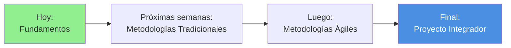

**Pregunta final:**

> ¿Alguna duda sobre lo visto hoy o sobre el módulo en general?

---

### 📝 Checklist de Salida

Antes de irte, asegúrate de:

- [ ] Haber completado (o estar trabajando en) el diagnóstico
- [ ] Tener cuenta en Figma (o saber cómo crearla)
- [ ] Conocer Mermaid Live Editor
- [ ] Haber creado al menos un diagrama hoy
- [ ] Tener claras las tareas para la próxima clase
- [ ] Saber las fechas de las evaluaciones

---

## 🎯 Resumen Final de la Clase 01

| Bloque    | Tema                                   | Duración               | Completado |
| --------- | -------------------------------------- | ---------------------- | ---------- |
| 1         | Introducción y Conceptos Fundamentales | 45 min                 | ✅         |
| 2         | Evaluación Diagnóstica                 | 45 min                 | ✅         |
| 3         | Configuración de Herramientas          | 40 min                 | ✅         |
| 4         | Actividad Práctica Integradora         | 20 min                 | ✅         |
| 5         | Cierre y Próximos Pasos                | 10 min                 | ✅         |
| **TOTAL** |                                        | **160 min (2h 40min)** | ✅         |

---

**¡Nos vemos en la próxima clase!** 👋

---
