# Clase 02 - Semana 01 - Metodologías de Desarrollo de Software

- Unidad 01: Metodologías de Desarrollo Tradicionales
- Fecha: Martes 21 de Octubre de 2025
- Duración: 2 horas (8:30 - 10:30)
- Docente: Diego Obando

## 🎯 Objetivos de la Clase

Al finalizar esta sesión, los estudiantes serán capaces de:

### Objetivos de Aprendizaje

1. **Comprender** el concepto de Ciclo de Vida del Desarrollo de Software (SDLC) y su importancia
2. **Identificar** las fases universales del desarrollo de software presentes en todas las metodologías
3. **Analizar** las diferencias entre desarrollo ad-hoc (caótico) y desarrollo estructurado
4. **Aplicar** el modelo SDLC para analizar proyectos reales y personales
5. **Reconocer** cómo diferentes contextos (startup, empresa grande, software crítico) adaptan el SDLC

### Objetivos Transversales (Competencias)

- **Análisis:** Descomponer el proceso de desarrollo en fases específicas
- **Pensamiento crítico:** Evaluar las consecuencias de omitir fases del SDLC
- **Comunicación:** Explicar procesos técnicos de forma estructurada
- **Aplicación práctica:** Relacionar conceptos teóricos con experiencia personal

### Flujo de la Clase

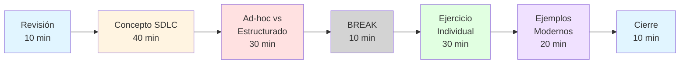

### Relación con el Programa del Módulo

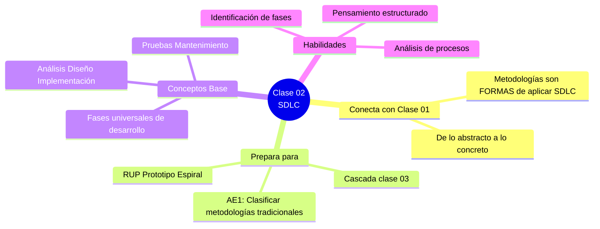

### Resultados Esperados

Al término de esta clase, el estudiante habrá:

- ✅ Comprendido qué es el SDLC y por qué es el "esqueleto" de todas las metodologías
- ✅ Identificado las 5 fases universales y su propósito
- ✅ Analizado las diferencias entre desarrollo caótico y estructurado
- ✅ Aplicado el modelo SDLC a un proyecto personal
- ✅ Reconocido cómo varía el SDLC según el contexto
- ✅ Preparado el terreno para entender Cascada (Clase 03)

### Conexión con Clase Anterior

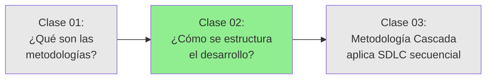

**De la Clase 01 aprendimos:**

- Qué es una metodología
- Por qué son necesarias
- Casos de fracaso sin metodología

**Hoy aprenderemos:**

- El proceso universal que todas las metodologías comparten
- Las fases que SIEMPRE están presentes (aunque varíe el orden o duración)
- Por qué NO se puede omitir ninguna fase

**En la Clase 03 veremos:**

- Cómo la metodología Cascada aplica este SDLC de forma secuencial
- Ventajas y desventajas de este enfoque

---

## 🔄 BLOQUE 1: Revisión y Conexión con Clase Anterior

**Duración:** 10 minutos  
**Modalidad:** Repaso interactivo

### 1.1 Bienvenida y Contexto (2 minutos)

**Buenos días a todos.**

Ayer comenzamos nuestro viaje en el mundo de las metodologías de desarrollo de software. Hoy vamos a profundizar en algo fundamental: **el proceso que está detrás de TODAS las metodologías**.

**Pregunta para pensar:**

> Cuando construyes algo (una casa, un mueble, una receta), ¿sigues pasos? ¿Cuáles?

---

### 1.2 Repaso Express de Clase 01 (5 minutos)

**¿Qué vimos ayer?**

Hagamos un repaso rápido con preguntas:

1. **¿Qué es una metodología de desarrollo de software?**

   - _Respuesta esperada:_ Un conjunto estructurado de prácticas, procesos y herramientas para desarrollar software de manera organizada

2. **¿Recuerdan el caso Healthcare.gov?**

   - _Respuesta esperada:_ $500 millones, 55 contratistas, sin coordinación → Desastre total

3. **¿Cuál fue la lección principal?**

   - _Respuesta esperada:_ La falta de metodología lleva al caos y fracaso

4. **¿Cuáles son las dos grandes familias de metodologías?**
   - _Respuesta esperada:_ Tradicionales (predictivas/secuenciales) y Ágiles (adaptativas/iterativas)

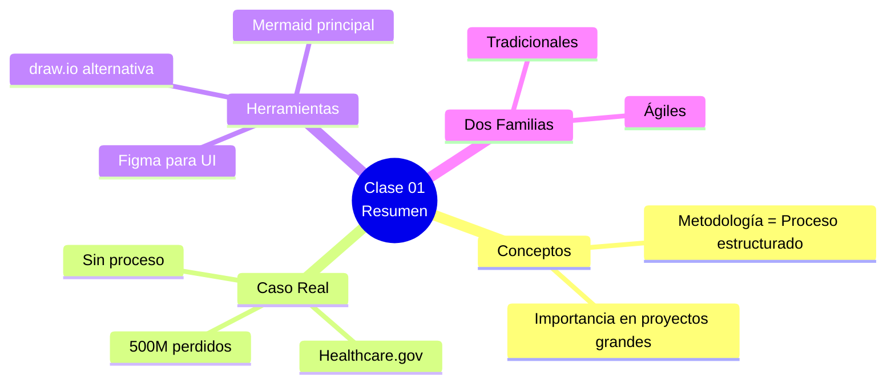

---

### 1.3 Conexión: De los Procesos Personales al SDLC (3 minutos)

**Actividad de ayer:** Modelaron su proceso de trabajo personal

**Pregunta para el grupo:**

> "¿Alguien quiere compartir brevemente qué descubrió al modelar su proceso? ¿Notaron pasos que se repetían?"

**Mostrar 2 ejemplos rápidos** (si los tienes o crear uno genérico):

**Ejemplo 1: Proceso típico de un estudiante**

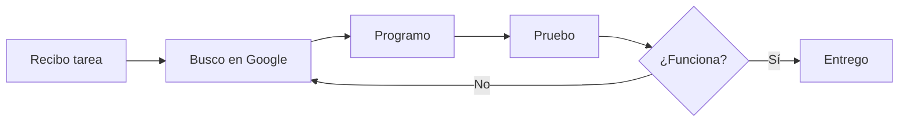

**Ejemplo 2: Proceso de otro estudiante**

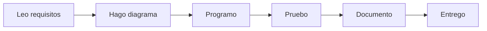

**Observación clave:**

> "¿Notaron que ambos tienen pasos similares? **Leer/entender**, **planificar/diseñar**, **programar**, **probar**, **entregar**. Estos pasos no son casualidad."

**Transición al tema de hoy:**

> "Resulta que estos pasos que descubrieron en sus procesos personales son **universales** en el desarrollo de software. Hoy vamos a formalizar esto: se llama **Ciclo de Vida del Desarrollo de Software** o **SDLC**."

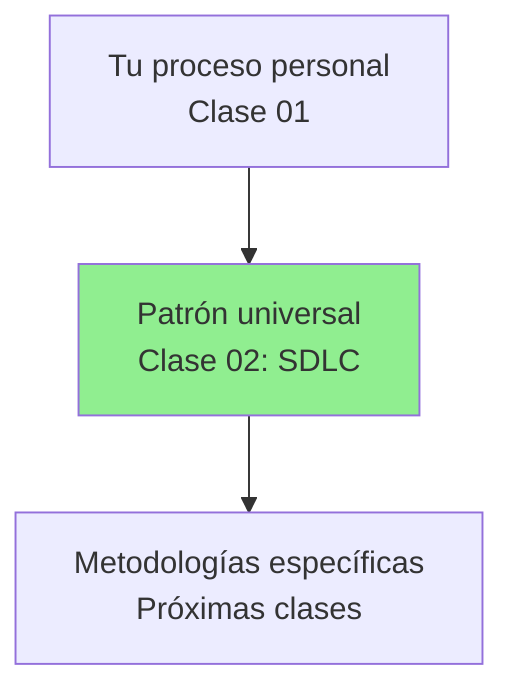

---

### Mensaje de Transición

**Hoy responderemos estas preguntas:**

- ¿Cuáles son las fases que TODOS los proyectos de software deben seguir?
- ¿Por qué no podemos saltarnos ninguna?
- ¿Qué pasa cuando lo hacemos "ad-hoc" (sin estructura)?
- ¿Cómo adaptan estas fases diferentes tipos de proyectos?

**¡Empecemos!**

---

## 📖 BLOQUE 2: El Ciclo de Vida del Desarrollo de Software (SDLC)

**Duración:** 40 minutos  
**Modalidad:** Expositiva con ejemplos prácticos

### 2.1 ¿Qué es el SDLC? (15 minutos)

#### Definición

**SDLC = Software Development Life Cycle**

> El Ciclo de Vida del Desarrollo de Software es un **marco de trabajo conceptual** que describe las **etapas involucradas en el desarrollo de software**, desde la concepción inicial hasta el retiro del sistema.

**Características principales:**

- ✅ Es **universal** - Aplica a TODO tipo de software
- ✅ Es **estructurado** - Tiene fases claramente definidas
- ✅ Es **cíclico** - Se repite (por eso se llama "ciclo")
- ✅ Es **flexible** - Puede adaptarse según el proyecto
- ✅ Es el **esqueleto** que todas las metodologías comparten

#### ¿Por qué se llama "Ciclo"?

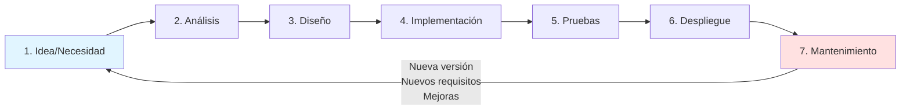

**Se llama "ciclo" porque:**

- El software NO se construye una vez y se olvida
- Siempre hay nuevas versiones, mejoras, correcciones
- Cuando termina el mantenimiento, vuelves a analizar nuevos requisitos
- Es un proceso **continuo y evolutivo**

**Ejemplo real:**

- WhatsApp versión 1.0 (2009): Solo mensajes de texto
- Cada año: Nuevo ciclo → análisis de nuevas features → diseño → implementación → pruebas → lanzamiento
- 2025: Videollamadas, estados, pagos, IA, etc.
- El ciclo nunca termina mientras la app exista

#### Historia Breve (Contexto)

**¿De dónde surge el SDLC?**

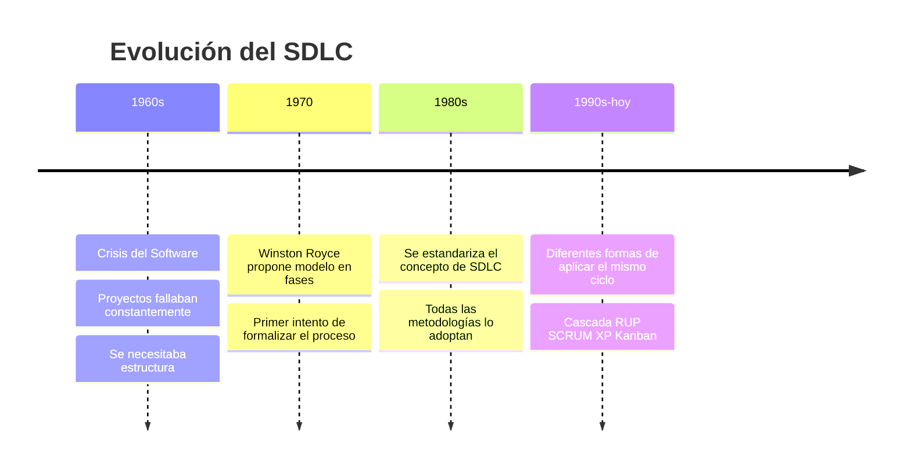

**Mensaje clave:**

> "En los años 60, los proyectos de software fallaban tanto que lo llamaron 'La Crisis del Software'. La solución fue estructurar el proceso en fases. Ese es el origen del SDLC."

#### El SDLC es como...

**Analogías para entender mejor:**

| Construir Software | Es como...            | Fases similares                                                            |
| ------------------ | --------------------- | -------------------------------------------------------------------------- |
| SDLC               | Construir una casa    | Planos → Cimientos → Construcción → Inspección → Entrega → Mantenimiento   |
| SDLC               | Cocinar un platillo   | Receta → Preparación → Cocción → Prueba de sabor → Servir → Guardar sobras |
| SDLC               | Producir una película | Guión → Storyboard → Filmación → Edición → Estreno → Distribución          |

**Observación:**

> "En todos estos casos, hay fases que NO puedes saltarte. ¿Qué pasa si construyes una casa sin planos? ¿O cocinas sin saber la receta?"

---

### 2.2 Las Fases Universales del SDLC (25 minutos)

Todas las metodologías incluyen estas fases (aunque varíe el orden, duración o nombres):

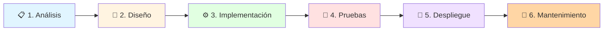

---

#### Fase 1: 📋 Análisis de Requisitos

**¿Qué es?**

> Entender y documentar QUÉ necesita el software hacer (no CÓMO lo hará).

**Preguntas clave:**

- ¿Qué problema estamos resolviendo?
- ¿Quiénes son los usuarios?
- ¿Qué funcionalidades necesitan?
- ¿Qué limitaciones tenemos (tiempo, presupuesto, tecnología)?

**Actividades típicas:**

- Entrevistas con clientes/usuarios
- Documentación de requisitos funcionales y no funcionales
- Historias de usuario
- Casos de uso
- Definición de alcance

**Ejemplo real - Netflix:**

```
Requisito: "Los usuarios deben poder ver videos en streaming"
- Funcional: Reproducir, pausar, adelantar, retroceder
- No funcional: Máximo 2 segundos de carga, funcionar en 4K
- Restricción: Compatible con Smart TVs, móviles, navegadores
```

**Artefactos (documentos que se crean):**

- 📄 Documento de requisitos
- 📝 Historias de usuario
- 🎯 Casos de uso
- 📊 Análisis de viabilidad

**Duración típica:** 10-20% del proyecto

**¿Qué pasa si la saltamos?**

- ❌ Construimos lo que NO se necesita
- ❌ Expectativas desalineadas con el cliente
- ❌ Cambios constantes (costosos) durante desarrollo

---

#### Fase 2: 🎨 Diseño

**¿Qué es?**

> Planificar CÓMO vamos a construir el software para cumplir los requisitos.

**Preguntas clave:**

- ¿Qué arquitectura usaremos?
- ¿Cómo se verán las pantallas?
- ¿Cómo se estructurará la base de datos?
- ¿Qué tecnologías emplearemos?

**Tipos de diseño:**

1. **Diseño de Arquitectura** (Alto nivel)

   - Componentes principales del sistema
   - Cómo se comunican entre sí
   - Tecnologías y frameworks

2. **Diseño de Interfaz (UI/UX)**

   - Wireframes y mockups
   - Flujo de navegación
   - Experiencia de usuario

3. **Diseño de Base de Datos**

   - Tablas y relaciones
   - Modelo entidad-relación
   - Índices y optimización

4. **Diseño Detallado**
   - Clases y métodos
   - Algoritmos específicos
   - Diagramas UML

**Ejemplo real - Instagram:**

```
Requisito: "Subir y compartir fotos"

Diseño de arquitectura:
- Frontend: React Native (móvil)
- Backend: API REST en Python
- Base de datos: PostgreSQL para datos, AWS S3 para imágenes
- CDN para distribución global

Diseño de UI:
- Pantalla principal: Feed infinito de fotos
- Botón central: Cámara/subir foto
- Filtros: Panel deslizante inferior
```

**Artefactos:**

- 🏗️ Diagrama de arquitectura
- 🎨 Wireframes y mockups (Figma)
- 🗄️ Modelo de base de datos
- 📐 Diagramas UML (clases, secuencia, etc.)

**Duración típica:** 15-20% del proyecto

**¿Qué pasa si la saltamos?**

- ❌ Arquitectura caótica e imposible de escalar
- ❌ Código espagueti difícil de mantener
- ❌ Reescrituras constantes (pérdida de tiempo)

---

#### Fase 3: ⚙️ Implementación (Desarrollo)

**¿Qué es?**

> Escribir el código que materializa el diseño.

**Preguntas clave:**

- ¿Qué lenguajes de programación usamos?
- ¿Cómo organizamos el código?
- ¿Qué estándares seguimos?
- ¿Cómo versionamos el código?

**Actividades típicas:**

- Escribir código (backend, frontend, móvil)
- Configurar entornos de desarrollo
- Integración de componentes
- Code reviews
- Control de versiones (Git)

**Buenas prácticas durante implementación:**

- ✅ Seguir estándares de código (clean code)
- ✅ Documentar el código (comentarios, README)
- ✅ Hacer commits frecuentes y descriptivos
- ✅ Revisar código entre pares (peer review)
- ✅ Escribir tests unitarios mientras programas

**Ejemplo real - Spotify:**

```
Requisito: "Reproducir música en streaming"
Diseño: Arquitectura de microservicios
Implementación:
- Servicio de autenticación (Java)
- Servicio de reproducción (C++)
- Servicio de recomendaciones (Python + ML)
- App móvil (React Native)
- API Gateway (Node.js)
```

**Artefactos:**

- 💻 Código fuente
- 📦 Librerías y dependencias
- 🔧 Scripts de configuración
- 📚 Documentación técnica

**Duración típica:** 30-40% del proyecto

**Nota importante:**

> Esta es la fase más visible, pero NO es la única importante. Un error común es pensar que "programar = desarrollo de software". ¡Es solo una fase del ciclo!

**¿Qué pasa si solo nos enfocamos en esta fase?**

- ❌ Código sin dirección clara (por falta de análisis)
- ❌ Código mal estructurado (por falta de diseño)
- ❌ Bugs no detectados (por falta de pruebas)

---

#### Fase 4: 🧪 Pruebas (Testing)

**¿Qué es?**

> Verificar que el software funciona correctamente y cumple los requisitos.

**Preguntas clave:**

- ¿El software hace lo que debe hacer?
- ¿Funciona en diferentes escenarios?
- ¿Hay bugs o errores?
- ¿Es seguro y confiable?

**Tipos de pruebas:**

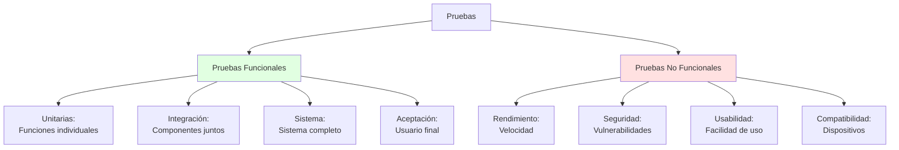

**Pirámide de Testing:**

```
        /\
       /  \      Pocos tests
      / UI \     Lentos, caros
     /------\
    /        \
   / Integration\ Moderados
  /------------\
 /              \
/  Unit Tests   \ Muchos tests
/________________\ Rápidos, baratos
```

**Ejemplo real - Uber:**

```
Requisito: "Pedir un viaje desde la app"

Pruebas unitarias:
- ✓ Función calcularTarifa(distancia, tiempo) devuelve precio correcto

Pruebas de integración:
- ✓ App móvil se conecta correctamente con el servidor
- ✓ Sistema de pagos procesa transacciones

Pruebas de sistema:
- ✓ Flujo completo: Solicitar → Esperar → Abordar → Pagar

Pruebas de aceptación:
- ✓ Usuario real puede pedir un viaje sin problemas

Pruebas de rendimiento:
- ✓ Sistema maneja 10,000 solicitudes simultáneas
```

**Artefactos:**

- 📋 Casos de prueba
- 🐛 Reportes de bugs
- ✅ Resultados de tests automatizados
- 📊 Cobertura de código

**Duración típica:** 20-25% del proyecto

**¿Qué pasa si la saltamos?**

- ❌ Bugs en producción (usuarios frustrados)
- ❌ Pérdida de confianza y reputación
- ❌ Costos mucho mayores (arreglar bugs en producción es 10x más caro)
- ❌ Posibles problemas de seguridad

---

#### Fase 5: 🚀 Despliegue (Deployment)

**¿Qué es?**

> Poner el software en producción para que los usuarios finales puedan usarlo.

**Preguntas clave:**

- ¿Dónde se desplegará? (servidores, cloud, tiendas de apps)
- ¿Cómo migraremos los datos?
- ¿Cómo entrenaremos a los usuarios?
- ¿Qué plan de rollback tenemos si algo falla?

**Actividades típicas:**

- Configurar servidores de producción
- Migración de datos
- Instalación en tiendas (Google Play, App Store)
- Capacitación de usuarios
- Documentación de usuario final
- Plan de contingencia

**Estrategias de despliegue:**

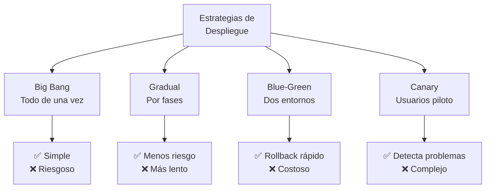

**Ejemplo real - Facebook:**

```
Requisito: "Lanzar nueva feature de Reels"

Estrategia: Canary Deployment
1. Semana 1: Lanzar a 1% de usuarios (solo en USA)
2. Semana 2: Si funciona bien, expandir a 10%
3. Semana 3: 50% de usuarios
4. Semana 4: 100% global

Si algo falla → Rollback inmediato
```

**Artefactos:**

- 📦 Paquetes instalables
- 📖 Manual de usuario
- 🔧 Scripts de despliegue
- 📝 Guías de instalación

**Duración típica:** 5-10% del proyecto

**¿Qué pasa si lo hacemos mal?**

- ❌ Downtime (servicio caído)
- ❌ Pérdida de datos
- ❌ Usuarios sin saber cómo usar el sistema
- ❌ Problemas de configuración en producción

---

#### Fase 6: 🔧 Mantenimiento

**¿Qué es?**

> Mantener el software funcionando y actualizado después del lanzamiento.

**Tipos de mantenimiento:**

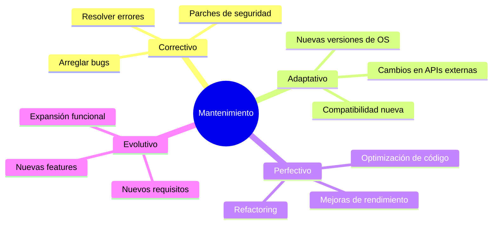

**Actividades típicas:**

- Monitoreo de sistemas
- Respuesta a incidentes
- Corrección de bugs reportados
- Actualizaciones de seguridad
- Optimización de rendimiento
- Atención a soporte técnico

**Estadística importante:**

> El mantenimiento representa el **60-80% del costo total** del software durante su vida útil.

**Ejemplo real - WhatsApp:**

```
Lanzamiento inicial: 2009
Mantenimiento continuo:
- 2010: Corrección de bugs de conectividad
- 2011: Adaptación a iOS 5
- 2013: Nuevas features (llamadas de voz)
- 2016: Cifrado end-to-end (seguridad)
- 2020: Videollamadas grupales (evolutivo)
- 2023: Canales y IA (evolutivo)
- 2024-2025: Adaptación a nuevas versiones de Android/iOS
```

**Artefactos:**

- 🐛 Tickets de bugs
- 📊 Reportes de monitoreo
- 🔄 Registro de cambios (changelog)
- 📈 Métricas de uso

**Duración típica:** Todo el tiempo que el software esté activo (años, décadas)

**¿Qué pasa si no hay mantenimiento?**

- ❌ Software obsoleto e inseguro
- ❌ Bugs acumulados que frustran usuarios
- ❌ Incompatibilidad con nuevas tecnologías
- ❌ Eventual muerte del producto

---

### 2.3 Resumen Visual de las Fases (5 minutos)

**El SDLC completo:**

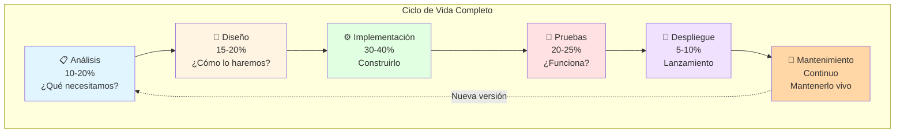

**Tabla resumen:**

| Fase              | Pregunta Principal | Duración Típica | Artefacto Principal     | ¿Qué pasa si se omite?  |
| ----------------- | ------------------ | --------------- | ----------------------- | ----------------------- |
| 📋 Análisis       | ¿QUÉ necesitamos?  | 10-20%          | Documento de requisitos | Software incorrecto     |
| 🎨 Diseño         | ¿CÓMO lo haremos?  | 15-20%          | Arquitectura y mockups  | Código caótico          |
| ⚙️ Implementación | Construir          | 30-40%          | Código fuente           | Nada que probar         |
| 🧪 Pruebas        | ¿Funciona?         | 20-25%          | Casos de prueba         | Bugs en producción      |
| 🚀 Despliegue     | Lanzar             | 5-10%           | Sistema en producción   | Usuarios no pueden usar |
| 🔧 Mantenimiento  | Mantener           | Continuo        | Actualizaciones         | Software obsoleto       |

**Mensaje clave final:**

> "Todas las fases son interdependientes. Omitir una es como construir una casa sin cimientos o sin techo. Cada fase prepara la siguiente y valida la anterior."

---

## ⚡ BLOQUE 3: Desarrollo Ad-hoc vs Desarrollo Estructurado

**Duración:** 30 minutos  
**Modalidad:** Comparativa con casos prácticos

### 3.1 ¿Qué es el Desarrollo "Ad-hoc"? (15 minutos)

#### Definición

**Desarrollo Ad-hoc** (también llamado "Cowboy Coding" o "Code and Fix")

> Es un enfoque de desarrollo de software **sin planificación, sin proceso estructurado y sin metodología**. Se programa directamente sin análisis previo, diseño o plan de pruebas.

**Características del desarrollo ad-hoc:**

- ❌ No hay análisis formal de requisitos
- ❌ Se programa sin diseño previo
- ❌ No hay documentación
- ❌ Las pruebas son inexistentes o mínimas
- ❌ Cambios constantes y desorganizados
- ❌ Cada desarrollador hace lo que quiere

#### El Ciclo del Caos

**Así se ve el desarrollo ad-hoc:**

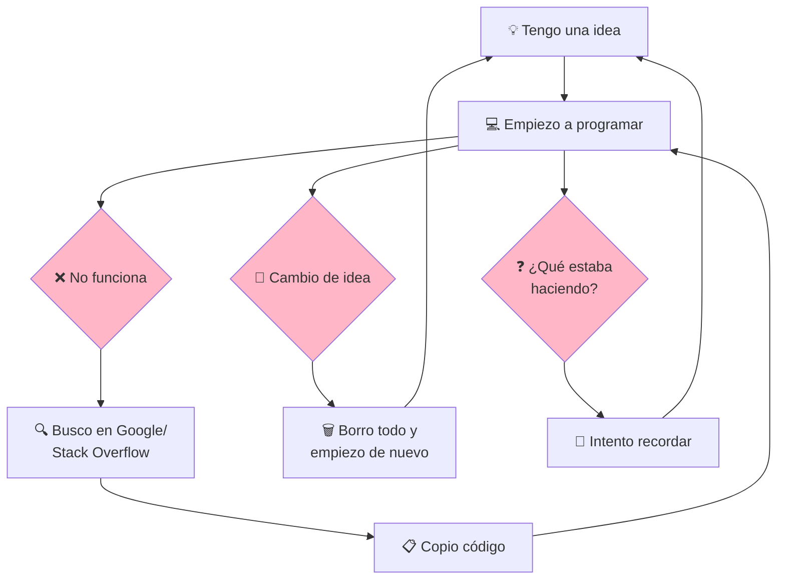

#### Caso de Estudio: Proyecto de Estudiante "Ad-hoc"

**Escenario:** Juan debe hacer un sistema de biblioteca como proyecto final

**Desarrollo Ad-hoc de Juan:**

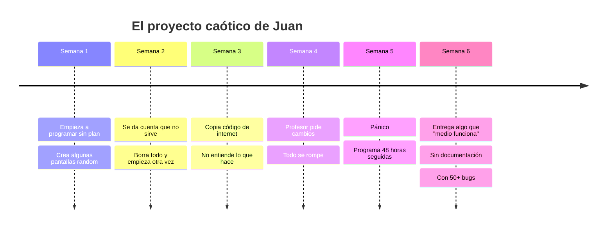

**Resultado:**

- ⏰ Entrega tarde
- 🐛 Lleno de bugs
- 📄 Sin documentación
- 😰 Estrés máximo
- 📉 Nota baja
- ❌ No puede explicar cómo funciona

#### Problemas Típicos del Desarrollo Ad-hoc

**1. El síndrome "Funciona en mi máquina"**

```
Desarrollador: "¡Funciona perfecto en mi laptop!"
Cliente: "En mi computadora no funciona"
Desarrollador: "🤷 Raro..."
```

**2. El código espagueti**

```python
# Código ad-hoc típico
def hacer_todo(x, y, z, usuario, datos, config, otro):
    if x:
        if y:
            if z:
                # 500 líneas de código mezclado
                # Nadie sabe qué hace esto
                pass
    else:
        # Más código confuso
        pass
```

**3. La deuda técnica acumulada**

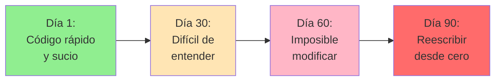

**4. El efecto dominó de cambios**

```
Cambio pequeño → Rompe 10 cosas → Arreglo 1 → Rompen 5 más → Ciclo infinito
```

#### Métricas del Desarrollo Ad-hoc

**Estudio real de proyectos caóticos:**

| Métrica                     | Desarrollo Ad-hoc | Desarrollo Estructurado |
| --------------------------- | ----------------- | ----------------------- |
| Tiempo de desarrollo        | 100% (baseline)   | 80%                     |
| Bugs en producción          | 10-15 por KLOC\*  | 1-2 por KLOC            |
| Tiempo de mantenimiento     | 300% más tiempo   | Baseline                |
| Probabilidad de éxito       | 28%               | 75%                     |
| Satisfacción del cliente    | Baja              | Alta                    |
| Rotación de desarrolladores | 45% anual         | 15% anual               |

\*KLOC = Mil líneas de código

#### ¿Cuándo "funciona" el desarrollo ad-hoc?

**Casos muy específicos donde puede ser aceptable:**

✅ **Prototipos desechables** (proof of concept de 1 día)  
✅ **Scripts personales de una sola vez** (automatización rápida)  
✅ **Experimentos de aprendizaje** (estás aprendiendo una tecnología nueva)  
✅ **Hackathons** (24 horas, objetivo es velocidad, no calidad)

**Pero NUNCA para:**
❌ Software de producción  
❌ Proyectos en equipo  
❌ Sistemas que crecerán  
❌ Software que se mantendrá

---

### 3.2 Desarrollo Estructurado con SDLC (15 minutos)

#### El Mismo Proyecto, Pero Bien Hecho

**Escenario:** María hace el mismo sistema de biblioteca, pero con SDLC

**Desarrollo estructurado de María:**

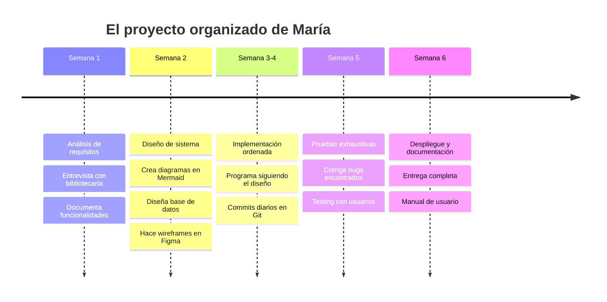

**Resultado:**

- ✅ Entrega a tiempo
- ✅ Funciona correctamente
- ✅ Bien documentado
- ✅ Código mantenible
- ✅ Nota excelente
- ✅ Puede explicar cada decisión

#### Comparación Visual: Ad-hoc vs SDLC

**El mismo proyecto, dos enfoques:**

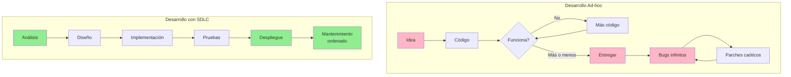

#### Beneficios Cuantificables del SDLC

**Retorno de Inversión (ROI) de usar SDLC:**

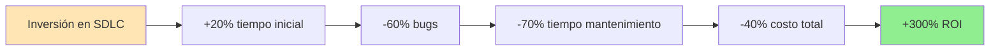

**Desglose de costos:**

```
Proyecto de 100 horas:

Ad-hoc:
- Desarrollo: 80 horas
- Correcciones: 40 horas
- Mantenimiento primer año: 100 horas
- Total: 220 horas

Con SDLC:
- Análisis: 10 horas
- Diseño: 15 horas
- Implementación: 40 horas
- Pruebas: 20 horas
- Despliegue: 5 horas
- Mantenimiento primer año: 30 horas
- Total: 120 horas

Ahorro: 100 horas (45%)
```

#### Caso Real: Boeing 787 Dreamliner

**Ejemplo de industria crítica:**

**Contexto:**

- Software para sistemas de vuelo
- Miles de componentes de software
- Equipos globales (40+ países)

**Si hubieran usado desarrollo ad-hoc:**

- ❌ Aviones cayendo del cielo
- ❌ Pérdida de vidas humanas
- ❌ Quiebra de la empresa

**Lo que hicieron (SDLC estricto):**

- ✅ Análisis exhaustivo de requisitos de seguridad
- ✅ Diseño certificado por autoridades de aviación
- ✅ Implementación con estándares DO-178C
- ✅ 10,000+ horas de pruebas
- ✅ Simulaciones antes del primer vuelo
- ✅ Mantenimiento continuo y actualizaciones

**Resultado:**

- ✅ Uno de los aviones más seguros del mundo
- ✅ Millones de pasajeros transportados
- ✅ Software crítico funcionando 24/7

#### Cuándo DEBES Usar SDLC

**Usa SDLC siempre que:**

✅ El proyecto durará más de 1 día  
✅ Trabajas en equipo  
✅ Otras personas usarán tu software  
✅ El código se mantendrá en el tiempo  
✅ Los requisitos son complejos  
✅ El fracaso tiene consecuencias  
✅ Hay dinero/negocio involucrado  
✅ Quieres ser un profesional

**En resumen: SIEMPRE en contextos profesionales**

---

### 3.3 Reflexión: Tu Experiencia Personal (5 minutos)

**Pregunta para reflexionar:**

> Piensa en tus proyectos anteriores. ¿Has trabajado ad-hoc o con estructura?

**Señales de que trabajaste ad-hoc:**

- [ ] Empezaste a programar sin saber bien qué hacer
- [ ] No hiciste diagramas o documentación
- [ ] Cambiaste de dirección múltiples veces
- [ ] Entregaste con bugs que descubriste después
- [ ] No puedes explicar por qué hiciste algo de cierta forma
- [ ] Si alguien más lee tu código, no entiende nada

**Señales de que usaste SDLC (aunque sea básico):**

- [ ] Escribiste qué necesitabas antes de programar
- [ ] Hiciste algún diagrama o boceto
- [ ] Probaste tu código antes de entregar
- [ ] Tienes comentarios o README explicando qué hace
- [ ] Otro puede entender y modificar tu código
- [ ] Sabes exactamente qué hace cada parte

**Mensaje de cierre:**

> "No se trata de ser perfecto, se trata de ser **intencional**. Cada proyecto es una oportunidad de mejorar tu proceso. Pasar de ad-hoc a SDLC es pasar de amateur a profesional."

```mermaid
graph LR
    A[Estudiante<br/>principiante] --> B[Usa ad-hoc<br/>sin saber]
    B --> C[Aprende SDLC]
    C --> D[Profesional<br/>competente]

    style A fill:#FFE5B4
    style B fill:#FFB6C6
    style C fill:#90EE90
    style D fill:#4A90E2,color:#fff
```

---

### 📊 Resumen del Bloque 3

**Lo que aprendimos:**

- ✅ El desarrollo ad-hoc es programar sin proceso ni planificación
- ✅ Puede funcionar para proyectos muy pequeños, pero es un desastre en proyectos reales
- ✅ El SDLC estructurado reduce costos, tiempo y errores significativamente
- ✅ En la industria profesional, SDLC no es opcional, es obligatorio
- ✅ Todos empezamos haciendo ad-hoc, la clave es evolucionar

**Próximo paso:**

En el siguiente bloque harás un ejercicio para aplicar el SDLC a un proyecto real.

---

**💡 BREAK (10 minutos)**

Es momento de tomar un descanso. Cuando volvamos, pondrás en práctica todo lo aprendido.

---

## 🎯 BLOQUE 4: Ejercicio Individual Guiado

**Duración:** 30 minutos  
**Modalidad:** Individual con compartir voluntario

### Objetivo del Ejercicio

Aplicar los conceptos del SDLC identificando fases en casos reales y analizando tu propio trabajo.

---

### 4.1 Identificación de Fases en Casos Reales (15 minutos)

#### Actividad: "¿En qué fase está cada actividad?"

Vamos a ver 3 casos de proyectos reales. Tu tarea es identificar a qué fase del SDLC pertenece cada actividad.

**Recuerda las 6 fases:**

1. 📋 Análisis
2. 🎨 Diseño
3. ⚙️ Implementación
4. 🧪 Pruebas
5. 🚀 Despliegue
6. 🔧 Mantenimiento

---

#### Caso A: Desarrollo de Instagram (2009-2010)

**Lee cada actividad e identifica la fase:**

| #   | Actividad                                                                              | ¿Qué fase? |
| --- | -------------------------------------------------------------------------------------- | ---------- |
| 1   | Kevin Systrom y Mike Krieger decidieron crear una app para compartir fotos con filtros | ?          |
| 2   | Determinaron que debía funcionar en iPhone, ser rápida y simple                        | ?          |
| 3   | Diseñaron la base de datos: tabla Users, tabla Photos, tabla Likes                     | ?          |
| 4   | Crearon wireframes de la interfaz: feed, cámara, perfil                                | ?          |
| 5   | Programaron en Objective-C el algoritmo del filtro "X-Pro II"                          | ?          |
| 6   | Construyeron el backend en Django/Python                                               | ?          |
| 7   | Probaron si las fotos se subían correctamente                                          | ?          |
| 8   | Testearon en diferentes modelos de iPhone                                              | ?          |
| 9   | Lanzaron la app en el App Store el 6 de octubre de 2010                                | ?          |
| 10  | Cada 2-3 semanas lanzan actualizaciones con mejoras y correcciones                     | ?          |

**Respuestas:**

| #   | Actividad                                             | Fase                                        |
| --- | ----------------------------------------------------- | ------------------------------------------- |
| 1   | Decidieron crear app para compartir fotos con filtros | 📋 **Análisis** (requisito principal)       |
| 2   | Determinaron características: iPhone, rápida, simple  | 📋 **Análisis** (requisitos no funcionales) |
| 3   | Diseñaron la base de datos                            | 🎨 **Diseño** (diseño de datos)             |
| 4   | Crearon wireframes de la interfaz                     | 🎨 **Diseño** (diseño de UI)                |
| 5   | Programaron algoritmo del filtro                      | ⚙️ **Implementación** (código)              |
| 6   | Construyeron el backend                               | ⚙️ **Implementación** (código)              |
| 7   | Probaron si las fotos se subían                       | 🧪 **Pruebas** (testing funcional)          |
| 8   | Testearon en diferentes iPhone                        | 🧪 **Pruebas** (testing de compatibilidad)  |
| 9   | Lanzaron en App Store                                 | 🚀 **Despliegue** (lanzamiento)             |
| 10  | Actualizaciones cada 2-3 semanas                      | 🔧 **Mantenimiento** (evolutivo)            |

**Observaciones importantes:**

- ✅ Siguieron el SDLC completo (por eso tuvieron éxito)
- ✅ No saltaron fases
- ✅ El diseño antes de programar evitó reescrituras
- ✅ Las pruebas antes del lanzamiento evitaron desastres

---

#### Caso B: WhatsApp - Feature de Videollamadas (2016)

**Contexto:** WhatsApp ya existía, pero querían agregar videollamadas.

| #   | Actividad                                                                  | ¿Qué fase? |
| --- | -------------------------------------------------------------------------- | ---------- |
| 1   | Encuestaron usuarios: "¿Quieren videollamadas?"                            | ?          |
| 2   | Definieron requisito: "Videollamadas de alta calidad, cifradas end-to-end" | ?          |
| 3   | Diseñaron el protocolo de transmisión de video                             | ?          |
| 4   | Decidieron usar WebRTC como tecnología base                                | ?          |
| 5   | Implementaron la UI del botón de videollamada                              | ?          |
| 6   | Programaron la lógica de conexión peer-to-peer                             | ?          |
| 7   | Probaron en redes lentas (2G, 3G)                                          | ?          |
| 8   | Beta testing con 10,000 usuarios seleccionados                             | ?          |
| 9   | Lanzamiento gradual: primero en Europa, luego global                       | ?          |
| 10  | Corrección de bugs reportados la primera semana                            | ?          |

**Respuestas:**

| #   | Actividad                                      | Fase                                                    |
| --- | ---------------------------------------------- | ------------------------------------------------------- |
| 1   | Encuestaron usuarios                           | 📋 **Análisis** (investigación de necesidades)          |
| 2   | Definieron requisito de videollamadas cifradas | 📋 **Análisis** (requisitos funcionales y de seguridad) |
| 3   | Diseñaron protocolo de transmisión             | 🎨 **Diseño** (arquitectura técnica)                    |
| 4   | Decidieron usar WebRTC                         | 🎨 **Diseño** (decisión tecnológica)                    |
| 5   | Implementaron UI del botón                     | ⚙️ **Implementación** (frontend)                        |
| 6   | Programaron lógica peer-to-peer                | ⚙️ **Implementación** (backend)                         |
| 7   | Probaron en redes lentas                       | 🧪 **Pruebas** (testing de rendimiento)                 |
| 8   | Beta testing con usuarios                      | 🧪 **Pruebas** (testing de aceptación)                  |
| 9   | Lanzamiento gradual                            | 🚀 **Despliegue** (estrategia canary)                   |
| 10  | Corrección de bugs                             | 🔧 **Mantenimiento** (correctivo)                       |

**Observaciones:**

- ✅ Incluso para una nueva feature, se sigue el SDLC completo
- ✅ El lanzamiento gradual (canary deployment) es parte del despliegue
- ✅ El mantenimiento empieza inmediatamente después del lanzamiento

---

#### Caso C: Sistema de Gestión Hospitalario

**Contexto:** Un hospital contrata una empresa para desarrollar un sistema de gestión de pacientes.

**Actividades mezcladas - Ordénalas por fase:**

```
A. Entrenar al personal médico en el uso del sistema
B. Programar el módulo de historias clínicas en Java
C. Entrevistar médicos, enfermeras y administrativos
D. Crear diagrama de base de datos con tablas: Pacientes, Citas, Medicamentos
E. Probar que el sistema funcione 24/7 sin caerse
F. Definir que el sistema debe registrar pacientes, agendar citas y gestionar inventario
G. Instalar servidores en el hospital y migrar datos
H. Crear mockups en Figma de las pantallas principales
I. Verificar que cumple normativas de protección de datos de salud
J. Responder a solicitudes de cambios de los usuarios después del lanzamiento
```

**Tu turno:** Clasifica cada actividad (A-J) en su fase correspondiente.

**Respuestas:**

| Fase                  | Actividades                                  |
| --------------------- | -------------------------------------------- |
| 📋 **Análisis**       | C (Entrevistas), F (Definir requisitos)      |
| 🎨 **Diseño**         | D (Diagrama de BD), H (Mockups en Figma)     |
| ⚙️ **Implementación** | B (Programar en Java)                        |
| 🧪 **Pruebas**        | E (Pruebas 24/7), I (Verificar normativas)   |
| 🚀 **Despliegue**     | G (Instalar y migrar), A (Entrenar personal) |
| 🔧 **Mantenimiento**  | J (Solicitudes de cambios)                   |

**Orden correcto del proyecto:**

1. C, F (Análisis)
2. D, H (Diseño)
3. B (Implementación)
4. E, I (Pruebas)
5. G, A (Despliegue)
6. J (Mantenimiento)

---

### 4.2 Análisis de Tu Propio Proyecto (15 minutos)

#### Actividad: "Analiza tu proyecto con la lente del SDLC"

Ahora es tu turno de aplicar el SDLC a tu propia experiencia.

**Instrucciones:**

1. Piensa en un proyecto que hayas hecho (o estés haciendo)
2. Completa la plantilla de análisis
3. Sé honesto - no hay respuestas correctas o incorrectas
4. El objetivo es tomar conciencia de tu proceso

---

#### Plantilla de Análisis SDLC

**Copia esta plantilla en tu cuaderno o documento:**

```markdown
# Análisis SDLC de Mi Proyecto

**Nombre del proyecto:** \***\*\*\*\*\*\*\***\_\***\*\*\*\*\*\*\***

**Descripción breve:** \***\*\*\*\*\*\*\***\_\***\*\*\*\*\*\*\***

---

## 📋 Fase 1: Análisis

**¿Qué hice? (marca lo que aplique)**

- [ ] Definí claramente qué necesitaba hacer
- [ ] Entrevisté/consulté al usuario/profesor/cliente
- [ ] Documenté los requisitos por escrito
- [ ] Investigué qué se necesitaba
- [ ] No hice análisis formal, empecé directo

**Tiempo invertido:** **\_** horas/días

**Comentario:**

---

---

## 🎨 Fase 2: Diseño

**¿Qué hice? (marca lo que aplique)**

- [ ] Hice diagramas o bocetos (papel, Mermaid, draw.io, Figma)
- [ ] Diseñé la base de datos (tablas, relaciones)
- [ ] Planifiqué la arquitectura (componentes, tecnologías)
- [ ] Diseñé las pantallas/interfaces
- [ ] No hice diseño, empecé a programar directo

**Tiempo invertido:** **\_** horas/días

**Comentario:**

---

---

## ⚙️ Fase 3: Implementación

**¿Qué hice? (marca lo que aplique)**

- [ ] Programé siguiendo el diseño que hice
- [ ] Programé sin plan claro, improvisando
- [ ] Usé control de versiones (Git)
- [ ] Documenté el código (comentarios, README)
- [ ] Seguí estándares de código limpio

**Tiempo invertido:** **\_** horas/días

**Comentario:**

---

---

## 🧪 Fase 4: Pruebas

**¿Qué hice? (marca lo que aplique)**

- [ ] Probé sistemáticamente cada funcionalidad
- [ ] Solo probé al final, antes de entregar
- [ ] Probé mientras programaba
- [ ] Otra persona probó mi código
- [ ] No probé, entregué y crucé los dedos

**Tiempo invertido:** **\_** horas/días

**Comentario:**

---

---

## 🚀 Fase 5: Despliegue

**¿Qué hice? (marca lo que aplique)**

- [ ] Lo desplegué/entregué correctamente
- [ ] Entregué con instrucciones de uso
- [ ] Solo envié el código/archivos
- [ ] Tuve problemas al entregar (no funcionaba en otra máquina)
- [ ] Nunca llegué a esta fase

**Tiempo invertido:** **\_** horas/días

**Comentario:**

---

---

## 🔧 Fase 6: Mantenimiento

**¿Qué pasó después? (marca lo que aplique)**

- [ ] Tuve que hacer correcciones de bugs
- [ ] Agregué features después de la entrega
- [ ] Nunca más lo toqué después de entregarlo
- [ ] Alguien más lo está usando/manteniendo
- [ ] El proyecto murió después de entregarlo

**Comentario:**

---

---

## 🤔 Reflexión Final

### 1. ¿Qué fase me faltó o hice mal?

---

### 2. ¿Qué haría diferente con lo que ahora sé sobre SDLC?

---

### 3. ¿Mi proyecto fue más ad-hoc o estructurado?

- [ ] 100% ad-hoc (puro freestyle)
- [ ] Mayormente ad-hoc (poco plan)
- [ ] Mitad y mitad (algo de estructura)
- [ ] Mayormente estructurado (buen proceso)
- [ ] 100% estructurado (SDLC completo)

### 4. Califica tu proceso de desarrollo (1-10):

**Mi calificación:** **\_** / 10

**¿Por qué esa calificación?**

---

### 5. ¿Qué aprendiste de este ejercicio?

---
```

---

### 4.3 Compartir Descubrimientos (5 minutos)

**Voluntarios (2-3 personas):**

Si te sientes cómodo, comparte brevemente:

- ¿Qué proyecto analizaste?
- ¿Qué descubriste sobre tu proceso?
- ¿Qué fase te faltó más?
- ¿Qué cambiarás en tu próximo proyecto?

**No hay juicio**, todos estamos aprendiendo. El objetivo es generar conciencia.

---

### 💡 Mensaje de Cierre del Bloque

**Lo que acabas de hacer es PODEROSO:**

> Ahora tienes una herramienta mental para analizar cualquier proyecto. Antes de empezar tu próximo trabajo, pregúntate: **"¿En qué fase estoy? ¿Qué viene después?"**

**No se trata de perfección, se trata de intencionalidad:**

```mermaid
graph LR
    A[Antes:<br/>Programar sin pensar] --> B[Ahora:<br/>Conciencia del proceso]
    B --> C[Futuro:<br/>Aplicar SDLC<br/>profesionalmente]

    style A fill:#FFB6C6
    style B fill:#FFE5B4
    style C fill:#90EE90
```

**Recuerda:**

- ✅ Todos empezamos haciendo ad-hoc
- ✅ Lo importante es evolucionar
- ✅ Cada proyecto es una oportunidad de mejorar
- ✅ El primer paso es tomar conciencia (✓ ya lo hiciste)

---

### 📊 Resumen del Bloque 4

**Lo que hiciste:**

- ✅ Identificaste fases del SDLC en proyectos reales (Instagram, WhatsApp, hospital)
- ✅ Analizaste tu propio proyecto con la lente del SDLC
- ✅ Tomaste conciencia de tus fortalezas y áreas de mejora
- ✅ Definiste qué cambiarás en tu próximo proyecto

**Próximo paso:**

Veremos cómo diferentes tipos de proyectos en la industria adaptan el SDLC según sus necesidades.

---

## 🌐 BLOQUE 5: Ejemplos Modernos y Variaciones del SDLC

**Duración:** 20 minutos  
**Modalidad:** Expositiva con casos comparativos

### Objetivo del Bloque

Entender cómo el SDLC se adapta según el tipo de proyecto, industria y contexto. El ciclo es el mismo, pero su aplicación varía.

---

### 5.1 El SDLC No Es "Talla Única" (3 minutos)

**Concepto clave:**

> El SDLC es como un **esqueleto universal**: todos los humanos tenemos el mismo esqueleto básico, pero hay diferencias en tamaño, proporciones y características según la persona. Lo mismo pasa con el SDLC.

**Todas las metodologías tienen el SDLC, pero:**

- ⏱️ La **duración** de cada fase varía
- 🔄 El **orden** puede cambiar (o hacerse en paralelo)
- 🔁 La **frecuencia** del ciclo es diferente
- 📊 El **énfasis** en ciertas fases cambia

```mermaid
graph TB
    A[SDLC Universal<br/>6 Fases] --> B[Cascada<br/>Secuencial<br/>6 meses]
    A --> C[SCRUM<br/>Iterativo<br/>2 semanas]
    A --> D[DevOps<br/>Continuo<br/>Diario]
    A --> E[RUP<br/>Fases solapadas<br/>3 meses]

    style A fill:#4A90E2,color:#fff
    style B fill:#FFE5E5
    style C fill:#E5F5FF
    style D fill:#E5FFE5
    style E fill:#F0E1FF
```

**Hoy veremos 3 ejemplos reales de cómo se aplica:**

---

### 5.2 Caso 1: Netflix - Desarrollo Continuo y Rápido (5 minutos)

#### Contexto de Netflix

**Tipo de empresa:** Plataforma de streaming global  
**Usuarios:** 250+ millones  
**Escala:** Miles de microservicios  
**Equipo:** 1000+ ingenieros  
**Filosofía:** "Velocidad + Innovación"

#### Cómo Netflix Aplica el SDLC

**Características principales:**

- 🚀 **Ciclos muy cortos:** 1-2 semanas por feature
- 🔄 **Despliegues continuos:** Varias veces al día
- 🤖 **Automatización extrema:** Todo automatizado
- 📊 **Experimentación constante:** A/B testing masivo

**El SDLC de Netflix:**

```mermaid
gantt
    title Ciclo SDLC de Netflix (1-2 semanas)
    dateFormat X
    axisFormat %H:%M

    section Sprint 2 semanas
    Análisis (Ideas + datos)     :a1, 0, 1d
    Diseño (Arquitectura)        :a2, after a1, 1d
    Implementación               :a3, after a2, 7d
    Pruebas automatizadas        :a4, after a2, 8d
    Despliegue gradual          :a5, after a3, 2d
    Monitoreo continuo          :a6, after a5, 14d
```

**Ejemplo real: "Función de Descarga"**

| Fase              | Cómo lo hace Netflix                              | Tiempo   |
| ----------------- | ------------------------------------------------- | -------- |
| 📋 Análisis       | Datos de usuarios muestran demanda de ver offline | 1 día    |
| 🎨 Diseño         | Arquitectura de almacenamiento local + DRM        | 2 días   |
| ⚙️ Implementación | Equipos paralelos: iOS, Android, Web              | 1 semana |
| 🧪 Pruebas        | Tests automatizados + Chaos Engineering           | Paralelo |
| 🚀 Despliegue     | Canary: 1% → 10% → 50% → 100%                     | 3 días   |
| 🔧 Mantenimiento  | Monitoreo 24/7, métricas en tiempo real           | Continuo |

**Características únicas:**

✅ **Chaos Engineering:** Rompen sus propios sistemas para probar resiliencia  
✅ **A/B Testing masivo:** Prueban múltiples versiones simultáneamente  
✅ **Freedom & Responsibility:** Equipos autónomos deciden  
✅ **"You build it, you run it":** Quien programa, mantiene

**Métricas de Netflix:**

- 🚀 **4000+ despliegues por día**
- ⚡ **Tiempo de ciclo:** 1-2 semanas
- 🧪 **Cobertura de tests:** 80%+
- 📊 **Tiempo de rollback:** < 5 minutos

---

### 5.3 Caso 2: Software Bancario - Desarrollo Riguroso y Controlado (5 minutos)

#### Contexto de Banca

**Tipo de empresa:** Banco multinacional (ej: Banco de Chile, Santander)  
**Criticidad:** Muy alta (dinero, seguridad)  
**Regulación:** Estricta (SBIF, leyes financieras)  
**Filosofía:** "Seguridad + Cumplimiento > Velocidad"

#### Cómo la Banca Aplica el SDLC

**Características principales:**

- 🐢 **Ciclos largos:** 6-12 meses por proyecto
- 🔒 **Seguridad extrema:** Múltiples capas de validación
- 📋 **Documentación exhaustiva:** Todo debe estar documentado
- ✅ **Auditorías constantes:** Cumplimiento normativo

**El SDLC Bancario:**

```mermaid
gantt
    title Ciclo SDLC Bancario (6-12 meses)
    dateFormat YYYY-MM-DD

    section Proyecto Anual
    Análisis exhaustivo          :a1, 2024-01-01, 60d
    Diseño detallado            :a2, after a1, 60d
    Implementación              :a3, after a2, 90d
    Pruebas múltiples niveles   :a4, after a3, 60d
    Auditoría y certificación   :a5, after a4, 30d
    Despliegue controlado       :a6, after a5, 15d
    Mantenimiento regulado      :a7, after a6, 365d
```

**Ejemplo real: "Sistema de Transferencias Internacionales"**

| Fase              | Cómo lo hace un Banco                       | Tiempo    |
| ----------------- | ------------------------------------------- | --------- |
| 📋 Análisis       | Requisitos legales + seguridad + usuarios   | 2 meses   |
| 🎨 Diseño         | Arquitectura + diseño de seguridad + DR     | 2 meses   |
| ⚙️ Implementación | Desarrollo con estándares PCI-DSS           | 3 meses   |
| 🧪 Pruebas        | Funcionales + Seguridad + Penetración + UAT | 2 meses   |
| 🚀 Despliegue     | Piloto → Producción con rollback plan       | 2 semanas |
| 🔧 Mantenimiento  | Soporte 24/7 + Auditorías trimestrales      | Años      |

**Características únicas:**

✅ **Análisis de riesgos:** Cada cambio se evalúa por impacto  
✅ **Disaster Recovery:** Plan B, C y D siempre listos  
✅ **Auditorías externas:** Terceros validan todo  
✅ **Rollback obligatorio:** Siempre hay forma de revertir  
✅ **Documentación legal:** Todo registrado para auditorías

**Tipos de pruebas en banca:**

```mermaid
graph TB
    A[Pruebas en Banca] --> B[Funcionales<br/>¿Hace lo correcto?]
    A --> C[Seguridad<br/>¿Es seguro?]
    A --> D[Penetración<br/>¿Lo puede hackear?]
    A --> E[Carga<br/>¿Aguanta tráfico?]
    A --> F[Cumplimiento<br/>¿Cumple leyes?]
    A --> G[UAT<br/>¿Usuarios conformes?]
    A --> H[Contingencia<br/>¿Funciona el plan B?]

    style C fill:#FFB6C6
    style D fill:#FFB6C6
    style H fill:#FFE5B4
```

**Métricas de Banca:**

- 🐢 **Tiempo de ciclo:** 6-12 meses
- 🔒 **Pruebas de seguridad:** 20-30% del tiempo total
- 📋 **Documentación:** 40% del esfuerzo
- 🎯 **Tasa de éxito:** 99.99% uptime requerido

---

### 5.4 Caso 3: Startup - MVP y Experimentación Rápida (5 minutos)

#### Contexto de Startup

**Tipo de empresa:** Startup tecnológica (ej: empresa nueva de delivery)  
**Recursos:** Limitados (3-5 personas)  
**Objetivo:** Validar idea rápido  
**Filosofía:** "Aprender + Iterar > Perfección"

#### Cómo una Startup Aplica el SDLC

**Características principales:**

- ⚡ **MVP primero:** Producto Mínimo Viable
- 🔄 **Pivotear rápido:** Cambiar dirección según feedback
- 💰 **Recursos limitados:** Hacer más con menos
- 📊 **Validación constante:** ¿Esto sirve?

**El SDLC de una Startup:**

```mermaid
gantt
    title Ciclo SDLC Startup (2-4 semanas para MVP)
    dateFormat X
    axisFormat %d

    section Sprint MVP
    Análisis lean (hipótesis)    :a1, 0, 2d
    Diseño mínimo (wireframes)   :a2, after a1, 2d
    Implementación rápida        :a3, after a2, 10d
    Pruebas básicas             :a4, after a3, 2d
    Despliegue beta             :a5, after a4, 1d
    Feedback y métricas         :a6, after a5, 7d
```

**Ejemplo real: "App de Delivery de Comida Local"**

| Fase              | Cómo lo hace una Startup                  | Tiempo    |
| ----------------- | ----------------------------------------- | --------- |
| 📋 Análisis       | Entrevistas a 20 personas + hipótesis     | 2 días    |
| 🎨 Diseño         | Wireframes en Figma + arquitectura simple | 3 días    |
| ⚙️ Implementación | MVP: Solo pedidos + pago + seguimiento    | 2 semanas |
| 🧪 Pruebas        | Testing manual + amigos/familia           | 2 días    |
| 🚀 Despliegue     | Lanzar en 1 barrio primero                | 1 día     |
| 🔧 Mantenimiento  | Iterar según feedback cada semana         | Continuo  |

**Enfoque "Build-Measure-Learn":**

```mermaid
graph LR
    A[💡 Idea/<br/>Hipótesis] --> B[🛠️ Build<br/>MVP rápido]
    B --> C[📊 Measure<br/>Métricas]
    C --> D[📚 Learn<br/>Insights]
    D --> E{¿Funciona?}
    E -->|Sí| F[🚀 Escalar]
    E -->|No| G[🔄 Pivotar]
    G --> A

    style E fill:#FFE5B4
    style F fill:#90EE90
    style G fill:#FFB6C6
```

**Características únicas:**

✅ **MVP sobre perfección:** "Hecho es mejor que perfecto"  
✅ **Deuda técnica aceptable:** Prioridad en validar  
✅ **Pivot rápido:** Cambiar sin miedo  
✅ **Métricas críticas:** Solo lo que importa  
✅ **Hacer más con menos:** Creatividad + recursividad

**¿Qué omiten inicialmente?**

- ⚠️ Documentación exhaustiva
- ⚠️ Escalabilidad extrema
- ⚠️ Features secundarias
- ⚠️ Optimizaciones prematuras

**Pero NO omiten:**

- ✅ Validación de la idea con usuarios reales
- ✅ Métricas básicas de uso
- ✅ Código funcional (aunque simple)
- ✅ Capacidad de iterar rápido

**Métricas de Startup:**

- ⚡ **Tiempo de MVP:** 2-4 semanas
- 🔄 **Frecuencia de deploy:** 2-3 veces por semana
- 📊 **Tiempo de pivoteo:** 1-2 meses si no funciona
- 💡 **Features por sprint:** 1-2 (enfoque)

---

### 5.5 Comparación de los 3 Casos (5 minutos)

**Tabla comparativa:**

| Aspecto            | Netflix                | Banca                    | Startup                  |
| ------------------ | ---------------------- | ------------------------ | ------------------------ |
| **Ciclo**          | 1-2 semanas            | 6-12 meses               | 2-4 semanas              |
| **Énfasis**        | Velocidad + Innovación | Seguridad + Cumplimiento | Validación + Aprendizaje |
| **Riesgo**         | Medio (no crítico)     | Muy bajo (cero errores)  | Alto (experimento)       |
| **Regulación**     | Baja                   | Muy alta                 | Baja                     |
| **Documentación**  | Mínima esencial        | Exhaustiva legal         | Solo lo necesario        |
| **Pruebas**        | Automatizadas          | Múltiples niveles        | Manual + básicas         |
| **Despliegue**     | Continuo (4000/día)    | Controlado (1-2/año)     | Frecuente (2-3/sem)      |
| **Cambios**        | Fáciles y rápidos      | Difíciles y lentos       | Muy fáciles (MVP)        |
| **Costo de error** | Bajo (frustración)     | Muy alto ($$$ legal)     | Bajo (aprendizaje)       |
| **Fase más larga** | Implementación         | Pruebas + Auditoría      | Implementación           |

**Visualización de duraciones:**

```mermaid
gantt
    title Comparación de Duraciones de SDLC
    dateFormat X
    axisFormat %s

    section Netflix (2 sem)
    Análisis: 0, 1
    Diseño: 1, 2
    Impl: 3, 7
    Pruebas: 3, 8
    Deploy: 10, 2

    section Banca (12 meses)
    Análisis: 0, 60
    Diseño: 60, 60
    Impl: 120, 90
    Pruebas: 210, 60
    Deploy: 270, 15

    section Startup (4 sem)
    Análisis: 0, 2
    Diseño: 2, 3
    Impl: 5, 14
    Pruebas: 19, 2
    Deploy: 21, 1
```

**Mensaje clave:**

> **El SDLC es el mismo esqueleto, pero cada contexto lo adapta a sus necesidades.** No existe "la mejor forma", existe "la forma adecuada para tu contexto".

**¿Qué determina la duración y estilo del SDLC?**

```mermaid
mindmap
  root((Factores que<br/>Determinan SDLC))
    Criticidad
      ¿Vidas en riesgo?
      ¿Dinero en juego?
      ¿Impacto social?
    Regulación
      Leyes aplicables
      Auditorías requeridas
      Certificaciones
    Recursos
      Tamaño del equipo
      Presupuesto
      Tiempo disponible
    Tipo de Software
      Web app
      Sistema crítico
      App móvil
      IoT
    Madurez
      Startup nueva
      Empresa establecida
      Proyecto legacy
```

---

### 5.6 Mensaje Final del Bloque (2 minutos)

**Lo importante de entender:**

1. **El SDLC es universal** - Todos tienen las mismas fases
2. **La aplicación varía** - Según contexto, necesidades y restricciones
3. **No hay receta única** - Cada proyecto encuentra su balance
4. **Las metodologías son herramientas** - Cascada, SCRUM, DevOps, etc. son formas de aplicar el SDLC

**Próximamente aprenderemos:**

- **Clase 03:** Metodología Cascada (SDLC secuencial estricto)
- **Clase 04+:** Prototipo, Espiral, RUP (variaciones tradicionales)
- **Semanas 5-7:** SCRUM, XP, Kanban (SDLC iterativo ágil)

```mermaid
graph TB
    A[Hoy:<br/>SDLC Universal] --> B[Próximas clases:<br/>Metodologías Tradicionales]
    B --> C[Luego:<br/>Metodologías Ágiles]
    C --> D[Final:<br/>Elegir la correcta<br/>para cada contexto]

    style A fill:#90EE90
    style D fill:#4A90E2,color:#fff
```

---

### 📊 Resumen del Bloque 5

**Lo que aprendimos:**

- ✅ El SDLC se adapta según el contexto (no es rígido)
- ✅ Netflix: Ciclos cortos, despliegue continuo, automatización
- ✅ Banca: Ciclos largos, seguridad extrema, documentación exhaustiva
- ✅ Startup: MVP rápido, experimentación, pivotear según feedback
- ✅ El contexto determina cómo aplicar el SDLC (criticidad, regulación, recursos)

**Próximo paso:**

Cierre de la clase y preparación para la próxima sesión donde veremos la metodología en Cascada.

---

## 🎯 BLOQUE 6: Cierre y Preparación para Próxima Clase

**Duración:** 10 minutos  
**Modalidad:** Recapitulación y asignación de tareas

### Objetivo del Bloque

Consolidar lo aprendido hoy y preparar el terreno para la próxima clase sobre Metodología en Cascada.

---

### 6.1 Recapitulación: ¿Qué Aprendimos Hoy? (5 minutos)

**Hagamos un recorrido rápido por la clase:**

```mermaid
graph LR
    A[Clase 02:<br/>SDLC] --> B[¿Qué es<br/>el SDLC?]
    B --> C[6 Fases<br/>Universales]
    C --> D[Ad-hoc vs<br/>Estructurado]
    D --> E[Ejercicio<br/>Práctico]
    E --> F[Ejemplos<br/>Modernos]

    style A fill:#4A90E2,color:#fff
    style C fill:#90EE90
    style F fill:#FFE5B4
```

#### Lo más importante de hoy:

**1. El SDLC es el esqueleto de todo proyecto de software**

> Sin importar la metodología, todos los proyectos pasan por: Análisis → Diseño → Implementación → Pruebas → Despliegue → Mantenimiento

**2. Las 6 fases son universales e insustituibles**

| Fase                  | Por qué NO se puede omitir             |
| --------------------- | -------------------------------------- |
| 📋 **Análisis**       | Sin esto, no sabes QUÉ construir       |
| 🎨 **Diseño**         | Sin esto, no sabes CÓMO construirlo    |
| ⚙️ **Implementación** | Sin esto, no existe el software        |
| 🧪 **Pruebas**        | Sin esto, entregas bugs y problemas    |
| 🚀 **Despliegue**     | Sin esto, nadie puede usar tu software |
| 🔧 **Mantenimiento**  | Sin esto, el software muere en meses   |

**3. Desarrollo ad-hoc vs estructurado:**

```mermaid
graph LR
    A[Estudiante:<br/>Ad-hoc] --> B[Profesional:<br/>SDLC estructurado]
    B --> C[Resultado:<br/>Software de calidad]

    style A fill:#FFB6C6
    style B fill:#90EE90
    style C fill:#4A90E2,color:#fff
```

- **Ad-hoc:** "Codificar y corregir" → Caos, bugs, mantenimiento imposible
- **Estructurado:** Seguir el SDLC → Orden, calidad, software mantenible

**4. El SDLC se adapta al contexto:**

- **Netflix:** Ciclos cortos (1-2 sem), despliegue continuo
- **Banca:** Ciclos largos (6-12 meses), seguridad extrema
- **Startup:** MVP rápido (2-4 sem), experimentación

**5. Las metodologías son formas de aplicar el SDLC:**

> **Cascada, SCRUM, XP, Kanban, DevOps** → Todas usan el SDLC, pero lo aplican diferente (secuencial, iterativo, continuo)

---

### 6.2 ¿Por Qué Todas las Fases Son Importantes? (2 minutos)

**Analogía final:**

Construir software sin el SDLC completo es como:

| Fase omitida           | Es como...                                 |
| ---------------------- | ------------------------------------------ |
| Sin **Análisis**       | Construir una casa sin saber para quién es |
| Sin **Diseño**         | Construir sin planos (improvisar cada día) |
| Sin **Implementación** | Tener solo planos pero ninguna casa        |
| Sin **Pruebas**        | Entregar casa sin revisar instalaciones    |
| Sin **Despliegue**     | Construir casa pero nadie puede entrar     |
| Sin **Mantenimiento**  | Casa se cae en 6 meses                     |

**Mensaje clave:**

```mermaid
mindmap
  root((SDLC<br/>Completo))
    Calidad
      Software funciona
      Pocos bugs
      Usuarios felices
    Mantenibilidad
      Código entendible
      Fácil de cambiar
      Documentado
    Profesionalismo
      Predecible
      Confiable
      Escalable
    Carrera
      Te diferencia
      Equipos te valoran
      Mejores proyectos
```

---

### 6.3 Conectando con la Próxima Clase (1 minuto)

**Hoy vimos:** El SDLC como concepto universal (las 6 fases que todos deben tener)

**Próxima clase veremos:** **Metodología en Cascada** - Una forma ESPECÍFICA de aplicar el SDLC

```mermaid
graph TB
    A[Hoy: SDLC<br/>Concepto Universal] --> B[Próxima clase:<br/>Metodología Cascada]
    B --> C[¿Qué es Cascada?]
    C --> D[SDLC aplicado<br/>de forma SECUENCIAL]
    D --> E[Fase 1 → termina<br/>Fase 2 → termina<br/>...]

    style A fill:#90EE90
    style B fill:#4A90E2,color:#fff
    style E fill:#FFE5B4
```

**¿Qué es Cascada?**

- Es el SDLC aplicado **secuencialmente**
- Cada fase termina **completamente** antes de empezar la siguiente
- **No hay vuelta atrás** (por eso se llama "cascada")
- Es la metodología más **tradicional** y **estructurada**

**Spoiler:** Cascada fue la primera metodología formal. Luego surgieron otras (Ágiles) precisamente porque Cascada tiene limitaciones. Pero es importante conocerla porque:

1. Muchos proyectos aún la usan (banca, gobierno, hardware)
2. Para entender por qué surgieron las metodologías ágiles
3. Algunos proyectos SÍ necesitan este enfoque secuencial

---

### 6.4 Tareas para la Próxima Clase (2 minutos)

#### 📝 Tarea 1: Completa tu Análisis de Proyecto Personal

**Retoma el template del Bloque 4:**

Si no terminaste de analizar tu proyecto personal con la lente del SDLC, es momento de completarlo. Usa el template de la sección 4.2 para reflexionar sobre:

- ¿Qué fases hiciste bien?
- ¿Cuáles omitiste o hiciste mal?
- ¿Qué cambiarías en tu próximo proyecto?

**Tiempo estimado:** 15-20 minutos  
**Entrega:** No es obligatorio entregar, pero te ayudará en la siguiente clase

---

#### 🔍 Tarea 2: Investigación - Metodología en Cascada

**Lee sobre la Metodología en Cascada:**

Busca información básica sobre:

1. ¿Qué es la Metodología en Cascada?
2. ¿Quién la creó y cuándo?
3. ¿Cómo se relaciona con el SDLC?
4. Encuentra UN ejemplo de proyecto que use Cascada

**Recursos sugeridos:**

- Wikipedia: "Modelo en cascada"
- Buscar: "Waterfall methodology ejemplo"
- Video YouTube: "Metodología Cascada explicada"

**Tiempo estimado:** 20 minutos  
**Entrega:** Anota tus hallazgos (te servirán en la próxima clase)

---

#### 💭 Tarea 3: Reflexión Crítica

**Piensa en estas preguntas:**

1. **Ventajas de hacer TODO Análisis → TODO Diseño → TODO Implementación (sin vuelta atrás):**
   - ¿Qué beneficios tiene terminar completamente una fase antes de la siguiente?
2. **Desventajas de NO poder volver atrás:**

   - ¿Qué pasa si descubres un error de análisis cuando ya estás implementando?

3. **¿En qué tipo de proyectos crees que funciona mejor?**
   - Proyectos grandes vs pequeños
   - Proyectos con requisitos claros vs inciertos

**No hay respuestas correctas o incorrectas** - solo queremos que llegues con ideas a la próxima clase.

**Tiempo estimado:** 10 minutos de reflexión

---

### 6.5 Checklist: ¿Listo para la Próxima Clase? ✅

Antes de irte, asegúrate de que:

- [ ] Entiendes las 6 fases del SDLC (al menos conceptualmente)
- [ ] Sabes por qué el desarrollo ad-hoc es problemático
- [ ] Reconoces que el SDLC se adapta según contexto
- [ ] Completaste (o tienes pendiente) el análisis de tu proyecto personal
- [ ] Investigaste al menos 10 minutos sobre Metodología Cascada
- [ ] Reflexionaste sobre ventajas/desventajas de la secuencialidad

**Si respondiste NO a más de 3 items:**

- Revisa el material de hoy (este documento)
- Pregunta en el grupo de WhatsApp o por correo
- Llega a la próxima clase con tus dudas claras

---

### 6.6 Mensaje de Cierre (1 minuto)

**Lo que lograste hoy:**

```mermaid
graph LR
    A[Llegaste sin saber<br/>qué es SDLC] --> B[Ahora conoces<br/>las 6 fases universales]
    B --> C[Entiendes cómo<br/>diferentes industrias<br/>lo aplican]
    C --> D[Tienes herramientas<br/>para analizar<br/>cualquier proyecto]

    style A fill:#FFE5E5
    style D fill:#90EE90
```

**Recuerda:**

> "El SDLC no es solo teoría académica. Es el lenguaje común que usan los profesionales del software en TODO el mundo. Dominar esto te abre puertas."

**Frase para llevar:**

💡 **"No hay software exitoso sin SDLC. La pregunta no es SI usarlo, sino CÓMO aplicarlo a tu contexto."**

---

### 📊 Resumen Final de la Clase 02

**Tiempo total:** 150 minutos (2.5 horas)

| Bloque | Tema                   | Duración | Status |
| ------ | ---------------------- | -------- | ------ |
| 1      | Revisión y Conexión    | 10 min   | ✅     |
| 2      | Concepto de SDLC       | 40 min   | ✅     |
| -      | _Pausa_                | 10 min   | ☕     |
| 3      | Ad-hoc vs Estructurado | 30 min   | ✅     |
| 4      | Ejercicio Individual   | 30 min   | ✅     |
| 5      | Ejemplos Modernos      | 20 min   | ✅     |
| 6      | Cierre y Tareas        | 10 min   | ✅     |

**Logros de aprendizaje:**

✅ Comprendes qué es el SDLC y por qué es universal  
✅ Conoces las 6 fases (Análisis, Diseño, Implementación, Pruebas, Despliegue, Mantenimiento)  
✅ Diferencias desarrollo ad-hoc de desarrollo estructurado  
✅ Identificas fases del SDLC en proyectos reales  
✅ Reconoces cómo diferentes contextos adaptan el SDLC  
✅ Tienes herramientas para analizar tus propios proyectos

---

### 🚀 Nos Vemos en la Próxima Clase

**Tema siguiente:** Metodología en Cascada (SDLC secuencial)  
**Fecha:** [Según cronograma]  
**Preparación:** Trae tus hallazgos sobre Cascada + tu análisis de proyecto personal

```mermaid
graph LR
    A[Clase 02:<br/>SDLC Universal<br/>✅] --> B[Clase 03:<br/>Cascada<br/>🔜]
    B --> C[Clase 04:<br/>Prototipo<br/>📅]
    C --> D[Clase 05+:<br/>Metodologías Ágiles<br/>⏭️]

    style A fill:#90EE90
    style B fill:#4A90E2,color:#fff
```

**¡Excelente trabajo hoy! 👏**

---

**Fin de la Clase 02**
