# Clase 03 - Semana 01 - Metodologías de Desarrollo

- Unidad 01: Metodologías de Desarrollo Tradicionales
- Fecha: Miércoles 22 de octubre de 2025
- Duración: 2.5 horas (8:30 - 10:50)
- Modalidad: Presencial en Laboratorio PC
- Docente: Diego Obando

---

## 🎯 Objetivos de la Clase

### Objetivo General

Comprender la **Metodología en Cascada** como la primera forma estructurada de aplicar el SDLC, identificando sus características secuenciales, ventajas, limitaciones y contextos apropiados de uso.

### Objetivos Específicos

Al finalizar esta clase, serás capaz de:

1. **Explicar** qué es la Metodología en Cascada y cómo se relaciona con el SDLC universal
2. **Identificar** las características clave del modelo secuencial (flujo unidireccional sin retorno)
3. **Analizar** las ventajas y desventajas de la secuencialidad estricta
4. **Determinar** en qué tipos de proyectos Cascada es apropiada (y cuándo NO usarla)
5. **Modelar** un proyecto simple usando el enfoque Cascada con diagramas

### Competencias Transversales

- 🎯 **Pensamiento crítico:** Evaluar cuándo una metodología es apropiada según el contexto
- 📊 **Análisis de casos:** Identificar patrones de éxito/fracaso en proyectos reales
- 🔄 **Conexión histórica:** Entender la evolución de las metodologías de desarrollo
- 💡 **Toma de decisiones:** Seleccionar la metodología correcta según requisitos del proyecto

---

### 📋 Flujo de la Clase

```mermaid
graph LR
    A[📚 Contexto Histórico<br/>Por qué surgió Cascada] --> B[🔍 Concepto y Fases<br/>SDLC secuencial]
    B --> C[☕ Pausa 10 min]
    C --> D[🏥 Caso Real Completo<br/>Sistema Hospitalario]
    D --> E[⚖️ Ventajas vs Desventajas<br/>Cuándo usar/no usar]
    E --> F[✏️ Ejercicio Simple<br/>Diagrama básico]
    F --> G[🎯 Cierre y Tareas<br/>Preview Prototipo]

    style A fill:#E3F2FD
    style B fill:#E8F5E9
    style C fill:#FFF3E0
    style D fill:#F3E5F5
    style E fill:#FCE4EC
    style F fill:#E0F2F1
    style G fill:#FFF9C4
```

---

### 🎓 Resultados de Aprendizaje Esperados

Al terminar esta clase, deberías poder:

- [ ] Explicar con tus propias palabras qué es la Metodología en Cascada
- [ ] Describir las 6 fases del modelo Cascada y su secuencialidad
- [ ] Listar al menos 3 ventajas y 3 desventajas de Cascada
- [ ] Dar ejemplos de proyectos donde Cascada es apropiada
- [ ] Dar ejemplos de proyectos donde Cascada NO es apropiada
- [ ] Crear un diagrama básico de flujo Cascada
- [ ] Entender por qué surgieron las metodologías ágiles (spoiler para próximas clases)

---

### 🔗 Conexión con Otras Clases

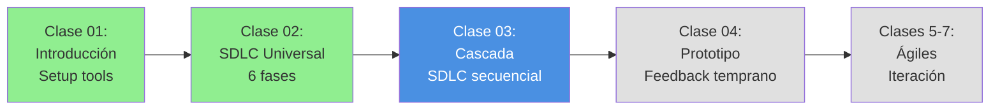

**¿Cómo se conecta esta clase?**

- **Clase 02 (SDLC):** Vimos el ciclo universal → Hoy veremos cómo Cascada lo aplica secuencialmente
- **Clase 04 (Prototipo):** Veremos una alternativa que permite feedback temprano → Surgió por limitaciones de Cascada
- **Semana 5+ (Ágiles):** Veremos metodologías iterativas → También nacieron por las limitaciones de Cascada

---

### 🧠 Mindmap: Lo que Cubriremos Hoy

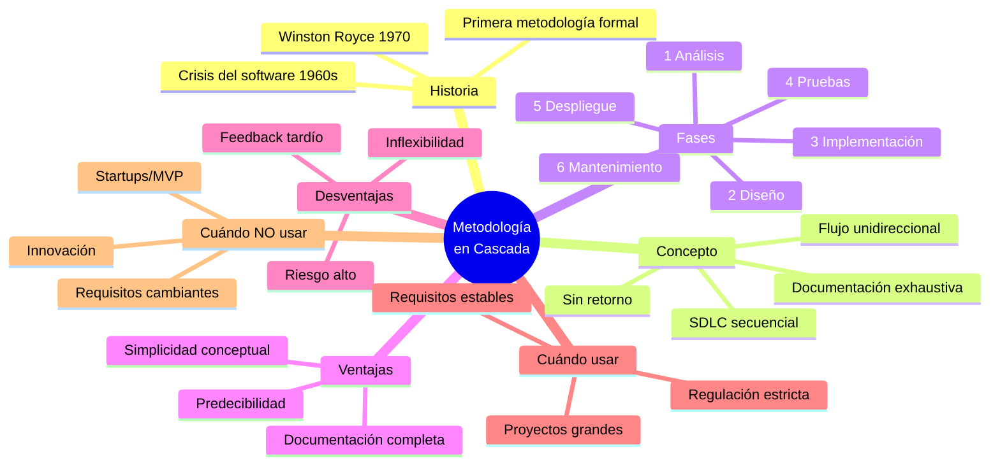

---

## 📚 BLOQUE 1: Contexto Histórico - Por Qué Surgió Cascada

**Duración:** 15 minutos  
**Modalidad:** Expositiva con elementos visuales

### Objetivo del Bloque

Entender el contexto histórico de los años 1960-1970 que llevó al nacimiento de la primera metodología formal de desarrollo de software: el Modelo en Cascada.

---

### 1.1 Bienvenida y Conexión con Clase Anterior (3 minutos)

**Recordatorio rápido de Clase 02:**

En la clase anterior vimos que el **SDLC** (Software Development Life Cycle) es el esqueleto universal de todo proyecto de software:

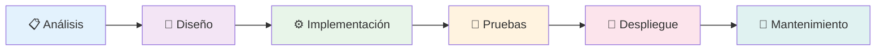

**La pregunta de hoy es:**

> ¿Cómo aplicamos ese SDLC en la práctica? ¿En qué orden? ¿Podemos volver atrás entre fases?

**Respuesta:** Eso depende de la **metodología**. Y la primera metodología formal fue **Cascada**.

---

### 1.2 La Crisis del Software (1960s) (5 minutos)

#### ¿Qué estaba pasando en los años 60?

En la década de 1960, el desarrollo de software era un **caos total**:

**Problemas comunes:**

| Problema                   | Descripción                                          | Consecuencia            |
| -------------------------- | ---------------------------------------------------- | ----------------------- |
| 🎲 **Codificar y Rezar**   | No había plan, solo programar y esperar que funcione | Proyectos fallidos      |
| 📈 **Sobrecostos masivos** | Presupuestos se duplicaban o triplicaban             | Pérdida de millones     |
| ⏰ **Retrasos extremos**   | Proyectos de 1 año duraban 3-4 años                  | Clientes furiosos       |
| 🐛 **Bugs catastróficos**  | Software crítico fallaba en producción               | Vidas en riesgo         |
| 📄 **Sin documentación**   | Solo el programador original entendía el código      | Mantenimiento imposible |

**Ejemplo real: IBM OS/360 (1964-1966)**

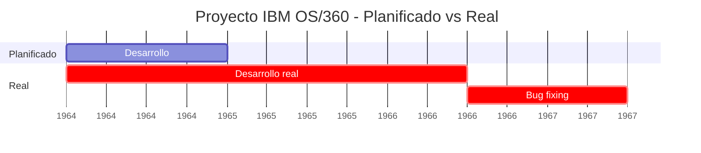

- **Planificado:** 1 año, 200 personas, $5 millones
- **Real:** 2.5 años, 1000 personas, $50 millones
- **Resultado:** Funcionó, pero con enorme sobrecosto

#### La "Crisis del Software" de 1968

En la **Conferencia de la OTAN en 1968**, se acuñó el término **"Crisis del Software"**:

> "No sabemos cómo construir software complejo de manera confiable y predecible."

**Estadísticas de la época:**

- 📊 **Solo 3% de proyectos** se completaban a tiempo y presupuesto
- 💸 **47% de proyectos** se cancelaban antes de terminar
- 🐛 **Bugs costosos:** Un bug en software bancario podía costar millones

**¿Por qué pasaba esto?**

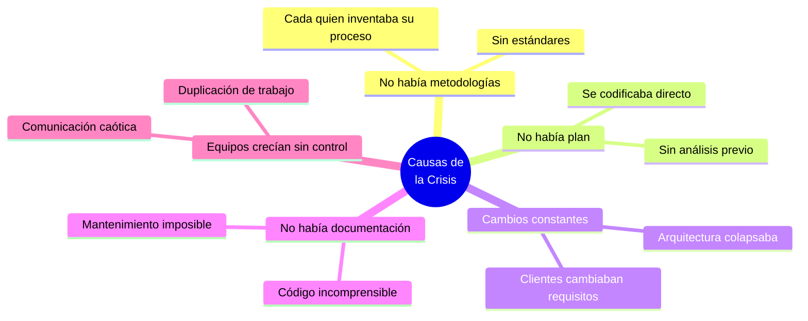

---

### 1.3 Nace la Primera Metodología: Cascada (1970) (7 minutos)

#### Winston Royce y el Paper de 1970

En **1970**, un ingeniero llamado **Winston Royce** publicó un paper titulado:

> _"Managing the Development of Large Software Systems"_  
> (Gestionando el Desarrollo de Grandes Sistemas de Software)

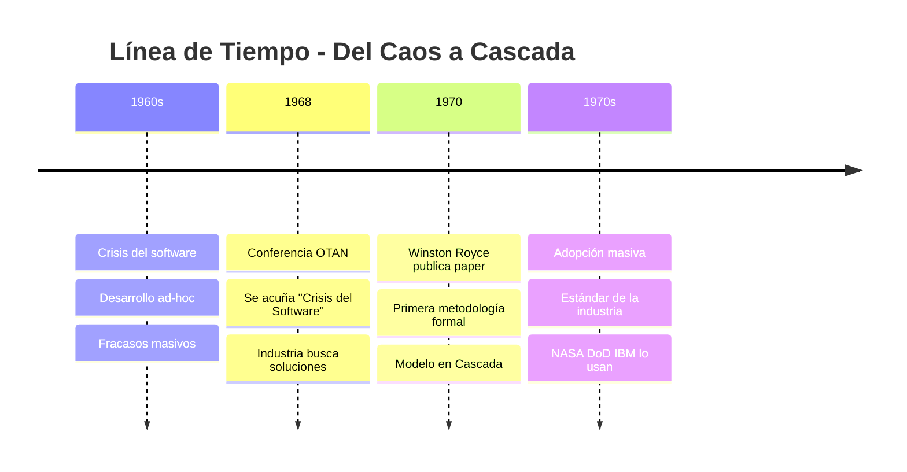

#### ¿Qué propuso Royce?

**Idea revolucionaria:** _"Necesitamos un proceso estructurado y predecible"_

Su propuesta:

1. **Dividir el proyecto en fases secuenciales**
2. **Completar cada fase antes de la siguiente**
3. **Documentar todo exhaustivamente**
4. **No avanzar sin aprobar la fase anterior**

**Diagrama original de Royce (simplificado):**

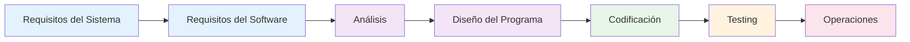

**¿Por qué se llama "Cascada"?**

Porque el flujo es **unidireccional** como el agua cayendo de una cascada:

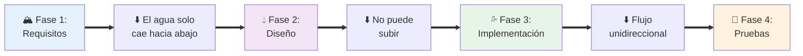

#### La Analogía con Construcción Civil

Royce se inspiró en la **ingeniería civil** (construcción de edificios):

| Construcción de Edificio      | Desarrollo de Software (Cascada) |
| ----------------------------- | -------------------------------- |
| 1️⃣ **Planos arquitectónicos** | Análisis de requisitos           |
| 2️⃣ **Diseño estructural**     | Diseño del sistema               |
| 3️⃣ **Construcción**           | Implementación/codificación      |
| 4️⃣ **Inspecciones**           | Pruebas/testing                  |
| 5️⃣ **Entrega de llaves**      | Despliegue                       |
| 6️⃣ **Mantenimiento**          | Soporte post-lanzamiento         |

**La lógica era:**

> "Si funciona para construir puentes y edificios, debería funcionar para software."

**Spoiler importante (ironía histórica):**

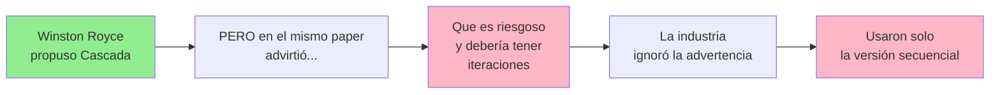

> **Ironía histórica:** Royce **NO recomendaba** usar Cascada estricta sin iteraciones, pero la industria adoptó solo la parte secuencial porque era más fácil de entender y gestionar.

---

### 1.4 Impacto Inicial: ¿Funcionó? (2 minutos)

#### En los años 70-80, Cascada fue un ÉXITO relativo

**¿Por qué funcionó inicialmente?**

✅ **Era mejor que el caos anterior** - Cualquier estructura era mejor que nada  
✅ **Proyectos más predecibles** - Gerentes podían planificar presupuestos  
✅ **Documentación mejoró** - Ahora existía documentación formal  
✅ **Contratos más claros** - Alcance definido desde el inicio

**Adopción masiva:**

- 🏛️ **NASA** - Programas espaciales
- 🔒 **Departamento de Defensa (DoD)** - Software militar
- 💼 **IBM, HP, AT&T** - Software empresarial
- 🏦 **Bancos y gobiernos** - Sistemas críticos

**Ejemplo de éxito: Apollo 11 (1969-1970s)**

El software del programa Apollo usó principios de Cascada:

- Requisitos extremadamente claros (llegar a la Luna)
- No se podía "iterar" después del lanzamiento
- Documentación exhaustiva
- Testing riguroso

**Resultado:** ✅ Éxito total

---

### 1.5 Resumen del Bloque (1 minuto)

**Lo que aprendimos:**

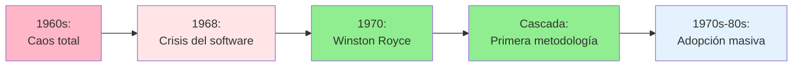

**Puntos clave:**

1. ✅ Cascada surgió como solución a la crisis del software
2. ✅ Fue la primera metodología formal y estructurada
3. ✅ Se basó en ingeniería civil (construcción de edificios)
4. ✅ Inicialmente fue un éxito porque era mejor que el caos
5. ⚠️ Irónicamente, Royce advirtió contra usarla de forma estricta

**Próximo paso:**

Ahora que sabemos POR QUÉ surgió Cascada, veamos CÓMO funciona en detalle.

---

## 🔍 BLOQUE 2: Concepto y Fases de Cascada

**Duración:** 40 minutos  
**Modalidad:** Expositiva con diagramas y ejemplos

### Objetivo del Bloque

Comprender en profundidad qué es la Metodología en Cascada, cómo funciona su flujo secuencial, y qué se hace en cada una de sus 6 fases.

---

### 2.1 ¿Qué Es la Metodología en Cascada? (10 minutos)

#### Definición

> **Metodología en Cascada (Waterfall Model):** Es una forma de aplicar el SDLC de manera **secuencial y lineal**, donde cada fase debe completarse al 100% antes de comenzar la siguiente, sin posibilidad de retroceso.

**Relación con el SDLC:**

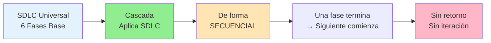

**En otras palabras:**

| Concepto          | SDLC Universal                     | Cascada                  |
| ----------------- | ---------------------------------- | ------------------------ |
| **¿Qué es?**      | Esqueleto genérico                 | Metodología específica   |
| **Fases**         | 6 fases (Análisis → Mantenimiento) | Las mismas 6 fases       |
| **Orden**         | Puede variar según metodología     | Siempre secuencial       |
| **Retroceso**     | Depende de la metodología          | NO permitido (rígido)    |
| **Documentación** | Recomendada                        | Obligatoria y exhaustiva |

---

#### Características Clave de Cascada

**1. Flujo Unidireccional (Como Cascada de Agua)**

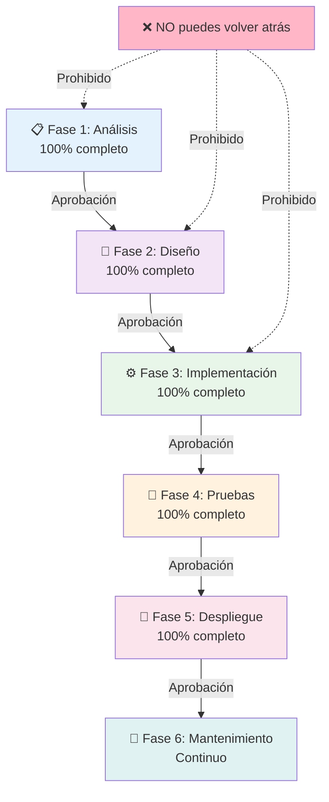

**2. Documentación Exhaustiva**

Cada fase produce **documentos formales** que deben ser aprobados:

| Fase           | Documento de Salida                       | ¿Es obligatorio? |
| -------------- | ----------------------------------------- | ---------------- |
| Análisis       | Documento de Requisitos (SRS)             | ✅ Sí            |
| Diseño         | Documento de Arquitectura + Diagramas UML | ✅ Sí            |
| Implementación | Código fuente + Comentarios               | ✅ Sí            |
| Pruebas        | Plan de Pruebas + Reportes de Testing     | ✅ Sí            |
| Despliegue     | Manual de Instalación + Guía de Usuario   | ✅ Sí            |
| Mantenimiento  | Registro de Cambios + Parches             | ✅ Sí            |

**3. Gates de Aprobación (Compuertas)**

No puedes avanzar sin aprobación formal:

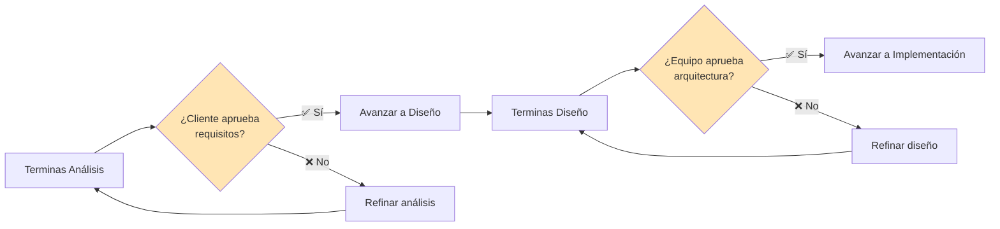

**4. "Big Bang" Deployment (Todo Junto)**

A diferencia de metodologías modernas (que entregan incrementalmente), Cascada entrega TODO AL FINAL:

```mermaid
gantt
    title Entrega en Cascada vs Entrega Incremental
    dateFormat X
    axisFormat %s

    section Cascada
    Desarrollo completo :a1, 0, 12
    Entrega única :milestone, a2, 12, 0

    section Incremental
    Sprint 1 :b1, 0, 2
    Entrega 1 :milestone, b2, 2, 0
    Sprint 2 :b3, 2, 2
    Entrega 2 :milestone, b4, 4, 0
    Sprint 3 :b5, 4, 2
    Entrega 3 :milestone, b6, 6, 0
```

**5. Rigidez ante Cambios**

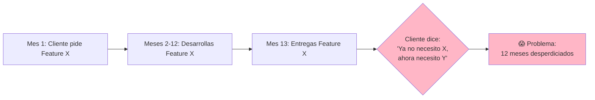

---

#### Comparación Visual: SDLC Universal vs Cascada

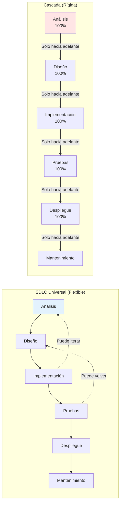

---

### 2.2 Las 6 Fases de Cascada en Detalle (25 minutos)

Ahora veremos cada fase con:

- ¿Qué se hace?
- Entregables clave
- Duración típica (%)
- Ejemplo concreto

---

#### 📋 Fase 1: Análisis de Requisitos (15-20% del tiempo)

**¿Qué se hace aquí?**

Reunir, documentar y aprobar **TODOS** los requisitos del sistema antes de diseñar o programar nada.

**Actividades principales:**

- 🗣️ Entrevistas exhaustivas con stakeholders
- 📝 Documentar requisitos funcionales y no funcionales
- ✅ Validar requisitos con cliente
- 📊 Crear casos de uso
- 🔒 **Congelar requisitos** (no se pueden cambiar después)

**Entregables:**

| Documento                                     | Contenido                                   |
| --------------------------------------------- | ------------------------------------------- |
| **SRS (Software Requirements Specification)** | Requisitos funcionales y no funcionales     |
| **Casos de Uso**                              | Diagramas de interacción usuario-sistema    |
| **Glosario**                                  | Definiciones de términos técnicos           |
| **Criterios de Aceptación**                   | Qué debe hacer el sistema para ser aprobado |

**Ejemplo concreto: Sistema de Biblioteca Universitaria**

```markdown
### Requisitos Funcionales

- RF-01: El sistema DEBE permitir buscar libros por título, autor, ISBN
- RF-02: El sistema DEBE permitir reservar libros por 7 días máximo
- RF-03: El sistema DEBE enviar recordatorios de devolución

### Requisitos No Funcionales

- RNF-01: El sistema DEBE soportar 500 usuarios concurrentes
- RNF-02: Tiempo de respuesta < 2 segundos
- RNF-03: Disponibilidad 99.9% (máximo 8 horas de downtime/año)
```

**Duración típica:** 2-3 meses en un proyecto de 12 meses

**⚠️ Riesgo clave:** Si los requisitos están mal desde el inicio, todo el proyecto falla.

---

#### 🎨 Fase 2: Diseño del Sistema (15-20% del tiempo)

**¿Qué se hace aquí?**

Diseñar **completamente** la arquitectura, base de datos, interfaces y componentes del sistema ANTES de escribir código.

**Actividades principales:**

- 🏗️ Diseño de arquitectura (capas, componentes, servicios)
- 💾 Diseño de base de datos (modelo ER, tablas, relaciones)
- 🎨 Diseño de interfaz de usuario (wireframes, mockups)
- 🔄 Diseño de flujos de datos
- 📐 Diagramas UML (clases, secuencia, actividades)

**Entregables:**

| Documento                     | Contenido                                     |
| ----------------------------- | --------------------------------------------- |
| **Documento de Arquitectura** | Estructura del sistema, patrones, tecnologías |
| **Modelo de Base de Datos**   | Diagrama ER, DDL scripts                      |
| **Diseños de UI/UX**          | Wireframes, mockups, guías de estilo          |
| **Diagramas UML**             | Clases, secuencia, componentes                |

**Ejemplo concreto: Sistema de Biblioteca Universitaria**

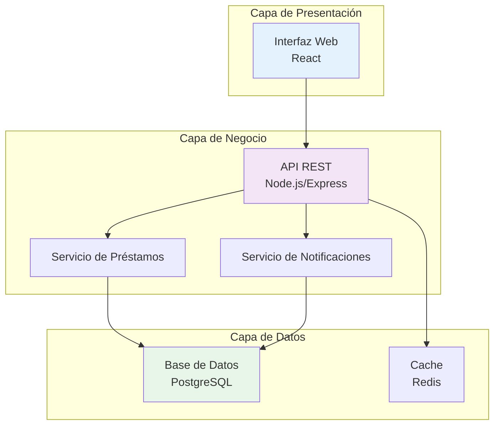

**Duración típica:** 2-3 meses en un proyecto de 12 meses

**⚠️ Riesgo clave:** Diseño incorrecto = rehacer todo (pero en Cascada no puedes volver atrás fácilmente).

---

#### ⚙️ Fase 3: Implementación/Codificación (30-40% del tiempo)

**¿Qué se hace aquí?**

Escribir **TODO** el código del sistema siguiendo el diseño previo. No se improvisa, solo se implementa lo diseñado.

**Actividades principales:**

- 💻 Codificar todos los módulos según el diseño
- 📦 Integrar componentes
- ✍️ Comentar código exhaustivamente
- 🔧 Configurar entornos de desarrollo
- 📚 Crear documentación técnica

**Entregables:**

| Entregable                   | Contenido                                      |
| ---------------------------- | ---------------------------------------------- |
| **Código Fuente Completo**   | Todo el código del sistema                     |
| **Documentación Técnica**    | Cómo funciona cada módulo                      |
| **Scripts de DB**            | Scripts de creación de tablas, datos de prueba |
| **Manual del Desarrollador** | Cómo compilar, ejecutar, extender              |

**Ejemplo concreto: Sistema de Biblioteca Universitaria**

Estructura de código (simplificada):

```
biblioteca-system/
├── frontend/
│   ├── components/
│   │   ├── BookSearch.jsx
│   │   ├── LoanManager.jsx
│   │   └── UserDashboard.jsx
│   └── services/
│       └── api.js
├── backend/
│   ├── controllers/
│   │   ├── BookController.js
│   │   ├── LoanController.js
│   │   └── UserController.js
│   ├── models/
│   │   ├── Book.js
│   │   ├── Loan.js
│   │   └── User.js
│   └── routes/
│       └── api.routes.js
└── database/
    ├── migrations/
    └── seeds/
```

**Duración típica:** 4-6 meses en un proyecto de 12 meses

**⚠️ Riesgo clave:** Si descubres que el diseño no funciona mientras codificas, es muy costoso volver atrás.

---

#### 🧪 Fase 4: Pruebas/Verificación (15-20% del tiempo)

**¿Qué se hace aquí?**

Probar **exhaustivamente** el sistema completo DESPUÉS de terminar toda la implementación.

**Actividades principales:**

- 🧪 Pruebas unitarias (cada función/método)
- 🔗 Pruebas de integración (módulos trabajando juntos)
- 🎯 Pruebas de sistema (sistema completo)
- 👥 Pruebas de aceptación de usuario (UAT)
- 🐛 Identificar y corregir bugs
- 📊 Generar reportes de calidad

**Tipos de pruebas en Cascada:**

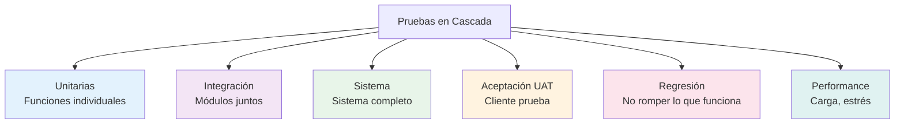

**Entregables:**

| Documento                    | Contenido                        |
| ---------------------------- | -------------------------------- |
| **Plan de Pruebas**          | Qué se va a probar y cómo        |
| **Casos de Prueba**          | Escenarios específicos a validar |
| **Reporte de Bugs**          | Lista de defectos encontrados    |
| **Reporte de Cobertura**     | % de código probado              |
| **Certificación de Calidad** | Sistema aprobado para despliegue |

**Ejemplo concreto: Sistema de Biblioteca Universitaria**

| ID    | Caso de Prueba                        | Resultado Esperado              | Estado        |
| ----- | ------------------------------------- | ------------------------------- | ------------- |
| TC-01 | Buscar libro por ISBN válido          | Muestra detalles del libro      | ✅ Pass       |
| TC-02 | Buscar libro con ISBN inválido        | Mensaje de error                | ✅ Pass       |
| TC-03 | Reservar libro disponible             | Reserva exitosa, correo enviado | ❌ Fail (bug) |
| TC-04 | Intentar reservar libro ya prestado   | Mensaje de no disponible        | ✅ Pass       |
| TC-05 | Sistema con 500 usuarios concurrentes | Tiempo respuesta < 2 seg        | ✅ Pass       |

**Duración típica:** 2-3 meses en un proyecto de 12 meses

**⚠️ Riesgo clave:** Descubrir bugs graves aquí significa volver a implementación (muy costoso).

---

#### 🚀 Fase 5: Despliegue/Implementación (5-10% del tiempo)

**¿Qué se hace aquí?**

Instalar el sistema completo en el ambiente de producción y ponerlo disponible para los usuarios finales.

**Actividades principales:**

- 📦 Preparar ambiente de producción
- 🔄 Migrar datos desde sistema antiguo (si existe)
- 🚀 Desplegar sistema completo
- 👥 Capacitar usuarios finales
- 📚 Entregar manuales de usuario
- ✅ Validación final con cliente

**Estrategia de despliegue en Cascada:**

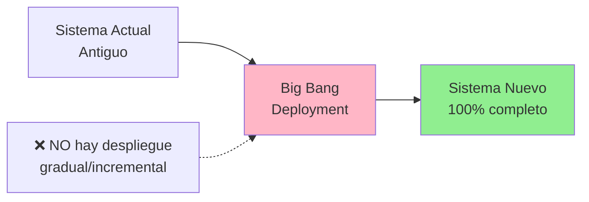

**Entregables:**

| Documento                 | Contenido                                |
| ------------------------- | ---------------------------------------- |
| **Manual de Instalación** | Pasos para instalar el sistema           |
| **Manual de Usuario**     | Cómo usar el sistema                     |
| **Plan de Capacitación**  | Cronograma de entrenamientos             |
| **Plan de Rollback**      | Cómo volver al sistema anterior si falla |
| **Acta de Aceptación**    | Cliente firma que recibe el sistema      |

**Ejemplo concreto: Sistema de Biblioteca Universitaria**

```mermaid
gantt
    title Cronograma de Despliegue
    dateFormat YYYY-MM-DD

    section Preparación
    Setup servidores :a1, 2025-10-01, 5d
    Migración de datos :a2, after a1, 3d

    section Despliegue
    Deploy en producción :milestone, a3, after a2, 1d

    section Capacitación
    Capacitar bibliotecarios :a4, after a3, 5d
    Capacitar estudiantes :a5, after a4, 3d

    section Go Live
    Sistema en vivo :milestone, a6, after a5, 1d
```

**Duración típica:** 2 semanas - 1 mes en un proyecto de 12 meses

**⚠️ Riesgo clave:** Si algo falla en producción, el impacto es masivo (todo o nada).

---

#### 🔧 Fase 6: Mantenimiento (Continuo, años)

**¿Qué se hace aquí?**

Corregir bugs, hacer mejoras menores y mantener el sistema funcionando después del lanzamiento.

**Actividades principales:**

- 🐛 Corregir bugs reportados por usuarios
- 🔄 Aplicar parches de seguridad
- 📊 Monitorear rendimiento
- 💬 Soporte a usuarios
- 🔧 Mejoras menores (sin cambiar arquitectura)

**Tipos de mantenimiento:**

```mermaid
mindmap
  root((Mantenimiento))
    Correctivo
      Arreglar bugs
      Hotfixes
      Parches urgentes
    Adaptativo
      Nuevas versiones de OS
      Actualizar librerías
      Cambios de infraestructura
    Perfectivo
      Optimizaciones
      Mejoras de UX
      Refactoring menor
    Preventivo
      Actualizar dependencias
      Revisar seguridad
      Documentar cambios
```

**Entregables:**

| Documento                   | Contenido                         |
| --------------------------- | --------------------------------- |
| **Registro de Cambios**     | Historial de parches y updates    |
| **Tickets de Soporte**      | Problemas reportados y soluciones |
| **Reportes de Incidentes**  | Bugs críticos y su resolución     |
| **Plan de Actualizaciones** | Cronograma de mejoras futuras     |

**Duración típica:** Mientras el sistema esté en uso (años)

**⚠️ Riesgo clave:** Cambios grandes son muy difíciles porque no puedes "volver a diseño" fácilmente.

---

### 2.3 Visualización Completa del Flujo Cascada (5 minutos)

**Gantt completo de un proyecto de 12 meses:**

```mermaid
gantt
    title Proyecto en Cascada - 12 Meses
    dateFormat YYYY-MM-DD

    section Análisis
    Requisitos :a1, 2025-01-01, 60d
    Aprobación :milestone, a2, after a1, 0d

    section Diseño
    Arquitectura y diseño :a3, after a1, 60d
    Aprobación diseño :milestone, a4, after a3, 0d

    section Implementación
    Codificación :a5, after a3, 120d
    Revisión código :milestone, a6, after a5, 0d

    section Pruebas
    Testing completo :a7, after a5, 60d
    Certificación QA :milestone, a8, after a7, 0d

    section Despliegue
    Deploy producción :a9, after a7, 15d
    Go Live :milestone, a10, after a9, 0d

    section Mantenimiento
    Soporte continuo :a11, after a9, 365d
```

**Tabla resumen:**

| Fase              | Duración (%) | Meses (en proyecto de 12) | Puede volver atrás?   | Entrega al cliente     |
| ----------------- | ------------ | ------------------------- | --------------------- | ---------------------- |
| 📋 Análisis       | 15-20%       | 2-3                       | ❌ No                 | Solo documento         |
| 🎨 Diseño         | 15-20%       | 2-3                       | ❌ No                 | Solo diagramas         |
| ⚙️ Implementación | 30-40%       | 4-6                       | ❌ No                 | Nada (aún no funciona) |
| 🧪 Pruebas        | 15-20%       | 2-3                       | ⚠️ Solo bugs críticos | Nada                   |
| 🚀 Despliegue     | 5-10%        | 0.5-1                     | ❌ No                 | **TODO el sistema**    |
| 🔧 Mantenimiento  | Continuo     | Años                      | ⚠️ Solo parches       | Updates                |

---

### 📊 Resumen del Bloque 2

**Lo que aprendimos:**

- ✅ Cascada = SDLC aplicado de forma **secuencial y rígida**
- ✅ Características clave: flujo unidireccional, documentación exhaustiva, gates de aprobación
- ✅ Las 6 fases en detalle: Análisis → Diseño → Implementación → Pruebas → Despliegue → Mantenimiento
- ✅ Cada fase tiene entregables obligatorios y formales
- ✅ NO puedes volver atrás fácilmente (por eso es "cascada")

**Próximo paso:**

Tomar una pausa de 10 minutos y luego veremos un caso real completo de principio a fin.

---

## ☕ PAUSA (10 minutos)

---

## 🏥 BLOQUE 3: Caso Real Completo - Sistema de Gestión Hospitalaria

**Duración:** 30 minutos  
**Modalidad:** Análisis de caso con timeline detallado

### Objetivo del Bloque

Ver cómo se aplica Cascada en un proyecto real de principio a fin, identificando decisiones clave, desafíos y resultados en cada fase.

---

### 3.1 Contexto del Proyecto (3 minutos)

#### Información General

**Cliente:** Hospital Regional San José  
**Tipo de proyecto:** Sistema de Gestión Integral de Pacientes  
**Duración planificada:** 18 meses  
**Presupuesto:** $2,500,000 USD  
**Equipo:** 20 personas (5 analistas, 8 desarrolladores, 4 testers, 2 DBAs, 1 PM)

#### Situación Inicial

**Problema:**

El hospital opera con sistemas desconectados y papel:

- 📋 Historias clínicas en papel (30,000 pacientes)
- 💊 Sistema de farmacia aislado (DOS, año 1995)
- 🗓️ Agenda de citas en Excel compartido
- 🏥 Inventario de quirófanos en pizarra manual
- 💰 Facturación en sistema antiguo sin integración

**Consecuencias:**

```mermaid
mindmap
  root((Problemas<br/>Actuales))
    Operacionales
      Pérdida de historias clínicas
      Citas duplicadas
      Errores de medicación
    Financieros
      Cobros perdidos
      Inventario inexacto
      Auditorías lentas
    Legales
      Sin trazabilidad
      Incumplimiento normativo
      Riesgo de demandas
    Calidad
      Tiempos de espera largos
      Pacientes insatisfechos
      Personal frustrado
```

#### Por Qué Eligieron Cascada

**Razones para usar metodología en Cascada:**

| Factor                           | Justificación                                             |
| -------------------------------- | --------------------------------------------------------- |
| 🏛️ **Regulación estricta**       | Salud está altamente regulado (HIPAA, normativas locales) |
| 📋 **Requisitos claros**         | Procesos hospitalarios bien establecidos (50 años)        |
| 🔒 **Seguridad crítica**         | Vidas dependen del sistema                                |
| 📄 **Documentación obligatoria** | Auditorías requieren todo documentado                     |
| 💰 **Presupuesto fijo**          | Gobierno asignó fondos específicos                        |
| 🏢 **Organización tradicional**  | Hospital acostumbrado a procesos formales                 |

---

### 3.2 Recorrido por Cada Fase (22 minutos)

#### 📋 Fase 1: Análisis de Requisitos (Meses 1-3)

**Actividades realizadas:**

```mermaid
gantt
    title Fase de Análisis - 3 Meses
    dateFormat YYYY-MM-DD

    section Mes 1
    Entrevistas doctores :a1, 2024-01-01, 20d
    Entrevistas enfermeras :a2, 2024-01-01, 20d
    Entrevistas administración :a3, after a1, 10d

    section Mes 2
    Observación de procesos :a4, 2024-02-01, 15d
    Documentar requisitos :a5, after a4, 15d

    section Mes 3
    Validación con stakeholders :a6, 2024-03-01, 20d
    Aprobación final :milestone, a7, after a6, 0d
```

**Stakeholders entrevistados:**

- 👨‍⚕️ 25 médicos de diferentes especialidades
- 👩‍⚕️ 40 enfermeras de turnos diversos
- 🧑‍💼 15 administrativos y facturadores
- 💊 5 farmacéuticos
- 🏥 3 jefes de quirófano
- 👤 10 pacientes (para entender experiencia)

**Requisitos principales identificados:**

| Categoría                | Ejemplos de Requisitos                                                                                                               |
| ------------------------ | ------------------------------------------------------------------------------------------------------------------------------------ |
| **Gestión de Pacientes** | - RF-01: Registro único de paciente con RUT<br/>- RF-02: Historia clínica electrónica<br/>- RF-03: Búsqueda por nombre, RUT, ficha   |
| **Agenda y Citas**       | - RF-10: Agendar citas por especialidad<br/>- RF-11: Envío de recordatorios SMS/email<br/>- RF-12: Lista de espera automática        |
| **Farmacia**             | - RF-20: Recetas electrónicas<br/>- RF-21: Control de stock con alertas<br/>- RF-22: Trazabilidad de medicamentos controlados        |
| **Facturación**          | - RF-30: Emisión automática de boletas<br/>- RF-31: Integración con seguros<br/>- RF-32: Reportes para auditoría                     |
| **No Funcionales**       | - RNF-01: 99.9% disponibilidad (máx 8h downtime/año)<br/>- RNF-02: Cumplir HIPAA y normativa local<br/>- RNF-03: Backup cada 6 horas |

**Entregable principal:**

```markdown
📄 **Documento SRS (Software Requirements Specification)**

- Páginas: 320
- Requisitos funcionales: 127
- Requisitos no funcionales: 43
- Casos de uso: 85
- Firmas de aprobación: 12 stakeholders
```

**Tiempo real:** 3 meses (según planificado) ✅

**Costo:** $180,000 (analistas + tiempo)

---

#### 🎨 Fase 2: Diseño del Sistema (Meses 4-6)

**Actividades realizadas:**

- Diseño de arquitectura de 3 capas
- Modelo de base de datos (58 tablas, 300+ campos)
- Diseño de interfaces (75 pantallas)
- Flujos de procesos críticos
- Plan de seguridad y backups

**Arquitectura diseñada:**

```mermaid
graph TB
    subgraph "Capa Presentación"
        A[Web App<br/>Angular]
        B[App Móvil<br/>Médicos]
    end

    subgraph "Capa Negocio"
        C[API REST<br/>.NET Core]
        D[Servicio Citas]
        E[Servicio Farmacia]
        F[Servicio Facturación]
        G[Servicio Notificaciones]
    end

    subgraph "Capa Datos"
        H[(SQL Server<br/>Producción)]
        I[(SQL Server<br/>Backup)]
        J[Redis<br/>Cache]
    end

    subgraph "Integraciones"
        K[Sistema Seguros<br/>API Externa]
        L[Servicio SMS]
        M[Email SMTP]
    end

    A --> C
    B --> C
    C --> D
    C --> E
    C --> F
    C --> G
    D --> H
    E --> H
    F --> H
    G --> L
    G --> M
    H --> I
    C --> J
    F --> K

    style H fill:#E3F2FD
    style I fill:#FFE5E5
```

**Modelo de datos (simplificado):**

Algunas tablas clave:

```
Pacientes (58,000 registros esperados)
├── PacienteID (PK)
├── RUT (Unique)
├── Nombre, Apellidos
├── FechaNacimiento
├── Contacto (teléfono, email)
└── SeguroID (FK)

HistoriasClinicas (300,000 registros/año)
├── HistoriaID (PK)
├── PacienteID (FK)
├── MedicoID (FK)
├── FechaAtencion
├── Diagnostico
├── Tratamiento
└── Recetas (FK)

Citas (120,000/año)
├── CitaID (PK)
├── PacienteID (FK)
├── MedicoID (FK)
├── FechaHora
├── Estado (Pendiente, Atendida, Cancelada)
└── Especialidad
```

**Diseño de interfaz (wireframes):**

Principales pantallas diseñadas:

- 📱 Login y autenticación
- 🏥 Dashboard médico
- 👤 Ficha de paciente
- 📝 Registro de atención
- 💊 Gestión de farmacia
- 🗓️ Agenda de citas
- 💰 Panel de facturación

**Entregables:**

| Documento                         | Páginas      | Estado      |
| --------------------------------- | ------------ | ----------- |
| Documento de Arquitectura         | 180          | ✅ Aprobado |
| Modelo de Base de Datos           | 95           | ✅ Aprobado |
| Wireframes UI/UX                  | 75 pantallas | ✅ Aprobado |
| Diagramas UML (clases, secuencia) | 42           | ✅ Aprobado |
| Plan de Seguridad                 | 68           | ✅ Aprobado |

**Tiempo real:** 3 meses (según planificado) ✅

**Costo:** $220,000

---

#### ⚙️ Fase 3: Implementación (Meses 7-12)

**Actividades realizadas:**

```mermaid
gantt
    title Fase de Implementación - 6 Meses
    dateFormat YYYY-MM-DD

    section Backend
    Setup infraestructura :a1, 2024-07-01, 15d
    Módulo Pacientes :a2, after a1, 30d
    Módulo Citas :a3, after a2, 30d
    Módulo Farmacia :a4, after a3, 35d
    Módulo Facturación :a5, after a4, 30d
    Integraciones :a6, after a5, 20d

    section Frontend
    Setup proyecto :b1, 2024-07-15, 10d
    Pantallas admin :b2, after b1, 45d
    Pantallas médicos :b3, after b2, 45d
    Pantallas pacientes :b4, after b3, 30d
    App móvil :b5, after b4, 30d

    section Base de Datos
    Scripts DDL :c1, 2024-07-01, 20d
    Stored procedures :c2, after c1, 40d
    Migración datos :c3, after c2, 30d
```

**Equipo de desarrollo:**

| Rol                     | Cantidad | Responsabilidad             |
| ----------------------- | -------- | --------------------------- |
| **Backend Developers**  | 4        | API REST, lógica de negocio |
| **Frontend Developers** | 3        | Web app Angular             |
| **Mobile Developer**    | 1        | App móvil para médicos      |
| **DBAs**                | 2        | Base de datos, migraciones  |
| **DevOps**              | 1        | Infraestructura, CI/CD      |

**Stack tecnológico:**

- **Backend:** .NET Core 6, C#
- **Frontend:** Angular 14, TypeScript
- **Mobile:** React Native
- **Base de Datos:** SQL Server 2019
- **Cache:** Redis
- **Servidor:** Windows Server 2022
- **Cloud:** Azure (VM, Storage)

**Desafío enfrentado en mes 10:**

```mermaid
graph LR
    A[Mes 10: Implementando<br/>integración con seguros] --> B{Descubren que API<br/>de seguros NO existe}
    B --> C[Cliente dijo que sí existía<br/>en fase de análisis]
    C --> D[Reunión de emergencia]
    D --> E{¿Qué hacer?}
    E -->|Opción 1| F[Volver a diseño<br/>6 meses perdidos]
    E -->|Opción 2| G[Workaround:<br/>Integración manual CSV]
    E -->|Opción 3| H[Posponer feature<br/>para v2.0]

    G --> I[Decisión tomada:<br/>CSV + promesa de API futura]

    style B fill:#FFB6C6
    style F fill:#FFE5E5
    style I fill:#FFE5B4
```

**Resultado del desafío:**

- ⚠️ Retraso de 3 semanas
- 💰 Sobrecosto de $45,000
- 📉 Feature degradada (CSV en lugar de API)
- 😤 Tensión con cliente

**Entregables:**

- ✅ Código fuente completo (127,000 líneas)
- ✅ Scripts de base de datos
- ✅ Documentación técnica
- ⚠️ Integración de seguros parcial

**Tiempo real:** 6.5 meses (3 semanas de retraso) ⚠️

**Costo:** $945,000 ($45,000 sobrecosto)

---

#### 🧪 Fase 4: Pruebas (Meses 13-15)

**Tipos de pruebas ejecutadas:**

```mermaid
graph TB
    A[Plan de Pruebas] --> B[Unitarias<br/>Automatizadas]
    A --> C[Integración<br/>Módulos]
    A --> D[Sistema Completo<br/>End-to-end]
    A --> E[Carga y Estrés<br/>500 usuarios]
    A --> F[Seguridad<br/>Penetración]
    A --> G[UAT<br/>Usuarios reales]

    B --> H{Cobertura<br/>85%}
    C --> I{150 casos<br/>de prueba}
    D --> J{25 flujos<br/>críticos}
    E --> K{Simular<br/>pico de demanda}
    F --> L{Auditoría<br/>externa}
    G --> M{12 médicos<br/>5 enfermeras<br/>3 admin}

    style F fill:#FFE5B4
    style G fill:#90EE90
```

**Resultados de las pruebas:**

| Tipo de Prueba       | Casos Totales | Pasados | Fallados | % Éxito |
| -------------------- | ------------- | ------- | -------- | ------- |
| Unitarias            | 3,200         | 3,150   | 50       | 98.4%   |
| Integración          | 150           | 142     | 8        | 94.7%   |
| Sistema              | 85            | 79      | 6        | 92.9%   |
| Carga (500 usuarios) | 10 escenarios | 9       | 1        | 90%     |
| Seguridad            | 25 vectores   | 23      | 2        | 92%     |
| UAT                  | 75 escenarios | 68      | 7        | 90.7%   |

**Bugs críticos encontrados:**

1. **BUG-001 (Crítico):** Sistema borra recetas al editar historia clínica
   - Impacto: Alto (pérdida de datos)
   - Tiempo de fix: 2 semanas
2. **BUG-015 (Crítico):** Doble cobro en facturación con seguros

   - Impacto: Alto (problemas financieros)
   - Tiempo de fix: 1 semana

3. **BUG-027 (Alto):** App móvil se cuelga con historias clínicas > 50 páginas
   - Impacto: Medio-Alto
   - Tiempo de fix: 1.5 semanas

**Pruebas de Aceptación de Usuario (UAT):**

Participantes:

- 12 médicos de diferentes especialidades
- 5 enfermeras
- 3 administrativos
- 2 farmacéuticos

Feedback general:

- ✅ 85% satisfacción general
- ⚠️ Curva de aprendizaje más alta de lo esperado
- ⚠️ Solicitudes de cambios menores en UI
- ✅ Procesos críticos funcionan correctamente

**Entregables:**

| Documento                     | Contenido                             |
| ----------------------------- | ------------------------------------- |
| Reporte de Testing            | 420 páginas, todos los casos          |
| Registro de Bugs              | 127 bugs (98 cerrados, 29 pospuestos) |
| Certificación QA              | Sistema aprobado con condiciones      |
| Plan de Capacitación Revisado | Aumentado de 2 a 4 semanas            |

**Tiempo real:** 3 meses (según planificado) ✅

**Costo:** $380,000

---

#### 🚀 Fase 5: Despliegue (Mes 16)

**Estrategia de despliegue:**

```mermaid
gantt
    title Plan de Despliegue - 1 Mes
    dateFormat YYYY-MM-DD

    section Preparación
    Setup servidores producción :a1, 2024-04-01, 7d
    Migración de 30k historias :a2, after a1, 10d

    section Capacitación
    Capacitar médicos (grupos) :a3, 2024-04-08, 14d
    Capacitar enfermeras :a4, 2024-04-08, 14d
    Capacitar admin :a5, 2024-04-15, 7d

    section Go Live
    Deploy producción :milestone, a6, 2024-04-22, 1d
    Piloto 1 semana piso 3 :a7, after a6, 7d
    Rollout completo :milestone, a8, after a7, 1d
```

**Migración de datos:**

Desafío: Convertir 30,000 historias clínicas de papel a digital

| Fuente                   | Registros      | Método                                   | Tiempo             |
| ------------------------ | -------------- | ---------------------------------------- | ------------------ |
| Historias en papel       | 30,000         | Digitalización + OCR + validación manual | 6 meses (paralelo) |
| Sistema farmacia antiguo | 12,000 recetas | Script de migración                      | 3 días             |
| Excel de citas           | 5,000 citas    | Import CSV                               | 1 día              |

**Capacitación:**

- **Modalidad:** Presencial + material en video
- **Duración:** 4 semanas
- **Grupos:** 8 sesiones de 3 horas cada una
- **Material entregado:**
  - 📚 Manual de usuario (250 páginas)
  - 🎥 15 videos tutoriales
  - 📋 Guías rápidas (1 página por proceso)
  - 🆘 Contactos de soporte

**Go Live (22 de abril):**

```mermaid
graph LR
    A[Sistema antiguo<br/>Hasta 21 de abril] --> B[Fin de semana<br/>Migración final]
    B --> C[Lunes 22:<br/>Go Live piloto]
    C --> D[Piso 3 del hospital<br/>30 usuarios]
    D --> E{¿Funciona<br/>1 semana?}
    E -->|✅ Sí| F[Lunes 29:<br/>Rollout completo]
    E -->|❌ No| G[Rollback plan]
    F --> H[Todo el hospital<br/>500 usuarios]

    style C fill:#FFE5B4
    style F fill:#90EE90
    style G fill:#FFB6C6
```

**Resultado del Go Live:**

✅ **Éxito relativo:**

- Piloto en piso 3 fue bien
- Rollout completo tuvo problemas menores:
  - Lentitud en horas pico (50 usuarios simultáneos)
  - 3 crashes en primera semana
  - Confusión de usuarios con nueva interfaz

**Entregables:**

- ✅ Sistema en producción
- ✅ Manuales de usuario entregados
- ✅ Capacitación completada
- ✅ Soporte 24/7 activado (primeros 30 días)
- ✅ Plan de rollback documentado (no usado)

**Tiempo real:** 1 mes (según planificado) ✅

**Costo:** $185,000

---

#### 🔧 Fase 6: Mantenimiento (Meses 17-18 y continúa)

**Primeros 2 meses post-lanzamiento:**

| Categoría           | Incidentes | Tiempo Promedio Resolución |
| ------------------- | ---------- | -------------------------- |
| Bugs críticos       | 8          | 6 horas                    |
| Bugs menores        | 47         | 2 días                     |
| Requests de cambio  | 23         | Pospuestos a v2.0          |
| Consultas soporte   | 340        | 1 hora                     |
| Crashes del sistema | 3          | 3 horas                    |

**Hotfixes aplicados:**

1. **Patch 1.0.1 (Semana 2):** Corrección de lentitud en búsqueda de pacientes
2. **Patch 1.0.2 (Semana 4):** Fix crítico en cálculo de dosis de medicamentos
3. **Patch 1.0.3 (Semana 6):** Mejora de performance en reportes

**Satisfacción después de 2 meses:**

```mermaid
pie
    title Encuesta de Satisfacción (200 usuarios)
    "Muy satisfecho" : 25
    "Satisfecho" : 105
    "Neutral" : 45
    "Insatisfecho" : 20
    "Muy insatisfecho" : 5
```

**Resultado:** 65% satisfacción (objetivo era 80%)

---

### 3.3 Resultados Finales del Proyecto (5 minutos)

#### Comparación: Planificado vs Real

| Aspecto           | Planificado | Real              | Variación        |
| ----------------- | ----------- | ----------------- | ---------------- |
| **Duración**      | 18 meses    | 20 meses          | +2 meses (+11%)  |
| **Costo**         | $2,500,000  | $2,800,000        | +$300,000 (+12%) |
| **Requisitos**    | 170         | 153 implementados | 17 pospuestos    |
| **Satisfacción**  | 80%         | 65%               | -15%             |
| **Bugs críticos** | 0 esperados | 8 en producción   | +8               |

#### ¿El proyecto fue exitoso?

**✅ Éxitos:**

1. Sistema funciona y está en producción
2. Digitalizaron 30,000 historias clínicas
3. Procesos críticos operan correctamente
4. Cumple normativas de salud
5. Base sólida para mejoras futuras

**⚠️ Desafíos:**

1. Sobrecosto de 12%
2. Retraso de 2 meses
3. 17 features pospuestas
4. Satisfacción menor a la esperada
5. Curva de aprendizaje más alta de lo previsto

**❌ Problemas específicos de usar Cascada:**

| Problema                  | ¿Por qué pasó?                          | ¿Se pudo evitar?                          |
| ------------------------- | --------------------------------------- | ----------------------------------------- |
| API de seguros no existía | Cliente dio info incorrecta en análisis | ✅ Prototipo temprano lo habría detectado |
| Cambios de UI en UAT      | Usuarios vieron interfaz muy tarde      | ✅ Diseño participativo habría ayudado    |
| Performance en horas pico | No se probó con datos reales            | ⚠️ Difícil de simular sin producción      |
| Curva de aprendizaje alta | UX diseñado sin feedback de usuarios    | ✅ Iteraciones tempranas habrían mejorado |

---

### 📊 Resumen del Bloque 3

**Lecciones del caso real:**

```mermaid
graph TB
    A[Cascada en Hospital] --> B[✅ Funcionó porque...]
    A --> C[⚠️ Tuvo problemas porque...]

    B --> D[Requisitos estables<br/>Procesos conocidos<br/>Regulación clara]

    C --> E[Feedback tardío<br/>Cambios costosos<br/>Riesgos descubiertos tarde]

    style A fill:#E3F2FD
    style B fill:#90EE90
    style C fill:#FFE5B4
```

**Puntos clave:**

1. ✅ Cascada **puede funcionar** en contextos apropiados (salud, regulación)
2. ⚠️ Pero incluso en contextos ideales, tiene **limitaciones inherentes**
3. 📊 Sobrecostos y retrasos son **comunes** incluso cuando se hace "bien"
4. 🔄 **Falta de feedback temprano** es el problema más grande
5. 📄 **Documentación exhaustiva** es útil pero no reemplaza la iteración

**Próximo paso:**

Ahora que vimos un caso real, analicemos las ventajas y desventajas de Cascada de forma estructurada.

---

## ⚖️ BLOQUE 4: Ventajas y Desventajas de Cascada

**Duración:** 25 minutos  
**Modalidad:** Análisis crítico con ejemplos

### Objetivo del Bloque

Identificar claramente las ventajas y desventajas de la Metodología en Cascada, y entender en qué contextos es apropiada (y cuándo NO).

---

### 4.1 Ventajas de Cascada (10 minutos)

#### ✅ Ventaja 1: Simplicidad Conceptual

**¿Qué significa?**

Cascada es extremadamente **fácil de entender y explicar**. Cualquier persona (técnica o no) puede comprender el flujo lineal.

**Ejemplo:**

```mermaid
graph LR
    A[Paso 1:<br/>Planifica] --> B[Paso 2:<br/>Diseña]
    B --> C[Paso 3:<br/>Construye]
    C --> D[Paso 4:<br/>Prueba]
    D --> E[Paso 5:<br/>Entrega]

    style A fill:#E3F2FD
    style E fill:#90EE90
```

**Beneficio concreto:**

- Fácil de explicar a stakeholders no técnicos
- Gerentes pueden entenderlo sin conocimiento de software
- Cliente sabe exactamente en qué fase están

**Caso real:** En el proyecto del hospital, el director (sin conocimientos técnicos) podía entender perfectamente el progreso: "Estamos en fase de diseño, luego viene implementación".

---

#### ✅ Ventaja 2: Documentación Completa y Formal

**¿Qué significa?**

Cada fase produce **documentación exhaustiva** que queda para siempre.

**Documentos generados:**

| Fase           | Documentos                          | Utilidad                      |
| -------------- | ----------------------------------- | ----------------------------- |
| Análisis       | SRS, Casos de uso                   | Referencia de qué debe hacer  |
| Diseño         | Arquitectura, diagramas UML         | Entender cómo está construido |
| Implementación | Código comentado, manuales técnicos | Mantener y extender           |
| Pruebas        | Casos de prueba, reportes           | Validar calidad               |
| Despliegue     | Manuales de usuario                 | Capacitar nuevos usuarios     |

**Beneficio concreto:**

- **Transferencia de conocimiento:** Si un desarrollador se va, la documentación queda
- **Auditorías:** Puedes demostrar qué se hizo y por qué
- **Mantenimiento a largo plazo:** Entender el sistema años después
- **Cumplimiento normativo:** Reguladores requieren documentación

**Caso real:** En el hospital, 5 años después, cuando necesitaron extender el sistema, la documentación permitió que un nuevo equipo entendiera todo en 2 meses.

---

#### ✅ Ventaja 3: Predecibilidad de Cronograma y Presupuesto

**¿Qué significa?**

Puedes estimar con **anticipación** cuánto tiempo y dinero costará todo el proyecto.

**Planificación desde el inicio:**

```mermaid
gantt
    title Proyecto Planificado Completamente
    dateFormat YYYY-MM-DD

    section Todo definido al inicio
    Análisis :a1, 2025-01-01, 60d
    Diseño :a2, after a1, 60d
    Implementación :a3, after a2, 120d
    Pruebas :a4, after a3, 60d
    Despliegue :a5, after a4, 15d

    section Presupuesto fijo
    $500K :milestone, m1, 2025-01-01, 0d
    $500K :milestone, m2, after a1, 0d
    $1M :milestone, m3, after a3, 0d
    $300K :milestone, m4, after a4, 0d
    Total $2.3M :milestone, m5, after a5, 0d
```

**Beneficio concreto:**

- **Contratos cerrados:** Cliente sabe cuánto pagará
- **Aprobación de presupuesto:** Gobierno/empresa puede asignar fondos
- **Planificación de recursos:** Sabes cuántas personas necesitas y cuándo
- **Fechas comprometidas:** Puedes prometer fecha de entrega

**Caso real:** El hospital pudo asegurar financiamiento gubernamental porque presentaron un plan completo de 18 meses con presupuesto fijo.

---

#### ✅ Ventaja 4: Funciona Bien con Requisitos Estables

**¿Qué significa?**

Si los requisitos **NO van a cambiar**, Cascada es muy eficiente.

**Ejemplos de requisitos estables:**

- 🏥 **Salud:** Procesos médicos no cambian drásticamente
- ✈️ **Aeroespacial:** Requisitos de vuelo son estrictos y conocidos
- 🏛️ **Gobierno:** Regulaciones claras y establecidas
- 🏗️ **Infraestructura crítica:** Control de tráfico, centrales eléctricas

**Comparación:**

| Tipo de Proyecto         | Estabilidad de Requisitos | ¿Cascada apropiada? |
| ------------------------ | ------------------------- | ------------------- |
| Sistema bancario core    | 95% estable               | ✅ Sí               |
| Control de tráfico aéreo | 98% estable               | ✅ Sí               |
| Startup de red social    | 20% estable               | ❌ No               |
| App de delivery nueva    | 30% estable               | ❌ No               |

**Beneficio concreto:**

Si los requisitos no cambian, la **rigidez de Cascada no es problema**, es **ventaja** (evita cambios innecesarios).

---

#### ✅ Ventaja 5: Facilita la Gestión de Proyectos Grandes

**¿Qué significa?**

Con equipos grandes (50+ personas), Cascada permite **coordinar** mejor que metodologías ágiles.

**Por qué es más fácil gestionar:**

```mermaid
graph TB
    A[Equipo Grande<br/>50 personas] --> B[Dividir por fases<br/>claras]

    B --> C[Fase Análisis:<br/>5 analistas]
    B --> D[Fase Diseño:<br/>8 arquitectos]
    B --> E[Fase Implementación:<br/>30 desarrolladores]
    B --> F[Fase Pruebas:<br/>10 testers]

    C --> G[Cada equipo sabe<br/>exactamente qué hacer]
    D --> G
    E --> G
    F --> G

    style A fill:#E3F2FD
    style G fill:#90EE90
```

**Beneficio concreto:**

- **Roles claros:** Cada persona sabe su responsabilidad
- **Hitos medibles:** 25% análisis, 50% diseño, etc.
- **Menos reuniones:** No hay daily standups
- **Subcontratación:** Puedes contratar empresa para cada fase

**Caso real:** NASA usa Cascada para software espacial porque coordinar 500 ingenieros requiere estructura rígida.

---

#### ✅ Ventaja 6: Validación en Cada Fase (Gates de Calidad)

**¿Qué significa?**

No puedes avanzar sin **aprobación formal** de la fase anterior.

**Sistema de gates:**

```mermaid
graph LR
    A[Termina Análisis] --> B{Gate 1:<br/>¿Aprobado?}
    B -->|✅ Sí| C[Diseño]
    B -->|❌ No| D[Refinar]
    D --> A

    C --> E[Termina Diseño] --> F{Gate 2:<br/>¿Aprobado?}
    F -->|✅ Sí| G[Implementación]
    F -->|❌ No| H[Refinar]
    H --> C

    style B fill:#FFE5B4
    style F fill:#FFE5B4
```

**Beneficio concreto:**

- **Calidad asegurada:** Cada fase es revisada
- **Errores detectados temprano (en su fase):** Si el análisis está mal, se detecta antes de diseñar
- **Responsabilidad clara:** Quien aprueba es responsable
- **Menos sorpresas:** Validaciones constantes

---

### 4.2 Desventajas de Cascada (10 minutos)

#### ❌ Desventaja 1: Inflexibilidad Extrema ante Cambios

**¿Qué significa?**

Cambiar requisitos **después de empezar** es **muy costoso** y difícil.

**El problema del cambio tardío:**

```mermaid
graph LR
    A[Mes 1:<br/>Cliente pide Feature X] --> B[Meses 2-4:<br/>Análisis y Diseño de X]
    B --> C[Meses 5-10:<br/>Implementar X]
    C --> D[Mes 11:<br/>Cliente dice 'Ahora quiero Y']
    D --> E{Costo de cambiar}
    E --> F[Volver a Análisis<br/>10 meses perdidos]
    E --> G[Forzar Y en diseño de X<br/>Arquitectura fea]
    E --> H[Rechazar cambio<br/>Cliente insatisfecho]

    style D fill:#FFB6C6
    style F fill:#FFE5E5
    style G fill:#FFE5E5
    style H fill:#FFE5E5
```

**Costo del cambio según fase:**

| Cambio detectado en | Costo de corregir | Ejemplo                                |
| ------------------- | ----------------- | -------------------------------------- |
| Análisis            | $1,000            | Cambiar un requisito                   |
| Diseño              | $5,000            | Rediseñar módulo                       |
| Implementación      | $25,000           | Reescribir código                      |
| Pruebas             | $50,000           | Rediseñar + recodificar + re-probar    |
| Producción          | $100,000+         | Todo lo anterior + impacto en usuarios |

**Caso real:** En el hospital, descubrir en mes 10 que la API de seguros no existía costó $45,000 y 3 semanas de retraso.

**¿Por qué pasa?**

- El mundo cambia (competencia, regulaciones, tecnología)
- Cliente no siempre sabe lo que quiere hasta verlo
- Requisitos mal entendidos en fase de análisis

---

#### ❌ Desventaja 2: Feedback del Cliente Muy Tardío

**¿Qué significa?**

El cliente **no ve el producto funcionando** hasta casi el final (mes 15 de 18).

**Timeline de feedback:**

```mermaid
gantt
    title Cuándo el Cliente Ve Algo Funcionando
    dateFormat YYYY-MM-DD

    section Cascada
    Análisis (solo documentos) :a1, 2025-01-01, 60d
    Diseño (solo diagramas) :a2, after a1, 60d
    Implementación (no funciona aún) :a3, after a2, 120d
    Pruebas (casi listo) :a4, after a3, 60d
    Cliente ve producto :milestone, a5, after a4, 0d

    section Ágil (comparación)
    Sprint 1 demo :milestone, b1, 2025-01-15, 0d
    Sprint 2 demo :milestone, b2, 2025-02-01, 0d
    Sprint 3 demo :milestone, b3, 2025-02-15, 0d
```

**Problema concreto:**

Mes 15 el cliente dice: _"Esto no es lo que esperaba"_  
Pero ya se gastó el 90% del presupuesto.

**Consecuencias:**

- ⚠️ **Expectativas vs Realidad:** Cliente imaginó algo diferente
- ⚠️ **Requisitos malinterpretados:** Se entendió mal desde el análisis
- ⚠️ **UX inadecuada:** Interfaz difícil de usar pero ya está construida
- ⚠️ **Features inútiles:** Implementaron cosas que nadie usa

**Caso real:** En el hospital, los médicos vieron la interfaz por primera vez en UAT (mes 15) y pidieron cambios de UX que ya no se pudieron hacer.

---

#### ❌ Desventaja 3: Riesgo Alto de Fracaso Completo

**¿Qué significa?**

Como entregas **todo al final**, si algo falla, falla **TODO**.

**Escenarios de fracaso:**

```mermaid
graph TB
    A[Proyecto Cascada<br/>18 meses] --> B{Mes 16:<br/>Despliegue}
    B -->|Escenario 1| C[✅ Todo funciona<br/>Proyecto exitoso]
    B -->|Escenario 2| D[❌ Falla crítica<br/>Sistema no funciona]
    B -->|Escenario 3| E[⚠️ Funciona mal<br/>Usuarios rechazan]

    D --> F[18 meses perdidos<br/>$2.5M desperdiciados]
    E --> G[Rediseñar<br/>+6 meses<br/>+$500K]

    style C fill:#90EE90
    style D fill:#FFB6C6
    style F fill:#FFE5E5
```

**Estadísticas de fracaso:**

Según el **Standish Group Chaos Report 2020**:

| Metodología | Éxito | Desafiado | Fallido |
| ----------- | ----- | --------- | ------- |
| **Cascada** | 13%   | 59%       | 28%     |
| **Ágil**    | 42%   | 49%       | 9%      |

**¿Por qué el riesgo es alto?**

- No hay validación temprana
- Asumes que todo el análisis fue correcto
- No descubres problemas hasta muy tarde
- No hay entregas incrementales de valor

**Caso real:** Healthcare.gov (2013) - Proyecto de $800M con Cascada que falló catastróficamente en lanzamiento.

---

#### ❌ Desventaja 4: Desperdicio de Recursos en Features Innecesarias

**¿Qué significa?**

Implementas features que **nadie usará** porque no hay feedback temprano.

**El problema de "build everything":**

```mermaid
graph LR
    A[Cliente pide<br/>50 features] --> B[Análisis de<br/>todas 50]
    B --> C[Diseño de<br/>todas 50]
    C --> D[Implementación<br/>todas 50]
    D --> E[Mes 16:<br/>Lanzamiento]
    E --> F[Realidad:<br/>Solo 15 se usan]

    F --> G[35 features<br/>desperdiciadas<br/>70% del esfuerzo]

    style G fill:#FFB6C6
```

**Estadística de la industria:**

Según estudios de uso de software:

- 📊 **64% de features** raramente o nunca se usan
- 📊 **45% de features** jamás se abren
- 📊 **20% de features** representan el 80% del valor

**En Cascada implementas TODO, incluso lo que no se usará.**

**Caso real:** En el hospital, implementaron un módulo de "Gestión de Donaciones" que NADIE usa (3 meses de desarrollo desperdiciados).

---

#### ❌ Desventaja 5: Tiempo de Entrega Muy Largo (Time to Market)

**¿Qué significa?**

Pasas **años** sin entregar valor. El mercado puede cambiar completamente.

**Comparación de time to market:**

| Enfoque              | Primer valor entregado | Valor completo       |
| -------------------- | ---------------------- | -------------------- |
| **Cascada**          | Mes 18                 | Mes 18               |
| **Ágil/Incremental** | Mes 1 (MVP)            | Mes 12 (iteraciones) |

**Problema en mercados dinámicos:**

```mermaid
timeline
    title Proyecto de 18 Meses en Cascada
    section 2024
        Enero : Empiezas análisis
             : Competidor A lanza producto
        Abril : Terminas análisis
             : Competidor B lanza versión mejorada
        Julio : Terminas diseño
             : Competidor C entra al mercado
    section 2025
        Marzo : Implementando...
             : Competidores ya dominan mercado
        Junio : Tu producto está listo
             : Pero el mercado ya cambió
             : Llegaste 18 meses tarde
```

**Caso real:** Muchos proyectos de Cascada llegan al mercado cuando la oportunidad ya pasó (ej: Blackberry desarrollando sistema en Cascada mientras iPhone dominó el mercado).

---

#### ❌ Desventaja 6: Dificultad para Incorporar Nuevas Tecnologías

**¿Qué significa?**

Si decides usar una tecnología en el mes 1, estás **atado a ella** por 18 meses.

**El problema de decisiones tempranas:**

```mermaid
graph LR
    A[Mes 1: Eliges Angular 10] --> B[Meses 2-12:<br/>Implementas todo en Angular 10]
    B --> C[Mes 13: Sale Angular 15<br/>con mejoras masivas]
    C --> D{¿Cambiar?}
    D -->|Sí| E[Reescribir todo<br/>6 meses extra]
    D -->|No| F[Producto obsoleto<br/>desde el lanzamiento]

    style E fill:#FFE5E5
    style F fill:#FFB6C6
```

**Ejemplo de tecnologías que cambiaron rápido:**

- React 16 → React 18 (hooks, concurrent rendering)
- Python 2 → Python 3 (incompatibilidad)
- Angular 10 → Angular 17 (cambios masivos)
- Node.js 12 → Node.js 20 (performance)

**En Cascada estás "congelado en el tiempo tecnológico".**

---

### 4.3 Comparación Visual: Ventajas vs Desventajas (5 minutos)

#### Tabla de Balance

| Aspecto                 | ✅ Ventaja                      | ❌ Desventaja                                |
| ----------------------- | ------------------------------- | -------------------------------------------- |
| **Simplicidad**         | Fácil de entender               | Demasiado simplista para proyectos complejos |
| **Documentación**       | Exhaustiva y formal             | Puede ser excesiva y costosa de mantener     |
| **Predecibilidad**      | Cronograma y presupuesto claros | Predicciones a menudo incorrectas            |
| **Requisitos estables** | Muy eficiente                   | Pero requisitos raramente son estables       |
| **Gestión**             | Fácil gestionar equipos grandes | Coordinación rígida, sin flexibilidad        |
| **Cambios**             | -                               | Extremadamente costosos                      |
| **Feedback**            | -                               | Muy tardío (mes 15+)                         |
| **Riesgo**              | -                               | Alto (todo o nada)                           |
| **Time to market**      | -                               | Muy lento (18+ meses)                        |

#### Mindmap: Cuándo SÍ y Cuándo NO usar Cascada

```mermaid
mindmap
  root((Cascada))
    ✅ Usar cuando
      Requisitos muy estables
        Regulación clara
        Procesos conocidos
        Dominio maduro
      Documentación crítica
        Auditorías
        Cumplimiento
        Transferencia conocimiento
      Proyecto grande y predecible
        Gobierno
        Infraestructura
        Hardware integrado
    ❌ NO usar cuando
      Requisitos cambiantes
        Innovación
        Mercado dinámico
        Startup
      Feedback temprano crítico
        UX nueva
        Producto desconocido
        Validación de idea
      Necesitas velocidad
        Competencia intensa
        Oportunidad de mercado
        MVP rápido
```

---

### 📊 Resumen del Bloque 4

**Lo que aprendimos:**

**Ventajas de Cascada:**

1. ✅ Simplicidad conceptual - Fácil de entender
2. ✅ Documentación completa - Todo queda registrado
3. ✅ Predecibilidad - Cronograma y presupuesto claros
4. ✅ Funciona con requisitos estables - Eficiente si no hay cambios
5. ✅ Facilita gestión de proyectos grandes - Roles claros
6. ✅ Gates de calidad - Validación en cada fase

**Desventajas de Cascada:**

1. ❌ Inflexibilidad - Cambios muy costosos
2. ❌ Feedback tardío - Cliente ve producto al final
3. ❌ Riesgo alto - Todo o nada
4. ❌ Desperdicio - Features innecesarias
5. ❌ Time to market largo - 18+ meses sin valor
6. ❌ Tecnología obsoleta - Decisiones tempranas te atan

**Mensaje clave:**

> Cascada NO es mala metodología. Es apropiada para ciertos contextos (regulados, estables, documentación crítica). Pero NO es apropiada para la mayoría de proyectos de software modernos (cambiantes, innovadores, competitivos).

**Próximo paso:**

Hacer un ejercicio simple para aplicar lo aprendido.

---

## ✏️ BLOQUE 5: Ejercicio Simple y Cierre

**Duración:** 20 minutos (10 min ejercicio + 10 min cierre)  
**Modalidad:** Individual con discusión opcional

### Objetivo del Bloque

Aplicar lo aprendido sobre Cascada en un ejercicio práctico simple y consolidar conocimientos para la próxima clase.

---

### 5.1 Ejercicio: ¿Es Cascada Apropiada? (10 minutos)

#### Instrucciones

Lee los siguientes **5 escenarios de proyectos** y decide:

1. ¿Es apropiado usar Cascada? (Sí/No)
2. ¿Por qué? (2-3 razones)
3. Si NO es apropiado, ¿qué sería mejor? (solo mencionar: "metodología ágil/iterativa")

**Tiempo:** 8 minutos individual + 2 minutos discusión opcional

---

#### Escenario A: Sistema de Control de Semáforos Urbanos

**Contexto:**

- Municipalidad necesita sistema para controlar 500 semáforos
- Debe integrarse con sensores de tráfico existentes
- Regulación estricta de seguridad vial
- Presupuesto: $1,500,000 fijo (fondos públicos)
- Plazo: 18 meses
- Requisitos claros: tiempos de luz, coordinación, emergencias

**Tu análisis:**

```markdown
¿Cascada apropiada? [ ] Sí [ ] No

Razones:

1.
2.
3.

Alternativa (si NO):
```

<details>
<summary>👉 Ver respuesta sugerida (después de intentarlo)</summary>

**✅ SÍ es apropiado usar Cascada**

**Razones:**

1. **Requisitos muy estables:** Control de semáforos es dominio maduro y conocido
2. **Regulación estricta:** Seguridad vial requiere documentación exhaustiva y validación
3. **Presupuesto fijo público:** Gobierno requiere planificación y cronograma definido
4. **Crítico (seguridad):** No se puede "iterar en producción" con semáforos reales
5. **Integración con hardware:** Hardware no cambia, requisitos técnicos claros

**Este es un caso IDEAL para Cascada.**

</details>

---

#### Escenario B: App Móvil de Dating para Gamers

**Contexto:**

- Startup nueva (3 personas, cofounders)
- Idea: "Tinder pero para gamers"
- No saben exactamente qué features quieren
- Mercado competitivo (5 apps similares)
- Presupuesto limitado: $50,000
- Necesitan lanzar en 3 meses
- Objetivo: validar si la idea funciona

**Tu análisis:**

```markdown
¿Cascada apropiada? [ ] Sí [ ] No

Razones:

1.
2.
3.

Alternativa (si NO):
```

<details>
<summary>👉 Ver respuesta sugerida (después de intentarlo)</summary>

**❌ NO es apropiado usar Cascada**

**Razones:**

1. **Requisitos inciertos:** No saben qué features realmente quieren/necesitan
2. **Mercado competitivo:** 3 meses es crítico, Cascada tomaría 12-18 meses
3. **Startup/validación:** Necesitan MVP rápido para probar la idea
4. **Presupuesto limitado:** $50K no alcanza para Cascada completa
5. **Feedback crucial:** Necesitan ver qué funciona con usuarios reales rápido

**Alternativa:** Metodología ágil/iterativa (SCRUM, Lean Startup)

- Sprint 1: MVP básico (login, perfil, match simple)
- Sprint 2: Agregar chat
- Sprint 3: Mejorar según feedback

</details>

---

#### Escenario C: Sistema Bancario de Transferencias Internacionales

**Contexto:**

- Banco multinacional establecido
- Sistema para transferencias SWIFT
- Cumplimiento: leyes antilavado, regulación financiera
- Presupuesto: $5,000,000
- Plazo: 24 meses
- Auditorías trimestrales obligatorias
- Procesos bancarios definidos hace 30 años

**Tu análisis:**

```markdown
¿Cascada apropiada? [ ] Sí [ ] No

Razones:

1.
2.
3.

Alternativa (si NO):
```

<details>
<summary>👉 Ver respuesta sugerida (después de intentarlo)</summary>

**✅ SÍ es apropiado usar Cascada**

**Razones:**

1. **Regulación extremadamente estricta:** Banca requiere documentación exhaustiva
2. **Requisitos muy estables:** Transferencias SWIFT son procesos estandarizados globalmente
3. **Auditorías obligatorias:** Necesita documentación formal en cada fase
4. **Criticidad financiera:** No puedes "experimentar" con dinero de clientes
5. **Dominio maduro:** Procesos bancarios establecidos y conocidos

**Este es otro caso IDEAL para Cascada.**

</details>

---

#### Escenario D: Plataforma E-commerce para Tienda de Ropa

**Contexto:**

- Tienda física quiere vender online
- Competencia: Amazon, Mercado Libre, Falabella
- No saben qué features priorizarán (recomendaciones, chat, AR para probarse ropa)
- Presupuesto: $200,000
- Plazo: 6 meses
- Mercado cambia rápido (moda, tendencias)
- Nunca han vendido online

**Tu análisis:**

```markdown
¿Cascada apropiada? [ ] Sí [ ] No

Razones:

1.
2.
3.

Alternativa (si NO):
```

<details>
<summary>👉 Ver respuesta sugerida (después de intentarlo)</summary>

**❌ NO es apropiado usar Cascada**

**Razones:**

1. **Requisitos inciertos:** No saben qué features serán importantes (recomendaciones vs AR)
2. **Mercado dinámico:** Moda cambia rápido, necesitan adaptarse
3. **Competencia intensa:** Necesitan lanzar rápido e iterar
4. **Sin experiencia online:** Necesitan aprender qué funciona con usuarios reales
5. **6 meses es poco:** Cascada completa tomaría 12-18 meses

**Alternativa:** Metodología ágil/iterativa

- Fase 1: Catálogo básico + carrito + pago (MVP) → 2 meses
- Fase 2: Agregar features según feedback de usuarios → iteraciones

</details>

---

#### Escenario E: Software de Gestión para Startup Tecnológica

**Contexto:**

- Startup de 15 personas
- Necesitan CRM + gestión de proyectos + facturación
- Crecimiento rápido (pueden ser 50 personas en 6 meses)
- Presupuesto: $80,000
- Plazo: "lo antes posible"
- Procesos aún no están definidos (startup en formación)
- Pueden usar herramientas existentes o construir custom

**Tu análisis:**

```markdown
¿Cascada apropiada? [ ] Sí [ ] No

Razones:

1.
2.
3.

Alternativa (si NO):
```

<details>
<summary>👉 Ver respuesta sugerida (después de intentarlo)</summary>

**❌ NO es apropiado usar Cascada**

**Razones:**

1. **Procesos no definidos:** Startup en formación, sus procesos cambiarán
2. **Crecimiento rápido:** Requisitos cambiarán (15 → 50 personas)
3. **Presupuesto limitado:** $80K mejor invertido en herramientas existentes + customización iterativa
4. **Urgencia:** "Lo antes posible" ≠ Cascada (18 meses)
5. **Startup:** Necesitan flexibilidad y adaptación continua

**Alternativa:**

- Opción 1: Usar herramientas SaaS existentes (Notion, ClickUp, etc.)
- Opción 2: Si construyen custom, usar metodología ágil con entregas cada 2 semanas

</details>

---

### 5.2 Discusión Opcional (2 minutos)

Si hay voluntarios, 1-2 personas pueden compartir:

- ¿Cuál escenario les pareció más difícil de decidir?
- ¿Por qué?

**No hay presión, es opcional.**

---

### 5.3 Resumen Final de la Clase (5 minutos)

#### ¿Qué Aprendimos Hoy?

```mermaid
graph LR
    A[Clase 03:<br/>Metodología Cascada] --> B[Historia<br/>Crisis del software 1960s]
    B --> C[Concepto<br/>SDLC secuencial]
    C --> D[Caso Real<br/>Hospital]
    D --> E[Ventajas y<br/>Desventajas]
    E --> F[Cuándo Usar<br/>Cuándo NO]

    style A fill:#4A90E2,color:#fff
    style F fill:#90EE90
```

**Los puntos más importantes:**

1. **Cascada = Primera metodología formal** (Winston Royce, 1970)
2. **Flujo secuencial sin retorno** (como cascada de agua)
3. **6 fases obligatorias:** Análisis → Diseño → Implementación → Pruebas → Despliegue → Mantenimiento
4. **Ventajas:** Simplicidad, documentación, predecibilidad
5. **Desventajas:** Inflexibilidad, feedback tardío, riesgo alto
6. **Apropiada para:** Proyectos regulados, requisitos estables, documentación crítica
7. **NO apropiada para:** Startups, innovación, requisitos cambiantes

---

### 5.4 Conexión con la Próxima Clase (3 minutos)

**Hoy vimos:** Cascada - SDLC secuencial estricto

**Próxima clase veremos:** **Metodología de Prototipo** - Una alternativa que permite feedback temprano

```mermaid
graph LR
    A[Cascada:<br/>Todo al final] --> B[Problema:<br/>Feedback tardío]
    B --> C[Solución:<br/>Prototipo]
    C --> D[Próxima clase:<br/>Metodología de Prototipo]

    style A fill:#FFE5E5
    style B fill:#FFB6C6
    style C fill:#FFE5B4
    style D fill:#4A90E2,color:#fff
```

**¿Qué es Prototipo?**

Spoiler: En lugar de construir TODO y mostrarlo al final, construyes una **versión simplificada primero** para obtener feedback temprano.

**Ventaja sobre Cascada:** Cliente ve algo funcionando en semanas, no en meses.

---

### 5.5 Tareas para la Próxima Clase (2 minutos)

#### 📝 Tarea 1: Reflexión Personal

Piensa en un proyecto que hayas hecho (o uno hipotético):

```markdown
### Mi Proyecto:

Nombre: **\*\***\*\***\*\***\_\_\_**\*\***\*\***\*\***
Descripción breve: **\*\*\*\***\_\_\_\_**\*\*\*\***

### Análisis:

1. ¿Hubiera funcionado bien con Cascada? ¿Por qué sí/no?

2. ¿Qué problemas específicos de Cascada habría enfrentado?

3. ¿Los requisitos eran estables o cambiantes?
```

**No es para entregar**, solo para que pienses.

---

#### 🔍 Tarea 2: Investigación Breve

Busca información básica sobre **"Metodología de Prototipo"**:

1. ¿Qué es un prototipo en desarrollo de software?
2. ¿En qué se diferencia de Cascada?
3. Encuentra UN ejemplo de proyecto que use prototipos

**Recursos sugeridos:**

- Google: "Metodología de prototipo software"
- Wikipedia: "Modelo de prototipos"
- YouTube: "Prototipado software explicación"

**Tiempo estimado:** 15-20 minutos

---

#### 💭 Tarea 3: Pregunta para Reflexionar

**Pregunta:**

> Si tuvieras que explicarle a un amigo (sin conocimientos técnicos) qué es Cascada y por qué tiene problemas, ¿cómo se lo explicarías en 2-3 oraciones?

Piensa en una analogía simple (como construcción de casa, cocinar una receta, etc.)

**Esta pregunta puede salir en la próxima clase.** 😉

---

### 📊 Checklist: ¿Completaste los Objetivos de Hoy? ✅

Antes de irte, autoevalúate:

- [ ] Puedo explicar qué es la Metodología en Cascada
- [ ] Entiendo por qué surgió (crisis del software 1960s)
- [ ] Sé describir las 6 fases y su secuencialidad
- [ ] Puedo listar 3 ventajas de Cascada
- [ ] Puedo listar 3 desventajas de Cascada
- [ ] Sé identificar cuándo Cascada es apropiada
- [ ] Sé identificar cuándo Cascada NO es apropiada
- [ ] Entiendo la diferencia entre SDLC (universal) y Cascada (específica)

**Si marcaste 6 o más:** ✅ ¡Excelente! Estás listo para la próxima clase  
**Si marcaste 4-5:** ⚠️ Revisa los resúmenes de cada bloque  
**Si marcaste menos de 4:** 📚 Lee el material completo nuevamente

---

### 🎯 Mensaje Final

**Lo que lograste hoy:**

```mermaid
graph LR
    A[Llegaste sin conocer<br/>Cascada] --> B[Ahora entiendes<br/>su historia]
    B --> C[Conoces sus<br/>fases en detalle]
    C --> D[Puedes identificar<br/>cuándo usarla]
    D --> E[Y cuándo NO<br/>usarla]

    style A fill:#FFE5E5
    style E fill:#90EE90
```

**Recuerda:**

> "Cascada no es mala metodología, es inapropiada para la mayoría de contextos modernos. Entenderla es esencial porque te ayuda a apreciar por qué surgieron las metodologías ágiles."

**Frase para llevar:**

💡 **"La rigidez de Cascada es un feature en contextos regulados, pero un bug en contextos dinámicos."**

---

### 📈 Resumen de Tiempos de la Clase

| Bloque    | Tema                    | Duración    | Status |
| --------- | ----------------------- | ----------- | ------ |
| 1         | Contexto Histórico      | 15 min      | ✅     |
| 2         | Concepto y Fases        | 40 min      | ✅     |
| -         | _Pausa_                 | 10 min      | ☕     |
| 3         | Caso Real Hospital      | 30 min      | ✅     |
| 4         | Ventajas vs Desventajas | 25 min      | ✅     |
| 5         | Ejercicio y Cierre      | 20 min      | ✅     |
| **TOTAL** |                         | **140 min** | **✅** |

**Nota:** Total 140 min (2h 20min) de los 150 min disponibles. Los 10 minutos restantes son margen para preguntas o ajustes.

---

### 🚀 Nos Vemos en la Próxima Clase

**Tema siguiente:** Metodología de Prototipo (feedback temprano)  
**Fecha:** [Según cronograma - Clase 04]  
**Preparación:** Trae tus hallazgos sobre prototipado + tu reflexión personal

```mermaid
graph LR
    A[Clase 03:<br/>Cascada<br/>✅] --> B[Clase 04:<br/>Prototipo<br/>🔜]
    B --> C[Clase 05:<br/>Espiral<br/>📅]
    C --> D[Semana 5+:<br/>Metodologías Ágiles<br/>⏭️]

    style A fill:#90EE90
    style B fill:#4A90E2,color:#fff
```

**¡Excelente trabajo hoy! 👏**

---

**Fin de la Clase 03**
