# Clase 01 - Semana 02 - Metodologías de Desarrollo

- Unidad 01: Metodologías de Desarrollo Tradicionales
- Fecha: Lunes 27 de octubre de 2025
- Duración: 2.5 horas (8:30 - 10:50)
- Modalidad: Presencial en Laboratorio PC
- Docente: Diego Obando

---

## 🎯 Objetivos de la Clase

### Objetivo General

Comprender la **Metodología de Prototipo** como una evolución de Cascada que permite obtener feedback temprano del cliente mediante la construcción de versiones simplificadas del sistema antes de la implementación completa.

### Objetivos Específicos

Al finalizar esta clase, serás capaz de:

1. **Explicar** qué es un prototipo y por qué surgió como alternativa a Cascada
2. **Diferenciar** entre prototipos desechables y evolutivos
3. **Describir** el ciclo iterativo de prototipado y sus fases
4. **Analizar** las ventajas y desventajas de esta metodología
5. **Determinar** en qué contextos es apropiado usar prototipado (y cuándo no)
6. **Diseñar** wireframes simples y modelos de datos para una aplicación

### Competencias Transversales

- 🔄 **Pensamiento iterativo:** Entender el valor de la mejora continua basada en feedback
- 👥 **Comunicación con cliente:** Validar ideas antes de invertir recursos
- 🎨 **Diseño centrado en usuario:** Priorizar la experiencia antes que la tecnología
- ⚖️ **Toma de decisiones:** Saber cuándo prototipar vs cuándo construir directamente

---

### 📋 Flujo de la Clase

```mermaid
graph LR
    A[🔙 Problema de Cascada<br/>Feedback tardío] --> B[💡 ¿Qué es Prototipo?<br/>Tipos y concepto]
    B --> C[☕ Pausa 10 min]
    C --> D[🔄 Ciclo de Prototipado<br/>Caso real completo]
    D --> E[⚖️ Ventajas vs Desventajas<br/>Comparación con Cascada]
    E --> F[🛠️ Herramientas<br/>Niveles de fidelidad]
    F --> G[✏️ Ejercicio Práctico<br/>3 pantallas + ERD]
    G --> H[🎯 Cierre y Tareas<br/>Preview Espiral]

    style A fill:#FFE5E5
    style B fill:#E3F2FD
    style C fill:#FFF3E0
    style D fill:#E8F5E9
    style E fill:#F3E5F5
    style F fill:#FCE4EC
    style G fill:#E0F2F1
    style H fill:#FFF9C4
```

---

### 🎓 Resultados de Aprendizaje Esperados

Al terminar esta clase, deberías poder:

- [ ] Explicar por qué el feedback tardío es un problema crítico de Cascada
- [ ] Definir qué es un prototipo y qué NO es
- [ ] Distinguir entre prototipo desechable (throwaway) y evolutivo (incremental)
- [ ] Describir las fases del ciclo de prototipado
- [ ] Listar al menos 3 ventajas del prototipado
- [ ] Listar al menos 3 desventajas del prototipado
- [ ] Identificar cuándo usar Prototipo vs Cascada
- [ ] Crear wireframes básicos de interfaces
- [ ] Diseñar un modelo de datos simple (ERD)

---

### 🔗 Conexión con Otras Clases

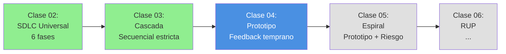

**¿Cómo se conecta esta clase?**

- **Clase 03 (Cascada):** Identificamos el problema → Feedback muy tardío (mes 15+), cambios costosos
- **Clase 04 (Prototipo):** Exploramos la solución → Validar ideas con cliente ANTES de construir
- **Clase 05 (Espiral):** Veremos cómo combinar → Prototipo + Cascada + análisis de riesgos

**El problema que resuelve Prototipo:**

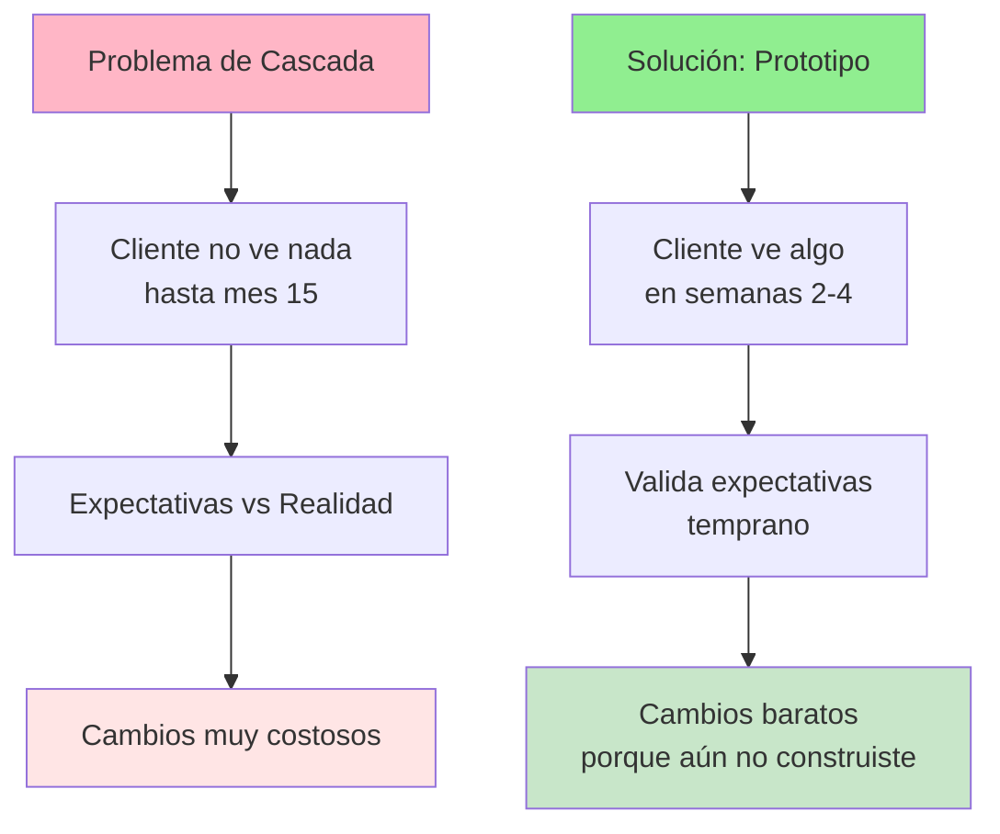

---

### 🧠 Mindmap: Lo que Cubriremos Hoy

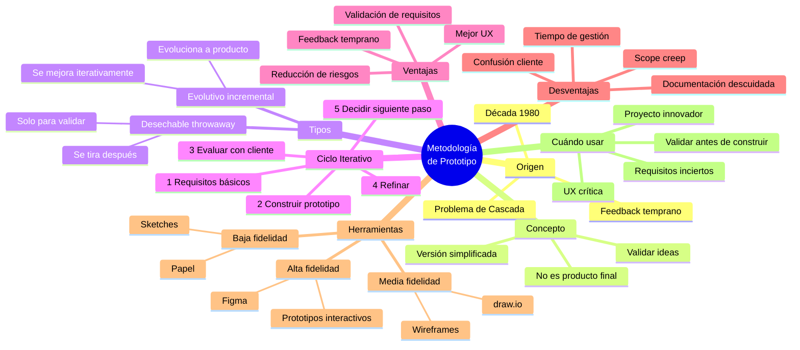

---

### 📊 Comparación Rápida: Cascada vs Prototipo

| Aspecto                  | Cascada (Clase 03)            | Prototipo (Clase 04)         |
| ------------------------ | ----------------------------- | ---------------------------- |
| **Feedback del cliente** | Mes 15+ (muy tardío)          | Semanas 2-4 (temprano)       |
| **Costo de cambios**     | Muy alto ($100K+)             | Bajo ($1K)                   |
| **Riesgo de fracaso**    | Alto (28%)                    | Medio-Bajo                   |
| **Documentación**        | Exhaustiva                    | Flexible                     |
| **Apropiado para**       | Requisitos claros             | Requisitos inciertos         |
| **Filosofía**            | "Hacerlo bien la primera vez" | "Validar antes de construir" |

**La pregunta clave de hoy:**

> "¿Y si pudiéramos mostrarle algo al cliente ANTES de invertir 15 meses y $2M?"

---

## 🔙 BLOQUE 1: Revisión y el Problema de Cascada

**Duración:** 10 minutos  
**Modalidad:** Revisión interactiva con elementos visuales

### Objetivo del Bloque

Recordar los conceptos clave de Cascada y enfatizar su problema principal: el feedback tardío del cliente, preparando el terreno para entender por qué surgió la Metodología de Prototipo.

---

### 1.1 Bienvenida y Contexto (2 minutos)

**¡Bienvenidos a la Semana 2!**

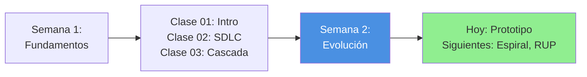

**¿Dónde estamos?**

- ✅ **Ya conocemos:** SDLC (6 fases universales) y Cascada (SDLC secuencial)
- 🎯 **Hoy veremos:** Una alternativa que resuelve el problema más grande de Cascada
- 🔜 **Próximamente:** Más metodologías que combinan lo mejor de ambas

---

### 1.2 Repaso Rápido de Cascada (3 minutos)

**Recordemos los puntos clave de la clase anterior:**

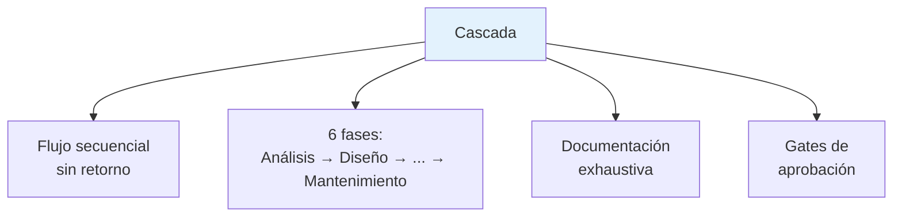

**¿Cuándo vimos que Cascada funciona bien?**

- ✅ Requisitos muy estables (ej: sistema de semáforos)
- ✅ Regulación estricta (ej: banca, salud)
- ✅ Documentación crítica (ej: auditorías)

**Pregunta rápida al grupo:**

> "¿Alguien recuerda cuál fue el problema MÁS GRANDE de Cascada que discutimos?"

<details>
<summary>Respuesta esperada</summary>

**Feedback muy tardío** - El cliente no ve el producto hasta casi el final (mes 15+)

</details>

---

### 1.3 El Problema del Feedback Tardío (5 minutos)

#### Recordemos el Caso del Hospital (Clase 03)

En el proyecto del hospital que vimos:

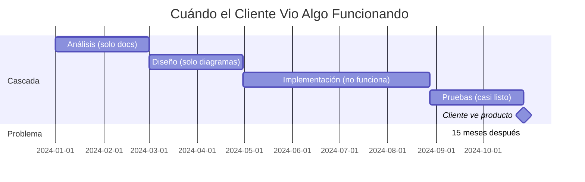

**¿Qué pasó?**

- 📅 **Mes 1-12:** Cliente solo vio documentos y diagramas
- 📅 **Mes 13-15:** Primera vez que usa el sistema real en UAT
- ⚠️ **Mes 15:** "La interfaz no es lo que esperaba", "Este flujo es confuso"
- 💸 **Resultado:** Cambios muy costosos o imposibles de hacer

#### El Ciclo Vicioso del Feedback Tardío

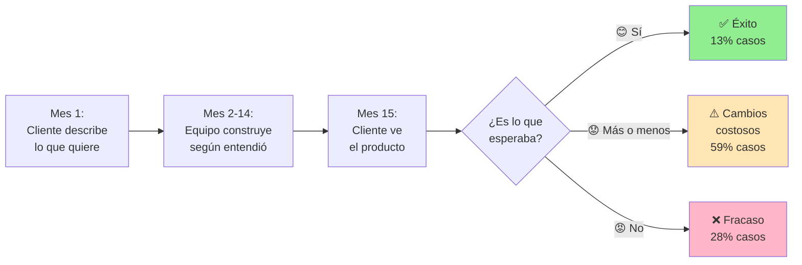

**Estadística del Standish Group (2020):**

- Solo el **13%** de proyectos Cascada son exitosos
- El **59%** requieren cambios mayores
- El **28%** fallan completamente

#### ¿Por Qué Es Tan Grave?

**Problema 1: Expectativas vs Realidad**

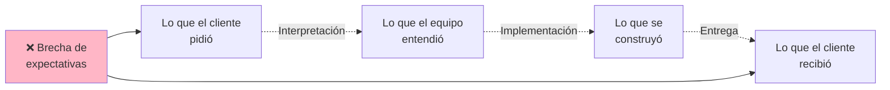

**Ejemplo real del hospital:**

| Cliente dijo                         | Equipo entendió              | Se construyó                          | Cliente quería realmente              |
| ------------------------------------ | ---------------------------- | ------------------------------------- | ------------------------------------- |
| "Quiero buscar pacientes fácilmente" | Sistema de búsqueda avanzada | 15 filtros, 3 tabs, búsqueda compleja | Barra simple: escribir nombre y Enter |

**Problema 2: Descubres errores cuando es costosísimo corregirlos**

Recordemos la tabla de costos de cambio:

| Fase donde se detecta el error | Costo de corregir | Tiempo        |
| ------------------------------ | ----------------- | ------------- |
| Análisis (mes 1-2)             | $1,000            | 1 día         |
| Diseño (mes 3-5)               | $5,000            | 1 semana      |
| Implementación (mes 6-12)      | $25,000           | 2-3 semanas   |
| **Pruebas/UAT (mes 13-15)**    | **$50,000**       | **1-2 meses** |
| Producción (mes 16+)           | $100,000+         | 3+ meses      |

**En UAT es cuando FINALMENTE el cliente ve el sistema... pero ya gastaste 90% del presupuesto.**

#### Problema 3: El Cliente No Sabe Lo Que Quiere (Hasta Que Lo Ve)

**Frase famosa en la industria:**

> "No sé lo que quiero, pero sé lo que NO quiero cuando lo veo."  
> — Casi todos los clientes

**Analogía:**

Imagina pedirle a un arquitecto que diseñe tu casa ideal. Le describes TODO en palabras:

- "Quiero cocina moderna"
- "Sala de estar espaciosa"
- "Baño minimalista"

El arquitecto diseña y construye la casa durante 12 meses.

**Mes 12:** Entras a tu casa nueva y dices:

- "Esta cocina es demasiado oscura"
- "La sala está muy lejos de la cocina"
- "El baño es demasiado frío y vacío"

**Pero ya está construida.** Cambiar ahora cuesta el doble.

**¿Qué hubiera sido mejor?**

Que el arquitecto te mostrara:

1. **Mes 1:** Bocetos (baja fidelidad)
2. **Mes 2:** Maqueta 3D (media fidelidad)
3. **Mes 3:** Habitación de muestra construida (alta fidelidad)

En cada paso ajustas ANTES de construir toda la casa.

**Esto es exactamente lo que hace la Metodología de Prototipo en software.**

---

### 1.4 La Pregunta que Cambió Todo (1 minuto)

En la década de 1980, los desarrolladores empezaron a preguntarse:

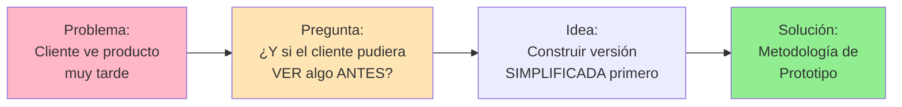

**La premisa básica:**

> "Es mejor invertir 2 semanas en un prototipo que se puede tirar, que 12 meses en un producto que el cliente rechaza."

---

### 📊 Resumen del Bloque 1

**Lo que recordamos:**

- ✅ Cascada = flujo secuencial, documentación exhaustiva, feedback tardío
- ✅ El problema MÁS GRAVE: Cliente no ve nada hasta mes 15
- ✅ Consecuencias: expectativas vs realidad, errores costosos, cliente no sabe qué quiere
- ✅ Estadística: Solo 13% de proyectos Cascada son exitosos

**La pregunta clave:**

> "¿Cómo podemos mostrarle algo al cliente en SEMANAS en lugar de MESES?"

**Próximo paso:**

Veamos qué es un prototipo y cómo resuelve este problema.

---

## 💡 BLOQUE 2: ¿Qué es un Prototipo?

**Duración:** 30 minutos  
**Modalidad:** Expositiva con analogías y ejemplos visuales

### Objetivo del Bloque

Comprender qué es un prototipo de software, su historia, y los diferentes tipos que existen (desechable vs evolutivo).

---

### 2.1 Concepto de Prototipo (10 minutos)

#### Definición

> **Prototipo:** Versión simplificada, funcional o no funcional, de un sistema que se construye para validar ideas, requisitos o diseños ANTES de invertir recursos en la implementación completa.

**En palabras simples:**

Un prototipo es como un **"borrador interactivo"** del software final.

#### ¿Qué ES un Prototipo?

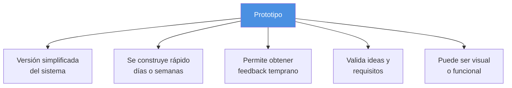

#### ¿Qué NO ES un Prototipo?

| ❌ NO es                    | ✅ ES                                    |
| --------------------------- | ---------------------------------------- |
| El producto final           | Una herramienta de validación            |
| Completamente funcional     | Funcionalmente limitado o solo visual    |
| Optimizado y escalable      | Rápido y descartable                     |
| Para uso en producción      | Para experimentar y aprender             |
| Con toda la arquitectura    | Con arquitectura simplificada o sin ella |
| Documentado exhaustivamente | Documentado lo mínimo necesario          |

#### Analogías del Mundo Real

**1. Arquitectura - Maquetas de Edificios**

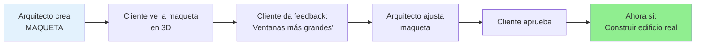

**Costo de cambios:**

- Mover una ventana en la maqueta: $0 (5 minutos)
- Mover una ventana en edificio construido: $50,000+ (semanas)

**2. Automoción - Concept Cars**

Antes de fabricar 100,000 autos, las marcas construyen:

- **Sketches** (bocetos en papel)
- **Renders 3D** (visualización digital)
- **Clay models** (modelos en arcilla a escala real)
- **Concept car funcional** (1 unidad que funciona)

Solo DESPUÉS de validar con clientes y prensa → Producción masiva

**3. Películas - Storyboards**

```markdown
Antes de filmar (millones $):

1. Guion escrito
2. Storyboard (dibujos de cada escena)
3. Animatic (storyboard con movimiento)
4. Scene test (grabar escena de prueba)
5. AHORA SÍ: Filmar película completa
```

**4. Cocina - Probar Recetas**

Chef probando nuevo plato:

- No cocina para 200 personas de inmediato
- Cocina 1 plato de prueba
- Lo prueba él/ella mismo
- Lo prueba con 2-3 personas
- Ajusta sal, tiempo de cocción, presentación
- AHORA SÍ: Agrega al menú del restaurante

#### En Software: ¿Qué Incluye un Prototipo?

**Lo que SÍ tiene un prototipo típico:**

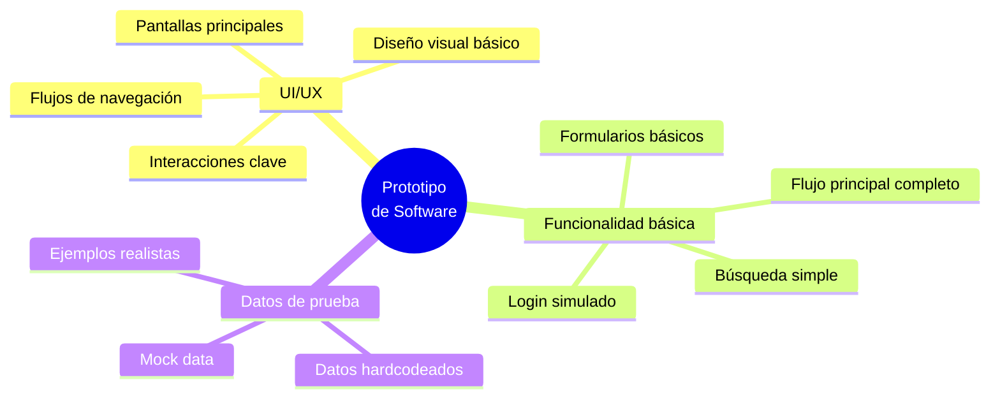

**Lo que NO tiene (generalmente):**

- ❌ Base de datos real (usa datos ficticios)
- ❌ Seguridad robusta (login simulado)
- ❌ Optimización de performance
- ❌ Manejo completo de errores
- ❌ Escalabilidad
- ❌ Integración con sistemas externos
- ❌ Documentación técnica exhaustiva

#### Ejemplo Visual: E-commerce de Ropa

**Producto Final (12 meses):**

- Base de datos con 50,000 productos
- Sistema de pagos integrado (Stripe, PayPal, WebPay)
- Gestión de inventario en tiempo real
- Sistema de recomendaciones con IA
- Carrito persistente
- Tracking de envíos
- Sistema de reviews
- Panel de administración completo

**Prototipo (2 semanas):**

- 10 productos de ejemplo hardcodeados
- Botón de "Comprar" que solo muestra mensaje de éxito
- Carrito funcional pero datos se pierden al refrescar
- Búsqueda básica por nombre
- 5 pantallas principales: Home, Catálogo, Detalle, Carrito, Checkout

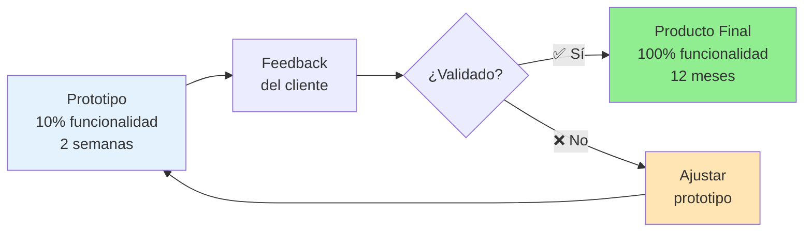

---

### 2.2 Historia y Surgimiento (8 minutos)

#### Década de 1980: La Respuesta a Cascada

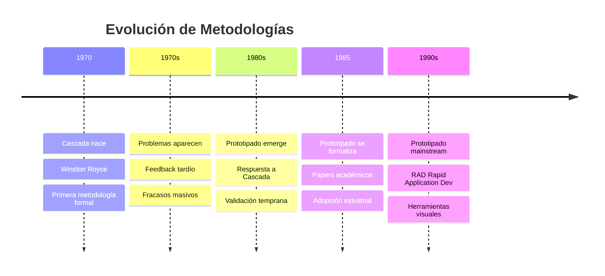

#### ¿Por Qué Surgió en los 80s?

**Factores clave:**

1. **Fracasos masivos de Cascada se volvieron evidentes**

   - Estadísticas mostraban 70%+ de fracasos
   - Costos de cambios tardíos eran insostenibles

2. **Nuevas herramientas gráficas**

   - GUI (Graphical User Interfaces) empezaron a ser importantes
   - Visual Basic, HyperCard permitían prototipar rápido
   - Antes todo era línea de comandos (difícil de prototipar)

3. **Influencia de otras industrias**

   - Arquitectura usaba maquetas hace décadas
   - Diseño industrial usaba prototipos físicos
   - ¿Por qué software no podía hacer lo mismo?

4. **Cliente cada vez más involucrado**
   - Software pasó de ser solo para técnicos a usuarios finales
   - UX se volvió crítica
   - "Ver para creer" se volvió necesario

#### Primeros Casos Exitosos

**NASA - Software Espacial (1983)**

Proyecto: Sistema de control para shuttle

- **Antes:** Cascada pura, cambios muy costosos
- **Experimento:** Construir prototipo de interfaz de control
- **Resultado:** Astronautas probaron prototipo, dieron feedback crucial
- **Impacto:** Evitaron 18 meses de rediseño

**IBM - Personal Computer (1985)**

Proyecto: Software de productividad (procesador de texto)

- **Prototipo:** Interfaces con funcionalidad simulada
- **Feedback:** Usuarios prefirieron menús vs línea de comandos
- **Cambio:** Pivotaron enfoque completamente
- **Éxito:** Producto final muy exitoso

#### Formalización Académica

**Barry Boehm (1986)** - Paper importante:

> "A Spiral Model of Software Development and Enhancement"

Propuso combinar:

- Prototipado para reducir riesgos
- Cascada para fases bien entendidas
- Análisis de riesgos continuo

(Esto lo veremos en la próxima clase - Modelo Espiral)

---

### 2.3 Tipos de Prototipos (12 minutos)

Existen **DOS tipos principales** de prototipos:

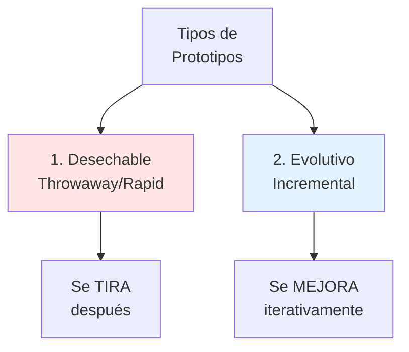

---

#### Tipo 1: Prototipo Desechable (Throwaway / Rapid Prototyping)

**Definición:**

> Se construye **solo para validar ideas** y luego se **descarta completamente**. NO se convierte en el producto final.

**Características:**

- ⚡ Muy rápido de construir (días, no semanas)
- 🎨 Enfoque en lo visual (UI/UX)
- 🗑️ Se tira después de obtener feedback
- 📝 Código "sucio" está bien (no importa la calidad)
- 🔄 Puede haber múltiples prototipos desechables

**Analogía:**

Como **bocetos en papel** de un artista:

- Dibuja 10 versiones rápidas
- Ve cuál funciona mejor
- Tira los bocetos
- Pinta el cuadro final desde cero

**Proceso típico:**

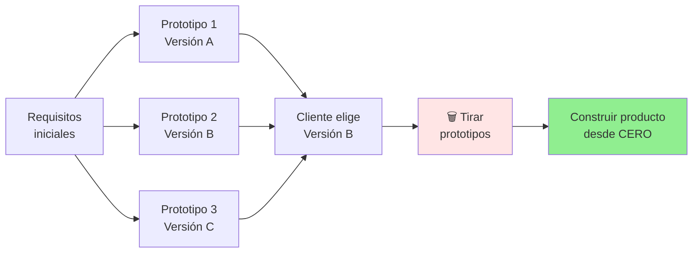

**Herramientas comunes:**

- Papel y lápiz (wireframes físicos)
- Figma / Adobe XD (mockups)
- PowerPoint (presentaciones interactivas)
- HTML/CSS estático (sin backend)

**Ejemplo real:**

**Startup de App de Delivery:**

**Semana 1:**

- Crear 3 prototipos en Figma
- Versión A: Enfoque en restaurantes
- Versión B: Enfoque en productos de supermercado
- Versión C: Ambos combinados

**Semana 2:**

- Mostrar a 20 usuarios potenciales
- 15 prefieren Versión B
- Decisión: Enfocarse en supermercados

**Semana 3:**

- 🗑️ Tirar los 3 prototipos de Figma
- Empezar a construir app real con React Native
- Código completamente nuevo

**Ventajas:**

✅ Muy rápido (días)  
✅ Muy barato  
✅ Puedes probar varias ideas en paralelo  
✅ Sin preocupación por código limpio  
✅ Fácil de cambiar radicalmente

**Desventajas:**

❌ NO tienes código reutilizable  
❌ Trabajo "desperdiciado" (aunque validaste ideas)  
❌ Cliente puede confundirse ("¿Por qué empezar de cero?")

**¿Cuándo usar Desechable?**

- Requisitos MUY inciertos
- Explorar múltiples opciones de diseño
- Validar concepto antes de invertir
- Proyecto nuevo/innovador
- Tienes presupuesto limitado para exploración

---

#### Tipo 2: Prototipo Evolutivo (Incremental / Evolutionary)

**Definición:**

> Se construye una versión inicial simple y se va **mejorando iterativamente** hasta convertirse en el producto final. El prototipo EVOLUCIONA.

**Características:**

- 🏗️ Se construye con arquitectura real desde el inicio
- 📈 Crece incrementalmente
- ♻️ Código se reutiliza y mejora
- 🎯 Cada iteración agrega funcionalidad
- 🚀 El prototipo final ES el producto

**Analogía:**

Como **construir una casa por etapas**:

- Mes 1: Estructura básica (paredes, techo)
- Mes 2: Instalaciones (agua, luz)
- Mes 3: Acabados (pintura, pisos)
- Mes 4: Decoración
- La casa es la MISMA desde el inicio, solo se mejora

**Proceso típico:**

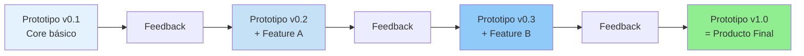

**Herramientas comunes:**

- React / Angular / Vue (frameworks reales)
- Node.js / Django / Laravel (backend real)
- PostgreSQL / MongoDB (base de datos real)
- Git (control de versiones desde el inicio)

**Ejemplo real:**

**Plataforma Educativa Online:**

**Iteración 1 (Semana 1-2): MVP**

- Login real
- Ver listado de 5 cursos
- Reproducir videos
- Base de datos simple

**Iteración 2 (Semana 3-4):**

- Agregar sistema de quiz
- Progreso del estudiante
- Mejorar UI/UX según feedback

**Iteración 3 (Semana 5-6):**

- Foro de discusión
- Certificados
- Panel de administrador

**Iteración 4 (Semana 7-8):**

- Sistema de pagos
- Recomendaciones
- Notificaciones

**Lanzamiento (Semana 9):**

- La versión actual ES el producto final
- Todo el código se reutilizó

**Ventajas:**

✅ Código se reutiliza (no se desperdicia trabajo)  
✅ Feedback continuo mejora el producto  
✅ Cliente ve evolución real  
✅ Lanzamiento más rápido (MVP temprano)  
✅ Menos riesgo (validación continua)

**Desventajas:**

❌ Requiere arquitectura desde el inicio  
❌ Más lento que prototipo desechable inicial  
❌ Puede acumular "deuda técnica" si no se cuida  
❌ Difícil cambiar arquitectura después

**¿Cuándo usar Evolutivo?**

- Requisitos relativamente claros
- Proyecto a mediano/largo plazo
- Equipo técnico capaz de arquitectura desde inicio
- Quieres lanzar MVP y mejorar
- Presupuesto para desarrollo continuo

---

#### Comparación: Desechable vs Evolutivo

| Aspecto               | Desechable (Throwaway)           | Evolutivo (Incremental)     |
| --------------------- | -------------------------------- | --------------------------- |
| **Objetivo**          | Validar ideas                    | Construir producto          |
| **Velocidad inicial** | Muy rápido (días)                | Medio (semanas)             |
| **Calidad de código** | Baja (no importa)                | Alta (será producción)      |
| **Reutilización**     | 0% (se tira)                     | 100% (se mejora)            |
| **Arquitectura**      | No necesaria                     | Necesaria desde inicio      |
| **Herramientas**      | Figma, papel, mockups            | React, Node.js, BD real     |
| **Resultado final**   | Se construye desde cero          | El prototipo ES el producto |
| **Costo total**       | Bajo inicial, medio-alto después | Medio continuo              |
| **Apropiado para**    | Explorar opciones                | Desarrollo incremental      |

**Visual comparativo:**

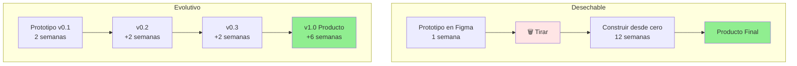

---

#### ¿Cuál Elegir?

**Usa Desechable cuando:**

- ✅ No sabes qué quieres (exploración)
- ✅ Necesitas validar varias opciones
- ✅ Presupuesto muy limitado para exploración
- ✅ Proyecto muy innovador/riesgoso

**Usa Evolutivo cuando:**

- ✅ Tienes idea relativamente clara
- ✅ Quieres lanzar MVP rápido
- ✅ Desarrollo continuo a largo plazo
- ✅ Tienes equipo técnico sólido

**En la práctica, muchos proyectos usan AMBOS:**

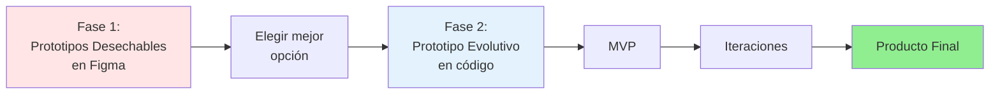

**Ejemplo:** Spotify en sus inicios (2006):

1. Sketches en papel (desechable)
2. Mockups en Photoshop (desechable)
3. Prototipo funcional simple (evolutivo)
4. Iteraciones continuas (evolutivo)
5. Spotify actual

---

### 📊 Resumen del Bloque 2

**Lo que aprendimos:**

- ✅ **Prototipo** = Versión simplificada para validar ideas
- ✅ **NO es** el producto final (aunque evolutivo puede serlo)
- ✅ **Analogías:** Maquetas, concept cars, storyboards, recetas de prueba
- ✅ **Historia:** Surgió en los 80s como respuesta a Cascada
- ✅ **Tipo 1:** Desechable (throwaway) - Se tira después
- ✅ **Tipo 2:** Evolutivo (incremental) - Se mejora hasta ser el producto
- ✅ **Diferencia clave:** Reutilización de código (0% vs 100%)

**Próximo paso:**

Tomar una pausa de 10 minutos y luego veremos el ciclo completo de prototipado con un caso real.

---

## ☕ PAUSA

**Duración:** 10 minutos  
**Instrucciones:** Estirar, ir al baño, tomar agua.

---

## 🔄 BLOQUE 3: Ciclo de Prototipado

**Duración:** 30 minutos  
**Modalidad:** Expositiva + Caso real paso a paso

### Objetivo del Bloque

Comprender el ciclo iterativo de prototipado y aplicarlo a un caso real (App de Reservas de Restaurantes).

---

### 3.1 El Ciclo de Prototipado (10 minutos)

A diferencia de Cascada (que es **lineal**), Prototipado es **cíclico**.

#### Diagrama del Ciclo

```mermaid
graph LR
    A[1. Identificar<br/>Requisitos Básicos] --> B[2. Desarrollar<br/>Prototipo]
    B --> C[3. Revisar<br/>con Cliente]
    C --> D{¿Cliente<br/>satisfecho?}
    D -->|❌ No| E[4. Refinar<br/>Requisitos]
    E --> B
    D -->|✅ Sí| F[5. Producto<br/>Final]

    style A fill:#E3F2FD
    style B fill:#FFE5B4
    style C fill:#E8F5E9
    style D fill:#FFF9C4
    style E fill:#FFCDD2
    style F fill:#90EE90
```

---

#### Fase 1: Identificar Requisitos Básicos

**Objetivo:** Capturar la idea central SIN entrar en detalles.

**Duración:** Horas o días (NO meses)

**Actividades:**

- Reunión breve con cliente (1-2 horas)
- Identificar 3-5 funcionalidades CORE
- Crear user stories básicas
- Definir pantallas principales

**Ejemplo:**

```markdown
Cliente: "Quiero una app de delivery de comida"

Requisitos básicos:

1. Ver restaurantes cerca
2. Ver menú de un restaurante
3. Agregar productos al carrito
4. Hacer pedido
5. Trackear pedido

NO incluir aún:

- Sistema de puntos
- Cupones
- Chat con repartidor
- Reviews
```

**Pregunta clave:**

> "¿Cuál es la funcionalidad MÍNIMA que hace que esto sea útil?"

**Diferencia con Cascada:**

| Aspecto     | Cascada                       | Prototipado            |
| ----------- | ----------------------------- | ---------------------- |
| Profundidad | Documentar TODO               | Solo lo esencial       |
| Duración    | Semanas/meses                 | Horas/días             |
| Resultado   | SRS de 50 páginas             | 1-2 páginas + sketches |
| Detalle     | Cada campo, regla, validación | Flujo general          |

---

#### Fase 2: Desarrollar Prototipo

**Objetivo:** Construir versión simplificada RÁPIDO.

**Duración:** Días o 1-2 semanas (NO meses)

**Actividades:**

- Crear wireframes o mockups
- Implementar flujo principal
- Usar datos de prueba
- Ignorar edge cases por ahora

**Niveles de fidelidad:**

```mermaid
graph LR
    A[Baja Fidelidad<br/>Paper/Sketches<br/>Horas] --> B[Media Fidelidad<br/>Wireframes digitales<br/>Días]
    B --> C[Alta Fidelidad<br/>Mockups realistas<br/>1-2 semanas]
    C --> D[Funcional<br/>Código + backend<br/>2-4 semanas]

    style A fill:#E3F2FD
    style B fill:#C5E1F5
    style C fill:#90CAF9
    style D fill:#64B5F6
```

**Regla de oro:**

> "Construir lo mínimo necesario para que el cliente pueda dar feedback significativo."

**Ejemplo de priorización:**

✅ **SÍ incluir:**

- Login (simulado o real simple)
- Navegación entre pantallas
- Flujo completo de la función principal
- UI representativa del look & feel

❌ **NO incluir aún:**

- Validaciones exhaustivas
- Manejo de errores complejo
- Optimización de performance
- Seguridad robusta
- Features secundarias

---

#### Fase 3: Revisar con Cliente

**Objetivo:** Obtener feedback honesto y específico.

**Duración:** 1-2 horas

**Actividades:**

- Demo del prototipo
- Cliente interactúa directamente
- Tomar notas de feedback
- Priorizar cambios

**Técnica de presentación:**

```markdown
1. Explicar que es un PROTOTIPO (no el producto final)
2. Mostrar el flujo principal
3. Dejar que el cliente explore
4. Hacer preguntas específicas:
   - "¿Este flujo tiene sentido?"
   - "¿Esta pantalla te confunde?"
   - "¿Qué esperabas que pasara aquí?"
5. NO defenderse, solo escuchar
```

**Tipos de feedback:**

```mermaid
mindmap
  root((Feedback))
    Usabilidad
      Flujo confuso
      Botón no se ve
      Muchos pasos
    Funcionalidad
      Falta feature X
      Y no sirve
      Z está de más
    Visual
      Colores
      Texto ilegible
      Muy simple/complejo
    Expectativas
      No es lo que imaginé
      Quiero agregar A B C
```

**Pregunta clave después de la demo:**

> "Si tuvieras que elegir SOLO 3 cosas para mejorar, ¿cuáles serían?"

Esto evita lista infinita de cambios.

---

#### Fase 4: Refinar Requisitos

**Objetivo:** Ajustar la visión basado en feedback.

**Duración:** Horas

**Actividades:**

- Analizar feedback
- Priorizar cambios (Must have / Nice to have)
- Ajustar requisitos
- Decidir: ¿Nueva iteración o continuar?

**Matriz de priorización:**

| Impacto  | Esfuerzo Bajo    | Esfuerzo Alto |
| -------- | ---------------- | ------------- |
| **Alto** | 🟢 Hacer YA      | 🟡 Considerar |
| **Bajo** | 🟡 Si hay tiempo | 🔴 Descartar  |

**Ejemplo de refinamiento:**

```markdown
Feedback recibido:

1. "Botón de buscar no se ve" → 🟢 Cambio rápido
2. "Quiero filtrar por precio" → 🟢 Feature útil y factible
3. "Agregar sistema de puntos de fidelidad" → 🔴 Muy complejo, dejar para v2
4. "Cambiar color azul a verde" → 🟡 Cambio estético, baja prioridad
```

**Decisión: ¿Otra iteración?**

```mermaid
graph LR
    A{Feedback<br/>recibido} --> B{¿Cambios<br/>mayores?}
    B -->|Sí| C[Nueva iteración<br/>de prototipo]
    B -->|No| D{¿Cliente<br/>aprueba?}
    D -->|No| C
    D -->|Sí| E[Continuar a<br/>desarrollo final]

    style E fill:#90EE90
    style C fill:#FFE5B4
```

**Típicamente:** 2-4 iteraciones son suficientes.

---

#### Fase 5: Producto Final

**Objetivo:** Construir el sistema completo basado en prototipo validado.

**Duración:** Semanas o meses (según proyecto)

**Diferencias con prototipo:**

| Aspecto        | Prototipo      | Producto Final           |
| -------------- | -------------- | ------------------------ |
| Arquitectura   | Simple/ninguna | Robusta y escalable      |
| Base de datos  | Mock data      | Real y normalizada       |
| Seguridad      | Básica/ninguna | Completa (auth, encrypt) |
| Manejo errores | Mínimo         | Exhaustivo               |
| Performance    | No optimizado  | Optimizado               |
| Testing        | Mínimo         | Completo (unit, e2e)     |
| Documentación  | Mínima         | Completa                 |

**Proceso:**

- Si fue **prototipo desechable** → Construir desde cero con el aprendizaje
- Si fue **prototipo evolutivo** → Refactorizar y completar el código existente

---

### 3.2 Caso Real Paso a Paso: App de Reservas de Restaurantes (20 minutos)

Ahora veamos un caso completo aplicando el ciclo.

#### Contexto

**Cliente:** Juan, dueño de 3 restaurantes  
**Problema:** Recibe muchas llamadas para reservas, se confunde con el papel  
**Solicitud:** "Quiero una app donde la gente reserve mesas"

---

#### 🔄 Iteración 1: Primera Versión

##### Fase 1: Requisitos Básicos (1 hora)

**Reunión con Juan:**

```markdown
Pregunta: "¿Cuál es el flujo mínimo que necesitas?"

Juan responde:

1. Cliente ve mis restaurantes
2. Cliente elige fecha y hora
3. Cliente reserva
4. Yo veo las reservas del día

Pregunta: "¿Qué datos necesitas del cliente?"

- Nombre
- Teléfono
- Cantidad de personas
```

**User stories extraídas:**

```markdown
1. Como cliente, quiero ver los restaurantes disponibles
2. Como cliente, quiero elegir fecha/hora/personas
3. Como cliente, quiero confirmar mi reserva
4. Como dueño, quiero ver todas las reservas del día
```

**Decisiones tempranas:**

- NO incluir: Pago anticipado, menú, fotos de platos
- Enfoque: Reservas solamente

##### Fase 2: Desarrollar Prototipo (1 semana)

**Herramienta:** Figma (prototipo desechable)

**Pantallas creadas:**

```mermaid
graph LR
    A[Home:<br/>Lista<br/>restaurantes] --> B[Detalle:<br/>Seleccionar<br/>fecha/hora]
    B --> C[Formulario:<br/>Datos<br/>personales]
    C --> D[Confirmación:<br/>Reserva<br/>exitosa]

    style A fill:#E3F2FD
    style B fill:#C5E1F5
    style C fill:#90CAF9
    style D fill:#90EE90
```

**Pantalla 1: Lista de Restaurantes**

```
┌─────────────────────────────┐
│  MIS RESTAURANTES           │
├─────────────────────────────┤
│  📍 La Pasta Feliz          │
│     Italiano - Centro       │
│     [Ver disponibilidad]    │
├─────────────────────────────┤
│  📍 Sushi Express           │
│     Japonés - Providencia   │
│     [Ver disponibilidad]    │
├─────────────────────────────┤
│  📍 El Asado Perfecto       │
│     Carnes - Las Condes     │
│     [Ver disponibilidad]    │
└─────────────────────────────┘
```

**Pantalla 2: Selección Fecha/Hora**

```
┌─────────────────────────────┐
│  LA PASTA FELIZ             │
├─────────────────────────────┤
│  📅 Fecha: [15/Nov/2025]    │
│  ⏰ Hora:  [19:00]          │
│  👥 Personas: [4]           │
├─────────────────────────────┤
│  Mesas disponibles: 5       │
│                             │
│       [Continuar]           │
└─────────────────────────────┘
```

**Pantalla 3: Datos Personales**

```
┌─────────────────────────────┐
│  CONFIRMA TU RESERVA        │
├─────────────────────────────┤
│  Nombre: [________]         │
│  Teléfono: [________]       │
│  Email: [________]          │
│                             │
│  Resumen:                   │
│  La Pasta Feliz             │
│  15/Nov/2025 - 19:00        │
│  4 personas                 │
│                             │
│       [Reservar]            │
└─────────────────────────────┘
```

**Pantalla 4: Confirmación**

```
┌─────────────────────────────┐
│         ✅                  │
│  RESERVA CONFIRMADA         │
├─────────────────────────────┤
│  Código: #R12345            │
│                             │
│  La Pasta Feliz             │
│  15/Nov/2025 - 19:00        │
│  4 personas                 │
│                             │
│  Te enviamos confirmación   │
│  por email y SMS            │
│                             │
│    [Ver mis reservas]       │
└─────────────────────────────┘
```

**Panel Admin (pantalla extra):**

```
┌─────────────────────────────┐
│  RESERVAS HOY               │
├─────────────────────────────┤
│  19:00 - Mesa 5             │
│  Juan Pérez - 4 personas    │
│  📞 +56912345678            │
│  [✅ Confirmar] [❌ Anular] │
├─────────────────────────────┤
│  20:00 - Mesa 3             │
│  María López - 2 personas   │
│  📞 +56987654321            │
│  [✅ Confirmar] [❌ Anular] │
└─────────────────────────────┘
```

##### Fase 3: Revisar con Cliente (1 hora)

**Demo a Juan:**

Juan interactúa con el prototipo en Figma.

**Feedback recibido:**

```markdown
✅ Lo que le gustó:

- "Está súper simple, me gusta"
- "El panel admin es justo lo que necesito"

❌ Lo que falta:

- "¿Cómo sé cuántas mesas tengo disponibles?"
- "Quiero poder bloquear horarios cuando estamos llenos"
- "¿Qué pasa si el cliente no llega? Necesito registrar no-shows"

🤔 Dudas:

- "¿El cliente puede cancelar?"
- "¿Puedo ver reservas de la semana completa?"
```

##### Fase 4: Refinar Requisitos (30 min)

**Análisis de feedback:**

```markdown
Must have (para iteración 2):

1. Gestión de capacidad por restaurante
2. Bloquear horarios manualmente
3. Botón de cancelación para cliente

Nice to have (versión futura): 4. Registro de no-shows 5. Vista semanal de reservas 6. Notificaciones automáticas
```

**Decisión:** Nueva iteración necesaria.

---

#### 🔄 Iteración 2: Versión Mejorada

##### Fase 2: Desarrollar Prototipo v2 (3 días)

**Cambios implementados:**

**1. Configuración de Capacidad (nueva pantalla admin)**

```
┌─────────────────────────────┐
│  CONFIGURACIÓN              │
├─────────────────────────────┤
│  La Pasta Feliz             │
│                             │
│  Mesas totales: [20]        │
│  Capacidad promedio: [4]    │
│                             │
│  Horarios de atención:      │
│  Almuerzo: 12:00 - 15:00    │
│  Cena: 19:00 - 23:00        │
│                             │
│       [Guardar]             │
└─────────────────────────────┘
```

**2. Bloquear Horarios**

Ahora el panel admin tiene:

```
┌─────────────────────────────┐
│  RESERVAS - 15/NOV          │
├─────────────────────────────┤
│  12:00 [🔴 Bloqueado]       │
│  [Desbloquear]              │
├─────────────────────────────┤
│  13:00 - Mesa 8             │
│  Carlos Ruiz - 2 personas   │
│  Disponibles: 18 mesas      │
└─────────────────────────────┘
```

**3. Cancelación para Cliente**

```
┌─────────────────────────────┐
│  MIS RESERVAS               │
├─────────────────────────────┤
│  ✅ La Pasta Feliz          │
│  15/Nov - 19:00 - 4 pers.   │
│  Código: #R12345            │
│  [Cancelar reserva]         │
└─────────────────────────────┘

Al hacer clic en cancelar:
│  ⚠️ ¿Confirmas cancelación? │
│  [Sí, cancelar] [No]        │
```

##### Fase 3: Revisar v2 con Cliente (30 min)

**Feedback de Juan:**

```markdown
✅ "Perfecto, esto es justo lo que necesitaba"
✅ "Ahora sí puedo controlar todo"
✅ "Me encanta poder bloquear horarios"

Sugerencia menor:

- "Sería bueno tener estadísticas, pero no es urgente"
```

##### Fase 4: Refinar

**Decisión:** ✅ Prototipo APROBADO

**Próximo paso:** Construir producto final.

---

#### Fase 5: Producto Final (6 semanas)

Ahora que el prototipo fue validado, el equipo técnico construye la versión real.

**Stack técnico decidido:**

```markdown
Frontend: React Native (app móvil)
Backend: Node.js + Express
Base de datos: PostgreSQL
Hosting: AWS
Notificaciones: Twilio (SMS) + SendGrid (Email)
```

**Arquitectura del sistema:**

```mermaid
graph TB
    A[App Móvil<br/>React Native] --> B[API REST<br/>Node.js]
    B --> C[Base de Datos<br/>PostgreSQL]
    B --> D[Twilio<br/>SMS]
    B --> E[SendGrid<br/>Email]

    F[Panel Admin<br/>React Web] --> B

    style A fill:#E3F2FD
    style F fill:#E3F2FD
    style B fill:#FFE5B4
    style C fill:#90EE90
```

**Modelo de datos (ERD simplificado):**

```mermaid
erDiagram
    RESTAURANTE ||--o{ RESERVA : tiene
    CLIENTE ||--o{ RESERVA : hace

    RESTAURANTE {
        int id PK
        string nombre
        string direccion
        int mesas_totales
        string horario_apertura
        string horario_cierre
    }

    CLIENTE {
        int id PK
        string nombre
        string telefono
        string email
    }

    RESERVA {
        int id PK
        int restaurante_id FK
        int cliente_id FK
        date fecha
        time hora
        int personas
        string estado
        datetime created_at
    }
```

**Cronograma de desarrollo:**

```mermaid
gantt
    title Desarrollo App Reservas
    dateFormat YYYY-MM-DD
    section Backend
    API REST         :2025-01-01, 2w
    Base de datos    :2025-01-08, 1w
    Autenticación    :2025-01-15, 1w
    section Frontend
    App móvil        :2025-01-15, 2w
    Panel admin      :2025-01-22, 1w
    section Testing
    QA               :2025-02-01, 1w
    section Deploy
    Producción       :2025-02-08, 3d
```

**Resultado:**

- App lista en **6 semanas** ✅
- Juan feliz, clientes haciendo reservas ✅
- Sistema funcionando 24/7 ✅

---

### 3.3 Comparación con Cascada

**Si hubiéramos usado Cascada:**

```mermaid
gantt
    title Comparación: Cascada vs Prototipado
    dateFormat YYYY-MM-DD
    section Cascada
    Requisitos       :2025-01-01, 3w
    Diseño completo  :2025-01-22, 3w
    Implementación   :2025-02-12, 8w
    Testing          :2025-04-09, 2w
    Deploy           :2025-04-23, 1w
    Cliente ve resultado :milestone, 2025-04-30, 0d

    section Prototipado
    Prototipo 1      :2025-01-01, 1w
    Feedback 1       :2025-01-08, 1d
    Prototipo 2      :2025-01-09, 3d
    Feedback 2       :2025-01-12, 1d
    Producto final   :2025-01-13, 6w
    Cliente ve resultado :milestone, 2025-02-24, 0d
```

**Diferencias clave:**

| Aspecto                  | Cascada                 | Prototipado                |
| ------------------------ | ----------------------- | -------------------------- |
| **Primer feedback**      | Semana 17 (4 meses)     | Semana 1                   |
| **Iteraciones**          | 0 (todo al final)       | 2+ durante proceso         |
| **Riesgo**               | Alto (todo o nada)      | Bajo (validación continua) |
| **Duración total**       | ~18 semanas             | ~8 semanas                 |
| **Cambios tardíos**      | Muy costosos            | Manejables                 |
| **Satisfacción cliente** | Incierta hasta el final | Validada desde inicio      |

---

### 📊 Resumen del Bloque 3

**Lo que aprendimos:**

- ✅ **Ciclo de Prototipado:** 5 fases iterativas
- ✅ **Fase 1:** Requisitos básicos (horas/días, NO meses)
- ✅ **Fase 2:** Desarrollar prototipo rápido
- ✅ **Fase 3:** Revisar con cliente (feedback directo)
- ✅ **Fase 4:** Refinar requisitos (priorizar cambios)
- ✅ **Fase 5:** Producto final (con aprendizaje validado)
- ✅ **Caso real:** App de Reservas pasó de idea a producto en 8 semanas
- ✅ **Ventaja clave:** Feedback en semana 1, NO en mes 4

**Pregunta para reflexionar:**

> "Si Juan hubiera usado Cascada y después de 4 meses descubre que necesitaba gestión de capacidad, ¿cuánto tiempo y dinero habría perdido?"

**Próximo paso:**

Ahora que entendemos el ciclo, veamos las ventajas y desventajas de Prototipado.

---

## ⚖️ BLOQUE 4: Ventajas y Desventajas de Prototipado

**Duración:** 25 minutos  
**Modalidad:** Expositiva con ejemplos reales y discusión

### Objetivo del Bloque

Identificar cuándo Prototipado es la mejor opción y cuándo puede ser contraproducente, analizando ventajas, desventajas y riesgos asociados.

---

### 4.1 Ventajas del Prototipado (10 minutos)

#### 1. Feedback Temprano y Continuo

**La ventaja #1 de Prototipado.**

```mermaid
graph LR
    A[Idea] --> B[Prototipo<br/>Semana 1]
    B --> C[Feedback<br/>Semana 1]
    C --> D[Ajustes<br/>Semana 2]
    D --> E[Producto<br/>validado]

    style B fill:#E3F2FD
    style C fill:#90EE90
    style E fill:#90EE90
```

**Impacto:**

- Detectar malentendidos en días, NO en meses
- Validar suposiciones antes de invertir mucho
- Cliente se siente escuchado desde el inicio

**Ejemplo real:**

```markdown
Caso: E-commerce de libros

Semana 1 - Prototipo:

- Diseñador asumió que búsqueda por autor era prioritaria
- Cliente probó prototipo: "Nadie busca así, todos buscan por género"

Resultado:

- Cambio en 2 días
- Si hubieran programado todo: 3 semanas desperdiciadas
```

**Estadística clave:**

> **Standish Group:** Detectar un error en fase de prototipo cuesta **$1**.  
> Detectarlo después de deployment cuesta **$100+**.

---

#### 2. Reduce el Riesgo

**Prototipado = Seguro contra fracaso.**

```mermaid
graph LR
    A[Proyecto con Prototipo] --> B{Prototipo<br/>validado?}
    B -->|✅ Sí| C[Continuar con<br/>confianza]
    B -->|❌ No| D[Pivotar o<br/>cancelar]

    E[Proyecto sin Prototipo] --> F[Construir todo]
    F --> G{¿Funciona?}
    G -->|❌ No| H[💸 Pérdida total]

    style C fill:#90EE90
    style D fill:#FFE5B4
    style H fill:#FFCDD2
```

**Tipos de riesgos que reduce:**

| Riesgo                        | Sin Prototipo | Con Prototipo |
| ----------------------------- | ------------- | ------------- |
| **Funcionalidad incorrecta**  | Alta          | Baja          |
| **UI/UX confusa**             | Alta          | Baja          |
| **Expectativas no alineadas** | Alta          | Baja          |
| **Features innecesarias**     | Media         | Baja          |
| **Arquitectura incorrecta**   | Media         | Media         |

**Caso real: Startup que se salvó**

```markdown
Startup: App de citas para músicos
Presupuesto: $50,000
Plan inicial: 6 meses de desarrollo

Decisión: Invertir $5,000 en prototipo primero

Prototipo (2 semanas):

- Mostraron a 50 músicos
- 48 dijeron: "No lo usaría, prefiero Instagram"

Resultado:

- Cancelaron proyecto
- Ahorraron $45,000
- Pivotaron a otra idea
```

**Sin prototipo:** Habrían perdido $50,000 + 6 meses.

---

#### 3. Mejor Comunicación con el Cliente

**Imágenes valen más que mil palabras.**

```mermaid
mindmap
  root((Comunicación))
    Documento escrito
      Ambiguo
      Aburrido
      Difícil de entender
      Cliente no lee
    Prototipo
      Visual
      Interactivo
      Claro
      Cliente PRUEBA
```

**Problema típico sin prototipo:**

```markdown
Desarrollador: "El sistema tendrá un dashboard con métricas en tiempo real"
Cliente piensa: Dashboard de Excel
Desarrollador piensa: Dashboard de analítica avanzada con gráficos

Resultado: Malentendido que cuesta semanas
```

**Con prototipo:**

```markdown
Desarrollador: "Mira, esto es lo que tendrás"
Cliente: "Ah ok, pero quiero que este gráfico sea más grande"

Resultado: Ajuste en minutos
```

**Ventaja psicológica:**

> Cliente que VE el prototipo se siente parte del proceso.  
> Cliente que solo recibe documentos se siente ajeno.

---

#### 4. Identifica Requisitos Ocultos

**Cliente no sabe lo que quiere hasta que lo ve.**

```mermaid
graph LR
    A[Cliente cree<br/>que sabe] --> B[Ve prototipo]
    B --> C[Descubre lo que<br/>realmente necesita]
    C --> D[Requisitos<br/>refinados]

    style A fill:#FFE5E5
    style C fill:#90EE90
    style D fill:#90EE90
```

**Ejemplo clásico:**

```markdown
Proyecto: CRM para ventas

Requisitos iniciales del cliente:

1. Registrar clientes
2. Registrar ventas
3. Ver reportes

Prototipo mostrado:
Cliente: "Ah, pero necesito ver CUÁNDO fue el último contacto con cada cliente"
Cliente: "Y necesito alertas si pasan 30 días sin contactar"
Cliente: "Y quiero exportar a Excel"

Ninguno de estos requisitos estaba en la lista inicial.
```

**Concepto: Requisitos emergentes**

```mermaid
graph TB
    A[Requisitos<br/>Explícitos<br/>20%] --> B[Prototipo]
    C[Requisitos<br/>Implícitos<br/>30%] --> B
    D[Requisitos<br/>Desconocidos<br/>50%] --> B

    B --> E[Requisitos<br/>Completos<br/>100%]

    style A fill:#E3F2FD
    style C fill:#FFE5B4
    style D fill:#FFCDD2
    style E fill:#90EE90
```

**Estadística:**

> **IEEE Software:** En promedio, el 50% de los requisitos emergen DESPUÉS de ver el prototipo.

---

#### 5. Desarrollo Más Rápido (Paradoja)

**Invertir tiempo en prototipo ahorra tiempo total.**

```mermaid
gantt
    title Sin Prototipo vs Con Prototipo
    dateFormat YYYY-MM-DD
    section Sin Prototipo
    Requisitos         :2025-01-01, 2w
    Desarrollo         :2025-01-15, 10w
    Testing            :2025-03-26, 2w
    Bugs y cambios     :crit, 2025-04-09, 6w
    Rediseño           :crit, 2025-05-21, 4w
    TOTAL 24 semanas   :milestone, 2025-06-18, 0d

    section Con Prototipo
    Prototipo 1        :2025-01-01, 1w
    Feedback           :2025-01-08, 1d
    Prototipo 2        :2025-01-09, 1w
    Feedback           :2025-01-16, 1d
    Desarrollo         :2025-01-17, 8w
    Testing            :2025-03-14, 1w
    Ajustes menores    :2025-03-21, 2w
    TOTAL 12 semanas   :milestone, 2025-04-04, 0d
```

**¿Por qué es más rápido?**

1. Menos bugs (requisitos claros desde inicio)
2. Menos cambios tardíos (validado con cliente)
3. Menos rediseños (UI/UX ya probada)
4. Equipo sabe exactamente qué construir

**Ecuación:**

```
Tiempo sin prototipo = Desarrollo + Bugs + Cambios + Rediseño
Tiempo con prototipo = Prototipo + Desarrollo eficiente

Generalmente: Con prototipo = 40-60% menos tiempo total
```

---

#### 6. Cliente Más Satisfecho

**Satisfacción = Expectativas cumplidas**

```mermaid
graph LR
    A[Expectativas<br/>del cliente] --> B{Prototipo}
    B --> C[Ajustar<br/>expectativas]
    C --> D[Producto<br/>entregado]
    D --> E[Expectativas = Realidad<br/>✅ Cliente feliz]

    F[Sin prototipo] --> G[Producto<br/>entregado]
    G --> H[Expectativas ≠ Realidad<br/>❌ Cliente decepcionado]

    style E fill:#90EE90
    style H fill:#FFCDD2
```

**Dato clave:**

> **Chaos Report:** Proyectos con validación temprana (prototipo) tienen **71% de satisfacción del cliente**.  
> Proyectos sin validación: **39% de satisfacción**.

---

### 4.2 Desventajas del Prototipado (10 minutos)

**Nada es perfecto. Prototipado también tiene problemas.**

---

#### 1. Expectativas Irreales del Cliente

**Problema:** Cliente ve prototipo funcional y piensa que está 90% terminado.

```mermaid
graph LR
    A[Cliente ve<br/>prototipo] --> B["Piensa:<br/>Ya está casi listo"]
    B --> C["Pregunta:<br/>¿Lanzamos mañana?"]
    C --> D[Frustración cuando<br/>faltan 3 meses]

    style D fill:#FFCDD2
```

**Diálogo típico:**

```markdown
Cliente: "Pero si ya funciona, ¿qué falta?"
Dev: "Seguridad, base de datos real, manejo de errores, testing, optimización..."
Cliente: "¿Para qué? Si ya lo vi funcionando"
```

**Solución:**

```markdown
Al presentar prototipo, SIEMPRE decir:

"Esto es un PROTOTIPO. Solo muestra el flujo visual.
Falta el 80% del trabajo técnico que no se ve:

- Base de datos
- Seguridad
- Errores
- Performance
- Testing

Tiempo estimado para producto real: X semanas"
```

**Analogía útil:**

> "Es como un concepto de auto en una exhibición. Se ve hermoso, pero no tiene motor ni frenos. Falta construir lo importante."

---

#### 2. Puede Convertirse en "Prototipo Eterno"

**Problema:** Seguir agregando features al prototipo indefinidamente.

```mermaid
graph LR
    A[Prototipo v1] --> B[Cliente pide<br/>cambio A]
    B --> C[Prototipo v2]
    C --> D[Cliente pide<br/>cambio B]
    D --> E[Prototipo v3]
    E --> F[Cliente pide<br/>cambio C]
    F --> G[Prototipo v4]
    G --> H[¿Cuándo<br/>se construye<br/>el producto?]

    style H fill:#FFCDD2
```

**Caso real:**

```markdown
Proyecto: Dashboard de métricas
Iteración 1: Dashboard básico
Iteración 2: + Filtros
Iteración 3: + Exportar PDF
Iteración 4: + Compartir por email
Iteración 5: + Gráficos personalizables
Iteración 6: + ...

Resultado: 6 meses en prototipo, producto nunca construido
```

**Solución: Límite de iteraciones**

```markdown
ANTES de empezar:

- Máximo 2-3 iteraciones de prototipo
- Después de 3 iteraciones: DECIDIR
  ✅ Aprobar y construir producto
  ❌ Cancelar proyecto
```

---

#### 3. Descuido de la Arquitectura

**Problema:** Enfocarse solo en UI/UX y olvidar la arquitectura técnica.

```mermaid
graph LR
    A[Prototipo se enfoca<br/>en UI] --> B[Todos aprueban<br/>el diseño]
    B --> C[Empiezan a<br/>construir]
    C --> D[Descubren que<br/>arquitectura no funciona]
    D --> E[Rediseñar todo<br/>💸 Costo alto]

    style E fill:#FFCDD2
```

**Ejemplo:**

```markdown
Prototipo: App de redes sociales con chat en tiempo real

Todos aprueban UI/UX hermosa.

Al construir:

- Descubren que necesitan WebSockets
- Equipo no tiene experiencia
- Servidor no soporta conexiones concurrentes
- Necesitan rediseñar arquitectura completa

Costo: 2 meses extra
```

**Solución:**

Hacer **prototipos técnicos** en paralelo:

```markdown
Prototipo UI/UX → Valida diseño
Prototipo técnico → Valida arquitectura

Ejemplo de prototipo técnico:

- Crear conexión WebSocket básica
- Probar con 100 usuarios concurrentes
- Medir performance

Si funciona → Continuar
Si no funciona → Cambiar arquitectura ANTES
```

---

#### 4. Código del Prototipo Puede Tentar

**Problema:** Querer reutilizar código del prototipo desechable.

```mermaid
graph LR
    A[Prototipo<br/>desechable<br/>código rápido] --> B{Manager ve<br/>que funciona}
    B --> C["Dice:<br/>Usemos este código"]
    C --> D[Código sucio<br/>en producción]
    D --> E[Bugs<br/>Deuda técnica<br/>Mantenimiento pesadilla]

    style E fill:#FFCDD2
```

**Diálogo peligroso:**

```markdown
Manager: "Si el prototipo ya funciona, ¿para qué reescribir?"
Dev: "Porque es código temporal, no tiene validaciones ni..."
Manager: "Ahorra tiempo, usemos el prototipo"
Dev: "Pero..."
Manager: "Es una orden"

6 meses después:

- Sistema crashea constantemente
- Bugs imposibles de arreglar
- Código incomprensible
```

**Regla de oro:**

> **Si es prototipo desechable → TIRAR EL CÓDIGO.**  
> No importa si "funciona", el objetivo era aprender, no reutilizar.

**Analogía:**

> "Un sketch de un artista sirve para planear, pero no lo enmarcan y venden. Hacen la obra final con cuidado."

---

#### 5. No Todas las Cosas se Pueden Prototipar Fácilmente

**Problema:** Algunas features son difíciles/imposibles de prototipar.

**Difícil de prototipar:**

```markdown
❌ Algoritmos complejos de IA/ML
❌ Performance y escalabilidad
❌ Seguridad y encriptación
❌ Integración con sistemas legacy
❌ Procesos batch nocturnos
❌ Sincronización offline
```

**Fácil de prototipar:**

```markdown
✅ Interfaces de usuario
✅ Flujos de navegación
✅ Formularios y validaciones visuales
✅ Dashboards y reportes
✅ CRUD básico
```

**Ejemplo:**

```markdown
Proyecto: Sistema de recomendaciones con ML

Prototipo puede mostrar:
✅ Pantalla de recomendaciones
✅ Diseño de tarjetas de productos
✅ Botón "Me gusta"

Prototipo NO puede validar:
❌ Precisión del algoritmo
❌ Performance con 1M de usuarios
❌ Entrenamiento del modelo
```

**Solución:**

Para features complejas:

- Prototipo UI/UX → Valida diseño
- Spike técnico → Valida viabilidad
- POC (Proof of Concept) → Valida algoritmo

---

#### 6. Costo Inicial (Aunque se Recupera)

**Problema:** Prototipado requiere inversión de tiempo al inicio.

```mermaid
graph TB
    A[Opción 1: Sin prototipo<br/>Empieza desarrollo YA] --> B[Costo inicial: Bajo<br/>Costo total: Alto]
    C[Opción 2: Con prototipo<br/>2 semanas de prototipo] --> D[Costo inicial: Medio<br/>Costo total: Bajo]

    style B fill:#FFCDD2
    style D fill:#90EE90
```

**Problema en startups:**

```markdown
Startup con presupuesto de $20,000 para 3 meses:

CEO: "No tenemos tiempo/dinero para prototipos, hay que lanzar YA"

Resultado típico:

- Mes 1-2: Desarrollan feature A
- Mes 3: Cliente dice "No es lo que quería"
- Se acabó presupuesto
- Proyecto muere
```

**Contrapunto:**

```markdown
Misma startup, enfoque con prototipo:

- Semana 1-2: Prototipo ($2,000)
- Validan con clientes
- Ajustan
- Semana 3-12: Construyen producto correcto ($18,000)

Resultado: Producto exitoso lanzado
```

**Clave:**

> Prototipo es **inversión**, no **gasto**.  
> Se recupera al evitar rediseños costosos.

---

### 4.3 Cuándo NO Usar Prototipado (5 minutos)

Hay situaciones donde Prototipado NO es la mejor opción:

#### 1. Requisitos Muy Claros y Estables

**Caso:** Sistema casi idéntico a uno existente.

```markdown
Ejemplo: Migrar sistema legacy a nueva tecnología

- Requisitos: 100% claros (ya existe)
- UI/UX: Igual a la anterior
- Features: Mismas

Prototipo: Innecesario (desperdiciar tiempo)
Mejor: Desarrollo directo
```

---

#### 2. Restricciones Técnicas Muy Fuertes

**Caso:** Sistema con restricciones rígidas.

```markdown
Ejemplo: Software médico certificado

- Debe cumplir norma FDA
- Cada pantalla está regulada
- No hay flexibilidad de diseño

Prototipo: No sirve (no hay qué validar)
Mejor: Seguir especificaciones al pie de la letra
```

---

#### 3. Proyecto Muy Pequeño

**Caso:** Micro-proyecto de 1-2 semanas.

```markdown
Ejemplo: Script de automatización interno

- 3 días de desarrollo
- 1 usuario (el que lo pidió)
- Requisitos en 1 página

Prototipo: Overhead innecesario
Mejor: Desarrollar directo y mostrar
```

---

#### 4. Cliente No Disponible

**Caso:** No hay acceso frecuente al cliente.

```markdown
Ejemplo: Cliente en otro continente, reuniones cada 2 meses

Prototipo requiere feedback frecuente.
Si cliente no disponible: Imposible iterar.

Mejor: Requisitos muy detallados + Cascada
```

---

### 📊 Resumen del Bloque 4

**Ventajas principales:**

- ✅ **Feedback temprano** (semanas vs meses)
- ✅ **Reduce riesgo** (validación continua)
- ✅ **Mejor comunicación** (ver es creer)
- ✅ **Requisitos ocultos emergen** (50% surgen después)
- ✅ **Desarrollo más rápido** (menos cambios tardíos)
- ✅ **Cliente satisfecho** (expectativas alineadas)

**Desventajas principales:**

- ❌ **Expectativas irreales** (cliente piensa que está listo)
- ❌ **Prototipo eterno** (nunca llegar a desarrollo)
- ❌ **Descuido arquitectura** (enfoque solo en UI)
- ❌ **Tentación de reutilizar código** (deuda técnica)
- ❌ **No todo se prototipa fácil** (algoritmos complejos)
- ❌ **Costo inicial** (inversión de tiempo al inicio)

**Cuándo NO usar:**

- Requisitos 100% claros y estables
- Restricciones técnicas muy rígidas
- Proyectos muy pequeños (días)
- Cliente no disponible para feedback

**Balance final:**

```mermaid
graph TB
    A{¿Prototipado?} --> B[✅ Úsalo si:<br/>Requisitos inciertos<br/>Cliente disponible<br/>UI/UX importante<br/>Proyecto mediano/grande]
    A --> C[❌ No uses si:<br/>Requisitos claros<br/>Proyecto pequeño<br/>Restricciones rígidas<br/>Cliente no disponible]

    style B fill:#90EE90
    style C fill:#FFCDD2
```

**Próximo paso:**

Ahora veamos las herramientas disponibles para prototipar.

---

## 🛠️ BLOQUE 5: Herramientas de Prototipado

**Duración:** 20 minutos  
**Modalidad:** Expositiva (solo teórica, estudiantes explorarán en casa)

### Objetivo del Bloque

Conocer el panorama de herramientas de prototipado según nivel de fidelidad, ventajas/desventajas de cada una, y recomendaciones según tipo de proyecto.

---

### 5.1 Niveles de Fidelidad (5 minutos)

Antes de ver herramientas, entendamos los **niveles de fidelidad**.

#### Pirámide de Fidelidad

```mermaid
graph TB
    A[Baja Fidelidad<br/>Sketches, Wireframes<br/>Horas] --> B[Media Fidelidad<br/>Mockups digitales<br/>Días]
    B --> C[Alta Fidelidad<br/>Diseños realistas<br/>Semanas]
    C --> D[Prototipo Funcional<br/>Con código<br/>Semanas/Meses]

    E[Velocidad: ⚡⚡⚡] --> A
    F[Velocidad: ⚡⚡] --> B
    G[Velocidad: ⚡] --> C
    H[Velocidad: 🐌] --> D

    style A fill:#E3F2FD
    style B fill:#C5E1F5
    style C fill:#90CAF9
    style D fill:#64B5F6
```

---

#### Nivel 1: Baja Fidelidad (Low-Fi)

**Características:**

- Muy rápido (minutos a horas)
- Blanco y negro o colores básicos
- Formas simples (cajas, líneas)
- Texto placeholder (Lorem ipsum)
- No interactivo (papel) o interacción básica

**¿Para qué sirve?**

- Explorar múltiples ideas rápidamente
- Definir estructura y flujo
- Discutir con equipo internamente

**Ejemplo visual:**

```
┌─────────────────────┐
│  [LOGO]    [MENU]   │ ← Header
├─────────────────────┤
│                     │
│  [  IMAGEN   ]      │ ← Hero
│   Título aquí       │
│   [Botón CTA]       │
│                     │
├─────────────────────┤
│ [Card] [Card] [Card]│ ← Features
└─────────────────────┘
```

**Ventajas:**

- ⚡ Super rápido
- 💰 Gratis
- 🔄 Fácil de cambiar
- 🧠 Enfoca en estructura, no estética

**Desventajas:**

- No muestra look & feel real
- No impresiona al cliente
- Difícil visualizar interacciones

---

#### Nivel 2: Media Fidelidad (Mid-Fi)

**Características:**

- Más detallado que Low-Fi
- Puede tener colores básicos
- Tipografía definida
- Iconos simples
- Interactividad básica (clics entre pantallas)

**¿Para qué sirve?**

- Validar flujos de usuario
- Mostrar al cliente para feedback inicial
- Probar navegación

**Diferencia visual:**

```
Low-Fi:    [Botón]
Mid-Fi:    ┌──────────────┐
           │  Comprar     │
           └──────────────┘
```

**Ventajas:**

- ⚡ Rápido (días)
- 💰 Económico
- ✅ Suficiente para feedback útil
- 🎨 Más profesional que Low-Fi

**Desventajas:**

- Aún no es el diseño final
- Cliente puede confundir con producto final

---

#### Nivel 3: Alta Fidelidad (High-Fi)

**Características:**

- Diseño visual completo
- Colores, fuentes, imágenes reales
- Animaciones y transiciones
- Interactividad avanzada
- Parece el producto real

**¿Para qué sirve?**

- Mostrar al cliente antes de programar
- Validar UI/UX completo
- Guía para desarrolladores
- Pitch para inversionistas

**Ventajas:**

- 🎨 Parece real
- 👥 Impresiona al cliente
- ✅ Feedback muy específico
- 📐 Guía exacta para devs

**Desventajas:**

- 🐌 Más lento (semanas)
- 💰 Más costoso (diseñador)
- 🔒 Cambios son más trabajosos

---

#### Nivel 4: Prototipo Funcional

**Características:**

- Código real (HTML/CSS/JS o framework)
- Base de datos (aunque mock)
- Funcionalidad real (aunque limitada)
- Se puede "usar" de verdad

**¿Para qué sirve?**

- Validar viabilidad técnica
- Probar performance
- Prototipo evolutivo
- Demos con datos reales

**Ventajas:**

- ✅ Validación técnica real
- 🔄 Puede evolucionar a producto
- 📊 Pruebas con usuarios reales

**Desventajas:**

- 🐌 Lento (semanas/meses)
- 💰 Costoso (desarrolladores)
- 🔧 Requiere habilidades técnicas

---

#### ¿Cuál Nivel Usar?

```mermaid
graph LR
    A[Inicio:<br/>Explorar ideas] --> B[Low-Fi<br/>Papel/Sketches]
    B --> C{¿Definido<br/>flujo?}
    C -->|No| B
    C -->|Sí| D[Mid-Fi<br/>Wireframes digitales]
    D --> E{¿Cliente<br/>aprueba?}
    E -->|No| D
    E -->|Sí| F[High-Fi<br/>Diseño completo]
    F --> G{¿Final<br/>aprobado?}
    G -->|No| F
    G -->|Sí| H[Desarrollo<br/>Producto final]

    style B fill:#E3F2FD
    style D fill:#C5E1F5
    style F fill:#90CAF9
    style H fill:#90EE90
```

**Regla de oro:**

> "Empieza con el nivel más bajo que te dé feedback útil. Sube de nivel solo cuando sea necesario."

---

### 5.2 Herramientas por Nivel de Fidelidad (12 minutos)

#### 🎨 Baja Fidelidad: Papel y Herramientas Simples

##### 1. Papel y Lápiz

**Descripción:** El clásico. Dibujar en papel.

**Pros:**

- ✅ Cero curva de aprendizaje
- ✅ Cero costo
- ✅ Más rápido que cualquier herramienta
- ✅ Fuerza enfoque en estructura

**Contras:**

- ❌ No compartible fácilmente (solo foto)
- ❌ No interactivo
- ❌ No se ve profesional

**Cuándo usar:**

- Primeras fases de exploración
- Brainstorming con equipo
- Bocetos rápidos antes de digitalizar

**Tips:**

- Usa plantillas de grids (imprimir)
- Fotografía y comparte en Slack/Teams
- No te preocupes por estética

---

##### 2. Balsamiq

**Descripción:** Herramienta de wireframes que simula dibujo a mano.

**Características:**

- Estilo "sketch" intencional
- Drag & drop de componentes
- Enfoque en estructura, no diseño

**Pros:**

- ✅ Rápido (minutos por pantalla)
- ✅ Cliente entiende que es borrador
- ✅ Biblioteca de componentes

**Contras:**

- ❌ Se ve "feo" (intencional)
- ❌ Pago ($9/mes)
- ❌ No evoluciona a diseño final

**Cuándo usar:**

- Wireframes para discusión interna
- Cliente técnico que entiende concepto
- Documentar flujos

**URL:** balsamiq.com

---

##### 3. Excalidraw / tldraw

**Descripción:** Whiteboard digital minimalista.

**Características:**

- Dibuja cajas, flechas, texto
- Colaboración en tiempo real
- Gratis y open-source

**Pros:**

- ✅ Gratis
- ✅ Muy rápido
- ✅ Colaboración en tiempo real
- ✅ Se integra con Notion, Obsidian

**Contras:**

- ❌ Demasiado simple para clientes
- ❌ No tiene componentes predefinidos

**Cuándo usar:**

- Brainstorming remoto
- Diagramas de flujo rápidos
- Wireframes muy básicos

**URL:** excalidraw.com, tldraw.com

---

#### 🖼️ Media Fidelidad: Wireframes y Mockups

##### 4. Figma (modo wireframe)

**Descripción:** Herramienta profesional de diseño, usada en modo simple.

**Características:**

- Gratis para proyectos pequeños
- Componentes básicos (cajas, botones)
- Links entre pantallas (interactividad básica)

**Pros:**

- ✅ Gratis (hasta 3 proyectos)
- ✅ Muy popular (fácil encontrar ayuda)
- ✅ Colaboración en tiempo real
- ✅ Puede evolucionar a High-Fi

**Contras:**

- ❌ Curva de aprendizaje media
- ❌ Puede ser overkill para Low-Fi

**Cuándo usar:**

- Wireframes que mostrarás al cliente
- Proyectos que escalarán a High-Fi
- Equipo ya usa Figma

**URL:** figma.com

---

##### 5. Adobe XD

**Descripción:** Competencia de Figma, de Adobe.

**Características:**

- Similar a Figma
- Integración con Adobe Suite
- Gratis con límites

**Pros:**

- ✅ Bueno si ya usas Adobe
- ✅ Interactividad básica
- ✅ Gratis (plan básico)

**Contras:**

- ❌ Menos popular que Figma
- ❌ Menor comunidad

**Cuándo usar:**

- Ya tienes licencia Adobe
- Preferencia personal

**URL:** adobe.com/products/xd

---

##### 6. Sketch

**Descripción:** Herramienta de diseño solo para Mac.

**Características:**

- Pionero en diseño UI
- Solo macOS
- Pago ($99/año)

**Pros:**

- ✅ Muy maduro
- ✅ Plugins abundantes

**Contras:**

- ❌ Solo Mac
- ❌ Pago
- ❌ Menos popular que Figma ahora

**Cuándo usar:**

- Equipo ya lo usa
- Solo trabajas en Mac

**URL:** sketch.com

---

#### 🎨 Alta Fidelidad: Diseño Completo

##### 7. Figma (modo diseño completo)

**Descripción:** La herramienta más popular actualmente.

**Características:**

- Diseño pixel-perfect
- Sistema de componentes
- Variables de diseño
- Animaciones y transiciones
- Prototipado interactivo avanzado
- Auto-layout (responsive)

**Pros:**

- ✅ Estándar de la industria
- ✅ Colaboración en tiempo real
- ✅ Inspección para devs (CSS export)
- ✅ Plugins infinitos
- ✅ Gratis para estudiantes

**Contras:**

- ❌ Curva de aprendizaje alta
- ❌ Puede ser abrumador

**Casos de uso:**

- Diseño de apps móviles
- Diseño de sitios web
- Design systems
- Presentaciones a inversionistas

**Flujo típico:**

```mermaid
graph LR
    A[Wireframes] --> B[Mockups<br/>sin estilos]
    B --> C[Agregar<br/>colores/fuentes]
    C --> D[Componentes<br/>reutilizables]
    D --> E[Prototipo<br/>interactivo]
    E --> F[Handoff<br/>a devs]

    style A fill:#E3F2FD
    style E fill:#90CAF9
    style F fill:#90EE90
```

**URL:** figma.com

---

##### 8. Framer

**Descripción:** Figma + animaciones avanzadas + código.

**Características:**

- Diseño + código React
- Animaciones muy sofisticadas
- Puede exportar a código real
- CMS integrado

**Pros:**

- ✅ Animaciones increíbles
- ✅ Código exportable
- ✅ Puede ser el sitio final (no-code)

**Contras:**

- ❌ Curva de aprendizaje muy alta
- ❌ Pago (desde $5/mes)
- ❌ Overkill para mayoría de proyectos

**Cuándo usar:**

- Prototipos con micro-interacciones complejas
- Sitios web que se convertirán en producto
- Diseñadores con conocimiento de código

**URL:** framer.com

---

#### 💻 Prototipo Funcional: Con Código

##### 9. Bubble.io

**Descripción:** No-code para crear apps funcionales.

**Características:**

- Drag & drop visual
- Base de datos real
- Workflows (lógica sin código)
- Deploy directo

**Pros:**

- ✅ No requiere programar
- ✅ Prototipo funcional real
- ✅ Puede ser el producto final
- ✅ Rápido para MVPs

**Contras:**

- ❌ Limitado en personalización
- ❌ Performance inferior a código
- ❌ Vendor lock-in
- ❌ Pago (desde $29/mes)

**Cuándo usar:**

- MVPs para startups sin devs
- Validar idea antes de invertir en desarrollo
- Apps internas de empresa

**URL:** bubble.io

---

##### 10. Webflow

**Descripción:** No-code para sitios web profesionales.

**Características:**

- Visual pero genera código real
- Responsive design
- CMS integrado
- Hosting incluido

**Pros:**

- ✅ Código limpio (exportable)
- ✅ SEO friendly
- ✅ Diseño profesional sin código
- ✅ Puede ser el sitio final

**Contras:**

- ❌ Curva de aprendizaje alta
- ❌ Pago (desde $14/mes)
- ❌ Solo para sitios web (no apps)

**Cuándo usar:**

- Landing pages
- Sitios corporativos
- Portfolios
- Blogs

**URL:** webflow.com

---

##### 11. Código Real (React, Vue, etc.)

**Descripción:** Programar el prototipo.

**Características:**

- Control total
- Performance real
- Puede evolucionar a producto

**Pros:**

- ✅ Sin limitaciones
- ✅ Reutilizable para producto final
- ✅ Validación técnica real

**Contras:**

- ❌ Lento (semanas)
- ❌ Requiere devs
- ❌ Costoso

**Cuándo usar:**

- Prototipo evolutivo
- Features complejas
- Equipo técnico disponible
- Presupuesto suficiente

**Stack común:**

```markdown
Frontend: React + Next.js
Styling: Tailwind CSS
Backend: Supabase / Firebase (mock)
Deploy: Vercel / Netlify
```

---

#### 🎯 Herramientas Especializadas

##### 12. Marvel / InVision / Zeplin

**Descripción:** Herramientas legacy, menos usadas ahora.

**Estado:** Figma las reemplazó mayormente.

**Cuándo considerar:**

- Cliente ya las usa
- Proyecto legacy

---

##### 13. draw.io (para arquitectura)

**Descripción:** Diagramas técnicos, no UI.

**Uso:**

- Diagramas de arquitectura
- ERDs
- Flowcharts

**URL:** draw.io

---

### 5.3 Recomendaciones Según Proyecto (3 minutos)

#### Matriz de Decisión

| Tipo de Proyecto          | Herramientas Recomendadas    | Fidelidad              |
| ------------------------- | ---------------------------- | ---------------------- |
| **Landing page simple**   | Figma → Webflow              | Mid → High             |
| **App móvil**             | Papel → Figma → React Native | Low → High → Funcional |
| **SaaS complejo**         | Balsamiq → Figma → Código    | Low → High → Funcional |
| **MVP startup**           | Papel → Figma → Bubble       | Low → High → Funcional |
| **E-commerce**            | Figma → Shopify/WooCommerce  | High → Funcional       |
| **Dashboard interno**     | Balsamiq → Código            | Low → Funcional        |
| **Redesign de existente** | Figma                        | High                   |

---

#### Flujo Recomendado General

```mermaid
graph LR
    A[Día 1-2:<br/>Papel + Lápiz] --> B[Día 3-5:<br/>Figma Wireframes]
    B --> C{¿Aprobado?}
    C -->|No| B
    C -->|Sí| D[Semana 2:<br/>Figma High-Fi]
    D --> E{¿Aprobado?}
    E -->|No| D
    E -->|Sí| F{¿Tipo?}
    F -->|Desechable| G[Construir<br/>desde cero]
    F -->|Evolutivo| H[Bubble/Código]

    style A fill:#E3F2FD
    style B fill:#C5E1F5
    style D fill:#90CAF9
    style G fill:#90EE90
    style H fill:#90EE90
```

---

#### Consejo para Estudiantes

**Para este curso y proyectos académicos:**

```markdown
1. Explorando: Papel + lápiz (gratis, rápido)
2. Wireframes: Figma (gratis, profesional)
3. High-Fi: Figma (aprender herramienta #1 industria)
4. Código: Según especialidad (React, Vue, etc.)
5. Diagramas: draw.io (gratis, simple)
```

**No necesitan:**

- ❌ Sketch (pago, solo Mac)
- ❌ Adobe XD (Figma es mejor)
- ❌ Framer (muy avanzado)
- ❌ Bubble (no-code no enseña programación)

**Enfóquense en:**

- ✅ Figma (estándar industria)
- ✅ HTML/CSS/JS (fundamentos)
- ✅ React o Vue (frameworks modernos)
- ✅ draw.io (diagramas)

---

### 📊 Resumen del Bloque 5

**Niveles de fidelidad:**

- 📄 **Low-Fi:** Papel, Balsamiq, Excalidraw (horas)
- 🖼️ **Mid-Fi:** Figma, Adobe XD (días)
- 🎨 **High-Fi:** Figma, Framer (semanas)
- 💻 **Funcional:** Bubble, Webflow, Código (semanas/meses)

**Herramientas clave:**

- 🥇 **Figma:** La más recomendada (gratis, popular)
- 🎯 **Papel:** La más rápida (exploración)
- 🚀 **Código:** La más flexible (evolutivo)

**Regla de oro:**

> "Empieza simple (Low-Fi) y sube de nivel solo cuando necesites más detalle para feedback útil."

**Flujo típico:**

Papel → Figma Wireframes → Figma High-Fi → Código

**Para estudiantes:**

Aprendan Figma + su stack de código favorito.

**Próximo paso:**

Ahora haremos un ejercicio práctico de diseño de pantallas.

---

## 🎯 BLOQUE 6: Ejercicio Práctico - Diseño de Prototipo

**Duración:** 15 minutos  
**Modalidad:** Individual (papel y lápiz)

### Objetivo del Bloque

Aplicar los conceptos aprendidos diseñando 3 pantallas principales de una App de Reservas de Restaurantes, más un diagrama ERD básico.

---

### 6.1 Contexto del Ejercicio (2 minutos)

**Enunciado:**

Diseñarás un prototipo Low-Fi (papel y lápiz) para una **App de Reservas de Restaurantes**.

**Historia:**

```markdown
Usuario: María, 28 años
Situación: Quiere reservar mesa para cena de cumpleaños
Necesidad: Ver restaurantes disponibles, elegir fecha/hora, confirmar reserva
```

**Requisitos funcionales mínimos:**

1. Ver listado de restaurantes
2. Seleccionar restaurante y ver disponibilidad
3. Confirmar reserva con datos personales
4. Recibir confirmación

---

### 6.2 Instrucciones del Ejercicio (1 minuto)

**Debes diseñar:**

✏️ **3 Pantallas principales:**

1. **Pantalla 1:** Lista de restaurantes
2. **Pantalla 2:** Selección de fecha/hora/personas
3. **Pantalla 3:** Confirmación de reserva

🗂️ **1 Diagrama ERD básico:**

- Entidades: Restaurante, Cliente, Reserva
- Relaciones entre ellas
- Atributos principales de cada entidad

**Formato:**

- Papel y lápiz (Low-Fi)
- Sketches simples (cajas, líneas, texto)
- NO te preocupes por belleza, enfócate en funcionalidad

**Tiempo:**

- 10 minutos para diseñar
- 2 minutos para compartir (opcional)

---

### 6.3 Guía y Tips (2 minutos)

#### Tips para las Pantallas

**Elementos a considerar en cada pantalla:**

```mermaid
mindmap
  root((Elementos UI))
    Header
      Logo
      Título pantalla
      Botón volver
    Content
      Info principal
      Campos formulario
      Botones acción
    Footer
      Navegación
      Info adicional
```

**Preguntas guía:**

- ¿Qué información NECESITA ver el usuario?
- ¿Qué acción DEBE poder realizar?
- ¿Qué pasa si hace clic en X?
- ¿Cómo vuelve a la pantalla anterior?

---

#### Tips para el ERD

**Estructura básica:**

```mermaid
erDiagram
    RESTAURANTE ||--o{ RESERVA : tiene
    CLIENTE ||--o{ RESERVA : hace

    RESTAURANTE {
        int id PK
        string nombre
        string otros
    }

    CLIENTE {
        int id PK
        string nombre
        string otros
    }

    RESERVA {
        int id PK
        int restaurante_id FK
        int cliente_id FK
        date fecha
        string otros
    }
```

**Preguntas guía:**

- ¿Qué datos de un restaurante necesito guardar?
- ¿Qué datos de un cliente?
- ¿Qué datos de una reserva?
- ¿Cuáles son las relaciones? (1:N, N:N, 1:1)

---

### 6.4 Ejemplos de Referencia (no copiar, solo inspirarse) (1 minuto)

#### Ejemplo Pantalla 1: Lista de Restaurantes

**Elementos mínimos:**

```
┌─────────────────────────────┐
│ ← [Buscar restaurantes]     │ ← Header
├─────────────────────────────┤
│                             │
│ 📍 La Pasta Feliz           │ ← Card restaurante
│    Italiano - Centro        │
│    ⭐⭐⭐⭐ (120 reviews)     │
│    [Ver disponibilidad] ──→ │
│                             │
├─────────────────────────────┤
│ 📍 Sushi Express            │
│    Japonés - Providencia    │
│    ⭐⭐⭐⭐⭐ (89 reviews)      │
│    [Ver disponibilidad] ──→ │
│                             │
└─────────────────────────────┘
```

---

#### Ejemplo Pantalla 2: Selección Fecha/Hora

**Elementos mínimos:**

```
┌─────────────────────────────┐
│ ← La Pasta Feliz            │
├─────────────────────────────┤
│ 📅 Fecha                    │
│    [15 Nov 2025]  📅        │
│                             │
│ ⏰ Hora                     │
│    [19:00]  🕒              │
│                             │
│ 👥 Personas                 │
│    [ - ]  4  [ + ]          │
│                             │
│ Mesas disponibles: 8        │
│                             │
│    [Continuar] ──→          │
└─────────────────────────────┘
```

---

#### Ejemplo Pantalla 3: Confirmación

**Elementos mínimos:**

```
┌─────────────────────────────┐
│ ← Confirmar Reserva         │
├─────────────────────────────┤
│ Nombre:                     │
│ [_________________]         │
│                             │
│ Teléfono:                   │
│ [_________________]         │
│                             │
│ Email:                      │
│ [_________________]         │
│                             │
│ ────────────────────────    │
│ Resumen:                    │
│ La Pasta Feliz              │
│ 15 Nov 2025 - 19:00         │
│ 4 personas                  │
│ ────────────────────────    │
│                             │
│    [Confirmar Reserva]      │
└─────────────────────────────┘
```

---

#### Ejemplo ERD Básico

**Estructura mínima:**

```
RESTAURANTE           RESERVA              CLIENTE
┌─────────────┐      ┌──────────────┐     ┌──────────────┐
│ id (PK)     │──────│ id (PK)      │─────│ id (PK)      │
│ nombre      │ 1:N  │ rest_id (FK) │ N:1 │ nombre       │
│ direccion   │      │ cli_id (FK)  │     │ telefono     │
│ telefono    │      │ fecha        │     │ email        │
│ capacidad   │      │ hora         │     │              │
│             │      │ personas     │     │              │
│             │      │ estado       │     │              │
└─────────────┘      └──────────────┘     └──────────────┘

Relaciones:
- Un RESTAURANTE tiene muchas RESERVAS (1:N)
- Un CLIENTE hace muchas RESERVAS (1:N)
- Una RESERVA pertenece a UN restaurante y UN cliente
```

---

### 6.5 Tiempo de Trabajo Individual (10 minutos)

**Instrucciones finales:**

1. **Toma papel y lápiz** (o usa tablet/iPad si prefieres)
2. **Divide tu hoja en 4 secciones:**
   - Sección 1: Pantalla "Lista de Restaurantes"
   - Sección 2: Pantalla "Fecha/Hora/Personas"
   - Sección 3: Pantalla "Confirmación"
   - Sección 4: ERD
3. **Dibuja sketches simples** (cajas, líneas, texto)
4. **Incluye:**
   - Elementos UI (botones, inputs, texto)
   - Flechas de navegación (qué botón lleva a dónde)
   - Anotaciones si es necesario
5. **No te preocupes por:**
   - Que se vea bonito
   - Dibujar bien
   - Colores o estilos

**Enfócate en:**

- ✅ Funcionalidad clara
- ✅ Flujo lógico entre pantallas
- ✅ Información necesaria en cada paso
- ✅ ERD con entidades y relaciones correctas

---

### ⏱️ CRONÓMETRO: 10 MINUTOS

```
Minuto 0-3: Pantalla 1 (Lista)
Minuto 3-6: Pantalla 2 (Fecha/Hora)
Minuto 6-8: Pantalla 3 (Confirmación)
Minuto 8-10: ERD básico
```

**¡Adelante! 🎨✏️**

---

### 6.6 Compartir y Discutir (2 minutos - opcional)

**Después del ejercicio:**

Si hay tiempo, el profesor puede pedir a 1-2 estudiantes que compartan su diseño:

**Preguntas para discusión:**

1. ¿Por qué elegiste mostrar X información en la pantalla 1?
2. ¿Qué desafíos encontraste al diseñar?
3. ¿Qué información te faltó o sobraste?
4. ¿Cómo diseñaste el flujo entre pantallas?
5. En tu ERD, ¿por qué elegiste esas relaciones?

**Variaciones interesantes que pueden surgir:**

```markdown
Pantalla 1:

- Algunos incluyen filtros (precio, tipo cocina)
- Algunos incluyen mapa
- Algunos incluyen fotos

Pantalla 2:

- Algunos incluyen selector visual de mesas
- Algunos muestran horarios bloqueados

Pantalla 3:

- Algunos incluyen notas especiales
- Algunos incluyen pago anticipado

ERD:

- Algunos agregan tabla MESA
- Algunos agregan tabla HORARIO
- Algunos agregan atributos extra (rating, precio)
```

**Todas son válidas.** Lo importante es que sean **funcionales** y **lógicas**.

---

### 📊 Resumen del Bloque 6

**Lo que hicimos:**

- ✅ Aplicar conceptos de prototipado en práctica
- ✅ Diseñar 3 pantallas de un flujo real
- ✅ Crear ERD básico con relaciones
- ✅ Pensar en UX (qué ve/hace el usuario)
- ✅ Experimentar con Low-Fi (rápido y útil)

**Aprendizajes clave:**

- 🎨 **Low-Fi es suficiente** para definir funcionalidad
- 🚀 **10 minutos bastan** para explorar una idea
- 🧠 **Dibujar ayuda a pensar** mejor que solo escribir
- 🔄 **Flujo entre pantallas** es tan importante como las pantallas
- 🗂️ **ERD y pantallas** deben estar alineados

**Lo que NO hicimos (y está bien):**

- ❌ Diseñar colores o estilos
- ❌ Preocuparnos por belleza
- ❌ Hacer todas las pantallas posibles
- ❌ Resolver todos los edge cases

**Esto es prototipado:** Explorar rápido, validar concepto, iterar.

**Próximo paso:**

Ahora veremos cuándo usar Metodología de Prototipo vs otras metodologías.

---

## 🎯 BLOQUE 7: ¿Cuándo Usar Metodología de Prototipo?

**Duración:** 10 minutos  
**Modalidad:** Expositiva con árbol de decisión

### Objetivo del Bloque

Saber identificar en qué situaciones Prototipado es la mejor opción y cuándo otras metodologías son más apropiadas.

---

### 7.1 Árbol de Decisión (5 minutos)

```mermaid
graph LR
    A[Nuevo Proyecto] --> B{¿Requisitos<br/>claros?}
    B -->|Muy claros<br/>100% definidos| C[Considera<br/>Cascada]
    B -->|Inciertos<br/>o cambiantes| D{¿Cliente<br/>disponible?}

    D -->|Sí, frecuente| E{¿UI/UX<br/>importante?}
    D -->|No| F[Documenta bien<br/>+ Cascada]

    E -->|Muy importante| G[✅ PROTOTIPADO<br/>es ideal]
    E -->|No prioritario| H{¿Cambios<br/>frecuentes?}

    H -->|Sí| I[Metodología<br/>Ágil]
    H -->|No| J[Prototipado<br/>o Cascada]

    C --> K{¿Hay<br/>riesgos?}
    K -->|Sí| L[Prototipado<br/>para validar]
    K -->|No| M[Cascada<br/>funciona]

    style G fill:#90EE90
    style M fill:#E3F2FD
    style I fill:#FFE5B4
```

---

### 7.2 Escenarios Ideales para Prototipado (3 minutos)

#### ✅ Escenario 1: Startup con Idea Nueva

**Situación:**

```markdown
Startup: App de intercambio de libros entre vecinos
Estado: Idea en papel
Presupuesto: Limitado ($30,000)
Equipo: 2 developers, 1 diseñador
Deadline: MVP en 3 meses
```

**¿Por qué Prototipado?**

- ✅ Idea no validada (necesita feedback de usuarios)
- ✅ UI/UX crítica (app móvil consumer)
- ✅ Presupuesto limitado (no puede desperdiciar en features incorrectas)
- ✅ Equipo pequeño (necesita enfoque)

**Resultado esperado:**

Semana 1-2: Prototipo en Figma  
Semana 3: Validar con 50 usuarios  
Semana 4-12: Construir MVP validado

---

#### ✅ Escenario 2: Rediseño de Sistema Legacy

**Situación:**

```markdown
Empresa: Banco tradicional
Proyecto: Rediseñar home banking (20 años antigüedad)
Usuarios: 500,000 clientes
Riesgo: Muy alto (cambiar puede causar quejas masivas)
```

**¿Por qué Prototipado?**

- ✅ Alto riesgo (validar antes de invertir millones)
- ✅ Usuarios existentes (necesitan aprobar cambios)
- ✅ UI/UX crítica (usuarios acostumbrados a lo viejo)
- ✅ Evitar errores costosos

**Proceso:**

1. Prototipo High-Fi del nuevo diseño
2. A/B testing con usuarios reales
3. Iterar basado en feedback
4. SOLO después → Desarrollo

---

#### ✅ Escenario 3: Producto con UX Compleja

**Situación:**

```markdown
Proyecto: Dashboard de analítica avanzada
Usuarios: Analistas de datos (no técnicos)
Complejidad: Mostrar 50+ métricas, filtros complejos
Desafío: Que sea intuitivo
```

**¿Por qué Prototipado?**

- ✅ UX muy compleja (necesita probar con usuarios)
- ✅ Usuarios no técnicos (evitar confusión)
- ✅ Múltiples formas de diseñar (explorar opciones)

**Beneficio:**

Prototipar 3 versiones diferentes → Usuarios eligen mejor → Construir esa.

---

#### ✅ Escenario 4: Cliente No Sabe lo que Quiere

**Situación:**

```markdown
Cliente: "Quiero una app para mi negocio"
Reunión: Cliente da ideas vagas
Desarrollador: "¿Qué features necesitas?"
Cliente: "No sé, sorpréndeme"
```

**¿Por qué Prototipado?**

- ✅ Requisitos extremadamente vagos
- ✅ Cliente necesita VER para decidir
- ✅ Evitar construir algo incorrecto

**Proceso:**

- Prototipo 1 → "No, no es eso"
- Prototipo 2 → "Mejor, pero cambia X"
- Prototipo 3 → "Perfecto, ahora sí"
- Construir producto

---

#### ✅ Escenario 5: Proyecto con Presupuesto Muy Limitado

**Situación:**

```markdown
ONG: App para donaciones
Presupuesto: $10,000 (todo incluido)
Riesgo: Si fallan, no hay más fondos
```

**¿Por qué Prototipado?**

- ✅ NO pueden darse el lujo de equivocarse
- ✅ Prototipo ($1,000) valida antes de gastar todo
- ✅ Priorizar features (solo construir lo esencial)

**Ecuación:**

$1,000 (prototipo) + $9,000 (desarrollo correcto) = Éxito  
vs  
$10,000 (desarrollo directo) = Posible fracaso total

---

### 7.3 Escenarios NO Ideales para Prototipado (2 minutos)

#### ❌ Escenario 1: Migración Técnica Sin Cambios UI

**Situación:**

```markdown
Proyecto: Migrar sistema de PHP a Node.js
Requisito: TODO igual, solo cambio de tecnología
UI: Exactamente la misma
```

**¿Por qué NO Prototipado?**

- No hay nada que validar (ya existe)
- UI no cambiará
- Requisitos 100% claros

**Mejor opción:** Desarrollo directo con testing exhaustivo.

---

#### ❌ Escenario 2: Software con Especificación Legal

**Situación:**

```markdown
Proyecto: Sistema de facturación electrónica
Regulación: Norma SII (Chile) define TODO
UI: Formularios específicos por ley
```

**¿Por qué NO Prototipado?**

- Cero flexibilidad (ley define todo)
- No hay qué validar con cliente
- UI predefinida

**Mejor opción:** Cascada, siguiendo especificación al pie de la letra.

---

#### ❌ Escenario 3: Proyecto Interno Muy Pequeño

**Situación:**

```markdown
Proyecto: Script de backup automatizado
Usuario: 1 (admin de sistemas)
Duración: 2 días
Interface: Línea de comandos
```

**¿Por qué NO Prototipado?**

- Demasiado pequeño (overhead innecesario)
- Usuario sabe exactamente qué quiere
- No hay UI que diseñar

**Mejor opción:** Programar directo, mostrar, ajustar si es necesario.

---

#### ❌ Escenario 4: Cliente No Disponible

**Situación:**

```markdown
Cliente: CEO ocupado, reuniones cada 2 meses
Proyecto: Sistema de gestión
Feedback: Solo al inicio y al final
```

**¿Por qué NO Prototipado?**

- Prototipado requiere feedback frecuente (semanal)
- Sin cliente disponible, no hay validación iterativa

**Mejor opción:** Requisitos detallados + Cascada o Ágil interno.

---

### 7.4 Matriz de Decisión Rápida (visual)

```mermaid
graph TB
    subgraph "✅ USA PROTOTIPADO"
        A1[Requisitos inciertos]
        A2[UI/UX crítica]
        A3[Cliente disponible]
        A4[Alto riesgo]
        A5[Presupuesto limitado]
        A6[Idea innovadora]
    end

    subgraph "❌ NO USES PROTOTIPADO"
        B1[Requisitos 100% claros]
        B2[UI predefinida/sin UI]
        B3[Cliente no disponible]
        B4[Proyecto muy pequeño]
        B5[Restricciones legales rígidas]
        B6[Migración técnica sin cambios]
    end

    style A1 fill:#90EE90
    style A2 fill:#90EE90
    style A3 fill:#90EE90
    style A4 fill:#90EE90
    style A5 fill:#90EE90
    style A6 fill:#90EE90
    style B1 fill:#FFCDD2
    style B2 fill:#FFCDD2
    style B3 fill:#FFCDD2
    style B4 fill:#FFCDD2
    style B5 fill:#FFCDD2
    style B6 fill:#FFCDD2
```

---

### 7.5 Tabla Comparativa: Metodologías por Proyecto

| Tipo de Proyecto    | Prototipado               | Cascada                      | Ágil                    | Espiral                 |
| ------------------- | ------------------------- | ---------------------------- | ----------------------- | ----------------------- |
| **Startup MVP**     | ✅ Ideal                  | ❌ Muy rígido                | ✅ También bueno        | ⚠️ Overkill             |
| **E-commerce**      | ✅ Sí                     | ⚠️ Solo si requisitos claros | ✅ Mejor opción         | ⚠️ Complejo             |
| **Software médico** | ⚠️ Parcial                | ✅ Cumple normas             | ⚠️ Difícil certificar   | ✅ Gestiona riesgos     |
| **Juego móvil**     | ✅ Prototipo jugable      | ❌ No funciona               | ✅ Ideal                | ⚠️ Depende              |
| **ERP empresarial** | ⚠️ Solo UI                | ✅ Tradicional               | ✅ Módulos iterativos   | ✅ Gestiona complejidad |
| **Landing page**    | ✅ Mockup rápido          | ✅ Desarrollo directo        | ⚠️ Overkill             | ❌ Innecesario          |
| **API REST**        | ❌ No hay UI              | ⚠️ Si requisitos claros      | ✅ Endpoints iterativos | ⚠️ Depende              |
| **App móvil B2C**   | ✅✅ Muy ideal            | ❌ Muy rígido                | ✅ Excelente            | ⚠️ Complejo             |
| **Sistema legacy**  | ✅ Para rediseño          | ✅ Si funciona               | ⚠️ Riesgoso             | ✅ Evalúa riesgos       |
| **Chatbot**         | ✅ Flujos de conversación | ❌ Difícil                   | ✅ Iterativo            | ⚠️ Depende              |

**Leyenda:**

- ✅ Recomendado / Ideal
- ⚠️ Depende / Consideraciones
- ❌ No recomendado

---

### 7.6 Checklist de Decisión

**Usa esta checklist para decidir:**

```markdown
□ ¿Requisitos son inciertos o incompletos?
□ ¿UI/UX es crítica para el éxito?
□ ¿Cliente estará disponible para feedback frecuente?
□ ¿Hay riesgo de construir algo que el cliente no quiere?
□ ¿Presupuesto es limitado (no puedes equivocarte)?
□ ¿Proyecto es mediano o grande (más de 1 mes)?
□ ¿Hay múltiples opciones de diseño a explorar?
□ ¿Usuarios finales pueden probar el prototipo?

Si marcaste 4+ ✅ → Prototipado es buena opción
Si marcaste 2-3 ✅ → Considera combinarlo con otra metodología
Si marcaste 0-1 ✅ → Probablemente otra metodología es mejor
```

---

### 📊 Resumen del Bloque 7

**Cuándo SÍ usar Prototipado:**

- ✅ Startups con ideas nuevas
- ✅ Rediseños de sistemas existentes
- ✅ UX/UI compleja que necesita validación
- ✅ Cliente no sabe exactamente qué quiere
- ✅ Presupuesto limitado (evitar errores)
- ✅ Alto riesgo de fracaso

**Cuándo NO usar Prototipado:**

- ❌ Migración técnica sin cambios UI
- ❌ Software con especificación legal rígida
- ❌ Proyectos muy pequeños (días)
- ❌ Cliente no disponible para feedback
- ❌ Requisitos 100% claros y estables
- ❌ No hay UI que diseñar (APIs, scripts)

**Regla de oro:**

> "Usa Prototipado cuando el costo de equivocarte es mayor que el costo de prototipar."

**Ejemplo numérico:**

```
Costo de prototipar: $5,000 (2 semanas)
Costo de equivocarse: $50,000 (6 meses desperdiciados)

ROI: Si prototipo previene 1 error grande = 10x retorno
```

**Próximo paso:**

Cierre de la clase y asignación de tareas.

---

## 🎬 BLOQUE 8: Cierre y Tareas

**Duración:** 10 minutos  
**Modalidad:** Recapitulación y asignación

### Objetivo del Bloque

Consolidar aprendizajes de la clase y asignar tareas para practicar en casa.

---

### 8.1 Recapitulación de la Clase (5 minutos)

#### ¿Qué Aprendimos Hoy?

```mermaid
mindmap
  root((Metodología<br/>de Prototipo))
    Conceptos
      Qué es un prototipo
      Historia 1980s
      Tipos Desechable Evolutivo
    Ciclo
      5 fases iterativas
      Caso real App Reservas
      8 semanas vs 18 Cascada
    Ventajas
      Feedback temprano
      Reduce riesgo
      Mejor comunicación
      Requisitos emergentes
    Desventajas
      Expectativas irreales
      Prototipo eterno
      Descuido arquitectura
      No todo se prototipa
    Herramientas
      Figma recomendada
      Low Mid High Funcional
      Según fidelidad
    Cuándo usar
      Startups MVPs
      Rediseños UX
      Cliente incierto
      NO en legales pequeños
```

---

#### Conceptos Clave para Recordar

**1. Prototipo ≠ Producto Final**

```markdown
Prototipo = Borrador interactivo para validar
Producto = Sistema completo y robusto
```

**2. Los Dos Tipos:**

| Desechable       | Evolutivo          |
| ---------------- | ------------------ |
| Se tira          | Se mejora          |
| Rápido           | Arquitectura real  |
| 0% reutilización | 100% reutilización |

**3. El Ciclo de 5 Fases:**

```
1. Requisitos básicos (días)
2. Desarrollar prototipo (días/semanas)
3. Revisar con cliente (horas)
4. Refinar (horas)
5. Producto final (semanas/meses)
```

**4. Ventajas > Desventajas (si se usa bien)**

```
Clave: Gestionar expectativas del cliente
"Esto es un PROTOTIPO, falta 80% del trabajo técnico"
```

**5. Herramientas por Fidelidad:**

```
Papel → Figma Wireframes → Figma High-Fi → Código
(horas)   (días)            (semanas)      (semanas/meses)
```

**6. Cuándo Usar:**

```
✅ Requisitos inciertos + UI/UX crítica + Cliente disponible
❌ Requisitos claros + Sin UI + Proyecto pequeño
```

---

#### Conexión con Clases Anteriores

```mermaid
graph LR
    A[Clase 02:<br/>SDLC<br/>6 fases universales] --> B[Clase 03:<br/>Cascada<br/>Lineal y rígida]
    B --> C[Clase 04:<br/>Prototipo<br/>Iterativo y flexible]
    C --> D[Clase 05:<br/>Espiral<br/>Prototipo + Cascada + Riesgos]

    style A fill:#E8F5E9
    style B fill:#E3F2FD
    style C fill:#FFE5B4
    style D fill:#FFF9C4
```

**Evolución:**

- **Cascada (1970):** Todo planificado al inicio → Problema: feedback tardío
- **Prototipo (1980):** Validación temprana → Solución al problema de Cascada
- **Espiral (1986):** Combina Prototipo + Cascada + Análisis de riesgos (próxima clase)

---

### 8.2 Preguntas y Respuestas (3 minutos)

**Espacio para dudas:**

```markdown
Profesor: "¿Alguna pregunta sobre lo visto hoy?"

Preguntas típicas que pueden surgir:

Q: "¿Siempre hay que hacer prototipo?"
A: No, solo cuando requisitos son inciertos o UI/UX es crítica.

Q: "¿Cuántas iteraciones de prototipo son normales?"
A: 2-4 iteraciones. Más de 5 = problema (prototipo eterno).

Q: "¿Prototipo desechable no es desperdiciar trabajo?"
A: No, porque validas ideas. Mejor gastar 2 semanas prototipando
que 6 meses construyendo algo incorrecto.

Q: "¿Figma es gratis?"
A: Sí, para estudiantes y proyectos pequeños (hasta 3 archivos).

Q: "¿Puedo usar otro tool en lugar de Figma?"
A: Sí, pero Figma es el estándar de la industria actualmente.

Q: "¿Cómo convenzo a mi jefe de hacer prototipo?"
A: Muéstrale el ROI: "Invertir $5K ahora evita perder $50K después".
```

---

### 8.3 Tareas para Casa (2 minutos)

#### 📝 Tarea 1: Prototipo Digital en Figma (Obligatoria)

**Descripción:**

Digitaliza las 3 pantallas que diseñaste en papel durante la clase (App de Reservas).

**Requisitos:**

- ✅ Crear cuenta en Figma (gratis)
- ✅ Crear proyecto "Clase 04 - Prototipo Reservas"
- ✅ Diseñar las 3 pantallas en Figma (wireframes, Mid-Fi)
- ✅ Agregar interactividad (links entre pantallas)
- ✅ Exportar como PDF o compartir link público

**Entregable:**

- PDF con las 3 pantallas
- O link público de Figma

**Fecha de entrega:** Próxima clase (Día 02 de Semana 02)

**Criterios de evaluación:**

| Criterio                                     | Puntos |
| -------------------------------------------- | ------ |
| 3 pantallas completas                        | 30%    |
| Elementos UI claros (botones, inputs, texto) | 25%    |
| Flujo lógico entre pantallas                 | 25%    |
| Interactividad (prototipo navegable)         | 20%    |

**Tips:**

- No te preocupes por colores o estilos (Mid-Fi es suficiente)
- Usa componentes básicos de Figma
- Tutorial: youtube.com/watch?v=FTFaQWZBqQ8 (Figma para principiantes)

---

#### 📝 Tarea 2: Investigación de Caso Real (Opcional - Extra)

**Descripción:**

Investiga UN caso real de uso exitoso de Metodología de Prototipo.

**Requisitos:**

- ✅ Empresa/proyecto real
- ✅ Descripción del prototipo usado
- ✅ Tipo (desechable o evolutivo)
- ✅ Resultado/impacto

**Formato:**

- Documento de 1-2 páginas
- Incluir fuentes/referencias

**Sugerencias de casos:**

- Dropbox (video prototipo antes de construir)
- Instagram (prototipo inicial Burbn)
- Airbnb (prototipo con fotos del apartamento de los fundadores)
- Zappos (prototipo sin inventario real)

**Entregable:**

- Documento PDF o Markdown

**Fecha de entrega:** Próxima clase (opcional)

**Bonificación:** +0.5 en próxima evaluación

---

#### 📝 Tarea 3: Explorar Herramientas (Opcional)

**Descripción:**

Explora al menos UNA de estas herramientas de prototipado:

**Opciones:**

1. **Figma** (obligatorio para Tarea 1)
2. **Excalidraw** (whiteboard simple)
3. **draw.io** (diagramas)
4. **Balsamiq** (wireframes sketch - trial)
5. **Framer** (avanzado - trial)

**Actividad:**

- Crear un prototipo simple de cualquier idea (5-10 min)
- Captura de pantalla del resultado
- Breve comentario: "¿Qué me gustó / no gustó?"

**Entregable:**

- Imagen + comentario (puede ser en Discord/Slack del curso)

**No evaluado, solo para experimentar.**

---

### 8.4 Preparación para Próxima Clase (1 minuto)

#### Clase 05: Metodología en Espiral

**Temas que veremos:**

```mermaid
graph LR
    A[Modelo Espiral<br/>Barry Boehm 1986] --> B[Combina:<br/>Prototipo + Cascada]
    B --> C[Análisis<br/>de Riesgos]
    C --> D[Cuándo usar<br/>en proyectos grandes]

    style A fill:#FFF9C4
```

**Pre-lectura recomendada (opcional):**

- Artículo: "A Spiral Model of Software Development and Enhancement" - Barry Boehm (1988)
- Video: "Spiral Model Explained" (YouTube, 10 min)

**Conexión:**

La próxima clase entenderemos cómo Espiral toma lo mejor de Prototipo (validación temprana) y Cascada (estructura de fases), añadiendo análisis de riesgos continuo.

---

### 8.5 Cierre Motivacional

**Reflexión final:**

> **"Un prototipo de 2 semanas puede ahorrarte 6 meses de trabajo equivocado."**

**Lo que logramos hoy:**

- ✅ Entendimos el origen y concepto de Prototipado
- ✅ Aprendimos el ciclo de 5 fases
- ✅ Vimos un caso real completo (App Reservas)
- ✅ Identificamos ventajas y desventajas
- ✅ Conocimos herramientas profesionales
- ✅ Diseñamos nuestro primer prototipo en papel
- ✅ Sabemos cuándo usar esta metodología

**Skill profesional adquirida:**

```markdown
Ahora sabes:

1. Prototipar ideas rápidamente
2. Validar con usuarios antes de programar
3. Elegir herramientas según fidelidad
4. Comunicar mejor con clientes mostrando en lugar de explicando

Esto es valioso en:

- Startups
- Agencias de desarrollo
- Equipos de producto
- Freelancing
```

**Mensaje final:**

```markdown
En el mundo real:

❌ "Construir y esperar que funcione" = Riesgoso
✅ "Prototipar, validar, construir" = Profesional

La diferencia entre un desarrollador junior y uno senior:

- Junior: Empieza a programar de inmediato
- Senior: Primero prototipar, validar, DESPUÉS programar

Ustedes ahora saben hacer lo segundo. 🎉
```

---

### 📊 Resumen Final de la Clase

**Metodología de Prototipo:**

| Aspecto               | Detalle                                                        |
| --------------------- | -------------------------------------------------------------- |
| **Origen**            | 1980s, respuesta a Cascada                                     |
| **Concepto**          | Versión simplificada para validar                              |
| **Tipos**             | Desechable (throwaway) y Evolutivo (incremental)               |
| **Ciclo**             | 5 fases iterativas                                             |
| **Ventajas clave**    | Feedback temprano, reduce riesgo, mejor comunicación           |
| **Desventajas clave** | Expectativas irreales, puede ser eterno, descuido arquitectura |
| **Herramientas**      | Figma (recomendada), papel, código                             |
| **Cuándo usar**       | Requisitos inciertos, UI/UX crítica, cliente disponible        |
| **Cuándo NO usar**    | Requisitos claros, proyectos pequeños, sin UI                  |

**Próxima clase:**

🌀 **Metodología en Espiral** - Combinando lo mejor de Prototipo y Cascada con análisis de riesgos.

---

## 🎓 FIN DE LA CLASE

**¡Excelente trabajo hoy!** 🎉

**Recuerden:**

- ✅ Subir Tarea 1 (Figma) antes de la próxima clase
- ✅ Explorar Figma esta semana
- ✅ Traer dudas para la próxima sesión

**Nos vemos en la próxima clase.**

**¡Que tengan un gran día!** 🚀

---

## 📚 Material de Apoyo Adicional

### Enlaces Útiles

**Herramientas:**

- Figma: [figma.com](https://figma.com)
- Excalidraw: [excalidraw.com](https://excalidraw.com)
- draw.io: [draw.io](https://draw.io)
- Balsamiq: [balsamiq.com](https://balsamiq.com)

**Tutoriales Figma:**

- Figma para principiantes (español): [Tutorial YouTube](https://www.youtube.com/results?search_query=figma+tutorial+español)
- Documentación oficial: [help.figma.com](https://help.figma.com)

**Artículos:**

- "The importance of prototyping" - UX Collective
- "Throwaway vs Evolutionary Prototyping" - Medium
- Historia de Prototipado en software: IEEE Software archives

**Libros recomendados:**

- "Don't Make Me Think" - Steve Krug
- "The Design of Everyday Things" - Don Norman
- "Lean UX" - Jeff Gothelf

---

## 📋 Glosario de Términos

| Término        | Definición                                             |
| -------------- | ------------------------------------------------------ |
| **Prototipo**  | Versión simplificada de sistema para validar ideas     |
| **Low-Fi**     | Baja fidelidad, sketches básicos                       |
| **Mid-Fi**     | Media fidelidad, wireframes digitales                  |
| **High-Fi**    | Alta fidelidad, diseño completo                        |
| **Desechable** | Prototipo que se tira después de validar               |
| **Evolutivo**  | Prototipo que se mejora hasta ser el producto          |
| **Wireframe**  | Esqueleto visual de interfaz sin estilos               |
| **Mockup**     | Diseño visual estático de interfaz                     |
| **MVP**        | Minimum Viable Product, producto mínimo viable         |
| **Feedback**   | Retroalimentación del cliente/usuario                  |
| **Iteración**  | Ciclo de mejora y refinamiento                         |
| **ERD**        | Entity Relationship Diagram, diagrama entidad-relación |
| **UX**         | User Experience, experiencia de usuario                |
| **UI**         | User Interface, interfaz de usuario                    |

---
