# Clase 02 - Semana 02 - Metodologías de Desarrollo de Software

- Unidad 01: Metodologías de Desarrollo Tradicionales
- Fecha: Martes 28 de octubre de 2025
- Duración: 2.5 horas (8:30 - 10:50)
- Modalidad: Presencial en Laboratorio PC
- Docente: Diego Obando

---

## 🎯 Objetivos de la Clase

### Objetivo General

Comprender el **Modelo en Espiral** como metodología que combina desarrollo iterativo con análisis sistemático de riesgos, identificando sus fases, aplicaciones y diferencias con Cascada y Prototipo.

### Objetivos Específicos

Al finalizar esta clase, serás capaz de:

1. **Explicar** el origen del Modelo en Espiral y por qué Barry Boehm lo propuso en 1986
2. **Identificar** las 4 dimensiones del espiral: Objetivos, Análisis de Riesgos, Desarrollo y Planificación
3. **Analizar** cómo cada ciclo del espiral representa una iteración completa del proyecto
4. **Aplicar** análisis de riesgos a casos reales identificando probabilidad, impacto y mitigación
5. **Comparar** el Modelo Espiral con Cascada, Prototipo y adelantar diferencias con metodologías ágiles
6. **Decidir** cuándo usar Espiral según características del proyecto (tamaño, riesgo, presupuesto)

### Competencias Transversales

- 🎯 **Análisis de riesgos:** Identificar, evaluar y mitigar riesgos en proyectos de software
- 💡 **Pensamiento crítico:** Evaluar trade-offs entre control, flexibilidad y costo
- 📊 **Toma de decisiones:** Seleccionar metodología apropiada según contexto del proyecto
- 🔄 **Gestión de proyectos:** Entender ciclos iterativos con puntos de decisión

---

### 📋 Flujo de la Clase

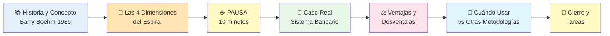

---

### 🎓 Resultados de Aprendizaje Esperados

Al terminar esta clase, deberías poder:

- [ ] Explicar con tus propias palabras qué es el Modelo en Espiral y cómo surgió
- [ ] Dibujar un diagrama básico del espiral con sus 4 cuadrantes
- [ ] Describir qué se hace en cada dimensión del espiral
- [ ] Crear una matriz de riesgos básica para un proyecto
- [ ] Listar al menos 3 ventajas y 3 desventajas del Modelo Espiral
- [ ] Dar ejemplos de proyectos donde Espiral es ideal (proyectos grandes/críticos)
- [ ] Dar ejemplos de proyectos donde Espiral NO es apropiado (proyectos pequeños/rápidos)
- [ ] Comparar Cascada vs Prototipo vs Espiral en una tabla
- [ ] Entender por qué Espiral es usado en proyectos de alto riesgo

---

### 🔗 Conexión con Otras Clases

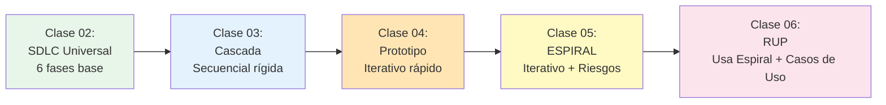

**¿Cómo se conecta esta clase?**

- **Clase 03 (Cascada):** Vimos el modelo secuencial → Problema: No permite cambios ni gestiona riesgos
- **Clase 04 (Prototipo):** Vimos validación iterativa → Problema: Poco control formal del proyecto
- **Clase 05 (Espiral):** HOY → Solución: Combina iteraciones + control + análisis de riesgos
- **Clase 06 (RUP):** Próxima → Usará Espiral como base + casos de uso + arquitectura

---

### 🧠 Mindmap: Lo que Cubriremos Hoy

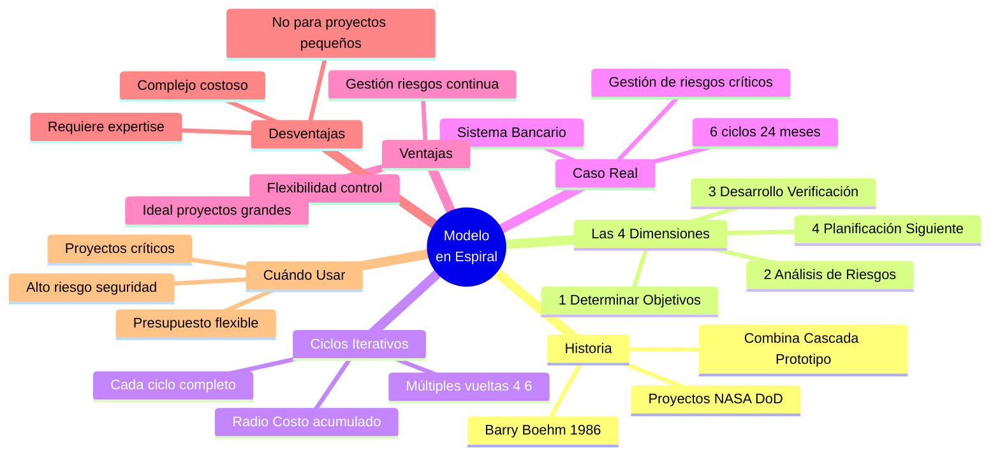

---

## 📚 BLOQUE 1: Historia, Concepto y Las 4 Dimensiones del Espiral

**Duración:** 45 minutos  
**Modalidad:** Expositiva con diagramas y ejemplos

### Objetivo del Bloque

Comprender el origen del Modelo en Espiral, por qué surgió, qué problema resuelve, y entender en profundidad las 4 dimensiones que lo componen.

---

### 1.1 Repaso Rápido: ¿Dónde Estamos? (5 minutos)

#### Bienvenida y Contexto

**Recorrido hasta ahora:**

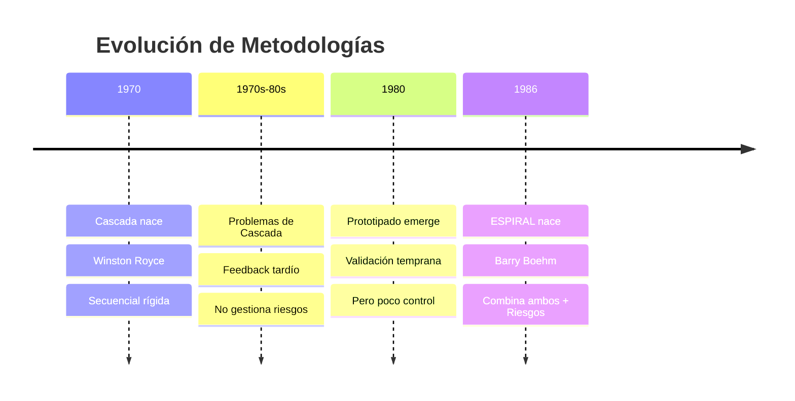

**Lo que ya sabemos:**

| Metodología   | Problema que resuelve      | Nuevo problema que crea          |
| ------------- | -------------------------- | -------------------------------- |
| **Cascada**   | Caos de los 60s            | Rigidez, no permite cambios      |
| **Prototipo** | Feedback tardío de Cascada | Poco control, arquitectura débil |
| **Espiral**   | ¿Qué problemas resuelve?   | 🤔 Lo veremos hoy                |

**Pregunta motivadora:**

> "Si Cascada es demasiado rígida y Prototipo es demasiado flexible, ¿existe un punto medio que combine lo mejor de ambos?"

**Respuesta:** Sí, el **Modelo en Espiral**.

---

### 1.2 Origen: Barry Boehm y el Paper de 1986 (10 minutos)

#### El Padre del Modelo Espiral

**Barry W. Boehm** - Científico de la computación en TRW (empresa aeroespacial)

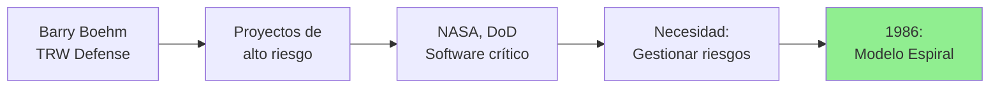

**Contexto de Barry Boehm:**

- Trabajaba en proyectos militares y espaciales de **alto riesgo**
- Presupuestos de millones de dólares
- Vidas humanas dependían del software
- No podían darse el lujo de fallar

**Observaciones de Boehm:**

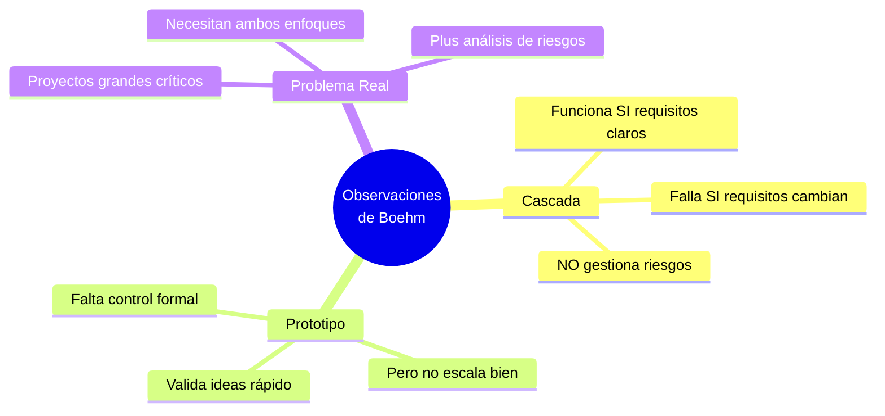

#### El Paper Revolucionario (1986)

**Título:** _"A Spiral Model of Software Development and Enhancement"_

**Publicación:** IEEE Computer, Mayo 1986

**Idea central:**

> "En lugar de elegir entre Cascada (rígida) o Prototipo (flexible), ¿por qué no combinar ambos y agregar análisis sistemático de riesgos en cada iteración?"

**La propuesta de Boehm:**

1. ✅ **Desarrollo iterativo** (como Prototipo)
2. ✅ **Control y documentación** (como Cascada)
3. ✅ **Análisis de riesgos obligatorio** (NUEVO)
4. ✅ **Decisión de continuar/cancelar** en cada ciclo (NUEVO)

**Impacto inicial:**

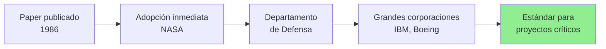

**Casos de uso tempranos:**

- 🚀 **NASA:** Software de Space Shuttle
- 🔒 **DoD:** Sistemas de defensa antimisiles
- ✈️ **Boeing:** Software de control de vuelo
- 🏦 **Bancos:** Sistemas transaccionales críticos

---

### 1.3 ¿Qué Es el Modelo en Espiral? (10 minutos)

#### Definición

> **Modelo en Espiral:** Metodología de desarrollo que combina elementos de diseño y prototipado en etapas, con énfasis en **análisis de riesgos** en cada ciclo iterativo.

**Características fundamentales:**

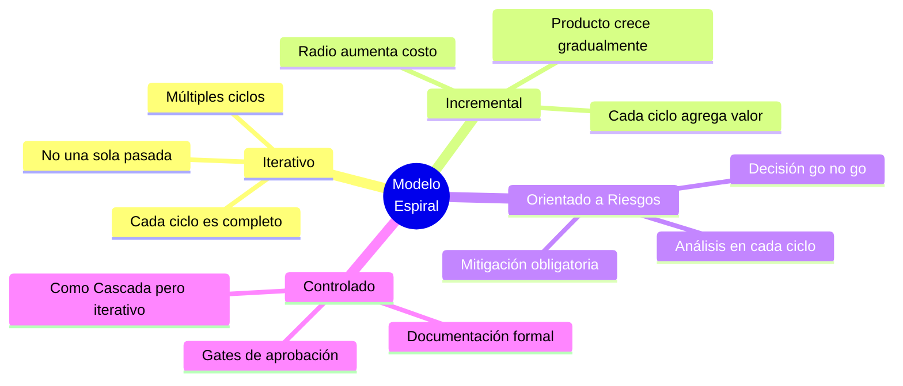

#### La Metáfora del Espiral

**¿Por qué se llama "Espiral"?**

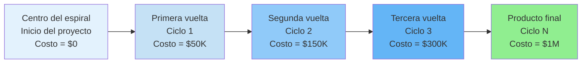

**Analogía visual:**

```
         🎯 Producto Final
              ↑
    ┌─────────┼─────────┐
    │    Ciclo 4        │
    │  ┌───────┼─────┐  │
    │  │  Ciclo 3    │  │
    │  │ ┌─────┼───┐ │  │
    │  │ │ Ciclo 2 │ │  │
    │  │ │ ┌───┼─┐ │ │  │
    │  │ │ │Inicio│ │ │  │
    │  │ │ └─────┘ │ │  │
    │  │ └─────────┘ │  │
    │  └─────────────┘  │
    └───────────────────┘

Radio del espiral = Costo acumulado
Cada vuelta = 1 iteración completa
```

#### Diferencias Clave vs Cascada y Prototipo

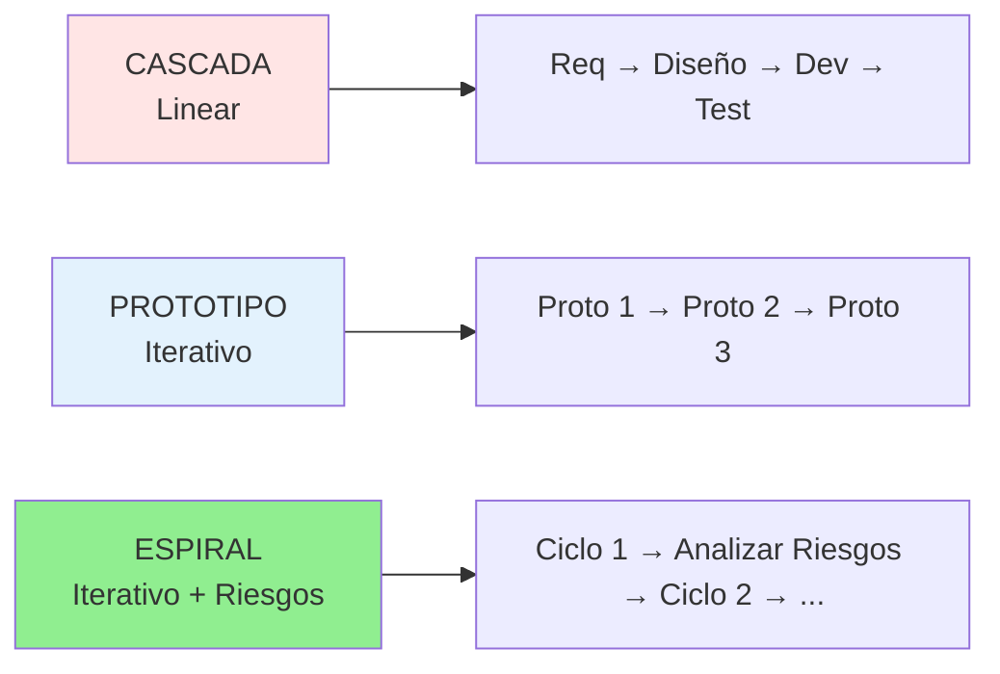

**Tabla comparativa rápida:**

| Aspecto                 | Cascada           | Prototipo       | Espiral                  |
| ----------------------- | ----------------- | --------------- | ------------------------ |
| **Iteraciones**         | ❌ 1 sola         | ✅ Múltiples    | ✅ Múltiples (4-6)       |
| **Análisis de Riesgos** | ❌ No formal      | ❌ No formal    | ✅ Obligatorio           |
| **Documentación**       | ✅ Exhaustiva     | ❌ Mínima       | ✅ Formal pero iterativa |
| **Flexibilidad**        | ❌ Rígida         | ✅ Muy flexible | ⚖️ Balanceada            |
| **Control**             | ✅ Alto           | ❌ Bajo         | ✅ Alto                  |
| **Decisión go/no-go**   | ❌ Solo al inicio | ❌ No formal    | ✅ Cada ciclo            |

---

### 1.4 Las 4 Dimensiones del Espiral (20 minutos)

El espiral se divide en **4 cuadrantes** que se repiten en cada ciclo.

#### Diagrama del Espiral Completo

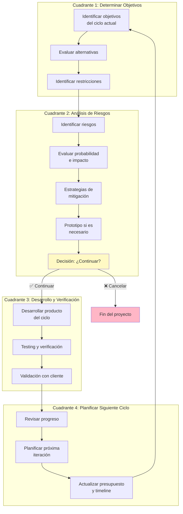

---

#### 📍 Cuadrante 1: Determinar Objetivos, Alternativas y Restricciones

**¿Qué se hace aquí?**

Definir qué se quiere lograr en **este ciclo específico**, no en todo el proyecto.

**Actividades:**

1. **Identificar objetivos del ciclo:**

   - ¿Qué feature/módulo construir en este ciclo?
   - ¿Qué pregunta responder?
   - ¿Qué riesgo mitigar?

2. **Evaluar alternativas:**

   - ¿Qué opciones técnicas existen?
   - ¿Comprar vs construir?
   - ¿Tecnología A vs B?

3. **Identificar restricciones:**
   - Presupuesto disponible
   - Tiempo límite
   - Recursos (equipo, herramientas)

**Ejemplo: Sistema de Pagos Online**

```markdown
**Ciclo 2: Integración de Gateway de Pagos**

Objetivos:

- Permitir pagos con tarjeta de crédito
- Cumplir con PCI DSS (estándar de seguridad)

Alternativas:

1. Stripe (API simple, 2.9% + $0.30 por transacción)
2. PayPal (conocido, 3.4% + $0.30 por transacción)
3. Gateway propio (control total, pero MUCHO trabajo)

Restricciones:

- Presupuesto: $50K para este ciclo
- Tiempo: 2 meses
- Equipo: 4 developers (ninguno experto en pagos)
- Regulación: DEBE cumplir PCI DSS
```

**Salida del Cuadrante 1:**

- 📋 Objetivos claros del ciclo
- 🔀 Lista de alternativas con pros/contras
- 🚧 Restricciones documentadas

---

#### ⚠️ Cuadrante 2: Evaluar Alternativas e Identificar/Resolver Riesgos

**¿Qué se hace aquí?**

**ESTE ES EL CORAZÓN DEL MODELO ESPIRAL.**

Analizar riesgos de cada alternativa y decidir cómo mitigarlos.

**Actividades:**

1. **Identificar riesgos** de cada alternativa
2. **Evaluar probabilidad** (Baja/Media/Alta)
3. **Evaluar impacto** (Bajo/Medio/Alto/Crítico)
4. **Priorizar riesgos** (Probabilidad × Impacto)
5. **Estrategias de mitigación**
6. **Construir prototipo** si es necesario para reducir riesgo
7. **Decisión go/no-go:** ¿Continuar con el proyecto?

**Matriz de Riesgos (ejemplo sistema de pagos):**

| Riesgo                            | Probabilidad | Impacto | Prioridad     | Mitigación                    |
| --------------------------------- | ------------ | ------- | ------------- | ----------------------------- |
| Gateway propio demasiado complejo | Alta         | Crítico | 🔴 Alta       | ❌ Descartar esta opción      |
| Stripe muy caro a largo plazo     | Media        | Medio   | 🟡 Media      | Calcular costos proyectados   |
| No cumplir PCI DSS a tiempo       | Media        | Crítico | 🔴 Alta       | Contratar consultor PCI       |
| Problemas de integración API      | Media        | Alto    | 🟠 Media-Alta | Hacer POC técnico (prototipo) |
| PayPal rechazado por usuarios     | Baja         | Medio   | 🟢 Baja       | Encuesta a usuarios           |

**Decisión basada en riesgos:**

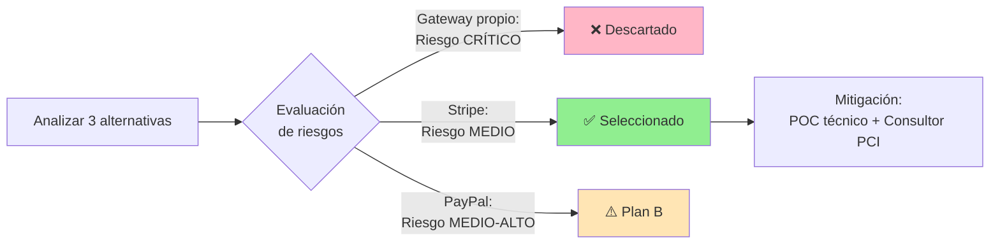

**POC/Prototipo para mitigar riesgo:**

```markdown
**Prototipo técnico (1 semana):**

- Integrar Stripe en app de prueba
- Procesar 1 transacción de prueba
- Validar tiempos de respuesta
- Revisar documentación de errores

**Resultado:**
✅ Stripe funciona bien
✅ Documentación clara
✅ Tiempo respuesta < 2 seg
✅ DECISIÓN: Continuar con Stripe
```

**Decisión crítica:**

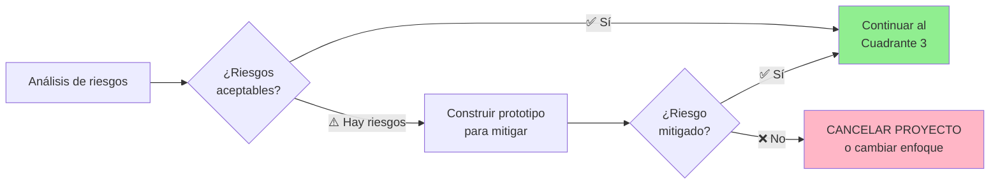

**Salida del Cuadrante 2:**

- 📊 Matriz de riesgos completa
- 🛡️ Estrategias de mitigación
- 🔬 Prototipo técnico (si fue necesario)
- ✅ Decisión: GO o NO-GO

---

#### ⚙️ Cuadrante 3: Desarrollar y Verificar Producto del Nivel Actual

**¿Qué se hace aquí?**

Construir el producto para **este ciclo específico**, basándose en las decisiones del Cuadrante 2.

**Actividades:**

1. **Desarrollar** según la alternativa seleccionada
2. **Implementar** features del ciclo
3. **Testing** exhaustivo
4. **Validación** con cliente/stakeholders
5. **Documentar** lo construido

**Importante:** NO es "construir todo el sistema", sino **el incremento de este ciclo**.

**Ejemplo: Sistema de Pagos - Ciclo 2**

```markdown
**Desarrollo del Ciclo 2:**

Semana 1-2: Integración básica

- Conectar API de Stripe
- Crear endpoints: /payment/create, /payment/confirm
- Manejo de errores básico

Semana 3-4: UI y flujo completo

- Formulario de pago en frontend
- Validaciones de tarjeta
- Página de confirmación

Semana 5-6: Testing

- Unit tests (cobertura >80%)
- Integration tests con Stripe Sandbox
- Security tests (SQL injection, XSS)
- Performance tests (100 transacciones/minuto)

Semana 7-8: Validación

- Demo a stakeholders
- Pruebas con 10 usuarios beta
- Ajustes basados en feedback
```

**Niveles de testing en este cuadrante:**

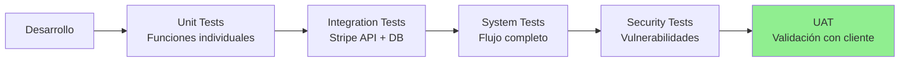

**Salida del Cuadrante 3:**

- 💻 Código funcional del ciclo
- ✅ Suite de tests pasando
- 📚 Documentación técnica
- 👥 Aprobación del cliente

---

#### 📅 Cuadrante 4: Planificar Siguiente Iteración

**¿Qué se hace aquí?**

Revisar lo logrado y planificar el **próximo ciclo del espiral**.

**Actividades:**

1. **Revisar progreso:**

   - ¿Qué se completó en este ciclo?
   - ¿Qué salió bien/mal?
   - Lecciones aprendidas

2. **Actualizar plan del proyecto:**

   - Requisitos que surgieron
   - Cambios en alcance
   - Riesgos nuevos identificados

3. **Planificar próximo ciclo:**

   - Objetivos del Ciclo N+1
   - Presupuesto restante
   - Timeline ajustado

4. **Compromiso de stakeholders:**
   - Aprobación para continuar
   - Firma de documentos

**Ejemplo: Sistema de Pagos - Fin del Ciclo 2**

```markdown
**Revisión del Ciclo 2:**

✅ Completado:

- Integración Stripe funcional
- Pagos con tarjeta funcionando
- PCI DSS compliance validado
- Testing exitoso

📊 Métricas:

- Costo real: $48K (vs $50K planificado) ✅
- Tiempo: 8 semanas (según plan) ✅
- Cobertura tests: 85% ✅

🔍 Lecciones aprendidas:

- Documentación Stripe excelente
- Necesitamos más tiempo para testing de seguridad
- Cliente pidió soporte para PayPal también

**Plan para Ciclo 3:**

Objetivos:

1. Agregar PayPal como método alternativo
2. Implementar sistema de refunds (devoluciones)
3. Dashboard de transacciones para admin

Presupuesto: $60K
Duración: 8 semanas
Riesgos principales: Complejidad de refunds
```

**Visualización del progreso:**

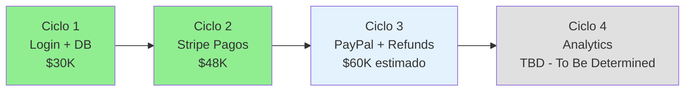

**Salida del Cuadrante 4:**

- 📋 Plan actualizado del proyecto
- 💰 Presupuesto revisado
- 📅 Cronograma ajustado
- ✍️ Aprobación para Ciclo N+1

---

### 📊 Resumen del Bloque 1

**Lo que aprendimos:**

- ✅ **Barry Boehm** creó el Modelo Espiral en **1986**
- ✅ Surgió para **proyectos de alto riesgo** (NASA, DoD, sistemas críticos)
- ✅ Combina: **Iteración** (Prototipo) + **Control** (Cascada) + **Análisis de Riesgos** (NUEVO)
- ✅ **4 Dimensiones** que se repiten en cada ciclo:
  1. 📍 Determinar Objetivos, Alternativas, Restricciones
  2. ⚠️ Evaluar Alternativas e Identificar/Resolver Riesgos (CORE)
  3. ⚙️ Desarrollar y Verificar
  4. 📅 Planificar Siguiente Iteración
- ✅ Cada ciclo incluye **decisión go/no-go**
- ✅ Radio del espiral = **Costo acumulado**

**Concepto clave:**

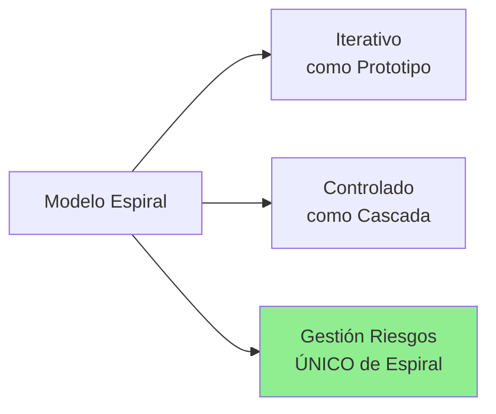

**Próximo paso:**

Después de la pausa, veremos un **caso real completo**: Sistema Bancario de Homebanking con 6 ciclos y gestión de riesgos en cada uno.

---

## ☕ PAUSA

**Duración:** 10 minutos  
**Instrucciones:** Estirar, ir al baño, tomar agua.

---

## 🏦 BLOQUE 2: Caso Real Completo - Sistema Bancario de Homebanking

**Duración:** 40 minutos  
**Modalidad:** Análisis de caso con timeline detallado

### Objetivo del Bloque

Ver cómo se aplica el Modelo Espiral en un proyecto real de principio a fin, siguiendo los 6 ciclos completos con análisis de riesgos, decisiones y resultados.

---

### 2.1 Contexto del Proyecto (5 minutos)

#### Información General

**Cliente:** Banco Nacional Regional  
**Proyecto:** Rediseño completo del sistema de Homebanking  
**Sistema actual:** Legacy de 15 años (Windows Forms + SQL Server 2005)  
**Usuarios:** 1,000,000 de clientes activos  
**Presupuesto total:** $2,000,000 USD  
**Duración planificada:** 24 meses (2 años)  
**Equipo:** 25 personas

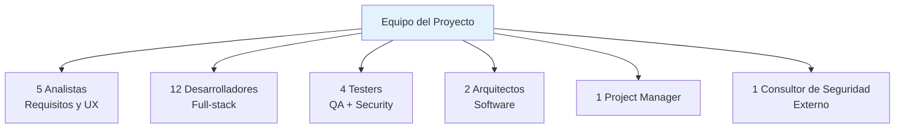

#### Situación Inicial: El Problema

**Sistema actual (legacy):**

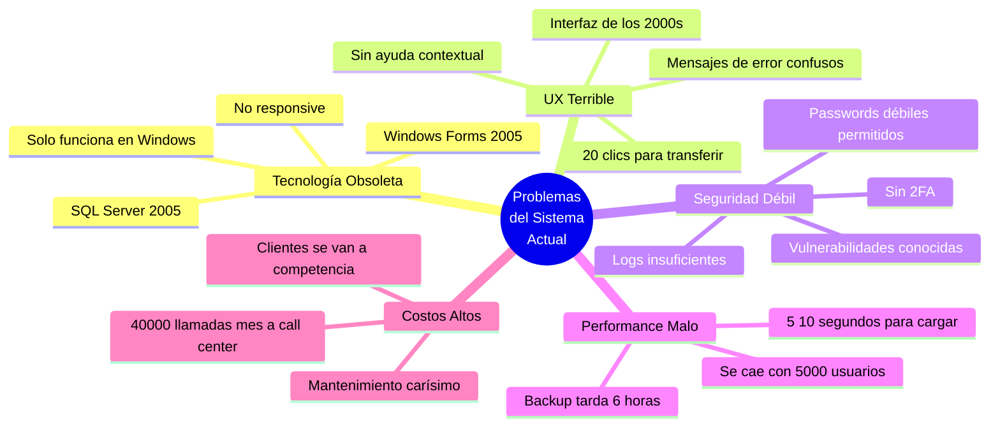

**Consecuencias medibles:**

| Problema                              | Impacto                   | Costo Anual  |
| ------------------------------------- | ------------------------- | ------------ |
| 40,000 llamadas/mes a soporte         | Frustraciones de clientes | $2.4M        |
| 15% clientes cambió a competencia     | Pérdida de revenue        | $8M          |
| Downtime frecuente                    | Multas regulatorias       | $500K        |
| Sistema no cumple nuevas regulaciones | Riesgo legal              | Incalculable |

**Necesidad urgente:** Rediseño completo.

---

#### Por Qué Eligieron Modelo Espiral

**Factores de decisión:**

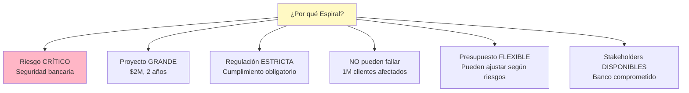

**¿Por qué NO Cascada?**

- ❌ Demasiado rígido para proyecto de esta magnitud
- ❌ Feedback tardío = riesgo catastrófico
- ❌ No gestiona riesgos de seguridad

**¿Por qué NO Prototipo puro?**

- ❌ Falta control formal (banco necesita auditoría)
- ❌ Documentación insuficiente (regulación requiere docs)
- ❌ Difícil gestionar equipo de 25 personas

**¿Por qué SÍ Espiral?**

- ✅ Gestión de riesgos obligatoria en cada ciclo
- ✅ Iterativo pero controlado
- ✅ Documentación formal pero incremental
- ✅ Decisión go/no-go permite cancelar si riesgos muy altos

---

### 2.2 Los 6 Ciclos del Proyecto (30 minutos)

#### Timeline General

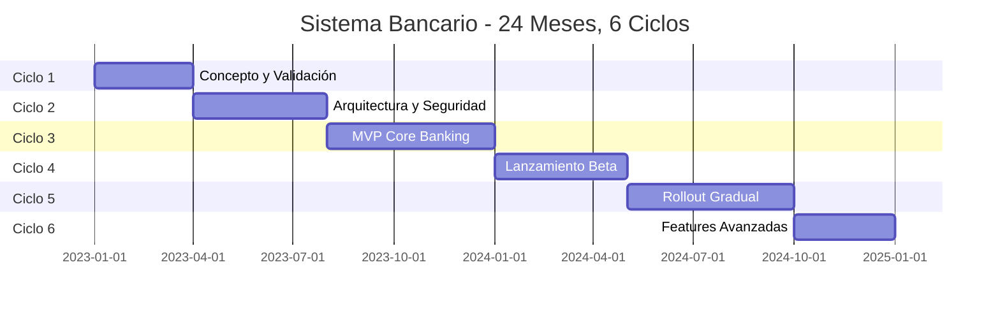

**Costo acumulado por ciclo:**

```
Ciclo 1: $200K   (Presupuesto acumulado: $200K)
Ciclo 2: $500K   (Presupuesto acumulado: $700K)
Ciclo 3: $600K   (Presupuesto acumulado: $1.3M)
Ciclo 4: $400K   (Presupuesto acumulado: $1.7M)
Ciclo 5: $200K   (Presupuesto acumulado: $1.9M)
Ciclo 6: $100K   (Presupuesto acumulado: $2.0M) ✅ Dentro de presupuesto
```

---

#### 🔄 Ciclo 1: Concepto y Validación (3 meses, $200K)

**📍 Cuadrante 1: Objetivos**

```markdown
Objetivo principal:

- Validar que rediseño completo es viable y necesario
- Identificar pain points reales de usuarios
- Definir features críticas vs nice-to-have

Alternativas evaluadas:

1. Rediseño completo (nueva plataforma)
2. Refactoring incremental del sistema actual
3. Comprar solución white-label existente

Restricciones:

- Presupuesto: $200K solo para este ciclo
- Tiempo: 3 meses
- No interrumpir sistema actual
```

**⚠️ Cuadrante 2: Análisis de Riesgos**

**Matriz de riesgos del Ciclo 1:**

| ID   | Riesgo                                                 | Probabilidad | Impacto | Prioridad   | Mitigación                                        |
| ---- | ------------------------------------------------------ | ------------ | ------- | ----------- | ------------------------------------------------- |
| R1-1 | Usuarios rechazan cambios (acostumbrados a UI antigua) | Alta         | Crítico | 🔴 Muy Alta | Encuestas + focus groups con 500 clientes         |
| R1-2 | Regulación bancaria impide ciertos diseños             | Media        | Crítico | 🔴 Alta     | Consultoría legal temprana con entidad reguladora |
| R1-3 | Incompatibilidad con backend legacy                    | Alta         | Alto    | 🟠 Alta     | POC técnico: Nueva UI + API legacy                |
| R1-4 | Presupuesto $2M insuficiente                           | Media        | Alto    | 🟠 Media    | Análisis de costos detallado + buffer 20%         |
| R1-5 | Competencia lanza app mejor antes                      | Baja         | Medio   | 🟡 Baja     | Monitoreo de mercado                              |

**Acciones de mitigación:**

```mermaid
graph TB
    A[Riesgos identificados] --> B[Acción 1:<br/>Encuesta a 5000 clientes]
    A --> C[Acción 2:<br/>Focus groups con 50 usuarios]
    A --> D[Acción 3:<br/>Prototipo High-Fi en Figma]
    A --> E[Acción 4:<br/>POC técnico: React + API legacy]
    A --> F[Acción 5:<br/>Consultoría legal<br/>con regulador]

    B --> G[Resultados]
    C --> G
    D --> G
    E --> G
    F --> G

    style G fill:#90EE90
```

**Resultados de mitigación:**

```markdown
✅ Encuesta (5,000 respuestas):

- 87% quieren nueva app
- 78% dispuestos a "aprender" nueva UI si es mejor
- Pain points: Lentitud (92%), muchos clics (85%), diseño feo (73%)

✅ Focus groups (50 usuarios):

- Preferencia clara por diseño moderno tipo "apps de fintech"
- Funcionalidad #1 solicitada: Transferencias rápidas (3 clics máx)
- Preocupación de seguridad mencionada por 45/50

✅ Prototipo Figma:

- 5 pantallas principales diseñadas
- Mostrado a 100 usuarios (online)
- 85% satisfacción con nuevo diseño
- Feedback: "Por fin, algo moderno"

✅ POC técnico:

- React app conectada a API del sistema legacy
- ✅ Funciona: Login + Consulta de saldo exitosos
- ⚠️ Performance: Backend legacy lento (necesita cache)

✅ Consultoría legal:

- ✅ Diseño cumple con regulación
- ⚠️ Deben implementar 2FA (Two-Factor Auth) obligatorio
- ✅ No hay impedimentos legales para continuar
```

**⚙️ Cuadrante 3: Desarrollo y Verificación**

En este ciclo, el "desarrollo" es principalmente diseño y prototipos:

- Documento de Visión (50 páginas)
- Prototipos High-Fi (15 pantallas)
- Arquitectura propuesta (diagrama alto nivel)
- Plan de proyecto detallado

**📅 Cuadrante 4: Planificación**

```markdown
**Revisión Ciclo 1:**

Tiempo: 3 meses ✅ (según plan)
Costo: $200K ✅ (según plan)

Logros:
✅ Validación de viabilidad
✅ Usuarios aprueban nuevo diseño (85%)
✅ No hay blockers legales
✅ POC técnico exitoso

Riesgos residuales:
⚠️ Backend legacy necesita optimización
⚠️ 2FA obligatorio (no estaba en plan inicial)

**DECISIÓN: ✅ CONTINUAR AL CICLO 2**

Plan Ciclo 2:

- Objetivos: Arquitectura técnica + Seguridad
- Presupuesto: $500K
- Duración: 4 meses
- Enfoque: Resolver backend legacy + implementar 2FA
```

---

#### 🔄 Ciclo 2: Arquitectura y Seguridad (4 meses, $500K)

**📍 Cuadrante 1: Objetivos**

```markdown
Objetivos:

1. Diseñar arquitectura técnica completa
2. Resolver problema de backend legacy lento
3. Implementar 2FA (requerido por regulación)
4. Definir stack tecnológico

Alternativas:

- Frontend: React vs Angular vs Vue
- Backend: Node.js vs .NET Core vs Java Spring
- Cache: Redis vs Memcached
- DB nueva: PostgreSQL vs MongoDB (histórico queda en SQL Server)

Restricciones:

- DEBE integrarse con SQL Server legacy
- DEBE cumplir regulación bancaria (encriptación, logs, auditoría)
- Equipo tiene más experiencia en React y Node.js
```

**⚠️ Cuadrante 2: Análisis de Riesgos**

**Matriz de riesgos del Ciclo 2:**

| ID   | Riesgo                                               | Probabilidad | Impacto | Prioridad   | Mitigación                                   |
| ---- | ---------------------------------------------------- | ------------ | ------- | ----------- | -------------------------------------------- |
| R2-1 | Arquitectura incorrecta = refactoring masivo         | Media        | Crítico | 🔴 Muy Alta | Revisión por arquitecto senior externo       |
| R2-2 | Ataque cibernético en producción                     | Media        | Crítico | 🔴 Muy Alta | Pentesting desde ahora + consultor seguridad |
| R2-3 | Performance insuficiente (10K usuarios concurrentes) | Alta         | Alto    | 🟠 Alta     | Load testing con 20K usuarios simulados      |
| R2-4 | 2FA complica UX y frustra usuarios                   | Media        | Medio   | 🟡 Media    | Prototipo de flujo 2FA simple                |
| R2-5 | Tecnologías elegidas quedan obsoletas rápido         | Baja         | Medio   | 🟡 Baja     | Elegir stack maduro (React + Node)           |

**Acciones tomadas:**

```markdown
✅ Arquitectura:

- Diseño: Microservicios con API Gateway
- Frontend: React (equipo tiene experiencia)
- Backend: Node.js + Express
- Cache: Redis (para queries frecuentes)
- Nueva DB: PostgreSQL (para nuevos datos)
- Legacy DB: SQL Server 2005 (read-only, migrando gradualmente)

✅ Seguridad:

- Contratar consultor de seguridad (parte del equipo)
- Implementar 2FA con SMS + Google Authenticator
- Encriptación AES-256 para datos sensibles
- Logs de auditoría completos

✅ Load Testing:

- Simular 20,000 usuarios concurrentes
- Objetivo: < 2 seg tiempo de respuesta
- Resultado: ✅ 1.8 seg promedio con Redis cache

✅ Pentesting (pruebas de penetración):

- Consultor externo hace ataques simulados
- Resultado: 3 vulnerabilidades medias encontradas
- Todas resueltas antes de fin de ciclo
```

**Decisión arquitectónica:**

```mermaid
graph TB
    subgraph "Nueva Arquitectura"
        A[React App<br/>Frontend] --> B[API Gateway<br/>Node.js]
        B --> C[Microservicio<br/>Cuentas]
        B --> D[Microservicio<br/>Transferencias]
        B --> E[Microservicio<br/>Pagos]

        C --> F[Redis Cache]
        F --> G[PostgreSQL<br/>Nueva DB]

        C --> H[Adapter Layer<br/>Legacy]
        H --> I[SQL Server 2005<br/>Legacy DB]
    end

    style B fill:#E3F2FD
    style F fill:#FFE5B4
    style H fill:#FFB6C6
```

**⚙️ Cuadrante 3: Desarrollo y Verificación**

```markdown
Semana 1-4: Diseño detallado

- Diagramas UML (clases, secuencia, componentes)
- Modelo de datos PostgreSQL
- Definición de APIs (OpenAPI/Swagger)

Semana 5-8: Prototipo funcional

- Login con 2FA
- Consulta de saldo
- Transferencia simple
- TODO conectado a backend real (no mock)

Semana 9-12: Testing de seguridad

- Pentesting profesional
- Load testing (20K usuarios)
- Security audit de código

Semana 13-16: Documentación

- Documento de Arquitectura (180 páginas)
- Runbooks para DevOps
- Plan de migración de datos
```

**📅 Cuadrante 4: Planificación**

```markdown
**Revisión Ciclo 2:**

Tiempo: 4 meses ✅
Costo: $500K ✅

Logros:
✅ Arquitectura sólida definida y validada
✅ Stack tecnológico elegido (React + Node + PostgreSQL)
✅ 2FA implementado y funcionando
✅ Pentesting: Sin vulnerabilidades críticas
✅ Load testing: Soporta 20K usuarios

Métricas:

- Performance: 1.8 seg promedio ✅ (objetivo < 2 seg)
- Seguridad: 0 vulnerabilidades críticas ✅
- Cobertura tests: 82% ✅

Riesgos residuales:
⚠️ Migración de datos legacy será compleja
⚠️ 2FA puede frustrar a usuarios mayores

**DECISIÓN: ✅ CONTINUAR AL CICLO 3**

Plan Ciclo 3:

- Objetivos: MVP con features core
- Presupuesto: $600K
- Duración: 5 meses
- Enfoque: Login, saldo, transferencias, pago servicios
```

---

#### 🔄 Ciclo 3: MVP Core Banking (5 meses, $600K)

**📍 Cuadrante 1: Objetivos**

```markdown
Objetivos del MVP:

1. Login + 2FA
2. Ver saldo y movimientos
3. Transferencias entre cuentas propias
4. Transferencias a terceros
5. Pago de servicios básicos

Features NO incluidas en MVP:
❌ Inversiones
❌ Créditos
❌ Seguros
❌ Chat con ejecutivo
❌ Personalización avanzada
```

**⚠️ Cuadrante 2: Análisis de Riesgos**

**Matriz de riesgos del Ciclo 3:**

| ID   | Riesgo                                              | Probabilidad | Impacto | Prioridad  | Mitigación                               |
| ---- | --------------------------------------------------- | ------------ | ------- | ---------- | ---------------------------------------- |
| R3-1 | Bugs críticos en transferencias = pérdida de dinero | Media        | Crítico | 🔴 Crítica | Testing exhaustivo + rollback automático |
| R3-2 | Performance degrada con usuarios reales             | Media        | Alto    | 🟠 Alta    | Beta con empleados del banco primero     |
| R3-3 | Usuarios no entienden nueva UI = llamadas soporte   | Alta         | Medio   | 🟡 Media   | Tutoriales + onboarding interactivo      |
| R3-4 | Migración de datos corrompe información             | Baja         | Crítico | 🔴 Alta    | Migración en ambiente staging primero    |

**Estrategia de mitigación: Beta Cerrada**

```mermaid
graph LR
    A[Fase 1:<br/>Beta Interna<br/>1000 empleados<br/>1 mes] --> B[Fase 2:<br/>Beta Amigos y Familia<br/>5000 usuarios<br/>1 mes]
    B --> C[Fase 3:<br/>Beta Pública<br/>50,000 clientes<br/>2 meses]
    C --> D[Evaluación<br/>¿Lanzar completo?]

    style D fill:#FFF9C4
```

**⚙️ Cuadrante 3: Desarrollo y Verificación**

```markdown
**Desarrollo (12 semanas):**

Mes 1-2: Features core

- Sistema de login + 2FA
- Dashboard con saldo
- Historial de movimientos
- Transferencias (4 tipos diferentes)

Mes 3: Pago de servicios

- Integración con 15 empresas de servicios
- Búsqueda de facturas
- Programación de pagos

Mes 4-5: Testing y Beta

- Unit tests: 85% cobertura
- Integration tests: Todos los flujos
- Beta interna: 1000 empleados banco
- Beta amigos/familia: 5000 usuarios
- Beta pública: 50,000 clientes

**Bugs encontrados en Beta:**

Total de bugs: 127

- Críticos: 3 (bloqueantes) ✅ Todos resueltos
- Altos: 18 ✅ Todos resueltos
- Medios: 45 ✅ 40 resueltos, 5 pospuestos
- Bajos: 61 ⚠️ 20 resueltos, 41 pospuestos

**Feedback de usuarios Beta:**

Satisfacción general: 88% ✅

- "Mucho más rápido que el anterior" - 92%
- "Diseño moderno y claro" - 87%
- "Fácil de usar" - 79%
- "2FA es un poco molesto" - 45% (esperado)
```

**📅 Cuadrante 4: Planificación**

```markdown
**Revisión Ciclo 3:**

Tiempo: 5 meses ✅
Costo: $600K ✅

Logros:
✅ MVP funcional completo
✅ Beta exitosa (88% satisfacción)
✅ 127 bugs encontrados y mayoría resueltos
✅ Performance: 1.5 seg promedio (mejor que objetivo)
✅ Sin incidentes de seguridad

Métricas Beta:

- Usuarios beta: 56,000
- Transacciones procesadas: 450,000
- Downtime: 0% ✅
- Llamadas a soporte: 180 (muy bajo)

**DECISIÓN: ✅ CONTINUAR AL CICLO 4 - Lanzamiento General**

Plan Ciclo 4:

- Objetivos: Rollout gradual a 1M usuarios
- Presupuesto: $400K
- Duración: 4 meses
- Estrategia: 10% → 30% → 60% → 100%
```

---

#### 🔄 Ciclo 4: Lanzamiento Beta Extendida y Rollout (4 meses, $400K)

**📍 Cuadrante 1: Objetivos**

```markdown
Objetivo principal:

- Lanzar sistema nuevo a los 1,000,000 de clientes
- Estrategia gradual para mitigar riesgos
- Monitoreo 24/7 durante rollout
- Soporte intensivo para early adopters

Estrategia de rollout:
Semana 1-2: 10% usuarios (100K) - Segmento: Clientes tech-savvy jóvenes
Semana 3-6: 30% usuarios (300K) - Agregar: Clientes activos frecuentes
Semana 7-10: 60% usuarios (600K) - Agregar: Clientes promedio
Semana 11-16: 100% usuarios (1M) - Todos (incluyendo clientes mayores)
```

**⚠️ Cuadrante 2: Análisis de Riesgos**

**Matriz de riesgos del Ciclo 4:**

| ID   | Riesgo                                   | Probabilidad | Impacto | Prioridad | Mitigación                                  |
| ---- | ---------------------------------------- | ------------ | ------- | --------- | ------------------------------------------- |
| R4-1 | Saturación de servidores con 1M usuarios | Media        | Crítico | 🔴 Alta   | Rollout gradual + auto-scaling AWS          |
| R4-2 | Avalancha de llamadas a soporte          | Alta         | Alto    | 🟠 Alta   | Chat 24/7 + FAQs + tutoriales en app        |
| R4-3 | Usuarios mayores no pueden usar app      | Alta         | Medio   | 🟡 Media  | Workshops presenciales + soporte dedicado   |
| R4-4 | Sistema legacy debe seguir disponible    | Alta         | Alto    | 🟠 Alta   | Mantener ambos sistemas en paralelo 6 meses |
| R4-5 | Incidente crítico afecta reputación      | Baja         | Crítico | 🔴 Alta   | Plan de crisis + comunicación preparada     |

**⚙️ Cuadrante 3: Desarrollo y Verificación**

```markdown
**Rollout en práctica:**

**Semana 1-2: 10% (100,000 usuarios)**
✅ Sin incidentes críticos
📊 Métricas:

- Adopción: 87% (87K usuarios activos)
- Tiempo promedio sesión: 4.5 min
- Llamadas soporte: 1,200 (1.2% usuarios)
- Satisfacción: 91% ✅

**Semana 3-6: 30% (300,000 usuarios)**
✅ Sin incidentes críticos
⚠️ Incidente menor: Cache Redis saturado (resuelto en 2 horas)
📊 Métricas:

- Adopción: 82% (246K usuarios activos)
- Llamadas soporte: 3,800 (1.3% usuarios)
- Performance: 2.1 seg (ligeramente sobre objetivo) ⚠️
- Satisfacción: 88% ✅

Acción tomada: Aumentar capacidad Redis + optimizar queries

**Semana 7-10: 60% (600,000 usuarios)**
✅ Performance mejoró a 1.7 seg ✅
📊 Métricas:

- Adopción: 78% (468K usuarios activos)
- Llamadas soporte: 7,500 (1.25% usuarios)
- Satisfacción: 85% ✅

**Semana 11-16: 100% (1,000,000 usuarios)**
✅ Lanzamiento completo sin incidentes mayores
📊 Métricas finales:

- Adopción: 76% (760K usuarios activos primeros 30 días)
- Llamadas soporte: 12,000 (1.2% usuarios) ✅ Bajo esperado
- Performance: 1.8 seg promedio ✅
- Satisfacción: 82% ✅
- Downtime: 3 horas en 4 meses (99.9% uptime) ✅
```

**📅 Cuadrante 4: Planificación**

```markdown
**Revisión Ciclo 4:**

Tiempo: 4 meses ✅
Costo: $400K ✅

Logros:
✅ 1M usuarios migrados exitosamente
✅ 82% satisfacción general
✅ Sin incidentes críticos de seguridad
✅ Performance estable (1.8 seg)
✅ Reducción 40% en llamadas soporte vs sistema anterior

Comparación con sistema legacy:
| Métrica | Legacy | Nuevo | Mejora |
|---------|--------|-------|--------|
| Tiempo login | 8 seg | 2 seg | 75% ⬇️ |
| Tiempo transferencia | 30 seg | 5 seg | 83% ⬇️ |
| Llamadas soporte/mes | 40,000 | 12,000 | 70% ⬇️ |
| Satisfacción | 45% | 82% | 82% ⬆️ |

**DECISIÓN: ✅ CONTINUAR AL CICLO 5 - Optimización**

Plan Ciclo 5:

- Objetivos: Optimizar performance, agregar analytics
- Presupuesto: $200K
- Duración: 5 meses
```

---

#### 🔄 Ciclo 5-6: Optimización y Features Avanzadas (8 meses, $300K)

**Resumen de ciclos finales:**

```markdown
**Ciclo 5 (5 meses, $200K):**

Objetivos:

- Optimizar performance y bugs menores
- Implementar analytics para entender uso
- Mejorar onboarding para usuarios mayores
- Preparar para features avanzadas

Logros:
✅ Performance mejorado a 1.3 seg promedio
✅ Analytics implementado (entendemos uso real)
✅ 92% adopción (920K usuarios activos)
✅ Satisfacción subió a 86%

**Ciclo 6 (3 meses, $100K):**

Objetivos:

- Agregar inversiones básicas
- Agregar solicitud de créditos
- Notificaciones push
- Modo oscuro (solicitado por usuarios)

Logros:
✅ Features agregadas exitosamente
✅ Satisfacción final: 89%
✅ NPS (Net Promoter Score): +65 (excelente)
```

---

### 2.3 Resultados Finales del Proyecto (5 minutos)

#### Métricas de Éxito

```mermaid
graph TB
    subgraph "Resultados Finales"
        A[Proyecto Completado<br/>24 meses] --> B[Presupuesto:<br/>$2.0M ✅<br/>Dentro de lo planeado]
        A --> C[Timeline:<br/>24 meses ✅<br/>Según plan]
        A --> D[Satisfacción:<br/>89% ✅<br/>Muy alto]
        A --> E[Adopción:<br/>92% ✅<br/>920K usuarios]
        A --> F[Incidentes:<br/>0 críticos ✅<br/>Seguridad perfecta]
    end

    style A fill:#90EE90
```

**Tabla comparativa: Antes vs Después**

| Métrica                   | Sistema Legacy | Sistema Nuevo | Mejora   |
| ------------------------- | -------------- | ------------- | -------- |
| **Satisfacción clientes** | 45%            | 89%           | +98% ⬆️  |
| **Llamadas soporte/mes**  | 40,000         | 8,000         | -80% ⬇️  |
| **Tiempo login**          | 8 seg          | 1.3 seg       | -84% ⬇️  |
| **Tiempo transferencia**  | 30 seg         | 4 seg         | -87% ⬇️  |
| **Downtime anual**        | 120 horas      | 8 horas       | -93% ⬇️  |
| **Clientes perdidos/año** | 15%            | 3%            | -80% ⬇️  |
| **Incidentes seguridad**  | 12/año         | 0             | -100% ⬇️ |

**ROI (Return on Investment):**

```markdown
Inversión total: $2,000,000

Ahorros anuales:

- Soporte: $2.4M/año (80% reducción llamadas)
- Retención clientes: $6M/año (12% menos abandono)
- Operaciones: $800K/año (eficiencia mejorada)
- Total ahorros: $9.2M/año

ROI: Recuperación en 3 meses ✅
Beneficio neto 5 años: $44M
```

#### Lecciones Aprendidas

**¿Qué funcionó bien?**

✅ **Gestión de riesgos continua salvó el proyecto:**

- Identificamos problema de backend legacy en Ciclo 1 (no en Ciclo 5)
- Pentesting temprano evitó vulnerabilidades en producción
- Beta gradual permitió detectar y resolver 127 bugs antes de lanzamiento masivo

✅ **Decisiones go/no-go dieron confianza:**

- Cada ciclo tenía aprobación formal
- Stakeholders siempre informados
- Presupuesto ajustado basado en aprendizaje

✅ **Iteraciones permitieron aprender y adaptarse:**

- Ciclo 1: Descubrimos necesidad de 2FA
- Ciclo 3: Feedback beta cambió prioridades
- Ciclo 5: Analytics reveló features más usadas

**¿Qué fue desafiante?**

⚠️ **Gestión de riesgos es costosa:**

- 15% del presupuesto fue en mitigación de riesgos
- Requiere expertise (consultores, pentesting, etc.)

⚠️ **Documentación exhaustiva toma tiempo:**

- Cada ciclo requería docs formales
- Trade-off: Control vs velocidad

⚠️ **Coordinación de 25 personas es complejo:**

- Reuniones frecuentes de sincronización
- PM dedicado fue crítico

**¿Qué habríamos hecho diferente?**

```markdown
💡 Más tiempo en Ciclo 2 (arquitectura)

- Algunas decisiones técnicas tuvimos que ajustar después
- Beneficio: Hubiera ahorrado refactoring en Ciclo 4

💡 Testing de performance desde Ciclo 1

- Esperamos hasta Ciclo 2
- Beneficio: Detectar problemas más temprano

💡 Involucrar usuarios mayores desde Ciclo 1

- Solo hicimos focus groups con jóvenes inicialmente
- Beneficio: UX más inclusiva desde inicio
```

---

### 📊 Resumen del Bloque 2

**Lo que aprendimos:**

- ✅ Vimos un **caso real completo** de Modelo Espiral en acción
- ✅ **6 ciclos** a lo largo de **24 meses** y **$2M** de presupuesto
- ✅ **Análisis de riesgos** fue crítico en CADA ciclo (16 riesgos identificados y mitigados)
- ✅ **Decisiones go/no-go** dieron control y confianza
- ✅ **Resultado:** Proyecto exitoso, dentro de presupuesto y tiempo
- ✅ **ROI:** Recuperación de inversión en 3 meses

**Puntos clave del caso:**

```mermaid
mindmap
  root((Caso<br/>Bancario))
    Por qué Espiral
      Riesgo crítico seguridad
      Proyecto grande 2M
      Regulación estricta
    6 Ciclos
      C1 Validación
      C2 Arquitectura
      C3 MVP
      C4 Rollout
      C5 C6 Optimización
    Gestión Riesgos
      16 riesgos totales
      Todos mitigados
      0 incidentes críticos
    Éxito Medible
      89 satisfacción
      80 menos soporte
      ROI 3 meses
```

**Próximo paso:**

Ahora veamos las ventajas y desventajas del Modelo Espiral de forma estructurada.

---

## ⚖️ BLOQUE 3: Ventajas, Desventajas y Cuándo Usar Espiral

**Duración:** 30 minutos  
**Modalidad:** Análisis crítico y comparativo

### Objetivo del Bloque

Entender cuándo Espiral es la mejor opción y cuándo NO lo es. Aprender a tomar decisiones informadas sobre metodologías.

---

### 3.1 Ventajas del Modelo Espiral (10 minutos)

#### ✅ Ventaja 1: Gestión de Riesgos es CENTRAL (no opcional)

**Por qué es importante:**

En Cascada, identificas riesgos al inicio pero no revisas continuamente.  
En Prototipo, no hay proceso formal de gestión de riesgos.  
En **Espiral, el análisis de riesgos es OBLIGATORIO en cada ciclo.**

```mermaid
graph LR
    A[Cada Ciclo] --> B{Análisis de<br/>Riesgos}
    B --> C[Riesgos BAJOS<br/>✅ Continuar]
    B --> D[Riesgos ALTOS<br/>⚠️ Mitigar o Cancelar]

    C --> E[Desarrollo]
    D --> F[POC/Mitigación]
    F --> B

    style B fill:#FFE5B4
    style D fill:#FFB6C6
```

**Ejemplo concreto:**

```markdown
**Proyecto:** Sistema de IA para diagnóstico médico

Ciclo 2 - Análisis de riesgos detecta:
⚠️ RIESGO CRÍTICO: Precisión del modelo es solo 78%

- Impacto: CRÍTICO (diagnósticos erróneos = vidas en riesgo)
- Probabilidad: ALTA

DECISIÓN: ❌ NO CONTINUAR al Ciclo 3 hasta resolver

- 3 meses adicionales entrenando modelo con más datos
- Nueva precisión: 96% ✅
- Ahora SÍ seguro continuar

CON CASCADA: Hubieran descubierto el problema al FINAL = desastre
CON ESPIRAL: Lo detectaron TEMPRANO = pudieron resolver
```

---

#### ✅ Ventaja 2: Flexibilidad para Cambios

**Concepto:**

Cada ciclo puedes ajustar requisitos basándote en aprendizaje.

```mermaid
graph LR
    subgraph "Ciclo 1"
        A1[Plan:<br/>Feature A + B] --> B1[Desarrollo] --> C1[Review:<br/>Feature A buena<br/>Feature B no útil]
    end

    subgraph "Ciclo 2"
        A2[Ajuste:<br/>Feature A + C nueva] --> B2[Desarrollo] --> C2[Review:<br/>Ambas buenas]
    end

    C1 --> A2

    style C1 fill:#FFF9C4
    style A2 fill:#90EE90
```

**Caso real - Plataforma E-learning:**

```markdown
Ciclo 1: Plan = Videos + Quizzes + Foros
Resultado: Videos ✅ exitosos, Foros ❌ nadie los usa

Ciclo 2: Pivotamos = Videos + Quizzes + Gamificación (badges, rankings)
Resultado: ✅ Engagement subió 300%

Con Cascada: Hubiéramos construido Foros completos (meses de trabajo) antes de saber que nadie los quiere.
Con Espiral: Detectamos temprano y pivotamos.
```

---

#### ✅ Ventaja 3: Control y Visibilidad para Stakeholders

**Por qué es crítico:**

Los stakeholders (clientes, gerentes, inversores) necesitan saber:

- ¿Cómo va el proyecto?
- ¿Cuánto se ha gastado?
- ¿Vale la pena continuar?

```mermaid
graph LR
    A[Fin de Ciclo 2] --> B[Reunión Go/No-Go]
    B --> C[Stakeholders ven:<br/>✅ Prototipo funcional<br/>✅ Presupuesto usado<br/>✅ Riesgos mitigados<br/>✅ Plan Ciclo 3]
    C --> D{Decisión Informada}
    D --> E[✅ Continuar:<br/>Aprobar $500K más]
    D --> F[⚠️ Pausar:<br/>Re-evaluar riesgos]
    D --> G[❌ Cancelar:<br/>Ahorrar $1M]

    style B fill:#E3F2FD
```

**Ejemplo - Startup con Inversores:**

```markdown
**Contexto:** Startup fintech, inversores pusieron $3M

Ciclo 1 ($500K): MVP básico

- Resultado: ✅ 1,000 early adopters, $50K revenue
- Inversores: "Buen progreso, continuamos"

Ciclo 2 ($800K): Agregar features premium

- Resultado: ⚠️ Solo 50 upgrades a premium (no funciona)
- Inversores: "Antes de gastar más, entiendan por qué no compran premium"

Ciclo 3 ($300K): Investigación UX + Ajuste de precios

- Resultado: ✅ 800 upgrades, $120K revenue
- Inversores: "Ahora sí, aprobamos otros $1.5M"

SIN ESPIRAL: Hubieran gastado todo el dinero sin checkpoints = quiebra
CON ESPIRAL: Pivotaron a tiempo y salvaron la startup
```

---

#### ✅ Ventaja 4: Reduce Costo de Falla

**Principio:**

Fallar temprano es MÁS BARATO que fallar tarde.

```mermaid
graph TB
    A[Costo de Cambio] -->|Cascada| B[Bajo al inicio<br/>ALTO al final]
    A -->|Espiral| C[Constante<br/>moderado]

    subgraph "Cascada"
        B1[Semana 1: $1K] --> B2[Mes 6: $50K] --> B3[Mes 12: $500K 💸]
    end

    subgraph "Espiral"
        C1[Ciclo 1: $10K] --> C2[Ciclo 2: $15K] --> C3[Ciclo 3: $12K]
    end

    style B3 fill:#FFB6C6
    style C3 fill:#90EE90
```

**Ejemplo con números reales:**

| Momento del Descubrimiento          | Costo de Arreglo | Ejemplo                                     |
| ----------------------------------- | ---------------- | ------------------------------------------- |
| **Ciclo 1 (Semana 2)**              | $5,000           | Cambiar base de datos de MySQL a PostgreSQL |
| **Ciclo 3 (Mes 6)**                 | $80,000          | Migrar toda la data + refactorizar código   |
| **Después de Lanzamiento (Mes 18)** | $800,000         | Migrar + downtime + reputación dañada       |

**Espiral detecta en Ciclo 1 = ahorra $795K** ✅

---

#### ✅ Ventaja 5: Documentación Incremental (más realista)

**Problema con Cascada:**

Documentación masiva al inicio → Se vuelve obsoleta → Nadie la actualiza

**Solución Espiral:**

Documentación incremental por ciclo → Siempre actualizada

```mermaid
gantt
    title Documentación: Cascada vs Espiral
    dateFormat YYYY-MM-DD

    section Cascada
    Docs masivas (200 pág)    :done, c1, 2024-01-01, 60d
    Coding                    :done, c2, after c1, 180d
    Docs obsoletas ❌         :crit, c3, after c2, 30d

    section Espiral
    Docs Ciclo 1 (30 pág)     :done, e1, 2024-01-01, 90d
    Docs Ciclo 2 (35 pág)     :done, e2, after e1, 90d
    Docs Ciclo 3 (40 pág)     :done, e3, after e2, 90d
```

---

#### 📋 Resumen de Ventajas

```mermaid
mindmap
  root((Ventajas<br/>Espiral))
    Gestión Riesgos
      Obligatoria cada ciclo
      Detecta problemas temprano
      Go no go decisions
    Flexibilidad
      Ajustar requisitos
      Pivotear según aprendizaje
      No atado a plan inicial
    Control
      Visibilidad constante
      Stakeholders informados
      Presupuesto controlado
    Ahorro
      Fallas tempranas baratas
      No gastar todo al inicio
      ROI medible por ciclo
    Documentación
      Incremental
      Siempre actualizada
      No obsoleta
```

---

### 3.2 Desventajas del Modelo Espiral (10 minutos)

#### ❌ Desventaja 1: Complejidad de Gestión

**Problema:**

Espiral requiere MUCHA coordinación, planificación y seguimiento.

```mermaid
graph LR
    A[Ciclo 2] --> B[Planificación<br/>2 semanas]
    B --> C[Análisis Riesgos<br/>1 semana]
    C --> D[Desarrollo<br/>8 semanas]
    D --> E[Revisión<br/>1 semana]
    E --> F[Decisión Go/No-Go<br/>1 semana]
    F --> G[Documentar<br/>1 semana]
    G --> H[Ciclo 3]

    style B fill:#FFE5B4
    style C fill:#FFE5B4
    style E fill:#FFE5B4
    style F fill:#FFE5B4
    style G fill:#FFE5B4
```

**14 semanas, pero solo 8 son desarrollo real = 57% overhead**

**Comparación:**

| Metodología    | % Tiempo en Overhead        | % Tiempo en Desarrollo |
| -------------- | --------------------------- | ---------------------- |
| **Cascada**    | 30% (planificación inicial) | 70%                    |
| **Prototipo**  | 10% (mínimo)                | 90%                    |
| **Espiral**    | 40% (gestión continua)      | 60%                    |
| **Ágil/Scrum** | 20% (ceremonias)            | 80%                    |

**Consecuencia:**

- Necesitas Project Manager experimentado
- Reuniones frecuentes (costo en tiempo)
- Documentación continua (costo en esfuerzo)

---

#### ❌ Desventaja 2: Costoso (en tiempo y dinero)

**Por qué es caro:**

1. **Análisis de riesgos cuesta dinero:**

   - Consultores especializados
   - POCs (Proof of Concept)
   - Estudios de factibilidad

2. **Ciclos iterativos toman tiempo:**
   - Cada ciclo tiene overhead
   - No puedes "solo programar rápido"

```markdown
**Ejemplo comparativo:**

PROYECTO: App móvil simple (To-Do List)

CON PROTOTIPO:

- 1 desarrollador
- 4 semanas
- Costo: $8,000
- Resultado: App funcionando ✅

CON ESPIRAL:

- 1 desarrollador + 1 PM
- Ciclo 1: Planificación y riesgos (2 semanas)
- Ciclo 2: MVP (3 semanas)
- Ciclo 3: Refinamiento (2 semanas)
- Total: 7 semanas
- Costo: $15,000
- Resultado: App funcionando ✅... pero costó casi el doble

CONCLUSIÓN: Para app simple, Espiral es OVERKILL
```

---

#### ❌ Desventaja 3: Requiere Expertise en Análisis de Riesgos

**Problema:**

No cualquiera sabe hacer análisis de riesgos formal.

```mermaid
graph TB
    A[Análisis de Riesgos<br/>Requiere] --> B[Experiencia<br/>identificando riesgos]
    A --> C[Conocimiento técnico<br/>profundo]
    A --> D[Habilidad para<br/>estimar probabilidades]
    A --> E[Saber cómo mitigar<br/>diferentes tipos de riesgos]

    B --> F[❌ Juniors NO pueden<br/>liderar esto]
    C --> F
    D --> F
    E --> F

    style F fill:#FFB6C6
```

**Consecuencia:**

```markdown
Equipo necesita:
✅ Arquitecto senior (sabe detectar riesgos técnicos)
✅ Project Manager con experiencia (gestión de riesgos)
✅ Consultor de dominio (riesgos de negocio)

Equipo NO puede tener solo:
❌ Desarrolladores junior
❌ PM sin experiencia en gestión de riesgos
❌ Cliente que no entiende el proceso
```

**Resultado:**

- Equipos senior son caros ($$$)
- Equipos junior no pueden ejecutar Espiral correctamente
- Si lo hacen mal, NO obtienes los beneficios

---

#### ❌ Desventaja 4: No Apto para Proyectos Pequeños

**Principio:**

El overhead de Espiral solo se justifica en proyectos grandes y riesgosos.

**Ejemplo de proyecto PEQUEÑO (NO usar Espiral):**

```markdown
Proyecto: Landing page para campaña marketing

- Requisitos: Claros y fijos
- Complejidad: Baja
- Riesgo: Bajo
- Timeline: 2 semanas
- Presupuesto: $3,000

CON ESPIRAL:

- Ciclo 1: Planificación y riesgos (1 semana) = $1,500
- Ciclo 2: Desarrollo (1 semana) = $1,500
- Total: $3,000 y 2 semanas ✅

CON CASCADA o PROTOTIPO:

- Semana 1: Diseño + desarrollo = $1,500
- Semana 2: Deployment = $500
- Total: $2,000 y 2 semanas ✅ MÁS BARATO

CONCLUSIÓN: Espiral es overkill, no aporta valor
```

**Regla general:**

| Característica del Proyecto   | ¿Usar Espiral?     |
| ----------------------------- | ------------------ |
| Presupuesto < $50K            | ❌ NO              |
| Duración < 3 meses            | ❌ NO              |
| Riesgo bajo                   | ❌ NO              |
| Requisitos claros y fijos     | ❌ NO              |
| Equipo pequeño (1-3 personas) | ❌ NO              |
| Presupuesto > $500K           | ✅ SÍ (considerar) |
| Duración > 1 año              | ✅ SÍ (considerar) |
| Riesgo alto/crítico           | ✅ SÍ (ideal)      |
| Requisitos inciertos          | ✅ SÍ (considerar) |
| Equipo grande (10+ personas)  | ✅ SÍ (considerar) |

---

#### ❌ Desventaja 5: Puede Ser Lento (Time-to-Market)

**Problema:**

Los ciclos iterativos pueden hacer que el producto tarde más en salir.

```mermaid
gantt
    title Time-to-Market: Cascada vs Espiral
    dateFormat YYYY-MM-DD

    section Cascada
    Planificación              :done, ca1, 2024-01-01, 30d
    Desarrollo completo        :done, ca2, after ca1, 120d
    Lanzamiento                :crit, ca3, after ca2, 1d

    section Espiral
    Ciclo 1                    :done, e1, 2024-01-01, 60d
    Ciclo 2                    :done, e2, after e1, 60d
    Ciclo 3                    :done, e3, after e2, 60d
    Lanzamiento                :crit, e4, after e3, 1d
```

**Cascada: 5 meses (151 días)**  
**Espiral: 6 meses (181 días)** ⚠️ +1 mes más lento

**Cuándo es un problema:**

```markdown
Escenario: Startup en mercado competitivo

Situación:

- Tu competencia está a punto de lanzar producto similar
- Tienes ventana de 4 meses para lanzar primero
- Espiral tomaría 6 meses = Llegas SEGUNDO al mercado

DECISIÓN: ❌ NO usar Espiral

- Mejor: Prototipo rápido o Ágil con MVP
- Razón: Time-to-market es más importante que control de riesgos
- Riesgo aceptado: Producto puede tener bugs, pero llegas PRIMERO
```

---

#### ❌ Desventaja 6: Stakeholders Deben Estar MUY Involucrados

**Problema:**

Cada ciclo requiere revisión y decisión go/no-go de stakeholders.

```mermaid
graph LR
    A[Fin Ciclo 2] --> B[Revisión con<br/>Stakeholders]
    B --> C{Stakeholders<br/>disponibles?}
    C -->|✅ SÍ| D[Decisión rápida<br/>Continuar Ciclo 3]
    C -->|❌ NO| E[Proyecto detenido<br/>esperando decisión]
    E --> F[2-3 semanas perdidas]
    F --> G[Equipo bloqueado<br/>Dinero desperdiciado]

    style E fill:#FFB6C6
    style G fill:#FFB6C6
```

**Caso real problemático:**

```markdown
Proyecto: Sistema para gobierno

Problema:

- Ciclo 2 termina en diciembre
- Stakeholders (funcionarios gobierno) en vacaciones hasta febrero
- Equipo bloqueado 2 meses esperando aprobación
- Costo: $200K en salarios sin trabajar

Lección: Espiral NO funciona si stakeholders no están comprometidos
```

---

#### 📋 Resumen de Desventajas

```mermaid
mindmap
  root((Desventajas<br/>Espiral))
    Complejidad
      40 overhead
      PM experimentado necesario
      Muchas reuniones
    Costoso
      Análisis riesgos caro
      Consultores
      Más tiempo más dinero
    Expertise
      No para juniors
      Requiere seniors
      Talento caro
    No para Pequeños
      Overkill proyectos simples
      50K mínimo recomendado
    Lento
      Time to market largo
      No para urgencias
    Stakeholders
      Deben estar disponibles
      Comprometidos
      Decisiones rápidas
```

---

### 3.3 ¿Cuándo Usar Modelo Espiral? (10 minutos)

#### ✅ Escenarios IDEALES para Espiral

**1. Proyectos con Riesgo Crítico**

```markdown
Ejemplos:
✅ Software médico (diagnóstico, cirugía robótica)
✅ Sistemas bancarios (seguridad de dinero)
✅ Aeroespacial (vidas en riesgo)
✅ Infraestructura crítica (energía, agua)

Por qué Espiral:

- Un error puede costar vidas o millones
- Análisis de riesgos obligatorio cada ciclo
- Mejor detectar problemas temprano
```

**2. Proyectos Grandes y Complejos**

```markdown
Criterios:
✅ Presupuesto > $500,000
✅ Duración > 12 meses
✅ Equipo > 10 personas
✅ Múltiples stakeholders

Ejemplos:

- ERP empresarial (SAP, Oracle)
- Plataforma e-commerce grande (Amazon scale)
- Sistema de gestión hospitalaria completa
```

**3. Requisitos Inciertos o Cambiantes**

```markdown
Situación:

- No sabemos exactamente qué necesitamos
- Mercado cambia rápido
- Tecnología emergente (IA, blockchain)

Ejemplo:
Proyecto: Plataforma de streaming con IA de recomendaciones

Ciclo 1: Descubrir qué tipo de IA funciona mejor
Ciclo 2: Ajustar basado en feedback usuarios
Ciclo 3: Pivotar a nuevo algoritmo si no funciona

Espiral permite ADAPTARSE sin hundir todo el presupuesto
```

**4. Stakeholders Muy Involucrados**

```markdown
Situación ideal:
✅ Cliente disponible para revisiones cada ciclo
✅ Gerencia comprometida con decisiones rápidas
✅ Inversores quieren visibilidad continua

Ejemplo:
Startup con inversionistas activos que quieren ver progreso mensual
```

---

#### ❌ Escenarios donde NO Usar Espiral

**1. Proyectos Pequeños y Simples**

```markdown
Ejemplos:
❌ Landing page de marketing
❌ CRUD simple (app de to-do)
❌ Prototipo rápido para pitch
❌ Blog corporativo

Mejor alternativa: Cascada o Prototipo
Razón: Overhead de Espiral no se justifica
```

**2. Presupuesto o Tiempo Limitado**

```markdown
Situación:

- Presupuesto: $20,000 (muy bajo)
- Deadline: 6 semanas (muy corto)
- Necesitas lanzar YA

Mejor alternativa: Ágil/Scrum con MVP mínimo
Razón: Espiral es muy lento, necesitas velocidad
```

**3. Equipo Junior Sin Experiencia**

```markdown
Situación:

- Equipo de 5 desarrolladores junior
- No hay PM con experiencia en riesgos
- Primer proyecto grande del equipo

Mejor alternativa: Cascada con mentoring
Razón: Espiral requiere expertise que no tienen
```

**4. Requisitos Muy Claros y Fijos**

```markdown
Ejemplo:
Migrar sistema legacy a cloud (requisitos claros, no cambian)

Plan:

- Fase 1: Migrar DB
- Fase 2: Migrar backend
- Fase 3: Migrar frontend

Mejor alternativa: Cascada
Razón: No hay incertidumbre que justifique ciclos iterativos
```

**5. Stakeholders No Disponibles**

```markdown
Situación:

- Cliente solo disponible al inicio y al final
- Gerencia no puede hacer revisiones mensuales
- Stakeholders en diferentes países/zonas horarias

Resultado: Proyecto se bloquea esperando aprobaciones

Mejor alternativa: Cascada (aprobación solo al inicio)
```

---

#### 🎯 Matriz de Decisión: ¿Qué Metodología Usar?

```mermaid
graph LR
    A{¿Riesgo CRÍTICO?<br/>vidas o millones}
    A -->|SÍ| B[🌀 ESPIRAL]
    A -->|NO| C{¿Requisitos<br/>CLAROS?}

    C -->|SÍ| D{¿Proyecto<br/>GRANDE?}
    C -->|NO| E{¿Necesitas<br/>velocidad?}

    D -->|SÍ| F[💧 CASCADA]
    D -->|NO| G[🔄 ÁGIL/SCRUM]

    E -->|SÍ| G
    E -->|NO| H[📋 PROTOTIPO]

    style B fill:#90EE90
    style F fill:#E3F2FD
    style G fill:#FFE5B4
    style H fill:#FFF9C4
```

**Tabla de decisión rápida:**

| Criterio                  | Cascada | Prototipo | Espiral | Ágil   |
| ------------------------- | ------- | --------- | ------- | ------ |
| **Riesgo crítico**        | ❌      | ❌        | ✅✅✅  | ⚠️     |
| **Presupuesto grande**    | ✅      | ❌        | ✅✅    | ✅     |
| **Requisitos claros**     | ✅✅✅  | ❌        | ⚠️      | ❌     |
| **Requisitos inciertos**  | ❌      | ✅✅      | ✅✅✅  | ✅✅✅ |
| **Time-to-market corto**  | ⚠️      | ✅✅✅    | ❌      | ✅✅   |
| **Equipo pequeño**        | ✅      | ✅✅✅    | ❌      | ✅✅   |
| **Equipo grande**         | ✅✅    | ❌        | ✅✅✅  | ✅     |
| **Documentación crítica** | ✅✅✅  | ❌        | ✅✅    | ⚠️     |
| **Flexibilidad cambios**  | ❌      | ✅✅✅    | ✅✅    | ✅✅✅ |
| **Control de costos**     | ⚠️      | ❌        | ✅✅✅  | ⚠️     |

**Leyenda:**

- ✅✅✅ = Ideal
- ✅✅ = Muy bueno
- ✅ = Bueno
- ⚠️ = Depende
- ❌ = No recomendado

---

#### 📝 Ejercicio Rápido de Pensamiento Crítico

**Instrucciones:** Para cada escenario, decide qué metodología usarías.

**Escenario 1:**

```
Cliente: Hospital público
Proyecto: Sistema de gestión de turnos de emergencias
Presupuesto: $800,000
Duración: 18 meses
Riesgo: Alto (errores pueden causar muertes)
Equipo: 15 personas (senior)
Requisitos: Parcialmente definidos

¿Qué metodología? _________________
¿Por qué? _________________________
```

<details>
<summary>Respuesta sugerida</summary>

**Metodología: ESPIRAL** ✅

Por qué:

- Riesgo crítico (vidas en riesgo) → Análisis de riesgos obligatorio
- Presupuesto grande ($800K) → Justifica overhead
- Equipo senior → Tiene expertise necesario
- Requisitos parciales → Necesita iteraciones para refinar
- Duración 18 meses → Suficiente para múltiples ciclos
</details>

**Escenario 2:**

```
Cliente: Startup fintech (3 meses de funding restante)
Proyecto: MVP app de pagos móviles
Presupuesto: $50,000
Duración: 8 semanas
Riesgo: Medio
Equipo: 4 personas
Requisitos: Claros (ya validados con usuarios)
URGENTE: Competencia lanzando en 10 semanas

¿Qué metodología? _________________
¿Por qué? _________________________
```

<details>
<summary>Respuesta sugerida</summary>

**Metodología: ÁGIL/SCRUM** ✅ (NO Espiral)

Por qué:

- Time-to-market CRÍTICO → Espiral muy lento
- Presupuesto limitado → No justifica overhead Espiral
- Equipo pequeño → Más eficiente con Ágil
- Necesitan lanzar YA → Sprints de 2 semanas
- Requisitos claros → No necesitan ciclos de validación largos

Espiral sería DESASTROSO aquí: tomaría 6+ meses

</details>

---

### 📊 Resumen del Bloque 3

**Lo que aprendimos:**

```mermaid
mindmap
  root((Bloque 3:<br/>Análisis<br/>Crítico))
    Ventajas
      Gestión riesgos central
      Flexibilidad cambios
      Control stakeholders
      Reduce costo falla
      Docs incremental
    Desventajas
      Complejidad gestión
      Costoso tiempo dinero
      Requiere expertise
      No para pequeños
      Lento time to market
      Stakeholders muy involucrados
    Cuándo Usar
      ✅ Riesgo crítico
      ✅ Proyectos grandes
      ✅ Requisitos inciertos
      ✅ Stakeholders disponibles
    Cuándo NO Usar
      ❌ Proyectos pequeños
      ❌ Presupuesto bajo
      ❌ Equipo junior
      ❌ Requisitos fijos
      ❌ Urgencia lanzamiento
```

**Concepto clave:**

```mermaid
graph LR
    A[Modelo Espiral] --> B{¿Es la<br/>MEJOR opción?}
    B --> C[Depende del<br/>CONTEXTO]

    C --> D[✅ Sí para:<br/>Alto riesgo<br/>Grandes presupuestos<br/>Equipos senior]
    C --> E[❌ No para:<br/>Proyectos simples<br/>Presupuestos bajos<br/>Urgencia]

    style B fill:#FFF9C4
```

**Próximo paso:**

Último bloque: Comparación visual de todas las metodologías + Cierre y Tareas.

---

## 🎓 BLOQUE 4: Comparación de Metodologías y Cierre

**Duración:** 15 minutos  
**Modalidad:** Síntesis y consolidación final

### Objetivo del Bloque

Consolidar el aprendizaje comparando todas las metodologías vistas hasta ahora y preparar para las próximas clases.

---

### 4.1 Comparación Visual Completa (8 minutos)

#### Comparación de las 4 Metodologías Principales

**Vista general:**

```mermaid
graph TB
    subgraph "Cascada"
        C1[Secuencial] --> C2[Un solo ciclo] --> C3[Documentación pesada]
    end

    subgraph "Prototipo"
        P1[Iterativo rápido] --> P2[Múltiples versiones] --> P3[Feedback continuo]
    end

    subgraph "Espiral"
        E1[Iterativo controlado] --> E2[Gestión riesgos] --> E3[Decisiones go/no-go]
    end

    subgraph "Ágil/Scrum"
        A1[Iterativo ágil] --> A2[Sprints cortos] --> A3[Entrega continua]
    end

    style C3 fill:#E3F2FD
    style P3 fill:#FFF9C4
    style E3 fill:#90EE90
    style A3 fill:#FFE5B4
```

---

#### Tabla Comparativa Definitiva

| Característica               | Cascada 💧                  | Prototipo 📋             | Espiral 🌀                    | Ágil/Scrum 🔄           |
| ---------------------------- | --------------------------- | ------------------------ | ----------------------------- | ----------------------- |
| **Estructura**               | Secuencial rígida           | Iterativa informal       | Iterativa controlada          | Iterativa ágil          |
| **Fases**                    | Una sola vez                | Múltiples ciclos rápidos | Múltiples ciclos planificados | Sprints de 2-4 semanas  |
| **Flexibilidad**             | ❌ Muy baja                 | ✅✅✅ Muy alta          | ✅✅ Alta (controlada)        | ✅✅✅ Muy alta         |
| **Gestión de riesgos**       | ⚠️ Al inicio solamente      | ❌ Informal o nula       | ✅✅✅ Central y obligatoria  | ⚠️ Implícita en sprints |
| **Documentación**            | ✅✅✅ Muy completa         | ❌ Mínima                | ✅✅ Completa incremental     | ⚠️ Mínima suficiente    |
| **Costo**                    | Medio                       | Bajo                     | Alto                          | Medio                   |
| **Tiempo**                   | Largo                       | Corto                    | Muy largo                     | Medio                   |
| **Control**                  | ✅✅✅ Muy alto             | ❌ Bajo                  | ✅✅✅ Muy alto               | ✅✅ Alto               |
| **Visibilidad stakeholders** | ⚠️ Al final                 | ✅✅✅ Constante         | ✅✅✅ Por ciclo              | ✅✅ Por sprint         |
| **Tamaño equipo ideal**      | Grande (20+)                | Pequeño (2-5)            | Grande (10-25)                | Medio (5-10)            |
| **Requisitos**               | Deben estar claros          | Pueden ser vagos         | Pueden cambiar                | Pueden cambiar          |
| **Cliente involucrado**      | ⚠️ Al inicio y final        | ✅✅✅ Todo el tiempo    | ✅✅ Cada ciclo               | ✅✅✅ Todo el tiempo   |
| **Mejor para**               | Proyectos grandes definidos | Exploración UX/UI        | Alto riesgo, críticos         | Productos web/móvil     |
| **Peor para**                | Requisitos inciertos        | Proyectos críticos       | Proyectos pequeños            | Proyectos regulados     |

**Leyenda:**

- ✅✅✅ = Excelente
- ✅✅ = Muy bueno
- ✅ = Bueno
- ⚠️ = Regular
- ❌ = Malo/No aplica

---

#### Comparación por Tipo de Proyecto

**Matriz de recomendación:**

```mermaid
graph LR
    A[Tipo de Proyecto] --> B{Riesgo}

    B -->|CRÍTICO| C[🌀 ESPIRAL]
    B -->|Alto| D{¿Regulado?}
    B -->|Medio| E{¿Web/Móvil?}
    B -->|Bajo| F{¿Requisitos?}

    D -->|SÍ| G[💧 CASCADA]
    D -->|NO| H[🔄 ÁGIL]

    E -->|SÍ| H
    E -->|NO| I{¿Exploración?}

    I -->|SÍ| J[📋 PROTOTIPO]
    I -->|NO| H

    F -->|Claros| G
    F -->|Vagos| J

    style C fill:#90EE90
    style G fill:#E3F2FD
    style H fill:#FFE5B4
    style J fill:#FFF9C4
```

**Ejemplos concretos por industria:**

| Industria/Proyecto                          | Metodología Recomendada   | Razón                                        |
| ------------------------------------------- | ------------------------- | -------------------------------------------- |
| **Sistemas Médicos** (diagnóstico, cirugía) | 🌀 Espiral                | Riesgo crítico (vidas) + regulación estricta |
| **Banca/Finanzas** (core banking, pagos)    | 🌀 Espiral                | Riesgo crítico (dinero) + seguridad          |
| **E-commerce** (tienda online)              | 🔄 Ágil                   | Requisitos cambian, necesita velocidad       |
| **App Móvil** (startup)                     | 🔄 Ágil o 📋 Prototipo    | Time-to-market crítico, exploración          |
| **ERP Empresarial** (SAP, Oracle)           | 💧 Cascada o 🌀 Espiral   | Requisitos claros, proyecto masivo, regulado |
| **Aeroespacial** (control de vuelo)         | 🌀 Espiral                | Riesgo crítico (vidas) + certificación       |
| **Landing Page** (marketing)                | 💧 Cascada o 📋 Prototipo | Simple, rápido, bajo riesgo                  |
| **Videojuego Indie**                        | 📋 Prototipo              | Exploración gameplay, creatividad            |
| **Gobierno** (trámites online)              | 💧 Cascada                | Regulación, documentación exhaustiva         |
| **Fintech Startup**                         | 🔄 Ágil                   | Pivoteo rápido, competencia                  |

---

#### Evolución Histórica: Lo Que Hemos Visto

```mermaid
timeline
    title Metodologías Vistas en el Curso
    section Semana 1
        Clase 01 : Introducción SDLC
        Clase 02 : Modelo Cascada (1970)
        Clase 03 : Cascada Extendido
    section Semana 2
        Clase 04 : Modelo Prototipo (1980)
        Clase 05 : Modelo Espiral (1986)
    section Próximas Semanas
        Clase 06 : RUP - Proceso Unificado (1998)
        Clase 07-09 : Metodologías Ágiles (2001+)
```

**Conexión temporal:**

```markdown
📅 1970: CASCADA

- Problema: Proyectos grandes, caóticos
- Solución: Proceso secuencial y documentado
- Nuevo problema: Demasiado rígido, feedback tardío

📅 1980: PROTOTIPO

- Problema: Cascada no permite exploración
- Solución: Iteraciones rápidas con feedback temprano
- Nuevo problema: Sin control formal, difícil para proyectos grandes

📅 1986: ESPIRAL (Barry Boehm)

- Problema: Necesitamos control + flexibilidad + gestión de riesgos
- Solución: Combina lo mejor de Cascada + Prototipo + Análisis de Riesgos
- Nuevo problema: Muy complejo y costoso

📅 2001+: ÁGIL (próximas clases)

- Problema: Espiral demasiado pesado, necesitamos más velocidad
- Solución: Iterativo ligero, entregas continuas
- Veremos: Scrum, XP, Kanban...
```

---

### 4.2 Recapitulación de la Clase (5 minutos)

#### ¿Qué Aprendimos Hoy?

**Resumen ejecutivo:**

```mermaid
mindmap
  root((Clase 05:<br/>Modelo<br/>Espiral))
    Historia
      Barry Boehm 1986
      TRW Defense
      Paper revolucionario IEEE
      Influencia NASA DoD Boeing
    Concepto Core
      4 Dimensiones
        Objetivos
        Análisis Riesgos
        Desarrollo
        Planificación
      Iterativo + Controlado
      Gestión riesgos central
      Decisiones go no go
    Caso Real
      Sistema Bancario
      6 ciclos 24 meses 2M
      89 satisfacción
      ROI 3 meses
      16 riesgos mitigados
    Análisis Crítico
      Ventajas
        Gestión riesgos obligatoria
        Flexibilidad
        Control
        Reduce costo falla
      Desventajas
        Complejo
        Costoso
        Requiere expertise
        No para pequeños
      Cuándo Usar
        Alto riesgo crítico
        Proyectos grandes
        Requisitos inciertos
        Stakeholders disponibles
```

**Checklist de aprendizaje - ¿Puedes responder esto?**

- [ ] ¿Quién creó el Modelo Espiral y en qué año?
- [ ] ¿Cuáles son las 4 dimensiones/cuadrantes del Espiral?
- [ ] ¿Qué sucede en el Cuadrante 2 (Análisis de Riesgos)?
- [ ] ¿Qué es una decisión "go/no-go"?
- [ ] ¿Cuál es la principal ventaja de Espiral sobre Cascada?
- [ ] ¿Cuál es la principal desventaja de Espiral?
- [ ] ¿En qué tipo de proyectos NO deberías usar Espiral?
- [ ] ¿Qué pasó en el caso real del banco? (resultado final)
- [ ] ¿Cuándo usarías Espiral vs Ágil?
- [ ] ¿Por qué Espiral es mejor que Prototipo para proyectos críticos?

**Si respondiste 8+, ¡excelente comprensión!** ✅

---

### 4.3 Tareas y Próxima Clase (2 minutos)

#### 📝 Tarea Obligatoria (Evaluación Continua)

**Tarea:** Análisis de Riesgos de un Proyecto

**Instrucciones:**

```markdown
1. Elegir UN proyecto (puede ser ficticio o uno en el que hayas trabajado):

   - Ejemplos: App móvil, sistema web, videojuego, etc.
   - Debe ser un proyecto de al menos $50K y 6+ meses

2. Identificar 5 RIESGOS principales del proyecto

3. Para cada riesgo, completar:

   - Descripción del riesgo
   - Probabilidad (Alta/Media/Baja)
   - Impacto (Crítico/Alto/Medio/Bajo)
   - Estrategia de mitigación (¿cómo lo resolverías?)

4. Crear una matriz de riesgos visual (tabla o diagrama)

5. Responder: ¿Usarías Modelo Espiral para este proyecto? ¿Por qué sí o no?
```

**Formato de entrega:**

- Documento PDF o Markdown
- Máximo 3 páginas
- Fecha límite: [Próxima clase]
- Valor: Parte de evaluación continua

**Ejemplo de formato:**

| ID  | Riesgo         | Probabilidad | Impacto | Prioridad | Mitigación    |
| --- | -------------- | ------------ | ------- | --------- | ------------- |
| R1  | Descripción... | Alta         | Crítico | 🔴        | Estrategia... |
| R2  | ...            | Media        | Alto    | 🟠        | ...           |

---

#### 🎁 Tarea Opcional (Bonus +0.3 en evaluación)

**Tarea:** Comparación de Metodologías para Caso Específico

**Instrucciones:**

```markdown
Elegir UNO de estos escenarios y analizar qué metodología usarías:

Escenario A: Startup fintech

- App de inversiones para millennials
- $100K presupuesto, 4 meses timeline
- Equipo: 5 personas (3 devs, 1 designer, 1 PM)
- Competencia feroz
- Requisitos: Parcialmente definidos

Escenario B: Hospital público

- Sistema de gestión de citas médicas
- $500K presupuesto, 18 meses timeline
- Equipo: 15 personas
- Regulación estricta (datos sensibles)
- Requisitos: 70% definidos

Analizar:

1. ¿Qué metodología usarías? (Cascada/Prototipo/Espiral/Ágil)
2. Justificar con al menos 5 razones concretas
3. ¿Qué riesgos enfrentarías?
4. ¿Qué pasaría si usaras la metodología INCORRECTA?
5. Plan de alto nivel (fases/ciclos/sprints)
```

**Formato:** PDF o Markdown, máximo 2 páginas

---

#### 🔮 Próxima Clase (Semana 3)

**Clase 06: Modelo RUP (Rational Unified Process)**

**Adelanto:**

```mermaid
graph LR
    A[RUP] --> B[4 Fases]
    B --> C[Inicio]
    B --> D[Elaboración]
    B --> E[Construcción]
    B --> F[Transición]

    A --> G[9 Disciplinas]
    A --> H[Iterativo + Incremental]
    A --> I[Enfoque en<br/>Arquitectura]

    style A fill:#E3F2FD
```

**¿Qué veremos?**

- RUP combina lo mejor de Espiral + agregados de IBM/Rational
- Más estructura que Espiral, pero más flexible que Cascada
- Ampliamente usado en empresas grandes (IBM, consultoras)
- Transición hacia metodologías ágiles modernas

**Preparación recomendada:**

- Leer sobre UML (diagramas)
- Repasar concepto de "iterativo + incremental"
- Traer preguntas sobre Espiral (resolveremos dudas)

---

### 🎯 Cierre de la Clase

**Mensaje final:**

```markdown
El Modelo Espiral es una de las metodologías más COMPLETAS pero también más COMPLEJAS.

✅ Úsalo cuando:

- El riesgo es CRÍTICO (vidas, millones, reputación)
- Tienes presupuesto y tiempo suficiente
- Equipo experimentado
- Stakeholders comprometidos

❌ NO lo uses cuando:

- Proyecto pequeño/simple
- Necesitas velocidad
- Presupuesto limitado
- Equipo junior

La clave del éxito en desarrollo de software NO es usar siempre la misma metodología,
sino elegir la CORRECTA según el contexto.

No existe la "metodología perfecta" → existe la "metodología ADECUADA" para cada situación.
```

**Diagrama final - La gran pregunta:**

```mermaid
graph LR
    A[Tu Proyecto] --> B{¿Qué<br/>metodología<br/>usar?}

    B --> C[Analiza el<br/>CONTEXTO]

    C --> D[Riesgo?]
    C --> E[Presupuesto?]
    C --> F[Tiempo?]
    C --> G[Equipo?]
    C --> H[Requisitos?]

    D --> I[DECISIÓN<br/>INFORMADA]
    E --> I
    F --> I
    G --> I
    H --> I

    style B fill:#FFF9C4
    style I fill:#90EE90
```

---

## 📚 Recursos Adicionales

**Para profundizar:**

1. **Paper original:**

   - Boehm, B. (1986). "A Spiral Model of Software Development and Enhancement". IEEE Computer.
   - [Disponible en biblioteca digital IEEE]

2. **Libros recomendados:**

   - "Software Engineering" - Ian Sommerville (Cap. 2)
   - "Software Project Management" - Bob Hughes (Cap. 5)

3. **Videos:**

   - "Barry Boehm explains the Spiral Model" (YouTube)
   - "Risk Management in Software Engineering" (Coursera)

4. **Herramientas para gestión de riesgos:**
   - Microsoft Project (risk tracking)
   - JIRA Risk Management plugins
   - RiskyProject (software especializado)

---

## ✅ Fin de la Clase 05

**Resumen:**

- ✅ Duración: 150 minutos (4 bloques)
- ✅ Temas cubiertos: Historia, 4 Dimensiones, Caso Real, Ventajas/Desventajas, Comparación
- ✅ Diagramas: 40+ diagramas Mermaid
- ✅ Ejemplos: Caso bancario completo (6 ciclos, $2M, 24 meses)
- ✅ Aprendizaje: Cuándo usar y NO usar Modelo Espiral

**Próxima clase:** RUP (Rational Unified Process)

**¡Nos vemos la próxima semana!** 🚀

---
