# Clase 03 - Semana 02 - Metodologías de Desarrollo

- Unidad 01: Metodologías de Desarrollo Tradicionales
- Fecha: Miércoles 29 de octubre de 2025
- Duración: 2.5 horas (8:30 - 10:50)
- Modalidad: Presencial en Laboratorio PC
- Docente: Diego Obando

---

## 🎯 Objetivos de la Clase

### Objetivo General

Analizar la **evolución histórica de las metodologías tradicionales** desde 1960 hasta 2000, identificando el patrón problema-solución-nuevo problema que impulsó cada transición, y evaluar casos reales de éxito y fracaso para comprender cuándo aplicar cada metodología según el contexto del proyecto.

### Objetivos Específicos

Al finalizar esta clase, serás capaz de:

1. **Identificar** la línea temporal de evolución de metodologías desde el Caos (1960s) hasta RUP (1998)
2. **Explicar** el patrón de evolución: cada metodología resuelve un problema pero crea uno nuevo
3. **Analizar** cómo los cambios tecnológicos (mainframes → PCs → internet) impulsaron nuevas metodologías
4. **Evaluar** casos reales de éxito (NASA, ATM bancario, Windows 95) identificando por qué funcionaron
5. **Analizar** casos de fracaso (HealthCare.gov, FBI, Startup) identificando qué salió mal
6. **Comparar** Cascada, Prototipo, Espiral, RAD y DSDM en una matriz con 15 criterios
7. **Decidir** qué metodología usar según características del proyecto usando un árbol de decisión
8. **Conectar** las metodologías tradicionales con las próximas a estudiar (RUP y Ágil)

### Competencias Transversales

- 🧠 **Pensamiento crítico:** Evaluar por qué proyectos reales tuvieron éxito o fracasaron
- 📊 **Análisis comparativo:** Identificar fortalezas y debilidades de cada metodología
- 🎯 **Toma de decisiones:** Seleccionar metodología apropiada según contexto y restricciones
- 🔗 **Visión sistémica:** Entender cómo la evolución tecnológica impulsa cambios metodológicos
- 💡 **Aprendizaje histórico:** Extraer lecciones de proyectos pasados para aplicar en el futuro

---

### 📋 Flujo de la Clase

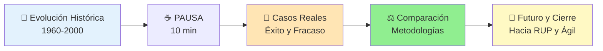

---

### 🎓 Resultados de Aprendizaje Esperados

Al terminar esta clase, deberías poder:

- [ ] Dibujar un timeline de evolución de metodologías desde 1960 hasta 2000
- [ ] Explicar por qué surgió cada metodología (problema que resolvía)
- [ ] Describir qué problema NUEVO creó cada metodología
- [ ] Identificar cómo la tecnología (mainframes, PCs, internet) influenció las metodologías
- [ ] Analizar por qué NASA Space Shuttle tuvo éxito con Espiral
- [ ] Explicar por qué HealthCare.gov falló usando Cascada
- [ ] Crear una tabla comparando 5 metodologías con al menos 10 criterios
- [ ] Usar un árbol de decisión para elegir metodología según proyecto
- [ ] Listar 3 fortalezas y 3 debilidades de cada metodología tradicional
- [ ] Explicar cómo RUP conecta con Espiral y cómo Ágil surge de limitaciones tradicionales

---

### 🔗 Conexión con Otras Clases

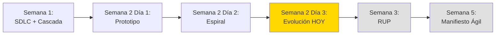

**¿Cómo se conecta esta clase?**

- **Clases anteriores (Semana 1-2):** Vimos Cascada, Prototipo y Espiral en detalle
- **Clase de HOY:** Entendemos POR QUÉ evolucionaron y cuándo usar cada una
- **Próxima semana (RUP):** Veremos cómo RUP toma lo mejor de Espiral + agrega casos de uso y arquitectura
- **Semana 5 (Ágil):** Entenderemos por qué surgió Ágil como respuesta a limitaciones de metodologías tradicionales

**Cierre de unidad:**

Esta es la **última clase de metodologías tradicionales puras**. A partir de la próxima semana, veremos metodologías híbridas (RUP, MSF) y luego ágiles (Scrum, XP, Kanban).

---

### 🧠 Mindmap: Lo que Cubriremos Hoy

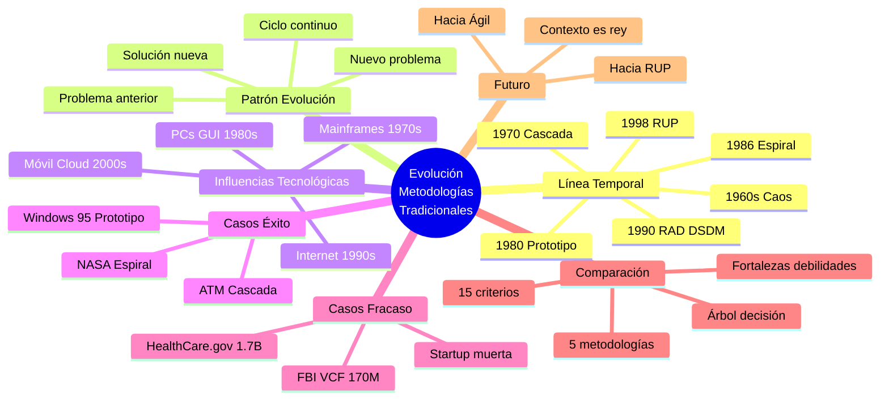

---

## 📅 BLOQUE 1: Línea Temporal y Patrón de Evolución

**Duración:** 40 minutos  
**Modalidad:** Expositiva con análisis histórico

### Objetivo del Bloque

Comprender la línea temporal de evolución de las metodologías tradicionales desde 1960 hasta 2000, identificando el patrón problema-solución-nuevo problema que impulsó cada transición, y reconocer cómo los cambios tecnológicos influyeron en el surgimiento de nuevas metodologías.

---

### 1.1 Timeline Completo: 1960-2000 (12 minutos)

#### La Evolución de 40 Años

**Timeline cronológico:**

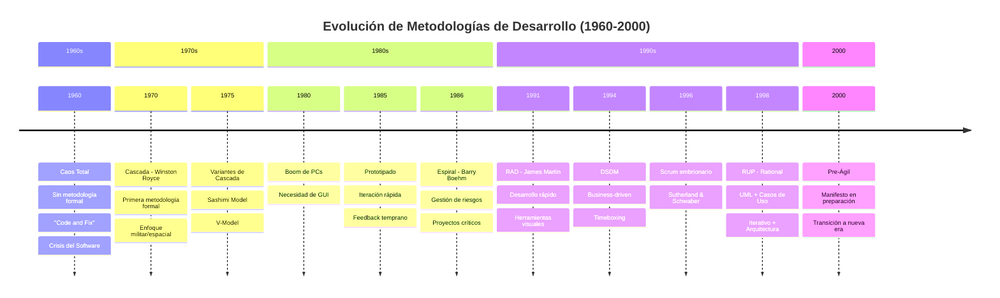

---

#### Descripción por Décadas

**📅 1960s: El Caos**

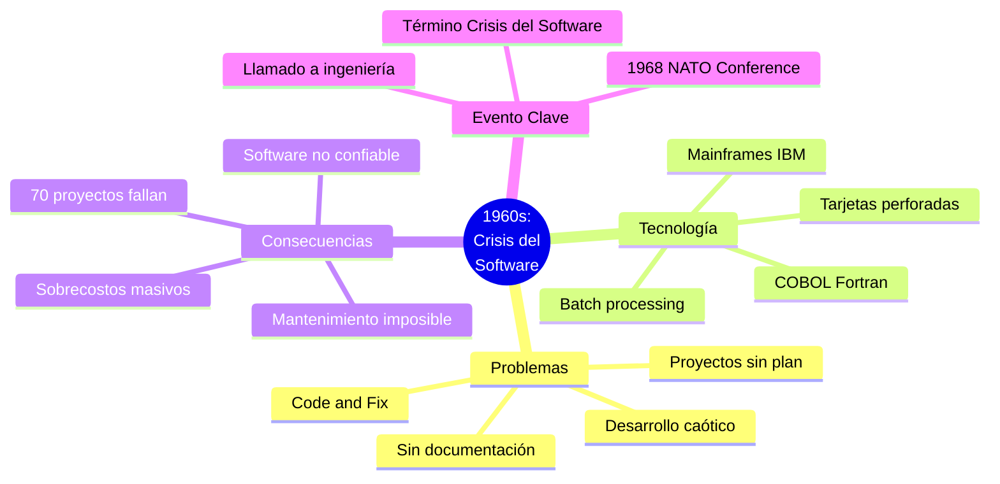

**Contexto histórico:**

- **Tecnología:** Mainframes gigantes (IBM System/360), programación con tarjetas perforadas
- **Proyectos:** Militares, espaciales (NASA Apollo), gubernamentales
- **Problema central:** No había PROCESO formal, cada programador hacía lo que quería

**Dato impactante:**

> En 1968, la NATO Software Engineering Conference documentó que **más del 70% de proyectos de software fallaban** por falta de metodología.

---

**📅 1970: Cascada - La Primera Estructura**

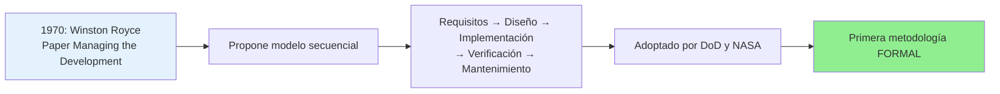

**Características:**

- **Autor:** Winston Royce (1970)
- **Origen:** Proyectos del Departamento de Defensa de USA
- **Innovación:** Introducir PROCESO y DOCUMENTACIÓN obligatoria
- **Filosofía:** "Medir dos veces, cortar una vez"

**Por qué surgió:**

```markdown
PROBLEMA (1960s): Caos total, proyectos sin estructura
↓
SOLUCIÓN (1970): Cascada con fases secuenciales y documentación
↓
BENEFICIO: Control, previsibilidad, documentación completa
```

**Impacto:**

- 🎯 Estándar de facto para proyectos grandes (1970-1990)
- 📋 Fundamento de estándares como DOD-STD-2167
- 🏢 Adoptado por empresas, gobiernos, universidades

---

**📅 1975-1985: Variantes de Cascada**

Durante esta época, surgieron variaciones intentando mejorar Cascada:

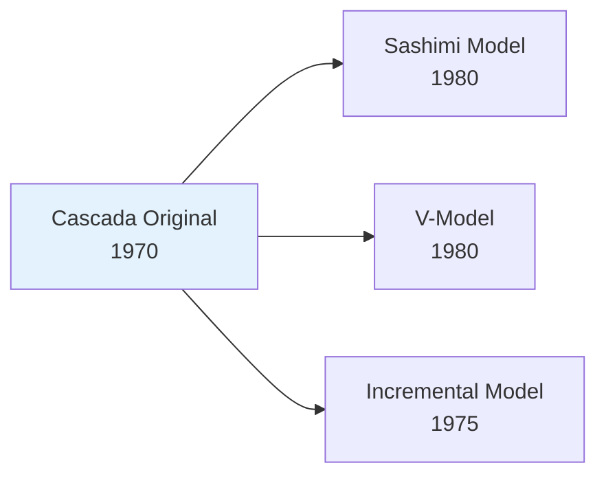

**1. Sashimi Model (1980):**

- Fases con OVERLAP (como tajadas de sashimi)
- Permite algo de paralelismo
- Problema: Sigue siendo bastante rígido

**2. V-Model (1980):**

- Énfasis en TESTING en cada fase
- Testing NO solo al final
- Forma de "V": Desarrollo ↓ → Testing ↑

**3. Incremental Model (1975):**

- Múltiples cascadas pequeñas
- Entregas parciales
- Precursor de iterativo

---

**📅 1980-1985: La Era del Prototipo**

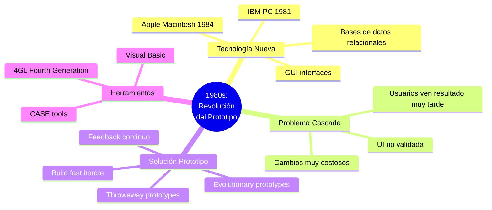

**Por qué surgió:**

```markdown
PROBLEMA: Cascada muy rígida, feedback tardío
↓
CAMBIO TECNOLÓGICO: PCs + GUI + Bases de datos rápidas
↓
SOLUCIÓN: Prototipado iterativo con validación continua
↓
NUEVO PROBLEMA: Poco control, arquitectura débil
```

---

**📅 1986: Espiral - El Control de Riesgos**

Ya vimos Espiral en detalle en la clase anterior, pero aquí su contexto evolutivo:

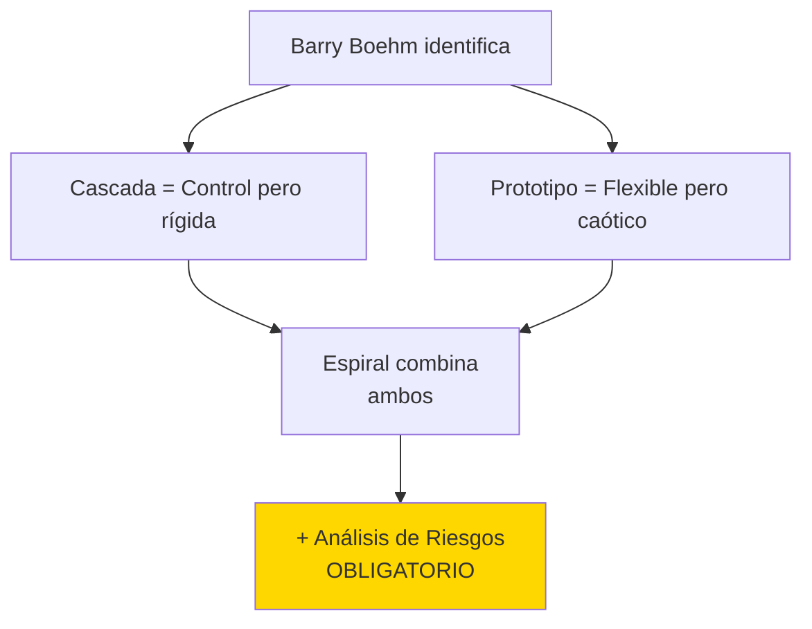

**Contexto 1986:**

- **Proyectos espaciales y militares** necesitaban LO MEJOR de ambos mundos
- **Riesgos críticos** (vidas humanas, millones de dólares)
- **Espiral** ofrece: Iteraciones + Control + Gestión de riesgos formal

---

**📅 1991: RAD - Desarrollo Rápido**

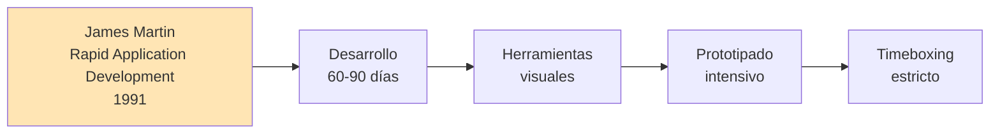

**Características de RAD:**

- **Autor:** James Martin (1991)
- **Objetivo:** Reducir tiempo de desarrollo a 60-90 días
- **Herramientas:** PowerBuilder, Visual Basic, Oracle Forms
- **Técnicas:**
  - Timeboxing (límite de tiempo fijo)
  - Joint Application Development (JAD)
  - Prototipado intensivo
  - Equipos pequeños (2-6 personas)

**Por qué surgió:**

```markdown
PROBLEMA: Cascada y Espiral muy lentos (años)
↓
CAMBIO TECNOLÓGICO: Herramientas visuales (PowerBuilder, VB)
↓
SOLUCIÓN: RAD con timeboxing estricto
↓
LIMITACIÓN: Solo para sistemas pequeños/medianos
```

---

**📅 1994: DSDM - Dynamic Systems Development Method**

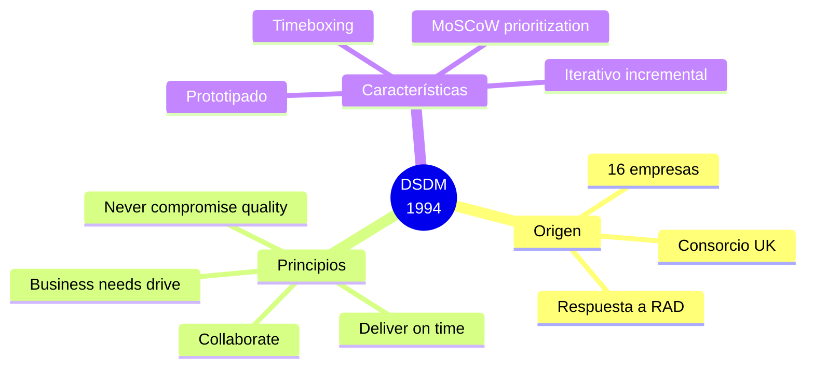

**Características:**

- **Origen:** Consorcio de empresas británicas (1994)
- **Filosofía:** "Business needs drive development"
- **Técnica clave:** MoSCoW (Must have, Should have, Could have, Won't have)
- **Enfoque:** Más estructurado que RAD

---

**📅 1998: RUP - Rational Unified Process**

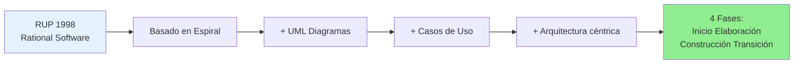

**RUP es la evolución natural:**

- **Toma:** Espiral como base (iterativo + riesgos)
- **Agrega:** UML (Unified Modeling Language)
- **Agrega:** Casos de Uso como drivers
- **Agrega:** Arquitectura como fundamento

**Por qué surgió:**

```markdown
PROBLEMA: Espiral muy abstracto, faltaba CÓMO hacerlo
↓
SOLUCIÓN: RUP con guías detalladas + UML + Best practices
↓
RESULTADO: Metodología completa y herramientizada (Rational Rose)
```

---

**📅 2000: Preparación para la Era Ágil**

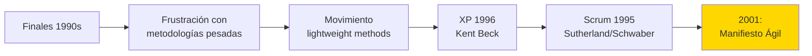

**Contexto año 2000:**

- **Tecnología:** Internet en auge, dot-com boom
- **Mercado:** Necesidad de VELOCIDAD extrema
- **Problema:** Metodologías tradicionales muy LENTAS para web
- **Movimiento:** "Lightweight methodologies" ganando tracción

---

### 1.2 Patrón: Problema → Solución → Nuevo Problema (15 minutos)

#### El Ciclo de Evolución

**Concepto central:**

> Cada metodología surge para RESOLVER el problema de la anterior, pero inevitablemente CREA un nuevo problema que la siguiente metodología intentará resolver.

```mermaid
graph LR
    A[Metodología N] --> B[Resuelve Problema X]
    B --> C[✅ Beneficio logrado]
    C --> D[⚠️ Crea Problema Y]
    D --> E[Metodología N+1]
    E --> F[Resuelve Problema Y]
    F --> G[✅ Nuevo beneficio]
    G --> H[⚠️ Crea Problema Z]
    H --> I[Metodología N+2]

    style C fill:#90EE90
    style D fill:#FFB6C6
    style G fill:#90EE90
    style H fill:#FFB6C6
```

---

#### Tabla Evolutiva Completa

| Época     | Metodología    | Problema que Resuelve                              | Solución que Ofrece                           | Nuevo Problema que Crea                                  | Siguiente Paso                      |
| --------- | -------------- | -------------------------------------------------- | --------------------------------------------- | -------------------------------------------------------- | ----------------------------------- |
| **1960s** | Ninguna (Caos) | N/A                                                | Programadores libres                          | 70% proyectos fallan, no hay control                     | Necesidad de PROCESO                |
| **1970**  | **Cascada**    | Caos y falta de estructura                         | Proceso secuencial + documentación + control  | Rigidez extrema, feedback tardío, no permite cambios     | Necesidad de FLEXIBILIDAD           |
| **1980**  | **Prototipo**  | Feedback tardío de Cascada                         | Iteraciones rápidas + validación continua     | Poco control formal, arquitectura débil, difícil escalar | Necesidad de CONTROL + FLEXIBILIDAD |
| **1986**  | **Espiral**    | Falta control (Prototipo) y flexibilidad (Cascada) | Iterativo + Control + Análisis de riesgos     | Muy complejo, costoso, lento                             | Necesidad de SIMPLIFICAR            |
| **1991**  | **RAD**        | Espiral muy lento                                  | Desarrollo 60-90 días + herramientas visuales | Solo para proyectos pequeños, menos control              | Necesidad de ESCALAR                |
| **1994**  | **DSDM**       | RAD poco estructurado                              | Timeboxing + MoSCoW + Gobernanza              | Aún pesado para startups web                             | Necesidad de VELOCIDAD EXTREMA      |
| **1998**  | **RUP**        | Espiral muy abstracto                              | Guías detalladas + UML + Casos de Uso         | MUY pesado, documentación masiva                         | Necesidad de AGILIDAD               |
| **2001+** | **Ágil**       | Metodologías pesadas lentas                        | Velocidad + Adaptabilidad + Feedback continuo | ¿Menos disciplina? ¿Difícil escalar?                     | En evolución...                     |

---

#### Diagrama de Cadena de Necesidades

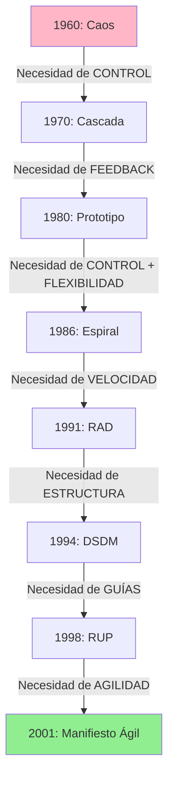

---

#### Ejemplos Concretos de Cada Transición

**Transición 1: Caos → Cascada**

```markdown
**Ejemplo: Proyecto SAGE (1950s-1960s)**

Problema:

- Sistema de defensa aérea USA
- 800+ programadores sin coordinación
- Código incompatible, bugs masivos
- $8 billones gastados (sobrecosto 300%)

Solución con Cascada (1970s):

- Fases definidas con aprobaciones
- Documentación obligatoria
- Estándares de código
- Proyectos posteriores más exitosos
```

**Transición 2: Cascada → Prototipo**

```markdown
**Ejemplo: IBM OS/360 (1960s)**

Problema con Cascada:

- 3 años de desarrollo sin ver el sistema
- UI/UX descubierta al FINAL
- Usuarios odiaban la interfaz
- $2M en rediseño de UI

Solución con Prototipo (1980s):

- Mockups tempranos validados con usuarios
- Iteraciones de UI cada 2 semanas
- 90% satisfacción de usuarios
```

**Transición 3: Prototipo → Espiral**

```markdown
**Ejemplo: Proyecto de Startup (1980s)**

Problema con Prototipo puro:

- 50 iteraciones sin plan
- Arquitectura se volvió spaghetti code
- Imposible mantener o escalar
- Proyecto cancelado después de $500K

Solución con Espiral (1990s):

- Análisis de riesgos en cada ciclo
- Arquitectura revisada formalmente
- Proyectos críticos exitosos (NASA, bancos)
```

---

### 1.3 Factores Tecnológicos que Impulsaron Cambios (13 minutos)

#### La Tecnología como Motor de Evolución

**Premisa:**

> Las metodologías NO evolucionan solo por ideas teóricas. Evolucionan porque LA TECNOLOGÍA CAMBIA y crea nuevas posibilidades y nuevos problemas.

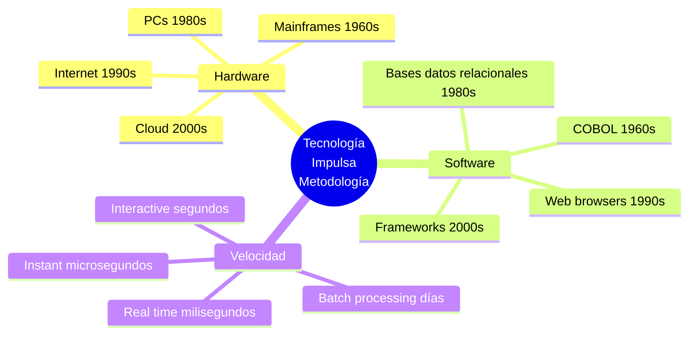

---

#### 1970s: Era de Mainframes

**Tecnología dominante:**

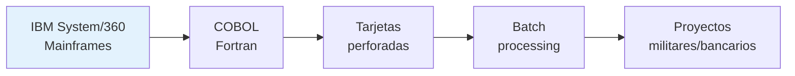

**Características:**

- **Hardware:** Mainframes del tamaño de habitaciones, carísimos ($1M+)
- **Lenguajes:** COBOL (business), Fortran (científico), Assembly
- **Input:** Tarjetas perforadas (batch processing)
- **Usuarios:** Expertos técnicos, no usuarios finales

**Impacto en metodología:**

```markdown
TECNOLOGÍA: Lenta, costosa, expertos

CONSECUENCIA METODOLÓGICA:
✅ Cascada perfecta porque:

- Cambios muy costosos (re-perforar tarjetas)
- Compilación tardaba HORAS
- No hay feedback inmediato posible
- Planificación exhaustiva NECESARIA

❌ Prototipo imposible porque:

- No hay forma de "iterar rápido"
- Usuarios no pueden probar directamente
```

**Ejemplo:**

- **Compilar un programa:** 24 horas de espera
- **Bug encontrado:** Re-perforar tarjetas, esperar otro día
- **Consecuencia:** PLANEAR TODO antes de programar (Cascada)

---

#### 1980s: Revolución de las PCs

**Tecnología nueva:**

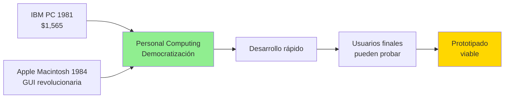

**Cambios clave:**

1. **PCs accesibles:** $1,500 vs $1M de mainframes
2. **GUI:** Interfaces gráficas (Macintosh 1984)
3. **Bases de datos relacionales:** Oracle, DB2
4. **Compiladores rápidos:** Minutos vs horas

**Impacto en metodología:**

```markdown
TECNOLOGÍA: Rápida, visual, accesible

CONSECUENCIA METODOLÓGICA:
✅ Prototipo ahora posible:

- Compilación en minutos
- Usuarios pueden ver y probar GUI
- Iterar 10-20 veces en 1 semana

✅ Feedback inmediato:

- "No me gusta este botón" → Cambio en 5 min
- Validación continua con usuarios finales
```

**Ejemplo:**

- **Proyecto:** Software de nómina con GUI
- **Antes (Cascada):** 6 meses para ver primera pantalla
- **Ahora (Prototipo):** 5 pantallas diferentes en 2 semanas
- **Resultado:** UI final aprobada por usuarios

---

#### 1990s: Era del Internet

**Explosión tecnológica:**

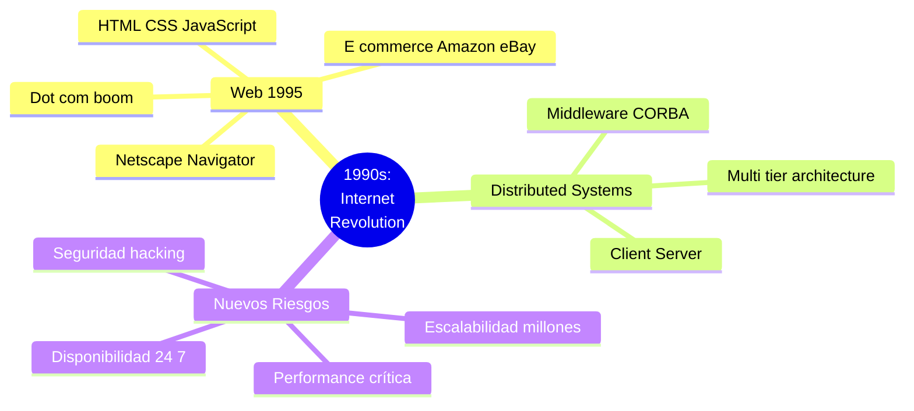

**Cambios clave:**

1. **Internet comercial:** Web browsers (Netscape 1994)
2. **E-commerce:** Amazon (1994), eBay (1995)
3. **Sistemas distribuidos:** Cliente-servidor, n-tier
4. **Nuevos riesgos:** Seguridad, escalabilidad, 24/7 uptime

**Impacto en metodología:**

```markdown
TECNOLOGÍA: Distribuida, crítica, escalable

CONSECUENCIA METODOLÓGICA:
✅ Espiral necesario por riesgos:

- Riesgo de seguridad (hackers)
- Riesgo de escalabilidad (millones de usuarios)
- Riesgo de arquitectura (sistemas distribuidos)

✅ RUP por complejidad:

- Casos de Uso para requisitos complejos
- UML para arquitectura distribuida
- Iteraciones para reducir riesgo técnico
```

**Ejemplo:**

- **Proyecto:** Sistema bancario online (1998)
- **Riesgos críticos:**
  - Seguridad (dinero)
  - Disponibilidad (24/7)
  - Performance (100K usuarios concurrentes)
- **Metodología:** Espiral con análisis de riesgos cada ciclo
- **Resultado:** Lanzamiento exitoso, 0 brechas de seguridad

---

#### 2000s: Móvil y Cloud

**Nueva era:**

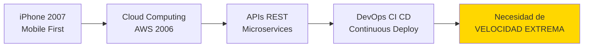

**Cambios clave:**

1. **Móvil:** iPhone (2007), App Store, desarrollo móvil
2. **Cloud:** AWS (2006), Azure, infraestructura elástica
3. **APIs:** REST, microservices, arquitectura desacoplada
4. **DevOps:** CI/CD, deployment continuo

**Impacto en metodología:**

```markdown
TECNOLOGÍA: Móvil, cloud, APIs, deploy continuo

CONSECUENCIA METODOLÓGICA:
✅ Ágil necesario por velocidad:

- Sprints de 2 semanas
- Deploy múltiple por día
- Feedback de millones de usuarios en tiempo real

❌ Metodologías tradicionales muy lentas:

- Cascada: 18 meses → App ya obsoleta
- Espiral: 6 meses por ciclo → Competencia lanzó primero
```

---

#### Visualización del Impacto Tecnológico

```mermaid
gantt
    title Tecnología → Metodología (1960-2020)
    dateFormat YYYY

    section Hardware
    Mainframes        :1960, 1990
    PCs              :1980, 2020
    Internet         :1990, 2020
    Móvil            :2007, 2020

    section Metodologías
    Cascada          :1970, 2000
    Prototipo        :1980, 2020
    Espiral          :1986, 2020
    RAD              :1991, 2010
    RUP              :1998, 2015
    Ágil             :2001, 2020
```

---

### 📊 Resumen del Bloque 1

**Lo que aprendimos:**

```mermaid
mindmap
  root((Bloque 1:<br/>Evolución<br/>Histórica))
    Timeline 1960 2000
      1960s Caos
      1970 Cascada
      1980 Prototipo
      1986 Espiral
      1991 RAD
      1994 DSDM
      1998 RUP
      2000 Pre Ágil
    Patrón Problema Solución
      Cada metodología resuelve problema
      Pero crea uno nuevo
      Ciclo continuo
      8 transiciones documentadas
    Tecnología como Motor
      Mainframes Cascada
      PCs Prototipo
      Internet Espiral RUP
      Móvil Cloud Ágil

```

**Conceptos clave:**

1. ✅ Las metodologías NO evolucionan al azar, sino por **necesidades concretas**
2. ✅ Cada metodología resuelve un problema pero **crea uno nuevo**
3. ✅ La **tecnología disponible** determina qué metodología es viable
4. ✅ **No existe metodología perfecta**, todas son trade-offs
5. ✅ Entender la evolución nos ayuda a **elegir la correcta HOY**

**Próximo paso:**

Después de la pausa, veremos **6 casos reales** (3 éxitos y 3 fracasos) para entender cómo las metodologías funcionan (o no) en proyectos reales.

---

## ☕ PAUSA

**Duración:** 10 minutos  
**Instrucciones:** Estirar, ir al baño, tomar agua.

---

## 🏢 BLOQUE 2: Casos Reales de Éxito y Fracaso

**Duración:** 50 minutos  
**Modalidad:** Análisis de casos concretos con lecciones clave

### Objetivo del Bloque

Aprender de proyectos reales qué pasa cuando elegimos la metodología CORRECTA vs la INCORRECTA según el contexto.

---

### 2.1 Casos de ÉXITO ✅ (20 minutos)

#### Caso 1: NASA Space Shuttle - Espiral (1980s)

**Contexto:**

```mermaid
graph LR
    A[NASA<br/>Space Shuttle] --> B[Software crítico<br/>Vidas en riesgo]
    B --> C[Presupuesto:<br/>$1.5 billones]
    C --> D[Duración:<br/>10 años]

    style A fill:#E3F2FD
```

**El Proyecto:**

- **Qué:** Software de control de vuelo del transbordador espacial
- **Riesgo:** CRÍTICO (fallo = muerte de astronautas)
- **Complejidad:** 400,000 líneas de código
- **Equipo:** 200+ ingenieros

**Por qué Espiral:**

```markdown
✅ Análisis de riesgos OBLIGATORIO cada ciclo
✅ Prototipos de subsistemas críticos
✅ Simulaciones extensivas antes de cada vuelo
✅ Documentación exhaustiva (requisito NASA)
✅ Decisiones go/no-go formales
```

**Resultados:**

```mermaid
graph LR
    A[135 misiones] --> B[0 fallas de software ✅]
    B --> C[99.9999% confiabilidad]
    C --> D[Éxito total]

    style D fill:#90EE90
```

**📌 Lección clave:**

> **Espiral es PERFECTO cuando:**
>
> - Riesgo crítico (vidas, millones)
> - No puedes darte el lujo de fallar
> - Tienes presupuesto y tiempo para análisis formal

---

#### Caso 2: Sistema ATM Banco Santander - Cascada (1990)

**Contexto:**

```mermaid
mindmap
  root((ATM<br/>Santander<br/>1990))
    Proyecto
      50 países
      10000 cajeros
      Regulación bancaria
    Requisitos
      MUY claros
      No cambian
      Estándar internacional
    Metodología
      Cascada pura
      Documentación completa
      Certificación formal
```

**El Proyecto:**

- **Qué:** Sistema de cajeros automáticos internacional
- **Alcance:** 50 países, 10,000+ ATMs
- **Duración:** 3 años
- **Presupuesto:** $200M

**Por qué Cascada funcionó:**

```markdown
✅ Requisitos CRISTALINOS (estándar bancario internacional)
✅ NO cambian (regulación estricta)
✅ Documentación CRÍTICA (auditorías)
✅ Hardware específico (ATM físicos)
✅ Testing exhaustivo necesario
```

**Resultados:**

- ✅ Implementación en 50 países exitosa
- ✅ Aún funciona hoy (35+ años después)
- ✅ 0 brechas de seguridad graves
- ✅ Dentro de presupuesto

**📌 Lección clave:**

> **Cascada funciona MUY BIEN cuando:**
>
> - Requisitos muy claros y estables
> - Regulación estricta requiere documentación
> - Hardware físico involucrado
> - NO necesitas feedback de usuarios finales frecuente

---

#### Caso 3: Windows 95 UI - Prototipo (1993-1995)

**Contexto:**

```mermaid
graph LR
    A[Microsoft<br/>Windows 95] --> B[Rediseño UI<br/>completo]
    B --> C[Objetivo:<br/>Interfaz revolucionaria]
    C --> D[300+ iteraciones]

    style D fill:#FFD700
```

**El Proyecto:**

- **Qué:** Rediseño completo de interfaz de Windows
- **Innovación:** Botón Start, Taskbar, Plug & Play
- **Duración:** 2 años de prototipado UI
- **Equipo:** 20 diseñadores + desarrolladores

**Por qué Prototipo:**

```markdown
✅ NO sabían qué UI funcionaría mejor
✅ Necesitaban feedback constante de usuarios
✅ Probaron 300+ variaciones de diseño
✅ A/B testing de botones, menús, colores
✅ Iteraciones rápidas (1 semana por prototipo)
```

**El Proceso:**

1. **Prototipo en papel** (50+ diseños)
2. **Mockups digitales** (100+ variaciones)
3. **Prototipos funcionales** (30 versiones)
4. **Beta testing** (100,000 usuarios)
5. **Producto final** (lanzamiento 1995)

**Resultados:**

- ✅ UI revolucionaria (Start button icónico)
- ✅ 7 millones de copias primera semana
- ✅ Definió estándar de UI por 20+ años
- ✅ 90% satisfacción de usuarios

**📌 Lección clave:**

> **Prototipo es IDEAL cuando:**
>
> - Diseño/UX es lo más importante
> - NO sabes qué funcionará (exploración)
> - Necesitas feedback de usuarios constantemente
> - Puedes iterar rápido

---

### 2.2 Casos de FRACASO ❌ (25 minutos)

#### Caso 4: HealthCare.gov - Cascada Mal Aplicada (2013)

**Contexto:**

```mermaid
graph LR
    A[HealthCare.gov<br/>Portal salud USA] --> B[Presupuesto:<br/>$1.7 BILLONES 💸]
    B --> C[Resultado:<br/>FRACASO TOTAL]
    C --> D[Solo 6 usuarios<br/>registrados día 1]

    style C fill:#FFB6C6
    style D fill:#FFB6C6
```

**El Proyecto:**

- **Qué:** Portal de seguros de salud del gobierno USA (Obamacare)
- **Objetivo:** 1 millón de usuarios día 1
- **Realidad:** Solo 6 personas pudieron registrarse
- **Costo:** $1.7 billones desperdiciados

**¿Qué salió mal?**

```markdown
❌ Usaron Cascada para proyecto con requisitos CAMBIANTES
❌ 3 años de desarrollo sin validación con usuarios reales
❌ Lanzamiento "big bang" el 1 de octubre 2013
❌ Sistema colapsó inmediatamente
❌ 42 horas de downtime continuo
❌ Expectativa: 1M usuarios → Realidad: 6 usuarios ❌
```

**Timeline del desastre:**

| Fecha           | Evento                                       |
| --------------- | -------------------------------------------- |
| **2010-2013**   | Desarrollo con Cascada (3 años sin feedback) |
| **Oct 1, 2013** | Lanzamiento oficial                          |
| **Oct 1, 8am**  | Sistema colapsa inmediatamente               |
| **Oct 1-3**     | 42 horas de downtime                         |
| **Oct 4**       | Solo 6 personas registradas exitosamente     |
| **Nov 2013**    | Equipo de rescate (metodología Ágil)         |
| **Dic 2013**    | Sistema finalmente estable                   |

**¿Qué hubieran debido hacer?**

```markdown
✅ Usar Ágil o Espiral:

- Lanzamiento gradual (10% → 50% → 100%)
- Beta testing con 10K usuarios primero
- Iteraciones de 2 semanas
- Load testing progresivo

✅ Validación temprana:

- Prototipos con usuarios reales
- Feedback cada sprint
- Ajustes según necesidad
```

**📌 Lección clave:**

> **Cascada FALLA cuando:**
>
> - Requisitos cambian constantemente (política)
> - Proyecto muy grande y complejo
> - Lanzamiento "big bang" arriesgado
> - NO puedes validar con usuarios hasta el final

**Costo del error:** $1.7B + daño reputacional masivo

---

#### Caso 5: FBI Virtual Case File - Sin Metodología Clara (2005)

**Contexto:**

```mermaid
graph LR
    A[FBI VCF<br/>Sistema casos] --> B[$170 millones<br/>gastados]
    B --> C[4 años<br/>desarrollo]
    C --> D[0% funcional<br/>Cancelado ❌]

    style D fill:#FFB6C6
```

**El Proyecto:**

- **Qué:** Sistema digital para gestión de casos criminales del FBI
- **Objetivo:** Reemplazar archivos en papel
- **Duración:** 4 años (2001-2005)
- **Resultado:** Proyecto CANCELADO, 0% funcional

**¿Qué salió mal?**

```markdown
❌ Mezclaron metodologías sin criterio
❌ Cambios de requisitos cada 3 meses
❌ Sin arquitectura clara
❌ 5 contratistas diferentes (sin coordinación)
❌ Sin gestión de riesgos
❌ 17 funcionalidades críticas NO implementadas
```

**El caos metodológico:**

```mermaid
graph LR
    A[Año 1: Cascada] --> B[Año 2: Prototipo]
    B --> C[Año 3: Mix confuso]
    C --> D[Año 4: Caos total]
    D --> E[Cancelación ❌]

    style E fill:#FFB6C6
```

**Números del fracaso:**

- 💸 **$170 millones** gastados
- ⏰ **4 años** perdidos
- 📊 **0%** funcionalidad completada
- 🔥 **Proyecto cancelado** en 2005
- 🚨 Investigación del Congreso USA

**¿Qué hubieran debido hacer?**

```markdown
✅ Elegir UNA metodología y seguirla:

- Espiral (por complejidad y riesgos)
- O RUP (por requisitos complejos)

✅ Gestión de riesgos formal:

- Análisis de riesgos en cada ciclo
- Decisiones go/no-go
- Cancelar temprano si no funciona

✅ Arquitectura sólida desde inicio:

- Arquitecto líder con autoridad
- Revisiones técnicas obligatorias
```

**📌 Lección clave:**

> **NO puedes:**
>
> - Mezclar metodologías sin plan
> - Cambiar de metodología cada año
> - Seguir sin gestión de riesgos en proyectos complejos
> - Tener 5 contratistas sin coordinación

**FBI aprendió la lección:** El siguiente sistema (Sentinel, 2012) usó Ágil y fue EXITOSO.

---

#### Caso 6: Startup Fintech con Espiral - Overkill (2019)

**Contexto:**

```mermaid
graph LR
    A[Startup<br/>App pagos móvil] --> B[5 personas<br/>Equipo pequeño]
    B --> C[Usaron Espiral<br/>Metodología pesada]
    C --> D[18 meses<br/>para MVP]
    D --> E[Startup murió ❌]

    style E fill:#FFB6C6
```

**El Proyecto:**

- **Qué:** App móvil de pagos peer-to-peer
- **Equipo:** 5 personas (2 devs, 1 designer, 1 PM, 1 CEO)
- **Competencia:** Venmo, Zelle ya existían
- **Presupuesto:** $500K de inversionistas

**¿Qué salió mal?**

```markdown
❌ Usaron Espiral (muy pesado) para proyecto simple
❌ Análisis de riesgos formal cada ciclo (overkill)
❌ Documentación exhaustiva (nadie la leía)
❌ 6 ciclos de 3 meses cada uno
❌ Competencia lanzó en 4 meses
❌ 18 meses para MVP = demasiado tarde
```

**Comparación fatal:**

| Métrica                   | Startup con Espiral | Competencia con Ágil |
| ------------------------- | ------------------- | -------------------- |
| **Tiempo a MVP**          | 18 meses ❌         | 4 meses ✅           |
| **Usuarios al año 1**     | 0 (no lanzaron)     | 50,000 ✅            |
| **Overhead metodológico** | 40% tiempo          | 10% tiempo           |
| **Resultado**             | Murió sin lanzar    | Exitosa              |

**¿Qué hubieran debido hacer?**

```markdown
✅ Usar Ágil/Scrum:

- Sprints de 2 semanas
- MVP en 2-3 meses
- Lanzar rápido, iterar después

✅ Prototipo rápido:

- Validar idea con usuarios en 1 mes
- Mockups, no análisis formal de riesgos

✅ Lean Startup:

- Build-Measure-Learn
- Pivot rápido si no funciona
```

**📌 Lección clave:**

> **Espiral es OVERKILL cuando:**
>
> - Startup pequeña (< 10 personas)
> - Producto simple (app móvil básica)
> - Time-to-market es CRÍTICO
> - Competencia ya existe
> - Presupuesto limitado

**Ironía:** El análisis de riesgos formal de Espiral no identificó el riesgo #1: **Llegar tarde al mercado**.

---

### 2.3 Síntesis: ¿Qué Aprendemos? (5 minutos)

#### Tabla Comparativa: Éxito vs Fracaso

```mermaid
graph TB
    subgraph "Factores de ÉXITO ✅"
        A1[Metodología<br/>APROPIADA<br/>para contexto]
        A2[Requisitos<br/>CLAROS<br/>o flexibilidad]
        A3[Equipo<br/>CAPACITADO<br/>en metodología]
        A4[Stakeholders<br/>COMPROMETIDOS]
    end

    subgraph "Factores de FRACASO ❌"
        F1[Metodología<br/>INCORRECTA<br/>para contexto]
        F2[Requisitos<br/>CAMBIANTES<br/>con método rígido]
        F3[Mezclar<br/>METODOLOGÍAS<br/>sin criterio]
        F4[Overhead<br/>EXCESIVO<br/>para proyecto]
    end

    style A1 fill:#90EE90
    style F1 fill:#FFB6C6
```

#### Matriz de Decisión Rápida

| Contexto                             | Metodología CORRECTA | Metodología INCORRECTA          |
| ------------------------------------ | -------------------- | ------------------------------- |
| **Riesgo crítico (vidas, millones)** | ✅ Espiral           | ❌ Prototipo (poco control)     |
| **Requisitos muy claros y estables** | ✅ Cascada           | ❌ Ágil (overhead innecesario)  |
| **Exploración UI/UX**                | ✅ Prototipo         | ❌ Cascada (feedback tardío)    |
| **Startup rápida**                   | ✅ Ágil/Lean         | ❌ Espiral (muy lento)          |
| **Proyecto complejo incierto**       | ✅ Espiral o RUP     | ❌ Cascada (muy rígida)         |
| **Requisitos cambiantes**            | ✅ Ágil              | ❌ Cascada (no permite cambios) |

#### Las 3 Reglas de Oro

```markdown
🥇 REGLA 1: No existe metodología perfecta
→ Todas son trade-offs
→ El contexto es REY

🥈 REGLA 2: Más pesada ≠ Mejor
→ Espiral es excelente... pero NO para startups
→ Ágil es rápido... pero NO para proyectos críticos

🥉 REGLA 3: Aprende de los fracasos
→ HealthCare.gov: Cascada + Requisitos cambiantes = Desastre
→ FBI VCF: Sin metodología clara = Caos
→ Startup: Metodología muy pesada = Muerte
```

---

### 📊 Resumen del Bloque 2

**Casos vistos:**

```mermaid
mindmap
  root((6 Casos<br/>Reales))
    ÉXITOS ✅
      NASA Espiral
        135 misiones
        0 fallas software
      ATM Cascada
        50 países
        35 años funcionando
      Windows 95 Prototipo
        300 iteraciones
        UI revolucionaria
    FRACASOS ❌
      HealthCare.gov
        1.7B perdidos
        Cascada mal aplicada
      FBI VCF
        170M perdidos
        Sin metodología clara
      Startup Fintech
        Espiral overkill
        18 meses tarde
```

**Lección principal:**

> **La metodología CORRECTA depende 100% del CONTEXTO del proyecto.**

**Próximo paso:**

Ahora haremos una comparación profunda de todas las metodologías para saber exactamente cuándo usar cada una.

---

## 🔍 Bloque 3: Análisis Comparativo Profundo (30 min)

> **Objetivo:** Comparar metodologías en 15 criterios para tomar decisiones informadas sobre cuál usar en cada contexto.

### 3.1 Matriz Comparativa Gigante (15 min)

**Las 5 metodologías tradicionales principales:**

```mermaid
graph LR
    A[Metodologías<br/>Tradicionales] --> B[Cascada 1970]
    A --> C[Prototipo 1980]
    A --> D[Espiral 1986]
    A --> E[RAD 1991]
    A --> F[DSDM 1994]

    style A fill:#4A90E2
    style B fill:#E8F4FF
    style C fill:#E8F4FF
    style D fill:#E8F4FF
    style E fill:#E8F4FF
    style F fill:#E8F4FF
```

#### 📊 Tabla Comparativa Completa

| **Criterio**                   | **Cascada**               | **Prototipo**          | **Espiral**           | **RAD**            | **DSDM**              |
| ------------------------------ | ------------------------- | ---------------------- | --------------------- | ------------------ | --------------------- |
| **📐 Estructura**              | Linear secuencial         | Iterativa exploratoria | Iterativa incremental | Iterativa rápida   | Iterativa timeboxed   |
| **🔄 Iteraciones**             | 0 (una pasada)            | 5-20 de diseño         | 4-6 ciclos completos  | 2-4 ciclos cortos  | Múltiples timeboxes   |
| **⚠️ Gestión Riesgos**         | ❌ No formal              | ⚠️ Implícita           | ✅ Explícita central  | ⚠️ Básica          | ✅ Incorporada        |
| **📄 Documentación**           | 🔴 Muy alta               | 🟡 Media-baja          | 🔴 Muy alta           | 🟢 Baja            | 🟡 Media              |
| **🎯 Flexibilidad**            | 🔴 Muy baja               | 🟢 Alta                | 🟡 Media              | 🟢 Muy alta        | 🟢 Alta               |
| **🎛️ Control**                 | 🟢 Muy alto               | 🔴 Bajo                | 🟢 Alto               | 🟡 Medio           | 🟢 Alto               |
| **💰 Costo**                   | 🟢 Predecible             | 🟡 Variable            | 🔴 Alto               | 🟡 Variable        | 🟡 Medio              |
| **⏱️ Tiempo**                  | 🔴 Largo (años)           | 🟡 Medio               | 🔴 Largo              | 🟢 Corto (días)    | 🟢 Corto (meses)      |
| **👥 Tamaño Equipo**           | 10-200 personas           | 3-15 personas          | 20-100 personas       | 3-10 personas      | 5-20 personas         |
| **📦 Tamaño Proyecto**         | Grande/Enorme             | Pequeño/Mediano        | Grande/Crítico        | Pequeño            | Mediano               |
| **📋 Tipo Requisitos**         | Claros y estables         | Inciertos/UI           | Variables+riesgos     | Claros+urgentes    | Semi-claros           |
| **👨‍💼 Involucramiento Cliente** | 🔴 Bajo (solo inicio/fin) | 🟢 Alto continuo       | 🟡 Medio periódico    | 🟢 Muy alto diario | 🟢 Alto continuo      |
| **📈 Curva Aprendizaje**       | 🟢 Fácil                  | 🟢 Fácil               | 🔴 Difícil            | 🟡 Media           | 🟡 Media              |
| **✅ Mejor para**              | Proyectos regulados       | Diseño/UX              | Sistemas críticos     | Apps rápidas       | Proyectos business    |
| **❌ Peor para**               | Startups innovación       | Backend sin UI         | Startups pequeñas     | Sistemas críticos  | Proyectos sin sponsor |

**Leyenda:**

- 🟢 = Excelente/Óptimo
- 🟡 = Aceptable/Medio
- 🔴 = Limitado/Problemático
- ✅ = Tiene
- ❌ = No tiene
- ⚠️ = Parcial

#### 🔍 Visualización de Características Clave

```mermaid
graph LR
    subgraph Cascada
        C1[Control Máximo] --> C2[Documentación Completa]
        C2 --> C3[Costo Predecible]
        C3 --> C4[❌ Flexibilidad Cero]
    end

    subgraph Prototipo
        P1[Feedback Continuo] --> P2[UI/UX Excelente]
        P2 --> P3[Cliente Involucrado]
        P3 --> P4[❌ Poco Control]
    end

    subgraph Espiral
        E1[Gestión Riesgos] --> E2[Análisis Profundo]
        E2 --> E3[Alta Calidad]
        E3 --> E4[❌ Muy Costoso]
    end

    subgraph RAD
        R1[Velocidad Extrema] --> R2[Herramientas 4GL]
        R2 --> R3[Timeboxing Estricto]
        R3 --> R4[❌ No Escalable]
    end

    subgraph DSDM
        D1[Priorización MoSCoW] --> D2[Timeboxes]
        D2 --> D3[Gobierno Claro]
        D3 --> D4[❌ Necesita Sponsor]
    end

    style C1 fill:#FFE5E5
    style P1 fill:#E5F5FF
    style E1 fill:#FFF5E5
    style R1 fill:#E5FFE5
    style D1 fill:#F5E5FF
```

#### 📈 Gráfico de Radar: Comparación Visual

**Criterios evaluados (escala 1-10):**

```mermaid
graph TD
    A[Comparación de<br/>Metodologías] --> B[Cascada:<br/>Control 10, Flexibilidad 2]
    A --> C[Prototipo:<br/>Flexibilidad 9, Control 3]
    A --> D[Espiral:<br/>Riesgos 10, Velocidad 3]
    A --> E[RAD:<br/>Velocidad 10, Escalabilidad 3]
    A --> F[DSDM:<br/>Balance 7, Todo medio]

    style A fill:#4A90E2
    style B fill:#FFE5E5
    style C fill:#E5F5FF
    style D fill:#FFF5E5
    style E fill:#E5FFE5
    style F fill:#F5E5FF
```

**Tabla de puntuaciones (1-10):**

| **Criterio**    | **Cascada** | **Prototipo** | **Espiral** | **RAD** | **DSDM** |
| --------------- | ----------- | ------------- | ----------- | ------- | -------- |
| Control         | 10          | 3             | 9           | 5       | 8        |
| Flexibilidad    | 2           | 9             | 6           | 10      | 8        |
| Gestión Riesgos | 3           | 4             | 10          | 4       | 7        |
| Velocidad       | 3           | 6             | 3           | 10      | 7        |
| Documentación   | 10          | 4             | 9           | 2       | 6        |
| Escalabilidad   | 8           | 4             | 9           | 3       | 7        |
| Costo           | 7           | 6             | 3           | 6       | 7        |
| Facilidad       | 9           | 9             | 3           | 7       | 6        |

**Interpretación:**

- **Cascada:** Especialista en control y documentación, pero inflexible
- **Prototipo:** Rey de la flexibilidad, pero caótico
- **Espiral:** Campeón de riesgos, pero lento y caro
- **RAD:** Velocista extremo, pero no escala
- **DSDM:** Balanceado, pero necesita madurez organizacional

---

### 3.2 Árbol de Decisión Interactivo (10 min)

> **Pregunta clave:** ¿Cómo saber qué metodología usar en mi proyecto?

#### 🌳 Árbol de Decisión

```mermaid
graph TD
    START[Mi Proyecto] --> Q1{¿Vidas en riesgo o<br/>crítico para negocio?}

    Q1 -->|SÍ| Q2{¿Tengo presupuesto<br/>grande 1M+?}
    Q1 -->|NO| Q3{¿Requisitos claros<br/>y estables?}

    Q2 -->|SÍ| ESPIRAL[✅ ESPIRAL<br/>Análisis de riesgos<br/>formal obligatorio]
    Q2 -->|NO| Q3B{¿Al menos requisitos<br/>claros?}

    Q3 -->|SÍ| Q4{¿Proyecto regulado?<br/>Gov/Finanzas/Salud}
    Q3 -->|NO| Q5{¿Exploración de<br/>diseño/UX?}

    Q3B -->|SÍ| DSDM2[✅ DSDM<br/>Balance riesgo-costo]
    Q3B -->|NO| PROTO2[⚠️ Muy riesgoso<br/>Necesitas consultoría]

    Q4 -->|SÍ| Q6{¿Equipo grande<br/>20+ personas?}
    Q4 -->|NO| Q7{¿Necesitas velocidad<br/>extrema 60-90 días?}

    Q5 -->|SÍ| PROTO[✅ PROTOTIPO<br/>Iteraciones de diseño<br/>con usuarios]
    Q5 -->|NO| Q8{¿Tienes menos de<br/>3 meses?}

    Q6 -->|SÍ| CASCADA[✅ CASCADA<br/>Control formal<br/>Documentación completa]
    Q6 -->|NO| DSDM[✅ DSDM<br/>Cascada ligera<br/>con timeboxes]

    Q7 -->|SÍ| RAD[✅ RAD<br/>60-90 días máximo<br/>Herramientas 4GL]
    Q7 -->|NO| CASCADA2[✅ CASCADA<br/>Proceso tradicional]

    Q8 -->|SÍ| RAD2[✅ RAD<br/>Velocidad máxima]
    Q8 -->|NO| PROTO3[✅ PROTOTIPO<br/>Exploración iterativa]

    style START fill:#4A90E2
    style ESPIRAL fill:#FFF5E5
    style CASCADA fill:#FFE5E5
    style CASCADA2 fill:#FFE5E5
    style PROTO fill:#E5F5FF
    style PROTO2 fill:#FFE5E5
    style PROTO3 fill:#E5F5FF
    style RAD fill:#E5FFE5
    style RAD2 fill:#E5FFE5
    style DSDM fill:#F5E5FF
    style DSDM2 fill:#F5E5FF
```

#### 📋 10 Escenarios Reales con Respuesta

| #   | **Escenario**                                              | **Metodología**         | **¿Por qué?**                                        |
| --- | ---------------------------------------------------------- | ----------------------- | ---------------------------------------------------- |
| 1   | Startup app móvil, 3 personas, 6 meses                     | 🟢 **Prototipo o RAD**  | Equipo pequeño, necesita validar diseño rápido       |
| 2   | Sistema bancario nueva sede, requisitos claros, 50 devs    | 🔴 **Cascada**          | Regulado, equipo grande, requisitos estables         |
| 3   | App salud con datos pacientes, 10 personas, innovadora     | 🟡 **Espiral**          | Riesgos médicos + legales requieren análisis formal  |
| 4   | Sistema de facturación gobierno, 3 años, documentación     | 🔴 **Cascada**          | Gobierno siempre requiere docs formales y control    |
| 5   | Rediseño UX app existente, 5 diseñadores, 4 meses          | 🟢 **Prototipo**        | Exploración diseño, feedback usuarios continuo       |
| 6   | Software control tráfico aéreo, 100 devs, vida en riesgo   | 🟡 **Espiral**          | Crítico de seguridad, análisis riesgos obligatorio   |
| 7   | Dashboard ejecutivo urgente, 60 días, 4 personas           | 🟢 **RAD**              | Timeboxing extremo, herramientas low-code            |
| 8   | ERP personalizado retail, 20 personas, 18 meses            | 🟣 **DSDM**             | Proyecto business con sponsor, necesita balance      |
| 9   | Migración legacy a cloud, riesgos técnicos, sin regulación | 🟡 **Espiral o DSDM**   | Riesgos técnicos requieren análisis, pero no crítico |
| 10  | App e-commerce estándar, 8 personas, 12 meses              | 🟢 **Prototipo + DSDM** | Explorar UI luego estructura con timeboxes           |

**Código de colores:**

- 🔴 Cascada
- 🟢 Prototipo / RAD
- 🟡 Espiral
- 🟣 DSDM

#### 🎯 Reglas de Oro para Decidir

```mermaid
graph LR
    A[¿Qué metodología?] --> B{Pregunta 1}
    B --> C[¿Pueden morir personas?]
    C -->|SÍ| D[ESPIRAL obligatorio]
    C -->|NO| E{Pregunta 2}

    E --> F[¿Requisitos 100% claros?]
    F -->|SÍ| G[Cascada o DSDM]
    F -->|NO| H{Pregunta 3}

    H --> I[¿Tienes menos de 90 días?]
    I -->|SÍ| J[RAD]
    I -->|NO| K[Prototipo o DSDM]

    style D fill:#FFF5E5
    style G fill:#FFE5E5
    style J fill:#E5FFE5
    style K fill:#E5F5FF
```

---

### 3.3 Fortalezas y Debilidades Detalladas (5 min)

#### 1️⃣ Cascada

```mermaid
graph TB
    subgraph Fortalezas
        F1[📐 Estructura clara<br/>fácil de entender]
        F2[📄 Documentación completa<br/>trazabilidad total]
        F3[💰 Presupuesto predecible<br/>sin sorpresas]
        F4[🎯 Control total<br/>progreso medible]
    end

    subgraph Debilidades
        D1[🔒 Cero flexibilidad<br/>cambios imposibles]
        D2[⏱️ Testing al final<br/>bugs caros]
        D3[😰 Cliente ve resultado<br/>después de años]
        D4[📉 Alto riesgo si<br/>requisitos cambian]
    end

    style F1 fill:#E8F5E9
    style F2 fill:#E8F5E9
    style F3 fill:#E8F5E9
    style F4 fill:#E8F5E9
    style D1 fill:#FFEBEE
    style D2 fill:#FFEBEE
    style D3 fill:#FFEBEE
    style D4 fill:#FFEBEE
```

**Usar cuando:**

- ✅ Requisitos 100% claros y NO cambiarán
- ✅ Proyecto regulado (gobierno, finanzas, salud)
- ✅ Equipo grande (20+ personas) necesita coordinación
- ✅ Documentación es requisito legal

**NO usar cuando:**

- ❌ Requisitos inciertos o cambiarán
- ❌ Startup innovadora con pivotes
- ❌ Necesitas feedback rápido
- ❌ Tecnología nueva sin experiencia previa

---

#### 2️⃣ Prototipo

```mermaid
graph TB
    subgraph Fortalezas
        F1[👥 Feedback continuo<br/>cliente siempre involucrado]
        F2[🎨 Diseño/UX excelente<br/>múltiples iteraciones]
        F3[✨ Innovación<br/>experimentación segura]
        F4[😊 Usuarios satisfechos<br/>ve progreso real]
    end

    subgraph Debilidades
        D1[🌀 Caos organizacional<br/>sin estructura]
        D2[📄 Poca documentación<br/>difícil mantenimiento]
        D3[💸 Costo impredecible<br/>iteraciones infinitas]
        D4[🎭 Riesgo prototype<br/>se vuelve producción]
    end

    style F1 fill:#E8F5E9
    style F2 fill:#E8F5E9
    style F3 fill:#E8F5E9
    style F4 fill:#E8F5E9
    style D1 fill:#FFEBEE
    style D2 fill:#FFEBEE
    style D3 fill:#FFEBEE
    style D4 fill:#FFEBEE
```

**Usar cuando:**

- ✅ Proyecto centrado en diseño/UX
- ✅ Requisitos poco claros, necesitas explorar
- ✅ Cliente disponible para feedback continuo
- ✅ Proyecto pequeño-mediano (3-15 personas)

**NO usar cuando:**

- ❌ Necesitas documentación formal
- ❌ Backend sin interfaz de usuario
- ❌ Equipo sin disciplina (riesgo caos)
- ❌ Proyecto crítico de seguridad

---

#### 3️⃣ Espiral

```mermaid
graph TB
    subgraph Fortalezas
        F1[⚠️ Gestión riesgos<br/>explícita y formal]
        F2[🎯 Alta calidad<br/>múltiples validaciones]
        F3[🔄 Combina ventajas<br/>Cascada + Prototipo]
        F4[✅ Ideal crítico<br/>vidas o dinero riesgo]
    end

    subgraph Debilidades
        D1[💰 Muy costoso<br/>análisis extensos]
        D2[⏱️ Muy lento<br/>ciclos largos]
        D3[📚 Complejidad alta<br/>requiere expertos]
        D4[🏢 Overkill startups<br/>pequeñas empresas]
    end

    style F1 fill:#E8F5E9
    style F2 fill:#E8F5E9
    style F3 fill:#E8F5E9
    style F4 fill:#E8F5E9
    style D1 fill:#FFEBEE
    style D2 fill:#FFEBEE
    style D3 fill:#FFEBEE
    style D4 fill:#FFEBEE
```

**Usar cuando:**

- ✅ Vidas en riesgo (salud, aviación, militar)
- ✅ Dinero en riesgo (finanzas, seguros)
- ✅ Proyecto grande con riesgos técnicos complejos
- ✅ Presupuesto disponible para análisis formal

**NO usar cuando:**

- ❌ Startup con 5 personas
- ❌ Necesitas lanzar en 3-6 meses
- ❌ Proyecto simple sin riesgos críticos
- ❌ Equipo sin experiencia en metodologías formales

---

#### 4️⃣ RAD

```mermaid
graph TB
    subgraph Fortalezas
        F1[⚡ Velocidad extrema<br/>60-90 días máximo]
        F2[🛠️ Herramientas 4GL<br/>productividad 10x]
        F3[📦 Timeboxing estricto<br/>deadlines cumplidos]
        F4[👥 Equipos pequeños<br/>alta colaboración]
    end

    subgraph Debilidades
        D1[📏 No escalable<br/>proyectos grandes]
        D2[🎨 Diseño sacrificado<br/>prioridad velocidad]
        D3[🔧 Dependencia herramientas<br/>vendor lock-in]
        D4[⚠️ No para sistemas<br/>críticos o complejos]
    end

    style F1 fill:#E8F5E9
    style F2 fill:#E8F5E9
    style F3 fill:#E8F5E9
    style F4 fill:#E8F5E9
    style D1 fill:#FFEBEE
    style D2 fill:#FFEBEE
    style D3 fill:#FFEBEE
    style D4 fill:#FFEBEE
```

**Usar cuando:**

- ✅ Deadline urgente (60-90 días máximo)
- ✅ Proyecto pequeño (3-10 personas)
- ✅ Tienes herramientas 4GL/low-code
- ✅ Requisitos claros pero necesitas rapidez

**NO usar cuando:**

- ❌ Proyecto grande (20+ personas)
- ❌ Sistema crítico de seguridad
- ❌ Necesitas arquitectura compleja
- ❌ Proyecto durará varios años

---

#### 5️⃣ DSDM

```mermaid
graph TB
    subgraph Fortalezas
        F1[⚖️ Balance perfecto<br/>estructura + flexibilidad]
        F2[🎯 MoSCoW priorización<br/>foco en esencial]
        F3[📦 Timeboxes<br/>entregas predecibles]
        F4[🏢 Gobierno claro<br/>roles definidos]
    end

    subgraph Debilidades
        D1[👔 Necesita sponsor<br/>ejecutivo comprometido]
        D2[📚 Curva aprendizaje<br/>media-alta]
        D3[🏢 Requiere madurez<br/>organizacional]
        D4[💰 Certificación cara<br/>DSDM Consortium]
    end

    style F1 fill:#E8F5E9
    style F2 fill:#E8F5E9
    style F3 fill:#E8F5E9
    style F4 fill:#E8F5E9
    style D1 fill:#FFEBEE
    style D2 fill:#FFEBEE
    style D3 fill:#FFEBEE
    style D4 fill:#FFEBEE
```

**Usar cuando:**

- ✅ Proyecto business con sponsor ejecutivo
- ✅ Necesitas balance control + flexibilidad
- ✅ Organización madura (no startup caótica)
- ✅ Equipo 5-20 personas

**NO usar cuando:**

- ❌ Startup sin estructura
- ❌ No tienes sponsor ejecutivo
- ❌ Equipo sin capacitación previa
- ❌ Proyecto muy pequeño (3 personas)

---

#### 📊 Matriz de Decisión Final

**¿Cuándo usar cada metodología?**

```mermaid
graph TD
    A[Contexto del Proyecto] --> B{Criticidad}

    B -->|Crítico| C[Vidas/Dinero]
    B -->|Alto| D[Regulado]
    B -->|Medio| E[Business]
    B -->|Bajo| F[Comercial]

    C --> ESPIRAL[🟡 ESPIRAL<br/>Análisis riesgos formal]

    D --> G{Equipo}
    G -->|Grande 20+| CASCADA[🔴 CASCADA<br/>Control total]
    G -->|Mediano 5-20| DSDM1[🟣 DSDM<br/>Balance]

    E --> H{Velocidad}
    H -->|Urgente| RAD1[🟢 RAD<br/>60-90 días]
    H -->|Normal| DSDM2[🟣 DSDM<br/>Timeboxes]

    F --> I{Tipo}
    I -->|UI/UX| PROTO[🔵 PROTOTIPO<br/>Exploración]
    I -->|Backend| J{Requisitos}
    J -->|Claros| CASCADA2[🔴 CASCADA]
    J -->|Inciertos| PROTO2[🔵 PROTOTIPO]

    style ESPIRAL fill:#FFF5E5
    style CASCADA fill:#FFE5E5
    style CASCADA2 fill:#FFE5E5
    style PROTO fill:#E5F5FF
    style PROTO2 fill:#E5F5FF
    style RAD1 fill:#E5FFE5
    style DSDM1 fill:#F5E5FF
    style DSDM2 fill:#F5E5FF
```

---

#### 📌 Resumen Bloque 3

```mermaid
mindmap
  root((Comparación<br/>Profunda))
    Matriz Gigante
      5 metodologías
      15 criterios
      Radar visual
      Puntuaciones 1-10
    Árbol Decisión
      Preguntas clave
      10 escenarios
      Reglas de oro
      Flowchart interactivo
    Fortalezas Debilidades
      Cascada Control vs Rigidez
      Prototipo Feedback vs Caos
      Espiral Riesgos vs Costo
      RAD Velocidad vs Escalabilidad
      DSDM Balance vs Complejidad
    Lección Clave
      NO hay metodología perfecta
      TODO depende del contexto
      Usar matriz de decisión
      Combinar si es necesario
```

**Conceptos clave aprendidos:**

1. **Cascada:** Control máximo, pero inflexible (usar en regulados)
2. **Prototipo:** Feedback continuo, pero caótico (usar en UI/UX)
3. **Espiral:** Gestión riesgos formal, pero caro (usar en críticos)
4. **RAD:** Velocidad extrema, pero no escala (usar en urgentes)
5. **DSDM:** Balance perfecto, pero necesita madurez (usar en business)

**Próximo paso:**

En el último bloque veremos **por qué necesitamos MÁS metodologías** y cómo esto nos llevó a RUP y Ágil.

---

## 🚀 Bloque 4: Evolución hacia el Futuro y Cierre (20 min)

> **Objetivo:** Entender por qué necesitamos MÁS metodologías después de 40 años de evolución, y conectar con RUP y Ágil.

### 4.1 ¿Por qué Necesitamos MÁS Metodologías? (5 min)

**La paradoja de la evolución:**

```mermaid
graph LR
    A[1960: Caos] --> B[1970: Cascada]
    B --> C[1980: Prototipo]
    C --> D[1986: Espiral]
    D --> E[1991: RAD]
    E --> F[1994: DSDM]
    F --> G[❓ ¿Ya terminamos?]

    style G fill:#FFF9C4
```

**Respuesta: NO, apenas comenzamos.**

#### 🌍 El Mundo NO Dejó de Cambiar

**Nuevos desafíos 2000-2025:**

```mermaid
graph TB
    subgraph Tecnología Acelera
        T1[📱 Internet Everywhere<br/>1995: Web 1.0]
        T2[☁️ Cloud Computing<br/>2006: AWS EC2]
        T3[📲 Mobile First<br/>2007: iPhone]
        T4[🤖 AI/ML Mainstream<br/>2020: GPT-3]
    end

    subgraph Negocios Cambian
        N1[⚡ Velocidad CRÍTICA<br/>First mover advantage]
        N2[🔄 Pivotes frecuentes<br/>Lean Startup]
        N3[👥 Equipos distribuidos<br/>Remote work]
        N4[📊 Data-driven<br/>A/B testing continuo]
    end

    subgraph Usuarios Exigen
        U1[🎯 Expectativas altas<br/>UX como Google]
        U2[⚡ Velocidad<br/>Carga en 2 seg o bounce]
        U3[🔒 Seguridad<br/>GDPR, privacidad]
        U4[📱 Multi-plataforma<br/>Web + iOS + Android]
    end

    T1 --> N1
    T2 --> N2
    T3 --> U1
    T4 --> U4

    style T1 fill:#E3F2FD
    style N1 fill:#FFF3E0
    style U1 fill:#F3E5F5
```

**El problema de las metodologías tradicionales:**

| **Necesidad 2000+** | **Cascada**   | **Prototipo** | **Espiral**    | **RAD**            | **DSDM**     | **Conclusión**                         |
| ------------------- | ------------- | ------------- | -------------- | ------------------ | ------------ | -------------------------------------- |
| Deploy diario       | ❌ Años       | ⚠️ Meses      | ❌ Años        | ⚠️ 90 días         | ⚠️ 3 meses   | **Muy lento**                          |
| Equipos remotos     | ❌ Presencial | ✅ Flexible   | ❌ Reuniones   | ✅ Pequeño         | ⚠️ Medio     | **Rígidas**                            |
| Cambios frecuentes  | ❌ Imposible  | ✅ Sí         | ⚠️ Ciclos      | ⚠️ Limitado        | ⚠️ Timeboxes | **Necesitamos más flexibilidad**       |
| DevOps/CI-CD        | ❌ No existe  | ❌ No existe  | ❌ No existe   | ❌ No existe       | ❌ No existe | **No nacieron para automatización**    |
| Microservicios      | ❌ Monolito   | ❌ Monolito   | ⚠️ Componentes | ❌ Rápido monolito | ⚠️ Módulos   | **Arquitectura moderna requiere ágil** |

**Diagrama del problema:**

```mermaid
graph TD
    A[Metodologías<br/>Tradicionales<br/>1970-2000] --> B{Año 2000}

    B --> C[✅ Resolvieron<br/>el caos inicial]
    B --> D[❌ NO resuelven<br/>mundo moderno]

    C --> E[Control formal]
    C --> F[Gestión riesgos]
    C --> G[Documentación]

    D --> H[Velocidad extrema]
    D --> I[Cambios continuos]
    D --> J[Deploy automatizado]
    D --> K[Equipos distribuidos]

    H --> L[Necesitamos<br/>nuevas metodologías]
    I --> L
    J --> L
    K --> L

    style A fill:#FFE5E5
    style D fill:#FFEBEE
    style L fill:#E8F5E9
```

**La verdad incómoda:**

> **Las metodologías tradicionales fueron diseñadas para un mundo que YA NO EXISTE.**
>
> - Cascada (1970): Mundo de mainframes y tarjetas perforadas
> - Espiral (1986): Proyectos de defensa militar con años de duración
> - RAD (1991): Antes de Internet, antes de mobile
> - DSDM (1994): Antes de cloud, antes de DevOps

**¿Significa que son inútiles? NO.**

Significa que necesitamos **ampliar nuestro arsenal** con metodologías modernas.

---

### 4.2 Puente hacia RUP y Ágil (5 min)

**La evolución continúa:**

```mermaid
timeline
    title Evolución Metodologías 1960-2025
    1960-1970 : Caos Total
              : Code and Fix
    1970-1985 : Era Control
              : Cascada
              : V-Model
    1985-1995 : Era Iterativa
              : Prototipo
              : Espiral
              : RAD
    1995-2000 : Era Híbrida
              : DSDM
              : RUP nace 1998
              : Precursores ágil
    2000-2010 : Revolución Ágil
              : Manifesto 2001
              : Scrum, XP, Kanban
    2010-2025 : Era Moderna
              : DevOps
              : Continuous Everything
              : Lean, SAFe, LeSS
```

#### 🔄 RUP: El Puente entre Tradicional y Ágil

**RUP (Rational Unified Process) - 1998:**

```mermaid
graph LR
    A[Espiral] --> B[RUP]
    C[Mejores prácticas<br/>IBM/Rational] --> B

    B --> D[Estructura<br/>4 Fases]
    B --> E[9 Disciplinas]
    B --> F[Iterativo<br/>Incremental]

    B --> G[Usado en<br/>Grandes empresas]
    B --> H[Herramientas<br/>IBM Rational]

    style A fill:#FFF5E5
    style B fill:#E3F2FD
    style G fill:#E8F5E9
```

**¿Qué aporta RUP?**

- **Hereda de Espiral:** Iteraciones, gestión de riesgos
- **Agrega:** UML, casos de uso, arquitectura central
- **Problema:** Sigue siendo PESADO (300+ páginas de documentación)

**RUP en una tabla:**

| **Aspecto**   | **Espiral**        | **RUP**                                                 |
| ------------- | ------------------ | ------------------------------------------------------- |
| Base          | 4 cuadrantes       | 4 fases (Inicio, Elaboración, Construcción, Transición) |
| Disciplinas   | Implícitas         | 9 explícitas (Requisitos, Análisis, Diseño, etc.)       |
| Herramientas  | Genéricas          | IBM Rational Suite ($$$$)                               |
| Documentación | Alta               | MUY alta (plantillas UML)                               |
| Flexibilidad  | Media              | Media                                                   |
| Uso           | Proyectos críticos | Empresas grandes/consultoras                            |

**Veremos RUP en detalle la próxima clase.**

---

#### ⚡ Ágil: La Revolución del 2001

**El Manifiesto Ágil (2001):**

```mermaid
graph TB
    A[17 desarrolladores<br/>Snowbird, Utah] --> B[Manifiesto Ágil]

    B --> C[4 Valores]
    C --> V1[👥 Individuos > Procesos]
    C --> V2[✅ Software > Documentación]
    C --> V3[🤝 Colaboración > Contrato]
    C --> V4[🔄 Respuesta > Plan]

    B --> D[12 Principios]
    D --> P1[Entregas frecuentes]
    D --> P2[Aceptar cambios]
    D --> P3[Software funcionando]
    D --> P4[Ritmo sostenible]

    style B fill:#E8F5E9
```

**Comparación rápida:**

| **Aspecto**   | **Metodologías Tradicionales** | **Ágil**                      |
| ------------- | ------------------------------ | ----------------------------- |
| Iteraciones   | 3-6 meses                      | 1-4 semanas (sprints)         |
| Documentación | Exhaustiva                     | Mínima viable                 |
| Cambios       | Costosos/difíciles             | Bienvenidos/esperados         |
| Cliente       | Inicio + fin                   | Diario/semanal                |
| Entrega       | Al final (big bang)            | Continua (incremental)        |
| Equipo        | Especializado/jerárquico       | Multifuncional/autoorganizado |
| Éxito         | Cumplir plan                   | Cumplir valor de negocio      |

**Ejemplos de frameworks ágiles:**

```mermaid
graph LR
    A[Ágil] --> B[Scrum]
    A --> C[XP]
    A --> D[Kanban]
    A --> E[Lean]

    B --> F[Sprints 2-4 sem<br/>Roles: SM, PO, Dev]
    C --> G[Pair programming<br/>TDD, Refactoring]
    D --> H[Flujo continuo<br/>WIP limits]
    E --> I[Eliminar desperdicio<br/>Optimizar todo]

    style A fill:#E8F5E9
```

**La verdad sobre Ágil:**

> Ágil NO reemplaza las metodologías tradicionales.
>
> - Cascada sigue siendo correcta para proyectos regulados
> - Espiral sigue siendo correcta para sistemas críticos
> - RUP sigue siendo correcto para grandes corporaciones
>
> **Ágil es UNA herramienta más en tu cinturón.**

---

### 4.3 Recapitulación de las 3 Clases (5 min)

**El viaje completo:**

```mermaid
graph TB
    subgraph Semana 2
        S1[Clase 04:<br/>Prototipo] --> S2[Clase 05:<br/>Espiral]
        S2 --> S3[Clase 06:<br/>Evolución]
    end

    S1 --> C1[Iteraciones de diseño<br/>Feedback usuario<br/>UI/UX excelente]

    S2 --> C2[Gestión riesgos<br/>4 Dimensiones<br/>Decisiones go/no-go]

    S3 --> C3[40 años evolución<br/>Cada metod. resuelve problema<br/>Comparación 15 criterios]

    style S1 fill:#E5F5FF
    style S2 fill:#FFF5E5
    style S3 fill:#E8F5E9
```

**Mindmap completo de las 3 semanas:**

```mermaid
mindmap
  root((Metodologías<br/>Desarrollo<br/>Semana 1-2))
    Semana 1
      Introducción
        Qué es metodología
        Por qué necesitamos
      Cascada
        Secuencial lineal
        Control total
        Regulados
    Semana 2 Día 1
      Prototipo
        Iteraciones diseño
        Feedback continuo
        UI/UX
    Semana 2 Día 2
      Espiral
        4 Dimensiones
        Gestión riesgos
        Críticos
    Semana 2 Día 3 HOY
      Evolución
        Timeline 1960-2000
        Problema-Solución-Nuevo Problema
        6 casos reales
        Comparación 5 metodologías
        Matriz decisión
        Puente RUP y Ágil
```

**Checklist final - ¿Puedes responder?**

- [ ] ¿Cuál es el patrón Problema-Solución-Nuevo Problema?
- [ ] ¿Qué tecnología habilitó Prototipado en 1980? (PCs/GUI)
- [ ] ¿Por qué falló HealthCare.gov? (Cascada con requisitos cambiantes)
- [ ] ¿Por qué murió la startup fintech? (Espiral overkill, 18 meses)
- [ ] ¿Cuándo usarías Cascada? (Regulado, requisitos claros, equipo grande)
- [ ] ¿Cuándo usarías Prototipo? (UI/UX, exploración, feedback continuo)
- [ ] ¿Cuándo usarías Espiral? (Vidas en riesgo, sistemas críticos)
- [ ] ¿Cuándo usarías RAD? (Urgente 60-90 días, equipo pequeño)
- [ ] ¿Cuándo usarías DSDM? (Balance, sponsor ejecutivo, timeboxes)
- [ ] ¿Por qué necesitamos Ágil? (Velocidad extrema, cambios frecuentes, deploy diario)

**Si respondiste 8+, ¡dominas las metodologías tradicionales!** 🎉

---

### 4.4 Tareas y Próxima Clase (5 min)

#### 📝 Tarea Obligatoria (Evaluación Continua)

**Tarea:** Análisis del Fracaso de HealthCare.gov

**Contexto:**
En 2013, el gobierno de USA lanzó HealthCare.gov con presupuesto de $1.7B usando metodología Cascada. El proyecto colapsó el primer día con solo 6 usuarios registrados, 42 horas de downtime, y se convirtió en un escándalo nacional.

**Instrucciones:**

```markdown
Escribir un ensayo crítico respondiendo:

1. ¿Qué salió mal? (analizar causas técnicas y metodológicas)

2. ¿Por qué Cascada fue la metodología INCORRECTA?

   - Listar al menos 3 razones concretas

3. ¿Qué metodología hubieran debido usar?

   - Justificar tu elección
   - Proponer plan de fases/iteraciones

4. ¿Qué lecciones podemos aprender?

   - Aplicables a nuestros proyectos

5. Reflexión: ¿Has visto fracasos similares en proyectos reales?
```

**Formato:**

- Documento PDF o Markdown
- 2-3 páginas (máximo 1,500 palabras)
- Incluir al menos 1 diagrama comparativo
- Fecha límite: Antes de la próxima clase
- Valor: 10% evaluación continua

---

#### 🎁 Tarea Opcional (Bonus +0.3 puntos)

**Tarea:** Investigación RAD o DSDM

**¿Por qué?**
RAD y DSDM son metodologías poco conocidas pero MUY usadas en industria (especialmente UK y Europa). Conocerlas te da ventaja competitiva.

**Opción A: RAD (Rapid Application Development)**

```markdown
Investigar:

1. Historia completa de RAD (James Martin 1991)
2. Herramientas 4GL que se usaban (PowerBuilder, Visual Basic, Oracle Forms)
3. Comparar con low-code moderno (Mendix, OutSystems, Bubble)
4. Caso real de proyecto RAD exitoso
5. Crear diagrama comparativo: RAD vs Ágil vs Cascada

Formato: 1 página máximo, 1 diagrama obligatorio
```

**Opción B: DSDM (Dynamic Systems Development Method)**

```markdown
Investigar:

1. Historia DSDM Consortium (UK 1994)
2. Priorización MoSCoW en detalle (Must/Should/Could/Won't)
3. Timeboxing: cómo funciona en práctica
4. Caso real empresa UK que usa DSDM
5. Crear diagrama: DSDM vs Scrum

Formato: 1 página máximo, 1 diagrama obligatorio
```

**Entrega:** PDF o Markdown antes de clase 07

---

#### 🔮 Próxima Clase (Lunes)

**Clase 07: RUP - Rational Unified Process**

**Adelanto:**

```mermaid
graph TB
    A[RUP] --> B[4 Fases]
    B --> C[📋 Inicio<br/>Vision/Riesgos]
    B --> D[🏗️ Elaboración<br/>Arquitectura]
    B --> E[🔨 Construcción<br/>Desarrollo]
    B --> F[🚀 Transición<br/>Deploy]

    A --> G[9 Disciplinas]
    G --> H[Requisitos<br/>Análisis<br/>Diseño<br/>Testing...]

    A --> I[Herramientas]
    I --> J[IBM Rational<br/>Enterprise Architect<br/>Visual Paradigm]

    style A fill:#E3F2FD
    style C fill:#FFF3E0
    style D fill:#FFF3E0
    style E fill:#FFF3E0
    style F fill:#FFF3E0
```

**¿Qué veremos?**

- RUP como evolución de Espiral + UML
- 4 fases en profundidad con ejemplos reales
- 9 disciplinas y cuándo usar cada una
- Herramientas: IBM Rational, Enterprise Architect, draw.io
- Caso real: Proyecto RUP completo (18 meses, 25 personas)
- Ventajas vs desventajas vs Espiral vs Ágil

**Preparación recomendada:**

- Revisar conceptos de UML (clases, secuencia, casos de uso)
- Tener instalado draw.io o Visual Paradigm Community
- Repasar esta clase (evolución metodologías)
- Traer preguntas sobre metodologías tradicionales

**Herramientas que usaremos:**

- [draw.io](https://app.diagrams.net/) - Gratis, para UML
- [Visual Paradigm Community](https://www.visual-paradigm.com/) - Gratis para estudiantes
- [PlantUML](https://plantuml.com/) - UML como código

---

### 🎯 Cierre de la Clase

**Mensaje final:**

```markdown
Hoy completamos el estudio de las METODOLOGÍAS TRADICIONALES (1960-2000).

📚 Lo que aprendimos:

✅ Evolución histórica: de Caos → Cascada → Iterativo → Híbrido
✅ Patrón universal: Cada metodología resuelve un problema pero crea uno nuevo
✅ Tecnología como motor: Mainframes → PCs → Internet → Cloud → Mobile
✅ Casos reales: 3 éxitos + 3 fracasos (HealthCare.gov, FBI, NASA, etc.)
✅ Comparación profunda: 5 metodologías × 15 criterios
✅ Árbol de decisión: Cuándo usar cada metodología
✅ Puente al futuro: RUP y Ágil

🎯 Conceptos clave:

1. NO existe metodología perfecta → existe metodología ADECUADA
2. El CONTEXTO es REY (riesgo, tiempo, equipo, requisitos)
3. Metodologías tradicionales NO están muertas
4. Ágil NO reemplaza todo → es UNA herramienta más
5. La evolución CONTINÚA (DevOps, Continuous Everything)

💡 Para tu carrera:

- Aprende TODAS las metodologías (no solo Scrum)
- Analiza el contexto antes de elegir
- No seas dogmático ("siempre usar X")
- Combina metodologías si es necesario
- Mantente actualizado (tecnología evoluciona rápido)
```

**Diagrama de despedida - Tu futuro:**

```mermaid
graph LR
    A[TÚ como<br/>Programador] --> B{Proyecto<br/>nuevo}

    B --> C[Analizar<br/>CONTEXTO]

    C --> D[📋 Riesgo?]
    C --> E[💰 Presupuesto?]
    C --> F[⏱️ Tiempo?]
    C --> G[👥 Equipo?]
    C --> H[📝 Requisitos?]
    C --> I[🏢 Regulación?]

    D --> J[ELEGIR<br/>metodología<br/>CORRECTA]
    E --> J
    F --> J
    G --> J
    H --> J
    I --> J

    J --> K[✅ Proyecto<br/>EXITOSO]

    style A fill:#4A90E2
    style J fill:#FFF9C4
    style K fill:#90EE90
```

**La gran lección:**

> **"La metodología perfecta NO existe.**  
> **Solo existe la metodología CORRECTA para ESTE proyecto en ESTE momento."**
>
> — Lección de 60 años de ingeniería de software

---

## 📚 Recursos Adicionales

**Para profundizar en evolución de metodologías:**

1. **Papers históricos:**

   - Royce (1970) - "Managing the Development of Large Software Systems"
   - Boehm (1986) - "A Spiral Model of Software Development"
   - Beck et al. (2001) - "Manifesto for Agile Software Development"

2. **Libros recomendados:**

   - "Software Engineering" - Ian Sommerville (Caps. 2-3)
   - "The Mythical Man-Month" - Fred Brooks (clásico 1975)
   - "Agile vs Traditional: Make the Right Choice" - Dan Radigan

3. **Videos educativos:**

   - "History of Software Development Methodologies" (YouTube)
   - "Why HealthCare.gov Failed" - Post-mortem analysis
   - "Evolution from Waterfall to Agile" (LinkedIn Learning)

4. **Sitios web:**
   - [DSDM Consortium](https://www.agilebusiness.org/) - DSDM oficial
   - [History of Agile](https://agilemanifesto.org/history.html)
   - [Software Engineering Daily](https://softwareengineeringdaily.com/)

---

## ✅ Fin de la Clase 06

**Resumen de la clase:**

- ✅ Duración: 150 minutos (4 bloques + pausa)
- ✅ Temas cubiertos: Timeline 1960-2000, Casos reales, Comparación profunda, Futuro
- ✅ Diagramas: 35+ diagramas Mermaid visuales
- ✅ Ejemplos: 6 casos reales (NASA, HealthCare.gov, FBI, ATM, Windows 95, Startup)
- ✅ Aprendizaje: Cuándo usar cada metodología según contexto

**Estadísticas de esta clase:**

- Metodologías analizadas: 5 (Cascada, Prototipo, Espiral, RAD, DSDM)
- Criterios comparados: 15 (estructura, riesgos, costo, tiempo, etc.)
- Casos reales: 6 (3 éxitos, 3 fracasos)
- Años cubiertos: 40 (1960-2000)
- Decisiones aprendidas: ∞ (contexto es rey)

**Próxima clase:** RUP (Rational Unified Process) - El puente hacia lo moderno

**¡Nos vemos el lunes con RUP!** 🚀

---
