# Clase 01 - Semana 03 - Metodologías de Desarrollo

- Unidad 01: Metodologías de Desarrollo Tradicionales
- Fecha: Lunes 03 de Noviembre de 2025
- Duración: 2.5 horas (8:30 - 10:50)
- Docente: Diego Obando

## 🎯 Objetivos de la Clase

### Objetivo General

Comprender el **Rational Unified Process (RUP)** como metodología iterativa-incremental que combina lo mejor de Espiral con UML y mejores prácticas de la industria, dominando sus 4 fases, 9 disciplinas y workflows para aplicarlo en proyectos empresariales grandes y complejos que requieren arquitectura sólida y gestión formal.

### Objetivos Específicos

Al finalizar esta clase, serás capaz de:

1. **Explicar** el origen histórico de RUP desde Objectory (1987) hasta IBM Rational (2003) y su posición entre metodologías tradicionales y ágiles
2. **Identificar** las 4 fases de RUP (Inicio, Elaboración, Construcción, Transición) y sus hitos críticos
3. **Describir** qué se hace en cada fase: objetivos, entregables clave, duración típica y criterios de éxito
4. **Analizar** las 9 disciplinas de RUP y cómo varían en intensidad a lo largo de las 4 fases
5. **Aplicar** el concepto de "Use Case Driven, Architecture-Centric, Iterative-Incremental"
6. **Evaluar** un caso real completo (sistema de reservas hoteleras) aplicando RUP de principio a fin
7. **Comparar** RUP con Cascada, Espiral y metodologías ágiles en una matriz de 10 criterios
8. **Utilizar** herramientas UML (draw.io, Visual Paradigm) para crear casos de uso y diagramas de arquitectura
9. **Decidir** cuándo RUP es apropiado vs cuándo es overkill según contexto del proyecto

### Competencias Transversales

- 🏗️ **Pensamiento arquitectónico:** Entender por qué la arquitectura es central en RUP y cómo diseñarla
- 📐 **Modelado visual:** Usar UML para comunicar requisitos, diseño y arquitectura eficientemente
- 🔄 **Gestión iterativa:** Planificar iteraciones con incrementos de valor tangible en cada ciclo
- ⚖️ **Balance metodológico:** Identificar cuándo necesitas estructura formal vs agilidad extrema
- 📊 **Visión de disciplinas:** Entender cómo múltiples áreas de trabajo coexisten en un proyecto

---

### 📋 Flujo de la Clase

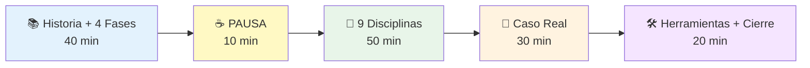

**Desglose temporal:**

- **Bloque 1 (40 min):** Historia de RUP + Las 4 Fases en detalle (Inicio, Elaboración, Construcción, Transición)
- **Pausa (10 min):** Descanso
- **Bloque 2 (50 min):** Las 9 Disciplinas y workflows + distribución de esfuerzo por fase
- **Bloque 3 (30 min):** Caso real completo: Sistema de reservas hoteleras (18 meses, 25 personas)
- **Bloque 4 (20 min):** Herramientas UML (draw.io), comparación con otras metodologías, tareas

---

### 🎓 Resultados de Aprendizaje Esperados

Al terminar esta clase, deberías poder:

- [ ] Explicar por qué RUP surge de la fusión de Objectory + Espiral + UML (1998)
- [ ] Dibujar un timeline de las 4 fases de RUP con sus hitos principales
- [ ] Describir qué pasa en cada fase (objetivos, entregables, duración típica)
- [ ] Explicar por qué Elaboración es la fase MÁS CRÍTICA (arquitectura baseline)
- [ ] Listar las 9 disciplinas de RUP y clasificarlas en Core vs Soporte
- [ ] Crear un gráfico de esfuerzo mostrando cómo cada disciplina varía por fase
- [ ] Analizar por qué el caso del hotel usó RUP exitosamente (2.5M, 18 meses, 25 personas)
- [ ] Crear un Use Case diagram básico en draw.io con 5-10 casos de uso
- [ ] Comparar RUP vs Cascada vs Espiral vs Ágil en tabla de 10 criterios
- [ ] Decidir si usarías RUP en 5 escenarios diferentes (startup, banco, gobierno, etc.)
- [ ] Explicar qué significa "Use Case Driven, Architecture-Centric, Iterative-Incremental"
- [ ] Identificar cuándo RUP es overkill (proyectos pequeños, startups, < 3 meses)

---

### 🔗 Conexión con Otras Clases

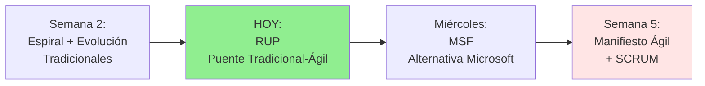

**¿Cómo se conecta esta clase?**

- **Clase anterior (Miércoles):** Vimos evolución de metodologías 1960-2000, por qué cada una surgió
- **Clase de HOY:** RUP como evolución natural de Espiral + UML (1998), última metodología tradicional "pesada"
- **Próxima clase (Miércoles):** MSF (Microsoft Solution Framework) - alternativa más ligera de Microsoft
- **Semana 5 (Lunes):** Manifiesto Ágil 2001 - la revolución que surge de las limitaciones de RUP/MSF

**Contexto cronológico metodológico:**

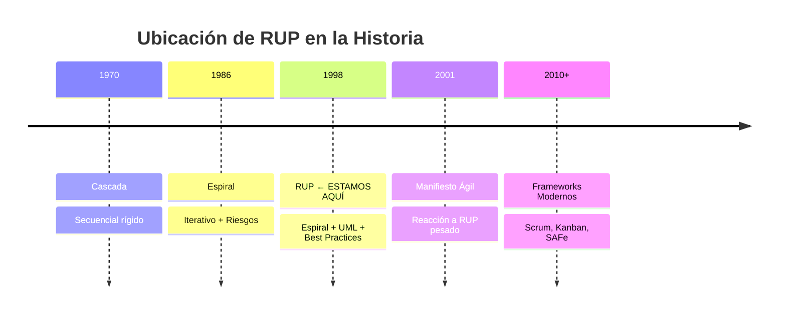

**Lo especial de RUP:**

> RUP es la **última gran metodología tradicional** antes de la revolución ágil. Es el intento más completo y sofisticado de crear un proceso formal pero flexible. Entenderlo nos ayuda a comprender POR QUÉ surgió Ágil (reacción contra su complejidad).

---

### 🧠 Mindmap: Lo que Cubriremos Hoy

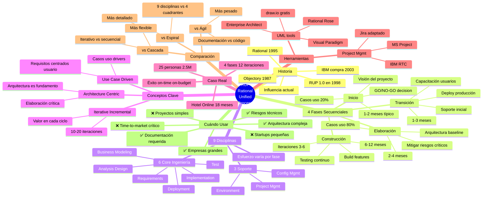

---

**Nota importante sobre esta clase:**

Esta clase condensa **3 días del cronograma oficial** en una sola sesión. El enfoque será:

- ✅ **Comprensivo pero eficiente:** Cubriremos TODO RUP pero sin perdernos en detalles menores
- ✅ **Visual y práctico:** Muchos diagramas Mermaid + caso real detallado
- ✅ **Orientado a decisión:** Énfasis en CUÁNDO usar RUP vs otras metodologías
- ✅ **Base para MSF y Ágil:** Entender RUP es clave para entender por qué surgió Ágil

**¿Listo para comenzar?** 🚀

---

## 📚 BLOQUE 1: Historia y Las 4 Fases de RUP (40 min)

**Duración:** 40 minutos  
**Modalidad:** Expositiva con análisis histórico y estructural

### Objetivo del Bloque

Comprender el origen histórico de RUP desde Objectory hasta IBM Rational, y dominar las 4 fases secuenciales (Inicio, Elaboración, Construcción, Transición) con sus objetivos, entregables, duración y criterios de éxito en cada una.

---

### 1.1 Historia y Contexto de RUP (10 min)

#### ¿De Dónde Viene RUP?

**La historia NO comienza en 1998...**

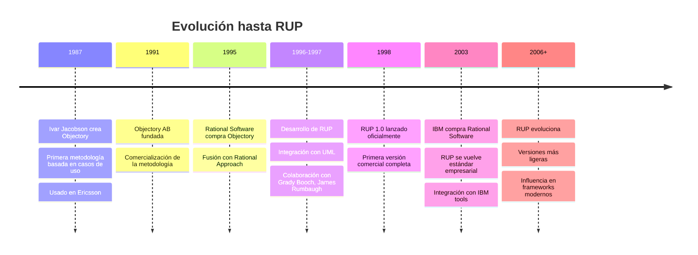

---

#### Los "Tres Amigos" de UML

**RUP no puede entenderse sin UML:**

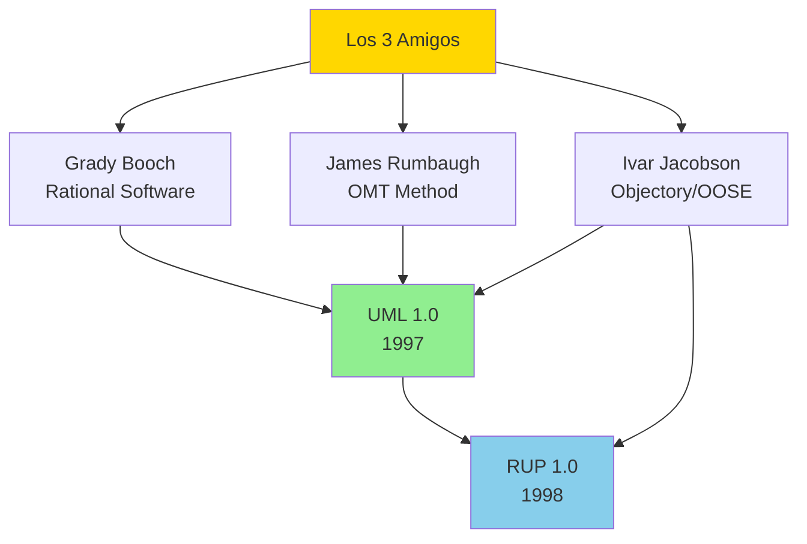

**Contribuciones clave:**

- **Grady Booch:** Object-Oriented Design (diagramas de clases, componentes)
- **James Rumbaugh:** OMT - Object Modeling Technique (análisis de objetos)
- **Ivar Jacobson:** OOSE - Object-Oriented Software Engineering (casos de uso)

**Resultado:** UML como lenguaje visual + RUP como proceso formal

---

#### RUP = Espiral + UML + Mejores Prácticas

**La fórmula de RUP:**

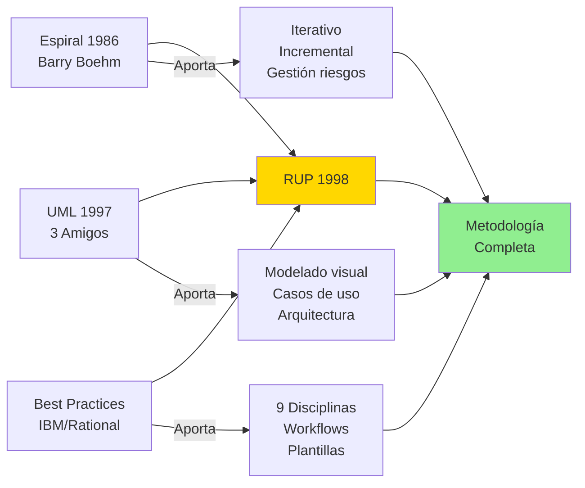

**Comparación rápida:**

| Aspecto          | Espiral                 | RUP                                  |
| ---------------- | ----------------------- | ------------------------------------ |
| **Base teórica** | 4 cuadrantes abstractos | 4 fases + 9 disciplinas concretas    |
| **Modelado**     | Opcional, sin estándar  | UML obligatorio                      |
| **Guías**        | Principios generales    | Plantillas detalladas (300+ páginas) |
| **Herramientas** | Genéricas               | IBM Rational Suite ($$$$)            |
| **Adopción**     | Proyectos críticos      | Empresas grandes / consultoras       |

---

#### ¿Por Qué Surge RUP?

**El problema que RUP resuelve:**

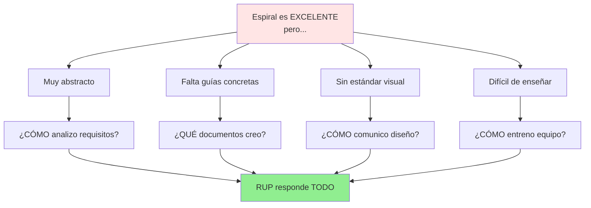

**RUP ofrece:**

1. ✅ **Proceso detallado:** No solo "haz análisis de riesgos", sino CÓMO hacerlo paso a paso
2. ✅ **Plantillas:** Más de 100 plantillas de documentos (Visión, Architecture, Test Plan, etc.)
3. ✅ **UML estándar:** Forma visual de comunicar requisitos, diseño, arquitectura
4. ✅ **Roles claros:** Arquitecto, Analista, Desarrollador, Tester, etc.
5. ✅ **Herramientas:** IBM Rational Rose, Rational ClearCase, Rational RequisitePro

---

#### Posición de RUP en el Espectro Metodológico

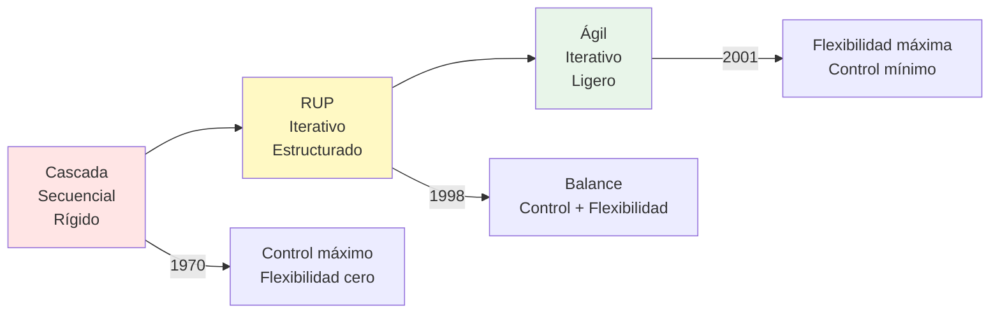

**Lo especial de RUP:**

> RUP es el **intento más sofisticado** de crear un proceso formal pero flexible. Es el puente entre el mundo tradicional pesado (Cascada, Espiral) y el mundo ágil ligero (Scrum, XP).

---

#### RUP Hoy (2025)

**¿RUP murió?**

**NO, pero...**

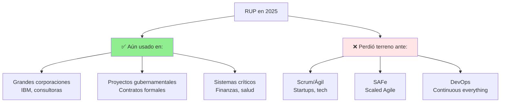

**Legado de RUP:**

- ✅ **UML sigue siendo estándar** (aunque menos usado que antes)
- ✅ **Casos de uso** siguen siendo válidos (incluso en Ágil)
- ✅ **Arquitectura primero** influyó frameworks modernos
- ✅ **Iteraciones** son fundamento de Scrum/Ágil
- ✅ **SAFe** (Scaled Agile Framework) tiene ADN de RUP

---

### 1.2 Las 4 Fases de RUP (25 min)

#### Concepto Fundamental

**RUP divide un proyecto en 4 fases SECUENCIALES:**

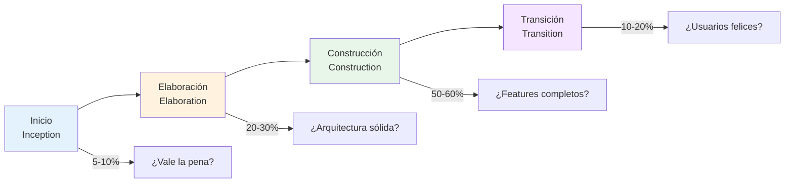

**Importante:**

- Las 4 fases son **SECUENCIALES** (no se repiten)
- Pero DENTRO de cada fase hay **ITERACIONES** (ciclos mini)
- Cada fase termina con un **HITO** (milestone) crítico

---

#### Visualización del Esfuerzo por Fase

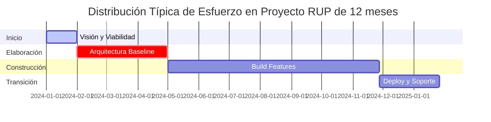

**Porcentajes típicos:**

- **Inicio:** 5-10% del tiempo total
- **Elaboración:** 20-30% del tiempo total
- **Construcción:** 50-60% del tiempo total
- **Transición:** 10-20% del tiempo total

---

#### Fase 1: Inicio (Inception) 🚀

**Duración típica:** 1-2 meses (5-10% proyecto)

**Pregunta clave:** ¿Vale la pena hacer este proyecto?

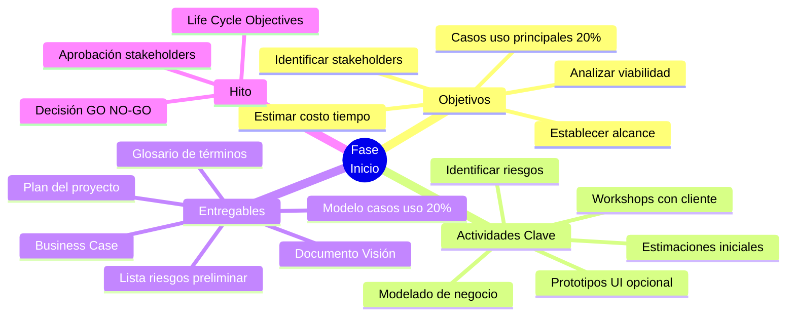

**¿Qué pasa en Inicio?**

1. **Entender el problema:**

   - ¿Qué necesita el cliente?
   - ¿Qué problemas resuelve el sistema?
   - ¿Quiénes son los usuarios?

2. **Identificar casos de uso principales:**

   - NO todos los casos de uso, solo los 20% más importantes
   - Ejemplo: En e-commerce → "Realizar compra", "Gestionar inventario"
   - Brief description, no detallados aún

3. **Evaluar viabilidad:**

   - **Técnica:** ¿Podemos construirlo?
   - **Financiera:** ¿Vale la pena económicamente?
   - **Operacional:** ¿El cliente puede usarlo?
   - **Legal:** ¿Hay restricciones regulatorias?

4. **Identificar riesgos críticos:**
   - Riesgo técnico (tecnología nueva)
   - Riesgo de negocio (mercado competitivo)
   - Riesgo de recursos (equipo disponible)

**Entregables clave:**

| Documento                | Contenido                                                 | Páginas típicas |
| ------------------------ | --------------------------------------------------------- | --------------- |
| **Visión**               | Problema, solución propuesta, características principales | 15-20           |
| **Business Case**        | Análisis costo-beneficio, ROI esperado                    | 5-10            |
| **Use Case Model (20%)** | 5-10 casos de uso principales en brief                    | 10-15           |
| **Glosario**             | Términos de negocio y técnicos                            | 3-5             |
| **Iteration Plan**       | Plan de Elaboración detallado                             | 5-8             |
| **Risk List**            | Top 10 riesgos identificados                              | 2-3             |

**Hito: Life Cycle Objectives Milestone**

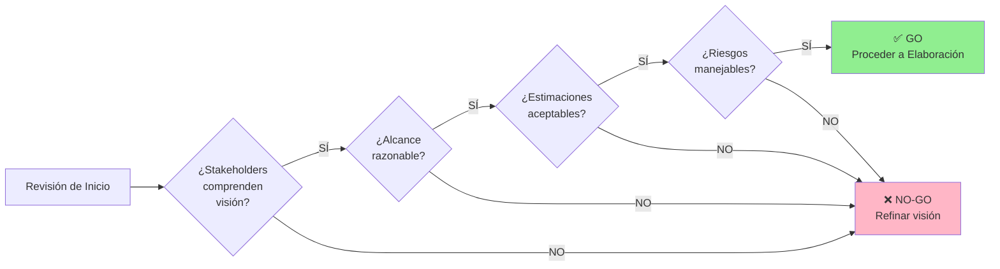

**Criterios GO/NO-GO:**

- ✅ **GO si:** Visión clara, stakeholders alineados, viabilidad demostrada, riesgos identificados
- ❌ **NO-GO si:** Visión confusa, alcance irrealista, viabilidad dudosa, riesgos inmanejables

**Ejemplo real:**

```markdown
Proyecto: Sistema CRM para inmobiliaria
Inicio: 4 semanas
Resultado:

- 8 casos de uso identificados (Registrar cliente, Publicar propiedad, etc.)
- Costo estimado: $800K
- Tiempo estimado: 14 meses
- Riesgo #1: Integración con sistema legacy
- Decisión: GO (cliente aprobó presupuesto)
```

---

#### Fase 2: Elaboración (Elaboration) 🏗️

**Duración típica:** 2-4 meses (20-30% proyecto)

**Pregunta clave:** ¿La arquitectura puede soportar el sistema?

**🔥 ESTA ES LA FASE MÁS CRÍTICA DE RUP 🔥**

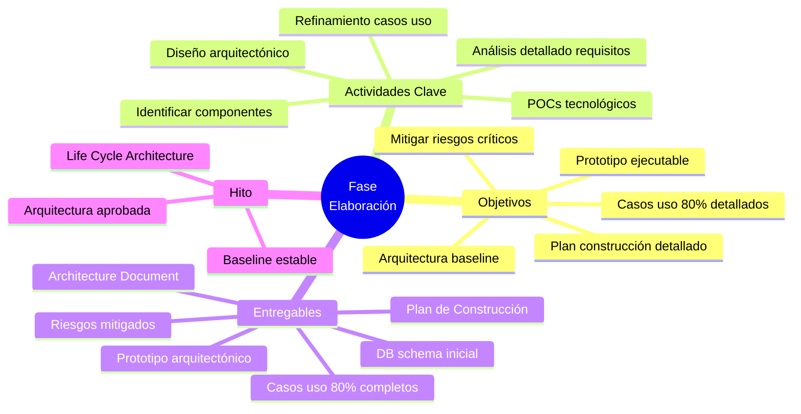

**¿Por qué Elaboración es TAN importante?**

> **"Arreglar la arquitectura DESPUÉS de Construcción cuesta 10-100 veces más"**
>
> — Principio fundamental de RUP

**Filosofía de Elaboración:**

```markdown
Mejor: 3 meses diseñando arquitectura sólida
Peor: 6 meses refactorizando arquitectura defectuosa durante Construcción
```

**¿Qué pasa en Elaboración?**

1. **Definir arquitectura baseline:**

   - Identificar capas (presentation, business, data)
   - Definir componentes principales
   - Elegir tecnologías (frameworks, bases de datos, cloud)
   - Patrones de diseño (MVC, microservices, etc.)

2. **Detallar casos de uso (80%):**

   - Expandir los 20% de Inicio a 80% completo
   - Flujos principales + alternativos + excepciones
   - Precondiciones, postcondiciones
   - Ejemplo: "Realizar compra" → 15 pasos detallados

3. **Construir prototipo arquitectónico:**

   - NO es prototipo de UI
   - Es **proof-of-concept TÉCNICO**
   - Valida que arquitectura funciona
   - Ejemplo: API REST + Database + Frontend básico conectados

4. **Mitigar riesgos críticos:**
   - Identificados en Inicio
   - POC (Proof of Concept) de tecnologías riesgosas
   - Ejemplo: Integrar con sistema legacy → hacer POC primero

**Iteraciones en Elaboración:**

Típicamente 2-3 iteraciones de 4-6 semanas cada una:

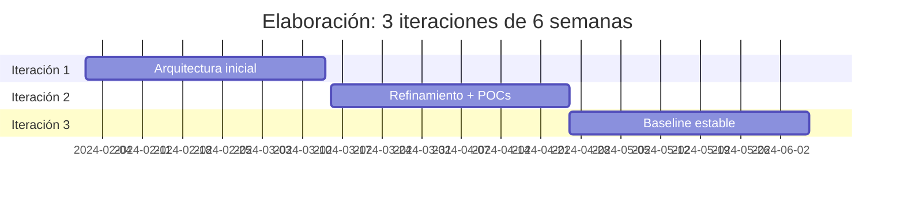

**Entregables clave:**

| Documento                             | Contenido                                                   | Páginas típicas |
| ------------------------------------- | ----------------------------------------------------------- | --------------- |
| **Software Architecture Document**    | Vistas 4+1 (lógica, proceso, física, desarrollo, casos uso) | 40-60           |
| **Use Case Specifications (80%)**     | Casos uso detallados con flujos completos                   | 50-100          |
| **Executable Architecture Prototype** | Código funcionando que demuestra viabilidad técnica         | N/A (código)    |
| **Design Model**                      | Diagramas UML (clases, secuencia, componentes)              | 20-30           |
| **Data Model**                        | Schema de base de datos, ER diagrams                        | 10-15           |
| **Iteration Plan (Construction)**     | Plan detallado de las 4-6 iteraciones de Construcción       | 10-15           |
| **Updated Risk List**                 | Riesgos mitigados + nuevos identificados                    | 3-5             |

**Diagrama de arquitectura típico (ejemplo e-commerce):**

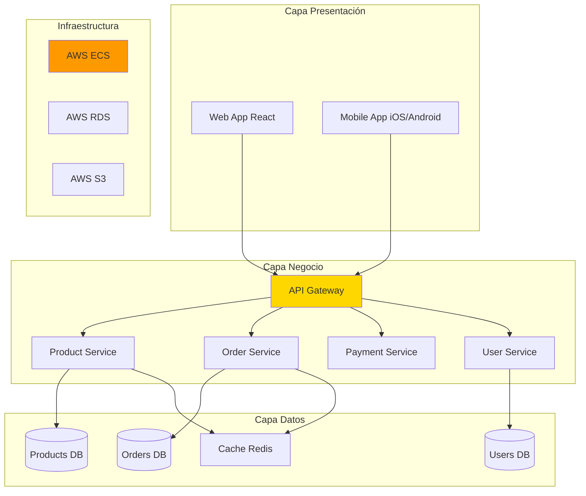

**Hito: Life Cycle Architecture Milestone**

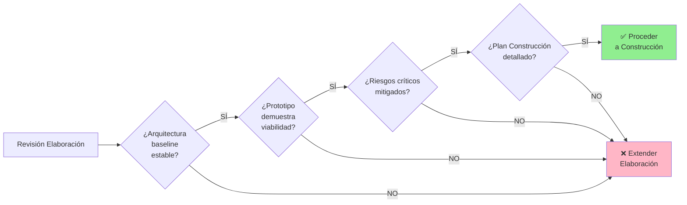

**Criterios de éxito:**

- ✅ Arquitectura documentada y validada con prototipo
- ✅ 80% casos de uso detallados y aprobados
- ✅ Riesgos técnicos críticos resueltos
- ✅ Equipo confía en que puede construir el sistema
- ✅ Estimaciones de Construcción tienen ±20% precisión

**Ejemplo real:**

```markdown
Proyecto: Plataforma e-learning
Elaboración: 12 semanas (3 iteraciones de 4 semanas)

Iteración 1:

- Arquitectura: Microservices + React + Node.js + MongoDB
- POC: Video streaming con AWS S3/CloudFront

Iteración 2:

- Detalle de 20 casos de uso
- Prototipo: Login + Dashboard + 1 curso funcionando
- Mitigado riesgo: Integración con Zoom API

Iteración 3:

- Refinamiento arquitectura
- DB schema completo
- Plan construcción: 5 iteraciones de 3 semanas

Resultado: Arquitectura aprobada, GO a Construcción
```

---

#### Fase 3: Construcción (Construction) 🔨

**Duración típica:** 6-12 meses (50-60% proyecto)

**Pregunta clave:** ¿Está listo para producción?

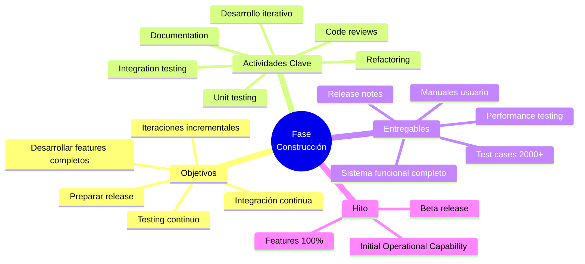

**¿Qué pasa en Construcción?**

1. **Desarrollo iterativo incremental:**

   - 4-6 iteraciones típicas
   - Cada iteración: 3-6 semanas
   - Cada iteración entrega features COMPLETOS y funcionales
   - NO "75% de todos los features", sino "100% de X features"

2. **Testing continuo:**

   - Unit tests (desarrolladores)
   - Integration tests (cada integración)
   - System tests (cada iteración)
   - Performance tests (final)

3. **Integración continua:**
   - Build diario (mínimo)
   - Tests automatizados
   - Deployment a ambiente QA

**Estructura de iteraciones:**

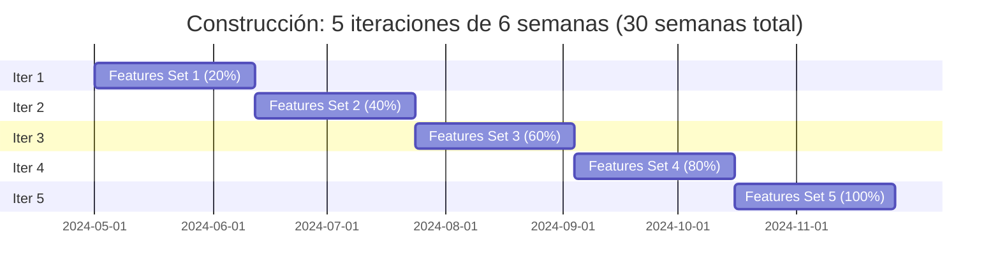

**Ejemplo de plan de iteraciones:**

| Iteración | Duración | Features                                        | % Completo | Testing               |
| --------- | -------- | ----------------------------------------------- | ---------- | --------------------- |
| **C1**    | 6 sem    | Autenticación, Perfil usuario, Dashboard básico | 20%        | Unit + Integration    |
| **C2**    | 6 sem    | Módulo productos, Búsqueda, Carrito compras     | 40%        | + System testing      |
| **C3**    | 6 sem    | Checkout, Pagos, Gestión pedidos                | 60%        | + Performance inicial |
| **C4**    | 6 sem    | Admin panel, Reportes, Notificaciones           | 80%        | + Load testing        |
| **C5**    | 6 sem    | Features finales, Bug fixes, Polish             | 100%       | + UAT (beta users)    |

**Priorización de features:**

```mermaid
graph LR
    A[MoSCoW Prioritization] --> B[Must Have]
    A --> C[Should Have]
    A --> D[Could Have]
    A --> E[Won't Have]

    B --> F[Iteración 1-2]
    C --> G[Iteración 3-4]
    D --> H[Iteración 5]
    E --> I[Próxima versión]

    style B fill:#FF6B6B
    style C fill:#FFA500
    style D fill:#90EE90
    style E fill:#CCCCCC
```

**Testing en Construcción:**

```mermaid
graph TB
    A[Testing Continuo] --> B[Unit Tests]
    A --> C[Integration Tests]
    A --> D[System Tests]
    A --> E[Performance Tests]
    A --> F[UAT Beta Testing]

    B --> G[Cada función<br/>Desarrolladores<br/>JUnit, PyTest]
    C --> H[Cada integración<br/>Daily builds<br/>Selenium, Postman]
    D --> I[Cada iteración<br/>QA team<br/>Test cases manuales]
    E --> J[Iteración final<br/>Load testing<br/>JMeter, LoadRunner]
    F --> K[Beta users<br/>Feedback real<br/>Bug reports]

    style A fill:#FFD700
```

**Métricas típicas de Construcción:**

| Métrica                | Objetivo     | Ejemplo                   |
| ---------------------- | ------------ | ------------------------- |
| **Code coverage**      | > 80%        | 85% de líneas con tests   |
| **Defect density**     | < 1 bug/KLOC | 0.8 bugs por 1000 líneas  |
| **Build success rate** | > 95%        | 97% builds exitosos       |
| **Test pass rate**     | > 90%        | 2100/2300 tests pasan     |
| **Velocity**           | Estable      | 40 story points/iteración |

**Hito: Initial Operational Capability**

```mermaid
graph LR
    A[Revisión Construcción] --> B{¿Features 100%<br/>completos?}
    B -->|SÍ| C{¿Testing<br/>comprehensive?}
    B -->|NO| Z[❌ Extender<br/>Construcción]

    C -->|SÍ| D{¿Performance<br/>acceptable?}
    C -->|NO| Z

    D -->|SÍ| E{¿Documentación<br/>completa?}
    D -->|NO| Z

    E -->|SÍ| F[✅ Proceder<br/>a Transición]
    E -->|NO| Z

    style F fill:#90EE90
    style Z fill:#FFB6C6
```

**Criterios de éxito:**

- ✅ Todas las funcionalidades "Must Have" y "Should Have" completas
- ✅ Testing comprehensivo (unit, integration, system)
- ✅ Performance aceptable (< 2 seg response time)
- ✅ Bugs críticos y altos resueltos (solo P3/P4 quedan)
- ✅ Manuales de usuario escritos
- ✅ Release candidate listo

---

#### Fase 4: Transición (Transition) 🚀

**Duración típica:** 1-3 meses (10-20% proyecto)

**Pregunta clave:** ¿Usuarios están satisfechos en producción?

```mermaid
mindmap
  root((Fase<br/>Transición))
    Objetivos
      Deployment producción
      Capacitación usuarios
      Beta testing real
      Corrección bugs menores
      Soporte post-launch
    Actividades Clave
      Rollout gradual
      Training sessions
      User acceptance
      Monitoring 24/7
      Bug fixes
      Performance tuning
    Entregables
      Sistema en producción
      Usuarios capacitados
      Documentación final
      Soporte establecido
      Lecciones aprendidas
    Hito
      Product Release
      Sign-off cliente
      Sistema operacional
```

**¿Qué pasa en Transición?**

1. **Beta testing con usuarios reales:**

   - Grupo piloto de usuarios
   - Ambiente de producción (o staging similar)
   - Feedback real sobre usabilidad
   - Identificar bugs de uso real

2. **Deployment gradual:**

   - NO big bang
   - Rollout por fases: 10% → 25% → 50% → 100%
   - Monitoreo continuo
   - Rollback plan listo

3. **Capacitación:**

   - Sesiones de training para usuarios finales
   - Documentación: Manuales, FAQs, Videos
   - Soporte disponible (help desk)

4. **Ajustes finales:**
   - Corrección de bugs menores (P3/P4)
   - Performance tuning según carga real
   - Ajustes de configuración

**Ejemplo de rollout gradual:**

```mermaid
gantt
    title Transición: Rollout gradual en 8 semanas
    dateFormat YYYY-MM-DD
    section Semana 1-2
    Beta 10 usuarios internos  :2024-11-01, 14d
    section Semana 3-4
    Piloto 100 usuarios select :2024-11-15, 14d
    section Semana 5-6
    50% usuarios totales       :2024-11-29, 14d
    section Semana 7-8
    100% rollout + soporte     :2024-12-13, 14d
```

**Actividades de Transición:**

| Semana  | Actividad                               | Responsable   |
| ------- | --------------------------------------- | ------------- |
| **1-2** | Beta testing interno (10 usuarios)      | QA Team       |
| **2**   | Capacitación administradores            | Training Team |
| **3-4** | Piloto con 100 usuarios seleccionados   | Product Owner |
| **4**   | Capacitación usuarios finales (grupo 1) | Training Team |
| **5**   | Rollout 50% usuarios                    | DevOps Team   |
| **5**   | Capacitación usuarios finales (grupo 2) | Training Team |
| **6**   | Monitoreo intensivo, corrección bugs    | Support Team  |
| **7**   | Rollout 100% usuarios                   | DevOps Team   |
| **8**   | Soporte post-launch, optimización       | Support Team  |

**Criterios de aceptación:**

```mermaid
graph TB
    A[UAT Acceptance] --> B[Funcionalidad]
    A --> C[Performance]
    A --> D[Usabilidad]
    A --> E[Documentación]

    B --> F[✅ 100% features<br/>funcionando]
    C --> G[✅ Response < 2 seg<br/>99% del tiempo]
    D --> H[✅ Satisfacción > 80%<br/>Usuarios felices]
    E --> I[✅ Manuales completos<br/>FAQs disponibles]

    F --> J[Sign-Off Cliente]
    G --> J
    H --> J
    I --> J

    style J fill:#90EE90
```

**Hito: Product Release**

```mermaid
graph LR
    A[Revisión Transición] --> B{¿Sistema estable<br/>en producción?}
    B -->|SÍ| C{¿Usuarios<br/>capacitados?}
    B -->|NO| Z[❌ Continuar<br/>Transición]

    C -->|SÍ| D{¿Satisfacción<br/>≥ 80%?}
    C -->|NO| Z

    D -->|SÍ| E{¿Soporte<br/>establecido?}
    D -->|NO| Z

    E -->|SÍ| F[✅ PROYECTO<br/>COMPLETADO]
    E -->|NO| Z

    style F fill:#FFD700
    style Z fill:#FFB6C6
```

**Entregables finales:**

| Documento              | Contenido                                            | Responsable      |
| ---------------------- | ---------------------------------------------------- | ---------------- |
| **Release Notes**      | Features incluidos, bugs conocidos, breaking changes | Product Owner    |
| **User Manual**        | Guía completa de usuario con screenshots             | Technical Writer |
| **Admin Guide**        | Configuración, mantenimiento, troubleshooting        | DevOps Team      |
| **Training Materials** | Presentaciones, videos, ejercicios                   | Training Team    |
| **Support Plan**       | SLAs, contactos, escalation procedures               | Support Manager  |
| **Retrospective**      | Lecciones aprendidas, mejoras para próximo proyecto  | Project Manager  |

---

### 1.3 Resumen: Las 4 Fases en una Tabla (5 min)

#### Comparación Completa

| Aspecto                 | Inicio                 | Elaboración             | Construcción                | Transición            |
| ----------------------- | ---------------------- | ----------------------- | --------------------------- | --------------------- |
| **Duración**            | 5-10%                  | 20-30%                  | 50-60%                      | 10-20%                |
| **Ejemplo 12 meses**    | 1 mes                  | 3 meses                 | 6 meses                     | 2 meses               |
| **Pregunta clave**      | ¿Vale la pena?         | ¿Arquitectura sólida?   | ¿Features completos?        | ¿Usuarios felices?    |
| **Foco principal**      | Viabilidad             | Arquitectura            | Desarrollo                  | Deployment            |
| **Riesgo principal**    | Alcance poco claro     | Arquitectura débil      | Calidad/Tiempo              | Adopción usuario      |
| **Casos de uso**        | 20% identificados      | 80% detallados          | 100% implementados          | 100% validados        |
| **Código**              | 0%                     | 10-15% (prototipo)      | 100%                        | 100%                  |
| **Testing**             | N/A                    | POCs técnicos           | Unit + Integration + System | UAT + Beta            |
| **Entregable clave**    | Visión + Business Case | Architecture Document   | Sistema funcional           | Sistema en producción |
| **Hito**                | Life Cycle Objectives  | Life Cycle Architecture | Initial Operational         | Product Release       |
| **Decisión crítica**    | GO/NO-GO               | Arquitectura aprobada   | Ready for release           | Customer sign-off     |
| **Típicas iteraciones** | 1                      | 2-3                     | 4-6                         | 1-2                   |

---

#### Visualización del Flujo Completo

```mermaid
graph LR
    A[INICIO] --> B{Viabilidad<br/>OK?}
    B -->|NO| Z[❌ Cancelar<br/>proyecto]
    B -->|SÍ| C[ELABORACIÓN]

    C --> D{Arquitectura<br/>sólida?}
    D -->|NO| E[Refinar<br/>arquitectura]
    E --> D
    D -->|SÍ| F[CONSTRUCCIÓN]

    F --> G{Iteración N<br/>completa?}
    G -->|NO| H[Continuar<br/>desarrollo]
    H --> G
    G -->|SÍ| I{Todas<br/>iteraciones?}
    I -->|NO| G
    I -->|SÍ| J[TRANSICIÓN]

    J --> K{Usuarios<br/>satisfechos?}
    K -->|NO| L[Ajustar<br/>y mejorar]
    L --> K
    K -->|SÍ| M[✅ PROYECTO<br/>EXITOSO]

    style A fill:#E3F2FD
    style C fill:#FFF3E0
    style F fill:#E8F5E9
    style J fill:#F5E5FF
    style M fill:#FFD700
    style Z fill:#FFB6C6
```

---

#### Concepto Clave: Iteraciones DENTRO de Fases

**Importante entender:**

```mermaid
graph TB
    A[Proyecto RUP] --> B[4 FASES<br/>Secuenciales]
    B --> C[Inicio]
    B --> D[Elaboración]
    B --> E[Construcción]
    B --> F[Transición]

    C --> G[1 iteración típica]
    D --> H[2-3 iteraciones]
    E --> I[4-6 iteraciones]
    F --> J[1-2 iteraciones]

    H --> K[Cada iteración:<br/>mini-ciclo completo<br/>Plan→Análisis→Diseño<br/>→Code→Test]

    style A fill:#FFD700
    style K fill:#90EE90
```

**Ejemplo concreto proyecto 18 meses:**

- **Inicio:** 1 iteración de 2 meses
- **Elaboración:** 3 iteraciones de 2 meses = 6 meses
- **Construcción:** 5 iteraciones de 1.5 meses = 7.5 meses
- **Transición:** 2 iteraciones de 1.5 meses = 3 meses
- **Total:** 12 iteraciones, 18 meses

---

### 📊 Resumen del Bloque 1

```mermaid
mindmap
  root((Bloque 1:<br/>RUP<br/>Historia y Fases))
    Historia
      Objectory 1987 Jacobson
      Rational 1995
      UML 1997 3 Amigos
      RUP 1.0 en 1998
      IBM 2003
      Espiral + UML + Best Practices
    Inicio 5-10%
      Visión y viabilidad
      Casos uso 20%
      GO NO-GO
      1-2 meses
    Elaboración 20-30%
      FASE CRÍTICA
      Arquitectura baseline
      Casos uso 80%
      Prototipo técnico
      2-4 meses
    Construcción 50-60%
      Build features
      Iteraciones 4-6
      Testing continuo
      6-12 meses
    Transición 10-20%
      Deploy producción
      Training usuarios
      Beta testing
      1-3 meses
    Conceptos Clave
      4 fases secuenciales
      Iteraciones dentro fases
      Hitos críticos
      Use Case Driven
      Architecture Centric
```

**Lecciones clave:**

1. ✅ RUP = Espiral + UML + Guías detalladas
2. ✅ 4 fases secuenciales, cada una con hito crítico
3. ✅ Elaboración es la fase MÁS IMPORTANTE (arquitectura)
4. ✅ Construcción tiene la mayor parte del desarrollo
5. ✅ Cada fase tiene múltiples iteraciones internas
6. ✅ RUP es el puente entre Tradicional y Ágil

**Próximo paso:**

Después de la pausa veremos las **9 disciplinas** que cruzan todas las fases y cómo varían en intensidad.

---

## ☕ PAUSA

**Duración:** 10 minutos  
**Instrucciones:** Estirar, ir al baño, tomar agua, revisar apuntes.

---

## 🎯 BLOQUE 2: Las 9 Disciplinas y Workflows (50 min)

**Duración:** 50 minutos  
**Modalidad:** Expositiva con análisis de workflows y distribución de esfuerzo

### Objetivo del Bloque

Comprender las 9 disciplinas de RUP (6 core de ingeniería + 3 de soporte) y cómo cada una varía en intensidad a lo largo de las 4 fases, entendiendo el concepto de workflows y la distribución de esfuerzo por fase y disciplina.

---

### 2.1 Concepto de Disciplinas en RUP (5 min)

#### ¿Qué es una Disciplina?

**Definición:**

> Una **disciplina** es un conjunto de actividades relacionadas que se ejecutan a lo largo de TODO el proyecto, pero con diferente intensidad según la fase.

**Diferencia clave con Cascada:**

```mermaid
graph TB
    subgraph "Cascada (Secuencial)"
        A1[Requisitos] --> A2[Diseño] --> A3[Implementación] --> A4[Testing]
    end

    subgraph "RUP (Paralelo con intensidad variable)"
        B1[Requisitos<br/>🔴🔴🔴⚪⚪]
        B2[Diseño<br/>⚪🔴🔴🔴⚪]
        B3[Implementación<br/>⚪⚪🔴🔴⚪]
        B4[Testing<br/>⚪⚪🔴🔴🔴]
        B5[Deployment<br/>⚪⚪⚪⚪🔴]
    end

    style A1 fill:#FFE5E5
    style B1 fill:#E8F5E9
```

**Concepto clave:**

- En **Cascada:** Requisitos → TERMINA → Diseño comienza
- En **RUP:** Requisitos continúa en TODAS las fases, pero con menor intensidad después de Elaboración

---

#### Las 9 Disciplinas de RUP

```mermaid
graph TB
    A[9 Disciplinas<br/>de RUP] --> B[6 Disciplinas Core<br/>Ingeniería]
    A --> C[3 Disciplinas Soporte<br/>Gestión]

    B --> D[1. Business Modeling]
    B --> E[2. Requirements]
    B --> F[3. Analysis & Design]
    B --> G[4. Implementation]
    B --> H[5. Test]
    B --> I[6. Deployment]

    C --> J[7. Config & Change Mgmt]
    C --> K[8. Project Management]
    C --> L[9. Environment]

    style A fill:#FFD700
    style B fill:#E3F2FD
    style C fill:#FFF3E0
```

**Estructura:**

- **6 Core (Ingeniería):** El trabajo técnico de construcción del sistema
- **3 Soporte (Gestión):** Actividades que soportan el trabajo técnico

---

### 2.2 Las 6 Disciplinas Core de Ingeniería (30 min)

#### Disciplina 1: Business Modeling (Modelado de Negocio)

**¿Qué es?**

Entender el negocio del cliente y el contexto organizacional donde operará el sistema.

**Intensidad por fase:**

```mermaid
graph LR
    A[Inicio] -->|🔴🔴🔴🔴| B[Alta]
    C[Elaboración] -->|🔴🔴🔴⚪| D[Media-Alta]
    E[Construcción] -->|🔴⚪⚪⚪| F[Baja]
    G[Transición] -->|⚪⚪⚪⚪| H[Muy Baja]

    style B fill:#FF6B6B
    style D fill:#FFA500
    style F fill:#90EE90
    style H fill:#CCCCCC
```

**Actividades principales:**

- Modelar procesos de negocio (AS-IS vs TO-BE)
- Identificar reglas de negocio
- Crear Business Use Cases
- Entender stakeholders y su rol
- Domain modeling (conceptos del negocio)

**Artefactos clave:**

| Artefacto                   | Descripción                               | Ejemplo                           |
| --------------------------- | ----------------------------------------- | --------------------------------- |
| **Business Use Case Model** | Casos de uso del negocio (no del sistema) | "Procesar orden de compra"        |
| **Business Object Model**   | Entidades del negocio y relaciones        | Cliente, Producto, Orden          |
| **Business Rules**          | Reglas que el sistema debe respetar       | "Descuento 10% si compra > $1000" |
| **Domain Model**            | Conceptos clave del dominio               | Diagrama de clases conceptual     |

**Ejemplo visual - E-commerce:**

```mermaid
graph TB
    subgraph "Business Use Cases"
        A[Vender Producto]
        B[Gestionar Inventario]
        C[Procesar Devolución]
    end

    subgraph "Business Objects"
        D[Cliente]
        E[Producto]
        F[Orden]
        G[Pago]
    end

    A --> D
    A --> E
    A --> F
    B --> E
    C --> F

    style A fill:#E3F2FD
    style B fill:#E3F2FD
    style C fill:#E3F2FD
```

**¿Cuándo es crítica?**

✅ Proyectos donde el negocio es complejo (finanzas, seguros, logística)  
✅ Cuando necesitas entender workflows existentes  
⚠️ Menos crítica en proyectos técnicos puros (herramientas dev)

---

#### Disciplina 2: Requirements (Requisitos)

**¿Qué es?**

Capturar QUÉ debe hacer el sistema (no CÓMO). Casos de uso son el corazón.

**Intensidad por fase:**

```mermaid
graph LR
    A[Inicio] -->|🔴🔴🔴🔴| B[Muy Alta]
    C[Elaboración] -->|🔴🔴🔴🔴| D[Muy Alta]
    E[Construcción] -->|🔴🔴⚪⚪| F[Media]
    G[Transición] -->|🔴⚪⚪⚪| H[Baja]

    style B fill:#FF6B6B
    style D fill:#FF6B6B
    style F fill:#FFA500
    style H fill:#90EE90
```

**Por qué alta en Inicio y Elaboración:**

- **Inicio:** Identificar 20% casos de uso principales
- **Elaboración:** Detallar 80% casos de uso completos
- **Construcción:** Refinar casos de uso, agregar detalles
- **Transición:** Solo ajustes menores

**Técnica central: Use Case Driven**

```mermaid
graph TB
    A[Actor] -->|Inicia| B[Use Case]
    B -->|Interactúa| C[Sistema]
    C -->|Responde| D[Resultado]

    E[Caso de Uso<br/>Detallado] --> F[Flujo Principal]
    E --> G[Flujos Alternativos]
    E --> H[Flujos Excepción]
    E --> I[Precondiciones]
    E --> J[Postcondiciones]

    style B fill:#FFD700
    style E fill:#90EE90
```

**Artefactos clave:**

| Artefacto                   | Descripción                        | Ejemplo                          |
| --------------------------- | ---------------------------------- | -------------------------------- |
| **Use Case Model**          | Diagrama de todos los casos de uso | Diagrama UML con actores y casos |
| **Use Case Specifications** | Descripción detallada de cada caso | "Realizar Compra" con 15 pasos   |
| **Supplementary Specs**     | Requisitos no funcionales          | Performance: < 2 seg response    |
| **Glossary**                | Términos del dominio               | Definición de "SKU", "Checkout"  |
| **Vision Document**         | Visión general del producto        | Problema, solución, features     |

**Ejemplo: Use Case "Realizar Compra Online"**

```markdown
**UC-001: Realizar Compra Online**

**Actores:** Cliente registrado

**Precondiciones:**

- Cliente debe estar autenticado
- Carrito debe tener al menos 1 producto

**Flujo Principal:**

1. Sistema muestra resumen del carrito
2. Cliente selecciona dirección de envío
3. Cliente selecciona método de envío (estándar/express)
4. Sistema calcula costo de envío
5. Cliente selecciona método de pago
6. Sistema valida método de pago
7. Cliente confirma orden
8. Sistema procesa pago
9. Sistema crea orden
10. Sistema envía email de confirmación
11. Sistema muestra página de confirmación

**Flujos Alternativos:**

- 4a. Si dirección fuera de cobertura → mensaje error
- 8a. Si pago rechazado → opción de reintentar

**Flujos de Excepción:**

- 8b. Si error de red → guardar carrito, permitir reintentar

**Postcondiciones:**

- Orden creada en sistema
- Inventario actualizado
- Email enviado a cliente
```

**Use Case Diagram ejemplo:**

```mermaid
graph TB
    A((Cliente))
    B((Admin))

    A --> C[Realizar Compra]
    A --> D[Ver Historial]
    A --> E[Cancelar Orden]

    B --> F[Gestionar Productos]
    B --> G[Ver Reportes]
    B --> H[Gestionar Usuarios]

    C -.include.-> I[Procesar Pago]
    C -.include.-> J[Actualizar Inventario]
    E -.extend.-> K[Procesar Reembolso]

    style A fill:#E3F2FD
    style B fill:#FFF3E0
    style C fill:#90EE90
```

---

#### Disciplina 3: Analysis & Design (Análisis y Diseño)

**¿Qué es?**

Definir CÓMO construir el sistema. Arquitectura, clases, componentes, patrones.

**Intensidad por fase:**

```mermaid
graph LR
    A[Inicio] -->|⚪⚪⚪⚪| B[Muy Baja]
    C[Elaboración] -->|🔴🔴🔴🔴| D[MUY ALTA]
    E[Construcción] -->|🔴🔴🔴⚪| F[Alta]
    G[Transición] -->|🔴⚪⚪⚪| H[Baja]

    style B fill:#CCCCCC
    style D fill:#FF6B6B
    style F fill:#FFA500
    style H fill:#90EE90
```

**Por qué MUY ALTA en Elaboración:**

> **Elaboración = Architecture Phase**

La arquitectura se define aquí y es el fundamento de todo.

**Concepto: Architecture-Centric**

```mermaid
graph TB
    A[Arquitectura<br/>es el<br/>FUNDAMENTO] --> B[Vista Lógica<br/>Clases y paquetes]
    A --> C[Vista de Proceso<br/>Threads, concurrencia]
    A --> D[Vista Física<br/>Deployment, nodos]
    A --> E[Vista de Desarrollo<br/>Organización código]
    A --> F[Casos de Uso<br/>Validan arquitectura]

    style A fill:#FFD700
```

**Modelo 4+1 de Kruchten (estándar RUP):**

| Vista            | Qué Muestra                             | Diagrama UML Típico                |
| ---------------- | --------------------------------------- | ---------------------------------- |
| **Lógica**       | Clases, objetos, relaciones             | Class Diagram, Object Diagram      |
| **Proceso**      | Threads, procesos, comunicación         | Activity Diagram, Sequence Diagram |
| **Física**       | Hardware, servidores, deployment        | Deployment Diagram                 |
| **Desarrollo**   | Organización de código, librerías       | Component Diagram, Package Diagram |
| **Casos de Uso** | Funcionalidad desde perspectiva usuario | Use Case Diagram                   |

**Actividades principales:**

1. **Definir arquitectura:**
   - Capas (presentation, business, data)
   - Frameworks y tecnologías
   - Patrones de diseño (MVC, Repository, Factory, etc.)
2. **Diseño de clases:**

   - Class diagrams con relaciones
   - Responsabilidades de cada clase
   - Interfaces y abstracciones

3. **Diseño de interacciones:**

   - Sequence diagrams (cómo interactúan objetos)
   - Collaboration diagrams
   - State diagrams (para objetos con estados complejos)

4. **Diseño de base de datos:**
   - Entity-Relationship diagrams
   - Database schema
   - Normalización

**Artefactos clave:**

| Artefacto                          | Descripción                            | Páginas típicas |
| ---------------------------------- | -------------------------------------- | --------------- |
| **Software Architecture Document** | Vistas 4+1, decisiones arquitectónicas | 40-60           |
| **Design Model**                   | Class diagrams, sequence diagrams      | 20-40           |
| **Data Model**                     | ER diagrams, DB schema                 | 10-20           |
| **Interface Specifications**       | APIs, contratos entre componentes      | 15-25           |

**Ejemplo: Arquitectura en Capas (E-commerce)**

```mermaid
graph TB
    subgraph "Presentation Layer"
        A[Web UI<br/>React]
        B[Mobile App<br/>React Native]
        C[Admin Panel<br/>Vue.js]
    end

    subgraph "API Layer"
        D[API Gateway<br/>Express.js]
    end

    subgraph "Business Logic Layer"
        E[Product Service]
        F[Order Service]
        G[Payment Service]
        H[User Service]
        I[Notification Service]
    end

    subgraph "Data Layer"
        J[(Products DB<br/>PostgreSQL)]
        K[(Orders DB<br/>MongoDB)]
        L[(Users DB<br/>PostgreSQL)]
        M[Cache<br/>Redis]
    end

    subgraph "External Services"
        N[Payment Gateway<br/>Stripe]
        O[Email Service<br/>SendGrid]
        P[Storage<br/>AWS S3]
    end

    A --> D
    B --> D
    C --> D
    D --> E
    D --> F
    D --> G
    D --> H
    D --> I
    E --> J
    F --> K
    H --> L
    E --> M
    G --> N
    I --> O
    E --> P

    style D fill:#FFD700
```

**Ejemplo: Class Diagram (simplificado)**

```mermaid
classDiagram
    class User {
        +int id
        +string email
        +string password
        +string name
        +login()
        +register()
        +updateProfile()
    }

    class Product {
        +int id
        +string name
        +decimal price
        +int stock
        +string description
        +updateStock()
        +calculateDiscount()
    }

    class Order {
        +int id
        +datetime createdAt
        +string status
        +decimal total
        +addItem()
        +removeItem()
        +checkout()
        +cancel()
    }

    class OrderItem {
        +int quantity
        +decimal price
        +decimal subtotal
        +calculateSubtotal()
    }

    class Payment {
        +int id
        +string method
        +string status
        +decimal amount
        +process()
        +refund()
    }

    User "1" --> "*" Order
    Order "1" --> "*" OrderItem
    Product "1" --> "*" OrderItem
    Order "1" --> "1" Payment
```

---

#### Disciplina 4: Implementation (Implementación)

**¿Qué es?**

Escribir el código fuente del sistema.

**Intensidad por fase:**

```mermaid
graph LR
    A[Inicio] -->|⚪⚪⚪⚪| B[Ninguna]
    C[Elaboración] -->|🔴🔴⚪⚪| D[Media]
    E[Construcción] -->|🔴🔴🔴🔴| F[MUY ALTA]
    G[Transición] -->|🔴⚪⚪⚪| H[Baja]

    style B fill:#CCCCCC
    style D fill:#FFA500
    style F fill:#FF6B6B
    style H fill:#90EE90
```

**Por qué empieza en Elaboración:**

- En Elaboración se crea **prototipo arquitectónico** (código real)
- NO es todo el sistema, solo proof-of-concept
- Valida que arquitectura funciona

**Actividades principales:**

1. **Codificación:**

   - Implementar clases diseñadas
   - Seguir estándares de código
   - Comentarios y documentación inline

2. **Unit Testing:**

   - Tests unitarios para cada función/método
   - TDD (Test-Driven Development) opcional
   - Coverage > 80%

3. **Integración:**

   - Integrar componentes
   - Resolver conflictos
   - Build diario

4. **Refactoring:**
   - Mejorar código sin cambiar funcionalidad
   - Eliminar code smells
   - Optimización

**Prácticas clave:**

| Práctica                   | Descripción                      | Herramienta Ejemplo     |
| -------------------------- | -------------------------------- | ----------------------- |
| **Coding Standards**       | Guías de estilo consistente      | ESLint, Prettier, Black |
| **Code Reviews**           | Revisión por pares               | GitHub PR, GitLab MR    |
| **Continuous Integration** | Build y tests automáticos        | Jenkins, GitHub Actions |
| **Version Control**        | Control de versiones             | Git, SVN                |
| **Pair Programming**       | 2 devs, 1 computadora (opcional) | N/A                     |

**Artefactos clave:**

| Artefacto         | Descripción                       |
| ----------------- | --------------------------------- |
| **Source Code**   | Código fuente en repositorio      |
| **Unit Tests**    | Tests automatizados               |
| **Build Scripts** | Scripts de compilación/deployment |
| **Executables**   | Binarios, packages, containers    |

**Ejemplo de organización de código:**

```
e-commerce-app/
├── src/
│   ├── controllers/
│   │   ├── productController.js
│   │   ├── orderController.js
│   │   └── userController.js
│   ├── models/
│   │   ├── Product.js
│   │   ├── Order.js
│   │   └── User.js
│   ├── services/
│   │   ├── paymentService.js
│   │   ├── emailService.js
│   │   └── inventoryService.js
│   ├── routes/
│   │   └── api.js
│   └── utils/
│       └── validation.js
├── tests/
│   ├── unit/
│   ├── integration/
│   └── e2e/
├── config/
├── docs/
└── package.json
```

---

#### Disciplina 5: Test (Pruebas)

**¿Qué es?**

Verificar que el sistema funciona correctamente en todos los niveles.

**Intensidad por fase:**

```mermaid
graph LR
    A[Inicio] -->|⚪⚪⚪⚪| B[Ninguna]
    C[Elaboración] -->|🔴🔴⚪⚪| D[Media]
    E[Construcción] -->|🔴🔴🔴🔴| F[MUY ALTA]
    G[Transición] -->|🔴🔴🔴⚪| H[Alta]

    style B fill:#CCCCCC
    style D fill:#FFA500
    style F fill:#FF6B6B
    style H fill:#FFA500
```

**Pirámide de Testing:**

```mermaid
graph TB
    A[Pirámide de Testing] --> B[E2E Tests<br/>UI Tests<br/>10%]
    A --> C[Integration Tests<br/>API Tests<br/>30%]
    A --> D[Unit Tests<br/>Funciones/Métodos<br/>60%]

    style D fill:#90EE90
    style C fill:#FFA500
    style B fill:#FF6B6B
```

**Tipos de testing en RUP:**

| Tipo                      | Qué Prueba                        | Cuándo                | Herramientas         |
| ------------------------- | --------------------------------- | --------------------- | -------------------- |
| **Unit Testing**          | Funciones individuales            | Construcción continua | JUnit, Jest, PyTest  |
| **Integration Testing**   | Componentes juntos                | Cada integración      | Postman, RestAssured |
| **System Testing**        | Sistema completo                  | Cada iteración        | Selenium, Cypress    |
| **Performance Testing**   | Velocidad, carga                  | Final Construcción    | JMeter, LoadRunner   |
| **UAT (User Acceptance)** | Validación con usuarios           | Transición            | Manual, Beta testing |
| **Regression Testing**    | No romper funcionalidad existente | Continuo              | Automated suites     |

**Actividades principales:**

1. **Crear plan de testing:**

   - Estrategia de testing
   - Casos de prueba por use case
   - Criterios de aceptación

2. **Escribir test cases:**

   - Datos de entrada
   - Pasos a ejecutar
   - Resultado esperado

3. **Ejecutar tests:**

   - Manual o automatizado
   - Reportar bugs
   - Verificar fixes

4. **Métricas:**
   - Code coverage
   - Bug density
   - Test pass rate

**Artefactos clave:**

| Artefacto        | Descripción                   | Ejemplo                    |
| ---------------- | ----------------------------- | -------------------------- |
| **Test Plan**    | Estrategia general de testing | Qué, cuándo, quién, cómo   |
| **Test Cases**   | Casos de prueba detallados    | TC-001: Login exitoso      |
| **Test Scripts** | Scripts automatizados         | Selenium WebDriver code    |
| **Bug Reports**  | Defectos encontrados          | BUG-123: Crash al checkout |
| **Test Results** | Resultados de ejecución       | 2100/2300 tests passed     |

**Ejemplo: Test Case Manual**

```markdown
**TC-001: Login Exitoso**

**Precondiciones:**

- Usuario existe en base de datos
- Email: test@example.com
- Password: Test123!

**Pasos:**

1. Navegar a /login
2. Ingresar email: test@example.com
3. Ingresar password: Test123!
4. Click en botón "Iniciar Sesión"

**Resultado Esperado:**

- Usuario redirigido a /dashboard
- Mensaje "Bienvenido, Test User"
- Sesión activa (token en localStorage)

**Resultado Actual:** PASS ✅
```

---

#### Disciplina 6: Deployment (Despliegue)

**¿Qué es?**

Empaquetar, instalar y configurar el sistema en ambiente de producción.

**Intensidad por fase:**

```mermaid
graph LR
    A[Inicio] -->|⚪⚪⚪⚪| B[Ninguna]
    C[Elaboración] -->|⚪⚪⚪⚪| D[Muy Baja]
    E[Construcción] -->|🔴🔴⚪⚪| F[Media]
    G[Transición] -->|🔴🔴🔴🔴| H[MUY ALTA]

    style B fill:#CCCCCC
    style D fill:#CCCCCC
    style F fill:#FFA500
    style H fill:#FF6B6B
```

**Por qué crece hacia el final:**

- **Construcción:** Deploy a ambientes QA/Staging
- **Transición:** Deploy a producción + capacitación

**Actividades principales:**

1. **Packaging:**

   - Crear releases
   - Versionar artefactos
   - Docker containers, JARs, ZIPs

2. **Installation:**

   - Scripts de instalación
   - Configuración de servidores
   - Database migrations

3. **Configuration:**

   - Variables de ambiente
   - Configuración por ambiente (dev/staging/prod)
   - Secrets management

4. **Training & Support:**
   - Capacitación de usuarios
   - Documentación de usuario
   - Setup de help desk

**Pipeline de Deployment moderno:**

```mermaid
graph LR
    A[Code Push] --> B[Build<br/>CI]
    B --> C[Unit Tests]
    C --> D[Integration Tests]
    D --> E[Deploy DEV]
    E --> F[Deploy QA]
    F --> G[System Tests]
    G --> H[Deploy Staging]
    H --> I[UAT]
    I --> J[Deploy PROD]

    style J fill:#90EE90
```

**Artefactos clave:**

| Artefacto              | Descripción                     | Ejemplo                                |
| ---------------------- | ------------------------------- | -------------------------------------- |
| **Release Package**    | Todo lo necesario para instalar | .zip con binarios, configs, docs       |
| **Installation Guide** | Paso a paso instalación         | Manual técnico 20 páginas              |
| **User Manual**        | Guía de usuario final           | Manual con screenshots                 |
| **Release Notes**      | Qué hay en esta versión         | Features, bugs fixed, breaking changes |
| **Deployment Scripts** | Automatización                  | deploy.sh, Dockerfile, k8s manifests   |

---

### 2.3 Las 3 Disciplinas de Soporte (10 min)

#### Disciplina 7: Configuration & Change Management

**¿Qué es?**

Control de versiones, gestión de cambios, baselines.

**Intensidad:** CONSTANTE en todas las fases 🔴🔴🔴🔴

**Actividades:**

- Control de versiones (Git, SVN)
- Gestión de branches (GitFlow, trunk-based)
- Change requests (solicitudes de cambio formal)
- Baselines (versiones estables del producto)
- Release management

**Herramientas:**

- **Version Control:** Git, GitHub, GitLab, Bitbucket
- **Change Management:** Jira, ServiceNow
- **Artifact Repository:** Nexus, Artifactory

---

#### Disciplina 8: Project Management

**¿Qué es?**

Planificación, seguimiento, gestión de riesgos, métricas.

**Intensidad:** CONSTANTE en todas las fases 🔴🔴🔴🔴

**Actividades:**

- Planificación de iteraciones
- Estimación de esfuerzo (story points, horas)
- Seguimiento de progreso (velocity, burndown)
- Gestión de riesgos (identificar, mitigar, monitorear)
- Reportes a stakeholders
- Gestión de equipo

**Artefactos:**

- **Iteration Plan:** Plan de cada iteración
- **Risk List:** Lista de riesgos actualizada
- **Status Reports:** Reportes semanales/mensuales
- **Metrics:** Velocity, defect density, etc.

**Herramientas:**

- **Planning:** MS Project, Jira, Asana
- **Tracking:** Jira, Trello, Monday
- **Communication:** Slack, Teams, Confluence

---

#### Disciplina 9: Environment (Entorno)

**¿Qué es?**

Preparar y mantener el entorno de desarrollo, herramientas, infraestructura.

**Intensidad:** ALTA al inicio, luego CONSTANTE media

```mermaid
graph LR
    A[Inicio] -->|🔴🔴🔴🔴| B[Setup inicial]
    C[Elaboración] -->|🔴🔴⚪⚪| D[Configurar]
    E[Construcción] -->|🔴🔴⚪⚪| F[Mantener]
    G[Transición] -->|🔴🔴⚪⚪| H[Mantener]

    style B fill:#FF6B6B
    style D fill:#FFA500
    style F fill:#FFA500
    style H fill:#FFA500
```

**Actividades:**

- Setup de IDEs (VS Code, IntelliJ, Eclipse)
- Configuración de servidores (dev, QA, prod)
- CI/CD pipelines (Jenkins, GitHub Actions)
- Databases setup
- Cloud infrastructure (AWS, Azure, GCP)
- Monitoring tools (Prometheus, Grafana)

**Ejemplo de entornos:**

```mermaid
graph TB
    A[Entornos] --> B[Development<br/>Local machines]
    A --> C[QA/Testing<br/>Servidor compartido]
    A --> D[Staging<br/>Clon de producción]
    A --> E[Production<br/>Live users]

    style E fill:#FF6B6B
```

---

### 2.4 Distribución de Esfuerzo: El Gráfico Famoso (5 min)

#### Visualización del Esfuerzo por Disciplina y Fase

**El gráfico MÁS IMPORTANTE de RUP:**

```mermaid
gantt
    title Esfuerzo por Disciplina a lo largo de las 4 Fases
    dateFormat YYYY-MM-DD
    axisFormat %b

    section Business Modeling
    Alta                   :2024-01-01, 30d
    Media                  :2024-01-31, 60d
    Baja                   :2024-04-01, 150d

    section Requirements
    Muy Alta               :2024-01-01, 90d
    Media                  :2024-04-01, 150d
    Baja                   :2024-09-01, 60d

    section Analysis & Design
    Muy Alta               :2024-01-31, 90d
    Alta                   :2024-05-01, 120d
    Baja                   :2024-09-01, 60d

    section Implementation
    Media (Prototipo)      :2024-01-31, 90d
    Muy Alta (Build)       :2024-05-01, 150d
    Baja (Fixes)           :2024-10-01, 60d

    section Test
    Media (POCs)           :2024-01-31, 90d
    Muy Alta               :2024-05-01, 150d
    Alta (UAT)             :2024-10-01, 60d

    section Deployment
    Baja                   :2024-05-01, 120d
    Muy Alta               :2024-09-01, 90d
```

**Tabla resumen de intensidad:**

| Disciplina            | Inicio   | Elaboración | Construcción | Transición |
| --------------------- | -------- | ----------- | ------------ | ---------- |
| **Business Modeling** | 🔴🔴🔴🔴 | 🔴🔴🔴⚪    | 🔴⚪⚪⚪     | ⚪⚪⚪⚪   |
| **Requirements**      | 🔴🔴🔴🔴 | 🔴🔴🔴🔴    | 🔴🔴⚪⚪     | 🔴⚪⚪⚪   |
| **Analysis & Design** | ⚪⚪⚪⚪ | 🔴🔴🔴🔴    | 🔴🔴🔴⚪     | 🔴⚪⚪⚪   |
| **Implementation**    | ⚪⚪⚪⚪ | 🔴🔴⚪⚪    | 🔴🔴🔴🔴     | 🔴⚪⚪⚪   |
| **Test**              | ⚪⚪⚪⚪ | 🔴🔴⚪⚪    | 🔴🔴🔴🔴     | 🔴🔴🔴⚪   |
| **Deployment**        | ⚪⚪⚪⚪ | ⚪⚪⚪⚪    | 🔴🔴⚪⚪     | 🔴🔴🔴🔴   |
| **Config Mgmt**       | 🔴🔴⚪⚪ | 🔴🔴🔴⚪    | 🔴🔴🔴⚪     | 🔴🔴⚪⚪   |
| **Project Mgmt**      | 🔴🔴🔴⚪ | 🔴🔴🔴⚪    | 🔴🔴🔴⚪     | 🔴🔴🔴⚪   |
| **Environment**       | 🔴🔴🔴🔴 | 🔴🔴⚪⚪    | 🔴🔴⚪⚪     | 🔴🔴⚪⚪   |

**Leyenda:**

- 🔴🔴🔴🔴 = Muy Alta (60-100% esfuerzo)
- 🔴🔴🔴⚪ = Alta (40-60% esfuerzo)
- 🔴🔴⚪⚪ = Media (20-40% esfuerzo)
- 🔴⚪⚪⚪ = Baja (5-20% esfuerzo)
- ⚪⚪⚪⚪ = Muy Baja/Ninguna (0-5% esfuerzo)

---

### 📊 Resumen del Bloque 2

```mermaid
mindmap
  root((Bloque 2:<br/>9 Disciplinas<br/>y Workflows))
    Concepto Disciplinas
      Actividades continuas
      Intensidad variable por fase
      No secuenciales como Cascada
    6 Core Ingeniería
      Business Modeling
        Entender negocio
        AS-IS TO-BE
        Business Use Cases
      Requirements
        Use Case Driven
        Casos uso 20-80-100%
        Requisitos funcionales
      Analysis Design
        Architecture Centric
        Modelo 4+1
        UML intensivo
      Implementation
        Código fuente
        Unit tests
        Refactoring
      Test
        Pirámide testing
        Unit Integration System UAT
        Continuo
      Deployment
        Packaging releases
        Installation
        Training
    3 Soporte Gestión
      Config Change Mgmt
        Git version control
        Baselines
        Change requests
      Project Management
        Planificación iteraciones
        Riesgos métricas
        Constante todas fases
      Environment
        Setup herramientas
        CI CD pipelines
        Infraestructura
    Distribución Esfuerzo
      Requirements pico Inicio Elaboración
      Design pico Elaboración
      Implementation pico Construcción
      Test crece Construcción
      Deployment pico Transición
      Soporte constante
```

**Lecciones clave:**

1. ✅ **9 disciplinas** trabajan en paralelo (no secuencial como Cascada)
2. ✅ **Intensidad varía** según la fase (Requirements alto al inicio, Implementation alto en Construcción)
3. ✅ **Use Case Driven:** Casos de uso son el corazón de Requirements
4. ✅ **Architecture-Centric:** Elaboración define arquitectura que sostiene todo
5. ✅ **Iterative-Incremental:** Cada iteración trabaja TODAS las disciplinas pero con diferente intensidad
6. ✅ **3 disciplinas de soporte** son constantes (Config, Project, Environment)

**Próximo paso:**

Ahora veremos un **caso real completo** de principio a fin aplicando RUP (Sistema de reservas hoteleras, 18 meses, 25 personas).

---

## 🏢 BLOQUE 3: Caso Real Completo - Sistema de Reservas Hoteleras (30 min)

**Duración:** 30 minutos  
**Modalidad:** Análisis de caso práctico completo

### Objetivo del Bloque

Aplicar todos los conceptos de RUP (4 fases, 9 disciplinas) en un proyecto real de principio a fin, analizando decisiones, entregables y resultados en cada fase para entender cómo RUP funciona en la práctica.

---

### 3.1 Contexto del Proyecto (5 min)

#### El Cliente y el Problema

**Escenario:**

```mermaid
graph TB
    A[Hotel Paradiso<br/>Cadena mediana] --> B[Problema Actual]

    B --> C[Sistema legacy 1995<br/>VB6 + Access]
    B --> D[Sin reservas online<br/>Solo teléfono/email]
    B --> E[Sin app móvil<br/>Competencia sí]
    B --> F[Procesos manuales<br/>Errores frecuentes]

    C --> G[Necesidad:<br/>Sistema moderno]
    D --> G
    E --> G
    F --> G

    style A fill:#E3F2FD
    style G fill:#FFD700
```

**Datos del cliente:**

- **Nombre:** Hotel Paradiso (cadena mediana)
- **Hoteles:** 50 propiedades en 3 países
- **Habitaciones:** 5,000 habitaciones totales
- **Reservas anuales:** 200,000 (promedio)
- **Empleados:** 2,000 (200 usan el sistema directamente)

**Problema actual:**

```markdown
Sistema legacy desde 1995:

- Desarrollado en Visual Basic 6
- Base de datos Access (máximo 2GB)
- No tiene API
- No tiene reservas online
- Sin integración con OTAs (Booking.com, Expedia)
- Procesos manuales propensos a errores
- Competencia tiene apps móviles y sistemas modernos
```

**Objetivos del nuevo sistema:**

1. ✅ **Reservas online:** Web + móvil para clientes
2. ✅ **Integración OTAs:** Conectar con Booking.com, Expedia, Airbnb
3. ✅ **PMS moderno:** Property Management System para staff
4. ✅ **Analytics:** Dashboard ejecutivo con métricas
5. ✅ **Escalable:** Soportar crecimiento a 100 hoteles

---

#### Decisión de Usar RUP

**¿Por qué RUP y no otra metodología?**

```mermaid
graph TB
    A[Análisis de Contexto] --> B{Tamaño<br/>equipo?}
    B -->|25 personas| C[Necesita<br/>estructura]

    A --> D{Complejidad<br/>técnica?}
    D -->|Alta<br/>Integraciones| E[Necesita<br/>arquitectura sólida]

    A --> F{Timeline?}
    F -->|18 meses| G[Permite<br/>metodología pesada]

    A --> H{Cliente<br/>corporativo?}
    H -->|Sí<br/>Docs requeridas| I[Necesita<br/>documentación formal]

    C --> J[✅ RUP<br/>es apropiado]
    E --> J
    G --> J
    I --> J

    style J fill:#90EE90
```

**Factores que justifican RUP:**

| Factor                  | Detalle                                               | ¿Favorece RUP? |
| ----------------------- | ----------------------------------------------------- | -------------- |
| **Tamaño equipo**       | 25 personas (6 devs, 3 QA, 2 arquitectos, 1 PM, etc.) | ✅ SÍ          |
| **Complejidad técnica** | Integraciones múltiples (OTAs, pagos, PMS legacy)     | ✅ SÍ          |
| **Riesgos**             | Migración datos, disponibilidad 24/7, pagos           | ✅ SÍ          |
| **Timeline**            | 18 meses disponibles                                  | ✅ SÍ          |
| **Presupuesto**         | $2.5M (suficiente para proceso formal)                | ✅ SÍ          |
| **Cliente**             | Corporativo, requiere documentación                   | ✅ SÍ          |
| **Arquitectura**        | Microservices, cloud, API-first                       | ✅ SÍ          |

**Alternativas descartadas:**

- ❌ **Cascada:** Demasiado rígido, no permite ajustes
- ❌ **Ágil puro:** Equipo muy grande (25 personas), cliente requiere docs
- ❌ **Prototipo:** No suficiente estructura para complejidad técnica

**Decisión:** **RUP** es el balance perfecto.

---

#### Setup del Proyecto

**Equipo:**

```mermaid
graph TB
    A[Project Manager<br/>1 persona] --> B[Arquitectos<br/>2 personas]
    A --> C[Tech Lead<br/>1 persona]

    B --> D[Developers<br/>6 personas]
    B --> E[QA Engineers<br/>3 personas]

    A --> F[Business Analyst<br/>2 personas]
    A --> G[UX Designer<br/>2 personas]

    A --> H[DevOps<br/>2 personas]
    A --> I[Tech Writer<br/>1 persona]

    A --> J[Product Owner<br/>1 persona<br/>Del cliente]

    style A fill:#FFD700
    style J fill:#E3F2FD
```

**Stack tecnológico:**

- **Backend:** Node.js + Express + TypeScript
- **Frontend Web:** React + Next.js
- **Mobile:** React Native (iOS + Android)
- **Database:** PostgreSQL (principal) + Redis (cache)
- **Cloud:** AWS (ECS, RDS, S3, CloudFront, Lambda)
- **Integraciones:** REST APIs + Webhooks
- **Herramientas RUP:** IBM Rational (licencia), Visual Paradigm, Jira

**Presupuesto y timeline:**

- **Presupuesto total:** $2.5M
- **Timeline:** 18 meses (Feb 2023 - Ago 2024)
- **Distribución:**
  - Inicio: 2 meses (Feb-Mar 2023)
  - Elaboración: 4 meses (Abr-Jul 2023)
  - Construcción: 9 meses (Ago 2023 - Abr 2024)
  - Transición: 3 meses (May-Jul 2024)

---

### 3.2 Fase 1: Inicio (2 meses) - Febrero-Marzo 2023 (8 min)

#### Objetivo: ¿Vale la pena este proyecto?

**1 iteración de 8 semanas**

```mermaid
gantt
    title Fase Inicio: 8 semanas
    dateFormat YYYY-MM-DD
    section Semana 1-2
    Kickoff y workshops     :2023-02-01, 14d
    section Semana 3-4
    Análisis de negocio     :2023-02-15, 14d
    section Semana 5-6
    Casos uso 20%           :2023-03-01, 14d
    section Semana 7-8
    Visión y GO/NO-GO       :2023-03-15, 14d
```

**Semana 1-2: Kickoff y Discovery**

Actividades:

- Kickoff meeting con stakeholders (CEO, CTO, gerentes hoteles)
- Workshops de descubrimiento (3 sesiones de 4 horas)
- Visitas a 3 hoteles para entender operación
- Entrevistas con recepcionistas, gerentes, clientes
- Análisis del sistema legacy (VB6 + Access)

Descubrimientos clave:

- Sistema legacy tiene 250 tablas (caos)
- 80% reservas por teléfono/email (manual)
- Staff quiere sistema más simple
- Clientes demandan app móvil

---

**Semana 3-4: Business Modeling**

Entregables:

- **Business Use Case Model:** 12 casos de uso de negocio
  - "Procesar Reserva Walk-in"
  - "Gestionar Check-in/Check-out"
  - "Sincronizar con OTAs"
  - "Generar Reporte Ocupación"
- **Business Object Model:** Entidades identificadas

  - Hotel, Habitación, Cliente, Reserva, Pago, Tarifa

- **AS-IS vs TO-BE Process Maps:**
  - AS-IS: 15 pasos manuales para reserva
  - TO-BE: 5 pasos automáticos

**Ejemplo: Business Use Case "Procesar Reserva"**

```mermaid
graph LR
    A[Cliente] -->|Solicita<br/>reserva| B[Recepcionista]
    B -->|Busca<br/>disponibilidad| C[Sistema]
    C -->|Muestra<br/>opciones| B
    B -->|Confirma<br/>con cliente| A
    B -->|Ingresa<br/>datos| C
    C -->|Procesa<br/>pago| D[Pasarela]
    D -->|Confirma| C
    C -->|Genera<br/>confirmación| B
    B -->|Entrega<br/>voucher| A

    style C fill:#FFD700
```

---

**Semana 5-6: Requirements (20% Use Cases)**

Identificados **15 casos de uso principales:**

| #   | Use Case                          | Actor Principal       | Prioridad |
| --- | --------------------------------- | --------------------- | --------- |
| 1   | Buscar disponibilidad             | Cliente               | Must      |
| 2   | Realizar reserva online           | Cliente               | Must      |
| 3   | Procesar pago                     | Sistema               | Must      |
| 4   | Gestionar check-in                | Recepcionista         | Must      |
| 5   | Gestionar check-out               | Recepcionista         | Must      |
| 6   | Modificar reserva                 | Cliente/Recepcionista | Should    |
| 7   | Cancelar reserva                  | Cliente/Recepcionista | Should    |
| 8   | Sincronizar con OTAs              | Sistema               | Must      |
| 9   | Gestionar tarifas dinámicas       | Revenue Manager       | Should    |
| 10  | Ver dashboard ocupación           | Gerente               | Should    |
| 11  | Generar reportes                  | Admin                 | Could     |
| 12  | Gestionar inventario habitaciones | Admin                 | Must      |
| 13  | Gestionar usuarios y permisos     | Admin                 | Must      |
| 14  | Notificar por email/SMS           | Sistema               | Should    |
| 15  | Procesar reembolsos               | Finanzas              | Could     |

**Use Case Diagram principal:**

```mermaid
graph TB
    A((Cliente))
    B((Recepcionista))
    C((Gerente))
    D((Admin))
    E((Sistema OTA))

    A --> F[Buscar Disponibilidad]
    A --> G[Realizar Reserva]
    A --> H[Modificar Reserva]
    A --> I[Cancelar Reserva]

    B --> J[Check-in]
    B --> K[Check-out]
    B --> G
    B --> H

    C --> L[Ver Dashboard]
    C --> M[Gestionar Tarifas]

    D --> N[Gestionar Inventario]
    D --> O[Gestionar Usuarios]
    D --> P[Reportes]

    E --> Q[Sincronizar Reservas]

    G -.include.-> R[Procesar Pago]
    I -.extend.-> S[Procesar Reembolso]

    style A fill:#E3F2FD
    style G fill:#90EE90
```

---

**Semana 7-8: Vision Document + Viabilidad**

**Vision Document (20 páginas):**

```markdown
# Visión: Hotel Paradiso Booking System

## 1. Problema

Sistema legacy ineficiente, sin capacidades modernas

## 2. Solución Propuesta

Plataforma integral: Web + Mobile + PMS + Integraciones

## 3. Características Principales (20)

- Reservas online 24/7
- App móvil nativa (iOS/Android)
- Integración con 3 OTAs principales
- PMS para staff con UX moderna
- Dashboard analytics en tiempo real
- [... 15 más]

## 4. Stakeholders

- Clientes finales (huéspedes)
- Staff hoteles (recepcionistas, gerentes)
- Equipo revenue management
- Administradores IT
- Ejecutivos (CEO, CFO)

## 5. Restricciones

- Presupuesto: $2.5M máximo
- Timeline: 18 meses máximo
- Disponibilidad: 99.9% uptime
- Seguridad: PCI-DSS compliant
- GDPR/CCPA compliant
```

**Análisis de Riesgos (Top 10):**

| ID  | Riesgo                             | Probabilidad | Impacto | Prioridad | Mitigación                   |
| --- | ---------------------------------- | ------------ | ------- | --------- | ---------------------------- |
| R1  | Migración datos desde Access falla | Media        | Alto    | 🔴        | POC migración en Elaboración |
| R2  | Integración OTA APIs compleja      | Alta         | Alto    | 🔴        | POC con Booking.com API      |
| R3  | Performance con 200K reservas/año  | Media        | Medio   | 🟠        | Load testing temprano        |
| R4  | Staff rechaza nuevo sistema        | Media        | Alto    | 🔴        | UX co-diseño con usuarios    |
| R5  | PCI-DSS compliance difícil         | Baja         | Alto    | 🟠        | Usar Stripe (ya compliant)   |
| R6  | Scope creep del cliente            | Alta         | Medio   | 🟠        | MoSCoW estricto              |
| R7  | Bugs críticos en producción        | Media        | Alto    | 🔴        | Testing exhaustivo           |
| R8  | Downtime durante migración         | Alta         | Medio   | 🟠        | Rollout gradual              |
| R9  | Equipo insuficiente                | Baja         | Alto    | 🟠        | Buffer 20% en estimaciones   |
| R10 | AWS costos más altos               | Media        | Bajo    | 🟢        | Monitoreo costos desde día 1 |

**Business Case:**

```markdown
Inversión: $2.5M
Beneficios anuales estimados:

- Incremento reservas online: +30% → +$1.2M/año
- Reducción errores manuales: -$150K/año
- Eficiencia staff: -$200K/año
- Total beneficios: +$1.55M/año

ROI: 18 meses (breakeven)
```

**Hito: GO/NO-GO Decision**

```mermaid
graph LR
    A[Revisión con<br/>Stakeholders] --> B{¿Visión clara?}
    B -->|✅ SÍ| C{¿Presupuesto<br/>OK?}
    B -->|❌ NO| Z[Refinar]

    C -->|✅ SÍ| D{¿Riesgos<br/>manejables?}
    C -->|❌ NO| Z

    D -->|✅ SÍ| E{¿ROI<br/>aceptable?}
    D -->|❌ NO| Z

    E -->|✅ SÍ| F[✅ GO<br/>Proceder a<br/>Elaboración]
    E -->|❌ NO| Z

    style F fill:#90EE90
    style Z fill:#FFB6C6
```

**Resultado:** ✅ **GO aprobado** - Marzo 29, 2023

**Entregables finales de Inicio:**

- ✅ Vision Document (20 páginas)
- ✅ Business Case (ROI 18 meses)
- ✅ Use Case Model 20% (15 casos identificados)
- ✅ Glosario (50 términos)
- ✅ Risk List (10 riesgos priorizados)
- ✅ Iteration Plan para Elaboración
- ✅ Presupuesto aprobado: $2.5M
- ✅ Timeline aprobado: 18 meses

---

### 3.3 Fase 2: Elaboración (4 meses) - Abril-Julio 2023 (10 min)

#### Objetivo: Arquitectura sólida como roca

**2 iteraciones de 8 semanas cada una**

```mermaid
gantt
    title Fase Elaboración: 16 semanas (2 iteraciones)
    dateFormat YYYY-MM-DD
    section Iteración 1
    Arquitectura inicial    :2023-04-01, 56d
    section Iteración 2
    Prototipo + Refinamiento:2023-05-27, 56d
```

---

#### Iteración 1 de Elaboración (8 semanas) - Abril-Mayo 2023

**Semana 1-2: Arquitectura de Alto Nivel**

Decisiones arquitectónicas clave:

```mermaid
graph TB
    A[Decisiones<br/>Arquitectónicas] --> B[Microservices]
    A --> C[Cloud Native AWS]
    A --> D[API First]
    A --> E[Event Driven]

    B --> F[Ventaja: Escalabilidad<br/>independiente por servicio]
    C --> G[Ventaja: Alta disponibilidad<br/>Auto-scaling]
    D --> H[Ventaja: Integración<br/>fácil con OTAs]
    E --> I[Ventaja: Sincronización<br/>en tiempo real]

    style A fill:#FFD700
```

**Arquitectura de microservices definida:**

```mermaid
graph TB
    subgraph "Frontend Layer"
        A[Web App<br/>Next.js]
        B[Mobile App<br/>React Native]
        C[Admin Portal<br/>React]
    end

    subgraph "API Gateway Layer"
        D[API Gateway<br/>AWS API Gateway]
    end

    subgraph "Microservices Layer"
        E[Booking Service<br/>Node.js]
        F[Room Service<br/>Node.js]
        G[Payment Service<br/>Node.js]
        H[User Service<br/>Node.js]
        I[Notification Service<br/>Node.js]
        J[OTA Integration Service<br/>Node.js]
        K[Analytics Service<br/>Node.js]
    end

    subgraph "Data Layer"
        L[(Booking DB<br/>PostgreSQL)]
        M[(Room DB<br/>PostgreSQL)]
        N[(User DB<br/>PostgreSQL)]
        O[Cache<br/>Redis]
        P[Event Bus<br/>AWS EventBridge]
    end

    subgraph "External Services"
        Q[Stripe<br/>Payments]
        R[SendGrid<br/>Email]
        S[Twilio<br/>SMS]
        T[Booking.com API]
        U[Expedia API]
    end

    A --> D
    B --> D
    C --> D

    D --> E
    D --> F
    D --> G
    D --> H
    D --> I
    D --> J
    D --> K

    E --> L
    F --> M
    H --> N
    E --> O
    F --> O

    E --> P
    F --> P
    G --> P

    G --> Q
    I --> R
    I --> S
    J --> T
    J --> U

    style D fill:#FFD700
```

**Patrones de diseño elegidos:**

- **API Gateway Pattern:** Punto único de entrada
- **Database per Service:** Cada microservice su DB
- **Event Sourcing:** Para sincronización
- **CQRS:** Lectura separada de escritura (analytics)
- **Circuit Breaker:** Para integraciones externas (OTAs)
- **Saga Pattern:** Para transacciones distribuidas (reserva + pago)

---

**Semana 3-4: Design Model Detallado**

**Class Diagram (simplificado):**

```mermaid
classDiagram
    class Hotel {
        +UUID id
        +string name
        +string address
        +int starRating
        +getAvailableRooms()
        +updateInventory()
    }

    class Room {
        +UUID id
        +string roomNumber
        +RoomType type
        +decimal basePrice
        +RoomStatus status
        +checkAvailability()
        +updateStatus()
    }

    class Booking {
        +UUID id
        +DateTime checkIn
        +DateTime checkOut
        +BookingStatus status
        +decimal totalPrice
        +create()
        +modify()
        +cancel()
        +confirm()
    }

    class Guest {
        +UUID id
        +string email
        +string phone
        +string fullName
        +register()
        +updateProfile()
    }

    class Payment {
        +UUID id
        +decimal amount
        +PaymentMethod method
        +PaymentStatus status
        +string transactionId
        +process()
        +refund()
    }

    class OTAReservation {
        +UUID id
        +string otaId
        +string channel
        +decimal commission
        +sync()
    }

    Hotel "1" --> "*" Room
    Booking "*" --> "1" Hotel
    Booking "*" --> "1" Room
    Booking "*" --> "1" Guest
    Booking "1" --> "1" Payment
    Booking "1" --> "0..1" OTAReservation
```

**Sequence Diagram: "Realizar Reserva Online"**

```mermaid
sequenceDiagram
    actor Cliente
    participant Web as Web App
    participant API as API Gateway
    participant Booking as Booking Service
    participant Room as Room Service
    participant Payment as Payment Service
    participant Notif as Notification Service
    participant DB as Database

    Cliente->>Web: Selecciona fechas + hotel
    Web->>API: GET /availability
    API->>Room: checkAvailability()
    Room->>DB: Query available rooms
    DB-->>Room: Rooms list
    Room-->>API: Available rooms
    API-->>Web: Room options
    Web-->>Cliente: Muestra habitaciones

    Cliente->>Web: Selecciona room + confirma
    Web->>API: POST /bookings
    API->>Booking: createBooking()
    Booking->>Room: reserveRoom()
    Room->>DB: Lock room
    DB-->>Room: OK
    Room-->>Booking: Room reserved

    Booking->>Payment: processPayment()
    Payment->>Stripe: Charge card
    Stripe-->>Payment: Success
    Payment-->>Booking: Payment OK

    Booking->>DB: Save booking
    DB-->>Booking: Booking ID

    Booking->>Notif: sendConfirmation()
    Notif->>SendGrid: Email confirmation
    Notif->>Twilio: SMS confirmation

    Booking-->>API: Booking confirmed
    API-->>Web: Booking details
    Web-->>Cliente: Confirmación + voucher
```

---

**Semana 5-6: Database Schema + POC Migración**

**Database Schema (PostgreSQL):**

```sql
-- Booking Service DB
CREATE TABLE hotels (
    id UUID PRIMARY KEY,
    name VARCHAR(255) NOT NULL,
    address TEXT,
    star_rating INT,
    created_at TIMESTAMP DEFAULT NOW()
);

CREATE TABLE rooms (
    id UUID PRIMARY KEY,
    hotel_id UUID REFERENCES hotels(id),
    room_number VARCHAR(50),
    room_type VARCHAR(50), -- SINGLE, DOUBLE, SUITE
    base_price DECIMAL(10,2),
    status VARCHAR(20), -- AVAILABLE, OCCUPIED, MAINTENANCE
    created_at TIMESTAMP DEFAULT NOW()
);

CREATE TABLE bookings (
    id UUID PRIMARY KEY,
    hotel_id UUID REFERENCES hotels(id),
    room_id UUID REFERENCES rooms(id),
    guest_id UUID,
    check_in DATE NOT NULL,
    check_out DATE NOT NULL,
    status VARCHAR(20), -- PENDING, CONFIRMED, CANCELLED, COMPLETED
    total_price DECIMAL(10,2),
    created_at TIMESTAMP DEFAULT NOW()
);

CREATE TABLE payments (
    id UUID PRIMARY KEY,
    booking_id UUID REFERENCES bookings(id),
    amount DECIMAL(10,2),
    method VARCHAR(20), -- CARD, PAYPAL, CASH
    status VARCHAR(20), -- PENDING, COMPLETED, REFUNDED
    transaction_id VARCHAR(255),
    created_at TIMESTAMP DEFAULT NOW()
);

-- Índices para performance
CREATE INDEX idx_bookings_dates ON bookings(check_in, check_out);
CREATE INDEX idx_rooms_hotel ON rooms(hotel_id);
CREATE INDEX idx_bookings_guest ON bookings(guest_id);
```

**POC Migración desde Access:**

- Exportar 250 tablas Access → CSV
- Script Python para limpieza de datos
- Mapeo a nuevo schema (50 tablas reducidas)
- Migración de test: 10,000 registros históricos
- **Resultado:** ✅ Migración viable, 2 días estimados

---

**Semana 7-8: Prototipo Arquitectónico**

**Objetivo:** Demostrar que arquitectura funciona

**Prototipo incluye:**

1. ✅ **API Gateway** funcionando
2. ✅ **Booking Service** CRUD básico
3. ✅ **Room Service** check availability
4. ✅ **Payment Service** integración con Stripe (test mode)
5. ✅ **Frontend web** con 3 pantallas:
   - Búsqueda disponibilidad
   - Detalle habitación
   - Checkout

**Demo del prototipo:**

```mermaid
graph LR
    A[Web UI] -->|1. Search| B[API Gateway]
    B -->|2. Check| C[Room Service]
    C -->|3. Query| D[(PostgreSQL)]
    D -->|4. Results| C
    C -->|5. Rooms| B
    B -->|6. Display| A

    A -->|7. Book| B
    B -->|8. Create| E[Booking Service]
    E -->|9. Reserve| C
    E -->|10. Process| F[Payment Service]
    F -->|11. Charge| G[Stripe]

    style A fill:#E3F2FD
    style G fill:#90EE90
```

**Métricas del prototipo:**

- ✅ Response time: < 200ms (búsqueda)
- ✅ Throughput: 100 req/sec (suficiente para inicio)
- ✅ Integración Stripe: funciona correctamente
- ✅ Database: 10K registros sin issues

---

#### Iteración 2 de Elaboración (8 semanas) - Junio-Julio 2023

**Semana 1-2: Refinamiento Arquitectura**

Ajustes basados en prototipo:

- Agregar **Rate Limiting** en API Gateway
- Implementar **Caching strategy** con Redis
- Definir **Event Schema** para EventBridge
- Agregar **Monitoring** con CloudWatch

**Decisiones finales:**

```mermaid
graph TB
    A[Decisiones Finales] --> B[Deployment:<br/>AWS ECS Fargate]
    A --> C[Database:<br/>AWS RDS PostgreSQL]
    A --> D[Cache:<br/>AWS ElastiCache Redis]
    A --> E[Storage:<br/>AWS S3]
    A --> F[CDN:<br/>AWS CloudFront]
    A --> G[Monitoring:<br/>CloudWatch + DataDog]

    style A fill:#FFD700
```

---

**Semana 3-4: Casos de Uso Detallados (80%)**

Expandir de 15 casos identificados a descripción completa.

**Ejemplo: UC-002 "Realizar Reserva Online" (detallado)**

```markdown
**UC-002: Realizar Reserva Online**

**Actores:** Cliente (principal), Sistema de Pago (secundario)

**Precondiciones:**

- Cliente debe tener cuenta o crear una
- Hotel debe tener habitaciones disponibles
- Sistema de pago debe estar operativo

**Flujo Principal:**

1. Cliente ingresa a página de búsqueda
2. Sistema muestra formulario (destino, fechas, huéspedes)
3. Cliente ingresa: "Hotel Paradiso Madrid", check-in: 2024-08-15, check-out: 2024-08-20, 2 adultos
4. Cliente presiona "Buscar"
5. Sistema valida fechas (check-out > check-in)
6. Sistema consulta disponibilidad en Room Service
7. Sistema muestra lista de habitaciones disponibles con precios
8. Cliente selecciona "Suite Deluxe" ($200/noche × 5 noches = $1000)
9. Sistema muestra resumen de reserva
10. Cliente presiona "Reservar"
11. Sistema solicita datos del huésped
12. Cliente ingresa: nombre, email, teléfono
13. Sistema solicita método de pago
14. Cliente ingresa datos de tarjeta
15. Sistema procesa pago vía Stripe
16. Stripe confirma transacción exitosa
17. Sistema crea reserva en Booking Service
18. Sistema envía email de confirmación
19. Sistema envía SMS de confirmación
20. Sistema muestra página de éxito con voucher descargable

**Flujos Alternativos:**

- 5a. Si check-out ≤ check-in → mensaje error "Fechas inválidas"
- 7a. Si no hay habitaciones disponibles → mensaje "Sin disponibilidad en esas fechas"
- 16a. Si pago rechazado → mensaje "Error de pago", opción reintentar
- 18a. Si email falla → registrar en log, pero NO bloquear reserva

**Flujos de Excepción:**

- \*. Si error de red → guardar progreso, mostrar "Error temporal, intenta más tarde"
- 17. Si falla crear reserva → revertir cargo, notificar equipo técnico

**Postcondiciones:**

- Reserva creada en estado CONFIRMED
- Pago procesado y registrado
- Habitación marcada como RESERVED para las fechas
- Cliente recibe confirmación por email y SMS
- Voucher disponible para descarga
```

Total casos de uso detallados: **45** (de 15 iniciales, se descubrieron 30 más durante análisis)

---

**Semana 5-6: POC Integración OTA**

**Prueba de concepto con Booking.com API:**

```javascript
// POC: Sincronizar disponibilidad con Booking.com
const syncAvailability = async (hotelId, roomId, dates) => {
  try {
    // 1. Obtener disponibilidad local
    const availability = await roomService.getAvailability(
      hotelId,
      roomId,
      dates
    );

    // 2. Mapear a formato Booking.com
    const bookingComFormat = {
      hotel_id: hotelId,
      room_type: roomId,
      rate_plans: availability.map((a) => ({
        date: a.date,
        available: a.available ? 1 : 0,
        price: a.price,
        min_stay: 1,
      })),
    };

    // 3. Enviar a Booking.com API
    const response = await axios.post(
      "https://api.booking.com/v1/availability",
      bookingComFormat,
      {
        headers: {
          Authorization: `Bearer ${BOOKING_COM_API_KEY}`,
          "Content-Type": "application/json",
        },
      }
    );

    // 4. Procesar respuesta
    if (response.status === 200) {
      console.log("✅ Sync exitoso con Booking.com");
      return { success: true };
    }
  } catch (error) {
    console.error("❌ Error sync Booking.com:", error);
    // Implementar retry logic
    return { success: false, error };
  }
};
```

**Resultado POC:** ✅ Integración viable, 2 semanas estimadas para producción

---

**Semana 7-8: Plan de Construcción Detallado**

**Plan de 5 iteraciones de Construcción:**

| Iteración | Duración | Features                                   | Prioridad     | Testing            |
| --------- | -------- | ------------------------------------------ | ------------- | ------------------ |
| **C1**    | 6 sem    | Auth, Profile, Search, View Rooms          | Must          | Unit + Integration |
| **C2**    | 6 sem    | Booking, Payment, Email/SMS                | Must          | + System           |
| **C3**    | 7 sem    | Modify/Cancel, Admin Panel, Inventory Mgmt | Must + Should | + Performance      |
| **C4**    | 7 sem    | OTA Integration, Analytics Dashboard       | Should        | + Load             |
| **C5**    | 7 sem    | Mobile App, Advanced Features, Polish      | Could         | + UAT Beta         |

**Total Construcción:** 33 semanas (~8 meses)

---

**Hito: Life Cycle Architecture Milestone**

**Criterios de éxito:**

```mermaid
graph LR
    A[Revisión Elaboración] --> B{¿Arquitectura<br/>documentada?}
    B -->|✅ 60 páginas| C{¿Prototipo<br/>funciona?}
    C -->|✅ Demo OK| D{¿Casos uso<br/>80%?}
    D -->|✅ 45 casos| E{¿Riesgos<br/>mitigados?}
    E -->|✅ R1, R2 OK| F{¿Plan Construcción<br/>detallado?}
    F -->|✅ 5 iter| G[✅ APROBADO<br/>Proceder a<br/>Construcción]

    style G fill:#90EE90
```

**Resultado:** ✅ **Arquitectura aprobada** - Julio 28, 2023

**Entregables finales de Elaboración:**

- ✅ Software Architecture Document (60 páginas)
- ✅ Design Model (30 diagramas UML)
- ✅ Database Schema (PostgreSQL + Redis)
- ✅ Prototipo arquitectónico ejecutable
- ✅ Use Case Specifications 80% (45 casos detallados)
- ✅ POC migración datos exitoso
- ✅ POC integración Booking.com exitoso
- ✅ Updated Risk List (8 de 10 mitigados)
- ✅ Plan de Construcción (5 iteraciones, 33 semanas)

---

### 3.4 Fase 3: Construcción (9 meses) - Agosto 2023 - Abril 2024 (7 min)

#### Objetivo: Build, build, build!

**5 iteraciones de 6-7 semanas cada una**

```mermaid
gantt
    title Fase Construcción: 39 semanas (5 iteraciones)
    dateFormat YYYY-MM-DD
    section C1 (6 sem)
    Core features 20%        :2023-08-01, 42d
    section C2 (7 sem)
    Booking Payment 40%      :2023-09-12, 49d
    section C3 (8 sem)
    Admin OTA 60%            :2023-10-31, 56d
    section C4 (8 sem)
    Analytics Mobile 80%     :2023-12-26, 56d
    section C5 (8 sem)
    Polish Beta 100%         :2024-02-20, 56d
```

**Resumen por iteración (condensado):**

#### C1: Core Features (Agosto-Septiembre 2023)

**Features implementados:**

- ✅ Auth system (JWT tokens)
- ✅ User profiles (CRUD)
- ✅ Search engine (dates + filters)
- ✅ Room catalog (display + details)
- ✅ Basic admin panel

**Métricas:**

- 15,000 líneas de código
- 450 unit tests (coverage 82%)
- 50 integration tests
- 0 bugs críticos encontrados

---

#### C2: Booking + Payment (Septiembre-Noviembre 2023)

**Features implementados:**

- ✅ Booking flow completo
- ✅ Payment processing (Stripe)
- ✅ Email confirmations (SendGrid)
- ✅ SMS notifications (Twilio)
- ✅ Booking management (modify/cancel)

**Métricas:**

- +12,000 LOC (total 27K)
- 750 unit tests (coverage 85%)
- 120 integration tests
- 3 bugs críticos (resueltos)

**Demo interna:** ✅ Stakeholders aprueban

---

#### C3: Admin + OTA Integration (Noviembre 2023 - Enero 2024)

**Features implementados:**

- ✅ Admin panel completo
- ✅ Inventory management
- ✅ User management + roles
- ✅ Booking.com integration
- ✅ Expedia integration

**Challenge:** Integración OTA más compleja que esperado

**Solución:** 2 semanas extra, pero funciona correctamente

**Métricas:**

- +15,000 LOC (total 42K)
- 1,100 unit tests (coverage 86%)
- 200 integration tests
- Performance: 180ms avg response (OK)

---

#### C4: Analytics + Mobile (Enero-Marzo 2024)

**Features implementados:**

- ✅ Analytics dashboard (occupancy, revenue, trends)
- ✅ Mobile app iOS (React Native)
- ✅ Mobile app Android (React Native)
- ✅ Push notifications
- ✅ Advanced reporting

**Métricas:**

- +18,000 LOC (total 60K)
- 1,500 unit tests (coverage 87%)
- Load testing: 500 concurrent users OK
- Apps en App Store + Google Play (beta interna)

---

#### C5: Polish + Beta Testing (Marzo-Abril 2024)

**Features implementados:**

- ✅ Bug fixes (200+ issues resueltos)
- ✅ Performance optimization (avg 150ms)
- ✅ UI/UX polish
- ✅ Accessibility improvements
- ✅ Documentation completa

**Beta testing:**

- 50 empleados hoteles (2 semanas)
- 200 clientes seleccionados (2 semanas)
- Feedback: 4.2/5 satisfacción
- Bugs encontrados: 45 (30 resueltos, 15 P3/P4 para después)

**Métricas finales:**

- Total: 65,000 LOC
- 2,200 unit tests (coverage 88%)
- 350 integration tests
- 50 E2E tests
- Performance: < 200ms (95 percentile)

---

**Hito: Initial Operational Capability**

```mermaid
graph LR
    A[Revisión Construcción] --> B{¿Features 100%<br/>Must + Should?}
    B -->|✅ Completo| C{¿Testing<br/>comprehensivo?}
    C -->|✅ 2600 tests| D{¿Performance<br/>aceptable?}
    D -->|✅ 150ms avg| E{¿Beta testing<br/>exitoso?}
    E -->|✅ 4.2/5| F[✅ LISTO<br/>para Transición]

    style F fill:#90EE90
```

**Resultado:** ✅ **Release candidate listo** - Abril 30, 2024

---

### 3.5 Fase 4: Transición (3 meses) - Mayo-Julio 2024 (5 min)

#### Objetivo: Del lab a la vida real

**2 iteraciones de 6 semanas cada una**

```mermaid
gantt
    title Fase Transición: 12 semanas (2 iteraciones)
    dateFormat YYYY-MM-DD
    section T1 (6 sem)
    Pilot + Training         :2024-05-01, 42d
    section T2 (6 sem)
    Full Rollout + Support   :2024-06-12, 42d
```

---

#### T1: Pilot Rollout (Mayo-Junio 2024)

**Semana 1-2: Deployment Pilot (3 hoteles)**

- ✅ Migración datos de 3 hoteles (15,000 registros)
- ✅ Deployment a producción (AWS ECS)
- ✅ Monitoring 24/7 activo
- ✅ Zero downtime migration

**Semana 3-4: Training Staff**

Capacitación de 50 empleados (3 hoteles):

- 2 sesiones de 4 horas (recepcionistas)
- 1 sesión de 2 horas (gerentes)
- Manuales entregados (PDF + videos)
- Satisfacción training: 4.5/5

**Semana 5-6: Monitoring + Fixes**

- 12 bugs menores encontrados (todos resueltos)
- Performance estable (140ms avg)
- Usuarios activos: 50 staff + 1,000 clientes
- 95% adopción del staff

---

#### T2: Full Rollout (Junio-Julio 2024)

**Semana 1-2: Rollout 50% hoteles (25 propiedades)**

- Migración masiva: 150,000 registros históricos
- Deployment gradual (5 hoteles/día)
- Training de 100 empleados adicionales
- Issues: 8 (resueltos en 24hrs)

**Semana 3-4: Rollout 100% (50 hoteles)**

- Últimos 25 hoteles migrados
- Training de 50 empleados finales
- Sistema totalmente operacional
- Legacy system apagado ✅

**Semana 5-6: Soporte Post-Launch**

- Help desk operando 24/7
- 200 tickets de soporte (95% resueltos < 24hrs)
- Monitoreo continuo
- Performance tuning menor

---

**Métricas finales de Transición:**

| Métrica                   | Objetivo        | Real            |
| ------------------------- | --------------- | --------------- |
| **Migración datos**       | Sin pérdidas    | ✅ 0 pérdidas   |
| **Downtime**              | < 4 horas total | ✅ 2 horas      |
| **Staff trained**         | 200 personas    | ✅ 200 personas |
| **Adopción staff**        | > 90%           | ✅ 95%          |
| **Satisfacción usuarios** | > 4.0/5         | ✅ 4.3/5        |
| **Bugs críticos**         | 0               | ✅ 0            |
| **Performance**           | < 200ms         | ✅ 140ms        |

---

**Hito: Product Release**

```mermaid
graph LR
    A[Revisión Final] --> B{¿Sistema estable<br/>en producción?}
    B -->|✅ 50 hoteles| C{¿Staff capacitado?}
    C -->|✅ 200 personas| D{¿Usuarios satisfechos?}
    D -->|✅ 4.3/5| E{¿Legacy apagado?}
    E -->|✅ Apagado| F[✅ PROYECTO<br/>COMPLETADO]

    style F fill:#FFD700
```

**Resultado:** ✅ **Proyecto EXITOSO** - Julio 31, 2024

---

### 3.6 Resultados Finales y Lecciones Aprendidas (5 min)

#### Resultados del Proyecto

**Métricas de éxito:**

```mermaid
graph TB
    A[Proyecto<br/>Hotel Paradiso] --> B[Timeline]
    A --> C[Presupuesto]
    A --> D[Alcance]
    A --> E[Calidad]

    B --> F[✅ 18 meses<br/>On time]
    C --> G[✅ $2.4M<br/>-$100K bajo presupuesto]
    D --> H[✅ 100% Must+Should<br/>90% Could]
    E --> I[✅ 4.3/5 satisfacción<br/>88% test coverage]

    style A fill:#FFD700
    style F fill:#90EE90
    style G fill:#90EE90
    style H fill:#90EE90
    style I fill:#90EE90
```

**Impacto en el negocio (6 meses después):**

| Métrica                   | Antes    | Después    | Mejora |
| ------------------------- | -------- | ---------- | ------ |
| **Reservas online**       | 20%      | 65%        | +225%  |
| **Revenue**               | $10M/año | $13.5M/año | +35%   |
| **Errores manuales**      | 150/mes  | 10/mes     | -93%   |
| **Tiempo check-in**       | 8 min    | 2 min      | -75%   |
| **Satisfacción clientes** | 3.8/5    | 4.6/5      | +21%   |
| **Staff productivity**    | Baseline | +40%       | +40%   |

**ROI alcanzado:** 12 meses (6 meses antes de lo estimado!)

---

#### ¿Qué Funcionó Bien? ✅

1. **Elaboración extensa (4 meses):**

   - Arquitectura sólida previno 3 meses de refactoring
   - POCs tempranos mitigaron riesgos

2. **Iteraciones disciplinadas:**

   - Entregas cada 6-8 semanas con valor tangible
   - Ajustes basados en feedback real

3. **Testing continuo:**

   - 2,600 tests automatizados
   - Bugs críticos detectados temprano

4. **Training extensivo:**

   - 200 empleados capacitados correctamente
   - Alta adopción (95%)

5. **Rollout gradual:**
   - 3 hoteles → 25 → 50
   - Issues resueltos antes de escalar

---

#### ¿Qué Fue Difícil? ⚠️

1. **Integración OTA más compleja:**

   - Estimado: 3 semanas
   - Real: 5 semanas
   - Causa: APIs mal documentadas

2. **Migración datos:**

   - Schema legacy caótico (250 tablas)
   - Requirió limpieza manual

3. **Documentación exhaustiva:**

   - 250+ páginas de docs
   - Overhead ~15% tiempo

4. **Curva aprendizaje UML:**
   - Equipo joven sin experiencia
   - 2 semanas de training inicial

---

#### Lecciones Aprendidas

```mermaid
mindmap
  root((Lecciones<br/>Aprendidas))
    RUP Funciona Para
      Proyectos grandes 20+ personas
      Arquitectura compleja
      Cliente corporativo
      Timeline 12+ meses
      Presupuesto amplio
    NO Usar RUP Si
      Startup pequeña 5 personas
      Proyecto simple CRUD
      Time-to-market 3 meses
      Sin docs formales requeridas
    Claves del Éxito
      Elaboración NO negociable
      POCs mitigan riesgos
      Testing desde día 1
      Rollout gradual
      Training extensivo
    Ajustes a RUP
      Documentación selectiva
      No todos los diagramas UML
      Iteraciones más cortas
      Herramientas modernas Git vs RTC
```

**Quote del Project Manager:**

> "RUP nos dio la estructura que necesitábamos para coordinar 25 personas durante 18 meses. La fase de Elaboración fue pesada, pero ahorró 3 meses de refactoring. Vale la pena."

**Quote del Arquitecto:**

> "Sin RUP, con 25 personas habríamos tenido caos. La arquitectura definida en Elaboración fue el fundamento de todo. Los 4 meses invertidos en diseño se pagaron solos."

**Quote del Cliente (CTO Hotel Paradiso):**

> "El sistema superó nuestras expectativas. La documentación nos permite mantenerlo internamente. RUP fue la elección correcta para nuestro contexto."

---

### 📊 Resumen del Bloque 3

```mermaid
mindmap
  root((Caso Real:<br/>Hotel Paradiso<br/>18 meses))
    Contexto
      50 hoteles 3 países
      Sistema legacy VB6 Access
      2.5M presupuesto 18 meses
      25 personas equipo
      Microservices AWS Node.js
    Inicio 2 meses
      Vision Document
      15 casos uso identificados
      10 riesgos top
      GO aprobado
    Elaboración 4 meses
      Arquitectura microservices
      60 páginas docs
      Prototipo funcionando
      45 casos uso detallados
      POC migración OTA
    Construcción 9 meses
      5 iteraciones 6-8 sem
      65K LOC 2600 tests
      Beta testing 50+200 users
      Features 100 Must Should
      Release candidate
    Transición 3 meses
      Pilot 3 hoteles
      Training 200 empleados
      Rollout 50 hoteles
      Legacy apagado
      0 downtime
    Resultados
      On time 18 meses
      2.4M bajo presupuesto
      4.3 5 satisfacción
      Revenue 35 porciento
      ROI 12 meses
```

**Lección final:**

> **RUP es pesado, pero para proyectos grandes y complejos con cliente corporativo, es el balance perfecto entre estructura y flexibilidad. La clave es NO aplicarlo dogmáticamente, sino adaptarlo al contexto.**

**Próximo paso:**

En el último bloque veremos **herramientas para RUP** y **comparación con otras metodologías**.

---

## 🛠️ BLOQUE 4: Herramientas, Comparación y Cierre (20 min)

**Duración:** 20 minutos  
**Modalidad:** Práctico + Comparativo + Tareas

### Objetivo del Bloque

Conocer las herramientas prácticas para implementar RUP, comparar RUP con otras metodologías para saber cuándo usar cada una, y cerrar la clase con tareas concretas que refuercen el aprendizaje.

---

### 4.1 Herramientas para Implementar RUP (8 min)

#### Software de Modelado UML

**¿Por qué necesitas herramientas UML?**

RUP está fuertemente basado en UML (Unified Modeling Language). Necesitas crear:

- Use Case Diagrams
- Class Diagrams
- Sequence Diagrams
- Component Diagrams
- Deployment Diagrams

```mermaid
graph TB
    A[Herramientas UML] --> B[Profesionales<br/>Pagas]
    A --> C[Educativas<br/>Gratis]
    A --> D[Online<br/>Gratis]

    B --> E[IBM Rational Rose<br/>$5000+/año<br/>Herramienta original RUP]
    B --> F[Enterprise Architect<br/>$299<br/>Popular empresas]

    C --> G[Visual Paradigm<br/>Community FREE<br/>Completo para estudiantes]
    C --> H[StarUML<br/>FREE<br/>Simple y ligero]

    D --> I[draw.io<br/>FREE<br/>Lo usamos en clase]
    D --> J[PlantUML<br/>FREE<br/>UML como código]

    style G fill:#90EE90
    style I fill:#90EE90
```

**Comparación de herramientas:**

| Herramienta                   | Costo       | Plataforma  | UML Completo | Generación Código | Mejor Para                       |
| ----------------------------- | ----------- | ----------- | ------------ | ----------------- | -------------------------------- |
| **IBM Rational Rose**         | $5,000+/año | Windows     | ✅ Sí        | ✅ Java, C++      | Proyectos RUP empresariales      |
| **Enterprise Architect**      | $299        | Windows/Mac | ✅ Sí        | ✅ Múltiples      | Empresas medianas                |
| **Visual Paradigm Community** | ✅ FREE     | Todas       | ✅ Sí        | ✅ Java, C#       | ⭐ Estudiantes/Pequeñas empresas |
| **StarUML**                   | ✅ FREE     | Todas       | ⚠️ Parcial   | ❌ No             | Diagramas simples                |
| **draw.io**                   | ✅ FREE     | Web/Desktop | ⚠️ Básico    | ❌ No             | ⭐ Clases, documentación         |
| **PlantUML**                  | ✅ FREE     | Todas       | ✅ Sí        | ❌ No             | Programadores (UML as code)      |

**Recomendación para esta clase:**

```markdown
✅ Usar draw.io porque:

- Es GRATIS y sin instalación
- Ya lo conocemos de clases anteriores
- Suficiente para aprender conceptos RUP
- Genera imágenes para documentación

✅ Para proyectos reales considerar:

- Visual Paradigm Community (FREE, completo)
- Enterprise Architect (si empresa lo paga)
```

---

#### Demo Rápida: Crear Use Case en draw.io

**Paso a paso:**

1. **Abrir draw.io:** https://app.diagrams.net
2. **Crear nuevo diagrama:** Blank Diagram
3. **Panel izquierdo:** Buscar "UML"
4. **Arrastrar elementos:**
   - Actor (stick figure)
   - Use Case (oval)
   - System boundary (rectángulo)
   - Relaciones (flechas)

**Ejemplo: Sistema de Reservas**

```mermaid
graph LR
    A((Cliente)) --> B[Buscar Disponibilidad]
    A --> C[Realizar Reserva]
    A --> D[Modificar Reserva]

    E((Recepcionista)) --> C
    E --> F[Check-in]
    E --> G[Check-out]

    C -.include.-> H[Procesar Pago]
    D -.extend.-> I[Cancelar Reserva]

    style A fill:#E3F2FD
    style E fill:#E3F2FD
    style C fill:#FFD700
```

**Exportar:**

- Formato: PNG o SVG
- Incluir en documentación Markdown

---

#### Herramientas de Project Management

**Para gestionar RUP necesitas:**

```mermaid
mindmap
  root((PM Tools<br/>para RUP))
    Planificación
      IBM Rational Team Concert RTC
      MS Project
      Jira con plugin RUP
    Documentación
      Confluence
      SharePoint
      Google Docs
    Control Versiones
      Git GitHub
      IBM Rational ClearCase legacy
      SVN legacy
    Testing
      Jira Test Management
      TestRail
      Quality Center HP
    Métricas
      SonarQube calidad código
      JIRA dashboards
      Custom Excel
```

**Herramientas principales:**

| Categoría              | Herramienta Tradicional RUP     | Alternativa Moderna         |
| ---------------------- | ------------------------------- | --------------------------- |
| **Project Management** | IBM Rational Team Concert (RTC) | ⭐ Jira + Confluence        |
| **UML Modeling**       | IBM Rational Rose               | ⭐ Visual Paradigm          |
| **Version Control**    | IBM Rational ClearCase          | ⭐ Git + GitHub             |
| **Testing**            | IBM Rational Quality Manager    | ⭐ Jira Test Mgmt           |
| **Build/CI**           | IBM Rational Build Forge        | ⭐ Jenkins / GitHub Actions |
| **Requirements**       | IBM DOORS                       | ⭐ Jira Requirements        |

**💡 Insight importante:**

```markdown
IBM Rational Suite (RTC, Rose, ClearCase, etc.) fue creada
ESPECÍFICAMENTE para RUP por Rational Software (1998).

PERO HOY:
❌ Son herramientas legacy, caras, complejas
✅ Alternativas modernas funcionan igual o mejor
✅ Jira + Confluence + Git + Visual Paradigm = Stack completo
```

**Setup recomendado para proyecto RUP (2025):**

1. **Modelado:** Visual Paradigm Community (gratis) o draw.io
2. **Project Management:** Jira (adaptado a fases RUP)
3. **Documentación:** Confluence + Markdown en Git
4. **Version Control:** Git + GitHub
5. **CI/CD:** GitHub Actions o Jenkins
6. **Testing:** Jira Test Management

**Costo total:** $0 - $500/año (vs $50K+ con IBM Rational Suite)

---

### 4.2 RUP vs Otras Metodologías: ¿Cuándo Usar Qué? (7 min)

#### Tabla Comparativa Completa

**Criterios de comparación (10 dimensiones):**

| Criterio                   | Cascada                    | Espiral             | RUP                           | Ágil (Scrum)            | MSF                      |
| -------------------------- | -------------------------- | ------------------- | ----------------------------- | ----------------------- | ------------------------ |
| **1. Estructura**          | Secuencial rígida          | Iterativo cíclico   | Iterativo disciplinado        | Iterativo flexible      | Iterativo pragmático     |
| **2. Documentación**       | 🔴🔴🔴🔴 Muy pesada        | 🔴🔴🔴⚪ Pesada     | 🔴🔴🔴🔴 MUY pesada           | 🔴⚪⚪⚪ Ligera         | 🔴🔴⚪⚪ Media           |
| **3. Flexibilidad**        | ⚪⚪⚪⚪ Ninguna           | 🔴🔴⚪⚪ Media      | 🔴🔴⚪⚪ Media                | 🔴🔴🔴🔴 Muy alta       | 🔴🔴🔴⚪ Alta            |
| **4. Gestión Riesgos**     | ⚪⚪⚪⚪ No formal         | 🔴🔴🔴🔴 Muy fuerte | 🔴🔴🔴⚪ Fuerte               | 🔴🔴⚪⚪ Indirecta      | 🔴🔴🔴⚪ Fuerte          |
| **5. UML/Modelado**        | ⚪⚪⚪⚪ No usa            | 🔴⚪⚪⚪ Opcional   | 🔴🔴🔴🔴 Central              | ⚪⚪⚪⚪ Raro           | 🔴🔴⚪⚪ Opcional        |
| **6. Arquitectura**        | 🔴🔴⚪⚪ Upfront           | 🔴🔴🔴⚪ Iterativa  | 🔴🔴🔴🔴 Architecture-centric | 🔴🔴⚪⚪ Emergente      | 🔴🔴🔴⚪ Milestone-based |
| **7. Tamaño Equipo Ideal** | 5-15                       | 10-30               | 15-50                         | 5-9                     | 10-30                    |
| **8. Duración Proyecto**   | 6-24 meses                 | 12-36 meses         | 12-30 meses                   | 3-12 meses              | 6-18 meses               |
| **9. Mejor Para**          | Requisitos fijos, regulado | Riesgo crítico, R&D | Grande, complejo, corporativo | Startups, productos web | Productos Microsoft      |
| **10. Speed to Market**    | 🐌 Muy lento               | 🐢 Lento            | 🐢 Lento                      | 🚀 Rápido               | 🏃 Medio-rápido          |

**Análisis por dimensión:**

**📋 Documentación:**

```mermaid
graph LR
    A[Cascada + RUP] -->|250+ páginas| B[Documentación<br/>Exhaustiva]
    C[MSF] -->|100 páginas| D[Documentación<br/>Pragmática]
    E[Ágil] -->|20 páginas| F[Documentación<br/>Mínima]

    style B fill:#FFB6C6
    style F fill:#90EE90
```

**🎯 Gestión de Riesgos:**

```mermaid
graph TB
    A[Espiral] -->|Análisis formal<br/>cada ciclo| B[Riesgo = Driver<br/>Principal]
    C[RUP] -->|Lista riesgos<br/>por fase| D[Riesgo = Importante]
    E[Ágil] -->|Retrospectivas<br/>indirectas| F[Riesgo = Implícito]

    style B fill:#90EE90
    style F fill:#FFE5B4
```

---

#### Árbol de Decisión: ¿Qué Metodología Usar?

**Flujo de decisión simplificado:**

```mermaid
graph LR
    START[Nuevo Proyecto] --> Q1{¿Tamaño equipo?}

    Q1 -->|1-5 personas| Q2A{¿Tipo proyecto?}
    Q1 -->|6-15 personas| Q2B{¿Requisitos?}
    Q1 -->|15+ personas| Q2C{¿Complejidad?}

    Q2A -->|Web/Mobile| AGIL[✅ ÁGIL<br/>Scrum/Kanban]
    Q2A -->|Sistema crítico| Q3A{¿Riesgo?}
    Q3A -->|Alto| ESPIRAL[✅ ESPIRAL]
    Q3A -->|Medio| PROTO[✅ PROTOTIPO]

    Q2B -->|Muy claros<br/>No cambian| CASCADA[✅ CASCADA]
    Q2B -->|Cambian<br/>frecuentemente| AGIL
    Q2B -->|Medio| Q4B{¿Timeline?}
    Q4B -->|<6 meses| AGIL
    Q4B -->|6-18 meses| MSF[✅ MSF]

    Q2C -->|Alta<br/>Arquitectura crítica| Q5C{¿Cliente?}
    Q2C -->|Media| MSF

    Q5C -->|Corporativo<br/>Documentación| RUP[✅ RUP]
    Q5C -->|Startup<br/>Flexible| Q6C{¿Microsoft?}
    Q6C -->|Sí| MSF
    Q6C -->|No| AGIL

    style AGIL fill:#90EE90
    style RUP fill:#FFD700
    style ESPIRAL fill:#E3F2FD
    style CASCADA fill:#FFE5B4
    style MSF fill:#DDA0DD
```

**Reglas de oro:**

```markdown
✅ USA CASCADA cuando:

- Requisitos 100% claros y NO cambiarán
- Proyecto regulado (farmacéutico, aeroespacial)
- Hardware físico involucrado
- Cliente exige documentación exhaustiva upfront
- Ejemplo: Sistema ATM, control industrial

✅ USA PROTOTIPO cuando:

- UI/UX es lo más crítico
- NO sabes qué quiere el usuario exactamente
- Necesitas exploración y validación continua
- Proyecto pequeño (<6 meses)
- Ejemplo: Rediseño de app móvil

✅ USA ESPIRAL cuando:

- Riesgo técnico MUY ALTO (vidas, millones)
- Proyecto R&D o innovación
- Presupuesto amplio para análisis formal
- Timeline largo (12-36 meses)
- Ejemplo: NASA, sistemas médicos críticos

✅ USA RUP cuando:

- Proyecto grande (15-50 personas)
- Arquitectura compleja (microservices, distribuido)
- Cliente corporativo requiere documentación
- Timeline 12-30 meses
- Equipo con experiencia en UML
- Ejemplo: Sistema bancario, ERP corporativo

✅ USA ÁGIL cuando:

- Startup o producto web/móvil
- Time-to-market crítico (<6 meses)
- Requisitos cambiarán frecuentemente
- Equipo pequeño (5-9 personas)
- Cliente colaborativo y disponible
- Ejemplo: SaaS, app móvil, e-commerce

✅ USA MSF cuando:

- Stack Microsoft (.NET, Azure, SQL Server)
- Proyecto medio (10-30 personas)
- Balance entre disciplina y velocidad
- Timeline 6-18 meses
- Ejemplo: Aplicaciones empresariales Microsoft
```

---

#### Matriz de Contexto vs Metodología

**¿Cuándo usar qué? (Matriz visual)**

```mermaid
graph TB
    subgraph "Contexto del Proyecto"
        A[Proyecto Pequeño<br/>1-5 personas<br/>3-6 meses]
        B[Proyecto Mediano<br/>6-15 personas<br/>6-12 meses]
        C[Proyecto Grande<br/>15-50 personas<br/>12-30 meses]
        D[Mega Proyecto<br/>50+ personas<br/>24-60 meses]
    end

    subgraph "Metodología Recomendada"
        A --> E[Ágil o Prototipo]
        B --> F[Ágil o MSF]
        C --> G[RUP o MSF]
        D --> H[RUP o Espiral]
    end

    style A fill:#90EE90
    style C fill:#FFD700
    style D fill:#FFB6C6
```

**Por industria:**

| Industria              | Metodología Típica | Razón                      |
| ---------------------- | ------------------ | -------------------------- |
| **Startups Tech**      | Ágil (Scrum)       | Velocidad crítica          |
| **Banca/Finanzas**     | RUP o Cascada      | Regulación + documentación |
| **Salud/Farmacéutica** | Cascada o Espiral  | Regulación FDA + riesgo    |
| **Aeroespacial**       | Espiral            | Riesgo crítico + vidas     |
| **E-commerce**         | Ágil               | Cambios frecuentes         |
| **ERP Corporativo**    | RUP o SAFe         | Complejidad + escala       |
| **Gaming**             | Ágil + Prototipo   | Creatividad + iteración    |
| **Gobierno**           | Cascada o RUP      | Burocracia + documentación |

---

### 4.3 Relación de RUP con Metodologías Vecinas (3 min)

#### RUP en el Espectro Metodológico

```mermaid
graph LR
    A[TRADICIONAL<br/>Predictivo] --> B[Cascada<br/>100% Secuencial]
    B --> C[V-Model<br/>Testing integrado]
    C --> D[Espiral<br/>Iterativo + Riesgos]
    D --> E[RUP<br/>Iterativo + UML + Arquitectura]
    E --> F[MSF<br/>Pragmático]
    F --> G[SAFe<br/>Ágil escalado]
    G --> H[Scrum<br/>Ágil puro]
    H --> I[XP/Kanban<br/>Ultra flexible]
    I --> J[ÁGIL<br/>Adaptativo]

    style E fill:#FFD700
    style D fill:#E3F2FD
    style H fill:#90EE90
```

**Posición de RUP:**

- **Izquierda (Tradicional):** Más cerca de Espiral que de Cascada
- **Derecha (Ágil):** Menos flexible que Scrum
- **Centro:** RUP es el "puente" entre tradicional y ágil

**De dónde viene RUP:**

```mermaid
graph TB
    A[Espiral 1986<br/>Barry Boehm] --> B[RUP toma:<br/>Iteraciones<br/>Gestión riesgos]

    C[UML 1997<br/>Tres Amigos] --> D[RUP toma:<br/>Lenguaje modelado]

    E[Best Practices<br/>Industria 1990s] --> F[RUP toma:<br/>Casos de uso<br/>Arquitectura-centric<br/>Component-based]

    B --> G[RUP 1998<br/>Rational Software]
    D --> G
    F --> G

    style G fill:#FFD700
```

**Hacia dónde evolucionó RUP:**

```mermaid
graph LR
    A[RUP 1998] --> B[RUP Pesado<br/>2000-2005]
    B --> C[Frustración<br/>Muy lento]
    C --> D[Agile Manifesto<br/>2001]
    D --> E[SAFe 2011<br/>Ágil escalado<br/>DNA de RUP]

    A --> F[Disciplined Agile<br/>2010<br/>RUP + Ágil]

    style E fill:#90EE90
    style F fill:#E3F2FD
```

**Legacy de RUP:**

```markdown
✅ Conceptos de RUP que SOBREVIVEN hoy:

1. **Casos de Uso:** Aún se usan (User Stories son versión ágil)
2. **Arquitectura-first:** SAFe y otros lo adoptaron
3. **Iteraciones:** Base de TODO ágil
4. **4 Fases:** Inception, Elaboration, Construction, Transition
   - Adaptadas en otras metodologías
5. **UML:** Sigue siendo estándar de modelado

❌ Lo que NO sobrevivió:

1. **Documentación masiva:** 250+ páginas
2. **Formalismo excesivo:** Too much ceremony
3. **Herramientas IBM:** Reemplazadas por modernas
4. **Rigidez:** Metodología muy pesada
```

**Quote famoso:**

> "RUP no murió, evolucionó. SAFe es 60% RUP + 40% Scrum."  
> — Dean Leffingwell, creador de SAFe

---

### 4.4 Tareas para la Próxima Clase (2 min)

#### Tarea Obligatoria 📝

**Objetivo:** Aplicar RUP a tu proyecto personal

**Entregable:**

```markdown
CREAR 2 DOCUMENTOS:

1. Use Case detallado (1 caso de uso principal)

   - Formato: Plantilla vista en clase
   - Secciones: Actores, Precondiciones, Flujo Principal,
     Flujos Alternativos, Flujos Excepción, Postcondiciones
   - Mínimo: 10 pasos en flujo principal

2. Use Case Diagram (UML)
   - Herramienta: draw.io o Visual Paradigm
   - Incluir: 5-10 casos de uso
   - Incluir: Actores, relaciones include/extend
   - Incluir: System boundary

FORMATO:

- Documento Markdown (.md) + imagen PNG del diagrama
- O PDF con ambos incluidos

ENTREGA:

- Próxima clase (Martes 4 de noviembre)
- Via correo o plataforma del curso
```

**Plantilla Use Case:**

```markdown
# UC-XXX: [Nombre del Caso de Uso]

## Actores

- **Principal:** [Nombre del actor que inicia]
- **Secundarios:** [Otros actores involucrados]

## Precondiciones

- [Lista de condiciones que deben cumplirse ANTES]

## Flujo Principal

1. [Paso 1]
2. [Paso 2]
3. ...
4. [Paso final]

## Flujos Alternativos

- Xa. Si [condición alternativa] → [acción]

## Flujos de Excepción

- Xb. Si [error] → [manejo del error]

## Postcondiciones

- [Estado del sistema DESPUÉS de éxito]

## Frecuencia de Uso

- [Estimado: veces/día o mes]

## Prioridad

- [ ] Must Have
- [ ] Should Have
- [ ] Could Have
```

---

#### Tarea Opcional (+0.3 puntos en Evaluación 1) 🌟

**Objetivo:** Investigar evolución de RUP

**Tema:**

```markdown
"RUP vs SAFe: ¿Cómo evolucionó RUP hacia metodologías ágiles escaladas?"

INVESTIGAR:

1. ¿Qué es SAFe (Scaled Agile Framework)?
2. ¿Qué elementos de RUP tomó SAFe?
3. ¿Qué eliminó/simplificó de RUP?
4. ¿Cuándo usar RUP vs SAFe?
5. ¿SAFe es mejor que RUP o solo diferente?

ENTREGABLE:

- Documento de 1-2 páginas
- Incluir: Diagrama comparativo (draw.io o mermaid)
- Incluir: Tabla RUP vs SAFe (mínimo 8 criterios)

FORMATO:

- Markdown o PDF
- Máximo 2 páginas

ENTREGA:

- Antes de Evaluación 1 (Lunes 10 de noviembre)
- +0.3 puntos bonus si apruebas >4.0
```

**Recursos recomendados:**

- SAFe oficial: https://scaledagileframework.com
- Libro: "SAFe Distilled" - Richard Knaster
- Comparación: https://www.scaledagileframework.com/guidance-rup

---

### 4.5 Cierre de la Clase y Preview Próxima Semana (2 min)

#### Resumen de lo Aprendido Hoy

```mermaid
mindmap
  root((Clase RUP<br/>150 min))
    Bloque 1: Historia 4 Fases
      1960-1998 timeline
      4 Fases RUP
      Inicio Elaboración Construcción Transición
      Iteraciones dentro fases
      Hitos GO/NO-GO
    Bloque 2: 9 Disciplinas
      6 Core Ingeniería
      3 Soporte Gestión
      Distribución esfuerzo
      UML central
    Bloque 3: Caso Real
      Hotel Paradiso 18 meses
      Microservices AWS
      2.5M presupuesto
      4 fases detalladas
      Resultados exitosos
    Bloque 4: Herramientas
      Visual Paradigm draw.io
      Jira para PM
      RUP vs otras metodologías
      Cuándo usar qué
```

**3 conceptos clave de RUP que debes recordar:**

1. **Iterativo + Incremental:**

   - NO es Cascada con iteraciones
   - Cada iteración entrega valor
   - Iteraciones DENTRO de fases

2. **Architecture-Centric:**

   - Elaboración = Fase más crítica
   - Arquitectura sólida = Fundamento de todo
   - 4 meses en arquitectura ahorran 12 en refactoring

3. **Use Case Driven:**
   - Casos de uso son el driver principal
   - Todo se deriva de casos de uso
   - Documentación detallada necesaria

---

#### Próxima Clase: MSF (Microsoft Solution Framework)

**Martes 4 de noviembre de 2025**

```mermaid
graph LR
    A[HOY:<br/>RUP<br/>Pesado pero completo] --> B[MARTES:<br/>MSF<br/>Pragmático y balanceado]

    B --> C[¿Qué es MSF?]
    B --> D[5 Fases de MSF]
    B --> E[Team Model]
    B --> F[RUP vs MSF]

    style A fill:#FFD700
    style B fill:#DDA0DD
```

**Preview MSF:**

```markdown
Microsoft Solution Framework (MSF):

✅ Alternativa a RUP creada por Microsoft (2002)
✅ Más LIGERA que RUP pero más ESTRUCTURADA que Ágil
✅ 5 fases: Visión, Planning, Developing, Stabilizing, Deploying
✅ Team Model: 6 roles claros
✅ Risk-driven como Espiral
✅ Ideal para: Proyectos Microsoft stack (.NET, Azure, SQL)

DIFERENCIAS con RUP:

- Menos documentación (100 páginas vs 250)
- Más pragmático, menos teórico
- Milestone-driven vs iteration-driven
- Mejor para equipos medianos (10-30 personas)
```

**Preparación:**

- Leer sobre MSF (opcional): https://docs.microsoft.com/en-us/previous-versions/
- Traer ideas para comparación RUP vs MSF
- Tarea de Use Case lista para revisar

---

#### Mensaje Final

```mermaid
graph LR
    A[RUP es PESADO<br/>pero COMPLETO] --> B{¿Tu contexto<br/>lo justifica?}

    B -->|✅ SÍ| C[Proyecto grande<br/>Corporativo<br/>Arquitectura compleja]
    C --> D[Úsalo!<br/>RUP te da TODO]

    B -->|❌ NO| E[Proyecto pequeño<br/>Startup<br/>Web/móvil]
    E --> F[Considera Ágil<br/>o MSF]

    style D fill:#90EE90
    style F fill:#E3F2FD
```

**Quote de cierre:**

> "RUP no es para todos los proyectos, pero para proyectos grandes y complejos con cliente corporativo, no hay mejor opción. La clave es NO aplicarlo dogmáticamente, sino adaptarlo al contexto."  
> — Philippe Kruchten, arquitecto principal de RUP

**Recordatorio Evaluación 1:**

- **Fecha:** Lunes 10 de noviembre (en 1 semana)
- **Contenido:** Cascada, RUP, MSF (metodologías tradicionales)
- **Tipo:** Teórico-práctico (conceptos + diagramas + casos)
- **Preparación:** Repasar clases Semana 1, 2 y 3

**¡Nos vemos el martes con MSF!** 🚀

---

## 📚 Recursos Adicionales

### Lecturas Recomendadas

1. **Libros sobre RUP:**

   - "The Rational Unified Process: An Introduction" - Philippe Kruchten (3ra edición)
   - "Rational Unified Process Made Easy: A Practitioner's Guide" - Per Kroll

2. **Papers originales:**

   - "A Spiral Model of Software Development and Enhancement" - Barry Boehm (1986)
   - "Iterative and Incremental Development: A Brief History" - Craig Larman (2003)

3. **Comparaciones:**
   - "RUP vs Agile: Bridging the Gap" - IBM whitepaper
   - "When to Use RUP" - Rational Software (archive.org)

### Videos Tutoriales

- **RUP Overview:** IBM Rational (YouTube)
- **Visual Paradigm Tutorial:** Official channel
- **draw.io UML Diagrams:** Tutorial series

### Herramientas Online

- **draw.io:** https://app.diagrams.net
- **Visual Paradigm Online:** https://online.visual-paradigm.com
- **PlantUML:** https://plantuml.com

---

## 🎯 Autoevaluación

**Marca ✅ si puedes hacer esto:**

- [ ] Dibujar las 4 fases de RUP con sus % de duración
- [ ] Explicar qué sucede en cada fase de RUP
- [ ] Describir los 3 hitos principales de RUP
- [ ] Listar las 9 disciplinas de RUP
- [ ] Explicar qué es "Architecture-Centric"
- [ ] Explicar qué es "Use Case Driven"
- [ ] Crear un Use Case detallado completo
- [ ] Dibujar un Use Case Diagram con 5+ casos
- [ ] Decidir cuándo usar RUP vs Cascada vs Ágil
- [ ] Instalar y usar Visual Paradigm o draw.io

**Si marcaste 8+:** ✅ Excelente comprensión de RUP  
**Si marcaste 5-7:** ⚠️ Revisar conceptos clave  
**Si marcaste <5:** 🔴 Repasar toda la clase

---

---

**Fin de la Clase 01 - Semana 03**

---
