# Clase 01 - Semana 04 - Metodologías de Desarrollo - Historia y principios del Manifesto Ágil

- Unidad 01: Metodologías de Desarrollo Ágiles
- Fecha: Lunes 10 de Noviembre de 2025
- Duración: 2.5 horas (8:30 - 10:50)
- Docente: Diego Obando

## 🎯 Objetivos de la Clase

### Objetivo General

Comprender el **origen histórico del movimiento ágil** desde la crisis del software de los 90s hasta la reunión de Snowbird en febrero de 2001, dominando los **4 valores y 12 principios del Manifiesto Ágil** como filosofía que revolucionó el desarrollo de software, y conocer el panorama general de marcos ágiles (Scrum, Kanban, XP) para aplicar el pensamiento ágil en proyectos modernos que requieren adaptabilidad, entrega continua de valor y colaboración estrecha con el cliente.

### Objetivos Específicos

Al finalizar esta clase, serás capaz de:

1. **Explicar** el contexto histórico 1990-2001 que llevó a la crisis del software y por qué surgió el movimiento ágil como reacción a metodologías tradicionales pesadas (Cascada, RUP)
2. **Identificar** los métodos "ligeros" precursores (XP, Scrum, Crystal, FDD, DSDM) que existían antes de 2001 y sus contribuciones
3. **Describir** la reunión histórica de Snowbird (febrero 2001): los 17 firmantes, el debate, y cómo se redactó el manifiesto en 3 días
4. **Recitar** los 4 valores del Manifiesto Ágil en orden, entendiendo "valoramos MÁS X sobre Y, aunque Y también tiene valor"
5. **Analizar** cada uno de los 12 principios del Manifiesto con ejemplos concretos de aplicación
6. **Agrupar** los 12 principios en 4 categorías temáticas (Entrega, Colaboración, Técnica, Adaptación)
7. **Comparar** la mentalidad ágil vs tradicional en aspectos clave: documentación, cambios, rol del cliente, planificación
8. **Distinguir** entre el Manifiesto Ágil (valores/principios) y frameworks específicos (Scrum, Kanban, XP)
9. **Evaluar** el panorama actual del movimiento ágil en 2025: estadísticas de adopción, industrias, críticas y evolución
10. **Decidir** cuándo aplicar pensamiento ágil vs cuándo metodologías tradicionales son más apropiadas según contexto del proyecto

### Competencias Transversales

- 🧠 **Pensamiento adaptativo:** Entender cambio como oportunidad, no como amenaza o fracaso
- 🤝 **Colaboración efectiva:** Valorar interacciones humanas sobre procesos rígidos y herramientas
- 📊 **Entrega de valor:** Priorizar software funcionando sobre documentación exhaustiva
- 🔄 **Mejora continua:** Reflexionar y ajustar prácticas regularmente (inspect & adapt)
- ⚖️ **Balance pragmático:** Reconocer que "aunque Y tiene valor, valoramos MÁS X"

---

### 📋 Flujo de la Clase

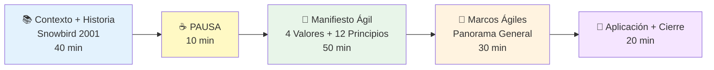

**Desglose temporal:**

- **Bloque 1 (40 min):** Contexto histórico 1990-2001 + Crisis del software + Métodos ligeros + Reunión de Snowbird
- **Pausa (10 min):** Descanso
- **Bloque 2 (50 min):** Los 4 valores del Manifiesto + Los 12 principios agrupados y analizados
- **Bloque 3 (30 min):** Panorama de marcos ágiles (Scrum, Kanban, XP, Lean, SAFe) + diferencias
- **Bloque 4 (20 min):** Comparación RUP vs Ágil, estado actual 2025, tarea práctica

---

### 🎓 Resultados de Aprendizaje Esperados

Al terminar esta clase, deberías poder:

- [ ] Explicar por qué los proyectos fallaban en los 90s (Standish Chaos Report: solo 28% éxito)
- [ ] Nombrar al menos 5 de los 17 firmantes del Manifiesto (Kent Beck, Martin Fowler, etc.)
- [ ] Describir qué pasó en Snowbird, Utah en febrero 13, 2001
- [ ] Recitar los 4 valores del Manifiesto en orden y explicar cada uno con ejemplos
- [ ] Listar los 12 principios del Manifiesto completos
- [ ] Agrupar principios en: Entrega (1,3,7), Colaboración (4,5,6), Técnica (9,10,11), Adaptación (2,8,12)
- [ ] Explicar "valoramos MÁS... aunque también tiene valor" con ejemplo concreto
- [ ] Dar 3 ejemplos de cómo ágil es radical vs tradicional (cambios, documentación, cliente)
- [ ] Diferenciar Manifiesto (filosofía) vs Scrum (framework de implementación)
- [ ] Identificar características clave de Scrum, Kanban, XP, Lean, SAFe
- [ ] Comparar RUP vs Ágil en tabla de 10 criterios
- [ ] Citar estadísticas actuales: 71% organizaciones usan ágil (State of Agile 2024)
- [ ] Explicar críticas al ágil: "Agile Industrial Complex", SAFe como RUP 2.0
- [ ] Decidir si usarías ágil en 5 escenarios diferentes (startup, banco, NASA, etc.)

---

### 🔗 Conexión con Otras Clases

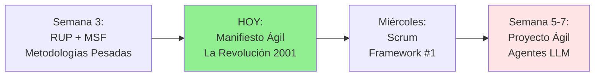

**¿Cómo se conecta esta clase?**

- **Clase anterior (Semana 3):** Vimos RUP/MSF como las últimas metodologías tradicionales "pesadas" (1998-2003)
- **Clase de HOY:** El Manifiesto Ágil 2001 surge como REACCIÓN directa a la complejidad de RUP
- **Próxima clase (Miércoles):** Scrum en profundidad - la implementación más popular de ágil
- **Semanas 5-7:** Proyecto real con Scrum: desarrollo de agentes LLM con sprints de 2 semanas

**Contexto cronológico metodológico:**

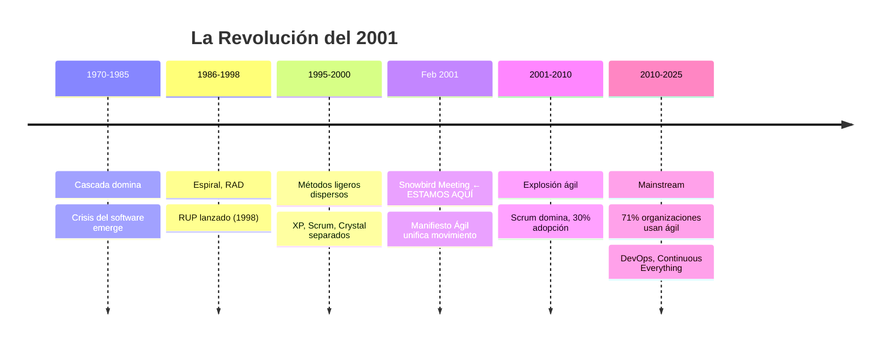

**Lo especial del Manifiesto Ágil:**

> El Manifiesto Ágil NO es un framework ni una metodología. Es una **declaración de valores y principios** que unificó métodos dispersos y cambió la industria del software para siempre. Es la respuesta directa a 30 años de metodologías pesadas que fallaban.

---

### 🧠 Mindmap: Lo que Cubriremos Hoy

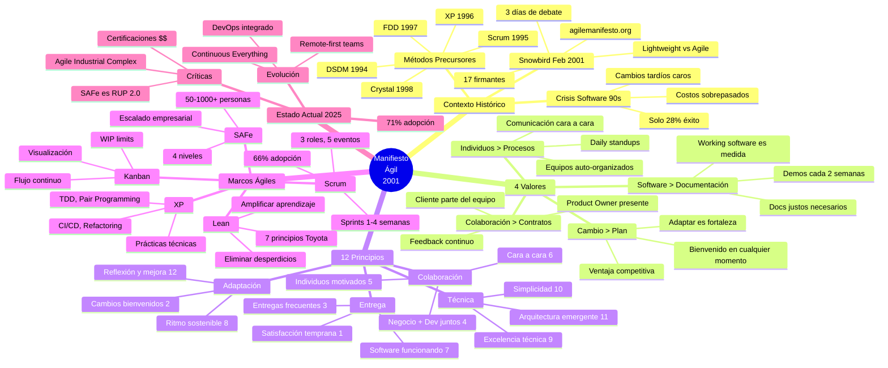

---

**Nota importante sobre esta clase:**

Esta clase marca el **cambio de paradigma** más importante en la historia del desarrollo de software. Es fundamental entenderla no como "una metodología más", sino como una **filosofía y movimiento cultural** que cambió cómo pensamos sobre:

- ✅ **Equipos:** De recursos intercambiables a individuos valiosos
- ✅ **Clientes:** De adversarios contractuales a colaboradores activos
- ✅ **Cambios:** De enemigos del proyecto a oportunidades de valor
- ✅ **Documentación:** De objetivo en sí misma a medio para un fin
- ✅ **Planificación:** De predicción a adaptación

**La pregunta clave de hoy:**

> ¿Por qué 17 personas frustradas con las metodologías tradicionales se reunieron en un resort de ski en 2001 y en 3 días crearon un documento que cambiaría la industria del software para siempre?

**¿Listo para descubrir la respuesta?** 🚀

---

## 📚 BLOQUE 1: El Contexto Histórico y la Reunión de Snowbird (40 min)

**Duración:** 40 minutos  
**Modalidad:** Expositiva con análisis histórico y contextual

### Objetivo del Bloque

Comprender el contexto histórico de los años 90s que llevó a la crisis del software, conocer los métodos "ligeros" precursores que existían antes de 2001, y entender cómo la reunión de Snowbird en febrero de 2001 unificó estos métodos en el Manifiesto Ágil que cambiaría la industria para siempre.

---

### 1.1 La Crisis del Software en los Años 90s (10 min)

#### El Problema: Proyectos que Fallaban Masivamente

**Contexto de los 90s:**

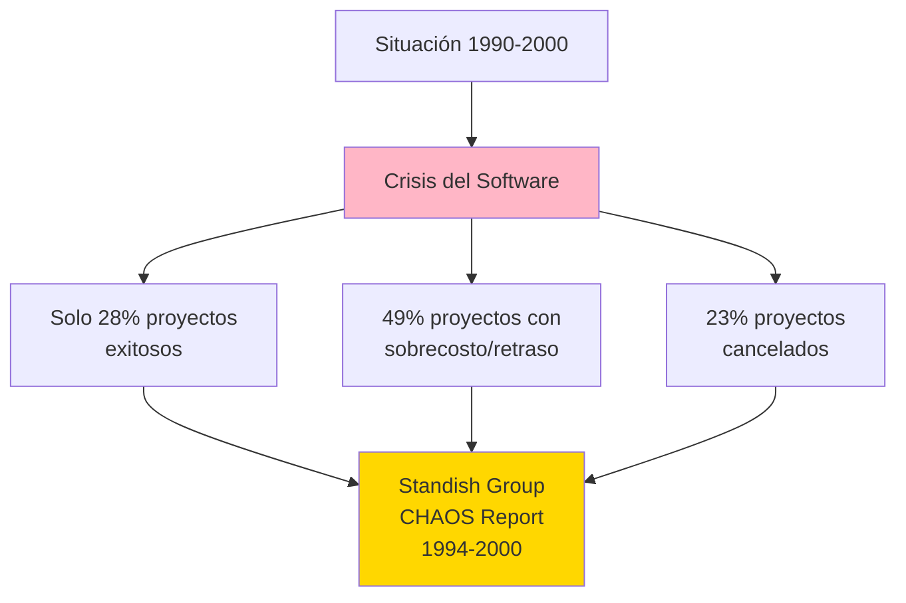

**Los números que aterraban a la industria:**

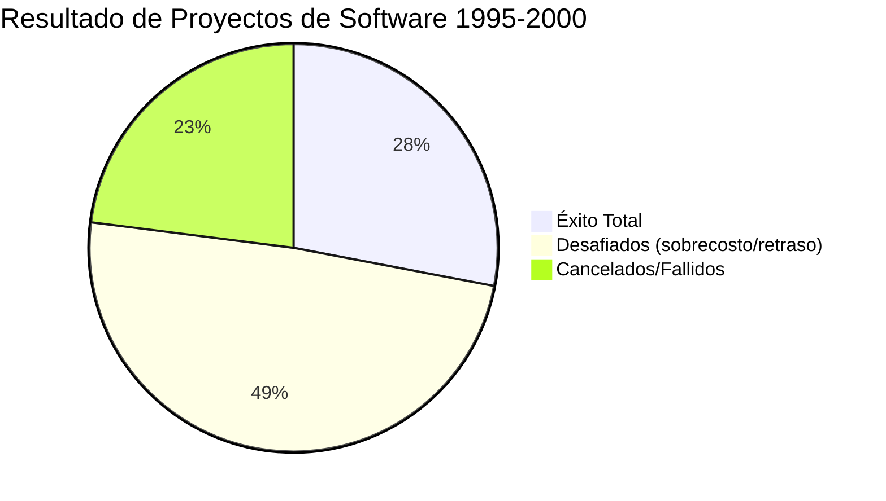

**Datos del Standish Group CHAOS Report:**

| Año  | Éxito | Desafiados | Fallidos | Costo Promedio Sobrepasado |
| ---- | ----- | ---------- | -------- | -------------------------- |
| 1994 | 16%   | 53%        | 31%      | 189%                       |
| 1996 | 27%   | 33%        | 40%      | 178%                       |
| 1998 | 26%   | 46%        | 28%      | 156%                       |
| 2000 | 28%   | 49%        | 23%      | 145%                       |

**Interpretación:**

- ✅ **Éxito total:** Entregado a tiempo, en presupuesto, con todas las funcionalidades
- ⚠️ **Desafiados:** Entregado pero con retrasos, sobrecostos o funcionalidades reducidas
- ❌ **Fallidos:** Cancelados antes de completarse o nunca usados

---

#### ¿Por Qué Fallaban los Proyectos?

**Las 5 razones principales:**

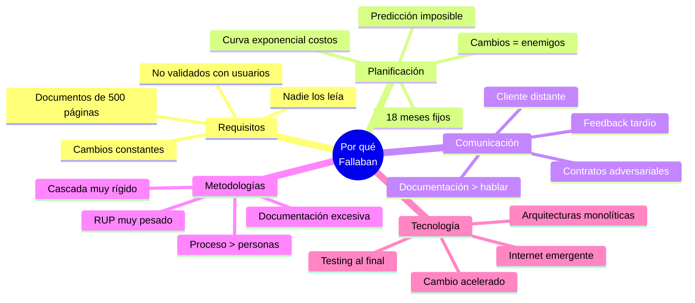

**Explicación detallada:**

**1. Problema de Requisitos:**

```markdown
Ciclo típico en Cascada/RUP pesado:

Mes 1-3: Analista escribe documento de requisitos (300 páginas)
Mes 4: Cliente "firma" sin leerlo completo
Mes 5-12: Desarrollo basado en ese documento
Mes 13: Cliente ve el sistema por PRIMERA VEZ
Mes 14: Cliente: "Esto NO es lo que necesitaba"
Mes 15-18: Intentos desesperados de cambios caros
Resultado: Proyecto "exitoso" que nadie usa
```

**Ejemplo real - Sistema de nómina del gobierno (1995):**

```markdown
- Costo estimado: $10M
- Tiempo estimado: 18 meses
- Requisitos: 1,200 páginas
- Resultado después de 2 años:
  - Costo real: $67M (570% sobre presupuesto)
  - Funcionalidades entregadas: 40% de lo prometido
  - Usuarios satisfechos: Sistema nunca usado
  - Cancelado: Volver al sistema anterior manual
```

**2. Problema de la Curva Exponencial de Costos:**

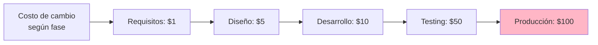

**La pesadilla:**

> Cambiar un requisito en la fase de Requisitos costaba $1,000.  
> El MISMO cambio después del deployment costaba $100,000.

**3. Problema del Cliente Distante:**

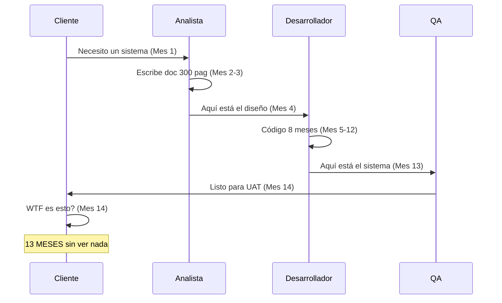

**El resultado típico:**

```markdown
Cliente (viendo el sistema en mes 14):
"Sí, esto es lo que PEDÍ hace un año...
pero ya NO es lo que NECESITO.

El mercado cambió, la competencia lanzó algo mejor,
mis usuarios ahora quieren X en lugar de Y.

¿Pueden cambiarlo?"

Equipo de desarrollo:
"Claro... nos tomará otros 6 meses y $2M adicionales"
```

---

#### Las Metodologías Dominantes y sus Limitaciones

**Cascada (1970-2000):**

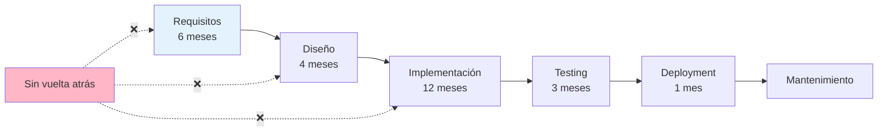

**Problemas:**

- ❌ Cliente ve resultado SOLO al final (mes 25)
- ❌ Cambios = fracaso del proyecto
- ❌ Documentación > Software funcionando
- ❌ Testing solo al final (bugs caros)

**RUP (1998-2001):**

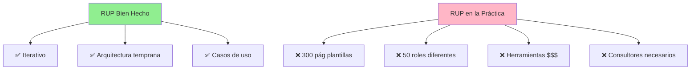

**El problema de RUP:**

```markdown
RUP en teoría: "Somos iterativos y adaptables"

RUP en la práctica (empresa típica 2000):

- 18 roles definidos (¿quién es el "Deployment Manager"?)
- 47 artefactos obligatorios (nadie los lee)
- IBM Rational Suite: $150K en licencias
- 6 meses de training para el equipo
- Consultores a $300/hora para "ayudar"
- Proceso más importante que resultado

Resultado: RUP se volvió TAN pesado como lo que reemplazaba
```

**Cita famosa de Martin Fowler (2000):**

> "RUP es como un buffet. Puedes tomar solo lo que necesitas.  
> El problema es que la mayoría de las empresas se comen el buffet COMPLETO  
> y terminan con indigestión metodológica."

---

#### El Grito por Algo Diferente

**Lo que la industria necesitaba en 2000:**

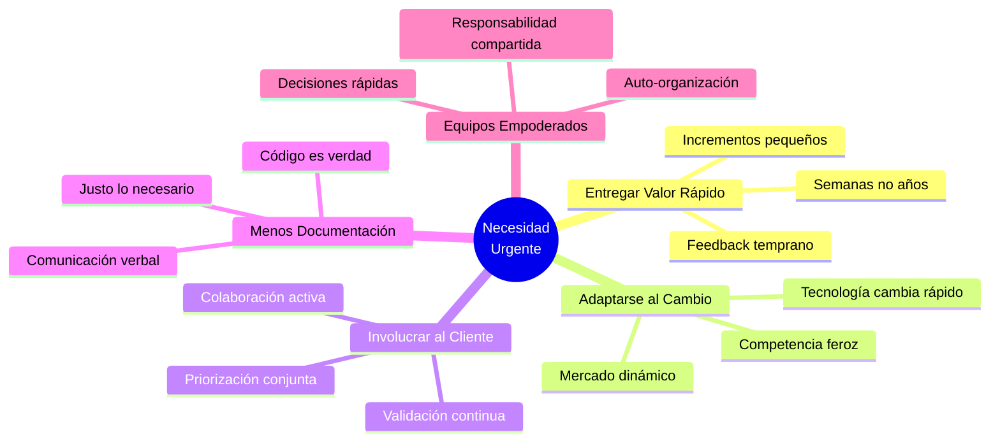

**Estadísticas que preocupaban (año 2000):**

```markdown
📊 Proyectos de software:

- Duración promedio: 18 meses
- % entregado a tiempo: 28%
- Sobrecosto promedio: 145%
- Documentación promedio: 500 páginas
- Tiempo hasta primer feedback: 12+ meses

💰 Costos:

- Industria global: $250 mil millones/año
- Desperdiciado en fracasos: $75 mil millones/año
- Costo promedio proyecto fallido: $2.3M

⏰ Tiempo al mercado:

- Ventana de oportunidad: 6 meses
- Tiempo desarrollo típico: 18 meses
- Resultado: Llegas tarde al mercado
```

**La pregunta que todos hacían:**

> **"¿Tiene que ser así?"**

---

### 1.2 Los Métodos "Ligeros" Precursores (1995-2000) (10 min)

#### El Movimiento Estaba en Marcha (Sin Saberlo)

**Lo fascinante:**

```markdown
En diferentes partes del mundo, diferentes personas
estaban llegando a las MISMAS conclusiones:

"Las metodologías pesadas no funcionan.
Necesitamos algo más ligero, adaptable, centrado en personas."

Pero trabajaban en SILOS, sin conocerse entre sí.
```

**El ecosistema pre-2001:**

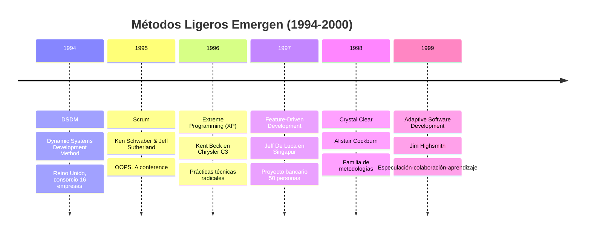

---

#### Método 1: Extreme Programming (XP) - Kent Beck, 1996

**El más "radical" de todos:**

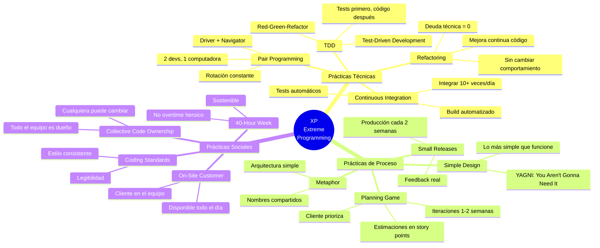

**Por qué era "Extreme":**

```markdown
Nombre original: "Extreme" porque llevaba prácticas
conocidas "AL EXTREMO":

❌ Code reviews son buenas
✅ XP: Pair programming = CONTINUOUS code review

❌ Testing es importante
✅ XP: TDD = Tests BEFORE code

❌ Integración frecuente es buena
✅ XP: Integrar 10+ veces AL DÍA

❌ Releases cortos son buenos
✅ XP: Release CADA 2 SEMANAS

En 1996, esto era RADICAL
```

**Caso de éxito: Chrysler C3 Project (1996-1998):**

```markdown
Proyecto: Sistema de nómina Chrysler
Equipo: Kent Beck, Ron Jeffries, Ward Cunningham
Método: XP (primera implementación real)

Resultados:
✅ 2,000 empleados en producción (año 1)
✅ Código 50% menos que sistema anterior
✅ Bugs: 1/10 del sistema anterior
✅ Equipo trabajando 40 horas/semana (no overtime)
✅ Cliente (Payroll dept) sentado con el equipo

Nota histórica: Cancelado en 2000 por razones políticas,
NO técnicas. Pero probó que XP funcionaba.
```

---

#### Método 2: Scrum - Schwaber & Sutherland, 1995

**El framework organizacional:**

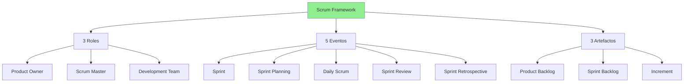

**Origen del nombre "Scrum":**

```markdown
Del rugby: Un "scrum" es cuando el equipo se junta
para avanzar la pelota de forma coordinada.

Analogía:
❌ Cascada: Relay race (pasa el bastón, espera tu turno)
✅ Scrum: Rugby scrum (todos avanzan juntos)
```

**Valores de Scrum (definidos en 1995):**

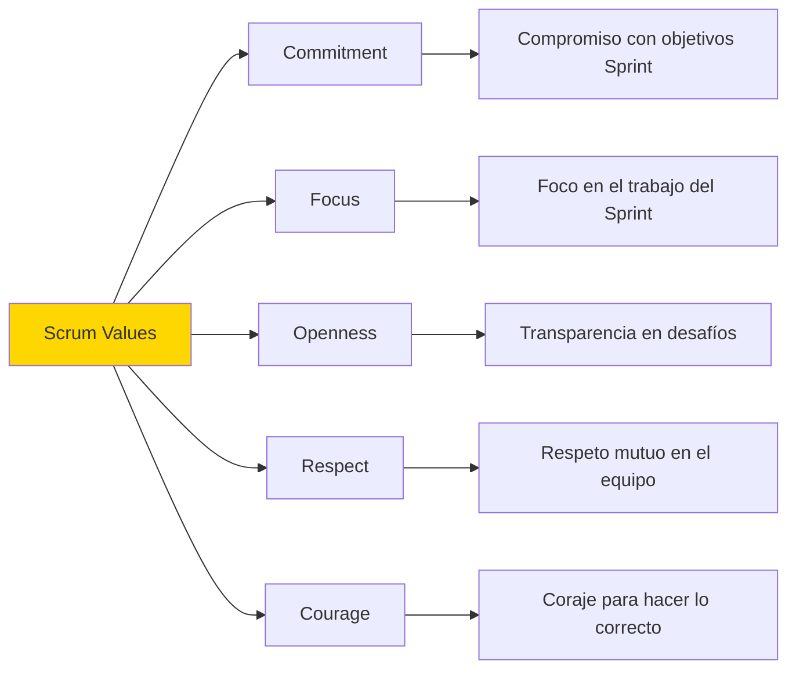

**Primera presentación pública:**

```markdown
OOPSLA Conference - Austin, Texas - Octubre 1995

Ken Schwaber presenta: "SCRUM Development Process"

Paper: "SCRUM Software Development Process"

- 30-day Sprints
- Daily Scrum Meetings
- Product Owner role
- Self-organizing teams
- Empiricism: Inspect & Adapt

Audiencia: ~50 personas
Reacción: Interés moderado, algunos escépticos
```

---

#### Método 3: Crystal Clear - Alistair Cockburn, 1998

**La familia de metodologías:**

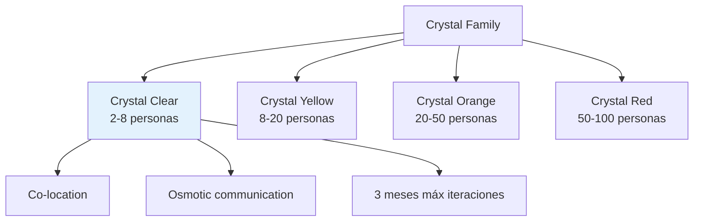

**Filosofía de Crystal:**

```markdown
Alistair Cockburn's insight:

"Metodología ÚNICA para todos = imposible.
Diferentes proyectos necesitan diferentes enfoques."

Pero TODOS comparten:
✅ Comunicación frecuente
✅ Entregas incrementales
✅ Mejora reflexiva
✅ Seguridad psicológica
```

**Contribución clave:**

> **"Osmotic Communication"**: En equipo co-localizado,  
> información se absorbe del ambiente (conversaciones, whiteboards)  
> sin necesidad de reuniones formales o documentos.

---

#### Método 4: FDD (Feature-Driven Development) - Jeff De Luca, 1997

**El enfoque de features:**

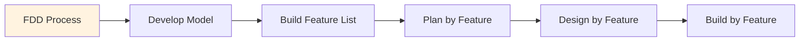

**Caso de origen - United Overseas Bank (Singapur, 1997):**

```markdown
Proyecto: Sistema bancario complejo
Equipo: 50 desarrolladores
Duración: 15 meses
Resultado: 2,000+ features entregadas on-time

Innovación FDD:

- Features pequeñas (2-10 días cada una)
- Ownership por feature (developer name)
- Progress tracking visual
- Milestones frecuentes
```

---

#### Método 5: DSDM (Dynamic Systems Development Method) - 1994

**El primero cronológicamente:**

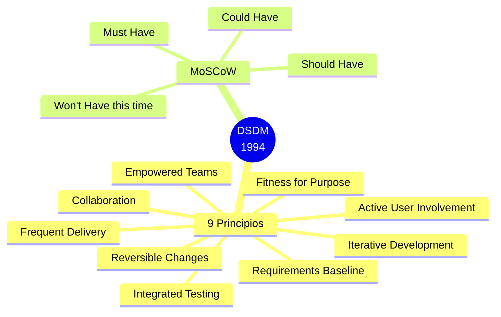

**Origen británico:**

```markdown
1994: Consorcio de 16 empresas británicas

Problema: RAD (Rapid Application Development) usado mal
Solución: Formalizar RAD en framework estructurado

Contribución clave: MoSCoW prioritization
(Usada hasta hoy en Ágil moderno)
```

---

### 1.3 El Problema: Métodos Dispersos Sin Unificación (5 min)

#### Situación en el año 2000

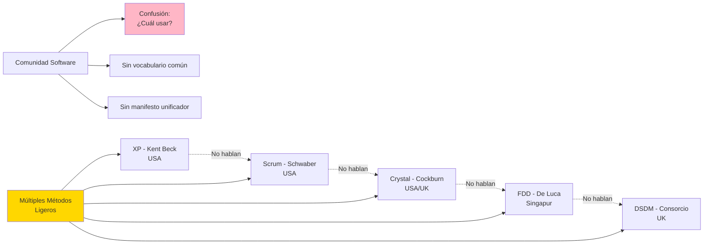

**El problema:**

```markdown
Cada método tenía seguidores apasionados:

XP fanboys: "Pair programming o muere"
Scrum enthusiasts: "Sprints son la única forma"
Crystal advocates: "Depende del contexto"
FDD practitioners: "Features uber alles"
DSDM consultants: "Necesitan MoSCoW"

Pero no había:
❌ Vocabulario compartido
❌ Valores comunes articulados
❌ Movimiento unificado
❌ Contra-narrativa a RUP/Cascada
```

**Cita de Kent Beck (2000):**

> "Todos estos métodos compartían algo fundamental,  
> pero nadie sabía QUÉ exactamente.  
> Era como intentar describir un elefante:  
> cada uno tocaba una parte diferente."

---

### 1.4 Snowbird, Utah - Febrero 2001: La Reunión Histórica (15 min)

#### Cómo se Organizó

**El origen de la reunión:**

```mermaid
sequenceDiagram
    participant KB as Kent Beck
    participant BA as Bob Martin
    participant MF as Martin Fowler
    participant Otros as 14 más

    KB->>BA: ¿Organizamos reunión métodos ligeros?
    BA->>BA: Necesitamos lugar neutral
    BA->>KB: ¿Qué tal Utah? Puedo conseguir resort
    KB->>MF: Confirma si vienes
    MF->>Otros: Email: "Lightweight methods summit"
    Otros->>BA: 17 confirmados
    Note over KB,Otros: Febrero 11-13, 2001
```

**Email de invitación (Bob Martin, Enero 2001):**

```markdown
Subject: Lightweight Methods Summit - Feb 11-13

Hi folks,

Kent and I are organizing a small gathering of people
interested in "lightweight" software development methods.

Goal: Find common ground and discuss the future of these methods.

Location: The Lodge at Snowbird Ski Resort, Utah
Dates: February 11-13, 2001 (Sunday-Tuesday)
Cost: $0 (Bob Martin covers resort)

Who's coming:

- Kent Beck (XP)
- Ken Schwaber, Jeff Sutherland (Scrum)
- Alistair Cockburn (Crystal)
- Ward Cunningham, Ron Jeffries
- Martin Fowler, Jim Highsmith
- ...and more

Please confirm if you can attend.
We'll ski, eat, and discuss the future of software development.

-- Bob
```

---

#### Los 17 Firmantes

**Quiénes estaban en Snowbird:**

```mermaid
mindmap
  root((17 Firmantes<br/>Snowbird))
    XP Camp
      Kent Beck
      Ward Cunningham
      Ron Jeffries
    Scrum Camp
      Ken Schwaber
      Jeff Sutherland
      Mike Beedle
    Pragmatists
      Martin Fowler
      Dave Thomas
      Andy Hunt
    Crystal
      Alistair Cockburn
    ASD
      Jim Highsmith
    DSDM
      Arie van Bennekum
    FDD
      Jon Kern
    Otros
      Bob Martin
      Steve Mellor
      Brian Marick
      James Grenning
```

**Los 17 completos (con afiliaciones):**

| Nombre            | Método Principal     | Contribución Clave              |
| ----------------- | -------------------- | ------------------------------- |
| Kent Beck         | Extreme Programming  | Prácticas técnicas radicales    |
| Mike Beedle       | Scrum                | Enterprise Scrum                |
| Arie van Bennekum | DSDM                 | Perspectiva europea             |
| Alistair Cockburn | Crystal              | Comunicación humana             |
| Ward Cunningham   | XP / Wiki inventor   | Patterns, simplicidad           |
| Martin Fowler     | Refactoring          | Diseño evolutivo                |
| James Grenning    | Embedded Systems     | Ágil en sistemas embebidos      |
| Jim Highsmith     | Adaptive SD          | Management ágil                 |
| Andrew Hunt       | Pragmatic Programmer | Pragmatismo sobre dogma         |
| Ron Jeffries      | XP                   | Stories, velocity               |
| Jon Kern          | FDD                  | Features como unidad            |
| Brian Marick      | Testing              | Context-driven testing          |
| Robert C. Martin  | OO Design            | Principios SOLID, Craftsmanship |
| Steve Mellor      | Method Engineering   | Modelado ejecutable             |
| Ken Schwaber      | Scrum                | Framework organizacional        |
| Jeff Sutherland   | Scrum                | Scrum origins                   |
| Dave Thomas       | Pragmatic Programmer | Tool-centric development        |

---

#### Los 3 Días que Cambiaron Todo

**Día 1 - Domingo 11 de Febrero: El Debate**

```markdown
Mañana:

- Ski informal
- Llegadas escalonadas
- Cena grupal

Noche (20:00-24:00):
🔥 EL DEBATE DEL NOMBRE

Kent Beck: "Lightweight Methods es el término correcto"
Bob Martin: "No, 'lightweight' suena a 'no riguroso'"
Jim Highsmith: "¿Qué tal 'Adaptive'?"
Martin Fowler: "Adaptive es muy académico"
Mike Beedle: "Lightweight está gastado, necesitamos algo nuevo"

Alguien (varios claman crédito): "¿Agile?"

Discusión intensa:
✅ PRO: Agile = adaptable, rápido, responsive
❌ CON: Suena a marketing, no técnico
✅ PRO: Agile Manifesto suena bien
❌ CON: ¿Muy corporativo?

VOTACIÓN: 13-4 a favor de "Agile"

(Nota: Kent Beck no estaba 100% convencido hasta meses después)
```

**Día 2 - Lunes 12 de Febrero: Los Valores**

```markdown
Desayuno (08:00-09:00):

- Ambiente relajado
- Discusiones continúan

Sesión Matutina (09:00-12:00):
🎯 TORMENTA DE IDEAS: ¿Qué tenemos en común?

Whiteboard lleno de Post-its:

- "Individuos"
- "Interacción"
- "Software funcionando"
- "Respuesta a cambios"
- "Cliente colaborador"
- "Simplicidad"
- "Feedback rápido"
  ...50+ ideas

Almuerzo (12:00-14:00):

- Ski opcional
- Grupos pequeños afinan ideas

Sesión Tarde (14:00-18:00):
📝 REDACCIÓN DE VALORES

Intento 1: Lista de 10 items
❌ Muy largo, pierde fuerza

Intento 2: Lista de 6 valores
❌ Aún disperso

Intento 3: 4 VALORES en formato "X sobre Y"
✅ Consenso emergente

Cena (19:00-22:00):

- Celebración inicial
- Refinamiento de palabras
- "Working software" vs "Software funcionando"
- "Contract negotiation" vs "Negotiating contracts"

Noche:

- Bob Martin y Martin Fowler refinan redacción
- Kent Beck y Ward diseñan estructura
```

**La Estructura "X sobre Y":**

```markdown
El formato fue INTENCIONAL:

"Valoramos X sobre Y"

Seguido de:
"Esto es, aunque hay valor en Y,
valoramos más X."

Por qué este formato:
✅ Evita malentendidos ("¿NO documentación?")
✅ Balance, no extremismo
✅ Priorización clara
✅ Respeta métodos tradicionales
```

**Día 3 - Martes 13 de Febrero: Los Principios y la Firma**

```markdown
Mañana (08:00-12:00):
📜 LOS 12 PRINCIPIOS

Técnica: Cada persona propone 3-5 principios
Total: ~60 principios propuestos

Proceso de consolidación:

1. Agrupar similares
2. Eliminar redundantes
3. Priorizar los más importantes
4. Quedan 12 principios

Almuerzo (12:00-14:00):

- Última revisión de texto
- Orden de nombres (alfabético decidido)

Sesión Final (14:00-17:00):
🖊️ LA FIRMA

Momento histórico:

- Los 17 firmaban el documento
- Foto grupal (perdida tristemente)
- Compromiso de publicar online
- Plan de difusión

Reflexión final:
Jim Highsmith: "Esto podría cambiar la industria"
Kent Beck: "O ser completamente ignorado"
Martin Fowler: "El tiempo dirá"

Despedidas:

- Optimismo cauteloso
- Plan: publicar en agilemanifesto.org
- Fecha publicación: Febrero 13, 2001
```

---

#### El Documento Final

**El Manifiesto tal como se firmó:**

```markdown
Manifesto for Agile Software Development

We are uncovering better ways of developing
software by doing it and helping others do it.
Through this work we have come to value:

Individuals and interactions over processes and tools
Working software over comprehensive documentation
Customer collaboration over contract negotiation
Responding to change over following a plan

That is, while there is value in the items on
the right, we value the items on the left more.

[Nombres de los 17 firmantes en orden alfabético]

© 2001, the above authors
This declaration may be freely copied in any form,
but only in its entirety through this notice.
```

**El sitio web: agilemanifesto.org**

```markdown
Dominio registrado: Febrero 13, 2001
Primera versión: HTML simple, sin CSS
Contenido: El manifiesto + los 12 principios
Idioma original: Inglés

Diseño deliberadamente simple:

- Sin logos
- Sin imágenes
- Sin marketing
- Solo texto

Filosofía: "El contenido es más importante que el diseño"

Dato curioso: El sitio TODAVÍA está activo en 2025,
casi idéntico al original (solo agregaron traducciones)
```

---

#### El Impacto Inmediato (Febrero-Diciembre 2001)

**Los primeros meses:**

```mermaid
timeline
    title Difusión Post-Snowbird
    Feb 13, 2001 : Publicación agilemanifesto.org
                 : Email a listas de correo
                 : ~100 visitas día 1
    Marzo 2001 : Artículos en blogs técnicos
               : XP community adopta
               : Scrum community adopta
    Mayo 2001 : Primer artículo mainstream
              : "Dr. Dobb's Journal"
              : Conferencias mencionan
    Julio 2001 : Primera "Agile Conference"
               : Salt Lake City
               : 250 asistentes
    Oct 2001 : Agile Alliance fundada
             : Organización sin fines lucro
             : Mission: promover ágil
    Dic 2001 : ~10,000 firmas adicionales
             : Movimiento establecido
             : Empresas empiezan adopción
```

**Reacciones iniciales:**

```markdown
✅ Comunidad XP/Scrum:
"¡Finalmente tenemos un manifiesto unificador!"

⚠️ Consultores RUP:
"Esto es solo una moda pasajera"

❌ Waterfall defenders:
"Esto causará caos. Necesitamos proceso y disciplina"

🤔 Empresas:
"Interesante... pero ¿cómo lo implementamos?"

📊 Academia:
"Necesitamos estudios empíricos antes de adoptar"
```

---

### 📊 Resumen del Bloque 1

```mermaid
mindmap
  root((Bloque 1:<br/>Contexto e<br/>Historia))
    Crisis del Software
      Solo 28% éxito
      Sobrecostos 145%
      $75B desperdiciados/año
      Metodologías pesadas
    Métodos Precursores
      XP 1996
      Scrum 1995
      Crystal 1998
      FDD 1997
      DSDM 1994
    Snowbird 2001
      17 firmantes
      Febrero 11-13
      3 días intensos
      Debate del nombre
      4 valores
      12 principios
    El Manifiesto
      agilemanifesto.org
      Feb 13, 2001
      Formato X sobre Y
      Difusión viral
      Movimiento unificado
```

**Lecciones clave del bloque:**

1. ✅ Ágil NO surgió de la nada - fue reacción a 30 años de fracasos
2. ✅ Múltiples métodos ya existían - Snowbird los UNIFICÓ
3. ✅ Los 17 firmantes eran PRÁCTICOS con experiencia real
4. ✅ El debate del nombre fue intenso - "Agile" ganó por votación
5. ✅ El formato "X sobre Y" fue intencional para evitar extremismo
6. ✅ El manifiesto es DELIBERADAMENTE simple - 68 palabras, 4 valores
7. ✅ Difusión fue viral pero orgánica - sin marketing corporativo

**Frase para recordar:**

> **"Snowbird 2001 no inventó nuevas prácticas.  
> Dio VOZ y VOCABULARIO COMÚN a una revolución  
> que ya estaba en marcha."**

**Próximo bloque:**

Después de la pausa, analizaremos en profundidad los **4 valores y 12 principios** del Manifiesto Ágil con ejemplos concretos de aplicación.

---

## ☕ PAUSA

**Duración:** 10 minutos  
**Instrucciones:** Estirar, ir al baño, tomar agua. Al volver, nos sumergimos en el corazón del Manifiesto Ágil.

---

## 💎 BLOQUE 2: Los 4 Valores del Manifiesto Ágil

**Duración:** 50 minutos  
**Modalidad:** Expositiva profunda con análisis de cada valor, ejemplos concretos y anti-patrones

### Objetivo del Bloque

Comprender en PROFUNDIDAD los 4 valores fundamentales del Manifiesto Ágil, analizando el formato "Valoramos X sobre Y", identificando qué significa cada valor en la práctica real, reconociendo cuándo se aplica correctamente vs incorrectamente, y entendiendo por qué estos valores revolucionaron la forma de hacer software.

---

### Introducción: La Estructura del Manifiesto

**El texto completo que cambió todo:**

```markdown
Manifesto for Agile Software Development

Estamos descubriendo formas mejores de desarrollar
software tanto por nuestra propia experiencia como
ayudando a terceros. A través de este trabajo hemos
aprendido a valorar:

---

**Individuos e interacciones** sobre procesos y herramientas
**Software funcionando** sobre documentación extensiva
**Colaboración con el cliente** sobre negociación contractual
**Respuesta ante el cambio** sobre seguir un plan

---

Esto es, aunque valoramos los elementos de la derecha,
valoramos más los de la izquierda.

Kent Beck, Mike Beedle, Arie van Bennekum,
Alistair Cockburn, Ward Cunningham, Martin Fowler,
James Grenning, Jim Highsmith, Andrew Hunt,
Ron Jeffries, Jon Kern, Brian Marick,
Robert C. Martin, Steve Mellor, Ken Schwaber,
Jeff Sutherland, Dave Thomas

© 2001, los autores mencionados
esta declaración puede ser copiada libremente en cualquier
forma, pero sólo en su totalidad a través de este aviso.
```

---

### La Estructura "X sobre Y" - Por Qué Importa

**Análisis lingüístico del formato:**

```mermaid
graph TB
    A["Valoramos X sobre Y"] --> B["X = Prioridad ALTA"]
    A --> C["Y = NO eliminado"]
    A --> D["Y tiene valor"]
    A --> E["Pero X tiene MÁS valor"]

    F["Aclaración:<br/>'Aunque valoramos Y,<br/>valoramos MÁS X'"] --> G["Evita malentendidos"]
    F --> H["Balance, no extremismo"]
    F --> I["Respeto a métodos tradicionales"]

    style A fill:#FFD700
    style B fill:#90EE90
    style C fill:#E3F2FD
    style G fill:#90EE90
```

**Por qué este formato fue INTENCIONAL:**

```markdown
❌ Si hubieran dicho: "Valoramos individuos, NO procesos"
→ Malinterpretación: "Procesos son malos"
→ Caos total, sin estructura

✅ Al decir: "Individuos SOBRE procesos (aunque procesos tienen valor)"
→ Interpretación correcta: "Procesos son útiles, pero personas son MÁS importantes"
→ Balance pragmático
```

**El debate en Snowbird sobre esto:**

```markdown
Kent Beck: "Debemos ser claros que NO eliminamos procesos"
Bob Martin: "Necesitamos la cláusula de balance"
Martin Fowler: "El formato 'X sobre Y' + la aclaración resuelve esto"

CONSENSO: Incluir SIEMPRE la frase:
"Esto es, aunque valoramos los elementos de la derecha,
valoramos más los de la izquierda."
```

**Visualización del balance:**

```mermaid
graph LR
    A[Lado IZQUIERDO] -->|Mayor prioridad| B[80% enfoque]
    C[Lado DERECHO] -->|Menor prioridad| D[20% enfoque]

    E[PERO ambos<br/>tienen valor] --> F[No eliminar<br/>completamente]

    style A fill:#90EE90
    style B fill:#90EE90
    style C fill:#E3F2FD
    style D fill:#E3F2FD
    style E fill:#FFD700
```

**Regla de oro:**

> **"Sobre" ≠ "En lugar de"**  
> **"Más que" ≠ "Exclusivamente"**

---

### 2.1 Valor 1: Individuos e Interacciones sobre Procesos y Herramientas (20 min)

#### El Valor Completo

```mermaid
mindmap
  root((Individuos e<br/>Interacciones<br/>SOBRE<br/>Procesos y<br/>Herramientas))
    Individuos
      Personas con habilidades
      Motivación intrínseca
      Creatividad
      Responsabilidad
      Autonomía
      Aprendizaje continuo
    Interacciones
      Comunicación cara a cara
      Colaboración activa
      Confianza mutua
      Feedback inmediato
      Conversaciones honestas
      Resolución conjunta
    Procesos
      Útiles como guías
      No camisa de fuerza
      Adaptables al contexto
      Servant, not master
      Facilitan, no dictan
    Herramientas
      Apoyan el trabajo
      No reemplazan comunicación
      Simples y efectivas
      Al servicio del equipo
      No imponer workflow
```

---

#### ¿Qué Significa "Individuos e Interacciones"?

**Desglose del concepto:**

**1. Individuos = Personas sobre Recursos**

```mermaid
graph LR
    A[Tradicional:<br/>Personas = Recursos] --> B[Developer 1<br/>Developer 2<br/>Developer 3]
    B --> C[Intercambiables<br/>Fungibles]

    D[Ágil:<br/>Personas = Individuos] --> E[María: Frontend expert<br/>Juan: Backend ninja<br/>Ana: UX passionate]
    E --> F[Únicos<br/>Valiosos<br/>Irreemplazables]

    style A fill:#FFB6C6
    style D fill:#90EE90
```

**Ejemplo concreto:**

```markdown
❌ ENFOQUE TRADICIONAL (RUP pesado):

"Necesitamos 5 FTEs (Full Time Equivalents) con perfil Java J2EE
para rol de Desarrollador según documento de arquitectura página 47."

→ Personas vistas como "recursos intercambiables"
→ No importa quién, solo que cumpla el perfil
→ Motivación ignorada

✅ ENFOQUE ÁGIL:

"Tenemos a Carlos que es brillante en APIs REST y le ENCANTA
trabajar en backend. ¿Cómo estructuramos el equipo para que
Carlos pueda brillar en lo que le apasiona?"

→ Personas vistas como individuos únicos
→ Importan sus fortalezas y pasiones
→ Maximizar potencial individual
```

**2. Interacciones = Comunicación Humana Real**

```mermaid
graph TB
    A[Interacción Humana Real] --> B[Cara a cara]
    A --> C[Conversación]
    A --> D[Gestos y tono]
    A --> E[Preguntas inmediatas]
    A --> F[Entendimiento profundo]

    G[NO es interacción real] --> H[Email largo]
    G --> I[Documento Word 50 pág]
    G --> J[Ticket en Jira sin contexto]
    G --> K[Meeting con 20 personas]

    style A fill:#90EE90
    style G fill:#FFB6C6
```

**La famosa cita de Alistair Cockburn:**

> **"La forma más eficiente y efectiva de comunicar información  
> a un equipo de desarrollo y entre sus miembros es la  
> conversación cara a cara."**  
> — Principio #6 del Manifiesto Ágil

---

#### ¿Qué Significa "sobre Procesos y Herramientas"?

**Aclaración crítica:**

```markdown
❌ NO significa: "Eliminar procesos y herramientas"
✅ SÍ significa: "Procesos y herramientas SIRVEN a las personas, no al revés"
```

**El problema con procesos excesivos:**

```mermaid
graph TB
    A[Proceso Pesado] --> B[47 plantillas obligatorias]
    A --> C[12 aprobaciones requeridas]
    A --> D[8 roles diferentes involucrados]
    A --> E[3 semanas para cambio pequeño]

    F[Resultado] --> G[Personas frustradas]
    F --> H[Burocracia paraliza]
    F --> I[Valor NO se entrega]

    style A fill:#FFB6C6
    style F fill:#FFB6C6
```

**Ejemplo real - Empresa Fortune 500 (2015):**

```markdown
SITUACIÓN:

Cliente: "Necesitamos cambiar el color de este botón de azul a verde"
(Cambio de 1 línea CSS)

PROCESO OBLIGATORIO:

Día 1: Developer crea Change Request (CR-2015-04-1847)
Día 2: Technical Lead aprueba (TL-APR-20150402-001)
Día 3: Architecture Review Board rechaza (falta diagrama UML)
Día 4-5: Developer crea diagrama UML del botón (!!)
Día 6: ARB aprueba arquitectura
Día 7: Change Advisory Board (CAB) revisa
Día 8-10: CAB pide análisis de impacto de 15 páginas
Día 11-12: Developer escribe análisis
Día 13: CAB aprueba
Día 14: Security team revisa (¿riesgo de seguridad en color?)
Día 15: Security aprueba
Día 16: Release Manager programa deployment
Día 17-20: Ventana de deployment retrasada
Día 21: Finalmente se cambia 1 línea CSS

RESULTADO:

- 21 días para cambiar un color
- Cliente frustrado
- Developer frustrado
- 40 horas de overhead burocrático
- Valor de negocio = $0
```

**La filosofía Ágil:**

```markdown
MISMO CAMBIO CON ÁGIL:

Lunes 10:00am: Cliente menciona en Daily Standup
Lunes 10:15am: Developer cambia CSS, commit, push
Lunes 10:20am: CI/CD despliega a staging
Lunes 10:25am: Cliente valida en staging: "Perfecto!"
Lunes 10:30am: Deploy a producción

RESULTADO:

- 30 minutos total
- Cliente feliz
- Developer feliz
- 0 documentos burocráticos
- Valor entregado inmediatamente

¿Cómo? Porque:
✅ Confiamos en las personas
✅ Proceso ligero que no bloquea
✅ Herramientas automatizan lo repetitivo
```

---

#### El Balance: Procesos SÍ son Necesarios

**Procesos útiles en Ágil:**

```mermaid
mindmap
  root((Procesos<br/>Útiles))
    Daily Standup
      15 min diarios
      Alineación rápida
      Identificar bloqueos
      NO es reporte de status
    Sprint Planning
      Planear 2 semanas
      Compromiso del equipo
      Clarificar requisitos
      Estimar esfuerzo
    Retrospective
      Mejora continua
      Qué funcionó
      Qué mejorar
      Acciones concretas
    Definition of Done
      Checklist calidad
      Tests pasando
      Code review hecho
      Documentación actualizada
    CI CD Pipeline
      Build automático
      Tests automáticos
      Deploy automático
      Feedback en minutos
```

**Regla de oro:**

> **Proceso debe SER ÚTIL o SER ELIMINADO**  
> Si un proceso no agrega valor, es desperdicio.

**Test del valor:**

```markdown
Para cada proceso/ceremonia, pregunta:

1. ¿Facilita la comunicación del equipo? → Útil
2. ¿Reduce riesgos significativos? → Útil
3. ¿Mejora la calidad del producto? → Útil
4. ¿Solo existe por compliance/burocracia? → ELIMINAR
5. ¿Nadie lee la salida de este proceso? → ELIMINAR
6. ¿Se puede automatizar? → AUTOMATIZAR
```

---

#### Herramientas: Sirvientes, No Maestros

**El problema de herramientas que dictan workflow:**

```mermaid
graph TB
    A[Herramienta Pesada] --> B[50 campos obligatorios en ticket]
    A --> C[Workflow de 12 estados]
    A --> D[Integraciones rotas]
    A --> E[Requiere training de 1 semana]

    F[Resultado] --> G[Equipo pasa 30% tiempo<br/>en la herramienta]
    F --> H[Comunicación real disminuye]
    F --> I[Herramienta es el fin,<br/>no el medio]

    style A fill:#FFB6C6
    style F fill:#FFB6C6
```

**Ejemplo - Jira Mal Usado:**

```markdown
❌ JIRA COMO MAESTRO:

"No puedes empezar a codear hasta que:

- El ticket tenga los 23 campos completos
- Story points estén estimados
- Arquitecto haya aprobado
- Ticket esté en estado 'Ready for Development'
- Hayas movido el ticket a 'In Progress'
- Hayas logueado tiempo estimado"

→ 2 horas de overhead antes de escribir 1 línea de código
→ Jira dicta cómo trabajas

✅ JIRA COMO SIRVIENTE:

"Jira es un recordatorio de lo que estamos haciendo.
Si olvidas actualizar un ticket, no pasa nada.
Lo importante es que el equipo SEPA en qué trabajas.
Si lo saben por standup, el ticket puede esperar."

→ Jira refleja la realidad, no la crea
→ Tú dictas cómo usas Jira
```

**Herramientas que EMPODERAN:**

```mermaid
graph LR
    A[Herramientas Ágiles] --> B[Slack:<br/>Comunicación rápida]
    A --> C[GitHub:<br/>Colaboración código]
    A --> D[Figma:<br/>Diseño colaborativo]
    A --> E[Miro:<br/>Whiteboard virtual]

    F[Características] --> G[Simples de usar]
    F --> H[No imponen workflow]
    F --> I[Facilitan colaboración]
    F --> J[Feedback instantáneo]

    style A fill:#90EE90
```

---

#### Casos Concretos: Correcto vs Incorrecto

**Caso 1: El Bug Crítico en Producción**

```markdown
🔥 SITUACIÓN: Bug crítico en producción, usuarios afectados

❌ ENFOQUE TRADICIONAL (Proceso sobre Personas):

1. Developer encuentra el bug en producción
2. Crea ticket PROD-BUG-12847 con template de 15 campos
3. Espera que Incident Manager lo priorice (2 horas)
4. Espera aprobación de Change Advisory Board (4 horas)
5. Espera ventana de deployment (12 horas)
6. Fix finalmente desplegado después de 18 horas

RESULTADO: 18 horas de downtime, clientes furiosos

✅ ENFOQUE ÁGIL (Personas sobre Proceso):

1. Developer encuentra el bug: "¡Hey equipo, bug crítico!"
2. Equipo se reúne inmediatamente (5 min)
3. Root cause identificado en pareja (15 min)
4. Fix desarrollado y testeado (30 min)
5. Code review express en Slack (10 min)
6. Deploy directo a producción (5 min)
7. Monitoreo conjunto del fix (15 min)

RESULTADO: 1 hora total, problema resuelto
```

**Caso 2: Nueva Funcionalidad Compleja**

```markdown
📝 SITUACIÓN: Cliente quiere funcionalidad nueva con lógica compleja

❌ ENFOQUE TRADICIONAL (Documentación sobre Conversación):

1. Analista crea documento de requisitos (3 días)
2. Documento 80 páginas con diagramas UML
3. Developer lee documento (1 día)
4. Developer tiene 30 preguntas sin responder
5. Email al analista con preguntas (1 día espera)
6. Respuestas ambiguas generan más preguntas
7. Desarrollo comienza semana 2 con entendimiento 60%
8. Resultado final NO es lo que cliente quería

RESULTADO: Re-trabajo, frustración, desperdicio

✅ ENFOQUE ÁGIL (Conversación sobre Documentación):

1. Product Owner trae la idea al equipo (30 min)
2. Conversación en whiteboard con todo el equipo (1 hora)
3. Preguntas respondidas EN EL MOMENTO
4. Acuerdos dibujados en pizarra, foto tomada
5. Spike técnico para explorar viabilidad (4 horas)
6. Refinamiento con PO basado en spike (30 min)
7. Desarrollo comienza con entendimiento 95%
8. Cada día PO valida progreso, ajustes sobre la marcha

RESULTADO: Funcionalidad correcta, menos re-trabajo
```

**Caso 3: Equipo Distribuido (Desafío Real)**

```markdown
🌍 SITUACIÓN: Equipo distribuido (España, México, Argentina)

❌ ENFOQUE ERRÓNEO (Eliminar procesos completamente):

"Somos ágiles, no necesitamos procesos!"

→ Caos total
→ Duplicación de trabajo
→ Falta de coordinación
→ 3 desarrolladores implementan lo mismo

RESULTADO: Fracaso total

✅ ENFOQUE CORRECTO (Personas + Procesos mínimos):

Procesos ligeros para coordinar:

- Daily standup async en Slack (timezone-friendly)
- Video call 2 veces/semana para temas complejos
- Documentación técnica MÍNIMA en Confluence
- Pair programming remoto para features críticas
- Retrospectivas mensuales para mejorar coordinación

RESULTADO: Equipo distribuido efectivo
```

---

#### Anti-Patrones Comunes

**Anti-Patrón #1: "Ágil = Sin Procesos"**

```markdown
❌ Malinterpretación:

"Valoramos individuos sobre procesos, por lo tanto:

- No necesitamos standups (es proceso)
- No necesitamos retrospectivas (es proceso)
- No necesitamos definition of done (es proceso)
- Cada quien hace lo que quiera"

CONSECUENCIA: Caos, no Ágil

✅ Interpretación correcta:

"Procesos deben SERVIR al equipo, no esclavizarlo.
Tenemos procesos LIGEROS que facilitan colaboración,
pero si un proceso no agrega valor, lo eliminamos."
```

**Anti-Patrón #2: "No Documentar Nada"**

```markdown
❌ Malinterpretación:

"Valoramos individuos sobre documentación, por lo tanto:

- No documentamos arquitectura
- No documentamos APIs
- No documentamos decisiones técnicas
- 'El código se auto-documenta'"

CONSECUENCIA:

- Developer nuevo tarda 3 meses en entender sistema
- Decisiones arquitectónicas olvidadas
- Se repiten errores del pasado

✅ Interpretación correcta:

"Documentamos JUSTO LO NECESARIO:

- README claro del proyecto
- Arquitectura high-level (1 página)
- Decisiones técnicas críticas (ADRs)
- APIs públicas documentadas
- NO documentamos lo obvio o lo que cambia rápido"
```

**Anti-Patrón #3: "Herramientas No Importan"**

```markdown
❌ Malinterpretación:

"Valoramos individuos sobre herramientas, por lo tanto:

- Usamos Excel para todo
- No invertimos en CI/CD
- No tenemos control de versiones moderno
- Herramientas no importan"

CONSECUENCIA:

- Horas perdidas en tareas manuales
- Errores humanos evitables
- Productividad baja

✅ Interpretación correcta:

"Invertimos en herramientas que EMPODERAN al equipo:

- CI/CD automatiza lo repetitivo
- Git permite colaboración efectiva
- Slack facilita comunicación rápida
- Pero NO dejamos que herramientas dicten workflow"
```

---

#### Métricas: ¿Cómo Medir Este Valor?

**Indicadores de que lo estás haciendo BIEN:**

```mermaid
graph LR
    A[Indicadores Positivos] --> B[Equipo feliz<br/>Turnover < 10%]
    A --> C[Decisiones rápidas<br/>< 1 día]
    A --> D[Comunicación fluida<br/>Pocas reuniones formales]
    A --> E[Experimentos frecuentes<br/>Safe to fail]
    A --> F[Procesos evolucionan<br/>Retrospectives útiles]

    style A fill:#90EE90
```

**Indicadores de que lo estás haciendo MAL:**

```mermaid
graph LR
    A[Indicadores Negativos] --> B[Desarrolladores frustrados<br/>Turnover > 30%]
    A --> C[Decisiones tardan semanas<br/>Parálisis burocrática]
    A --> D[Comunicación por email<br/>Meetings de 2+ horas]
    A --> E[Miedo a experimentar<br/>Proceso castiga fallos]
    A --> F[Procesos petrificados<br/>Nadie los cuestiona]

    style A fill:#FFB6C6
```

**Test rápido (responde sí/no):**

```markdown
1. ¿Tu equipo puede tomar decisiones técnicas sin aprobaciones externas? □
2. ¿Puedes hablar directamente con el cliente/usuario final? □
3. ¿Un cambio pequeño se puede hacer en < 1 día? □
4. ¿La última retrospectiva resultó en cambios reales? □
5. ¿Los procesos actuales los definió el EQUIPO, no management? □
6. ¿Tus herramientas facilitan tu trabajo vs complicarlo? □
7. ¿Puedes cuestionar un proceso si no agrega valor? □
8. ¿El equipo se siente empoderado, no micro-gestionado? □

SCORING:
7-8 SÍ: ✅ Excelente aplicación del valor
5-6 SÍ: ⚠️ Bien, pero hay mejoras
3-4 SÍ: ❌ Necesitas cambios significativos
0-2 SÍ: 🔥 Ágil solo de nombre
```

---

#### Resumen del Valor 1

```mermaid
mindmap
  root((Individuos e<br/>Interacciones<br/>SOBRE<br/>Procesos y<br/>Herramientas))
    QUÉ ES
      Personas > Recursos
      Conversación > Documentos
      Confianza > Control
      Autonomía > Mandatos
    QUÉ NO ES
      NO es eliminar procesos
      NO es caos
      NO es ignorar herramientas
      NO es anti-estructura
    CÓMO APLICAR
      Procesos ligeros
      Herramientas que empoderan
      Decisiones del equipo
      Comunicación cara a cara
    BENEFICIOS
      Velocidad
      Motivación alta
      Mejor calidad
      Adaptabilidad
```

**Frase para recordar:**

> **"El mejor proceso del mundo FALLA  
> si las personas no quieren seguirlo.  
> Personas motivadas con procesos mínimos  
> SUPERAN a recursos desmotivados con procesos perfectos."**

---

### 2.2 Valor 2: Software Funcionando sobre Documentación Extensiva (15 min)

#### El Valor Completo

```mermaid
mindmap
  root((Software<br/>Funcionando<br/>SOBRE<br/>Documentación<br/>Extensiva))
    Software Funcionando
      Código que se ejecuta
      Features usables
      Valor entregado
      Feedback real
      Aprendizaje validado
      Producto tangible
    Documentación Extensiva
      Documentos de 500 pág
      Diagramas UML complejos
      Especificaciones detalladas
      Nadie las lee
      Desactualizadas rápido
      Falsa sensación progreso
    Balance
      Doc mínima necesaria
      README claro
      ADRs para decisiones
      APIs documentadas
      Diagramas high-level
      Código limpio
```

---

#### ¿Qué Significa "Software Funcionando"?

**Definición operacional:**

```markdown
Software Funcionando = Código que:

1. ✅ Se compila sin errores
2. ✅ Pasa todos los tests
3. ✅ Está deployed (al menos en staging)
4. ✅ Un usuario PUEDE usarlo
5. ✅ Genera valor de negocio
6. ✅ Recibe feedback real

NO es software funcionando:
❌ Código en rama que nadie ha visto
❌ Feature "90% completo" pero no funciona
❌ PowerPoint con mockups
❌ Documento de diseño detallado
```

**La diferencia crucial:**

```mermaid
graph TB
    A[Documentación] --> B["Promesa de valor<br/>(puede estar equivocada)"]

    C[Software Funcionando] --> D["Valor REAL<br/>(validated learning)"]

    E[Ejemplo Doc] --> F["Este sistema procesará<br/>1000 transacciones/seg"]
    E --> G[Suposición no validada]

    H[Ejemplo Software] --> I["Sistema PROCESÓ<br/>800 transacciones/seg"]
    H --> J[Verdad medible]

    style A fill:#FFB6C6
    style C fill:#90EE90
    style D fill:#90EE90
```

---

#### El Problema de la Documentación Extensiva

**El patrón típico en Cascada:**

```mermaid
timeline
    title Proyecto Tradicional: Documentación vs Código
    Mes 1-3 : Documento de Requisitos (300 pág)
            : Documento de Análisis (200 pág)
            : ❌ 0 líneas de código
    Mes 4-5 : Documento de Diseño (400 pág)
            : Diagramas UML (150 diagramas)
            : ❌ 0 líneas de código
    Mes 6 : Revisión de documentación
          : Aprobaciones formales
          : ❌ 0 líneas de código
    Mes 7-12 : FINALMENTE programando
             : Código basado en docs de 6 meses atrás
    Mes 13 : Cliente ve el sistema por PRIMERA VEZ
           : "Esto no es lo que necesitaba"
           : Docs obsoletos, código obsoleto
```

**Estadística impactante:**

> **Standish Group (2000):**  
> El 45% de las funcionalidades desarrolladas  
> en software tradicional NUNCA se usan.

**¿Por qué?**

```markdown
Ciclo de Desperdicio:

1. Analista documenta feature X (3 días)
2. Cliente "aprueba" documento (sin leerlo completo)
3. Desarrollo de feature X (2 semanas)
4. 6 meses después, sistema se entrega
5. Cliente: "Ya no necesito feature X, el mercado cambió"

RESULTADO: Semanas desperdiciadas en documentar y programar algo inútil
```

---

#### Ejemplos Concretos: Documento vs Software

**Caso 1: E-commerce - Feature de Recomendaciones**

```markdown
📄 ENFOQUE DOCUMENTACIÓN PRIMERO:

Mes 1-2: Documento de Requisitos

- 47 páginas sobre algoritmo de recomendaciones
- 23 diagramas UML del sistema
- Especificación matemática del algoritmo
- Casos de uso detallados (12 escenarios)

Mes 3: Revisión y aprobaciones

- Arquitecto revisa (2 semanas)
- Cliente "aprueba" (sin entender matemáticas)

Mes 4-5: Desarrollo

- Implementación basada en el documento
- 2,000 líneas de código

Mes 6: Testing

- Funciona técnicamente ✅
- Pero... ¿recomendaciones son buenas?

Mes 7: Producción

- Usuarios ODIAN las recomendaciones
- Click-through rate: 0.5% (esperado 15%)
- Algoritmo muy complejo, no entiende contexto real

RESULTADO:

- 7 meses desperdiciados
- $200K invertidos
- Feature que nadie usa
- Documento perfecto, software inútil

---

💻 ENFOQUE SOFTWARE PRIMERO (Ágil):

Semana 1: Spike técnico

- Prototipo simple: "Productos más vendidos"
- 100 líneas de código
- Deploy a 5% usuarios en producción

Semana 2: Medir

- Click-through rate: 8% ✅
- Feedback: "Útil pero genérico"

Semana 3-4: Iterar

- Agregar "Relacionados con tu compra reciente"
- 200 líneas más de código
- Deploy a 25% usuarios

Semana 5: Medir

- Click-through rate: 18% 🎉
- Feedback: "Muy útil, compré 3 productos"

Semana 6: Escalar

- Deploy a 100% usuarios
- Documentar ADR (1 página) con decisión de algoritmo

RESULTADO:

- 6 semanas total
- $30K invertidos
- Feature exitosa que genera revenue
- Documentación mínima, software valioso
```

**La diferencia visual:**

```mermaid
graph LR
    subgraph "Enfoque Documentación"
        A1[Documento 300 pág] --> A2[6 meses]
        A2 --> A3[Software]
        A3 --> A4[Producción]
        A4 --> A5[Feedback: NO funciona]
        A5 --> A6[Re-documentar...]
    end

    subgraph "Enfoque Software"
        B1[Prototipo simple] --> B2[1 semana]
        B2 --> B3[Producción 5%]
        B3 --> B4[Feedback: Funciona!]
        B4 --> B5[Iterar]
        B5 --> B6[Doc mínima al final]
    end

    style A5 fill:#FFB6C6
    style B4 fill:#90EE90
```

---

#### El Balance: Documentación SÍ es Necesaria

**Documentación útil en Ágil:**

```mermaid
mindmap
  root((Documentación<br/>Útil))
    README.md
      Qué hace el proyecto
      Cómo correrlo localmente
      Arquitectura high-level
      1-2 páginas máximo
    ADRs
      Architecture Decision Records
      POR QUÉ tomamos decisión X
      Contexto y consecuencias
      1 página por decisión
    API Docs
      Endpoints documentados
      Request response examples
      Generados automáticamente
      OpenAPI Swagger
    Diagramas C4
      Contexto, Containers, Components
      Visual y simple
      Actualizado con código
    Onboarding Guide
      Para nuevos devs
      Primeros pasos
      Links a recursos
      Actualizado continuamente
```

**Regla de oro:**

> **Documenta JUSTO lo que necesitas**  
> para que alguien NUEVO pueda entender y contribuir.  
> TODO lo demás es desperdicio.

**Test de utilidad:**

```markdown
Para cada documento, pregunta:

1. ¿Lo leerá alguien? Si nadie lo lee → NO hacerlo
2. ¿Se desactualiza rápido? Si sí → Automatizar o eliminar
3. ¿El código es más claro? Si sí → Clean code > doc
4. ¿Es para compliance? Si sí → Mínimo necesario
5. ¿Facilita onboarding? Si sí → Útil, mantenerlo

Ejemplo:
❌ "Documento de Diseño Detallado 200 pág" → Nadie lo lee
✅ "Diagrama C4 de 1 página" → Útil para nuevos devs
```

---

#### Concepto: "Working Software is the Primary Measure of Progress"

**Principio #7 del Manifiesto Ágil:**

> **"El software funcionando es la medida principal de progreso."**

**¿Qué significa medir progreso?**

```mermaid
graph LR
    A[Tradicional:<br/>Progreso = Docs completos] --> B[Requirements: 100% ✅<br/>Design: 100% ✅<br/>Code: 0% ❌]
    B --> C[Sensación de avance<br/>Realidad: 0 valor]

    D[Ágil:<br/>Progreso = Features en producción] --> E[Features deployed: 15/50<br/>Usuarios activos: 1,000<br/>Revenue: $5K/mes]
    E --> F[30% features<br/>Pero genera valor REAL]

    style A fill:#FFB6C6
    style D fill:#90EE90
```

**Ejemplo de reporting:**

```markdown
❌ REPORTE TRADICIONAL:

"Estamos 80% completos:

- Requisitos: 100% ✅
- Diseño: 100% ✅
- Código: 60% 🔨
- Testing: 20% ⏳
- Deployment: 0% ❌"

→ Suena bien pero 0 valor entregado
→ Riesgo oculto: el 20% restante tomará 6 meses

✅ REPORTE ÁGIL:

"Hemos entregado 12 user stories de 40 planeadas:

- Login functionality ✅ en producción
- Product catalog ✅ en producción
- Shopping cart ✅ en producción
- Payment ❌ en desarrollo
- 500 usuarios activos generando feedback
- 50 compras reales completadas"

→ Progreso medible en valor real
→ Aprendiendo con usuarios reales
→ Revenue generándose YA
```

---

#### Anti-Patrones Comunes

**Anti-Patrón #1: "No Documentation Cowboy Coding"**

```markdown
❌ Malinterpretación:

"Software funcionando sobre documentación, por lo tanto:

- No escribo README
- No documento APIs
- No explico arquitectura
- 'Read the code, bro'"

CONSECUENCIA:

- Developer nuevo tarda 2 meses en entender
- Arquitectura desconocida, decisiones olvidadas
- Se repiten errores del pasado
- Knowledge silos (solo 1 persona entiende módulo X)

✅ Interpretación correcta:

"Priorizamos entregar software funcionando.
Documentamos JUSTO lo necesario:

- README de 2 párrafos
- Diagrama high-level de arquitectura
- ADRs para decisiones críticas
- API docs generados automáticamente"
```

**Anti-Patrón #2: "90% Done But Not Working"**

```markdown
❌ Escenario típico:

Developer: "Estoy 90% completo con la feature"
PM: "Genial, ¿puedo verla funcionando?"
Developer: "Bueno, NO funciona end-to-end todavía..."
PM: "¿Cuánto falta?"
Developer: "Tal vez 2 semanas más..."

→ 2 semanas después, aún no funciona
→ "90% completo" era falso progreso

✅ Definición Ágil de "Done":

Feature solo está "Done" cuando:
✅ Código committed y merged
✅ Tests automáticos pasan
✅ Deployed a staging
✅ Product Owner lo validó
✅ Deployed a producción
✅ FUNCIONA end-to-end

"90% completo pero no funciona" = 0% completo
```

**Anti-Patrón #3: "Documentation Theater"**

```markdown
❌ Situación:

"Tenemos que ser ágiles, así que en lugar de docs de 500 páginas,
haremos docs de 200 páginas. ¡Somos ágiles!"

→ Sigue siendo documentación extensiva
→ Ágil de nombre solamente

✅ Enfoque correcto:

"Documentación debe ser:

- Mínima: Puede caber en 5 páginas total
- Viva: Actualizada con código
- Útil: Si no se lee, se elimina
- Generada: Automática cuando sea posible (API docs, diagramas de código)"
```

---

#### Técnicas para Priorizar Software sobre Docs

**Técnica #1: Documentation as Code**

```markdown
En lugar de:
❌ Word documents almacenados en SharePoint
❌ Diagramas en Visio que nadie actualiza

Usar:
✅ Markdown en el repo junto al código
✅ Mermaid diagrams en el README
✅ API docs generados con Swagger/OpenAPI
✅ Diagramas C4 con PlantUML

BENEFICIO:

- Documentación vive con el código
- Pull request incluye doc + código
- CI valida que doc esté sincronizada
```

**Técnica #2: Living Documentation**

```markdown
Ejemplos:

1. Tests como documentación:
   ✅ Test: "should process payment with valid card"
   → Documenta comportamiento esperado
   → Ejecutable, siempre actualizado

2. Examples en código:
   ✅ JSDoc con @example
   → Muestra cómo usar la función
   → Validado por compilador

3. Storybook para UI components:
   ✅ Cada componente con ejemplos interactivos
   → Diseñadores y developers ven lo mismo
   → Actualizado automáticamente
```

**Técnica #3: Spike and Document**

```markdown
En lugar de:
❌ Documentar arquitectura en detalle (2 semanas)
❌ Luego implementar (6 semanas)

Hacer:
✅ Spike técnico rápido (3 días)
✅ Implementación simple funcionando
✅ Documentar decisiones en ADR (1 hora)
✅ Diagrama high-level generado de código (30 min)

BENEFICIO:

- Aprendes haciendo, no especulando
- Documentación basada en realidad, no teoría
```

---

#### Resumen del Valor 2

```mermaid
mindmap
  root((Software<br/>Funcionando<br/>SOBRE<br/>Documentación))
    ESENCIA
      Código ejecutable
      Valor entregado
      Feedback real
      Aprendizaje validado
    DOCUMENTACIÓN ÚTIL
      README conciso
      ADRs decisiones críticas
      API docs
      Diagramas high-level
    QUÉ EVITAR
      Docs de 500 pág
      Documentación que nadie lee
      Falso progreso
      Analysis paralysis
    BENEFICIOS
      Time-to-market rápido
      Aprendizaje temprano
      Menos desperdicio
      Feedback continuo
```

**Frase para recordar:**

> **"Un prototipo funcionando en 1 semana  
> enseña más que un documento perfecto de 3 meses.  
> El código no miente, las especificaciones sí."**

---

### 📊 Resumen del Bloque 2 (Hasta Ahora)

**Hemos cubierto 2 de 4 valores:**

```mermaid
graph LR
    A[✅ Valor 1:<br/>Individuos e Interacciones] --> B[Personas > Procesos]
    C[✅ Valor 2:<br/>Software Funcionando] --> D[Código > Documentos]
    E[⏳ Valor 3:<br/>Colaboración con Cliente] --> F[Siguiente...]
    G[⏳ Valor 4:<br/>Respuesta al Cambio] --> H[Siguiente...]

    style A fill:#90EE90
    style C fill:#90EE90
    style E fill:#FFD700
    style G fill:#FFD700
```

**Conceptos clave hasta ahora:**

1. ✅ "Sobre" ≠ "En lugar de" → Balance, no extremismo
2. ✅ Individuos = Personas únicas, no recursos intercambiables
3. ✅ Interacciones = Comunicación humana real, cara a cara
4. ✅ Procesos útiles vs procesos burocráticos
5. ✅ Herramientas sirven a personas, no al revés
6. ✅ Software funcionando = Código executable que genera valor
7. ✅ Documentación mínima necesaria, no extensiva
8. ✅ Progreso medido en features deployed, no documentos completos

**Continuamos con los valores 3 y 4...**

---

### 2.3 Valor 3: Colaboración con el Cliente sobre Negociación Contractual (10 min)

#### El Valor Completo

```mermaid
mindmap
  root((Colaboración<br/>con el Cliente<br/>SOBRE<br/>Negociación<br/>Contractual))
    Colaboración
      Cliente como parte del equipo
      Conversaciones diarias
      Feedback continuo
      Priorización conjunta
      Confianza mutua
      Éxito compartido
    Cliente
      Product Owner
      Usuarios finales
      Stakeholders
      Business owners
      End users representados
    Negociación Contractual
      Contratos adversariales
      Fixed scope price time
      Penalizaciones por cambios
      Relación cliente proveedor
      Us vs Them mentality
      Cláusulas legales rígidas
    Balance
      Contrato necesario
      Pero flexible
      Partnerships no adversarial
      Scope variable
      Trust over legal battles
```

---

#### El Problema de los Contratos Tradicionales

**Contrato típico en Cascada:**

```markdown
CONTRATO FIXED-SCOPE, FIXED-PRICE (Ejemplo 2010):

"El Proveedor se compromete a entregar el Sistema XYZ
según especificaciones del Anexo A (247 páginas),
por un precio fijo de $500,000,
en 12 meses calendario desde la firma.

Cualquier cambio a las especificaciones del Anexo A
será considerado CHANGE REQUEST y sujeto a:

- Análisis de impacto (costo adicional $5K)
- Aprobación formal del Comité de Cambios
- Ajuste de precio según horas adicionales
- Extensión de timeline proporcional

Penalizaciones:

- Retraso en entrega: $10K por semana
- Bugs críticos en producción: $5K por bug
- Incumplimiento de SLA: $2K por día

El Cliente se compromete a:

- Firmar requisitos en Mes 1 (no modificables)
- Proveer feedback solo en hitos formales (Mes 6, Mes 12)
- Pagar según calendario de facturación
```

**¿Cuál es el problema?**

```mermaid
graph TB
    A[Contrato Rígido] --> B[Incentivos Perversos]

    B --> C[Cliente:<br/>No pedir cambios<br/>aunque sean necesarios]
    B --> D[Proveedor:<br/>Decir SÍ a todo<br/>en fase de venta]

    C --> E[Software cumple<br/>contrato pero<br/>NO necesidad real]
    D --> F[Sobre-promete<br/>Sub-entrega<br/>Change requests]

    E --> G[Cliente insatisfecho]
    F --> G
    G --> H[Batalla legal]

    style A fill:#FFB6C6
    style H fill:#FFB6C6
```

**Escenario real típico:**

```markdown
Mes 1: Contrato firmado, requisitos "congelados"

Mes 3: Cliente: "El mercado cambió, necesitamos feature Y"
Proveedor: "Eso es change request, $50K adicionales"
Cliente: "¿QUÉ? ¡No tenemos presupuesto!"
Resultado: Feature NO se implementa

Mes 6: Cliente ve primer demo
Cliente: "La UI no es lo que esperaba"
Proveedor: "Cumple especificación página 143, Anexo A"
Cliente: "Pero no es USABLE"
Resultado: Batalla legal sobre interpretación de "usable"

Mes 12: Entrega final
Sistema cumple 100% especificaciones
Pero cliente NO puede usarlo en el contexto actual
Proveedor: "Cumplimos contrato" ✅
Cliente: "Pero no resuelve mi problema" ❌

Mes 13-18: Abogados involucrados
Millones en costos legales
Relación destruida
Nadie gana
```

**Estadística impactante:**

> **McKinsey (2012):**  
> 65% de proyectos con contratos fixed-scope terminan  
> en disputa legal o insatisfacción del cliente.

---

#### La Filosofía Ágil: Cliente como Socio

**Mentalidad del cambio:**

```mermaid
graph LR
    A[Tradicional:<br/>Cliente vs Proveedor] --> B[Adversarios]
    B --> C[Ganar-Perder]

    D[Ágil:<br/>Cliente + Equipo] --> E[Socios]
    E --> F[Ganar-Ganar]

    G[Tradicional:<br/>Contrato protege] --> H[De cambios<br/>De fracaso]

    I[Ágil:<br/>Colaboración entrega] --> J[Valor real<br/>Éxito mutuo]

    style A fill:#FFB6C6
    style D fill:#90EE90
```

**Los principios de colaboración:**

```markdown
1. 🤝 CONFIANZA SOBRE SOSPECHA

   Tradicional: "Necesitamos cláusulas para protegernos"
   Ágil: "Confiamos que ambos queremos el mejor resultado"

2. 🎯 VALOR SOBRE COMPLIANCE

   Tradicional: "¿Cumple la especificación página 87?"
   Ágil: "¿Resuelve el problema real del usuario?"

3. 🔄 ADAPTACIÓN SOBRE RIGIDEZ

   Tradicional: "No podemos cambiar, está en el contrato"
   Ágil: "El cambio es bienvenido, aprendemos juntos"

4. 💬 CONVERSACIÓN SOBRE DOCUMENTOS

   Tradicional: "Vea el Anexo B, sección 4.7.3"
   Ágil: "Hablemos, ¿qué necesitas exactamente?"

5. 👥 EQUIPO UNIFICADO SOBRE ROLES SEPARADOS

   Tradicional: "Nosotros desarrollamos, ustedes aprueban"
   Ágil: "Somos UN equipo con objetivo común"
```

---

#### El Rol del Product Owner

**El puente entre negocio y desarrollo:**

```mermaid
graph TB
    A[Product Owner] --> B[Representa al Cliente]
    A --> C[Parte del Equipo de Desarrollo]

    B --> D[Prioriza features]
    B --> E[Define acceptance criteria]
    B --> F[Toma decisiones de scope]

    C --> G[Disponible diariamente]
    C --> H[Participa en planning]
    C --> I[Valida incrementos]

    J[Responsabilidades] --> K[Maximizar valor producto]
    J --> L[Gestionar Product Backlog]
    J --> M[Asegurar ROI]

    style A fill:#FFD700
```

**PO ideal vs PO problemático:**

| Aspecto            | ✅ PO Ideal                              | ❌ PO Problemático                   |
| ------------------ | ---------------------------------------- | ------------------------------------ |
| **Disponibilidad** | Disponible diariamente para el equipo    | Solo en meetings formales            |
| **Decisiones**     | Toma decisiones rápidas (< 1 día)        | "Tengo que consultar..." (1 semana+) |
| **Conocimiento**   | Entiende el negocio Y tecnología básica  | Solo negocio o solo técnico          |
| **Autoridad**      | Empowered para cambiar prioridades       | Necesita aprobaciones múltiples      |
| **Feedback**       | Valida cada sprint con usuarios          | Solo al final del proyecto           |
| **Colaboración**   | Sentado con el equipo (físico o virtual) | "Otro piso" o "Otro país"            |
| **Priorización**   | Basada en valor, datos, feedback         | Política, HIPPO (opinión del jefe)   |

**Caso de éxito - Spotify (2010s):**

```markdown
Spotify modelo de Product Ownership:

✅ Cada squad (5-9 personas) tiene PO dedicado
✅ PO es "mini-CEO" del producto
✅ Autoridad para tomar decisiones de producto
✅ Sentado físicamente con el squad
✅ Acceso directo a usuarios para feedback
✅ Métricas claras de éxito (engagement, retention)

RESULTADO:

- Deploy múltiples veces al día
- Features van de idea a producción en 2 semanas
- 95% features generan valor positivo
- Casi 0 features "zombies" (desarrolladas pero no usadas)
```

---

#### Contratos Ágiles: ¿Cómo Funcionan?

**Tipos de contratos Ágil-friendly:**

**1. Time & Materials con Cap**

```markdown
CONTRATO:

"Proveedor trabajará en sprints de 2 semanas.
Cliente paga por tiempo: $10K por sprint.
Cliente puede CANCELAR después de cada sprint.
Cap máximo: 26 sprints ($260K en 1 año).

Compromiso del Cliente:

- Product Owner disponible full-time
- Feedback en cada Sprint Review
- Priorización clara del backlog

Compromiso del Proveedor:

- Incremento funcional cada sprint
- Calidad production-ready
- Transparencia total en progreso

Cláusula de éxito compartido:
Si valor entregado excede expectativas,
bonus del 10% del valor generado."

BENEFICIOS:
✅ Cliente puede cambiar dirección cada 2 semanas
✅ Proveedor no penalizado por cambios
✅ Ambos incentivados a maximizar valor
✅ Riesgo compartido
```

**2. Incremental Delivery Contract**

```markdown
CONTRATO:

"Proyecto dividido en 5 releases incrementales:

Release 1 (2 meses): MVP - $100K

- Login, catálogo básico, checkout simple
- Milestone: 100 transacciones reales

Release 2 (2 meses): Mejoras - $80K

- Recomendaciones, wishlist, reviews
- Milestone: 500 transacciones/mes

Release 3 (2 meses): Optimización - $60K

- Performance, SEO, analytics
- Milestone: 2,000 transacciones/mes

Cliente puede:
✅ Cancelar después de cada release
✅ Ajustar scope de siguientes releases
✅ Priorizar features dentro de cada release

BENEFICIO:

- Valor entregado desde mes 2
- Cliente valida antes de invertir más
- Scope ajustable basado en aprendizaje
```

**3. Money for Nothing, Changes for Free**

```markdown
CONTRATO innovador (Jeff Sutherland):

"Backlog inicial: 100 stories estimadas en 200 puntos
Velocidad estimada: 20 puntos/sprint
Costo: $10K/sprint x 10 sprints = $100K

CLÁUSULA MONEY FOR NOTHING:
Si después de sprint 6, cliente tiene suficiente valor
y quiere CANCELAR, paga al proveedor 20% del restante.

Ejemplo:

- Sprint 6 completado: $60K pagados
- Cliente: 'Tenemos suficiente, cancelemos'
- Cliente paga: $60K + (20% de $40K) = $68K
- Ahorro cliente: $32K
- Proveedor gana: $8K por cancelación temprana

BENEFICIO:
✅ Cliente incentivado a priorizar features de alto valor primero
✅ Proveedor incentivado a entregar máximo valor rápido
✅ Ambos ganan si se entrega valor rápido

CLÁUSULA CHANGES FOR FREE:
Cambios al backlog sin costo adicional,
mientras se mantenga el MISMO esfuerzo total.

Ejemplo:

- Story A (8 puntos) ya no es necesaria
- Story Z (8 puntos) es MÁS valiosa
- Intercambio sin costo
```

---

#### Ejemplos Concretos: Colaboración vs Negociación

**Caso 1: Feature Pivot en E-commerce**

```markdown
🛒 SITUACIÓN: E-commerce en desarrollo, Sprint 4

❌ ENFOQUE CONTRACTUAL:

Sprint 4 Planning:
Cliente: "Los usuarios no están usando la wishlist.
Queremos removerla y agregar 'Compra rápida con 1 click'"

Proveedor: "Wishlist está en el contrato, especificación página 34.
'Compra rápida' es un CHANGE REQUEST.
Análisis de impacto: $15K
Implementación: $30K adicionales
Necesitamos aprobar con legal."

Cliente: "¡No tenemos presupuesto para change requests!
Pero wishlist no agrega valor..."

Proveedor: "No es mi problema, está en el contrato."

RESULTADO:

- Wishlist se implementa (nadie la usa)
- 'Compra rápida' NO se implementa
- Conversión de ventas sigue baja
- Cliente frustrado

---

✅ ENFOQUE COLABORATIVO (Ágil):

Sprint 4 Planning:
Cliente (PO): "Los usuarios no están usando wishlist.
Veo en analytics que 80% agregan a wishlist pero
nunca regresan. En cambio, usuarios quieren
checkout MÁS rápido."

Equipo: "Interesante. ¿Qué dice el data de usuarios que
sí compran?"

PO: "Usuarios que compran lo hacen en < 2 minutos.
Los que abandonan tardan > 5 minutos en checkout."

Equipo: "Entonces el problema real es velocidad de checkout.
Propuesta: pivotear de wishlist a 'Compra con 1 click'.
Esfuerzo similar (8 puntos), pero más valor."

PO: "Perfecto, ajustemos el backlog."

RESULTADO:

- Wishlist removida del backlog
- 'Compra 1-click' implementada
- Conversión sube 35%
- Cliente feliz, equipo orgulloso
- SIN cambio de presupuesto
```

**Caso 2: Crisis de Producción**

```markdown
🔥 SITUACIÓN: Bug crítico en producción, viernes 6pm

❌ ENFOQUE CONTRACTUAL:

Soporte cliente: "Bug crítico, usuarios no pueden pagar!"

Proveedor: "Es viernes 6pm. Soporte fuera de horario
cuesta $500/hora según contrato cláusula 8.4.
Mínimo 4 horas = $2,000.
¿Aprueban el gasto?"

Cliente: "Necesito aprobar con procurement...
pero están de vacaciones... puedo el lunes..."

Proveedor: "Entonces arreglamos el lunes."

Cliente: "¡Pero estamos perdiendo $10K/hora en ventas!"

Proveedor: "No es mi problema contractual."

RESULTADO:

- 60 horas de downtime (fin de semana)
- $600K en ventas perdidas
- Clientes furiosos
- Relación destruida

---

✅ ENFOQUE COLABORATIVO (Ágil):

Soporte cliente: "Bug crítico, usuarios no pueden pagar!"

Equipo (en Slack): "Todos hands on deck, esto es crítico"

Developer 1: "Puedo investigar ahora mismo"
Developer 2: "Yo también, pair programming en esto"
PO: "Aprecio que estén disponibles viernes noche,
¿qué necesitan?"

Team: "30 minutos para root cause, luego fix"

[45 minutos después]

Team: "Bug encontrado y fixeado, deploy ahora?"
PO: "Sí, deploy. Monitoreo juntos los próximos 30 min"

RESULTADO:

- 45 minutos de downtime
- $7.5K en ventas perdidas (vs $600K)
- Bug resuelto viernes noche
- Equipo se siente héroe
- Cliente agradecido
- Relación fortalecida

(Nota: Cliente compensó al equipo con bonus,
pero NO porque contrato lo obligara, sino
porque equipo fue más allá)
```

---

#### El Balance: Contratos SÍ son Necesarios

**Qué SÍ debe tener un contrato Ágil:**

```mermaid
mindmap
  root((Contrato<br/>Ágil))
    Claridad
      Roles y responsabilidades
      PO availability
      Definition of Done
      Acceptance criteria
    Financiero
      Pricing model
      Payment schedule
      Cancelación terms
      IP ownership
    Governance
      Sprint cadence
      Review meetings
      Retrospectives
      Escalation path
    Protección
      Confidencialidad
      Propiedad intelectual
      Terminación clause
      Dispute resolution
```

**Lo que NO debe tener:**

```markdown
❌ Fixed scope detallado de 200 páginas
❌ Penalizaciones por cambios razonables
❌ Requisitos de documentación extensiva
❌ Aprobaciones formales que toman semanas
❌ Incentivos para adversarial behavior
❌ "Us vs Them" mentality
```

**Regla de oro:**

> **"El contrato debe FACILITAR la colaboración,  
> no crear barreras. Si una cláusula previene  
> hacer lo correcto, la cláusula está mal."**

---

#### Resumen del Valor 3

```mermaid
mindmap
  root((Colaboración<br/>con Cliente<br/>SOBRE<br/>Negociación))
    ESENCIA
      Cliente como socio
      Confianza mutua
      Éxito compartido
      Comunicación continua
    ROLES
      Product Owner dedicado
      Usuario final representado
      Decisiones empowered
      Disponibilidad diaria
    CONTRATOS
      Time Materials con Cap
      Incremental Delivery
      Changes for Free
      Money for Nothing
    BENEFICIOS
      Valor real entregado
      Cambios bienvenidos
      Menos disputas legales
      ROI maximizado
```

**Frase para recordar:**

> **"El mejor contrato es el que NUNCA necesitas leer  
> porque la relación es tan buena que ambos hacen  
> lo correcto sin necesidad de cláusulas legales."**

---

### 2.4 Valor 4: Responder al Cambio sobre Seguir un Plan (5 min)

#### El Valor Completo

```mermaid
mindmap
  root((Responder<br/>al Cambio<br/>SOBRE<br/>Seguir un Plan))
    Responder al Cambio
      Cambio es bienvenido
      Adaptación continua
      Pivot cuando necesario
      Aprendizaje aplicado
      Ventaja competitiva
      Realidad > Plan
    Cambio
      Requisitos evolucionan
      Mercado dinámico
      Tecnología avanza
      Competencia innova
      Usuarios aprenden
      Contexto shift
    Seguir un Plan
      Plan como guía
      NO camisa de fuerza
      Plan evoluciona
      Re-planning continuo
      Horizonte corto
      Plan != Realidad
    Balance
      Plan necesario
      Pero adaptable
      Dirección clara
      Ajustes frecuentes
      Plan vivo
```

---

#### El Problema de los Planes Rígidos

**Plan típico en Cascada (2015):**

```mermaid
gantt
    title Plan Proyecto Cascada (18 meses FIJOS)
    dateFormat  YYYY-MM-DD
    section Requisitos
    Análisis requisitos      :2015-01-01, 90d
    Aprobación requisitos    :2015-04-01, 15d
    section Diseño
    Diseño arquitectura      :2015-04-16, 60d
    Diseño detallado         :2015-06-15, 45d
    section Desarrollo
    Desarrollo módulo A      :2015-07-30, 90d
    Desarrollo módulo B      :2015-10-28, 90d
    section Testing
    Testing integración      :2016-01-26, 45d
    UAT                      :2016-03-11, 30d
    section Deploy
    Deployment producción    :2016-04-10, 10d
```

**El problema:**

```markdown
Mes 1 (Enero 2015):
Plan creado con supuestos del mercado de enero 2015

Mes 6 (Junio 2015):
Competidor lanza feature revolucionaria
Plan: "Continuamos según plan original"
Realidad: "Plan ya está obsoleto"

Mes 12 (Diciembre 2015):
Tecnología clave cambia (ej: Angular 2 sale)
Plan: "Seguimos con Angular 1 como especificado"
Realidad: "Angular 1 será legacy en 6 meses"

Mes 18 (Junio 2016):
Sistema finalmente lanzado
Plan: "Cumplimos el plan 100%!" ✅
Realidad: "Sistema obsoleto antes de lanzar" ❌

PROBLEMA FUNDAMENTAL:
Plan de 18 meses asume que el mundo NO cambia.
Pero en software, el mundo cambia CADA DÍA.
```

**Cita famosa de Dwight Eisenhower:**

> **"Los planes son inútiles, pero la planificación es indispensable."**

**Interpretación Ágil:**

```markdown
❌ NO significa: "No planear"
✅ SÍ significa: "Planear, pero estar listo para adaptar"

El PROCESO de planear es valioso (piensas, analizas, estimas).
Pero el PLAN escrito es un snapshot que se vuelve obsoleto.
```

---

#### La Filosofía Ágil: Embrace Change

**Mentalidad del cambio:**

```mermaid
graph TB
    A[Tradicional:<br/>Cambio = Fracaso] --> B[Resistir cambios]
    B --> C[Change requests]
    C --> D[Overhead burocrático]
    D --> E[Plan original sagrado]

    F[Ágil:<br/>Cambio = Aprendizaje] --> G[Bienvenir cambios]
    G --> H[Adaptar backlog]
    H --> I[Pivotar si necesario]
    I --> J[Plan vivo]

    style A fill:#FFB6C6
    style F fill:#90EE90
```

**Los niveles de planificación Ágil:**

```mermaid
graph LR
    A[Visión Producto<br/>6-12 meses] -->|Alto nivel| B[Roadmap Trimestral<br/>3 meses]
    B -->|Más detalle| C[Release Planning<br/>4-6 semanas]
    C -->|Detalle completo| D[Sprint Planning<br/>2 semanas]
    D -->|Diario| E[Daily Standup<br/>Hoy]

    F[Re-planificación] -.->|Cada sprint| D
    F -.->|Cada release| C
    F -.->|Cada trimestre| B
    F -.->|Cada año| A

    style D fill:#90EE90
    style E fill:#FFD700
```

**La diferencia clave:**

```markdown
Cascada: Plan de 18 meses en detalle
Re-planificación: Solo si hay crisis

Ágil: Plan detallado de 2 semanas
Plan general de 3-6 meses
Re-planificación: CADA 2 SEMANAS
```

---

#### ¿Por Qué el Cambio es Inevitable?

**Las 7 fuentes de cambio:**

```mermaid
mindmap
  root((Por Qué<br/>Cambia))
    Mercado
      Competencia lanza feature
      Regulación nueva
      Crisis económica
      Trends cambian
    Tecnología
      Framework nuevo
      Deprecación de tech
      Nueva capability
      Security vulnerability
    Usuarios
      Aprenden a usar producto
      Cambian necesidades
      Feedback inesperado
      Comportamiento real difiere
    Negocio
      Prioridades cambian
      Nuevo stakeholder
      Budget recortado
      Acquisition merger
    Aprendizaje
      Supuestos invalidados
      MVP muestra realidad
      A B testing resultados
      Analytics revelan verdad
    Equipo
      Personas nuevas
      Skills evolucionan
      Velocidad mejora
      Proceso optimizado
    External
      Pandemia
      Cambio político
      Desastre natural
      Evento imprevisto
```

**Ejemplo real - Twitter durante COVID (2020):**

```markdown
PLAN ORIGINAL (Enero 2020):
Q1: Nuevas features para creators
Q2: Monetización mejorada
Q3: Eventos en vivo
Q4: Twitter Spaces (audio)

REALIDAD (Marzo 2020):
💥 COVID-19 pandemia global

CAMBIOS NECESARIOS:
❌ Eventos en vivo → Cancelados (no hay eventos)
❌ Creators features → Pospuesto
✅ NUEVO: Home office features
✅ NUEVO: Combate desinformación COVID
✅ NUEVO: Escalabilidad (tráfico 3x)
✅ ADELANTAR: Twitter Spaces (conectar aislados)

RESULTADO:
Plan original: 25% ejecutado
Valor entregado: 10X mayor que plan original

¿Éxito o fracaso?
❌ Fracaso si mides "adherencia al plan"
✅ ÉXITO si mides "valor entregado al usuario"
```

---

#### Técnicas Ágiles para Responder al Cambio

**Técnica #1: Timeboxing (NO Scopeboxing)**

```markdown
Tradicional (Scopeboxing):
"Estas 50 features en 6 meses, cueste lo que cueste"
→ Si toma más tiempo, retraso
→ Si toma menos tiempo, inventamos trabajo

Ágil (Timeboxing):
"Sprint de 2 semanas FIJAS. Hacemos el máximo valor posible."
→ Si terminamos todo, celebramos y tomamos más del backlog
→ Si no terminamos, movemos a next sprint
→ Tiempo FIJO, scope VARIABLE
```

**Comparación visual:**

```mermaid
graph LR
    A[Tradicional:<br/>Scope Fijo] --> B[Tiempo: ??? <br/>¿6 meses? ¿2 años?]

    C[Ágil:<br/>Tiempo Fijo] --> D[Scope: ???<br/>¿15 stories? ¿20 stories?]

    E[Resultado Tradicional] --> F[Siempre late<br/>Siempre over-budget]

    G[Resultado Ágil] --> H[Siempre on-time<br/>Valor maximizado]

    style A fill:#FFB6C6
    style C fill:#90EE90
```

**Técnica #2: Product Backlog Priorizado**

```markdown
NO es: Lista de TODO en orden alfabético
SÍ es: Lista PRIORIZADA por VALOR

Top del backlog (próximos 2 sprints):
✅ Detallado, refinado, estimado
✅ Ready para desarrollo

Medio del backlog (meses 2-3):
⚠️ Épicas high-level
⚠️ Estimaciones aproximadas

Bottom del backlog (meses 4-6):
🤔 Ideas, experimentos, maybe
🤔 Pueden eliminarse si no agregan valor

BENEFICIO:
Solo invertimos esfuerzo detallado en lo que REALMENTE haremos pronto.
Si prioridades cambian, no desperdiciamos trabajo de refinamiento.
```

**Técnica #3: Inspect & Adapt en Cada Sprint**

```markdown
Cada 2 semanas:

Sprint Review:

- Mostramos incremento a stakeholders
- Recibimos feedback
- Ajustamos backlog según feedback

Sprint Retrospective:

- ¿Qué funcionó?
- ¿Qué no funcionó?
- ¿Qué cambiaremos next sprint?

Sprint Planning:

- Re-priorizamos backlog
- Ajustamos si contexto cambió
- Comprometemos siguiente sprint

RESULTADO:
52 oportunidades al año para cambiar dirección (weekly sprints)
vs
1 oportunidad al año (plan anual tradicional)
```

**Técnica #4: Minimum Viable Product (MVP)**

```markdown
En lugar de:
❌ 18 meses desarrollando producto "completo"
❌ Launch big bang
❌ Descubres que 50% features no se usan

Hacer:
✅ 2 meses desarrollando MVP (core features)
✅ Launch a subset de usuarios
✅ Medir uso REAL
✅ Iterar basado en datos
✅ Agregar features según demanda REAL

BENEFICIO:
Aprendes RÁPIDO qué funciona y qué no.
Puedes CAMBIAR dirección antes de invertir millones.
```

---

#### Ejemplos Concretos: Cambio Bienvenido

**Caso 1: Instagram - El Pivot Legendario (2010)**

```markdown
📷 HISTORIA:

PLAN ORIGINAL (2009):
App: "Burbn"
Objetivo: App de check-in con gamification
Features: Check-ins, fotos, comentarios, puntos, planes futuros
Inversión: $500K

REALIDAD (Marzo 2010):

- App lanzada, pocos usuarios
- UX confusa, demasiadas features
- PERO: Usuarios AMABAN la feature de fotos + filtros
- 90% del engagement en fotos

DECISIÓN CRÍTICA (Kevin Systrom, CEO):
"Nuestro plan era hacer Foursquare con fotos.
Pero los datos dicen que la FOTO es lo que importa.
¿Pivoteamos?"

CAMBIO RADICAL (Abril 2010):
❌ Eliminadas: Check-ins, gamification, planes
✅ Enfoque 100%: Fotos + Filtros + Compartir
🔄 Renamed: Instagram (instant camera + telegram)

RESULTADO:

- Octubre 2010: Re-launch como Instagram
- Primera semana: 25,000 usuarios
- 2 meses: 1 millón de usuarios
- Abril 2012: Vendido a Facebook por $1 BILLÓN

¿Éxito o fracaso del "plan original"?
❌ Fracaso: Burbn murió
✅ ÉXITO: Pivotear rápido creó Instagram

LECCIÓN:
"Responder al cambio sobre seguir un plan"
salvó a la empresa.
```

**Caso 2: Netflix - Del DVD al Streaming (2007)**

```markdown
🎬 SITUACIÓN:

PLAN 2000-2007:
Netflix = DVD por correo
Modelo: Suscripción mensual, DVDs físicos
Éxito: Millones de suscriptores

CAMBIO TECNOLÓGICO (2007):
Internet bandwidth mejora
YouTube muestra viabilidad de video online
Consumidores quieren instant gratification

DILEMA:
Seguir plan: Optimizar negocio de DVDs
O cambiar: Apostar por streaming (canibalizando DVDs)

DECISIÓN (Reed Hastings, CEO):
"El futuro es streaming. Canibalizaremos nuestro
propio negocio ANTES de que alguien más lo haga."

CAMBIO RADICAL (2007):
✅ Launch: Netflix Streaming
✅ Inversión masiva en tecnología
✅ Licencias de contenido
⚠️ Riesgo: Canibalizamos negocio DVD exitoso

RESULTADO:
2007: 10% subscribers usan streaming
2010: 50% subscribers usan streaming
2015: 80% subscribers usan streaming
2023: DVD by mail CERRADO, streaming domina

¿Éxito o fracaso del "plan original"?
❌ Plan original (DVDs) murió
✅ ÉXITO: Adaptarse salvó a Netflix

CONTRA-EJEMPLO: Blockbuster
Siguieron el plan de tiendas físicas
→ Bancarrota en 2010
```

---

#### El Balance: Planear SÍ es Necesario

**Planes útiles en Ágil:**

```mermaid
mindmap
  root((Planes<br/>Útiles))
    Visión
      Hacia dónde vamos
      Por qué existimos
      Qué problema resolvemos
      1 año horizon
    Roadmap
      Temas trimestrales
      No compromisos fijos
      Ajustable cada trimestre
      3-6 meses horizon
    Release Plan
      Features next release
      Aproximado
      2-3 sprints horizon
    Sprint Backlog
      Detallado
      Comprometido
      2 semanas horizon
```

**Regla de oro:**

> **"Cuanto más lejano el futuro, menos detallado el plan."**

**Niveles de certeza:**

```markdown
Próximo sprint (2 semanas):
Certeza: 95%
Detalle: Alto (tasks, horas)
Compromiso: Fuerte

Próximo mes (2-4 sprints):
Certeza: 70%
Detalle: Medio (stories, story points)
Compromiso: Tentativo

Próximo trimestre (3 meses):
Certeza: 40%
Detalle: Bajo (épicas, temas)
Compromiso: Aspiracional

Próximo año (12 meses):
Certeza: 10%
Detalle: Muy bajo (visión, objetivos)
Compromiso: Direccional
```

**El Cone of Uncertainty:**

```mermaid
graph LR
    A[Inicio Proyecto] -->|Alta incertidumbre| B[Mes 1-3]
    B -->|Aprendizaje| C[Mes 4-6]
    C -->|Más claridad| D[Mes 7-9]
    D -->|Certeza alta| E[Mes 10-12]

    F[Estimación inicial: ±400%] --> B
    G[Estimación: ±200%] --> C
    H[Estimación: ±50%] --> D
    I[Estimación: ±10%] --> E

    style F fill:#FFB6C6
    style I fill:#90EE90
```

---

#### Anti-Patrones Comunes

**Anti-Patrón #1: "No Plan at All"**

```markdown
❌ Malinterpretación:

"Responder al cambio sobre seguir un plan, por lo tanto:

- No planeamos nada
- Decidimos día a día qué hacer
- Sin visión de largo plazo
- 'Vamos viendo'"

CONSECUENCIA:

- Equipo sin dirección
- Stakeholders frustrados
- Optimización local vs global
- Trabajo desperdiciado

✅ Interpretación correcta:

"Tenemos plan de alto nivel (visión, roadmap).
Planeamos en detalle solo el próximo sprint.
Re-planeamos frecuentemente basado en aprendizaje."
```

**Anti-Patrón #2: "Every Change Accepted"**

```markdown
❌ Escenario:

Sprint Planning:
"Haremos estas 10 stories"

Día 3 de sprint:
Stakeholder: "Necesito esta feature urgente"
Equipo: "OK, paramos todo y hacemos eso"

Día 5:
Otro stakeholder: "No, esto es más urgente"
Equipo: "OK, cambiamos again"

CONSECUENCIA:

- Nada se completa
- Equipo frustrado
- Sprint goal abandonado
- Thrashing constante

✅ Enfoque correcto:

"Dentro del sprint, scope es protegido.
Cambios urgentes → next sprint.
Emergencias REALES → excepción (< 5% del tiempo)."
```

**Anti-Patrón #3: "Plan Fixation"**

```markdown
❌ "Ágil de nombre":

"Tenemos sprints de 2 semanas... ¡pero!

- Plan de 12 meses FIJO
- No podemos cambiar prioridades
- Roadmap es sagrado
- Sprints solo para tracking"

CONSECUENCIA:

- Ágil solo en apariencia
- Sin beneficios de adaptación
- Waterfall con standups

✅ Realmente ágil:

"Plan de 12 meses es direccional.
Cada trimestre re-evaluamos.
Cada sprint ajustamos tácticas.
Roadmap evoluciona con aprendizaje."
```

---

#### Resumen del Valor 4

```mermaid
mindmap
  root((Responder<br/>al Cambio<br/>SOBRE<br/>Seguir Plan))
    ESENCIA
      Cambio bienvenido
      Plan vivo
      Adaptación continua
      Realidad > Supuestos
    TÉCNICAS
      Timeboxing
      Backlog priorizado
      Inspect Adapt
      MVP iterativo
    PLANES ÚTILES
      Visión largo plazo
      Roadmap trimestral
      Release plan
      Sprint backlog
    BENEFICIOS
      Ventaja competitiva
      Menos desperdicio
      Aprendizaje rápido
      ROI maximizado
```

**Frase para recordar:**

> **"El plan es la hipótesis.  
> La ejecución es el experimento.  
> El feedback es la verdad.  
> Adaptarse es el éxito."**

---

### 📊 Resumen Completo del Bloque 2

**Los 4 Valores del Manifiesto Ágil:**

```mermaid
mindmap
  root((4 Valores<br/>Manifiesto<br/>Ágil))
    Valor 1
      Individuos e Interacciones
      SOBRE
      Procesos y Herramientas
      Personas > Recursos
      Conversación > Docs
      Confianza > Control
    Valor 2
      Software Funcionando
      SOBRE
      Documentación Extensiva
      Código > Promesas
      Valor > Compliance
      Feedback > Especulación
    Valor 3
      Colaboración con Cliente
      SOBRE
      Negociación Contractual
      Socio > Adversario
      Confianza > Legal
      Valor > Scope fixed
    Valor 4
      Responder al Cambio
      SOBRE
      Seguir un Plan
      Adaptación > Rigidez
      Aprendizaje > Supuestos
      Realidad > Plan inicial
```

**Conceptos clave aprendidos:**

1. ✅ **"Sobre" ≠ "En lugar de"** → Ambos lados tienen valor, pero izquierda MÁS
2. ✅ **Balance pragmático** → No eliminar derecha, pero priorizar izquierda
3. ✅ **Contexto importa** → No dogma, sino principios adaptables
4. ✅ **Valor de negocio** → Todo debe maximizar valor para cliente/usuario
5. ✅ **Confianza como base** → Personas, colaboración, adaptación requieren trust
6. ✅ **Feedback continuo** → Aprender rápido, ajustar frecuentemente
7. ✅ **Simplicidad como guía** → Menos es más en procesos, docs, planes
8. ✅ **Empirismo** → Inspect & Adapt basado en evidencia real

**La ecuación Ágil:**

```markdown
Personas Motivadas + Comunicación Clara + Software Funcionando +
Cliente Involucrado + Adaptación Continua = ÉXITO ÁGIL

Remover cualquier elemento = Ágil incompleto
```

**Próximo bloque:**

Ahora que entendemos los **4 valores**, exploraremos los **12 principios** que dan instrucciones concretas de cómo aplicar estos valores en la práctica diaria.

---

## 🎯 BLOQUE 3: Los 12 Principios del Manifiesto Ágil

**Duración:** 30 minutos  
**Modalidad:** Expositiva condensada con enfoque práctico

### Objetivo del Bloque

Comprender los 12 principios del Manifiesto Ágil agrupados en 4 categorías temáticas, reconociendo cómo cada principio se traduce en acciones concretas del día a día, y memorizando los principios más críticos que definen el éxito ágil.

---

### Introducción: De Valores a Principios

**La conexión:**

```mermaid
graph TB
    A[4 Valores] -->|Filosofía general| B[¿Qué valoramos?]
    C[12 Principios] -->|Guías concretas| D[¿Cómo actuamos?]

    B --> E[Individuos, Software,<br/>Colaboración, Cambio]
    D --> F[Instrucciones específicas<br/>para el día a día]

    style A fill:#FFD700
    style C fill:#90EE90
```

**La diferencia:**

```markdown
Valores = El "QUÉ" (qué valoramos más)
Principios = El "CÓMO" (cómo lo hacemos realidad)

Ejemplo:
Valor: "Software funcionando sobre documentación"
Principio #7: "El software funcionando es la medida principal de progreso"
→ Acción concreta: Medir avance en features deployed, no docs escritos
```

---

### Los 12 Principios Agrupados

**Estructura de aprendizaje:**

```mermaid
mindmap
  root((12 Principios<br/>4 Categorías))
    ENTREGA de Valor
      1 Satisfacción temprana
      3 Entregas frecuentes
      7 Software funcionando
      10 Simplicidad
    COLABORACIÓN
      4 Negocio + Dev juntos
      5 Individuos motivados
      6 Conversación cara a cara
      8 Ritmo sostenible
    EXCELENCIA Técnica
      9 Atención continua
      11 Auto-organización
    ADAPTACIÓN
      2 Cambios bienvenidos
      12 Reflexión y ajuste
```

**Por qué agrupamos:**

- ✅ **12 principios individuales** = Difícil de recordar todos
- ✅ **4 categorías con 3 principios c/u** = Más fácil de memorizar
- ✅ **Agrupación temática** = Entiendes el "por qué" detrás de cada grupo

---

## 📦 Categoría 1: ENTREGA de Valor (Principios 1, 3, 7, 10)

**Tema central:** Entregar valor real al cliente rápido y frecuentemente

### Principio #1: Satisfacción del Cliente

> **"Nuestra mayor prioridad es satisfacer al cliente mediante la entrega temprana y continua de software con valor."**

**En la práctica:**

```mermaid
graph LR
    A[❌ Tradicional] --> B[18 meses]
    B --> C[Primera entrega]
    C --> D[Cliente ve producto]

    E[✅ Ágil] --> F[2 semanas]
    F --> G[Primera entrega]
    G --> H[Cliente ve producto]
    H --> I[Feedback]
    I --> F

    style A fill:#FFB6C6
    style E fill:#90EE90
```

**Ejemplo rápido:**

```markdown
Startup fintech:
❌ Desarrollar app completa (6 meses) → Lanzar
✅ MVP en 3 semanas → 100 usuarios beta → Iterar basado en feedback
```

---

### Principio #3: Entregas Frecuentes

> **"Entregamos software funcional frecuentemente, entre dos semanas y dos meses, con preferencia al periodo de tiempo más corto posible."**

**La clave: Frecuencia**

```markdown
Cascada: 1 entrega cada 12-18 meses
Ágil: 1 entrega cada 2 semanas

Beneficio de frecuencia:
→ Feedback 26x más frecuente (26 sprints vs 1 entrega)
→ Cambiar dirección 26 veces al año
→ Aprender más rápido
```

**Regla práctica:**

> **Si no puedes entregar algo en 2 semanas, divídelo en piezas más pequeñas.**

---

### Principio #7: Software Funcionando

> **"El software funcionando es la medida principal de progreso."**

**Cómo medir progreso:**

| ❌ Métrica Tradicional         | ✅ Métrica Ágil             |
| ------------------------------ | --------------------------- |
| % de documentación completa    | # de features en producción |
| # de líneas de código escritas | # de usuarios activos       |
| # de horas trabajadas          | Valor de negocio generado   |
| Adherencia al plan original    | Satisfacción del cliente    |

**Pregunta clave en Daily Standup:**

```markdown
❌ "¿Cuántas horas trabajaste ayer?"
✅ "¿Qué avanzaste hacia software funcionando?"
```

---

### Principio #10: Simplicidad

> **"La simplicidad —el arte de maximizar la cantidad de trabajo no realizado— es esencial."**

**La paradoja de la simplicidad:**

```mermaid
graph TB
    A[Más Features] -->|Pensamiento tradicional| B[Más Valor]

    C[Menos Features<br/>Mejor implementadas] -->|Pensamiento ágil| D[MÁS Valor Real]

    E[Razón] --> F[80% valor viene<br/>del 20% features]

    style A fill:#FFB6C6
    style C fill:#90EE90
```

**Aplicación práctica:**

```markdown
YAGNI = "You Aren't Gonna Need It"

Pregunta antes de cada feature:
"¿REALMENTE necesitamos esto AHORA?"

Si la respuesta es "tal vez en el futuro" → NO hacerlo
Solo construir lo que se necesita HOY
```

**Ejemplo:**

```markdown
E-commerce MVP:
✅ Necesario: Login, catálogo, carrito, checkout
❌ No necesario aún: Wishlist, reviews, recomendaciones, chat

Implementar solo lo necesario = Lanzar en 4 semanas
Implementar todo = Lanzar en 6 meses (competencia ya lanzó)
```

---

## 🤝 Categoría 2: COLABORACIÓN (Principios 4, 5, 6, 8)

**Tema central:** Personas trabajando juntas efectivamente

### Principio #4: Trabajo Conjunto Diario

> **"Los responsables de negocio y los desarrolladores trabajamos juntos de forma cotidiana durante todo el proyecto."**

**La diferencia:**

```markdown
❌ Tradicional:
Mes 1: Analista habla con cliente → Escribe requisitos
Mes 2-12: Developers programan solos
Mes 13: Cliente ve resultado (sorpresa!)

✅ Ágil:
Product Owner sentado con el equipo (o Slack activo)
Conversaciones DIARIAS
Validación CONTINUA
```

**Beneficio clave:**

> **Malentendidos se detectan en horas, no en meses.**

---

### Principio #5: Individuos Motivados

> **"Los proyectos se desarrollan en torno a individuos motivados. Hay que darles el entorno y el apoyo que necesitan, y confiarles la ejecución del trabajo."**

**Los 3 pilares de motivación:**

```mermaid
graph TB
    A[Autonomía] --> D[Equipo decide CÓMO]
    B[Maestría] --> E[Tiempo para aprender]
    C[Propósito] --> F[Entender el POR QUÉ]

    D --> G[Motivación alta]
    E --> G
    F --> G

    G --> H[Mejor producto]

    style G fill:#90EE90
```

**Práctica:**

```markdown
❌ Micro-management: "Haz X, luego Y, luego Z, así exactamente"
✅ Empowerment: "Necesitamos lograr X. ¿Cómo lo hacemos?"
```

---

### Principio #6: Conversación Cara a Cara

> **"El método más eficiente y efectivo de comunicar información al equipo de desarrollo y entre sus miembros es la conversación cara a cara."**

**Eficiencia de comunicación:**

```markdown
Cara a cara: 100% eficiencia (tono, gestos, preguntas inmediatas)
Video call: 80% eficiencia
Teléfono: 60% eficiencia
Chat: 40% eficiencia
Email: 20% eficiencia
Documento: 10% eficiencia

Regla: Usar el medio MÁS rico posible para temas complejos
```

**Cuándo usar qué:**

| Tipo de Comunicación            | Medio Óptimo           |
| ------------------------------- | ---------------------- |
| Decisión arquitectónica crítica | 🎥 Cara a cara / Video |
| Clarificar user story           | 🎥 Cara a cara / Video |
| Bug urgente                     | 💬 Chat / Llamada      |
| Status update simple            | 💬 Chat / Slack        |
| Documentación referencia        | 📝 Confluence / Wiki   |

---

### Principio #8: Ritmo Sostenible

> **"Los procesos ágiles promueven el desarrollo sostenible. Los promotores, desarrolladores y usuarios debemos ser capaces de mantener un ritmo constante de forma indefinida."**

**El anti-patrón del "crunch":**

```mermaid
graph TB
    A[Deadline apretado] --> B[Crunch mode:<br/>60-80 hrs/semana]
    B --> C[2-4 semanas]
    C --> D[Burnout del equipo]
    D --> E[Calidad baja]
    D --> F[Bugs aumentan]
    D --> G[Turnover alto]

    H[Ágil:<br/>40 hrs/semana] --> I[Ritmo sostenible<br/>indefinido]
    I --> J[Equipo feliz]
    I --> K[Calidad alta]
    I --> L[Retención alta]

    style B fill:#FFB6C6
    style H fill:#90EE90
```

**Regla práctica:**

> **Si necesitas overtime regularmente, tu planning está mal.**  
> Overtime debe ser EXCEPCIONAL (< 5% del tiempo), no la norma.

---

## 🔧 Categoría 3: EXCELENCIA TÉCNICA (Principios 9, 11)

**Tema central:** Calidad técnica como fundamento

### Principio #9: Atención Continua a la Excelencia Técnica

> **"La atención continua a la excelencia técnica y al buen diseño mejora la agilidad."**

**La paradoja:**

```markdown
Parece contra-intuitivo:
"Si queremos ir RÁPIDO, ¿no deberíamos saltarnos calidad?"

REALIDAD:
Alta calidad técnica → Ir rápido SOSTENIBLEMENTE
Baja calidad técnica → Ir rápido al INICIO, luego cada vez más lento

Mes 1-3: Código rápido sin tests → Features rápidas ✅
Mes 6: Deuda técnica acumulada → Features lentas ⚠️
Mes 12: Legacy code ball of mud → Features muy lentas ❌
```

**Prácticas clave:**

```mermaid
mindmap
  root((Excelencia<br/>Técnica))
    TDD
      Tests primero
      Red Green Refactor
      Confianza en cambios
    Clean Code
      Nombres claros
      Funciones pequeñas
      DRY SOLID
    Refactoring
      Mejora continua
      Sin cambiar comportamiento
      Deuda técnica = 0
    Code Review
      Peer review
      Knowledge sharing
      Calidad colectiva
    CI CD
      Build automático
      Tests automáticos
      Deploy continuo
```

---

### Principio #11: Auto-organización

> **"Las mejores arquitecturas, requisitos y diseños emergen de equipos auto-organizados."**

**Equipo auto-organizado vs dirigido:**

```markdown
❌ Equipo Dirigido:
Manager: "María, tú harás el login"
Manager: "Juan, tú harás el checkout"
Manager: "Ana, tú harás el carrito"
→ Equipo ejecuta órdenes

✅ Equipo Auto-organizado:
Equipo: "Necesitamos login, checkout, carrito"
Equipo: "María es experta en auth, ¿quieres el login?"
María: "Sí, y puedo pair con Juan en checkout"
Juan: "Perfecto, Ana puede empezar carrito"
→ Equipo decide colaborativamente
```

**Beneficios:**

- ✅ Mayor ownership
- ✅ Mejor soluciones (múltiples perspectivas)
- ✅ Motivación alta
- ✅ Adaptación rápida

---

## 🔄 Categoría 4: ADAPTACIÓN (Principios 2, 12)

**Tema central:** Aprender y ajustar continuamente

### Principio #2: Cambios Bienvenidos

> **"Aceptamos que los requisitos cambien, incluso en etapas tardías del desarrollo. Los procesos ágiles aprovechan el cambio para proporcionar ventaja competitiva al cliente."**

**La ventaja competitiva del cambio:**

```markdown
Escenario: Mes 6 de proyecto, competencia lanza feature X

❌ Cascada:
"No podemos cambiar, ya tenemos el plan"
→ Lanzamos sin feature X
→ Perdemos frente a competencia

✅ Ágil:
"Pivotemos, agreguemos feature X este sprint"
→ Lanzamos CON feature X
→ Mantenemos ventaja competitiva

El cambio rápido ES la ventaja
```

**Cuándo decir SÍ al cambio:**

```mermaid
graph TB
    A[Solicitud de Cambio] --> B{¿Agrega más<br/>valor que lo<br/>planeado?}
    B -->|Sí| C[Cambiar prioridades]
    B -->|No| D[Mantener plan actual]

    C --> E[Adjust backlog]
    D --> F[Maybe next sprint]

    style C fill:#90EE90
```

---

### Principio #12: Reflexión y Ajuste

> **"A intervalos regulares el equipo reflexiona sobre cómo ser más efectivo para a continuación ajustar y perfeccionar su comportamiento en consecuencia."**

**La ceremonia: Sprint Retrospective**

```markdown
Cada 2 semanas (fin de sprint):

1. ¿Qué funcionó bien? (Keep doing)
2. ¿Qué no funcionó? (Stop doing)
3. ¿Qué probar? (Try doing)

→ 1-3 acciones concretas para next sprint

Ejemplo:
✅ Keep: Pair programming en bugs críticos
❌ Stop: Meetings de 1 hora (reducir a 30 min)
🔄 Try: Code review asíncrono en GitHub
```

**El ciclo de mejora continua:**

```mermaid
graph LR
    A[Plan] --> B[Do]
    B --> C[Check]
    C --> D[Act]
    D --> A

    E[Sprint Planning] --> F[Sprint Execution]
    F --> G[Sprint Review]
    G --> H[Retrospective]
    H --> E

    style H fill:#FFD700
```

---

### 📊 Los 12 Principios Visualizados

**Mapa mental completo:**

```mermaid
mindmap
  root((12 Principios<br/>Manifiesto Ágil))
    Entrega Valor
      1 Satisfacer cliente<br/>temprano y continuo
      3 Entregas frecuentes<br/>2 semanas preferible
      7 Software funcionando<br/>mide progreso
      10 Simplicidad<br/>maximizar trabajo NO hecho
    Colaboración
      4 Negocio Dev<br/>trabajo diario junto
      5 Individuos motivados<br/>confianza y apoyo
      6 Cara a cara<br/>comunicación efectiva
      8 Ritmo sostenible<br/>40 hrs semana
    Excelencia Técnica
      9 Atención continua<br/>diseño y calidad
      11 Auto organización<br/>mejores arquitecturas
    Adaptación
      2 Cambios bienvenidos<br/>ventaja competitiva
      12 Reflexión ajuste<br/>retrospectivas
```

---

### 🎯 Principios Más Críticos (Top 5)

**Si solo puedes recordar 5:**

```markdown
1. #1: Satisfacción del cliente (entrega temprana y continua)
   → Sin esto, no hay razón de ser

2. #2: Cambios bienvenidos (incluso tarde)
   → La esencia de ser "ágil"

3. #6: Conversación cara a cara
   → Comunicación efectiva = éxito

4. #9: Excelencia técnica
   → Calidad = velocidad sostenible

5. #12: Reflexión y ajuste
   → Mejora continua = evolución
```

**Mnemotécnica:**

```markdown
S-C-C-E-R
Satisfacción
Cambio
Conversación
Excelencia
Reflexión
```

---

### Comparación: Tradicional vs Ágil

**Tabla resumen de diferencias:**

| Aspecto           | ❌ Tradicional                   | ✅ Ágil                               |
| ----------------- | -------------------------------- | ------------------------------------- |
| **Entrega**       | 1 gran entrega al final          | Entregas incrementales cada 2 semanas |
| **Cambios**       | Resistidos, caros, evitados      | Bienvenidos, aprovechados             |
| **Cliente**       | Distante, solo al inicio y final | Integrado, colaboración diaria        |
| **Progreso**      | Docs completos, líneas código    | Software funcionando en producción    |
| **Comunicación**  | Documentos, emails, formal       | Cara a cara, conversaciones           |
| **Calidad**       | Testing al final                 | Atención continua desde día 1         |
| **Equipo**        | Dirigido por manager             | Auto-organizado                       |
| **Ritmo**         | Crunch antes de deadline         | Sostenible 40 hrs/semana              |
| **Mejora**        | Lecciones aprendidas post-mortem | Retrospectivas cada sprint            |
| **Planificación** | Plan detallado 12-18 meses       | Plan adaptable, replanificar c/2 sem  |

---

### 💡 Aplicación Práctica: Checklist Diario

**¿Estás siendo ágil HOY?**

```markdown
Morning Check:
□ ¿Tengo claro QUÉ valor entrego hoy?
□ ¿Puedo hablar con PO si tengo dudas?
□ ¿Voy a hacer SOLO lo necesario (simplicidad)?

During Work:
□ ¿Estoy escribiendo tests? (excelencia técnica)
□ ¿Estoy comunicándome con el equipo? (colaboración)
□ ¿Estoy abierto a cambiar si surge algo mejor?

End of Day:
□ ¿Avancé hacia software funcionando?
□ ¿Trabajé ritmo sostenible (no burned out)?
□ ¿Qué aprendí hoy para mejorar mañana?

Si respondes SÍ a 7+: Estás siendo ágil ✅
Si respondes SÍ a 4-6: Ágil parcial ⚠️
Si respondes SÍ a 0-3: No ágil ❌
```

---

### 📊 Resumen del Bloque 3

**Lo que aprendimos:**

```mermaid
mindmap
  root((Bloque 3:<br/>12 Principios))
    Estructura
      4 categorías temáticas
      3 principios por categoría
      Fácil memorización
    Categorías
      Entrega Valor
        1 3 7 10
      Colaboración
        4 5 6 8
      Excelencia
        9 11
      Adaptación
        2 12
    Top 5 Críticos
      Satisfacción
      Cambio
      Conversación
      Excelencia
      Reflexión
    Aplicación
      Checklist diario
      Comparación tradicional
      Acciones concretas
```

**Conceptos clave:**

1. ✅ **Principios = CÓMO** aplicar los valores en la práctica
2. ✅ **Agrupar en 4 categorías** facilita recordar los 12
3. ✅ **Entrega frecuente** (2 semanas ideal) es fundacional
4. ✅ **Simplicidad** = Maximizar trabajo NO hecho (YAGNI)
5. ✅ **Conversación cara a cara** = Comunicación más efectiva
6. ✅ **Excelencia técnica** = Ir rápido sosteniblemente
7. ✅ **Auto-organización** = Mejores soluciones emergen
8. ✅ **Retrospectivas** = Mejora continua cada sprint

**Frase para recordar:**

> **"Los 4 valores te dicen QUÉ valorar.  
> Los 12 principios te dicen CÓMO actuar.  
> Ambos juntos = Ágil real, no ágil de nombre."**

**Próximo bloque:**

Ahora que dominamos valores y principios, veremos el **panorama de marcos ágiles** (Scrum, Kanban, XP, Lean, SAFe) y entenderemos que el Manifiesto es la FILOSOFÍA, mientras que los marcos son las IMPLEMENTACIONES.

---

## 🔄 BLOQUE 4: Panorama de Marcos Ágiles y Aplicación

**Duración:** 30 minutos (20 min panorama + 10 min aplicación y cierre)  
**Modalidad:** Expositiva con enfoque comparativo y práctico

### Objetivo del Bloque

Distinguir claramente entre el Manifiesto Ágil (filosofía/valores/principios) y los marcos ágiles específicos (Scrum, Kanban, XP, Lean, SAFe), comprender el panorama actual de adopción ágil en 2025, evaluar cuándo aplicar metodologías ágiles vs tradicionales, y prepararse para la próxima clase donde profundizaremos en Scrum.

---

### 4.1 La Distinción Fundamental (5 min)

#### Manifiesto vs Frameworks

```mermaid
graph TB
    A[Manifiesto Ágil<br/>2001] --> B[FILOSOFÍA<br/>4 valores + 12 principios]

    B --> C[Marco 1: Scrum]
    B --> D[Marco 2: Kanban]
    B --> E[Marco 3: XP]
    B --> F[Marco 4: Lean]
    B --> G[Marco 5: SAFe]

    C --> H[IMPLEMENTACIÓN<br/>Roles, eventos, artefactos]
    D --> H
    E --> H
    F --> H
    G --> H

    style A fill:#FFD700
    style B fill:#FFD700
    style H fill:#90EE90
```

**La analogía:**

```markdown
Manifiesto Ágil = Constitución de un país
→ Valores y principios fundamentales
→ Marco filosófico general
→ No dice CÓMO hacer las cosas específicamente

Scrum, Kanban, XP = Leyes específicas
→ Implementaciones concretas
→ Roles, ceremonias, reglas definidas
→ Dicen EXACTAMENTE cómo trabajar

Puedes seguir la "constitución" (Manifiesto) con diferentes "leyes" (frameworks)
Todos los frameworks ágiles respetan el Manifiesto, pero lo implementan diferente
```

**Diferencias clave:**

| Aspecto             | Manifiesto Ágil                | Frameworks (Scrum, Kanban, etc.) |
| ------------------- | ------------------------------ | -------------------------------- |
| **Qué es**          | Filosofía, valores, principios | Implementación concreta          |
| **Nivel**           | Alto nivel (¿POR QUÉ?)         | Detalle específico (¿CÓMO?)      |
| **Estructura**      | 4 valores + 12 principios      | Roles, eventos, artefactos       |
| **Prescriptividad** | Flexible, interpretable        | Reglas específicas               |
| **Aplicación**      | Universal                      | Contexto específico              |
| **Ejemplo**         | "Individuos sobre procesos"    | "Daily Standup de 15 min"        |

---

### 4.2 Los 5 Marcos Ágiles Principales (15 min)

#### Marco 1: Scrum (66% de adopción)

**El más popular del mundo ágil:**

```mermaid
graph TB
    A[Scrum] --> B[3 Roles]
    A --> C[5 Eventos]
    A --> D[3 Artefactos]

    B --> B1[Product Owner]
    B --> B2[Scrum Master]
    B --> B3[Development Team]

    C --> C1[Sprint 2 semanas]
    C --> C2[Sprint Planning]
    C --> C3[Daily Standup]
    C --> C4[Sprint Review]
    C --> C5[Retrospective]

    D --> D1[Product Backlog]
    D --> D2[Sprint Backlog]
    D --> D3[Increment]

    style A fill:#E3F2FD
```

**Características clave:**

```markdown
✅ Sprints timeboxed (1-4 semanas, típicamente 2)
✅ Roles claramente definidos
✅ Ceremonias obligatorias
✅ Enfoque: Entregar incremento funcional cada sprint
✅ Mejor para: Productos con requisitos cambiantes

Ejemplo de uso:
→ Desarrollo de software productos
→ Startups con MVP iterativo
→ Equipos 5-9 personas
```

**Nota importante:**

> **La próxima clase (miércoles) profundizaremos COMPLETO en Scrum:**  
> Roles detallados, eventos, artefactos, casos reales, ejercicios prácticos.  
> Hoy solo overview general.

---

#### Marco 2: Kanban (37% de adopción)

**El flujo continuo:**

```mermaid
graph LR
    A[Backlog] --> B[To Do]
    B --> C[In Progress<br/>WIP: 3]
    C --> D[Review]
    D --> E[Done]

    F[Pull System] --> G[No push de tareas]
    G --> H[Equipo pull cuando<br/>tiene capacidad]

    style C fill:#FFF9C4
```

**Características clave:**

```markdown
✅ Sin sprints (flujo continuo)
✅ Sin roles prescriptivos
✅ WIP limits (Work In Progress)
✅ Visualización del flujo
✅ Pull system vs Push
✅ Mejor para: Operaciones, soporte, mantenimiento

Diferencia con Scrum:
Scrum: Iteraciones fijas de 2 semanas
Kanban: Flujo continuo, sin timeboxes

Ejemplo de uso:
→ Equipos de soporte técnico
→ DevOps / SRE teams
→ Mantenimiento de sistemas legacy
→ Trabajo con prioridades cambiantes constantemente
```

**Principios Kanban:**

```markdown
1. Visualiza el flujo (tablero Kanban)
2. Limita WIP (no más de X tareas en progreso)
3. Gestiona flujo (identifica cuellos de botella)
4. Explicita políticas (Definition of Done)
5. Mejora colaborativamente
```

---

#### Marco 3: Extreme Programming (XP) (15% de adopción)

**El enfoque en prácticas técnicas:**

```mermaid
mindmap
  root((XP<br/>Extreme<br/>Programming))
    Prácticas de Código
      Pair Programming
      TDD Test Driven Dev
      Refactoring continuo
      Código colectivo
      Estándares de código
    Prácticas de Proceso
      Planning Game
      Small Releases
      Iteraciones 1-2 semanas
      Integración continua
      40 hour week
    Prácticas del Cliente
      On site Customer
      User Stories
      Acceptance Tests
```

**Características clave:**

```markdown
✅ Énfasis EXTREMO en calidad técnica
✅ Pair programming obligatorio
✅ TDD (tests antes de código)
✅ Integración continua (10+ veces/día)
✅ Mejor para: Equipos técnicos maduros

Por qué "Extreme":
Toma buenas prácticas y las lleva AL EXTREMO:
→ Code reviews son buenas → XP: Pair programming (review continuo)
→ Testing es importante → XP: TDD (tests antes de código)
→ Integración frecuente → XP: CI (integrar 10+ veces/día)

Ejemplo de uso:
→ Productos críticos de alta calidad
→ Equipos senior técnicamente fuertes
→ Proyectos donde bugs son muy costosos
```

**Cuándo NO usar XP:**

```markdown
❌ Equipo junior (pair programming puede ser lento)
❌ Cliente no disponible full-time
❌ Cultura de empresa no acepta pair programming
❌ Producto simple donde TDD es overkill
```

---

#### Marco 4: Lean Software Development (10% de adopción)

**Eliminar desperdicio, maximizar valor:**

```mermaid
graph TB
    A[7 Principios Lean] --> B[1. Elimina Desperdicio]
    A --> C[2. Amplifica Aprendizaje]
    A --> D[3. Decide lo más tarde]
    A --> E[4. Entrega rápido]
    A --> F[5. Empodera equipo]
    A --> G[6. Construye calidad]
    A --> H[7. Optimiza el todo]

    B --> I[7 tipos desperdicio]
    I --> J[Trabajo parcial<br/>Features no usadas<br/>Re-learning<br/>Hand-offs<br/>Delays<br/>Task switching<br/>Defects]

    style A fill:#E8F5E9
```

**Origen:**

```markdown
Lean = Adaptación de Toyota Production System (manufactura)
Aplicado a software por Mary y Tom Poppendieck (2003)

Filosofía:
"Entregar valor al cliente en el menor tiempo posible,
eliminando todo lo que NO agrega valor (desperdicio)"
```

**Los 7 desperdicios en software:**

```markdown
1. Trabajo parcialmente hecho → Features 50% completas
2. Features extra → Código que nadie usa (45% features!)
3. Re-learning → Conocimiento no documentado, se olvida
4. Hand-offs → Pasar trabajo entre equipos/personas
5. Delays → Esperar aprobaciones, builds, deploys
6. Task switching → Cambiar entre múltiples tareas
7. Defects → Bugs que requieren re-trabajo

Lean enfoca en ELIMINAR estos desperdicios
```

**Ejemplo de uso:**

```markdown
→ Startups con recursos limitados (maximizar valor)
→ Productos establecidos optimizando eficiencia
→ Equipos enfocados en DevOps y CI/CD
```

---

#### Marco 5: SAFe (Scaled Agile Framework) (35% en empresas grandes)

**Ágil a escala empresarial:**

```mermaid
graph TB
    A[SAFe] --> B[Portfolio Level<br/>Estrategia, inversión]
    B --> C[Program Level<br/>Agile Release Train]
    C --> D[Team Level<br/>5-9 Scrum teams]

    E[50-125 personas] --> C
    F[PI Planning<br/>cada 8-12 semanas] --> C

    style A fill:#FFE5B4
```

**Características clave:**

```markdown
✅ Escalamiento de ágil a 50-5,000+ personas
✅ Múltiples equipos coordinados
✅ PI (Program Increment) Planning cada trimestre
✅ Agile Release Trains (ARTs)
✅ Mejor para: Grandes corporaciones

Niveles SAFe:
→ Team: Equipos Scrum individuales (5-9 personas)
→ Program: 5-12 equipos coordinados (50-125 personas)
→ Portfolio: Estrategia de inversión

Ejemplo de uso:
→ Bancos, seguros, telecomunicaciones
→ Gobierno, defensa
→ Productos complejos multi-equipo
```

**Críticas comunes a SAFe:**

```markdown
❌ "Muy pesado, pierde agilidad"
❌ "Ágil de nombre, Waterfall en práctica"
❌ "Consultores caros necesarios"

✅ Defensores dicen:
"Es el mal necesario para coordinar 500+ personas"
"Mejor SAFe que Waterfall puro en corporaciones"
```

---

### 4.3 Comparación de Marcos (Quick Reference)

**Tabla comparativa:**

| Aspecto             | Scrum         | Kanban         | XP              | Lean           | SAFe          |
| ------------------- | ------------- | -------------- | --------------- | -------------- | ------------- |
| **Estructura**      | Sprints 2 sem | Flujo continuo | Iteraciones     | Flujo continuo | PI 8-12 sem   |
| **Roles**           | 3 roles fijos | No prescribe   | Pares/Coaches   | Flexible       | Muchos roles  |
| **Tamaño equipo**   | 5-9 personas  | Cualquiera     | 5-10 personas   | Cualquiera     | 50-500+       |
| **Enfoque**         | Producto      | Flujo          | Técnicas        | Valor          | Escala        |
| **Prescriptivo**    | Alto          | Bajo           | Muy alto        | Medio          | Muy alto      |
| **Cambios**         | Entre sprints | Cualquier mom. | Entre iter.     | Continuo       | Entre PIs     |
| **Mejor para**      | Productos SW  | Ops/Soporte    | Calidad crítica | Eficiencia     | Corporaciones |
| **Complejidad**     | Media         | Baja           | Alta            | Media          | Muy alta      |
| **Adopción global** | 66%           | 37%            | 15%             | 10%            | 35% (grandes) |

---

### 4.4 El Estado del Ágil en 2025 (5 min)

#### Estadísticas de Adopción

**Adopción mundial:**

```mermaid
pie title Adopción Metodologías 2025
    "Ágil (Scrum, Kanban, etc.)" : 71
    "Híbrido (Ágil + Tradicional)" : 20
    "Tradicional (Cascada, RUP)" : 9
```

**Datos clave (State of Agile Report 2025):**

```markdown
📊 Adopción general:
→ 71% organizaciones usan ágil como metodología principal
→ 20% usan híbrido (ej: Waterfall + Scrum)
→ 9% siguen 100% tradicional

📊 Frameworks más usados:
→ Scrum: 66%
→ Kanban: 37%
→ SAFe: 35% (empresas 1,000+ empleados)
→ Scrumban (híbrido): 27%
→ XP: 15%
→ Lean: 10%

📊 Industrias con más adopción:
→ Software/Tech: 85%
→ Finanzas: 68%
→ Telecomunicaciones: 65%
→ Retail/E-commerce: 62%
→ Salud: 48%
→ Gobierno: 35%

📊 Beneficios reportados:
→ Time-to-market 37% más rápido
→ Productividad aumenta 25%
→ Calidad mejora 40%
→ Satisfacción equipo sube 35%
→ Satisfacción cliente sube 42%
```

---

#### Críticas y Desafíos del Ágil

**No todo es color de rosa:**

```mermaid
graph TB
    A[Desafíos Ágil 2025] --> B[1. Ágil de nombre<br/>Waterfall en práctica]
    A --> C[2. Falta de disciplina<br/>mal interpretado]
    A --> D[3. Escalamiento difícil<br/>50+ personas]
    A --> E[4. Documentación insuficiente<br/>proyectos regulados]
    A --> F[5. Burnout teams<br/>sprints sin fin]

    style A fill:#FFB6C6
```

**Las críticas comunes:**

```markdown
❌ "Agile is Dead" (Dave Thomas, 2014):
"Ágil se ha convertido en industria de consultores caros.
Se perdió la esencia del Manifiesto original."

❌ "Dark Scrum" (Ron Jeffries, 2016):
"Scrum mal implementado = presión constante sin beneficios.
Sprints interminables sin tiempo para calidad técnica."

❌ "SAFe is Shitty Agile For Enterprise" (critics):
"SAFe es tan pesado que pierde toda la agilidad.
Es Waterfall con ceremonia de standups."

❌ Problemas reales reportados:
→ 52% equipos no tienen PO dedicado
→ 48% no hacen retrospectivas regularmente
→ 63% no tienen Definition of Done claro
→ 41% sprints interrupted por urgencias
```

**La realidad balanceada:**

```markdown
✅ Ágil FUNCIONA cuando:
→ Valores y principios entendidos
→ Implementación honesta
→ Liderazgo apoya
→ Equipo capacitado
→ Cliente involucrado

❌ Ágil FALLA cuando:
→ Solo ceremonias sin valores
→ Presión sin empoderamiento
→ PO ausente o sin autoridad
→ Management micro-gestiona
→ "Ágil porque está de moda"
```

---

### 4.5 ¿Cuándo Usar Ágil vs Tradicional? (5 min)

#### Matriz de Decisión

```mermaid
graph LR
    A[Análisis Proyecto] --> B{Requisitos<br/>claros y<br/>estables?}

    B -->|Sí| C{Riesgo<br/>crítico?}
    B -->|No| D[✅ ÁGIL]

    C -->|Sí| E{Regulación<br/>estricta?}
    C -->|No| F[✅ ÁGIL o Híbrido]

    E -->|Sí| G[⚠️ TRADICIONAL<br/>o V-Model]
    E -->|No| F

    style D fill:#90EE90
    style F fill:#90EE90
    style G fill:#FFD700
```

**Guía rápida de decisión:**

```markdown
✅ USA ÁGIL cuando:
→ Requisitos cambiantes o poco claros
→ Time-to-market es crítico
→ Cliente puede estar involucrado
→ Equipo co-localizado o remoto bien coordinado
→ Producto de software iterativo
→ Innovación y experimentación importantes
→ Feedback rápido necesario

Ejemplos: Startups, productos SaaS, apps móviles, web development

---

⚠️ USA TRADICIONAL cuando:
→ Requisitos MUY claros y NO cambiarán
→ Regulación estricta requiere documentación exhaustiva
→ Hardware físico involucrado (edificios, puentes, aviones)
→ Riesgo crítico de seguridad/vidas
→ Cliente no puede involucrarse (contractual)
→ Equipos distribuidos sin comunicación fluida

Ejemplos: Software médico regulado, sistemas de aviación,
construcción física, proyectos gubernamentales con contratos fijos

---

🔀 USA HÍBRIDO cuando:
→ Parte del proyecto es fija (hardware) y parte flexible (software)
→ Organización en transición a ágil
→ Algunos equipos ágiles, otros no
→ Cumplimiento regulatorio + necesidad de velocidad

Ejemplos: Productos IoT (hardware + software),
empresas tradicionales adoptando ágil gradualmente
```

---

### 4.6 Preparación para Próxima Clase (2 min)

**Lo que viene - Miércoles:**

```mermaid
graph LR
    A[HOY:<br/>Manifiesto Ágil<br/>Historia + Valores + Principios] --> B[MARTES:<br/>Scrum Profundo<br/>Roles + Eventos + Artefactos]

    B --> C[Product Owner]
    B --> D[Scrum Master]
    B --> E[Development Team]
    B --> F[Sprint Planning]
    B --> G[Daily Standup]
    B --> H[Sprint Review]
    B --> I[Retrospective]

    style B fill:#FFD700
```

**Temas próxima clase:**

```markdown
📅 Clase 02 - Scrum (Miércoles):

1. Historia de Scrum (1995-2025)
2. Los 3 roles en detalle
3. Los 5 eventos paso a paso
4. Los 3 artefactos y su uso
5. Definition of Done vs Acceptance Criteria
6. Ejercicio práctico: Simular un sprint
7. Casos reales de Scrum

Tarea para casa (opcional):
→ Leer Scrum Guide 2020 (solo 13 páginas)
→ Link: https://scrumguides.org/
```

---

### 📊 Resumen Final de la Clase

**Todo lo que cubrimos hoy:**

```mermaid
mindmap
  root((Clase Completa:<br/>Manifiesto Ágil))
    Bloque 1: Historia
      Crisis 1990s
      Métodos precursores
      Snowbird 2001
      17 firmantes
      3 días históricos
    Bloque 2: 4 Valores
      Individuos > Procesos
      Software > Docs
      Colaboración > Contratos
      Cambio > Plan
    Bloque 3: 12 Principios
      Entrega 1 3 7 10
      Colaboración 4 5 6 8
      Excelencia 9 11
      Adaptación 2 12
    Bloque 4: Marcos
      Scrum 66%
      Kanban 37%
      XP 15%
      Lean 10%
      SAFe 35%
      Estado 2025
```

**Conceptos clave para recordar:**

```markdown
1. ✅ Manifiesto Ágil (2001) = Reacción a crisis del software 1990s
2. ✅ 17 firmantes en Snowbird, Utah - 3 días que cambiaron la industria
3. ✅ 4 valores con formato "X sobre Y" (Y también tiene valor)
4. ✅ 12 principios agrupados en 4 categorías
5. ✅ Manifiesto = Filosofía | Scrum/Kanban/XP = Implementaciones
6. ✅ 71% adopción ágil mundial en 2025
7. ✅ Scrum es el framework más popular (66%)
8. ✅ Ágil funciona cuando valores se respetan, falla cuando solo ceremonias
9. ✅ Usar ágil cuando requisitos cambian, tradicional cuando son fijos
10. ✅ Próxima clase: Scrum en profundidad
```

---

### 🎯 Actividad de Cierre (3 min)

**Test rápido de comprensión:**

```markdown
Responde mentalmente (o en papel):

1. ¿Cuántos valores tiene el Manifiesto Ágil? (Respuesta: 4)
2. ¿Cuántos principios? (Respuesta: 12)
3. ¿Qué significa "X sobre Y"? (Respuesta: Ambos valen, pero X MÁS)
4. ¿Cuál fue el año de Snowbird? (Respuesta: 2001)
5. ¿Cuántos firmantes? (Respuesta: 17)
6. Nombre 3 marcos ágiles (Respuesta: Scrum, Kanban, XP)
7. ¿Framework más popular? (Respuesta: Scrum, 66%)
8. ¿Qué mide progreso en ágil? (Respuesta: Software funcionando)
9. ¿Cada cuánto retrospectivas? (Respuesta: Cada sprint, típico 2 semanas)
10. ¿Ágil o Tradicional para requisitos MUY claros? (Respuesta: Tradicional puede ser OK)

SCORING:
9-10 correctas: ✅ Excelente comprensión
7-8 correctas: ⚠️ Buen entendimiento
5-6 correctas: 🤔 Repasar valores y principios
0-4 correctas: 📚 Releer material
```

---

### 📚 Recursos Adicionales

**Para profundizar:**

```markdown
📖 Documentos esenciales:
→ Manifesto for Agile Software Development
https://agilemanifesto.org/
(2 minutos de lectura, 68 palabras)

→ Principles behind the Agile Manifesto
https://agilemanifesto.org/principles.html
(5 minutos de lectura, los 12 principios)

📖 Libros recomendados:
→ "The Agile Samurai" - Jonathan Rasmusson (beginner-friendly)
→ "Clean Agile" - Robert C. Martin (uno de los 17 firmantes)
→ "Scrum Guide 2020" - Schwaber & Sutherland (gratuito, 13 páginas)

🎥 Videos:
→ "Agile is Dead" - Dave Thomas (Pragmatic Programmer)
→ "The Death of Agile" - Allen Holub
→ Charlas de los 17 firmantes en YouTube

📊 Estadísticas actualizadas:
→ State of Agile Report 2025 - Digital.ai
→ Scrum Alliance Annual State of Scrum Report
```

---

### 🏠 Tarea (Opcional pero Recomendada)

**Para la próxima clase:**

```markdown
1. 📖 Leer Scrum Guide 2020 (13 páginas, 30 min):
   https://scrumguides.org/scrum-guide.html

   Enfócate en entender:

   - Los 3 roles (Product Owner, Scrum Master, Dev Team)
   - Los 5 eventos (Sprint, Planning, Daily, Review, Retro)
   - Los 3 artefactos (Product Backlog, Sprint Backlog, Increment)

2. 🤔 Reflexiona:
   "Si tuvieras que implementar ágil en tu proyecto/trabajo actual,
   ¿qué valor o principio sería el MÁS difícil de aplicar y por qué?"

   (Discutiremos esto al inicio de la próxima clase)

3. 🎬 (Opcional) Ver video corto:
   "What is Agile?" - Atlassian (5 min)
   Complementa lo visto en clase con visualizaciones

4. 📝 (Opcional) Ejercicio práctico:
   Identifica en un proyecto pasado (personal o trabajo):
   - ¿Qué salió mal que un enfoque ágil hubiera ayudado?
   - ¿Qué salió bien que era consistente con valores ágiles?
```

---

### 💬 Preguntas Frecuentes

**Dudas comunes resueltas:**

```markdown
❓ "¿Ágil funciona en proyectos grandes?"

Sí, con frameworks como SAFe o LeSS (Large Scale Scrum).
Empresas como Spotify, Amazon, Google usan ágil con miles de developers.
Pero requiere más coordinación y estructura.

---

❓ "¿Puedo ser ágil solo yo si mi empresa no lo es?"

Parcialmente. Puedes aplicar valores personalmente:
→ Entregar valor frecuentemente
→ Buscar feedback continuo
→ Mejorar tu código técnicamente (XP practices)
Pero beneficios completos requieren colaboración del equipo/organización.

---

❓ "¿Ágil significa no documentar?"

NO. Significa documentar JUSTO lo necesario.
README claro, arquitectura high-level, ADRs para decisiones críticas.
No documentos de 500 páginas que nadie lee.

---

❓ "¿Scrum es obligatorio en ágil?"

NO. Scrum es UNA implementación de ágil.
Puedes usar Kanban, XP, Lean, o crear tu propio enfoque
mientras respetes los 4 valores y 12 principios del Manifiesto.

---

❓ "¿Cómo convenzo a mi manager de probar ágil?"

Habla en su idioma (negocio, no técnico):
→ Time-to-market 37% más rápido
→ ROI más temprano (entregas frecuentes)
→ Menos riesgo (feedback continuo detecta problemas early)
→ Satisfacción cliente sube 42%
Propón piloto de 2-3 meses en proyecto pequeño.

---

❓ "¿Qué hago si mi PO nunca está disponible?"

Es un problema crítico. Opciones:

1. Escalar con manager (PO availability es requisito)
2. Buscar proxy PO (alguien del negocio que SÍ esté disponible)
3. Si imposible, considerar Kanban (menos dependencia de PO)
   Sin PO disponible, Scrum NO funcionará.
```

---

### 🎉 Cierre de Clase

**Lo que logramos hoy:**

```mermaid
graph LR
    A[Empezamos sin saber<br/>qué es Ágil] --> B[Crisis 1990s]
    B --> C[Snowbird 2001]
    C --> D[4 Valores]
    D --> E[12 Principios]
    E --> F[5 Marcos Ágiles]
    F --> G[Ahora entendemos<br/>el movimiento ágil]

    style A fill:#FFB6C6
    style G fill:#90EE90
```

**Frase final para recordar:**

> **"Ágil no es hacer cosas rápido y mal.  
> Ágil es entregar valor continuo, aprender rápido,  
> y adaptarse inteligentemente.  
> Es una mentalidad, no un checklist de ceremonias."**

---

**Nos vemos el miércoles para profundizar en Scrum!** 🚀

---

**Fin de la Clase 01 - Semana 04**

**Próxima clase:** Martes 11 de Noviembre, 8:30am  
**Tema:** Scrum Framework en Profundidad  
**Preparación:** Leer Scrum Guide 2020 (opcional pero útil)

---
