# Clase 03 - Semana 04 - Metodologías de Desarrollo - SCRUM Framework

- Unidad 01: Metodologías de Desarrollo Ágiles
- Fecha: Miércoles 12 de Noviembre de 2025
- Duración: 2.5 horas (8:30 - 10:50)
- Docente: Diego Obando

## 🎯 Objetivos de la Clase

### Objetivo General

Dominar el **framework Scrum** como implementación concreta de los valores y principios del Manifiesto Ágil, comprendiendo a profundidad sus 3 roles (Product Owner, Scrum Master, Development Team), 5 eventos (Sprint, Planning, Daily, Review, Retrospective) y 3 artefactos (Product Backlog, Sprint Backlog, Increment), y aplicando Scrum en un ejercicio práctico simulado para experimentar el flujo completo de un sprint y reconocer los anti-patrones más comunes que hacen fracasar la implementación.

### Objetivos Específicos

Al finalizar esta clase, serás capaz de:

1. **Explicar** la historia de Scrum desde 1995 (Schwaber & Sutherland) hasta 2020 (última versión del Scrum Guide) y por qué es el framework ágil más popular (66% adopción mundial)
2. **Identificar** los 3 pilares de Scrum (Transparencia, Inspección, Adaptación) como fundamento del empirismo
3. **Recitar** los 5 valores de Scrum (Commitment, Focus, Openness, Respect, Courage) y diferenciarlos de los 4 valores del Manifiesto Ágil
4. **Describir** las responsabilidades y accountability de cada rol: Product Owner (maximizar valor), Scrum Master (efectividad del proceso), Development Team (entregar incremento)
5. **Analizar** el flujo temporal de un sprint de 2 semanas con sus 5 eventos secuenciales y sus timeboxes específicos
6. **Comparar** cada rol bien implementado vs sus anti-patrones (PO fantasma, SM policía, Team con silos)
7. **Distinguir** entre los 3 artefactos y sus funciones: Product Backlog (priorizado por valor), Sprint Backlog (plan del sprint), Increment (software funcionando)
8. **Aplicar** Scrum en ejercicio práctico: simular Planning, Daily, Review y Retrospective en 15 minutos
9. **Evaluar** casos reales de éxito (Spotify, Google, Microsoft) y extraer lecciones aplicables
10. **Decidir** qué acciones tomar ante los 5 errores más comunes que matan Scrum en las organizaciones

### Competencias Transversales

- 🎯 **Auto-organización:** Equipos empoderados para decidir CÓMO hacer el trabajo, no solo ejecutar órdenes
- 🔍 **Transparencia radical:** Todo visible para todos - progreso real, impedimentos, riesgos
- 🔄 **Inspect & Adapt:** Revisar frecuentemente (Daily, Review, Retro) y ajustar basado en evidencia empírica
- 🤝 **Colaboración cross-functional:** Un equipo con todas las habilidades necesarias, no silos especializados
- 📊 **Enfoque en valor:** Priorizar trabajo que maximiza ROI para el cliente/usuario final

---

### 📋 Flujo de la Clase

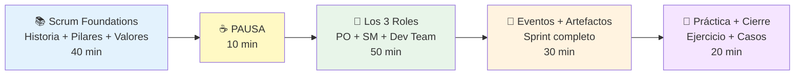

**Desglose temporal:**

- **Bloque 1 (40 min):** Historia de Scrum + Framework 3-5-3 + Pilares empirismo + 5 valores + Mitos vs realidades
- **Pausa (10 min):** Descanso
- **Bloque 2 (50 min):** Los 3 roles en profundidad con responsabilidades, accountabilities y anti-patrones de cada uno
- **Bloque 3 (30 min):** El Sprint como contenedor + los 5 eventos paso a paso + los 3 artefactos y su flujo
- **Bloque 4 (20 min):** Ejercicio práctico (mini-sprint simulado) + Casos reales + Top 5 errores comunes

---

### 🎓 Resultados de Aprendizaje Esperados

Al terminar esta clase, deberías poder:

- [ ] Dibujar el framework Scrum completo: 3 roles, 5 eventos, 3 artefactos (estructura 3-5-3)
- [ ] Explicar por qué Scrum se llama así (metáfora del rugby: todos avanzan juntos)
- [ ] Nombrar los 3 pilares: Transparencia, Inspección, Adaptación
- [ ] Recitar los 5 valores de Scrum: Commitment, Focus, Openness, Respect, Courage
- [ ] Describir la accountability del Product Owner: maximizar valor del producto
- [ ] Describir la accountability del Scrum Master: efectividad del proceso Scrum
- [ ] Describir la accountability del Development Team: entregar incremento potencialmente liberable
- [ ] Identificar 3 anti-patrones de PO (fantasma, proxy sin poder, committee-driven)
- [ ] Identificar 3 anti-patrones de SM (project manager, secretario, policía)
- [ ] Identificar 3 anti-patrones de Dev Team (no cross-functional, silos, muy grande 10+)
- [ ] Explicar el flujo de un sprint de 2 semanas: Planning → Dailies → Review → Retro
- [ ] Calcular timeboxes: Planning 4h, Daily 15min, Review 2h, Retro 1.5h (para sprint 2 semanas)
- [ ] Diferenciar Product Backlog vs Sprint Backlog vs Increment
- [ ] Participar en simulación de sprint: planning, daily, review, retrospective
- [ ] Listar los 5 errores que matan Scrum: PO ausente, SM como PM, sprints interrumpidos, no retros, sin DoD

---

### 🔗 Conexión con Otras Clases

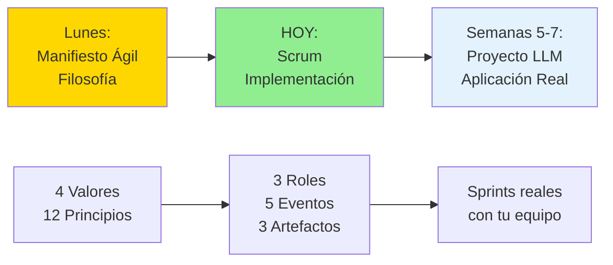

**¿Cómo se conecta esta clase?**

- **Clase anterior (Lunes):** Vimos el Manifiesto Ágil como **filosofía** (valores y principios abstractos)
- **Clase de HOY:** Scrum es la **implementación concreta** más popular del Manifiesto (66% de equipos ágiles)
- **Próximas semanas (5-7):** Aplicaremos Scrum REAL en proyecto de desarrollo de agentes LLM con sprints de 2 semanas

**La relación Manifiesto → Scrum:**

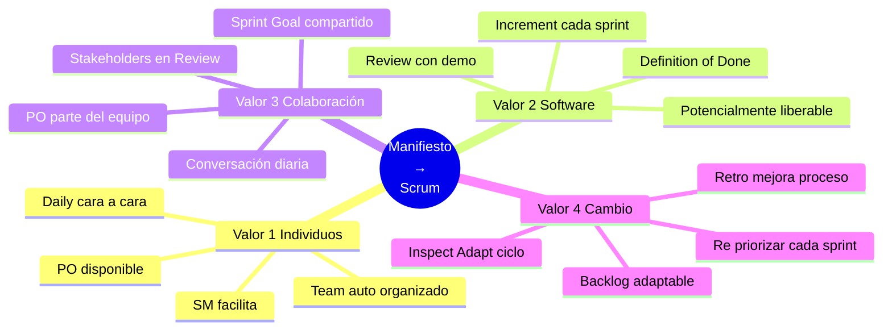

**Scrum implementa los valores ágiles:**

| Valor del Manifiesto            | Implementación en Scrum                                        |
| ------------------------------- | -------------------------------------------------------------- |
| **Individuos e Interacciones**  | Daily Standup cara a cara, equipos auto-organizados            |
| **Software Funcionando**        | Increment potencialmente liberable cada sprint                 |
| **Colaboración con el Cliente** | Product Owner integrado, stakeholders en Sprint Review         |
| **Responder al Cambio**         | Product Backlog re-priorizable, Retrospectives para adaptación |

---

### 🧠 Mindmap: Lo que Cubriremos Hoy

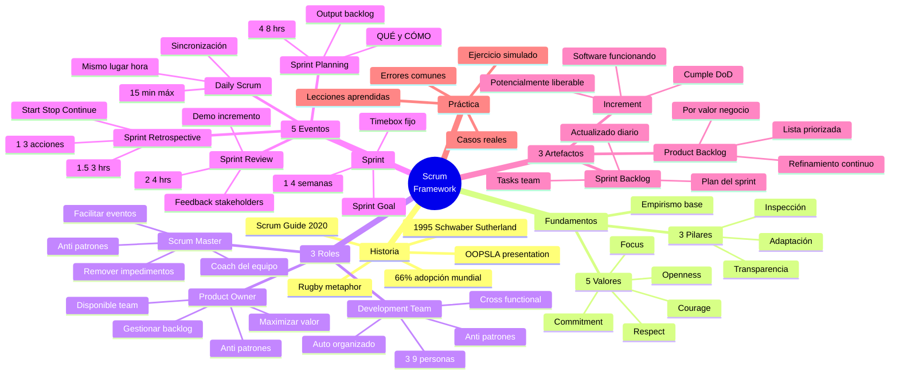

---

### 📊 La Estructura 3-5-3 de Scrum

**El framework completo visualizado:**

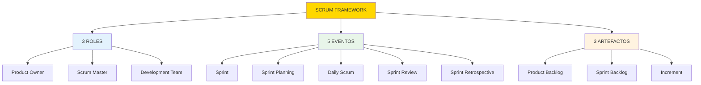

**Mnemotécnica para recordar:**

> **3-5-3**  
> **3** personas (roles)  
> **5** ceremonias (eventos)  
> **3** documentos (artefactos)

---

**Nota importante sobre esta clase:**

Esta clase es **práctica y aplicada**. Scrum NO es teoría abstracta, es un framework que se **experimenta haciendo**. Por eso:

- ✅ Veremos ejemplos concretos de cada concepto
- ✅ Identificaremos anti-patrones reales (cómo NO hacerlo)
- ✅ Simularemos un sprint completo en 15 minutos
- ✅ Analizaremos casos reales de empresas que usan Scrum

**La diferencia clave:**

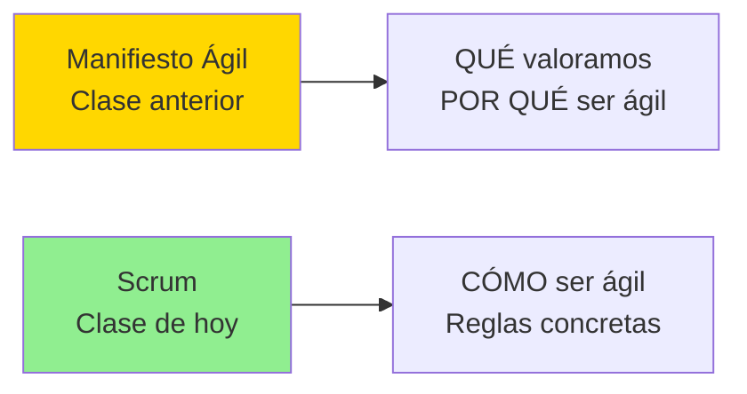

**La pregunta clave de hoy:**

> **"¿Cómo un framework tan simple (3-5-3) logra que equipos entreguen  
> 37% más rápido con 40% más calidad que métodos tradicionales?"**

**¿Listo para descubrir cómo funciona Scrum en la práctica?** 🚀

---

## 📚 BLOQUE 1: Scrum Foundations - Historia, Pilares y Valores

**Duración:** 40 minutos  
**Modalidad:** Expositiva con contexto histórico y fundamentos teóricos

### Objetivo del Bloque

Comprender el origen de Scrum, su evolución hasta hoy, entender los 3 pilares del empirismo que sostienen el framework, diferenciar los 5 valores de Scrum de los valores del Manifiesto Ágil, y desmentir los mitos más comunes sobre Scrum para tener una base sólida antes de profundizar en roles, eventos y artefactos.

---

### 1.1 Historia de Scrum: De 1995 a 2025 (8 min)

#### Los Orígenes: 1995

**Los creadores:**

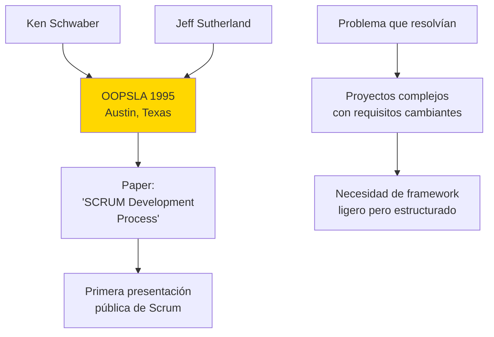

**El contexto histórico:**

```markdown
1995 - Situación de la industria:
→ Cascada dominaba (70% proyectos)
→ Crisis del software en pleno (solo 28% proyectos exitosos)
→ Internet emergente cambiando todo rápidamente
→ Necesidad de VELOCIDAD + ADAPTABILIDAD

Ken Schwaber: Trabajando en proyectos software complejos
Jeff Sutherland: VP Engineering en Easel Corporation

Inspiración: Paper "The New New Product Development Game"
(Takeuchi & Nonaka, Harvard Business Review, 1986)
→ Observación de equipos Toyota, Honda, Canon
→ Equipos cross-functional que trabajan como "scrum" de rugby
```

**¿Por qué "Scrum"?**

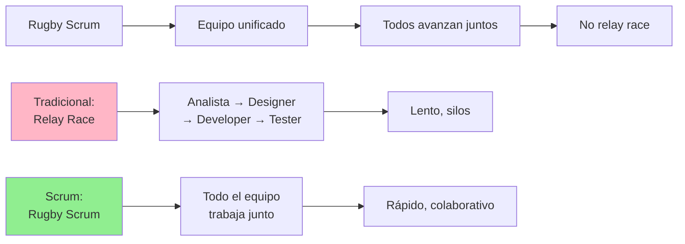

**Analogía:**

```markdown
❌ Relay Race (Cascada):
Corredor 1 (Analista) corre su parte → Pasa bastón
Corredor 2 (Designer) espera → Corre su parte → Pasa bastón
Corredor 3 (Developer) espera → Corre su parte → Pasa bastón
Corredor 4 (Tester) espera → Corre su parte
→ Si Corredor 2 se cae, todos esperan
→ Cada corredor solo ve su tramo

✅ Rugby Scrum (Scrum Framework):
TODO el equipo avanza la pelota JUNTOS
Si un jugador tiene la pelota, otros apoyan
Si hay obstáculo, equipo se re-organiza sobre la marcha
→ Todos ven el objetivo completo
→ Colaboración continua
```

---

#### Evolución del Scrum Guide

**Timeline de versiones:**

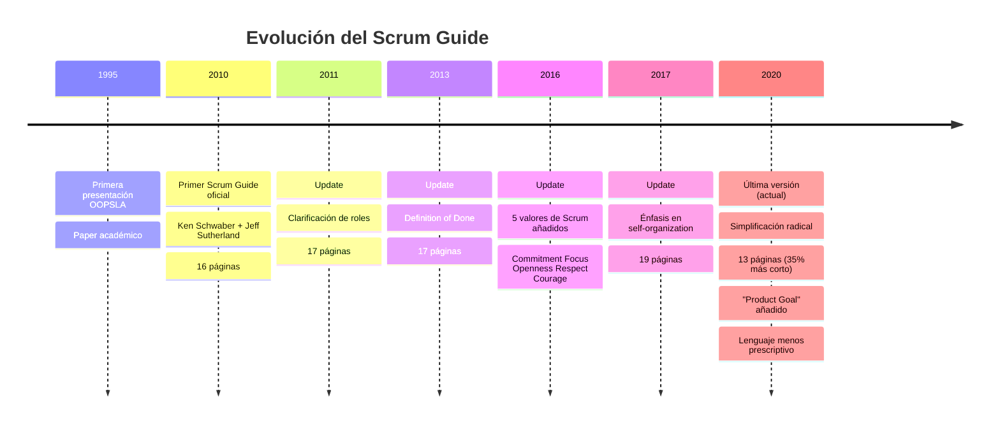

**Cambios clave en Scrum Guide 2020:**

```markdown
Los 3 cambios más importantes:

1. ✅ Simplificación del lenguaje
   Antes: "Development Team" (nombre específico)
   Ahora: "Developers" (más simple)
2. ✅ Introducción de "Product Goal"
   Nuevo: Objetivo de largo plazo en Product Backlog
   Clarifica hacia dónde va el producto
3. ✅ Menos prescriptivo
   Antes: Daily Scrum con 3 preguntas específicas
   Ahora: Equipo decide formato, solo 15 min max

   Filosofía: "Scrum es contenedor, equipo decide contenido"
```

**Scrum hoy (2025):**

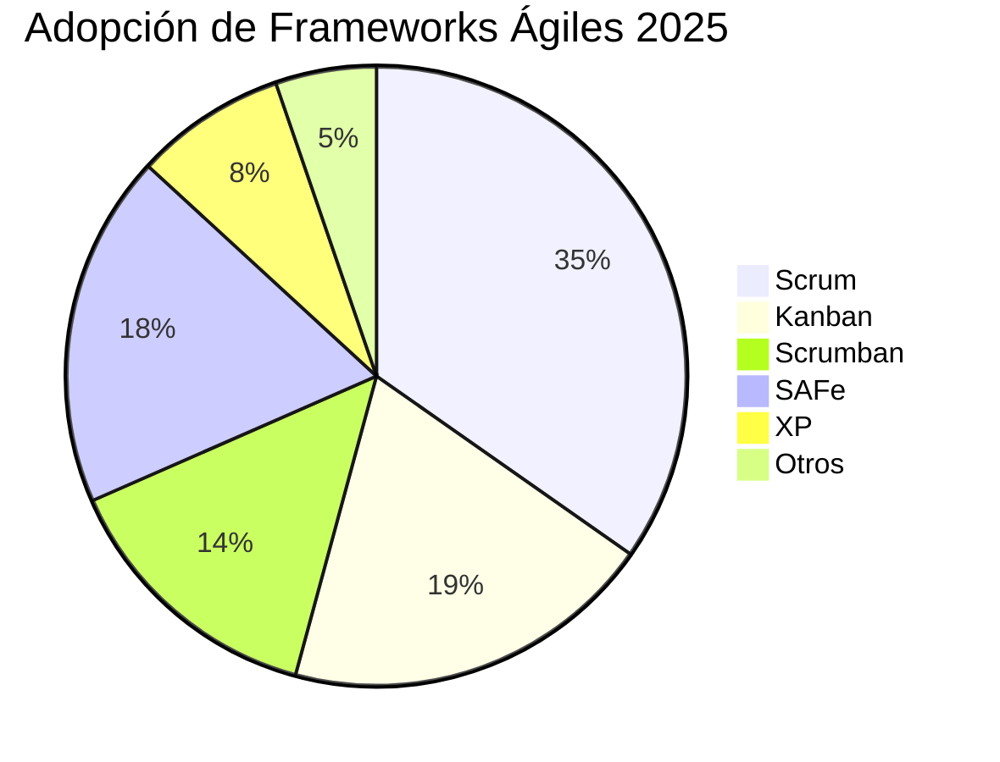

**Estadísticas actuales:**

```markdown
📊 Adopción global de Scrum (2025):

→ 66% equipos ágiles usan Scrum como framework principal
→ 87% en combinación con otras prácticas (Scrum + Kanban = Scrumban)
→ 12 millones+ profesionales certificados (CSM, PSM, etc.)
→ 94% de Fortune 500 usan Scrum en al menos un equipo

Industrias con mayor adopción:

1. Software/Tech: 85%
2. Finanzas: 72%
3. E-commerce: 68%
4. Telecomunicaciones: 65%
5. Healthcare: 52%

Tamaño de empresas:
→ Startups (< 50 personas): 78% usan Scrum
→ Empresas medianas (50-500): 65% usan Scrum
→ Grandes corporaciones (500+): 58% usan Scrum (o SAFe que contiene Scrum)
```

---

### 1.2 El Framework Scrum: La Estructura 3-5-3 (10 min)

#### Visualización Completa

**El framework en un diagrama:**

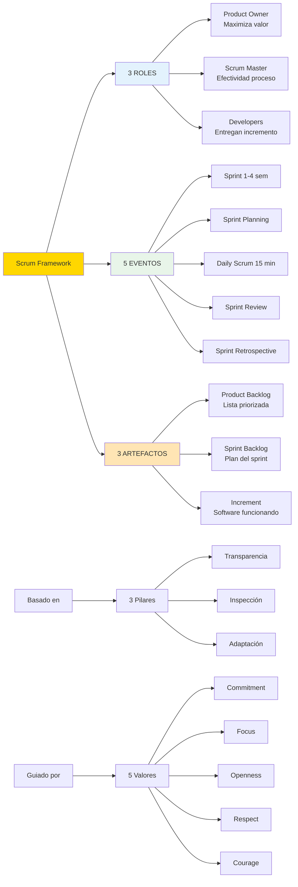

**La mnemotécnica 3-5-3:**

```markdown
Scrum es SIMPLE de recordar:

3 Roles = 3 dedos de la mano
👤 Product Owner
👤 Scrum Master
👥 Developers (3-9 personas)

5 Eventos = 5 dedos de la mano
🔄 Sprint (contenedor)
📋 Sprint Planning
⏰ Daily Scrum
🎬 Sprint Review
🔍 Sprint Retrospective

3 Artefactos = 3 columnas básicas
📑 Product Backlog
📝 Sprint Backlog
✅ Increment

Total: 3 + 5 + 3 = 11 elementos
(Scrum Guide 2020: solo 13 páginas para explicar todo)
```

---

#### Scrum vs Otros Frameworks

**Comparación rápida:**

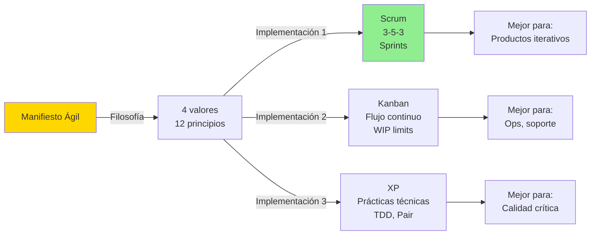

**Tabla comparativa:**

| Aspecto                   | Scrum                      | Kanban                | XP                        |
| ------------------------- | -------------------------- | --------------------- | ------------------------- |
| **Estructura**            | Sprints timeboxed          | Flujo continuo        | Iteraciones 1-2 semanas   |
| **Roles definidos**       | ✅ Sí (3 roles)            | ❌ No prescribe       | ✅ Sí (Coach, Pares)      |
| **Cambios mid-iteration** | ❌ No (scope protect)      | ✅ Sí, continuo       | ❌ No (entre iteraciones) |
| **Estimación**            | ✅ Planning Poker          | ⚠️ Opcional           | ✅ Story Points           |
| **Retrospectivas**        | ✅ Obligatorio cada sprint | ⚠️ Opcional           | ✅ Obligatorio            |
| **Énfasis**               | Proceso + Roles            | Flujo + Visualización | Prácticas técnicas        |
| **Prescriptividad**       | Media-Alta                 | Baja                  | Muy Alta                  |
| **Mejor para**            | Equipos de producto        | Equipos operacionales | Equipos técnicos maduros  |

---

#### ¿Cuándo usar Scrum?

**Checklist de decisión:**

```markdown
✅ USA SCRUM cuando:

□ Producto software con releases iterativas
□ Requisitos cambiantes o poco claros al inicio
□ Equipo co-localizado o remoto bien coordinado (3-9 personas)
□ Necesitas estructura clara pero flexible
□ Product Owner puede estar disponible
□ Time-to-market es importante
□ Entregas cada 1-4 semanas son viables
□ Organización tolera "fail fast" y experimentación

Ejemplos: Apps móviles, SaaS, productos web, startups

---

⚠️ CONSIDERA OTROS cuando:

□ Trabajo es principalmente mantenimiento/soporte → Kanban
□ Calidad técnica es MÁS crítica que velocidad → XP
□ Flujo continuo sin iteraciones es mejor → Kanban
□ Equipo muy grande (50+ personas) → SAFe o LeSS
□ Requisitos muy claros y estables → Cascada podría bastar

---

❌ NO USES SCRUM cuando:

□ Equipo < 3 personas (overhead de ceremonias no vale la pena)
□ Proyecto dura < 4 semanas (1 sprint no es suficiente)
□ Product Owner no puede estar disponible NUNCA
□ Organización castiga fallos (cultura no es ágil)
□ Hardware físico crítico (puentes, aviones) → Cascada/V-Model
```

---

### 1.3 Los 3 Pilares de Scrum: Empirismo (8 min)

#### El Fundamento: Control Empírico de Procesos

**¿Qué es empirismo?**

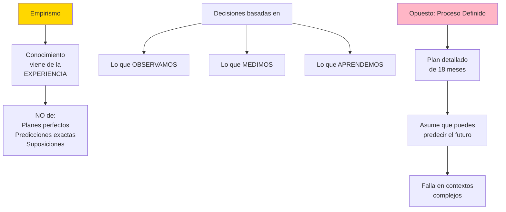

**La filosofía:**

```markdown
Scrum dice:

"El desarrollo de software es un proceso COMPLEJO,
no complicado pero predecible.

En ambientes complejos:
❌ NO puedes planear todo con 18 meses de anticipación
❌ NO puedes predecir exactamente qué necesitarás
✅ Debes INSPECCIONAR frecuentemente la realidad
✅ Debes ADAPTAR basado en lo que aprendes"

Esto se llama: CONTROL EMPÍRICO DE PROCESOS
```

---

#### Pilar 1: Transparencia

**Definición:**

> **"Los aspectos significativos del proceso deben ser visibles para aquellos responsables del resultado."**

**En la práctica:**

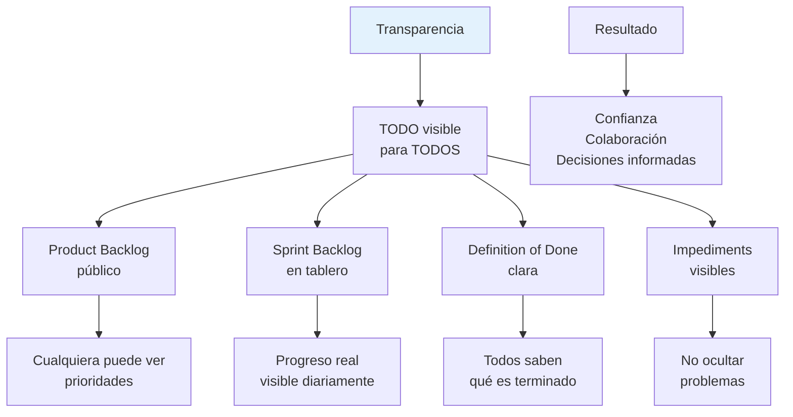

**Ejemplos concretos:**

```markdown
✅ Transparencia BIEN aplicada:

1. Tablero físico/digital visible:
   → To Do | In Progress | Done
   → Todos ven quién hace qué
   → Bloqueos visibles con post-it rojo

2. Velocity público:
   → Sprint 1: 23 puntos
   → Sprint 2: 21 puntos
   → Sprint 3: 25 puntos
   → Todos saben capacidad real del equipo

3. Definition of Done en la pared:
   ✓ Código escrito
   ✓ Tests unitarios pasando
   ✓ Code review aprobado
   ✓ Deployed a staging
   ✓ QA verificado
   → Todos saben cuándo algo está "Done"

4. Impediments públicos:
   → "Esperando aprobación de DB schema (5 días bloqueados)"
   → Visible para todos, SM puede actuar

---

❌ Falta de Transparencia:

1. Product Backlog secreto:
   → Solo PO sabe qué viene
   → Equipo no puede prepararse
   → Sorpresas constantes

2. "Sprint va bien" (mentira):
   → Burndown chart manipulado
   → Problemas ocultos hasta Review
   → Explosión al final del sprint

3. Definition of Done ambigua:
   → "Terminado" = ¿código escrito? ¿testeado? ¿deployed?
   → Cada persona interpreta diferente
   → Confusión y re-trabajo
```

**Herramientas de transparencia:**

```markdown
Físicas:
→ Tablero Kanban en pared
→ Burndown chart impreso
→ Definition of Done poster

Digitales:
→ Jira / Azure DevOps / Trello
→ Confluence para documentación
→ Slack para comunicación
→ GitHub Projects para tasks

Clave: No importa la herramienta, importa que TODO EL EQUIPO vea la misma realidad
```

---

#### Pilar 2: Inspección

**Definición:**

> **"Los usuarios de Scrum deben inspeccionar frecuentemente los artefactos de Scrum y el progreso hacia un objetivo para detectar variaciones indeseables."**

**En la práctica:**

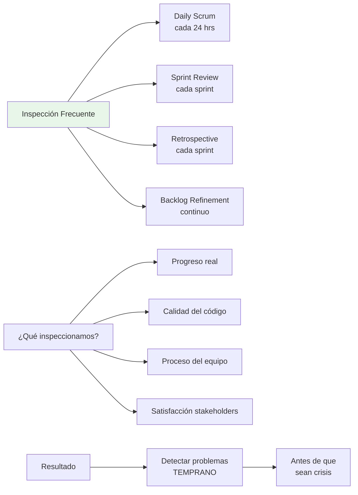

**Frecuencia de inspección:**

```markdown
Diaria (Daily Scrum):
□ ¿Progresamos hacia Sprint Goal?
□ ¿Hay impedimentos nuevos?
□ ¿Necesitamos re-planear hoy?

Cada Sprint (Review + Retro):
□ ¿Incremento cumple Definition of Done?
□ ¿Stakeholders satisfechos?
□ ¿Proceso funcionó bien?
□ ¿Qué mejorar next sprint?

Continua (durante el trabajo):
□ Tests automáticos cada commit
□ Code review antes de merge
□ Pair programming = inspección continua
```

**Ejemplos concretos:**

```markdown
✅ Inspección efectiva:

Día 3 del sprint (Daily Scrum):
Developer: "La API de pagos que asumimos tarda 3 segundos, no 300ms"
Team: "Eso rompe nuestro Sprint Goal de performance"
Action: Re-planear inmediatamente, escalar a PO

Sprint Review:
Stakeholder: "La UI funciona, pero no es intuitiva para usuarios senior"
Team: "Agregar user story para next sprint: mejorar accesibilidad"

Retrospective:
Team: "Code reviews están tomando 2 días"
Action: "Implementar WIP limit: 1 PR en review por persona máximo"

---

❌ Falta de inspección:

Día 10 del sprint:
Team: "Todo bien" (mentira piadosa)
Realidad: 70% del trabajo aún sin terminar
Resultado: Sprint falla, sorpresa en Review

Sprint Review cada 3 meses:
→ Feedback llega demasiado tarde
→ 3 meses de trabajo potencialmente desperdiciado

Sin retrospectivas:
→ Mismos errores se repiten
→ Proceso no mejora nunca
```

---

#### Pilar 3: Adaptación

**Definición:**

> **"Si un inspector determina que uno o más aspectos de un proceso se desvían fuera de los límites aceptables, el proceso o el material procesado debe ajustarse."**

**En la práctica:**

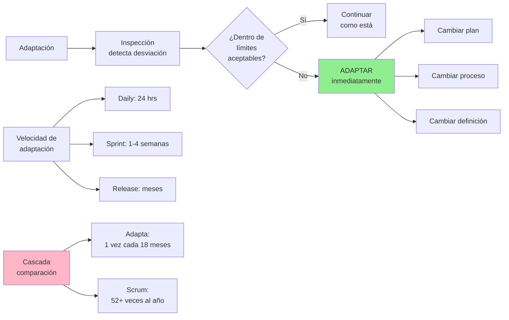

**Ejemplos de adaptación:**

```markdown
✅ Adaptación rápida:

Durante Daily Scrum (día 5 de 10):
Inspección: "Velocidad es 50% de lo esperado"
Adaptación: "Renegociar Sprint Goal con PO HOY"

Durante Sprint Review:
Inspección: "Feature X no es lo que usuarios necesitan"
Adaptación: "Eliminar feature X del backlog, agregar feature Y para next sprint"

Durante Retrospective:
Inspección: "Reuniones interrumpen flow, tenemos solo 2 hrs de código real/día"
Adaptación: "No-meeting Tuesdays & Thursdays implementado next sprint"

Mid-Sprint (emergencia real):
Inspección: "Competencia lanzó feature crítica"
Adaptación: "Cancelar sprint actual, re-planear con nueva prioridad"

---

❌ Falta de adaptación:

Detectan problema en día 2:
→ "Sigamos según plan, resolveremos al final"
→ Resultado: Sprint falla completamente

Sprint Review revela problema:
→ "Ya invertimos 2 semanas, sigamos con esto"
→ Sunk cost fallacy
→ Resultado: 2 semanas más desperdiciadas

Retrospective identifica mejora:
→ "Sí, buena idea, lo haremos... algún día"
→ Acción nunca se implementa
→ Resultado: Mismos problemas eternamente
```

---

#### El Ciclo Empírico de Scrum

**Visualización del ciclo completo:**

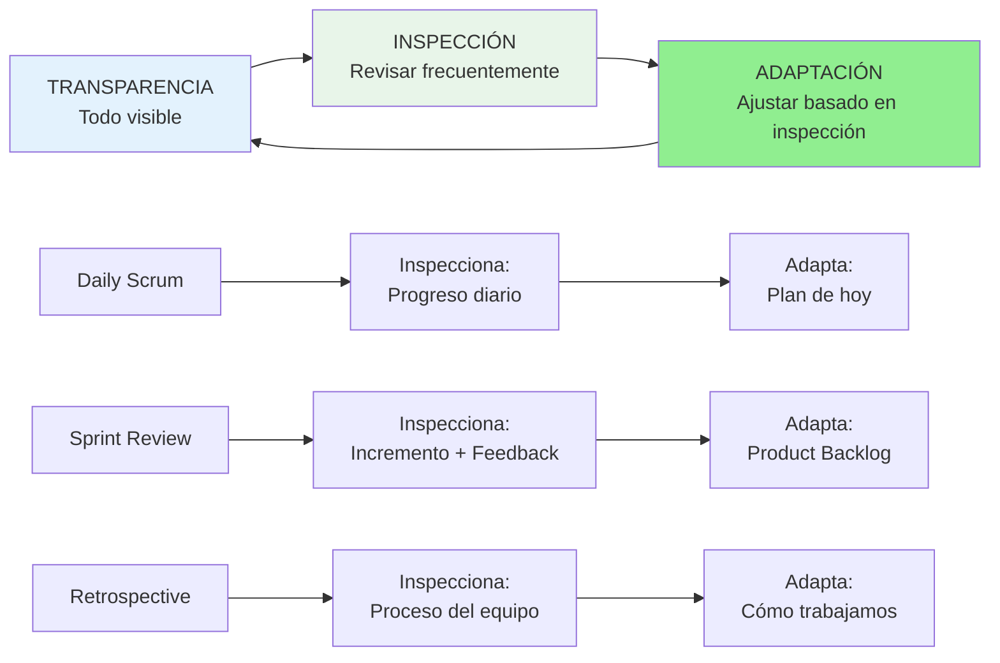

**El poder del ciclo:**

```markdown
Por qué Scrum funciona (cuando se aplica bien):

Ciclo rápido de feedback:
→ Inspeccionas cada 24 hrs (Daily)
→ Adaptas inmediatamente
→ 260+ oportunidades al año de corregir rumbo

Vs Cascada:
→ Inspecciona 1 vez al final (mes 18)
→ Si algo está mal, ya es muy tarde
→ 1 oportunidad de corrección (demasiado tarde)

Matemática simple:
Scrum: 52 Sprints/año × 5 inspecciones/sprint = 260 puntos de adaptación
Cascada: 1 entrega/año = 1 punto de adaptación

¿Cuál tiene más probabilidad de acertar? 🎯
```

---

### 1.4 Los 5 Valores de Scrum (8 min)

#### Diferencia: Valores del Manifiesto vs Valores de Scrum

**Aclaración importante:**

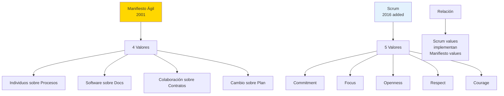

**Importante:**

```markdown
❌ Error común:
"Scrum tiene 4 valores del Manifiesto Ágil"

✅ Realidad:

- Manifiesto Ágil: 4 valores (toda la filosofía ágil)
- Scrum: 5 valores propios (añadidos en Scrum Guide 2016)

Los 5 valores de Scrum SON consistentes con el Manifiesto,
pero son ADICIONALES y específicos al framework Scrum.
```

---

#### Los 5 Valores Explicados

**Mnemotécnica: C-F-O-R-C (Como "force" en inglés)**

```markdown
C - Commitment
F - Focus
O - Openness
R - Respect
C - Courage
```

---

**Valor 1: Commitment (Compromiso)**

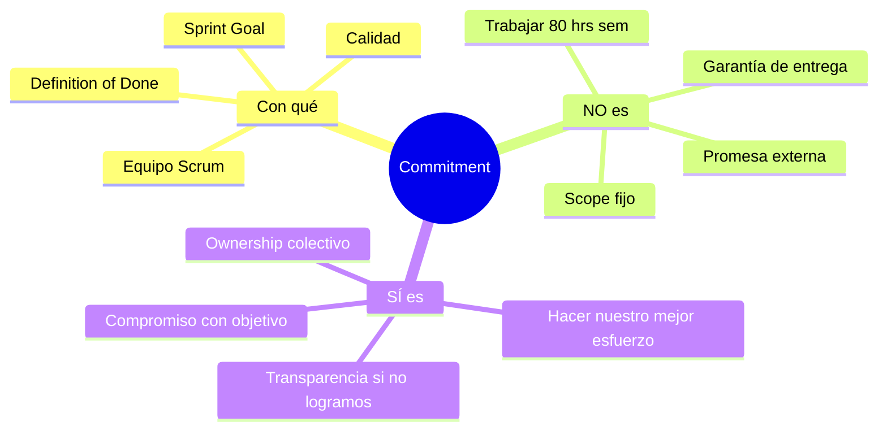

**Explicación:**

```markdown
Commitment = Compromiso con el Sprint Goal y calidad

✅ Qué SÍ significa:
→ "Haremos TODO lo posible para lograr el Sprint Goal"
→ "Estamos comprometidos con Definition of Done"
→ "Si descubrimos que no llegaremos, lo diremos TEMPRANO"
→ "Ownership colectivo: el equipo gana o pierde junto"

❌ Qué NO significa:
→ "Garantizamos entregar las 15 stories seleccionadas"
→ "Trabajaremos 80 horas/semana para cumplir"
→ "No podemos cambiar nada mid-sprint"
→ "Estamos comprometidos con fechas externas inmovibles"

Ejemplo práctico:
Día 5 del sprint: "Estimamos mal, no llegaremos a todo"
✅ Con Commitment: "Escalamos a PO, renegociamos Sprint Goal HOY"
❌ Sin Commitment: "Seguimos en silencio, sorpresa en Review"
```

---

**Valor 2: Focus (Enfoque)**

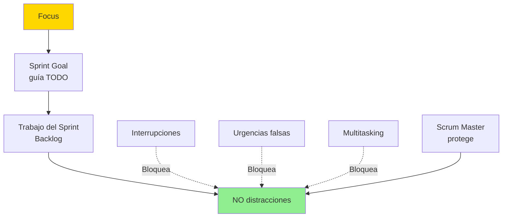

**Explicación:**

```markdown
Focus = Enfoque en el Sprint Goal, minimizar work-in-progress

✅ Qué SÍ significa:
→ "Durante el sprint, enfocamos SOLO en Sprint Goal"
→ "WIP limit: cada persona trabaja en 1-2 tareas máximo"
→ "No empezamos nueva tarea hasta terminar la actual"
→ "Interrupciones externas son bloqueadas por Scrum Master"

❌ Qué NO significa:
→ "No podemos ayudar a otros equipos NUNCA"
→ "Bugs críticos de producción esperan hasta next sprint"
→ "No podemos aprender o mejorar skills durante sprint"

Ejemplo práctico:
CEO: "Necesito un reporte de métricas para mañana"
✅ Con Focus: SM: "Tenemos Sprint Goal, ¿puede esperar hasta Review?"
❌ Sin Focus: Developer interrumpido 4 horas, Sprint Goal en riesgo
```

---

**Valor 3: Openness (Apertura)**

```mermaid
graph LR
    A[Openness] --> B[Transparencia<br/>radical]

    B --> C[Compartir problemas<br/>temprano]
    B --> D[Feedback honesto]
    B --> E[Admitir errores]

    F[Cultura de<br/>confianza] --> G[Safe to fail]
    G --> H[Aprendizaje<br/>rápido]

    style A fill:#E8F5E9
```

**Explicación:**

```markdown
Openness = Apertura para compartir desafíos, feedback, aprender

✅ Qué SÍ significa:
→ "Si no sé cómo hacer algo, lo digo inmediatamente"
→ "Feedback constructivo es bienvenido y valorado"
→ "Admitir 'metí la pata' es visto como honestidad, no debilidad"
→ "Retrospectivas son espacio seguro para hablar con franqueza"

❌ Qué NO significa:
→ "Decir TODO lo que pienso sin filtro"
→ "Críticas destructivas son aceptables"
→ "No hay confidencialidad en retrospectivas"

Ejemplo práctico:
Developer: "Subestimé esta tarea, necesitaré 3 días más"
✅ Con Openness: Team: "Gracias por decirlo temprano, re-planeemos"
❌ Sin Openness: Developer oculta problema, explota en Review
```

---

**Valor 4: Respect (Respeto)**

```mermaid
mindmap
  root((Respect))
    Respetar a
      Miembros del equipo
      Stakeholders
      Proceso de Scrum
      Capacidad del equipo
      Timeboxes
    Manifestaciones
      Escuchar activamente
      No interrumpir
      Valorar opiniones
      Cumplir compromisos
      No micro-management
```

**Explicación:**

```markdown
Respect = Respeto mutuo entre personas, roles y proceso

✅ Qué SÍ significa:
→ "Valoramos la opinión de cada miembro del equipo"
→ "Respetamos expertise de cada rol (PO, SM, Developers)"
→ "Timeboxes se respetan (Daily = 15 min, no 45 min)"
→ "Respetamos capacidad del equipo (no sobrecargamos)"
→ "No micro-management: confiamos en auto-organización"

❌ Qué NO significa:
→ "Nunca podemos estar en desacuerdo"
→ "No podemos cuestionar decisiones del PO"
→ "Respeto = evitar conflictos a toda costa"

Ejemplo práctico:
PO: "Necesito 20 stories este sprint"
✅ Con Respect: Team: "Nuestra velocity es 15, es irreal. ¿Priorizamos?"
❌ Sin Respect: Team acepta silenciosamente, sprint falla, resentimiento
```

---

**Valor 5: Courage (Coraje)**

```mermaid
graph TB
    A[Courage] --> B[Decir verdades<br/>incómodas]
    A --> C[Experimentar<br/>y fallar]
    A --> D[Cambiar<br/>lo que no funciona]
    A --> E[Defender<br/>Sprint Goal]

    F[Requiere] --> G[Psychological<br/>Safety]
    G --> H[Cultura que<br/>tolera fallos]

    style A fill:#FFD700
```

**Explicación:**

```markdown
Courage = Coraje para hacer lo correcto, aunque sea difícil

✅ Qué SÍ significa:
→ "Coraje para decir 'esto no va a funcionar' al CEO"
→ "Coraje para experimentar features que podrían fallar"
→ "Coraje para cancelar sprint si Sprint Goal es inalcanzable"
→ "Coraje para cambiar proceso en retrospective"
→ "Coraje para pushback cuando se violan valores de Scrum"

❌ Qué NO significa:
→ "Ser agresivo o confrontacional"
→ "Ignorar autoridad sin razón"
→ "Tomar riesgos irresponsables"

Ejemplo práctico:
Sprint Review: PO pide feature adicional urgente mid-sprint
✅ Con Courage: SM: "Viola scope protect. Si es crítico, cancelamos sprint y re-planeamos"
❌ Sin Courage: Team acepta, trabaja 60 hrs, burnout, calidad baja
```

---

#### Interrelación de los 5 Valores

**Cómo se refuerzan mutuamente:**

```mermaid
graph LR
    A[Commitment] --> B[Compromiso con<br/>Sprint Goal]
    B --> C[Requiere Focus]

    C --> D[Focus en objetivo]
    D --> E[Requiere Openness]

    E --> F[Openness para<br/>compartir problemas]
    F --> G[Requiere Respect]

    G --> H[Respect mutuo]
    H --> I[Permite Courage]

    I --> J[Courage para<br/>hacer lo correcto]
    J --> A

    style A fill:#E3F2FD
    style C fill:#E8F5E9
    style E fill:#FFF9C4
    style G fill:#FFE5B4
    style I fill:#FFD700
```

**Ejemplo integrado:**

```markdown
Situación: Día 7 de sprint de 10 días

Developer descubre bug crítico en arquitectura:
"Si seguimos, edificaremos sobre base débil"

🎯 Commitment: "Estoy comprometido con calidad, no solo velocidad"
🔍 Focus: "Esto afecta Sprint Goal, debemos abordarlo"
💬 Openness: "Lo comparto con el equipo inmediatamente en Daily"
🤝 Respect: "Respeto criterio técnico del team, escuchamos propuestas"
💪 Courage: "Tenemos coraje para decir a PO: 'Necesitamos 2 días para refactor'"

Resultado: 2 días invertidos en arquitectura sólida
→ Sprint Goal ajustado pero logrado
→ Producto con base sólida para futuro
→ Valores de Scrum en acción
```

---

### 1.5 Mitos y Realidades sobre Scrum (6 min)

#### Los 10 Mitos Más Comunes

**Mito #1: "Scrum = Sin Documentación"**

```markdown
❌ MITO:
"Somos ágiles, no documentamos nada"

✅ REALIDAD:
Scrum NO dice "sin documentación"
Scrum dice: "Software funcionando sobre documentación EXTENSIVA"

Documentación útil en Scrum:
→ Product Backlog (lista priorizada)
→ Sprint Backlog (plan del sprint)
→ Definition of Done (checklist de calidad)
→ README del proyecto
→ Arquitectura high-level (diagramas C4)
→ ADRs (Architecture Decision Records)
→ API documentation (Swagger, OpenAPI)

Lo que NO hacemos:
→ Documentos de requisitos de 300 páginas
→ Diagramas UML de 150 páginas
→ Documentación que nadie lee
```

---

**Mito #2: "Scrum = Sin Planificación"**

```markdown
❌ MITO:
"Ágil significa decidir qué hacer cada día, sin plan"

✅ REALIDAD:
Scrum planifica CONSTANTEMENTE, solo que en horizontes cortos:

Niveles de planificación:
→ Product Backlog: 3-6 meses (alto nivel)
→ Release Planning: 2-3 sprints (features próximas)
→ Sprint Planning: 2 semanas (detallado)
→ Daily Scrum: 24 horas (micro-ajustes)

La diferencia vs Cascada:
Cascada: Plan detallado de 18 meses (nunca se cumple)
Scrum: Plan detallado de 2 semanas (se cumple 80% del tiempo)

"Falla en planear = Plan para fallar" aplica en Scrum también
```

---

**Mito #3: "Daily = Reporte de Status al Manager"**

```markdown
❌ MITO:
"Daily Standup es para reportar al Scrum Master qué hice ayer"

✅ REALIDAD:
Daily Scrum es SINCRONIZACIÓN del equipo, NO reporte vertical

Propósito real:
→ Team se coordina entre sí
→ Identifican impedimentos
→ Ajustan plan del día si es necesario

Scrum Master:
→ NO recibe reporte
→ Facilita la reunión
→ Escucha por impedimentos

Si Daily se siente como "reportar al jefe" → Estás haciendo mal Scrum
```

---

**Mito #4: "Scrum Master = Project Manager"**

```markdown
❌ MITO:
"Scrum Master asigna tareas y controla deadlines"

✅ REALIDAD:
Scrum Master facilita, NO administra

PM tradicional:
→ Asigna tareas
→ Controla tiempos
→ Reporta a management
→ Hace planning

Scrum Master:
→ Team auto-organiza tareas
→ Facilita eventos (no dicta)
→ Remueve impedimentos
→ Coach en Scrum

Si SM está asignando tareas → NO es Scrum, es Waterfall con standups
```

---

**Mito #5: "Scrum = Sin Roles Especializados"**

```markdown
❌ MITO:
"En Scrum todos hacen de todo, no hay especialistas"

✅ REALIDAD:
Team es cross-functional, NO significa todos idénticos

Cross-functional:
→ Team COMO CONJUNTO tiene todas las skills
→ María puede ser experta en Frontend
→ Juan puede ser experto en Backend
→ Ana puede ser experta en QA
→ Juntos cubren todo lo necesario

T-shaped skills:
→ Profundidad en 1-2 áreas (expertise)
→ Amplitud en varias áreas (puede ayudar)

Ejemplo:
María (Frontend expert) puede hacer backend si Juan está bloqueado,
pero no es tan eficiente como Juan en backend
```

---

**Mito #6: "Scrum = No puedes cambiar nada mid-sprint"**

```markdown
❌ MITO:
"Sprint Backlog es inmutable, no se puede cambiar"

✅ REALIDAD:
Sprint Goal es protegido, pero cómo lo logras es flexible

Regla de Scrum:
→ Sprint Goal NO cambia mid-sprint (salvo emergencia real)
→ Scope (qué stories) PUEDE cambiar si team y PO acuerdan
→ Cómo implementar (tasks, enfoque) puede cambiar diariamente

Emergencias reales:
→ Bug crítico de producción
→ Cambio legal/regulatorio urgente
→ Competencia lanza feature que cambia mercado

En estos casos: PO puede cancelar sprint y re-planear
(Raro, <5% de sprints)
```

---

**Mito #7: "Scrum = Solo para desarrollo de software"**

```markdown
❌ MITO:
"Scrum es metodología de programación"

✅ REALIDAD:
Scrum se usa en muchas industrias más allá de software

Industrias usando Scrum:
→ Marketing (campañas iterativas)
→ HR (procesos de reclutamiento)
→ Educación (desarrollo de cursos)
→ Construcción (proyectos complejos)
→ Legal (gestión de casos)
→ Investigación científica

Requisito: Trabajo complejo con incertidumbre
No aplica: Trabajo repetitivo y predecible (mejor Kanban)
```

---

**Mito #8: "Scrum = Siempre 2 semanas de sprint"**

```markdown
❌ MITO:
"Sprint debe ser exactamente 2 semanas"

✅ REALIDAD:
Sprint puede ser 1-4 semanas (Scrum Guide 2020)

Factores para decidir duración:
→ 1 semana: Startups, alta incertidumbre, feedback MUY frecuente
→ 2 semanas: Más común (66% equipos), balance feedback/overhead
→ 3 semanas: Equipos maduros, trabajo más predecible
→ 4 semanas: Proyectos complejos, releases menos frecuentes

Regla: Consistencia > Duración exacta
Mantén misma duración sprint tras sprint (no alternar 1 sem / 3 sem)
```

---

**Mito #9: "Scrum = No necesitas arquitectura"**

```markdown
❌ MITO:
"En Scrum el diseño emerge, no necesitas arquitectura upfront"

✅ REALIDAD:
Arquitectura high-level SÍ es necesaria, detalles emergen

Sprint 0 (opcional):
→ Arquitectura base (1-2 sprints)
→ Setup de CI/CD
→ Tech stack decisions
→ Definir interfaces principales

Durante sprints:
→ Detalles de implementación emergen
→ Refactoring continuo
→ Arquitectura evoluciona

Emergent design ≠ No design
Significa: Diseño evoluciona con aprendizaje, no todo upfront
```

---

**Mito #10: "Scrum = Más rápido siempre"**

```markdown
❌ MITO:
"Scrum hace que equipos trabajen más rápido automáticamente"

✅ REALIDAD:
Scrum hace visible el trabajo y elimina desperdicio
Velocidad mejora con tiempo, no instantáneamente

Realidad de adopción:
Sprint 1-3: Velocity BAJA (aprendiendo Scrum, overhead)
Sprint 4-6: Velocity sube (equipo se sincroniza)
Sprint 7-12: Velocity se estabiliza (ritmo sostenible)
Sprint 13+: Velocity puede SUPERAR métodos tradicionales

Promesa de Scrum:
→ NO "entregar más rápido mágicamente"
→ SÍ "entregar valor frecuentemente con calidad sostenible"
→ SÍ "eliminar desperdicio y re-trabajo"

Resultado neto: 37% faster time-to-market en promedio
Pero lleva 6-12 meses llegar ahí
```

---

### 📊 Resumen del Bloque 1

**Lo que aprendimos:**

```mermaid
mindmap
  root((Bloque 1:<br/>Foundations))
    Historia
      1995 Schwaber Sutherland
      OOPSLA conference
      Rugby scrum metaphor
      Scrum Guide 2010-2020
      66% adopción mundial
    Framework 3-5-3
      3 Roles
      5 Eventos
      3 Artefactos
      Simple de recordar
    3 Pilares
      Transparencia
      Inspección
      Adaptación
      Empirismo
    5 Valores
      Commitment
      Focus
      Openness
      Respect
      Courage
    Mitos
      NO sin documentación
      NO sin planificación
      NO Daily = reporte
      NO SM = PM
      NO siempre 2 semanas
```

**Conceptos clave:**

1. ✅ **Scrum** = Framework para productos complejos con incertidumbre
2. ✅ **3-5-3** = Fácil de recordar estructura completa
3. ✅ **Empirismo** = Conocimiento de experiencia, no predicción
4. ✅ **Transparencia** = Todo visible para todos
5. ✅ **Inspección** = Revisar frecuentemente (Daily, Review, Retro)
6. ✅ **Adaptación** = Ajustar basado en inspección (260+ veces/año)
7. ✅ **5 Valores** = C-F-O-R-C (Commitment, Focus, Openness, Respect, Courage)
8. ✅ **Mitos desmentidos** = Scrum SÍ requiere documentación/planificación útil
9. ✅ **Adopción 2025** = 66% equipos ágiles, 12M+ certificados
10. ✅ **Cuándo usar** = Productos iterativos con requisitos cambiantes

**Frase para recordar:**

> **"Scrum es simple de entender, difícil de dominar.  
> 3-5-3 es la estructura, empirismo es el fundamento,  
> 5 valores son el corazón. Sin valores, solo tienes ceremonias vacías."**

---

## ☕ PAUSA (10 minutos)

---

## 👥 BLOQUE 2: Los 3 Roles de Scrum + Product Backlog Práctico

**Duración:** 50 minutos  
**Modalidad:** Expositiva + práctica con ejemplos aplicables al proyecto

### Objetivo del Bloque

Comprender las responsabilidades y accountabilities de los 3 roles de Scrum (Product Owner, Scrum Master, Developers), identificar los anti-patrones más comunes que hacen fracasar cada rol, y aprender a crear y gestionar un Product Backlog efectivo mediante User Stories bien escritas, Acceptance Criteria claros, técnicas de priorización y refinamiento continuo.

---

## Parte 1: Los 3 Roles de Scrum (20 min)

### Visualización de Roles y Accountabilities

```mermaid
graph TB
    A[Scrum Team] --> B[Product Owner<br/>1 persona]
    A --> C[Scrum Master<br/>1 persona]
    A --> D[Developers<br/>3-9 personas]

    B --> B1[Accountability:<br/>MAXIMIZAR VALOR]
    B1 --> B2[Gestiona Product Backlog]
    B2 --> B3[Prioriza por ROI]
    B3 --> B4[Define QUÉ construir]

    C --> C1[Accountability:<br/>EFECTIVIDAD SCRUM]
    C1 --> C2[Facilita eventos]
    C2 --> C3[Remueve impedimentos]
    C3 --> C4[Coach del equipo]

    D --> D1[Accountability:<br/>ENTREGAR INCREMENT]
    D1 --> D2[Auto-organizados]
    D2 --> D3[Cross-functional]
    D3 --> D4[Define CÓMO construir]

    style B fill:#E3F2FD
    style C fill:#E8F5E9
    style D fill:#FFF9C4
```

**Concepto clave:**

```markdown
En Scrum hay UN SOLO EQUIPO (Scrum Team) con 3 tipos de miembros:

→ Product Owner (1): Decide QUÉ construir
→ Scrum Master (1): Facilita CÓMO trabajar
→ Developers (3-9): CONSTRUYEN el producto

Total: 5-11 personas (ideal: 7±2)

NO hay jerarquía: Los 3 roles son PARES
Todos son responsables del éxito del producto
```

---

### Rol 1: Product Owner - Maximizar Valor (8 min)

#### Responsabilidades Core

```mermaid
mindmap
  root((Product Owner))
    Gestionar Product Backlog
      Crear items
      Priorizar por valor
      Refinar continuamente
      Transparente y visible
    Definir visión
      Product Goal
      Roadmap alto nivel
      Comunicar a stakeholders
    Maximizar ROI
      Features de alto valor primero
      Eliminar desperdicio
      Validar con usuarios
    Estar disponible
      Responder dudas del team
      Participar en eventos
      Decisiones rápidas
```

**El PO en acción:**

```markdown
Un buen Product Owner:

✅ Prioriza Product Backlog semanalmente basado en:
→ Valor de negocio (ROI)
→ Feedback de usuarios
→ Dependencias técnicas
→ Riesgos

✅ Dice NO frecuentemente:
"Esta feature tiene bajo valor, no entra en próximos 3 sprints"

✅ Está disponible para el equipo:
→ Responde preguntas en <24 hrs
→ Participa en Refinement
→ Clarifica Acceptance Criteria

✅ Valida con usuarios reales:
→ User interviews
→ A/B testing
→ Analytics

✅ Crea Product Goal claro:
"En 6 meses, 10,000 usuarios usen la app diariamente"
```

---

#### Anti-Patrón #1: Product Owner Fantasma

```mermaid
graph LR
    A[PO Fantasma] --> B[No disponible]
    B --> C[Team bloqueado<br/>con dudas]

    A --> D[No prioriza<br/>backlog]
    D --> E[Team no sabe<br/>qué es importante]

    A --> F[No participa<br/>en Review]
    F --> G[Sin feedback<br/>de stakeholders]

    H[Resultado] --> I[Sprint sin<br/>Sprint Goal claro]
    H --> J[Features de<br/>bajo valor]
    H --> K[Team desmotivado]

    style A fill:#FFB6C6
    style H fill:#FF6B6B
```

**Síntomas y soluciones:**

```markdown
❌ Síntomas de PO Fantasma:

→ No asiste a Daily Scrum nunca
→ Responde emails después de 3 días
→ Backlog sin priorizar (todo "high priority")
→ No participa en Refinement
→ No trae stakeholders a Sprint Review
→ Team pregunta "¿Esto es importante?" y nadie responde

Impacto: Team trabaja en features equivocadas, desperdicio masivo

---

✅ Solución:

→ PO debe comprometer 20-40 hrs/semana al equipo
→ Si no puede: designar PO Proxy con autoridad real
→ Timebox para respuestas: 24 hrs máximo
→ PO participa en Planning, Review (obligatorio)
→ PO disponible en Daily si team necesita (opcional pero recomendado)

Regla de oro: "Sin PO disponible = Sin Scrum"
```

---

#### Anti-Patrón #2: PO Committee (Comité)

```markdown
❌ Problema:

"Product Owner" es en realidad 5 stakeholders con opiniones diferentes:
→ VP Marketing quiere Feature A
→ VP Sales quiere Feature B
→ CEO quiere Feature C
→ CTO quiere refactoring técnico
→ Support quiere bug fixes

Team recibe prioridades contradictorias cada semana

---

✅ Solución:

Scrum requiere UN SOLO Product Owner con autoridad:
→ Esa persona PUEDE consultar a stakeholders
→ Pero decisión final es del PO únicamente
→ Stakeholders dan input, PO decide output

Si organización no puede dar autoridad a 1 persona:
→ NO estás listo para Scrum
→ Considera framework diferente
```

---

#### Checklist: ¿Tenemos un buen PO?

```markdown
□ PO tiene autoridad real para priorizar
□ PO disponible al menos 50% del tiempo para el team
□ Product Backlog está priorizado y actualizado
□ PO responde dudas en <24 hrs
□ PO participa en Planning, Review, Refinement
□ PO trae stakeholders a Sprint Review
□ PO valida features con usuarios reales
□ PO puede decir "NO" a features de bajo valor
□ Team entiende claramente el Product Goal
□ PO comunica visión del producto regularmente

Si marcaste <7 de 10: Tienes problemas con el rol de PO
```

---

### Rol 2: Scrum Master - Efectividad del Proceso (6 min)

#### Responsabilidades Core

```mermaid
graph LR
    A[Scrum Master] --> B[Facilitar Eventos]
    B --> B1[Planning productivo]
    B --> B2[Daily eficiente 15 min]
    B --> B3[Review con valor]
    B --> B4[Retro con acciones]

    A --> C[Remover Impedimentos]
    C --> C1[Identificar blockers]
    C --> C2[Escalar a management]
    C --> C3[Resolver o delegar]

    A --> D[Coach de Scrum]
    D --> D1[Enseñar framework]
    D --> D2[Proteger valores]
    D --> D3[Ayudar a mejorar]

    A --> E[Proteger al Team]
    E --> E1[Bloquear interrupciones]
    E --> E2[Defender Sprint Goal]
    E --> E3[Evitar overcommitment]

    style A fill:#E8F5E9
```

**El SM en acción:**

```markdown
Un buen Scrum Master:

✅ Facilita (no dirige):
Daily: "¿Hay impedimentos hoy?"
NO: "Juan, ¿por qué tardaste tanto en esa tarea?"

✅ Remueve impedimentos:
"El equipo necesita acceso a base de datos staging"
→ Escala a IT, consigue acceso en 2 días

✅ Protege al equipo:
CEO: "Necesito feature urgente mid-sprint"
SM: "Tenemos Sprint Goal. Si es crítico, cancelamos sprint y re-planeamos"

✅ Coach continuo:
"Noté que Daily dura 30 min, ¿cómo podemos hacerlo en 15?"

✅ Transparencia radical:
Impediments board visible para toda la organización
```

---

#### Anti-Patrón #1: Scrum Master = Project Manager

```mermaid
graph LR
    A[SM como PM] --> B[Asigna tareas]
    B --> C[Team no se<br/>auto-organiza]

    A --> D[Controla tiempos]
    D --> E[Team se siente<br/>micro-manejado]

    A --> F[Reporta a management]
    F --> G[Pierde confianza<br/>del team]

    H[Resultado] --> I[Team no<br/>auto-organizado]
    H --> J[SM es cuello<br/>de botella]

    style A fill:#FFB6C6
    style H fill:#FF6B6B
```

**Diferencias clave:**

| Aspecto                | Project Manager                  | Scrum Master                           |
| ---------------------- | -------------------------------- | -------------------------------------- |
| **Asignar tareas**     | ✅ PM decide quién hace qué      | ❌ Team se auto-asigna                 |
| **Controlar progreso** | ✅ PM hace seguimiento diario    | ❌ Team reporta progreso en Daily      |
| **Tomar decisiones**   | ✅ PM decide cómo hacer trabajo  | ❌ Team decide CÓMO, SM facilita       |
| **Reportar arriba**    | ✅ PM reporta a management       | ❌ SM protege al team de distracciones |
| **Autoridad**          | ✅ PM tiene autoridad jerárquica | ❌ SM no tiene autoridad sobre team    |
| **Foco**               | ✅ Entregar en fecha/presupuesto | ❌ Maximizar efectividad del proceso   |

**Señal de alerta:**

```markdown
Si escuchas al SM decir:
❌ "Juan, tú harás la tarea X"
❌ "¿Por qué no avanzaste más ayer?"
❌ "Debes terminar esto para el viernes"

→ Eso NO es Scrum Master, es Project Manager disfrazado
```

---

#### Anti-Patrón #2: Scrum Master Policía

```markdown
❌ Problema:

SM obsesionado con "hacer Scrum perfecto":
→ "No pueden hablar en Daily más de 2 minutos"
→ "Esa no es una user story correcta, re-escríbela"
→ "Violaron la regla 3.2.5 del Scrum Guide"

Team lo ve como obstáculo, no facilitador

---

✅ Solución:

SM debe facilitar, no imponer dogma:
→ Explica POR QUÉ existe cada práctica
→ Permite que team adapte proceso a su contexto
→ Scrum Guide es GUÍA, no ley absoluta
→ Foco en valores (C-F-O-R-C), no reglas rígidas

"Inspeccionar y adaptar" aplica también al proceso Scrum
```

---

#### Checklist: ¿Tenemos un buen SM?

```markdown
□ SM facilita eventos pero no los domina
□ SM NO asigna tareas (team se auto-organiza)
□ SM identifica y remueve impedimentos rápidamente
□ SM protege al team de interrupciones externas
□ SM defiende Sprint Goal ante presiones
□ Team ve al SM como aliado, no policía
□ SM enseña Scrum a organización (no solo al team)
□ SM fomenta cultura de mejora continua
□ SM es transparente con impedimentos a management
□ SM ayuda sin micro-manejar

Si marcaste <7 de 10: SM necesita coaching en su rol
```

---

### Rol 3: Developers - Entregar Incremento (6 min)

#### Responsabilidades Core

```mermaid
mindmap
  root((Developers))
    Auto-organizados
      Deciden CÓMO hacer trabajo
      Se asignan tareas
      Adjust plan diariamente
      No necesitan manager
    Cross-functional
      Frontend Backend QA
      Diseño DevOps
      Todo lo necesario
      T-shaped skills
    Entregar Increment
      Potencialmente liberable
      Cumple Definition of Done
      Cada sprint
      Software funcionando
    Colaboración
      Pair programming
      Code review
      Knowledge sharing
      Ownership colectivo
```

**Características clave:**

```markdown
Developers en Scrum:

✅ Auto-organizados:
Team decide quién hace qué
Team decide cómo implementar
Team ajusta plan diariamente
NO hay "tech lead" que asigna tareas

✅ Cross-functional (como conjunto):
Team tiene TODAS las skills necesarias:
→ Frontend (React, Vue, Angular...)
→ Backend (Node, Python, Java...)
→ QA (Testing manual/automático)
→ DevOps (CI/CD, deployment)
→ UX (diseño básico)

NO significa: todos hacen de todo
SÍ significa: team como conjunto no depende de externos

✅ Entregan valor cada sprint:
Increment = software funcionando
Cumple Definition of Done
Potencialmente liberable a producción

✅ Ownership colectivo:
"Nuestro código", no "mi código"
Code review obligatorio
Pair programming frecuente
Knowledge sharing continuo
```

---

#### T-Shaped Skills: El Developer Ideal

```mermaid
graph TB
    A[T-Shaped Developer] --> B[Profundidad<br/>Vertical ]
    B --> B1[Experto en 1-2 áreas]
    B1 --> B2[Ej: Backend specialist]

    A --> C[Amplitud<br/>Horizontal ---]
    C --> C1[Competente en varias]
    C1 --> C2[Puede ayudar en Frontend,<br/>QA, DevOps]

    D[vs I-Shaped] --> E[Solo profundidad<br/>en 1 área]
    E --> F[NO puede ayudar<br/>fuera de especialidad]

    G[vs Dash-Shaped] --> H[Amplitud sin<br/>profundidad]
    H --> I[Generalista superficial]

    style A fill:#90EE90
    style D fill:#FFB6C6
    style G fill:#FFB6C6
```

**Ejemplo concreto:**

```markdown
María - Backend Expert (T-shaped):

Profundidad (la vertical | ):
→ ⭐⭐⭐⭐⭐ Node.js / Express
→ ⭐⭐⭐⭐⭐ PostgreSQL / MongoDB
→ ⭐⭐⭐⭐⭐ APIs REST / GraphQL
→ ⭐⭐⭐⭐⭐ Arquitectura microservicios

Amplitud (la horizontal ---):
→ ⭐⭐⭐☆☆ React (puede hacer UI básico)
→ ⭐⭐☆☆☆ Testing (puede escribir tests)
→ ⭐⭐⭐☆☆ DevOps (puede hacer deploy)
→ ⭐⭐☆☆☆ UX (entiende principios básicos)

Valor: Si frontend está bloqueado, María puede ayudar
No será tan eficiente como frontend expert,
pero mantiene flujo del sprint
```

---

#### Anti-Patrón #1: Developers en Silos

```mermaid
graph TB
    A[Team en Silos] --> B[Frontend<br/>Developer]
    A --> C[Backend<br/>Developer]
    A --> D[QA<br/>Engineer]

    B --> E["Solo hace UI<br/>NO toca backend"]
    C --> F["Solo hace APIs<br/>NO toca frontend"]
    D --> G["Solo testea<br/>NO escribe código"]

    H[Problema] --> I[Bottlenecks]
    H --> J[Handoffs lentos]
    H --> K[Falta de ownership]

    L[Resultado] --> M[Velocity baja]
    L --> N[Bloqueos frecuentes]
    L --> O[No es team,<br/>son individuos]

    style A fill:#FFB6C6
    style H fill:#FF6B6B
```

**Síntomas y soluciones:**

```markdown
❌ Síntomas de Silos:

→ "Esa tarea es de backend, yo solo hago frontend"
→ Task esperando 3 días porque "el experto está de vacaciones"
→ Knowledge en una sola persona (single point of failure)
→ Handoffs entre personas: Frontend → Backend → QA
→ Velocity muy variable (depende de quién esté disponible)

---

✅ Solución:

→ Pair programming obligatorio (junior + senior)
→ Rotación de áreas: Frontend hace backend a veces
→ Code review cross-functional
→ Mob programming para features complejas
→ Documentation + knowledge sharing sessions
→ Contratar T-shaped, no I-shaped specialists

Meta: "Si alguien está de vacaciones, el sprint continúa sin problemas"
```

---

#### Anti-Patrón #2: Team Demasiado Grande (10+ personas)

```markdown
❌ Problema:

"Developers" = 15 personas en el equipo

Consecuencias:
→ Daily Scrum de 45 minutos (imposible coordinar)
→ Comunicación caótica (15 × 14 / 2 = 105 conexiones posibles)
→ Decisiones lentas (demasiadas opiniones)
→ Sub-grupos se forman naturalmente (silos)

---

✅ Solución:

Scrum Guide: "Typically 10 or fewer people"
Ideal: 5-7 personas (sweet spot)

Si tienes 15 personas:
→ Divide en 2 Scrum Teams
→ Cada team con su propio Product Backlog subset
→ Coordinación a nivel de Product Owner
→ Scrum of Scrums si es necesario

Regla: "2 pizzas" (Jeff Bezos - Amazon)
Si 2 pizzas no alimentan al equipo, es muy grande
```

---

#### Checklist: ¿Tenemos buenos Developers?

```markdown
□ Team se auto-organiza (no esperan asignación de tareas)
□ Team es cross-functional (frontend, backend, QA, DevOps)
□ Developers son T-shaped (profundidad + amplitud)
□ Entregan Increment potencialmente liberable cada sprint
□ Practican pair programming regularmente
□ Code review es obligatorio antes de merge
□ Knowledge no está concentrado en 1 persona
□ Team tiene ownership colectivo del código
□ Tamaño del team: 3-9 personas (ideal 5-7)
□ No hay "silos" (frontend vs backend separados)

Si marcaste <7 de 10: Team necesita evolucionar hacia cross-functional
```

---

## Parte 2: Product Backlog Práctico (30 min)

### ¿Qué es el Product Backlog?

```mermaid
graph TB
    A[Product Backlog] --> B[Lista ordenada<br/>de TODO lo necesario]

    B --> C[User Stories]
    B --> D[Features]
    B --> E[Bug Fixes]
    B --> F[Technical Debt]
    B --> G[Research Spikes]

    H[Características] --> I[Ordenado por valor]
    H --> J[Emergente vivo]
    H --> K[Visible a todos]
    H --> L[Responsabilidad del PO]

    M[Product Goal] -.-> A

    style A fill:#E3F2FD
    style M fill:#FFD700
```

**Concepto clave:**

```markdown
Product Backlog:

✅ Qué ES:
→ Lista PRIORIZADA de features, stories, bugs, mejoras
→ Única fuente de verdad de trabajo por hacer
→ Dinámica: Cambia cada sprint basado en aprendizaje
→ Visible y transparente para toda la organización
→ Responsabilidad del PO (con input del team)

❌ Qué NO es:
→ NO es plan fijo de 18 meses
→ NO es lista de tareas técnicas detalladas
→ NO es documento cerrado que nadie puede tocar
→ NO es backlog por persona ("backlog de María")

Analogía: Backlog = Playlist de Spotify
→ Canciones ordenadas por prioridad
→ Agregas nuevas canciones cuando descubres
→ Re-ordenas según tu mood
→ Eliminas canciones que ya no te gustan
→ Siempre evolucionando
```

---

### User Stories: Formato y Estructura

#### Template Básico

**Formato estándar de User Story:**

```mermaid
graph LR
    A["👤 Como<br/>[TIPO DE USUARIO]"] --> B["🎯 Quiero<br/>[FUNCIONALIDAD]"]
    B --> C["💎 Para<br/>[BENEFICIO / VALOR]"]

    style A fill:#E3F2FD
    style B fill:#FFF9C4
    style C fill:#E8F5E9
```

```markdown
Como [TIPO DE USUARIO]
Quiero [FUNCIONALIDAD]
Para [BENEFICIO / VALOR]
```

**Componentes:**

- **👤 ROL**: Quién se beneficia (usuario específico, no genérico)
- **🎯 FUNCIONALIDAD**: Qué quiere hacer (acción concreta)
- **💎 VALOR**: Por qué es importante (beneficio de negocio/usuario)

**Ejemplos: Bien vs Mal**

```markdown
❌ User Story MAL escrita:

"Crear login"

Problemas:
→ No dice quién se beneficia
→ No describe funcionalidad específica
→ No explica por qué es valioso

---

✅ User Story BIEN escrita:

"Como usuario nuevo de la plataforma,
Quiero registrarme con mi email y contraseña,
Para acceder a mi dashboard personalizado y guardar mi progreso."

Bien porque:
→ ROL claro: usuario nuevo
→ FUNCIONALIDAD específica: registro con email/password
→ VALOR explícito: acceso a dashboard y persistencia
```

---

#### Más Ejemplos del Proyecto LLM

```markdown
Proyecto: Plataforma de Chat con LLM

✅ Story 1:
"Como estudiante de programación,
Quiero hacer preguntas sobre código en lenguaje natural,
Para obtener explicaciones claras sin buscar en documentación fragmentada."

✅ Story 2:
"Como usuario de la plataforma,
Quiero ver el historial de mis conversaciones anteriores,
Para retomar contexto de sesiones pasadas sin repetir información."

✅ Story 3:
"Como desarrollador del equipo,
Quiero integrar OpenAI API con rate limiting,
Para controlar costos y evitar exceder cuota mensual de la organización."

✅ Story 4 (Technical):
"Como miembro del equipo de desarrollo,
Quiero setup de CI/CD con GitHub Actions,
Para automatizar tests y deploys y reducir errores humanos en producción."

Nota: Las stories técnicas también siguen formato, pero ROL es interno
```

---

### INVEST Criteria: Stories de Calidad

```mermaid
mindmap
  root((INVEST))
    I Independent
      No depende de otras
      Se puede hacer en cualquier orden
      Minimiza bloqueos
    N Negotiable
      Detalles negociables
      No contrato fijo
      Colaboración PO Team
    V Valuable
      Valor claro para usuario o negocio
      No "tareas técnicas sin valor"
      ROI positivo
    E Estimable
      Team puede estimar esfuerzo
      Claridad suficiente
      Si no: necesita refinement
    S Small
      Cabe en 1 sprint
      Idealmente 2-5 días
      Si muy grande: split
    T Testable
      Criterios de aceptación claros
      Se puede verificar Done
      Manual o automatizado
```

**Aplicando INVEST:**

```markdown
Story original:
"Como usuario, quiero buscar productos, para encontrar lo que necesito."

Revisión INVEST:

✅ Independent: Sí, no depende de otras features
✅ Negotiable: Sí, tipo de búsqueda (texto, filtros, voz) es negociable
✅ Valuable: Sí, búsqueda es core value proposition
⚠️ Estimable: Ambigua - ¿búsqueda simple o avanzada?
❌ Small: Muy grande - búsqueda puede tomar 3 sprints
✅ Testable: Sí, se puede verificar que retorna resultados

---

Story mejorada (split en 3):

Story 1:
"Como usuario, quiero buscar productos por nombre exacto,
Para encontrar productos específicos que ya conozco."
Estimación: 3 story points (2 días)

Story 2:
"Como usuario, quiero filtrar resultados de búsqueda por categoría,
Para reducir opciones y encontrar más rápido."
Estimación: 5 story points (3 días)

Story 3:
"Como usuario, quiero ver sugerencias mientras escribo en búsqueda,
Para descubrir productos sin conocer el nombre exacto."
Estimación: 8 story points (5 días)

Ahora cumple todos los INVEST
```

---

### Acceptance Criteria: Given/When/Then

#### Formato Gherkin

```mermaid
graph LR
    A[🎬 GIVEN<br/>Contexto Inicial] --> B[⚡ WHEN<br/>Acción del Usuario]
    B --> C[✅ THEN<br/>Resultado Esperado]

    style A fill:#E3F2FD
    style B fill:#FFF9C4
    style C fill:#E8F5E9
```

**Template de Acceptance Criteria:**

```gherkin
GIVEN [contexto inicial / precondiciones]
  AND [contexto adicional si es necesario]
WHEN [acción que realiza el usuario]
  AND [acción adicional si es necesario]
THEN [resultado observable esperado]
  AND [resultado adicional verificable]
  AND [cambio de estado del sistema]
```

**Ventajas del formato Given/When/Then:**

```markdown
✅ Claridad absoluta de qué esperar
✅ Fácil de automatizar (BDD: Cucumber, Behave, Pytest-BDD)
✅ PO y Developers hablan mismo idioma
✅ Se convierte en test automático directamente
✅ Elimina ambigüedad en requerimientos
```

**Ejemplo completo:**

```markdown
User Story:
"Como usuario registrado,
Quiero iniciar sesión con email y contraseña,
Para acceder a mi perfil personal."

---

Acceptance Criteria:

AC1: Login exitoso
GIVEN un usuario registrado con email "user@example.com"
AND contraseña "Password123!"
WHEN ingresa credenciales correctas
AND hace click en "Iniciar Sesión"
THEN es redirigido a su dashboard
AND ve mensaje "Bienvenido, [nombre]"
AND sesión persiste por 7 días

AC2: Login fallido - contraseña incorrecta
GIVEN un usuario registrado con email "user@example.com"
WHEN ingresa email correcto
BUT contraseña incorrecta "WrongPass"
AND hace click en "Iniciar Sesión"
THEN permanece en página de login
AND ve mensaje de error "Credenciales inválidas"
AND campo contraseña se limpia
AND email permanece rellenado

AC3: Login fallido - usuario no existe
GIVEN un email NO registrado "noexiste@example.com"
WHEN ingresa credenciales
AND hace click en "Iniciar Sesión"
THEN ve mensaje "Usuario no encontrado"
AND ve link "¿No tienes cuenta? Regístrate"

AC4: Login con cuenta bloqueada
GIVEN un usuario con cuenta bloqueada
WHEN intenta iniciar sesión
THEN ve mensaje "Tu cuenta ha sido suspendida. Contacta soporte."
AND NO puede acceder al dashboard

AC5: Validación de campos vacíos
GIVEN usuario en página de login
WHEN deja email vacío
OR deja contraseña vacía
AND hace click en "Iniciar Sesión"
THEN ve mensaje "Todos los campos son obligatorios"
AND botón "Iniciar Sesión" permanece deshabilitado

---

Criterios No Funcionales:

Performance:
→ Login response time < 500ms (p95)
→ Soporta 100 logins concurrentes

Security:
→ Contraseña nunca se muestra en texto plano
→ Rate limiting: 5 intentos fallidos → lockout 15 min
→ HTTPS obligatorio

UX:
→ Funciona en mobile (responsive)
→ Keyboard navigation (Tab, Enter)
→ Accessible (ARIA labels, screen reader)
```

---

### Difference: Definition of Done vs Acceptance Criteria

```mermaid
graph TB
    A[Story] --> B[Acceptance Criteria]
    B --> B1[Específicos de ESTA story]
    B1 --> B2[Funcionalidad correcta]
    B2 --> B3[Escenarios edge cases]

    A --> C[Definition of Done]
    C --> C1[Aplica a TODAS las stories]
    C1 --> C2[Checklist de calidad]
    C2 --> C3[Standards del equipo]

    D[Ejemplo AC] --> E["Usuario puede filtrar<br/>productos por categoría"]

    F[Ejemplo DoD] --> G["✓ Tests unitarios<br/>✓ Code review<br/>✓ Deployed a staging"]

    style B fill:#E3F2FD
    style C fill:#E8F5E9
```

**Tabla comparativa:**

| Aspecto          | Acceptance Criteria               | Definition of Done          |
| ---------------- | --------------------------------- | --------------------------- |
| **Scope**        | Específico de 1 story             | Aplica a todas las stories  |
| **Quién define** | Product Owner                     | Development Team            |
| **Qué describe** | QUÉ hace la feature               | CÓMO se entrega con calidad |
| **Cambia**       | Cada story es diferente           | Consistente sprint a sprint |
| **Ejemplo**      | "Usuario puede resetear password" | "✓ Tests pasan ✓ Deployed"  |
| **Verificación** | Funcional (manual/auto)           | Técnico + proceso           |

**Analogía:**

```markdown
Acceptance Criteria = Receta de un plato específico
"Añadir 200g de tomate, 100g de cebolla, cocinar 30 min"
(Cambia para cada plato: pasta, pizza, sopa)

Definition of Done = Standards de la cocina
"✓ Ingredientes frescos ✓ Utensilios limpios ✓ Temperatura verificada"
(Aplica a TODOS los platos del restaurante)
```

---

### Priorización del Backlog

#### Técnica 1: MoSCoW

```mermaid
graph TB
    A[MoSCoW] --> B[Must Have]
    B --> B1[Obligatorio este release]
    B1 --> B2[Sin esto, no funciona]

    A --> C[Should Have]
    C --> C1[Importante pero no crítico]
    C1 --> C2[Puede esperar 1-2 sprints]

    A --> D[Could Have]
    D --> D1[Nice to have]
    D1 --> D2[Si sobra tiempo]

    A --> E[Won't Have]
    E --> E1[Explícitamente fuera]
    E1 --> E2[Evita scope creep]

    style B fill:#FF6B6B
    style C fill:#FFD700
    style D fill:#90EE90
    style E fill:#D3D3D3
```

**Aplicando MoSCoW al Proyecto LLM:**

```markdown
Release: MVP Chat con LLM (Sprint 1-3)

✅ MUST HAVE (Obligatorio):
→ Usuario puede registrarse con email
→ Usuario puede iniciar sesión
→ Usuario puede enviar mensaje a LLM
→ LLM responde coherentemente
→ Conversación se guarda en DB
→ Usuario ve historial de mensajes de la sesión actual

⚠️ SHOULD HAVE (Importante, pero diferible):
→ Usuario puede ver historial de sesiones anteriores
→ Usuario puede eliminar conversaciones
→ Respuestas de LLM incluyen syntax highlighting para código
→ Usuario puede exportar conversación a PDF

💡 COULD HAVE (Si sobra tiempo):
→ Usuario puede compartir conversación con otros
→ Temas de UI (light/dark mode)
→ Búsqueda dentro del historial
→ Notificaciones push

❌ WON'T HAVE (Fuera de MVP):
→ Integración con Slack/Discord
→ API pública para terceros
→ Marketplace de prompts
→ Multi-idioma (solo español/inglés)

Regla: 60% Must + 25% Should + 15% Could = 100% capacity
```

---

#### Técnica 2: Value vs Effort Matrix

```mermaid
quadrantChart
    title Priorización por Valor vs Esfuerzo
    x-axis "Bajo Esfuerzo" --> "Alto Esfuerzo"
    y-axis "Bajo Valor" --> "Alto Valor"
    quadrant-1 "MAYOR IMPACTO (Hacer YA)"
    quadrant-2 "PROYECTOS GRANDES (Planear bien)"
    quadrant-3 "QUICK WINS (Hacer primero)"
    quadrant-4 "EVITAR (Low priority)"

    "Login básico": [0.3, 0.8]
    "Exportar a PDF": [0.5, 0.3]
    "Chat con LLM": [0.7, 0.9]
    "Multi-idioma": [0.9, 0.4]
    "Historial sesiones": [0.4, 0.7]
    "Dark mode": [0.2, 0.2]
```

**Interpretación:**

```markdown
Cuadrante 1: MAYOR IMPACTO (Alto Valor, Bajo Esfuerzo)
→ "Login básico": 3 días, crítico para MVP
→ Prioridad: SPRINT 1

Cuadrante 2: QUICK WINS (Alto Valor, Alto Esfuerzo)
→ "Chat con LLM": 8 días, core feature
→ Prioridad: SPRINT 1-2 (dividir en stories más pequeñas)

Cuadrante 3: PROYECTOS GRANDES (Bajo Valor relativo, Bajo Esfuerzo)
→ "Historial sesiones": 5 días, útil pero no crítico
→ Prioridad: SPRINT 2-3

Cuadrante 4: EVITAR (Bajo Valor, Alto Esfuerzo)
→ "Multi-idioma": 15 días, bajo ROI para MVP
→ Prioridad: DESPUÉS DEL MVP (release 2)

Estrategia: Hacer cuadrante 1 → cuadrante 2 → cuadrante 3 → (omitir cuadrante 4)
```

---

### Refinement: Preparar el Backlog

#### ¿Qué es Refinement?

```markdown
Backlog Refinement (o Grooming):

Actividad continua donde PO y Team:
→ Revisan items del backlog
→ Añaden detalles y Acceptance Criteria
→ Estiman esfuerzo (story points)
→ Dividen stories grandes
→ Re-priorizan basado en aprendizajes

Frecuencia: Continuo (no es evento formal)
Tiempo: ~10% del tiempo del sprint
Ejemplo: Sprint 2 semanas = 4 hrs de refinement distribuidas
```

**Refinement en acción:**

```mermaid
graph LR
    A[Story grande<br/>poco clara] --> B[Refinement<br/>Session]

    B --> C[Añadir detalles]
    C --> D[Story con<br/>Acceptance Criteria]

    B --> E[Estimar esfuerzo]
    E --> F[Story estimada<br/>8 points]

    B --> G[¿Muy grande?]
    G -->|Sí| H[Split en<br/>2-3 stories]
    G -->|No| I[Listo para<br/>Sprint Planning]

    H --> I
    D --> I
    F --> I

    style A fill:#FFB6C6
    style I fill:#90EE90
```

---

#### Técnicas de Splitting

**Cuando una story es muy grande (>13 points), divide:**

```markdown
Técnica 1: Por flujo de usuario (Happy path + Edge cases)

Story grande:
"Como usuario, quiero sistema de autenticación completo"
(21 points - 2 semanas)

Split:
→ Story 1: "Login básico con email/password" (5 pts)
→ Story 2: "Password reset por email" (5 pts)
→ Story 3: "OAuth con Google" (8 pts)
→ Story 4: "2FA con SMS" (13 pts - para release 2)

---

Técnica 2: Por operaciones CRUD

Story grande:
"Como admin, quiero gestionar usuarios"
(21 points)

Split:
→ Story 1: "Admin puede VER lista de usuarios" (3 pts)
→ Story 2: "Admin puede CREAR usuario nuevo" (5 pts)
→ Story 3: "Admin puede EDITAR usuario existente" (5 pts)
→ Story 4: "Admin puede ELIMINAR usuario" (3 pts)

---

Técnica 3: Por capas técnicas (ÚLTIMO RECURSO)

Story grande:
"Como usuario, quiero ver dashboard con métricas"
(13 points)

Split:
→ Story 1: "Backend API para métricas" (5 pts)
→ Story 2: "Frontend UI del dashboard" (5 pts)
→ Story 3: "Integración + caching" (3 pts)

⚠️ Problema: Story 1 y 2 no son entregables independientes
Solo usar si no hay otra forma de dividir

---

Técnica 4: Por plataforma

Story grande:
"Como usuario, quiero app móvil"
(34 points - imposible)

Split:
→ Story 1: "Versión web responsive" (13 pts)
→ Story 2: "App iOS nativa" (21 pts - release 2)
→ Story 3: "App Android nativa" (21 pts - release 3)
```

---

#### Definition of Ready

```markdown
✅ Checklist: Story está "Ready" para Sprint Planning cuando:

□ Escrita en formato User Story: "Como... quiero... para..."
□ Cumple criterios INVEST (Independent, Negotiable, Valuable, Estimable, Small, Testable)
□ Tiene Acceptance Criteria claros (Given/When/Then)
□ Team la entiende y puede estimar
□ Estimada en Story Points (Planning Poker)
□ Priorizada por PO (orden en el backlog)
□ Dependencias identificadas (si existen)
□ Diseños/mockups disponibles (si UI)
□ APIs/contratos definidos (si integración)
□ Riesgos técnicos entendidos

Si story NO está Ready:
→ NO entra en Sprint Planning
→ Vuelve a Refinement
→ NO comprometas al team con stories ambiguas
```

---

### Ejemplo Completo: Story Lista para Sprint

```markdown
━━━━━━━━━━━━━━━━━━━━━━━━━━━━━━━━━━━━━━━━━━━━━━━━━━━━━━━━━━━━━━━━━━━━
📋 USER STORY
━━━━━━━━━━━━━━━━━━━━━━━━━━━━━━━━━━━━━━━━━━━━━━━━━━━━━━━━━━━━━━━━━━━━

🆔 ID: US-042
📌 Título: Historial de Conversaciones

👤 Como usuario registrado de la plataforma de chat,
🎯 Quiero ver una lista de mis conversaciones pasadas con el LLM,
💎 Para retomar contexto de sesiones anteriores sin repetir preguntas.

━━━━━━━━━━━━━━━━━━━━━━━━━━━━━━━━━━━━━━━━━━━━━━━━━━━━━━━━━━━━━━━━━━━━

✅ ACCEPTANCE CRITERIA:

AC1: Visualizar lista de conversaciones
GIVEN un usuario con al menos 3 conversaciones guardadas
WHEN accede a la sección "Historial"
THEN ve lista ordenada por fecha (más reciente primero)
AND cada item muestra: fecha, primer mensaje (preview), número de mensajes
AND lista es scrollable si hay más de 10 conversaciones

AC2: Abrir conversación pasada
GIVEN lista de conversaciones visible
WHEN hace click en una conversación
THEN se carga el chat completo con todos los mensajes
AND puede continuar la conversación desde ese punto
AND contexto del LLM mantiene memoria de la conversación

AC3: Buscar en historial
GIVEN usuario en sección "Historial"
WHEN escribe en barra de búsqueda
THEN se filtran conversaciones que contienen ese texto
AND búsqueda es case-insensitive
AND resultados se actualizan en tiempo real (debounce 300ms)

AC4: Eliminar conversación
GIVEN conversación seleccionada
WHEN hace click en icono de eliminar
AND confirma en modal "¿Seguro que quieres eliminar?"
THEN conversación desaparece de la lista
AND mensajes se eliminan de la base de datos
AND acción es irreversible

━━━━━━━━━━━━━━━━━━━━━━━━━━━━━━━━━━━━━━━━━━━━━━━━━━━━━━━━━━━━━━━━━━━━

⚡ CRITERIOS NO FUNCIONALES:

📊 Performance:
→ Cargar lista de 100 conversaciones < 1 segundo
→ Búsqueda con debounce 300ms para evitar spam

🔒 Security:
→ Usuario solo ve SUS conversaciones (no de otros)
→ Authorization check en API

🎨 UX:
→ Responsive (mobile + desktop)
→ Loading skeleton mientras carga
→ Empty state si no hay conversaciones: "Aún no tienes conversaciones. ¡Comienza una nueva!"

━━━━━━━━━━━━━━━━━━━━━━━━━━━━━━━━━━━━━━━━━━━━━━━━━━━━━━━━━━━━━━━━━━━━

📊 ESTIMACIÓN: 8 Story Points
(Fibonacci: 1, 2, 3, 5, 8, 13, 21)

Breakdown estimado:
→ Backend API (GET /conversations, DELETE): 3 pts
→ Frontend UI (lista + búsqueda): 3 pts
→ Integración + testing: 2 pts

━━━━━━━━━━━━━━━━━━━━━━━━━━━━━━━━━━━━━━━━━━━━━━━━━━━━━━━━━━━━━━━━━━━━

🎯 PRIORIDAD: Should Have (Sprint 2)
(Must Have de Sprint 1 es chat básico)

━━━━━━━━━━━━━━━━━━━━━━━━━━━━━━━━━━━━━━━━━━━━━━━━━━━━━━━━━━━━━━━━━━━━

🔗 DEPENDENCIAS:
→ US-015: "Usuario puede iniciar sesión" (✅ DONE)
→ US-023: "Conversación se guarda en DB" (✅ DONE)

━━━━━━━━━━━━━━━━━━━━━━━━━━━━━━━━━━━━━━━━━━━━━━━━━━━━━━━━━━━━━━━━━━━━

🎨 DISEÑO: Ver mockup en Figma
→ https://figma.com/file/xyz123/historial-conversaciones

━━━━━━━━━━━━━━━━━━━━━━━━━━━━━━━━━━━━━━━━━━━━━━━━━━━━━━━━━━━━━━━━━━━━

💻 NOTAS TÉCNICAS:
→ DB: tabla `conversations` ya existe con schema correcto
→ API: usar endpoint existente /api/user/conversations
→ Frontend: componente ConversationList.tsx (crear nuevo)
→ Testing: Cypress E2E para flujo completo

━━━━━━━━━━━━━━━━━━━━━━━━━━━━━━━━━━━━━━━━━━━━━━━━━━━━━━━━━━━━━━━━━━━━

✅ DEFINITION OF READY: CUMPLIDA

[✓] Formato User Story correcto
[✓] INVEST criteria cumplida
[✓] Acceptance Criteria claros
[✓] Estimada por el team (Planning Poker)
[✓] Priorizada por PO
[✓] Dependencias resueltas
[✓] Diseño disponible
[✓] Riesgos técnicos entendidos

🚀 STATUS: ✅ READY FOR SPRINT PLANNING

━━━━━━━━━━━━━━━━━━━━━━━━━━━━━━━━━━━━━━━━━━━━━━━━━━━━━━━━━━━━━━━━━━━━
```

---

### Template Reutilizable para el Proyecto

```markdown
━━━━━━━━━━━━━━━━━━━━━━━━━━━━━━━━━━━━━━━━━━━━━━━━━━━━━━━━━━━━━━━━━━━━
📝 USER STORY TEMPLATE
━━━━━━━━━━━━━━━━━━━━━━━━━━━━━━━━━━━━━━━━━━━━━━━━━━━━━━━━━━━━━━━━━━━━

🆔 ID: US-XXX
📌 Título: [Título descriptivo corto]

👤 Como [tipo de usuario],
🎯 Quiero [funcionalidad deseada],
💎 Para [beneficio / valor que aporta].

━━━━━━━━━━━━━━━━━━━━━━━━━━━━━━━━━━━━━━━━━━━━━━━━━━━━━━━━━━━━━━━━━━━━

✅ ACCEPTANCE CRITERIA:

AC1: [Escenario principal]
GIVEN [contexto inicial]
WHEN [acción del usuario]
THEN [resultado esperado]
AND [detalles adicionales]

AC2: [Escenario alternativo]
GIVEN [contexto inicial]
WHEN [acción del usuario]
THEN [resultado esperado]

AC3: [Edge case]
GIVEN [contexto inicial]
WHEN [acción del usuario]
THEN [resultado esperado]

━━━━━━━━━━━━━━━━━━━━━━━━━━━━━━━━━━━━━━━━━━━━━━━━━━━━━━━━━━━━━━━━━━━━

⚡ CRITERIOS NO FUNCIONALES:

📊 Performance:
→ [Métrica de velocidad]

🔒 Security:
→ [Requisitos de seguridad]

🎨 UX:
→ [Requisitos de experiencia de usuario]

━━━━━━━━━━━━━━━━━━━━━━━━━━━━━━━━━━━━━━━━━━━━━━━━━━━━━━━━━━━━━━━━━━━━

📊 ESTIMACIÓN: [X] Story Points

Breakdown estimado:
→ [Componente 1]: [Y] pts
→ [Componente 2]: [Z] pts

━━━━━━━━━━━━━━━━━━━━━━━━━━━━━━━━━━━━━━━━━━━━━━━━━━━━━━━━━━━━━━━━━━━━

🎯 PRIORIDAD: [Must / Should / Could / Won't] Have

━━━━━━━━━━━━━━━━━━━━━━━━━━━━━━━━━━━━━━━━━━━━━━━━━━━━━━━━━━━━━━━━━━━━

🔗 DEPENDENCIAS:
→ [US-XXX]: "[Título]" ([Status])

━━━━━━━━━━━━━━━━━━━━━━━━━━━━━━━━━━━━━━━━━━━━━━━━━━━━━━━━━━━━━━━━━━━━

🎨 DISEÑO: [Link a mockup/wireframe]

━━━━━━━━━━━━━━━━━━━━━━━━━━━━━━━━━━━━━━━━━━━━━━━━━━━━━━━━━━━━━━━━━━━━

💻 NOTAS TÉCNICAS:
→ [Consideraciones de implementación]

━━━━━━━━━━━━━━━━━━━━━━━━━━━━━━━━━━━━━━━━━━━━━━━━━━━━━━━━━━━━━━━━━━━━

✅ DEFINITION OF READY CHECKLIST:

[ ] Formato User Story correcto
[ ] INVEST criteria cumplida
[ ] Acceptance Criteria claros
[ ] Estimada por el team
[ ] Priorizada por PO
[ ] Dependencias identificadas
[ ] Diseño disponible (si UI)
[ ] Riesgos técnicos entendidos

🚀 STATUS: [ ] READY / [ ] NEEDS REFINEMENT

━━━━━━━━━━━━━━━━━━━━━━━━━━━━━━━━━━━━━━━━━━━━━━━━━━━━━━━━━━━━━━━━━━━━

💾 Copiar este template para cada story del proyecto
```

---

## 📊 Resumen del Bloque 2

**Lo que aprendimos:**

```mermaid
mindmap
  root((Bloque 2))
    3 Roles
      Product Owner
        Maximiza valor
        Gestiona backlog
        Anti patrón PO fantasma
      Scrum Master
        Efectividad proceso
        Facilita NO dirige
        Anti patrón SM como PM
      Developers
        Entregan increment
        Auto organizados
        Cross functional
        T shaped skills
    Product Backlog
      User Stories
        Como quiero para
        INVEST criteria
        Ejemplos proyecto
      Acceptance Criteria
        Given When Then
        Diferencia vs DoD
      Priorización
        MoSCoW
        Value vs Effort
      Refinement
        Splitting técnicas
        Definition of Ready
        Template reutilizable
```

**Checklist de lo cubierto:**

1. ✅ **Product Owner**: Accountability, responsabilidades, anti-patrones (fantasma, committee)
2. ✅ **Scrum Master**: Facilitador vs PM, remover impedimentos, anti-patrones (policía)
3. ✅ **Developers**: Cross-functional, T-shaped, auto-organizados, anti-patrones (silos, muy grande)
4. ✅ **User Stories**: Formato "Como...quiero...para", ejemplos proyecto LLM
5. ✅ **INVEST**: 6 criterios de calidad para stories
6. ✅ **Acceptance Criteria**: Given/When/Then (Gherkin), ejemplos completos
7. ✅ **Definition of Done vs AC**: Diferencias, tabla comparativa
8. ✅ **Priorización**: MoSCoW, Value/Effort matrix aplicado al proyecto
9. ✅ **Refinement**: Técnicas de splitting (4 métodos)
10. ✅ **Definition of Ready**: Checklist de 10 items
11. ✅ **Template reutilizable**: Story completa lista para usar en proyecto

**Para el proyecto:**

```markdown
🎯 Herramientas que ahora tienes:

✅ Template de User Story (copia y pega)
✅ Checklist INVEST para validar stories
✅ Formato Given/When/Then para Acceptance Criteria
✅ Matrix Value/Effort para priorizar
✅ 4 técnicas de splitting para stories grandes
✅ Definition of Ready para saber cuándo está lista
✅ Ejemplo completo de story real del proyecto LLM

Úsalos en Sprint Planning cuando planifiquen su proyecto
```

---

## 🔄 BLOQUE 3: Sprint Planning + Estimación Práctica

**Duración:** 30 minutos  
**Modalidad:** Hands-on con ejemplos aplicables directamente al proyecto

### Objetivo del Bloque

Aprender a ejecutar Sprint Planning completo en sus dos partes (¿QUÉ? y ¿CÓMO?), dominar la técnica de estimación con Story Points usando Planning Poker, crear un Sprint Goal claro y medible, y establecer una Definition of Done robusta que asegure calidad en cada incremento del proyecto.

---

## Parte 1: Sprint Planning - ¿QUÉ haremos? (12 min)

### El Evento Sprint Planning

```mermaid
graph TB
    A[Sprint Planning<br/>Timebox: 8 hrs para sprint 1 mes<br/>4 hrs para sprint 2 semanas] --> B[PARTE 1<br/>¿QUÉ?<br/>50% tiempo]
    A --> C[PARTE 2<br/>¿CÓMO?<br/>50% tiempo]

    B --> B1[Crear Sprint Goal]
    B --> B2[Seleccionar Stories]
    B --> B3[Confirmar con PO]

    C --> C1[Desglosar en Tasks]
    C --> C2[Confirmar DoD]
    C --> C3[Crear Sprint Backlog]

    D[Input] --> E[Product Backlog<br/>priorizado y refinado]
    D --> F[Velocity del team<br/>de sprints anteriores]
    D --> G[Capacity del team<br/>este sprint]

    H[Output] --> I[Sprint Goal<br/>claro y medible]
    H --> J[Sprint Backlog<br/>con tasks]

    style A fill:#FFD700
    style B fill:#E3F2FD
    style C fill:#E8F5E9
```

**Participantes obligatorios:**

```markdown
👥 Quiénes participan:

✅ Product Owner (obligatorio):
→ Presenta visión y prioridades
→ Clarifica stories
→ Negocia scope del sprint

✅ Scrum Master (obligatorio):
→ Facilita la sesión
→ Mantiene timebox
→ Asegura que todos participen

✅ Developers (obligatorio - TODO el team):
→ Estiman complejidad
→ Proponen scope realista
→ Se comprometen con Sprint Goal
→ Definen CÓMO implementar

❌ Stakeholders: NO participan en Planning
(Su lugar es Sprint Review, no Planning)
```

---

### 1.1 Crear Sprint Goal (5 min)

#### ¿Qué es un Sprint Goal?

```mermaid
mindmap
  root((Sprint Goal))
    Características
      Claro y conciso
      Medible
      Alcanzable en sprint
      Valor de negocio
      Guía decisiones
    NO es
      Lista de stories
      Feature técnica aislada
      Vago o ambiguo
    SÍ es
      Objetivo coherente
      Razón del sprint
      Flexible en scope
      Protege al team
```

**Definición:**

> **Sprint Goal**: Objetivo único y coherente para el sprint que proporciona guía al Development Team sobre POR QUÉ están construyendo el incremento. Permite flexibilidad en el scope exacto mientras se mantiene el objetivo.

**Características de un buen Sprint Goal:**

```markdown
✅ SMART para Sprints:

S - Specific (Específico):
❌ "Mejorar la app"
✅ "Usuarios pueden registrarse y hacer login"

M - Measurable (Medible):
❌ "Trabajar en búsqueda"
✅ "Búsqueda retorna resultados en <500ms"

A - Achievable (Alcanzable):
❌ "Reconstruir toda la arquitectura" (2 semanas)
✅ "Migrar módulo de autenticación a nueva DB" (2 semanas)

R - Relevant (Relevante):
❌ "Refactor código legacy que nadie usa"
✅ "Implementar feature #1 del roadmap Q4"

T - Time-boxed (Limitado en tiempo):
✅ Siempre: alcanzable en este sprint (2 semanas)
```

---

#### Ejemplos: Buenos vs Malos Sprint Goals

```markdown
❌ MALOS Sprint Goals:

1. "Completar US-042, US-043, US-044, US-045"
   Problema: Es lista de stories, no objetivo coherente
2. "Trabajar en el backend"
   Problema: Vago, no medible, sin valor de negocio claro
3. "Hacer todo lo que el PO pida"
   Problema: Sin compromiso específico, sin protección del scope
4. "Terminar el proyecto completo"
   Problema: Inalcanzable en 2 semanas, no es un incremento

---

✅ BUENOS Sprint Goals:

1. "Usuarios pueden registrarse, hacer login y recuperar contraseña"
   ✓ Específico: funcionalidad clara
   ✓ Medible: flujo completo funcionando
   ✓ Alcanzable: 3 stories relacionadas
   ✓ Relevante: MVP necesita autenticación
   ✓ Coherente: todas sobre auth

2. "Chat básico con LLM responde preguntas y guarda historial de sesión"
   ✓ Específico: chat + persistencia
   ✓ Medible: puede chatear y ver historial
   ✓ Alcanzable: 2-3 stories core
   ✓ Relevante: core feature del producto
   ✓ Coherente: todas sobre experiencia de chat

3. "Admin puede crear, editar y eliminar usuarios desde dashboard"
   ✓ Específico: CRUD completo de usuarios
   ✓ Medible: operaciones verificables
   ✓ Alcanzable: funcionalidad acotada
   ✓ Relevante: gestión necesaria
   ✓ Coherente: todas sobre admin users

4. "Integración CI/CD despliega automáticamente a staging con tests pasando"
   ✓ Específico: pipeline automatizado
   ✓ Medible: deploy automático funciona
   ✓ Alcanzable: setup técnico acotado
   ✓ Relevante: reduce errores de deploy
   ✓ Coherente: todas sobre DevOps
```

---

#### Template para Crear Sprint Goal

```markdown
━━━━━━━━━━━━━━━━━━━━━━━━━━━━━━━━━━━━━━━━━━━━━━━━━━━━━━━━━━━━━━━━━━━━
🎯 SPRINT GOAL TEMPLATE
━━━━━━━━━━━━━━━━━━━━━━━━━━━━━━━━━━━━━━━━━━━━━━━━━━━━━━━━━━━━━━━━━━━━

Sprint #: [Número]
Duración: [Fecha inicio] - [Fecha fin]

🎯 SPRINT GOAL:

[Quién/qué] puede [acción principal] y [acción secundaria],
logrando [valor de negocio / beneficio para usuario].

━━━━━━━━━━━━━━━━━━━━━━━━━━━━━━━━━━━━━━━━━━━━━━━━━━━━━━━━━━━━━━━━━━━━

📋 STORIES COMPROMETIDAS (que soportan el goal):

[ ] US-XXX: [Título] (X pts)
[ ] US-YYY: [Título] (Y pts)
[ ] US-ZZZ: [Título] (Z pts)

Total: [N] story points

━━━━━━━━━━━━━━━━━━━━━━━━━━━━━━━━━━━━━━━━━━━━━━━━━━━━━━━━━━━━━━━━━━━━

✅ CRITERIOS DE ÉXITO:

1. [Criterio verificable 1]
2. [Criterio verificable 2]
3. [Criterio verificable 3]

━━━━━━━━━━━━━━━━━━━━━━━━━━━━━━━━━━━━━━━━━━━━━━━━━━━━━━━━━━━━━━━━━━━━

💾 Copiar para cada Sprint Planning
```

**Ejemplo aplicado al proyecto LLM:**

```markdown
━━━━━━━━━━━━━━━━━━━━━━━━━━━━━━━━━━━━━━━━━━━━━━━━━━━━━━━━━━━━━━━━━━━━
🎯 SPRINT GOAL - Sprint #1
━━━━━━━━━━━━━━━━━━━━━━━━━━━━━━━━━━━━━━━━━━━━━━━━━━━━━━━━━━━━━━━━━━━━

Sprint #: 1 (MVP)
Duración: Lunes 13 Nov - Viernes 24 Nov (2 semanas)

🎯 SPRINT GOAL:

"Usuarios pueden registrarse, iniciar sesión y chatear con el LLM
en tiempo real, con conversaciones guardadas en la sesión actual."

━━━━━━━━━━━━━━━━━━━━━━━━━━━━━━━━━━━━━━━━━━━━━━━━━━━━━━━━━━━━━━━━━━━━

📋 STORIES COMPROMETIDAS:

[ ] US-001: Registro con email/password (5 pts)
[ ] US-002: Login con autenticación JWT (5 pts)
[ ] US-003: Chat interface básico (3 pts)
[ ] US-004: Integración OpenAI API (8 pts)
[ ] US-005: Guardar mensajes en sesión (3 pts)

Total: 24 story points (velocity esperada: 25 pts)

━━━━━━━━━━━━━━━━━━━━━━━━━━━━━━━━━━━━━━━━━━━━━━━━━━━━━━━━━━━━━━━━━━━━

✅ CRITERIOS DE ÉXITO:

1. Usuario nuevo puede registrarse y recibe confirmación
2. Usuario puede hacer login y token JWT válido por 7 días
3. Usuario puede enviar mensaje y LLM responde en <3 segundos
4. Conversación completa visible durante sesión activa
5. Al recargar página, sesión persiste si token válido

━━━━━━━━━━━━━━━━━━━━━━━━━━━━━━━━━━━━━━━━━━━━━━━━━━━━━━━━━━━━━━━━━━━━
```

---

### 1.2 Seleccionar Stories del Backlog (4 min)

#### Factores para Selección

```mermaid
graph TB
    A[Selección de Stories] --> B[1. Prioridad del PO]
    A --> C[2. Velocity histórica]
    A --> D[3. Capacity del sprint]

    B --> B1[Product Backlog<br/>ordenado por valor]
    B1 --> B2[Tomar stories<br/>de arriba hacia abajo]

    C --> C1[Sprints anteriores:<br/>Sprint 1: 20 pts<br/>Sprint 2: 23 pts<br/>Sprint 3: 25 pts]
    C1 --> C2[Promedio: 22-23 pts]

    D --> D1[Team size: 5 devs<br/>2 semanas = 10 días<br/>- 1 día feriado<br/>- 1 dev vacaciones 3 días]
    D1 --> D2[Capacity reducida:<br/>20 pts este sprint]

    E[Resultado] --> F[Comprometer<br/>20-22 story points]

    style A fill:#FFD700
    style E fill:#90EE90
```

**Cálculo de Capacity Planning:**

```markdown
📊 Capacity Planning - Ejemplo Real:

Team: 5 Developers
Sprint: 2 semanas (10 días laborales)

Baseline:
→ 5 devs × 10 días = 50 días-persona
→ Asumiendo velocity 0.5 pts/día = 25 story points baseline

Ajustes este sprint:
❌ Lunes 20 Nov: Feriado nacional (-5 días-persona)
❌ María: Vacaciones días 21-23 Nov (-3 días-persona)
❌ Juan: Capacitación externa día 22 Nov (-1 día-persona)
❌ Retrospective + Planning: -2 días-persona (overhead)

Total disponible:
50 - 5 - 3 - 1 - 2 = 39 días-persona
39 × 0.5 = ~19-20 story points

Decisión: Comprometer 20 pts (conservador) o 22 pts (optimista)
```

**Ejercicio rápido:**

```markdown
🧮 Calcula la capacity de tu equipo:

Tu proyecto:
→ Team size: [___] developers
→ Sprint duración: [___] semanas = [___] días laborales
→ Velocity promedio sprints anteriores: [___] pts (si hay histórico)

Ajustes:
→ Días festivos: [___] días × [___] devs = [___] días-persona
→ Vacaciones planificadas: [___] días-persona
→ Otros compromisos: [___] días-persona
→ Overhead (meetings, etc.): [___] días-persona

Capacity disponible:
[___] días-persona × 0.5 = [___] story points aproximados

Selecciona stories del Product Backlog hasta sumar ~[___] pts
```

---

### 1.3 Confirmar Sprint Goal con Product Owner (3 min)

#### Dinámica de Negociación

```mermaid
sequenceDiagram
    participant PO as Product Owner
    participant Team as Development Team
    participant SM as Scrum Master

    PO->>Team: Presenta visión y prioridades
    Team->>Team: Calcula capacity (20 pts)
    Team->>PO: "Proponemos US-001 a US-005 (24 pts)"

    PO->>Team: "24 pts supera capacity, ¿seguro?"
    Team->>Team: Discute internamente
    Team->>PO: "Ajustamos: US-001 a US-004 (21 pts)"

    PO->>Team: "¿Podemos incluir US-006 (3 pts)?"
    Team->>PO: "No, prefiero buffer. Si terminamos early, la tomamos"

    PO->>Team: "Ok, acordado. Sprint Goal claro?"
    Team->>PO: "Sí: 'Chat básico funcionando con auth'"

    SM->>Team: ✅ Sprint Goal confirmado
    SM->>SM: Documenta en Sprint Backlog
```

**Principio clave:**

```markdown
🤝 Negociación Colaborativa:

✅ El team PROPONE scope (ellos saben su capacity)
✅ El PO PRIORIZA (él sabe qué tiene más valor)
✅ Ambos NEGOCIAN hasta consenso
❌ PO NO puede IMPONER scope que team no acepta
❌ Team NO puede ignorar prioridades del PO

Si no hay acuerdo:
→ Reducir scope (quitar stories de bajo prioridad)
→ Simplificar stories (split en versiones más simples)
→ Último recurso: Sprint 1 semana en lugar de 2
```

---

## Parte 2: Estimación con Story Points (10 min)

### 2.1 Story Points vs Horas (3 min)

#### ¿Por qué Story Points?

```mermaid
graph TB
    A[Story Points] --> B[Ventajas]
    A --> C[vs Horas]

    B --> B1[Velocidad relativa<br/>no absoluta]
    B --> B2[No afectados por<br/>skill individual]
    B --> B3[Incluyen incertidumbre<br/>inherente]
    B --> B4[Fibonacci refleja<br/>incertidumbre creciente]

    C --> C1[Horas: Precisión falsa]
    C --> C2["Tarea: 4.5 hrs"<br/>¿Cuál dev?]
    C --> C3[Presión por cumplir<br/>estimación exacta]

    D[Story Points] --> E[Complejidad<br/>Incertidumbre<br/>Esfuerzo]

    style A fill:#90EE90
    style C fill:#FFB6C6
```

**Comparación:**

| Aspecto              | Horas                      | Story Points                 |
| -------------------- | -------------------------- | ---------------------------- |
| **¿Qué miden?**      | Tiempo absoluto            | Complejidad relativa         |
| **Ejemplo**          | "Login toma 8 horas"       | "Login es 5 puntos"          |
| **Depende de skill** | ✅ Sí (junior vs senior)   | ❌ No (team estima junto)    |
| **Precisión**        | Falsa sensación exactitud  | Reconoce incertidumbre       |
| **Presión**          | "Prometiste 8 hrs!"        | "Estimamos 5 pts en equipo"  |
| **Re-estimación**    | Frecuente al descubrir más | Rara vez (ya incluye buffer) |
| **Velocity**         | Difícil (hrs/dev varían)   | Fácil (pts/sprint constante) |

**Concepto clave:**

```markdown
Story Points ≠ Tiempo

Story Points = Complejidad + Incertidumbre + Esfuerzo

Ejemplo:

Story A: "Cambiar color de botón"
→ 1 story point
→ Developer senior: 15 min
→ Developer junior: 45 min
→ Ambos acuerdan: 1 pt (fácil para cualquiera)

Story B: "Integrar sistema de pagos con Stripe"
→ 13 story points
→ Developer senior: 2 días (nunca usó Stripe)
→ Developer junior: 3 días (nunca usó Stripe)
→ Ambos acuerdan: 13 pts (complejo con incertidumbre)

La diferencia 15min vs 45min se PROMEDIA en la velocity del team
```

---

#### Fibonacci Sequence en Scrum

```mermaid
graph LR
    A[1] --> B[2]
    B --> C[3]
    C --> D[5]
    D --> E[8]
    E --> F[13]
    F --> G[21]
    G --> H[40]
    H --> I[100]

    J[Certidumbre] --> K[Incertidumbre]

    style A fill:#90EE90
    style B fill:#90EE90
    style C fill:#E8F5E9
    style D fill:#FFF9C4
    style E fill:#FFE5B4
    style F fill:#FFD700
    style G fill:#FFB6C6
    style H fill:#FF6B6B
    style I fill:#8B0000
```

**¿Por qué Fibonacci?**

```markdown
La secuencia Fibonacci (1, 2, 3, 5, 8, 13, 21...) refleja que:

✅ Tareas pequeñas son fáciles de estimar con precisión:
1 pt: "Cambiar texto de botón"
2 pts: "Agregar validación de email"
3 pts: "Crear formulario simple"

⚠️ Tareas medianas tienen más incertidumbre:
5 pts: "Integrar API externa"
8 pts: "Implementar búsqueda básica"

❌ Tareas grandes tienen MUCHA incertidumbre:
13 pts: "Sistema de autenticación completo"
21 pts: "Dashboard con 5 gráficas diferentes"

🚫 Tareas muy grandes deben dividirse:
40 pts: "Módulo de reportes" → SPLIT en stories más pequeñas
100 pts: "Reconstruir frontend" → EPIC, no story

Regla: Si story >13 pts → Refinement y split obligatorio
```

---

#### Calibración de Story Points

**Referencia para el equipo:**

```markdown
━━━━━━━━━━━━━━━━━━━━━━━━━━━━━━━━━━━━━━━━━━━━━━━━━━━━━━━━━━━━━━━━━━━━
📏 CALIBRACIÓN DE STORY POINTS
━━━━━━━━━━━━━━━━━━━━━━━━━━━━━━━━━━━━━━━━━━━━━━━━━━━━━━━━━━━━━━━━━━━━

1 punto - Trivial (2-4 horas)
Ejemplos:
→ Cambiar texto de un mensaje
→ Actualizar color de botón
→ Agregar log statement
→ Fix typo en documentación

2 puntos - Simple (4-8 horas / medio día)
Ejemplos:
→ Agregar validación de campo
→ Crear endpoint GET básico
→ Escribir test unitario para función
→ Agregar columna a tabla DB

3 puntos - Straightforward (1 día)
Ejemplos:
→ Formulario CRUD simple (3-4 campos)
→ Endpoint POST con validación
→ Componente UI reutilizable
→ Migration de DB con datos

5 puntos - Moderada (1.5-2 días)
Ejemplos:
→ Integrar API externa conocida
→ Feature con frontend + backend simple
→ Búsqueda básica con filtros
→ Refactor de módulo pequeño

8 puntos - Compleja (2-3 días)
Ejemplos:
→ Sistema de login con JWT
→ Feature con múltiples edge cases
→ Integración compleja con 3rd party
→ Dashboard con 2-3 gráficas

13 puntos - Muy compleja (3-5 días)
Ejemplos:
→ Módulo de autenticación completo (register, login, reset, 2FA)
→ Sistema de notificaciones (email, SMS, push)
→ Algoritmo complejo con optimización
→ Feature que toca 4+ módulos del sistema

21 puntos - ÉPICA PEQUEÑA (5-8 días)
⚠️ Considerar split en 2-3 stories
Ejemplos:
→ Módulo de reportes completo
→ Sistema de permisos granular
→ Migración de arquitectura

40+ puntos - ÉPICA GRANDE
🚫 DEBE dividirse antes de Planning
→ No estimable con precisión
→ Demasiada incertidumbre
→ Pasar por Refinement obligatorio

━━━━━━━━━━━━━━━━━━━━━━━━━━━━━━━━━━━━━━━━━━━━━━━━━━━━━━━━━━━━━━━━━━━━

💡 Nota: Estos ejemplos son REFERENCIA inicial.
Cada team calibra su propia escala después de 2-3 sprints.
```

---

### 2.2 Planning Poker - Técnica de Estimación (5 min)

#### Mecánica del Planning Poker

```mermaid
sequenceDiagram
    participant PO as Product Owner
    participant Team as Team Members
    participant SM as Scrum Master

    PO->>Team: Lee User Story US-042
    PO->>Team: Clarifica Acceptance Criteria
    Team->>PO: "¿Incluye búsqueda?" - "No, solo lista"

    SM->>Team: "Todos: seleccionen carta, no revelen"
    Team->>Team: Piensa individualmente (30 seg)

    SM->>Team: "Revelen en 3, 2, 1... ¡YA!"
    Team->>SM: 👤 Dev1:5  👤 Dev2:5  👤 Dev3:8  👤 Dev4:5  👤 Dev5:13

    SM->>Team: "Extremos (3 y 13), expliquen"
    Team->>Team: Dev3: "Pensé que incluía API compleja"
    Team->>Team: Dev5: "Vi edge case de paginación"

    SM->>Team: "Re-votación"
    Team->>Team: Piensa con nueva info
    Team->>SM: 👤 8  👤 8  👤 8  👤 5  👤 8

    SM->>Team: "¿Consenso en 8?"
    Team->>SM: ✅ "Sí, 8 story points"
    SM->>SM: Documenta US-042 = 8 pts
```

**Paso a paso:**

```markdown
━━━━━━━━━━━━━━━━━━━━━━━━━━━━━━━━━━━━━━━━━━━━━━━━━━━━━━━━━━━━━━━━━━━━
🃏 PLANNING POKER - 7 PASOS
━━━━━━━━━━━━━━━━━━━━━━━━━━━━━━━━━━━━━━━━━━━━━━━━━━━━━━━━━━━━━━━━━━━━

Paso 1: PO presenta la User Story
→ Lee título y descripción
→ Explica valor de negocio
→ Muestra mockups si existen
Tiempo: 2-3 minutos máximo

Paso 2: Team hace preguntas de clarificación
→ "¿Incluye validación de emails duplicados?"
→ "¿Qué pasa si API falla?"
→ "¿Funciona en mobile?"
Tiempo: 2-3 minutos, no más (si muchas dudas → Refinement)

Paso 3: Cada miembro selecciona carta en secreto
→ Piensa individualmente (evitar anchoring bias)
→ Considera: complejidad + incertidumbre + esfuerzo
→ Elige una carta Fibonacci
Tiempo: 30-60 segundos de silencio

Paso 4: Revelar simultáneamente
→ SM dice "3, 2, 1... ¡Revelen!"
→ Todos muestran carta al mismo tiempo
→ SM documenta en pizarra: 5, 5, 8, 5, 13

Paso 5: Discusión enfocada en extremos
→ Si hay consenso (todos 5 o 8) → DONE, siguiente story
→ Si hay discrepancia grande (3 y 13): - Quien votó MÁS BAJO explica (30 seg) - Quien votó MÁS ALTO explica (30 seg) - Otros escuchan, descubren supuestos diferentes

Paso 6: Re-votación
→ Con nueva información, vuelven a seleccionar
→ Generalmente hay convergencia
→ Repetir máximo 2-3 veces

Paso 7: Consenso y documentar
→ Si diferencia <3 pts (ej: 5 y 8) → promedio o mayoría
→ Documentar estimación en story
→ Siguiente story

━━━━━━━━━━━━━━━━━━━━━━━━━━━━━━━━━━━━━━━━━━━━━━━━━━━━━━━━━━━━━━━━━━━━

⏱️ Timebox: 5-10 min por story máximo
Si toma más → Story necesita más refinement
```

---

#### Ejercicio: Estima estas 5 Stories

```markdown
🎓 EJERCICIO PRÁCTICO - Proyecto LLM Chat

Estima cada story usando Planning Poker (1, 2, 3, 5, 8, 13, 21):

━━━━━━━━━━━━━━━━━━━━━━━━━━━━━━━━━━━━━━━━━━━━━━━━━━━━━━━━━━━━━━━━━━━━

Story 1: Registro de usuario
Como usuario nuevo,
Quiero registrarme con email y contraseña,
Para acceder a la plataforma de chat.

AC: Email único, password >8 caracteres, confirmación por email

Tu estimación: [___] story points
Razonamiento: **\*\***\_\_\_**\*\***

━━━━━━━━━━━━━━━━━━━━━━━━━━━━━━━━━━━━━━━━━━━━━━━━━━━━━━━━━━━━━━━━━━━━

Story 2: Cambiar color del botón de enviar
Como usuario,
Quiero que el botón de enviar sea azul en lugar de gris,
Para mejor visibilidad.

AC: CSS cambio en botón submit, aplica en todos los formularios

Tu estimación: [___] story points
Razonamiento: **\*\***\_\_\_**\*\***

━━━━━━━━━━━━━━━━━━━━━━━━━━━━━━━━━━━━━━━━━━━━━━━━━━━━━━━━━━━━━━━━━━━━

Story 3: Integración OpenAI API
Como usuario,
Quiero que mis mensajes sean respondidos por el LLM,
Para obtener respuestas inteligentes.

AC: Enviar prompt a OpenAI, recibir respuesta, manejar rate limits,
error handling si API falla, response <3 segundos

Tu estimación: [___] story points
Razonamiento: **\*\***\_\_\_**\*\***

━━━━━━━━━━━━━━━━━━━━━━━━━━━━━━━━━━━━━━━━━━━━━━━━━━━━━━━━━━━━━━━━━━━━

Story 4: Historial de conversaciones con búsqueda
Como usuario,
Quiero ver historial de todas mis conversaciones pasadas y buscar en ellas,
Para encontrar información de sesiones anteriores.

AC: Lista de conversaciones, búsqueda full-text, paginación,
filtros por fecha, eliminar conversaciones

Tu estimación: [___] story points
Razonamiento: **\*\***\_\_\_**\*\***

━━━━━━━━━━━━━━━━━━━━━━━━━━━━━━━━━━━━━━━━━━━━━━━━━━━━━━━━━━━━━━━━━━━━

Story 5: Validación de formato de email
Como sistema,
Quiero validar que el email ingresado tenga formato válido,
Para prevenir errores de registro.

AC: Regex validation, mensaje de error claro, frontend + backend

Tu estimación: [___] story points
Razonamiento: **\*\***\_\_\_**\*\***

━━━━━━━━━━━━━━━━━━━━━━━━━━━━━━━━━━━━━━━━━━━━━━━━━━━━━━━━━━━━━━━━━━━━

✅ RESPUESTAS SUGERIDAS:

Story 1: 5 puntos (moderada - auth básico, validaciones, email)
Story 2: 1 punto (trivial - solo CSS)
Story 3: 8 puntos (compleja - integración externa, error handling, rate limits)
Story 4: 13 puntos (muy compleja - múltiples features, búsqueda full-text)
Story 5: 2 puntos (simple - validación straightforward)

Total: 29 story points → Demasiado para 1 sprint de 25 pts
→ Mover Story 4 a Sprint 2 (es Should Have, no Must Have)
→ Sprint 1: Stories 1,2,3,5 = 16 pts (buffer para incertidumbre)
```

---

### 2.3 Velocity y Capacity (2 min)

#### ¿Qué es Velocity?

```markdown
Velocity = Story points completados ("Done") por sprint

NO es:
❌ Métrica de productividad individual
❌ Comparar entre equipos
❌ Presionar para aumentar velocity artificial

SÍ es:
✅ Herramienta de planning (predecir capacity)
✅ Métrica del TEAM completo
✅ Estabiliza después de 3-5 sprints
✅ Usar para negociar scope con PO
```

**Velocity Chart - Ejemplo:**

```mermaid
graph TB
    A[Velocity Tracking] --> B[Sprint 1<br/>23 pts completados]
    A --> C[Sprint 2<br/>21 pts completados]
    A --> D[Sprint 3<br/>26 pts completados]
    A --> E[Sprint 4<br/>24 pts completados]
    A --> F[Sprint 5<br/>25 pts completados]

    G[Promedio] --> H[23.8 pts<br/>≈ 24 story points]

    I[Predicción] --> J[Sprint 6<br/>Comprometer 22-24 pts]

    style H fill:#90EE90
    style J fill:#FFD700
```

**Cómo usar velocity:**

```markdown
Ejemplo real del proyecto:

Sprint 1 (primer sprint del team):
→ Comprometimos: 20 pts (conservador, no hay histórico)
→ Completamos: 18 pts (aprendiendo a trabajar juntos)
→ Velocity Sprint 1: 18 pts

Sprint 2:
→ Comprometimos: 22 pts (basado en Sprint 1)
→ Completamos: 23 pts (mejoramos colaboración)
→ Velocity Sprint 2: 23 pts

Sprint 3:
→ Comprometimos: 25 pts (promedio 18+23 = 20.5, redondeado arriba)
→ Completamos: 21 pts (un dev estuvo enfermo 2 días)
→ Velocity Sprint 3: 21 pts

Sprint 4 (próximo):
→ Promedio: (18+23+21)/3 = 20.6 pts
→ Comprometer: 20-22 pts (rango seguro)
→ Si no hay imprevistos: 22 pts
→ Si hay riesgos (feriados, vacaciones): 20 pts

Regla de oro:
Después de 3 sprints, velocity promedio ± 10% es buena predicción
```

---

## Parte 3: Sprint Planning - ¿CÓMO lo haremos? (8 min)

### 3.1 Desglosar Stories en Tasks (3 min)

#### De Story a Tasks Técnicas

```mermaid
graph TB
    A[User Story<br/>5 story points] --> B[Tasks Técnicas<br/>4-6 hrs cada una]

    B --> C[Task 1:<br/>Backend API]
    B --> D[Task 2:<br/>Frontend UI]
    B --> E[Task 3:<br/>Tests]
    B --> F[Task 4:<br/>Code Review]
    B --> G[Task 5:<br/>Deploy]

    H[Características<br/>de Tasks] --> I[Pequeñas<br/>4-6 hrs máx]
    H --> J[Técnicas<br/>no funcionales]
    H --> K[Asignables<br/>1 persona]

    style A fill:#E3F2FD
    style B fill:#E8F5E9
```

**Ejemplo completo:**

```markdown
━━━━━━━━━━━━━━━━━━━━━━━━━━━━━━━━━━━━━━━━━━━━━━━━━━━━━━━━━━━━━━━━━━━━

📋 USER STORY: Login con email/password (5 story points)

Como usuario registrado,
Quiero iniciar sesión con email y contraseña,
Para acceder a mi dashboard personal.

━━━━━━━━━━━━━━━━━━━━━━━━━━━━━━━━━━━━━━━━━━━━━━━━━━━━━━━━━━━━━━━━━━━━

🔧 DESGLOSE EN TASKS:

Backend (estimado 12 hrs total):
[ ] Task 1: Crear endpoint POST /auth/login (4 hrs)
[ ] Task 2: Validar credenciales contra DB (3 hrs)
[ ] Task 3: Generar JWT token con expiry (2 hrs)
[ ] Task 4: Implementar rate limiting (5 intentos/15min) (3 hrs)

Frontend (estimado 10 hrs total):
[ ] Task 5: Crear formulario Login.tsx (3 hrs)
[ ] Task 6: Validación de campos (email format, required) (2 hrs)
[ ] Task 7: Manejar estados (loading, error, success) (3 hrs)
[ ] Task 8: Guardar JWT en localStorage/cookie (2 hrs)

Testing (estimado 8 hrs total):
[ ] Task 9: Tests unitarios backend (login service) (3 hrs)
[ ] Task 10: Tests unitarios frontend (form validation) (2 hrs)
[ ] Task 11: Tests E2E (Cypress: happy path + error cases) (3 hrs)

Integration (estimado 4 hrs total):
[ ] Task 12: Code review (2 devs × 1 hr) (2 hrs)
[ ] Task 13: Fix issues de code review (1 hr)
[ ] Task 14: Deploy a staging + smoke test (1 hr)

━━━━━━━━━━━━━━━━━━━━━━━━━━━━━━━━━━━━━━━━━━━━━━━━━━━━━━━━━━━━━━━━━━━━

Total estimado: 34 horas
Team de 5 devs: ~1.5 días de trabajo en paralelo
Matches con 5 story points ✅
```

**Reglas para crear tasks:**

```markdown
✅ Buenas Tasks:

1. Pequeñas: 4-6 hrs máximo (medio día de trabajo)
   → Si >6 hrs, dividir en sub-tasks

2. Técnicas: Describen CÓMO, no QUÉ
   ❌ "Usuario puede hacer login" (eso es la story)
   ✅ "Crear endpoint POST /auth/login"

3. Asignables: 1 persona puede hacerla
   ✅ "Implementar validación de email"
   ❌ "Hacer todo el backend" (muy vago)

4. Verificables: Se puede marcar como Done claramente
   ✅ "Tests E2E pasando para happy path"
   ❌ "Mejorar el código" (subjetivo)

5. Sin dependencias circulares:
   Task A → Task B → Task C (secuencial, ok)
   Task A ↔ Task B (circular, mal)
```

---

### 3.2 Definition of Done (3 min)

#### ¿Qué es Definition of Done?

```mermaid
mindmap
  root((Definition<br/>of Done))
    Checklist de calidad
      Aplica a TODAS stories
      Define terminado
      No negociable
      Team lo crea
    NO es
      Acceptance Criteria
      Específico de 1 story
      Cambia cada sprint
    Ejemplos
      Code review aprobado
      Tests pasando
      Deployed a staging
      Documentation updated
```

**Propósito:**

```markdown
Definition of Done = Contrato de calidad del team

Sin DoD:
❌ Developer A: "Done" = código escrito
❌ Developer B: "Done" = código + tests
❌ Developer C: "Done" = código + tests + deployed
→ Inconsistencia, problemas en Review

Con DoD:
✅ TODO el team sabe qué significa "Done"
✅ Stakeholders saben qué esperar
✅ Increment siempre con misma calidad
✅ Reducción de bugs escapados
```

---

#### Definition of Done - Template para Proyecto LLM

```markdown
━━━━━━━━━━━━━━━━━━━━━━━━━━━━━━━━━━━━━━━━━━━━━━━━━━━━━━━━━━━━━━━━━━━━
✅ DEFINITION OF DONE (DoD)
━━━━━━━━━━━━━━━━━━━━━━━━━━━━━━━━━━━━━━━━━━━━━━━━━━━━━━━━━━━━━━━━━━━━

Una User Story está "Done" cuando cumple TODO lo siguiente:

📝 CÓDIGO:
[ ] Código escrito siguiendo style guide del proyecto
[ ] Sin console.logs ni debug code
[ ] Nombres de variables/funciones descriptivos
[ ] Código comentado en secciones complejas

🧪 TESTING:
[ ] Tests unitarios escritos y pasando (coverage >80%)
[ ] Tests de integración pasando (si aplica)
[ ] Tests E2E pasando para happy path (Cypress/Playwright)
[ ] Edge cases cubiertos en tests

👀 CODE REVIEW:
[ ] Pull Request creado en GitHub
[ ] Al menos 1 reviewer aprobó
[ ] Comentarios de review resueltos
[ ] No merge conflicts con main branch

🔒 CALIDAD:
[ ] Linter pasando sin errores (ESLint, Prettier)
[ ] TypeScript types correctos (no 'any' sin justificación)
[ ] No warnings en build
[ ] Accessible (ARIA labels si es UI)

🚀 DEPLOYMENT:
[ ] Merged a main branch
[ ] Deployed a staging environment
[ ] Smoke test manual pasado
[ ] Rollback plan documentado si es feature crítica

📄 DOCUMENTACIÓN:
[ ] README actualizado (si afecta setup)
[ ] API docs actualizadas (Swagger/OpenAPI si backend)
[ ] Comments inline para lógica compleja
[ ] User-facing changes documentadas

✅ ACCEPTANCE CRITERIA:
[ ] TODOS los AC de la story cumplidos
[ ] Demo-able (se puede mostrar en Sprint Review)
[ ] PO puede verificar la funcionalidad

━━━━━━━━━━━━━━━━━━━━━━━━━━━━━━━━━━━━━━━━━━━━━━━━━━━━━━━━━━━━━━━━━━━━

⚠️ Si falta aunque sea 1 item → Story NO está Done
→ Va a "In Progress" o "Needs Rework"
→ NO se cuenta para velocity del sprint

💾 Copiar y pegar para cada proyecto, ajustar según necesidad
━━━━━━━━━━━━━━━━━━━━━━━━━━━━━━━━━━━━━━━━━━━━━━━━━━━━━━━━━━━━━━━━━━━━
```

---

#### DoD vs Acceptance Criteria - Diferencias Clave

```mermaid
graph TB
    A[Story] --> B[Acceptance Criteria]
    A --> C[Definition of Done]

    B --> B1[Específico de<br/>ESTA story]
    B1 --> B2[Funcionalidad<br/>correcta]
    B2 --> B3[Qué hace<br/>el software]

    C --> C1[Aplica a<br/>TODAS stories]
    C1 --> C2[Calidad del<br/>proceso]
    C2 --> C3[Cómo se<br/>construyó]

    D[Ejemplo AC] --> E["Usuario puede<br/>filtrar por categoría"]

    F[Ejemplo DoD] --> G["Tests pasando<br/>Code review aprobado"]

    style B fill:#E3F2FD
    style C fill:#E8F5E9
```

**Tabla comparativa:**

| Aspecto        | Acceptance Criteria               | Definition of Done     |
| -------------- | --------------------------------- | ---------------------- |
| **Scope**      | 1 story específica                | Todas las stories      |
| **Define**     | QUÉ hace la feature               | CÓMO se construye      |
| **Quién crea** | Product Owner                     | Development Team       |
| **Cambia**     | Cada story diferente              | Consistente sprints    |
| **Verifica**   | Funcionalidad correcta            | Calidad y proceso      |
| **Ejemplo**    | "Usuario puede resetear password" | "Code review aprobado" |
| **Falla si**   | Feature no funciona como esperado | Proceso no cumplido    |

**Analogía:**

```markdown
Cocinar un plato:

Acceptance Criteria = Receta del plato
→ "Pasta debe estar al dente"
→ "Salsa con 200g de tomate"
→ "Servir caliente con albahaca"
(Cambia para cada plato: pasta, pizza, sopa)

Definition of Done = Standards de la cocina
→ "Ingredientes frescos"
→ "Utensilios limpios"
→ "Temperatura verificada"
→ "Higiene del chef"
(Aplica a TODOS los platos del restaurante)
```

---

### 3.3 Sprint Backlog y Tablero Kanban (2 min)

#### ¿Qué es el Sprint Backlog?

```markdown
Sprint Backlog = Sprint Goal + Stories seleccionadas + Tasks + Plan

Contenido:
✅ Sprint Goal (objetivo único)
✅ User Stories comprometidas (del Product Backlog)
✅ Tasks técnicas (desglose de stories)
✅ Plan de trabajo (quién hace qué, estimaciones)
✅ Impediments identificados

Ownership:
→ Development Team es dueño del Sprint Backlog
→ PO NO puede modificar mid-sprint (scope protect)
→ Team SÍ puede re-planear internamente
→ Team actualiza diariamente en Daily Scrum
```

---

#### Tablero Kanban para Sprint

```mermaid
graph TB
    subgraph "Sprint Backlog Board"
        A[📋 To Do] --> B[🚧 In Progress]
        B --> C[👀 Code Review]
        C --> D[✅ Done]
    end

    E[US-001: Login<br/>5 pts] --> A
    F[US-002: Chat UI<br/>3 pts] --> A
    G[US-003: OpenAI API<br/>8 pts] --> B
    H[US-004: Registro<br/>5 pts] --> C
    I[US-005: Validación<br/>2 pts] --> D

    J[WIP Limits] --> K[To Do: ∞<br/>In Progress: 3<br/>Code Review: 2<br/>Done: ∞]

    style A fill:#E3F2FD
    style B fill:#FFF9C4
    style C fill:#FFE5B4
    style D fill:#90EE90
```

**Ejemplo visual de tablero físico/digital:**

```mermaid
graph LR
    subgraph Sprint["🎯 SPRINT #1 - Sprint Backlog"]
        direction TB
        Goal["Sprint Goal: Chat básico con LLM funcionando con autenticación<br/>Velocity: 23 pts | Duración: 13-24 Nov (10 días)"]
    end

    subgraph TODO["📋 TO DO (WIP: ∞)"]
        T1["US-001: Login<br/>5 pts<br/>👤 @Juan"]
        T2["US-002: Historial<br/>5 pts<br/>⚠️ Bloqueado<br/>(depende US-003)"]
    end

    subgraph PROGRESS["🚧 IN PROGRESS (WIP: 3)"]
        P1["US-003: OpenAI API<br/>8 pts<br/>👤 @María<br/>▶️ En desarrollo"]
        P2["US-006: Chat UI<br/>3 pts<br/>👤 @Ana<br/>⏱️ 60% completado"]
    end

    subgraph REVIEW["👀 CODE REVIEW (WIP: 2)"]
        R1["US-004: Registro<br/>5 pts<br/>👤 @Pedro<br/>⏳ Esperando review"]
    end

    subgraph DONE["✅ DONE (WIP: ∞)"]
        D1["US-005: Validación<br/>2 pts<br/>👤 @Ana<br/>✓ MERGED"]
    end

    TODO --> PROGRESS
    PROGRESS --> REVIEW
    REVIEW --> DONE

    style Sprint fill:#FFD700
    style TODO fill:#E3F2FD
    style PROGRESS fill:#FFF9C4
    style REVIEW fill:#FFE5B4
    style DONE fill:#90EE90
```

**Detalle del estado actual:**

```markdown
━━━━━━━━━━━━━━━━━━━━━━━━━━━━━━━━━━━━━━━━━━━━━━━━━━━━━━━━━━━━━━━━━━━━

📊 PROGRESS TRACKING:

Completados: 2 pts
✅ US-005: Validación (2 pts) → MERGED

En Progreso: 11 pts
🚧 US-003: OpenAI API (8 pts) → @María desarrollando
🚧 US-006: Chat UI (3 pts) → @Ana 60% completado

En Review: 5 pts
👀 US-004: Registro (5 pts) → @Pedro esperando review

Pendientes: 5 pts
📋 US-001: Login (5 pts) → @Juan próximo
📋 US-002: Historial (5 pts) → Bloqueado por US-003

━━━━━━━━━━━━━━━━━━━━━━━━━━━━━━━━━━━━━━━━━━━━━━━━━━━━━━━━━━━━━━━━━━━━

📈 BURNDOWN STATUS:
Total Sprint: 23 story points
Día: 3 de 10
Esperado: 18 pts restantes
Real: 21 pts restantes
Estado: ⚠️ Ligeramente atrasados (recuperable)

━━━━━━━━━━━━━━━━━━━━━━━━━━━━━━━━━━━━━━━━━━━━━━━━━━━━━━━━━━━━━━━━━━━━

🚫 IMPEDIMENTS ACTIVOS:

1. 🔴 US-002 bloqueado:
   → Depende de US-003 (OpenAI API)
   → Acción: @María prioriza completar US-003
2. 🔴 Staging environment caído:
   → Reportado ayer
   → Acción: SM escaló a IT (esperando fix)

━━━━━━━━━━━━━━━━━━━━━━━━━━━━━━━━━━━━━━━━━━━━━━━━━━━━━━━━━━━━━━━━━━━━
```

---

#### WIP Limits (Work In Progress)

```markdown
WIP Limits = Máximo de items permitidos en cada columna

¿Por qué WIP limits?

❌ Sin WIP limits:
→ 5 stories en "In Progress" simultáneamente
→ Context switching constante
→ Nada se termina
→ Velocity baja

✅ Con WIP limits:
→ Máximo 2-3 stories en "In Progress"
→ Focus en terminar antes de empezar nueva
→ Stories fluyen más rápido
→ Velocity sube

Regla: WIP limit ≈ # developers / 2
Team de 5: WIP limit = 2-3 stories en "In Progress"
```

**Recomendaciones:**

| Columna     | WIP Limit | Razón                        |
| ----------- | --------- | ---------------------------- |
| To Do       | ∞         | Backlog completo visible     |
| In Progress | 2-3       | Evita context switching      |
| Code Review | 2         | Revisiones rápidas (<24 hrs) |
| Done        | ∞         | Acumula todo lo completado   |

Si columna llega a WIP limit:
→ NO empezar nueva story
→ Ayudar a terminar stories en progreso
→ Pair programming, code review, testing

---

## 📊 Resumen del Bloque 3

**Lo que aprendimos:**

```mermaid
mindmap
  root((Bloque 3:<br/>Planning +<br/>Estimación))
    Sprint Planning
      Parte 1 QUÉ
        Sprint Goal
        Seleccionar stories
        Capacity planning
      Parte 2 CÓMO
        Desglosar tasks
        Definition of Done
        Sprint Backlog
    Estimación
      Story Points
        vs Horas
        Fibonacci
        Calibración
      Planning Poker
        7 pasos
        Consenso
        Ejercicio práctico
      Velocity
        Tracking
        Predicción
    Herramientas
      Sprint Goal template
      DoD checklist
      Tablero Kanban
      WIP limits
```

**Checklist de lo cubierto:**

1. ✅ **Sprint Planning Parte 1**: ¿QUÉ? → Sprint Goal, selección, capacity
2. ✅ **Sprint Goal**: SMART, ejemplos buenos vs malos, template proyecto
3. ✅ **Capacity Planning**: Cálculo con ajustes (vacaciones, feriados)
4. ✅ **Story Points**: Por qué no horas, complejidad relativa
5. ✅ **Fibonacci**: Secuencia y razón (incertidumbre creciente)
6. ✅ **Calibración**: 1-13+ puntos con ejemplos concretos
7. ✅ **Planning Poker**: 7 pasos detallados, mecánica completa
8. ✅ **Ejercicio**: 5 stories del proyecto para estimar
9. ✅ **Velocity**: Tracking, promedio, predicción de capacity
10. ✅ **Sprint Planning Parte 2**: ¿CÓMO? → Tasks, DoD, backlog
11. ✅ **Tasks**: Desglose story → tasks 4-6 hrs, ejemplo completo
12. ✅ **Definition of Done**: Checklist proyecto LLM (7 categorías)
13. ✅ **DoD vs AC**: Diferencias claras, tabla, analogía
14. ✅ **Sprint Backlog**: Contenido, ownership, ejemplo visual
15. ✅ **Tablero Kanban**: To Do → In Progress → Review → Done
16. ✅ **WIP Limits**: Por qué, cómo calcular, recomendaciones

**Para el proyecto:**

```markdown
🎯 Herramientas listas para usar:

✅ Sprint Goal template (llenar en Planning)
✅ Calibración de Story Points (1-13 con ejemplos)
✅ Planning Poker cheat sheet (7 pasos)
✅ Capacity planning calculator
✅ Definition of Done checklist completo
✅ Tablero Kanban con WIP limits
✅ 5 stories del proyecto YA estimadas

Úsalos en su Sprint Planning real para el proyecto LLM
```

---

## 🔄 BLOQUE 4: Eventos Diarios + Ejercicio Integrador

**Duración:** 30 minutos
**Modalidad:** Simulación y ejercicios prácticos

### Objetivo del Bloque

Aprender a ejecutar los eventos de inspección y adaptación que ocurren durante y al final del sprint (Daily, Review, Retro), y consolidar todo el conocimiento de la clase en un ejercicio integrador que simula el inicio de un sprint real para el proyecto.

---

## 1. Daily Scrum (8 min)

### ¿Qué es el Daily Scrum?

```mermaid
mindmap
  root((Daily Scrum))
    Propósito
      Sincronizar al equipo
      Inspeccionar progreso hacia Sprint Goal
      Adaptar Sprint Backlog
    Formato
      15 min MÁXIMO
      Misma hora, mismo lugar
      De pie (opcional)
    Participantes
      OBLIGATORIO: Developers
      OPCIONAL: Scrum Master, Product Owner
    NO es
      Reporte de estatus al SM/PO
      Reunión para resolver problemas
      Sesión de planning
```

**Principio clave:**

> **El Daily Scrum es una reunión PARA los Developers, POR los Developers.**
> El Scrum Master solo se asegura que ocurra y se mantenga en 15 min. El PO puede asistir para escuchar, pero no interviene.

---

### Técnicas para el Daily

#### Opción 1: Las 3 Preguntas (Clásico)

```markdown
Cada developer responde:

1.  **¿Qué hice ayer para ayudar al equipo a alcanzar el Sprint Goal?**
2.  **¿Qué haré hoy para ayudar al equipo a alcanzar el Sprint Goal?**
3.  **¿Veo algún impedimento que nos impida a mí o al equipo alcanzar el Sprint Goal?**
```

**Ventajas:** Simple, estructurado, rápido.
**Desventajas:** Puede volverse monótono y sonar a reporte.

---

#### Opción 2: "Walking the Board" (Recomendado)

```mermaid
graph LR
    A[Empezar por la derecha<br/>cerca de Done] --> B[Revisar items en<br/>Code Review]
    B --> C[Revisar items en<br/>In Progress]
    C --> D[Revisar items en<br/>To Do]

    subgraph "Kanban Board"
        direction LR
        E[To Do] --> F[In Progress]
        F --> G[Code Review]
        G --> H[Done]
    end

    style A fill:#FFD700
```

**Cómo funciona:**

1.  El equipo se reúne frente al tablero Kanban.
2.  Se empieza por las stories más cercanas a "Done" (columna "Code Review").
3.  Para cada story, se pregunta: **"¿Qué podemos hacer para mover esta story a 'Done' hoy?"**
4.  Se sigue moviendo hacia la izquierda ("In Progress", "To Do").

**Ventajas:**
✅ Foco en el flujo y en terminar trabajo.
✅ Más colaborativo, menos reporte individual.
✅ Visualiza cuellos de botella (ej: muchas cosas en "Code Review").

---

### Identificando y Manejando Impedimentos

```mermaid
sequenceDiagram
    participant Dev as Developer
    participant Team as Team
    participant SM as Scrum Master

    Dev->>Team: "Estoy bloqueado en US-003, la API de staging no responde."
    Team->>Team: Discuten brevemente (1 min)
    Team->>Dev: "¿Probaste reiniciando el pod?" - "Sí, no funcionó."

    SM->>Dev: "OK, lo tomo. Es un impedimento."
    SM->>SM: Anota: "Staging API down, afecta a @María"

    Note right of SM: -- Después del Daily --
    SM->>IT_Ops: "Hola equipo, la API de staging está caída. ¿Pueden revisar?"
    IT_Ops->>SM: "Enterados, lo estamos viendo. Te aviso."
    SM->>Dev: "IT ya está trabajando en ello. Te mantengo informado."
```

**Rol del Scrum Master:**
El SM es el "removedor de impedimentos". Su trabajo es tomar los bloqueos que el equipo no puede resolver por sí mismo y encargarse de ellos para que el equipo siga siendo productivo.

---

### Simulación de un Daily Scrum

**Escenario:** Día 5 del Sprint 1 (Proyecto LLM)

**Participantes:**

- María (Developer)
- Juan (Developer)
- Ana (Developer)
- Pedro (Scrum Master)

**(Usando "Walking the Board")**

**Pedro (SM):** "Ok equipo, son las 9:00 AM. Empecemos el Daily. 15 minutos. Miremos el tablero."

**(Miran la columna "Code Review")**

**Pedro (SM):** "Tenemos US-004 (Registro) en Code Review. ¿Qué necesitamos para moverla a Done?"

**Juan (Dev):** "Yo la revisé anoche. Dejé dos comentarios menores. Si Pedro los arregla hoy, puede pasar a Done."

**Pedro (Dev):** "Visto. Lo hago justo después del Daily. Debería tomar 15 minutos."

**(Miran la columna "In Progress")**

**Pedro (SM):** "Siguiente, US-003 (OpenAI API). María, ¿cómo vamos?"

**María (Dev):** "Ayer avancé mucho. Ya conecta y responde, pero el formato de la respuesta a veces es inconsistente. Hoy voy a trabajar en parsear esa respuesta y manejar los errores. No tengo impedimentos."

**Pedro (SM):** "Perfecto. Siguiente, US-006 (Chat UI). Ana."

**Ana (Dev):** "La UI está casi lista. Pero para conectar los mensajes reales, necesito que la US-003 de María esté terminada. Estoy un poco bloqueada. Mientras tanto, empezaré a crear los tests unitarios para los componentes que ya hice."

**Pedro (SM):** "Buen plan. ¿Crees que María termine hoy para que puedas desbloquearte mañana?"

**María (Dev):** "Sí, mi objetivo es tener una primera versión de la API interna lista al final del día."

**(Miran la columna "To Do")**

**Pedro (SM):** "Ok, nos queda US-001 (Login). Juan, ¿la tomarás una vez que termines con la review de Pedro?"

**Juan (Dev):** "Correcto. Termino la review, y si no hay más revisiones urgentes, empiezo con el Login hoy mismo."

**Pedro (SM):** "Genial. Parece que tenemos un plan para hoy. ¿Algún otro impedimento que no hayamos mencionado?"

**(Silencio)**

**Pedro (SM):** "Ok, fin del Daily. ¡Buen día a todos! Llevamos 8 minutos."

---

## 2. Sprint Review (7 min)

### ¿Qué es el Sprint Review?

```mermaid
graph TD
    A[Sprint Review] --> B[Propósito: Inspeccionar<br/>el Incremento y adaptar<br/>el Product Backlog]
    A --> C[Participantes: Scrum Team<br/>+ Stakeholders]
    A --> D[Timebox: 4 hrs para<br/>sprint de 1 mes 2 hrs/2 sem]
    A --> E[Output: Product Backlog<br/>revisado y ajustado]

    B --> F[NO es solo una DEMO]
    F --> G[Es una sesión de<br/>trabajo y feedback]

    style A fill:#FFD700
```

---

### Agenda Típica de una Sprint Review

```mermaid
sequenceDiagram
    participant PO as Product Owner
    participant Team as Developers
    participant Stakeholders as Stakeholders

    PO->>Team: 1. Recapitula el Sprint Goal
    PO->>Stakeholders: "El objetivo era 'Chat básico con LLM funcionando'"

    Team->>Stakeholders: 2. DEMO del Incremento
    Note right of Team: Muestran software funcionando, no slides

    Stakeholders->>Team: 3. Sesión de Preguntas y Feedback
    Stakeholders->>PO: "Me encanta, pero ¿podemos cambiar el color del chat?"

    PO->>Stakeholders: 4. Discusión del Product Backlog
    PO->>Stakeholders: "Lo próximo en la lista es 'Historial de Conversaciones'"

    PO->>Stakeholders: 5. Adaptación del Backlog
    PO->>PO: Agrega nueva story: "Cambiar tema de color del chat"
```

**Reglas de la DEMO:**  
✅ Mostrar software funcionando.  
✅ El equipo que lo construyó lo demuestra.  
✅ Celebrar el trabajo completado.  
❌ No mostrar PowerPoints.  
❌ No pedir disculpas por lo que no se hizo.  
❌ No mostrar código (a menos que los stakeholders sean técnicos y lo pidan).

---

### Template para Sprint Review

```markdown
━━━━━━━━━━━━━━━━━━━━━━━━━━━━━━━━━━━━━━━━━━━━━━━━━━━━━━━━━━━━━━━━━━━━
📝 SPRINT REVIEW TEMPLATE
━━━━━━━━━━━━━━━━━━━━━━━━━━━━━━━━━━━━━━━━━━━━━━━━━━━━━━━━━━━━━━━━━━━━

Sprint #: [Número]
Fecha: [Fecha]

1.  **Apertura (5 min)**

    - Bienvenida a los stakeholders.
    - PO presenta el Sprint Goal: "[Nuestro objetivo era...]"

2.  **Resumen del Sprint (10 min)**

    - PO explica qué stories se completaron (y cuáles no).
    - "Completamos X de Y story points."
    - "Estas son las stories que forman el incremento de hoy..."

3.  **DEMO del Incremento (30 min)**

    - Developers demuestran la nueva funcionalidad.
    - Se sigue un flujo de usuario real.
    - Se muestra cómo se cumplió el Sprint Goal.

4.  **Sesión de Feedback (30 min)**

    - Scrum Master modera la conversación.
    - "¿Qué opinan de lo que vieron?"
    - "¿Cómo creen que esto aporta valor?"
    - "¿Qué mejorarían o qué falta?"
    - PO toma notas de todo el feedback.

5.  **Revisión del Futuro (15 min)**

    - PO muestra el estado actual del Product Backlog.
    - "Basado en su feedback, podríamos priorizar esto..."
    - Discusión sobre próximos pasos y prioridades.

6.  **Cierre (5 min)**
    - Agradecimientos.
    - Próxima Sprint Review en [fecha].

━━━━━━━━━━━━━━━━━━━━━━━━━━━━━━━━━━━━━━━━━━━━━━━━━━━━━━━━━━━━━━━━━━━━
```

---

## 3. Sprint Retrospective (7 min)

### ¿Qué es la Sprint Retrospective?

```mermaid
graph TD
    A[Sprint Retrospective] --> B[Propósito: Inspeccionar<br/>y mejorar el PROCESO<br/>del equipo]
    A --> C[Participantes: SOLO<br/>el Scrum Team PO, SM, Devs]
    A --> D[Timebox: 3 hrs para<br/>sprint de 1 mes<br/>1.5 hrs/2 sem]
    A --> E[Output: 1-2 Action Items<br/>de mejora para el<br/>próximo sprint]

    B --> F[Foco en: Personas,<br/>Procesos, Herramientas,<br/>Relaciones, DoD]
    F --> G[Es un espacio SEGURO<br/>para hablar con honestidad]

    style A fill:#FFD700
```

**Principio clave (La Prime Directive):**

> "Independientemente de lo que descubramos, entendemos y creemos verdaderamente que todos hicieron el mejor trabajo que pudieron, dados sus conocimientos, sus habilidades y capacidades, los recursos disponibles y la situación en la que se encontraban."

Esto crea un ambiente sin culpas, enfocado en la mejora del sistema, no en señalar personas.

---

### Técnicas Populares para Retrospectivas

#### Técnica 1: Start, Stop, Continue

```mermaid
graph TD
    subgraph "Start, Stop, Continue"
        A["⭐ START<br/>¿Qué deberíamos empezar<br/>a hacer?"]
        B["🛑 STOP<br/>¿Qué deberíamos dejar<br/>de hacer?"]
        C["🔄 CONTINUE<br/>¿Qué estamos haciendo bien<br/>y debemos continuar?"]
    end

    A --> A1["Ej: Empezar a hacer pair<br/>programming en<br/>stories complejas."]
    B --> B1["Ej: Dejar de interrumpirnos durante el<br/>focus time."]
    C --> C1["Ej: Continuar dando<br/>feedback constructivo<br/>en los code reviews."]

    style A fill:#90EE90
    style B fill:#FFB6C6
    style C fill:#E3F2FD
```

---

#### Técnica 2: 4 Ls (Liked, Learned, Lacked, Longed For)

```mermaid
graph TD
    subgraph "4 Ls"
        A["👍 LIKED<br/>¿Qué te gustó de este sprint?"]
        B["💡 LEARNED<br/>¿Qué aprendiste?"]
        C["😞 LACKED<br/>¿Qué nos faltó?"]
        D["🙏 LONGED FOR<br/>¿Qué anhelaste o deseaste?"]
    end

    A --> A1["Ej: Me gustó cómo nos ayudamos<br/>para terminar US-003."]
    B --> B1["Ej: Aprendí a usar la nueva<br/>librería de testing."]
    C --> C1["Ej: Nos faltó claridad en los<br/>AC de la story US-004."]
    D --> D1["Ej: Desearía tener un ambiente<br/>de staging más estable."]

    style A fill:#90EE90
    style B fill:#E3F2FD
    style C fill:#FFB6C6
    style D fill:#FFE5B4
```

---

#### Técnica 3: Mad, Sad, Glad

```mermaid
graph TD
    subgraph "Mad, Sad, Glad"
        A["😠 MAD<br/>¿Qué te frustró o enojó?"]
        B["😢 SAD<br/>¿Qué te decepcionó o<br/>entristeció?"]
        C["😄 GLAD<br/>¿Qué te hizo feliz?"]
    end

    A --> A1["Ej: Me frustró que la build<br/>se rompiera<br/>3 veces."]
    B --> B1["Ej: Me entristeció no poder<br/>completar la story<br/>que tomé."]
    C --> C1["Ej: Me alegró ver la reacción<br/>de los stakeholders<br/>en la Review."]

    style A fill:#FF6B6B
    style B fill:#FFB6C6
    style C fill:#90EE90
```

---

### De la Discusión a la Acción

El objetivo de la retro no es solo quejarse, es **mejorar**.

**Proceso:**

1.  **Generar ideas (15 min):** Usar una de las técnicas (Start/Stop, 4Ls, etc.). Todos escriben en post-its (físicos o digitales).
2.  **Agrupar y discutir (15 min):** Agrupar post-its similares. Discutir los temas más recurrentes.
3.  **Votar (5 min):** Cada miembro del equipo tiene 3 votos para repartir entre los temas que considera más importantes de resolver.
4.  **Crear Action Items (10 min):** Para los 1-2 temas más votados, crear acciones **SMART** (Específicas, Medibles, Alcanzables, Relevantes, con Plazo).

**Ejemplo de Action Item:**

- **Tema más votado:** "La build se rompe a menudo."
- **Action Item SMART:**
  - **S (Specific):** "Implementar un pre-commit hook que corra el linter y los tests unitarios antes de cada commit."
  - **M (Measurable):** "La build en `main` no debe fallar por errores de linting o tests durante el próximo sprint."
  - **A (Achievable):** "Juan se ofrece voluntario para investigar y configurar el hook. Estima que le tomará 2-3 horas."
  - **R (Relevant):** "Esto nos ahorrará tiempo y frustración."
  - **T (Time-boxed):** "Debe estar implementado para el segundo día del próximo sprint."

**Seguimiento:**
El Action Item se agrega al Sprint Backlog del próximo sprint, como una tarea más.

---

## 4. Ejercicio Integrador: "Tu Primer Sprint" (8 min)

**Escenario:** Eres el equipo del proyecto "LLM Chat". Acaban de terminar la clase de Scrum y van a planificar su primer sprint.

---

### Actividad 1: Escribe 3 User Stories (2 min)

Basado en el proyecto, escribe 3 user stories para el MVP. Usa el formato `Como... Quiero... Para...`

1.  **Story de Autenticación:**
    > Como...
    > Quiero...
    > Para...
2.  **Story de Chat Básico:**
    > Como...
    - Quiero...
    - Para...
3.  **Story de Interfaz:**
    > Como...
    - Quiero...
    - Para...

---

### Actividad 2: Estima con Planning Poker (2 min)

Usa la escala Fibonacci (1, 2, 3, 5, 8, 13) y la tabla de calibración que vimos. Estima tus 3 stories.

- Story 1 (Auth): **[___] pts**
- Story 2 (Chat): **[___] pts**
- Story 3 (UI): **[___] pts**

**Total:** **[___] pts**

---

### Actividad 3: Crea un Sprint Goal (2 min)

Basado en las stories que seleccionaste, escribe un Sprint Goal SMART.

> **Sprint Goal Sprint #1:** "[Nuestro objetivo es...]"

---

### Actividad 4: Simula un Daily (2 min)

Imagina que es el día 3 del sprint. La story de UI está "Done". La de Auth está "In Progress". La de Chat está en "To Do".

**¿Qué dirías en el Daily sobre la story de Autenticación?**

> "Ayer... Hoy... No tengo impedimentos."

**¿Qué pregunta harías al equipo usando "Walking the Board"?**

> "¿Qué necesitamos para mover la story de... a...?"

---

## 🏁 Conclusión de la Clase

### Recursos Finales

#### 📜 Scrum Cheat Sheet (Resumen de 1 página)

- **Framework 3-5-3:** 3 Roles, 5 Eventos, 3 Artefactos.
- **Roles:** PO (maximiza valor), SM (mejora proceso), Devs (entregan incremento).
- **Eventos:** Sprint, Planning, Daily, Review, Retro.
- **Artefactos:** Product Backlog, Sprint Backlog, Incremento.
- **Pilares:** Transparencia, Inspección, Adaptación.
- **Valores:** Compromiso, Foco, Apertura, Respeto, Coraje.

---

#### 🗂️ Pack de Templates Listos para Usar

1.  **User Story Template** (Como/Quiero/Para + AC)
2.  **Definition of Ready (DoR) Checklist**
3.  **Sprint Goal Template**
4.  **Definition of Done (DoD) Checklist**
5.  **Sprint Review Agenda**
6.  **Retrospective (Start/Stop/Continue)**

---

#### 🚨 Top 5 Errores Comunes y Cómo Evitarlos

1.  **Scrum Master como Project Manager:**
    - _Error:_ El SM asigna tareas y pide estatus.
    - _Solución:_ El SM facilita y remueve impedimentos. El equipo se auto-organiza.
2.  **Sprint Review es solo una Demo:**
    - _Error:_ El equipo muestra slides y se va. No hay feedback.
    - _Solución:_ Involucrar a los stakeholders, hacer preguntas, adaptar el backlog.
3.  **Retrospectiva se convierte en queja:**
    - _Error:_ El equipo solo se queja y no se generan acciones.
    - _Solución:_ Usar técnicas estructuradas y siempre salir con 1-2 action items SMART.
4.  **PO no disponible:**
    - _Error:_ El PO no asiste a los eventos o tarda en responder.
    - _Solución:_ El SM debe coachar al PO sobre su rol y la importancia de su disponibilidad.
5.  **Cambiar el scope del sprint a mitad de camino:**
    - _Error:_ El PO o un stakeholder pide agregar "solo una cosita más".
    - _Solución:_ El Sprint Goal protege al equipo. Nuevas ideas van al Product Backlog para ser priorizadas en el próximo sprint.

---

**¡Felicidades! Ahora tienen todo el conocimiento y las herramientas para implementar Scrum de manera efectiva en su proyecto.**

**El verdadero aprendizaje comienza ahora, al aplicar estos conceptos en el mundo real.**

**¡Mucho éxito en su primer sprint!** 🚀
